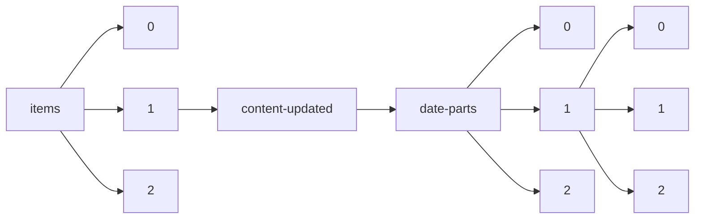

!!! warning "This document is not official Crossref documentation"
# Elements
PATH = items/array/content-updated/date-parts/array/array(1)  
Occurs 751 974 times  
Unique values: 67  
{ .annotate }

1. A route to an element, for example:  
   The route "items/array/content-updated/date-parts/array/array" corresponds to navigating through the JSON indices as  
   ["items"][0]["content-updated"]["date-parts"][0][0]  

| **Row** | **Value** `Int64` | **Count** `Int64` |
|--------:|---------------------:|---------------------:|
| **1**   | 11                   | 152 497              |
| **2**   | 2 022                | 114 336              |
| **3**   | 2                    | 42 377               |
| **4**   | 2 019                | 37 959               |
| **5**   | 8                    | 34 638               |
| **6**   | 9                    | 23 226               |
| **7**   | 2 020                | 22 517               |
| **8**   | 3                    | 18 260               |
| **9**   | 6                    | 18 242               |
| **10**  | 12                   | 18 233               |
| **11**  | 1                    | 17 181               |
| **12**  | 10                   | 17 010               |
| **13**  | 7                    | 16 303               |
| **14**  | 4                    | 15 863               |
| **15**  | 2 018                | 14 007               |
| **16**  | 2 016                | 13 144               |
| **17**  | 5                    | 12 019               |
| **18**  | 2 017                | 11 870               |
| **19**  | 2 021                | 11 008               |
| **20**  | 2 015                | 10 454               |
| **21**  | 13                   | 9 703                |
| **22**  | 16                   | 8 634                |
| **23**  | 2 010                | 8 227                |
| **24**  | 2 009                | 6 830                |
| **25**  | 26                   | 6 556                |
| **26**  | 20                   | 5 909                |
| **27**  | 2 008                | 5 503                |
| **28**  | 18                   | 5 055                |
| **29**  | 25                   | 5 049                |
| **30**  | 14                   | 4 717                |
| **31**  | 2 011                | 4 450                |
| **32**  | 28                   | 4 056                |
| **33**  | 24                   | 3 958                |
| **34**  | 17                   | 3 878                |
| **35**  | 19                   | 3 872                |
| **36**  | 23                   | 3 786                |
| **37**  | 21                   | 3 725                |
| **38**  | 2 013                | 3 389                |
| **39**  | 30                   | 3 382                |
| **40**  | 29                   | 3 102                |
| **41**  | 2 006                | 3 088                |
| **42**  | 22                   | 3 019                |
| **43**  | 27                   | 2 957                |
| **44**  | 15                   | 2 832                |
| **45**  | 2 014                | 2 566                |
| **46**  | 1 992                | 2 446                |
| **47**  | 2 012                | 2 237                |
| **48**  | 2 023                | 1 317                |
| **49**  | 2 005                | 1 282                |
| **50**  | 2 007                | 935                  |
| **51**  | 31                   | 907                  |
| **52**  | 1 996                | 401                  |
| **53**  | 1 999                | 398                  |
| **54**  | 2 000                | 361                  |
| **55**  | 1 998                | 358                  |
| **56**  | 2 002                | 319                  |
| **57**  | 2 001                | 291                  |
| **58**  | 2 003                | 263                  |
| **59**  | 2 004                | 244                  |
| **60**  | 1 995                | 224                  |
| **61**  | 1 993                | 223                  |
| **62**  | 1 997                | 219                  |
| **63**  | 1 994                | 155                  |
| **64**  | 1 988                | 3                    |
| **65**  | 1 990                | 2                    |
| **66**  | 1 986                | 1                    |
| **67**  | 1 970                | 1                    |

