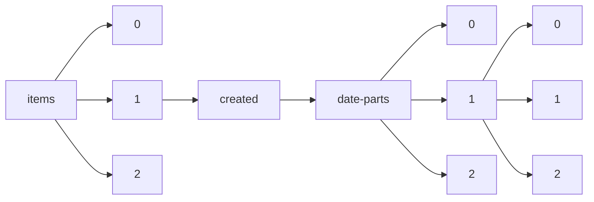

!!! warning "This document is not official Crossref documentation"
# Elements
PATH = items/array/created/date-parts/array/array(1)  
Occurs 430 500 717 times  
Unique values: 53  
{ .annotate }

1. A route to an element, for example:  
   The route "items/array/created/date-parts/array/array" corresponds to navigating through the JSON indices as  
   ["items"][0]["created"]["date-parts"][0][0]  

| **Row** | **Value** `Int64` | **Count** `Int64` |
|--------:|---------------------:|---------------------:|
| **1**   | 7                    | 19 658 236           |
| **2**   | 11                   | 17 854 014           |
| **3**   | 3                    | 17 217 716           |
| **4**   | 12                   | 16 822 596           |
| **5**   | 10                   | 16 690 222           |
| **6**   | 4                    | 16 370 333           |
| **7**   | 1                    | 15 923 951           |
| **8**   | 6                    | 15 800 940           |
| **9**   | 2                    | 15 664 433           |
| **10**  | 8                    | 15 592 952           |
| **11**  | 9                    | 15 554 983           |
| **12**  | 5                    | 15 385 036           |
| **13**  | 2 021                | 10 503 426           |
| **14**  | 2 022                | 10 271 179           |
| **15**  | 2 020                | 10 241 400           |
| **16**  | 2 019                | 8 776 563            |
| **17**  | 2 017                | 8 350 609            |
| **18**  | 2 018                | 8 264 448            |
| **19**  | 2 016                | 7 521 887            |
| **20**  | 2 013                | 7 026 522            |
| **21**  | 2 011                | 6 607 499            |
| **22**  | 2 014                | 6 590 665            |
| **23**  | 2 015                | 6 547 658            |
| **24**  | 25                   | 6 234 982            |
| **25**  | 2 012                | 6 064 180            |
| **26**  | 2 002                | 5 777 886            |
| **27**  | 2 006                | 5 708 576            |
| **28**  | 2 007                | 5 641 789            |
| **29**  | 2 010                | 5 280 551            |
| **30**  | 26                   | 5 209 287            |
| **31**  | 24                   | 5 015 583            |
| **32**  | 20                   | 4 979 989            |
| **33**  | 17                   | 4 912 780            |
| **34**  | 27                   | 4 870 496            |
| **35**  | 18                   | 4 857 344            |
| **36**  | 2 009                | 4 744 431            |
| **37**  | 22                   | 4 714 926            |
| **38**  | 2 008                | 4 697 788            |
| **39**  | 19                   | 4 633 407            |
| **40**  | 23                   | 4 618 256            |
| **41**  | 28                   | 4 616 912            |
| **42**  | 16                   | 4 612 191            |
| **43**  | 14                   | 4 566 456            |
| **44**  | 21                   | 4 557 482            |
| **45**  | 15                   | 4 523 925            |
| **46**  | 2 005                | 4 507 827            |
| **47**  | 13                   | 4 425 898            |
| **48**  | 30                   | 4 336 216            |
| **49**  | 29                   | 4 206 392            |
| **50**  | 2 003                | 3 927 142            |
| **51**  | 2 004                | 3 888 249            |
| **52**  | 31                   | 2 572 544            |
| **53**  | 2 023                | 2 559 964            |

