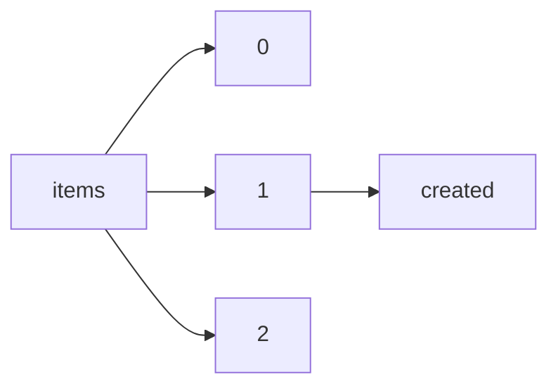

!!! warning "This document is not official Crossref documentation"
# Created
PATH = items/array/created(1)  
Occurs 143 500 239 times  
{ .annotate }

1. A route to an element, for example:  
   The route "items/array/created" corresponds to navigating through the JSON indices as  
   ["items"][0]["created"]  

## Date-parts
See more information: [items/array/created/date-parts](date-parts/index.md)  
Occurs 143 500 239 timess  

| **Row** | **Length** `Any` | **Count** `Int64` |
|--------:|--------------------:|---------------------:|
| **1**   | 1                   | 143 500 239          |

## Date-time
See more information: [items/array/created/date-time](date-time/index.md)  
Occurs 143 500 239 timess  
Unique values: > 999  

!!! note "Due to current limitations, only the first 1,000 unique values are counted."

| **Row** | **Value** `String` | **Count** `Int64` |
|--------:|----------------------:|---------------------:|
| **1**   | 2009-04-01T14:19:34Z  | 21 810               |
| **2**   | 2009-04-02T22:32:30Z  | 19 727               |
| **3**   | 2009-04-02T06:42:00Z  | 18 843               |
| **4**   | 2020-05-02T11:50:18Z  | 18 677               |
| **5**   | 2009-04-02T15:00:59Z  | 18 438               |
| **6**   | 2009-03-30T12:16:37Z  | 18 388               |
| **7**   | 2009-04-08T19:21:07Z  | 18 225               |
| **8**   | 2009-04-02T11:02:10Z  | 17 993               |
| **9**   | 2022-03-28T13:39:01Z  | 17 235               |
| **10**  | 2009-04-02T02:38:39Z  | 15 083               |
| ... | ... | ... |

## Timestamp
See more information: [items/array/created/timestamp](timestamp/index.md)  
Occurs 143 500 239 timess  
Unique values: > 999  

!!! note "Due to current limitations, only the first 1,000 unique values are counted."

| **Row** | **Value** `Int64` | **Count** `Int64` |
|--------:|---------------------:|---------------------:|
| **1**   | 1 238 595 574 000    | 21 810               |
| **2**   | 1 238 711 550 000    | 19 727               |
| **3**   | 1 238 654 520 000    | 18 843               |
| **4**   | 1 588 420 218 000    | 18 677               |
| **5**   | 1 238 684 459 000    | 18 438               |
| **6**   | 1 238 415 397 000    | 18 388               |
| **7**   | 1 239 218 467 000    | 18 225               |
| **8**   | 1 238 670 130 000    | 17 993               |
| **9**   | 1 648 474 741 000    | 17 235               |
| **10**  | 1 238 639 919 000    | 15 083               |
| ... | ... | ... |

