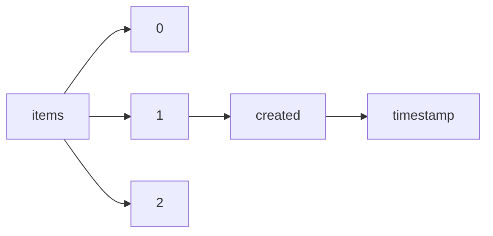

!!! warning "This document is not official Crossref documentation"
# Timestamp
PATH = items/array/created/timestamp(1)  
Occurs 143 500 239 times  
Unique values: > 999  
{ .annotate }

1. A route to an element, for example:  
   The route "items/array/created/timestamp" corresponds to navigating through the JSON indices as  
   ["items"][0]["created"]["timestamp"]  

!!! note "Due to current limitations, only the first 1,000 unique values are counted."

| **Row** | **Value** `Int64` | **Count** `Int64` |
|--------:|---------------------:|---------------------:|
| **1**   | 1 238 595 574 000    | 21 810               |
| **2**   | 1 238 711 550 000    | 19 727               |
| **3**   | 1 238 654 520 000    | 18 843               |
| **4**   | 1 588 420 218 000    | 18 677               |
| **5**   | 1 238 684 459 000    | 18 438               |
| **6**   | 1 238 415 397 000    | 18 388               |
| **7**   | 1 239 218 467 000    | 18 225               |
| **8**   | 1 238 670 130 000    | 17 993               |
| **9**   | 1 648 474 741 000    | 17 235               |
| **10**  | 1 238 639 919 000    | 15 083               |
| **11**  | 1 238 699 995 000    | 14 771               |
| **12**  | 1 359 157 882 000    | 14 618               |
| **13**  | 1 174 326 529 000    | 14 435               |
| **14**  | 1 238 628 782 000    | 14 277               |
| **15**  | 1 238 615 594 000    | 14 108               |
| **16**  | 1 190 152 399 000    | 13 431               |
| **17**  | 1 238 141 961 000    | 13 074               |
| **18**  | 1 095 156 596 000    | 12 803               |
| **19**  | 1 206 398 595 000    | 12 503               |
| **20**  | 1 238 439 679 000    | 12 409               |
| **21**  | 1 238 461 747 000    | 12 117               |
| **22**  | 1 169 058 722 000    | 11 831               |
| **23**  | 1 558 518 715 000    | 11 819               |
| **24**  | 1 567 500 720 000    | 11 787               |
| **25**  | 1 266 591 242 000    | 11 641               |
| **26**  | 1 552 581 699 000    | 11 526               |
| **27**  | 1 173 113 776 000    | 11 468               |
| **28**  | 1 238 424 037 000    | 11 429               |
| **29**  | 1 238 472 566 000    | 11 397               |
| **30**  | 1 283 449 095 000    | 11 343               |
| **31**  | 1 648 681 938 000    | 11 184               |
| **32**  | 1 290 996 896 000    | 10 945               |
| **33**  | 1 238 450 787 000    | 10 729               |
| **34**  | 1 243 624 532 000    | 10 689               |
| **35**  | 1 650 234 219 000    | 10 679               |
| **36**  | 1 629 910 371 000    | 10 629               |
| **37**  | 1 238 137 439 000    | 10 340               |
| **38**  | 1 181 364 646 000    | 10 263               |
| **39**  | 1 272 825 819 000    | 10 081               |
| **40**  | 1 030 215 651 000    | 9 998                |
| **41**  | 1 030 214 794 000    | 9 996                |
| **42**  | 1 030 216 592 000    | 9 996                |
| **43**  | 1 030 219 239 000    | 9 994                |
| **44**  | 1 030 220 797 000    | 9 991                |
| **45**  | 1 030 221 630 000    | 9 990                |
| **46**  | 1 030 230 551 000    | 9 990                |
| **47**  | 1 030 217 463 000    | 9 986                |
| **48**  | 1 030 229 692 000    | 9 983                |
| **49**  | 1 030 213 043 000    | 9 982                |
| **50**  | 1 030 211 862 000    | 9 981                |
| **51**  | 1 030 213 936 000    | 9 978                |
| **52**  | 1 030 218 359 000    | 9 966                |
| **53**  | 1 238 425 148 000    | 9 902                |
| **54**  | 1 030 222 489 000    | 9 894                |
| **55**  | 1 030 269 741 000    | 9 870                |
| **56**  | 1 030 268 662 000    | 9 840                |
| **57**  | 1 290 705 172 000    | 9 804                |
| **58**  | 1 030 271 875 000    | 9 654                |
| **59**  | 1 030 270 804 000    | 9 622                |
| **60**  | 1 030 242 954 000    | 9 590                |
| **61**  | 1 030 228 825 000    | 9 553                |
| **62**  | 1 082 395 123 000    | 9 538                |
| **63**  | 1 335 324 905 000    | 9 530                |
| **64**  | 1 190 151 691 000    | 9 479                |
| **65**  | 1 622 144 076 000    | 9 470                |
| **66**  | 1 622 142 634 000    | 9 468                |
| **67**  | 1 650 237 397 000    | 9 395                |
| **68**  | 1 650 235 785 000    | 9 350                |
| **69**  | 1 102 609 237 000    | 9 346                |
| **70**  | 1 335 333 515 000    | 9 090                |
| **71**  | 1 114 114 931 000    | 9 062                |
| **72**  | 1 238 126 066 000    | 9 042                |
| **73**  | 1 614 632 171 000    | 9 024                |
| **74**  | 1 644 813 962 000    | 8 727                |
| **75**  | 1 190 151 960 000    | 8 709                |
| **76**  | 1 030 227 975 000    | 8 625                |
| **77**  | 1 648 680 354 000    | 8 565                |
| **78**  | 1 639 570 616 000    | 8 510                |
| **79**  | 1 258 395 811 000    | 8 478                |
| **80**  | 1 238 151 155 000    | 8 350                |
| **81**  | 1 030 220 085 000    | 8 334                |
| **82**  | 1 622 143 827 000    | 8 324                |
| **83**  | 1 030 244 285 000    | 8 129                |
| **84**  | 1 098 896 053 000    | 8 076                |
| **85**  | 1 359 157 981 000    | 8 055                |
| **86**  | 1 622 143 882 000    | 8 000                |
| **87**  | 1 629 123 511 000    | 7 956                |
| **88**  | 1 030 245 759 000    | 7 900                |
| **89**  | 1 506 953 835 000    | 7 888                |
| **90**  | 1 506 947 412 000    | 7 885                |
| **91**  | 1 594 904 052 000    | 7 843                |
| **92**  | 1 322 558 126 000    | 7 822                |
| **93**  | 1 322 557 411 000    | 7 820                |
| **94**  | 1 322 609 800 000    | 7 805                |
| **95**  | 1 217 911 207 000    | 7 773                |
| **96**  | 1 622 144 259 000    | 7 740                |
| **97**  | 1 322 604 728 000    | 7 728                |
| **98**  | 1 651 070 737 000    | 7 709                |
| **99**  | 1 604 923 455 000    | 7 627                |
| **100** | 1 649 453 897 000    | 7 577                |
| **101** | 1 650 227 327 000    | 7 530                |
| **102** | 1 594 986 902 000    | 7 495                |
| **103** | 1 429 101 765 000    | 7 436                |
| **104** | 1 217 288 986 000    | 7 378                |
| **105** | 1 173 135 087 000    | 7 373                |
| **106** | 1 650 227 750 000    | 7 317                |
| **107** | 1 650 227 561 000    | 7 314                |
| **108** | 1 622 657 491 000    | 7 282                |
| **109** | 1 650 225 315 000    | 7 270                |
| **110** | 1 298 314 260 000    | 7 225                |
| **111** | 1 650 227 091 000    | 7 160                |
| **112** | 1 294 260 437 000    | 7 136                |
| **113** | 1 322 602 799 000    | 7 080                |
| **114** | 1 502 370 398 000    | 7 054                |
| **115** | 1 322 544 827 000    | 7 032                |
| **116** | 1 407 228 017 000    | 6 952                |
| **117** | 1 650 224 881 000    | 6 914                |
| **118** | 1 594 907 948 000    | 6 872                |
| **119** | 1 359 400 016 000    | 6 857                |
| **120** | 1 594 904 016 000    | 6 848                |
| **121** | 1 429 718 310 000    | 6 820                |
| **122** | 1 322 545 136 000    | 6 819                |
| **123** | 1 171 421 561 000    | 6 767                |
| **124** | 1 359 405 496 000    | 6 751                |
| **125** | 1 436 543 214 000    | 6 740                |
| **126** | 1 359 405 478 000    | 6 717                |
| **127** | 1 322 602 995 000    | 6 661                |
| **128** | 1 238 124 790 000    | 6 649                |
| **129** | 1 567 486 320 000    | 6 632                |
| **130** | 1 359 405 866 000    | 6 595                |
| **131** | 1 359 405 312 000    | 6 588                |
| **132** | 1 359 405 900 000    | 6 566                |
| **133** | 1 359 414 295 000    | 6 517                |
| **134** | 1 359 405 561 000    | 6 511                |
| **135** | 1 359 405 086 000    | 6 508                |
| **136** | 1 190 136 999 000    | 6 469                |
| **137** | 1 359 413 894 000    | 6 462                |
| **138** | 1 220 573 385 000    | 6 420                |
| **139** | 1 650 237 399 000    | 6 368                |
| **140** | 1 238 117 780 000    | 6 335                |
| **141** | 1 515 168 501 000    | 6 295                |
| **142** | 1 030 247 170 000    | 6 255                |
| **143** | 1 359 414 607 000    | 6 248                |
| **144** | 1 359 412 362 000    | 6 247                |
| **145** | 1 359 412 475 000    | 6 205                |
| **146** | 1 359 147 500 000    | 6 188                |
| **147** | 1 429 196 231 000    | 6 178                |
| **148** | 1 174 191 869 000    | 6 137                |
| **149** | 1 173 207 862 000    | 6 126                |
| **150** | 1 374 786 568 000    | 6 107                |
| **151** | 1 322 544 637 000    | 6 085                |
| **152** | 1 574 283 156 000    | 6 079                |
| **153** | 1 030 261 645 000    | 6 037                |
| **154** | 1 308 341 283 000    | 5 993                |
| **155** | 1 030 253 979 000    | 5 979                |
| **156** | 1 175 913 291 000    | 5 964                |
| **157** | 1 558 518 698 000    | 5 940                |
| **158** | 1 243 977 056 000    | 5 907                |
| **159** | 1 504 830 846 000    | 5 855                |
| **160** | 1 131 991 707 000    | 5 828                |
| **161** | 1 660 572 742 000    | 5 811                |
| **162** | 1 322 544 193 000    | 5 780                |
| **163** | 1 226 156 282 000    | 5 666                |
| **164** | 1 660 588 296 000    | 5 597                |
| **165** | 1 660 594 199 000    | 5 590                |
| **166** | 1 322 580 004 000    | 5 576                |
| **167** | 1 030 265 568 000    | 5 568                |
| **168** | 1 660 572 659 000    | 5 543                |
| **169** | 1 030 263 584 000    | 5 526                |
| **170** | 1 660 585 671 000    | 5 497                |
| **171** | 1 206 994 497 000    | 5 462                |
| **172** | 1 030 267 539 000    | 5 421                |
| **173** | 1 238 117 622 000    | 5 392                |
| **174** | 1 030 264 587 000    | 5 382                |
| **175** | 1 660 598 549 000    | 5 377                |
| **176** | 1 660 599 422 000    | 5 359                |
| **177** | 1 660 600 209 000    | 5 333                |
| **178** | 1 543 529 025 000    | 5 333                |
| **179** | 1 500 284 174 000    | 5 332                |
| **180** | 1 149 767 369 000    | 5 327                |
| **181** | 1 030 266 563 000    | 5 322                |
| **182** | 1 622 655 754 000    | 5 318                |
| **183** | 1 648 671 980 000    | 5 308                |
| **184** | 1 047 986 094 000    | 5 300                |
| **185** | 1 030 260 630 000    | 5 285                |
| **186** | 1 173 582 648 000    | 5 244                |
| **187** | 1 124 893 171 000    | 5 227                |
| **188** | 1 429 178 514 000    | 5 172                |
| **189** | 1 556 540 220 000    | 5 158                |
| **190** | 1 030 262 606 000    | 5 110                |
| **191** | 1 660 580 425 000    | 5 079                |
| **192** | 1 323 902 645 000    | 5 078                |
| **193** | 1 631 553 990 000    | 5 055                |
| **194** | 1 660 629 446 000    | 5 048                |
| **195** | 1 660 561 098 000    | 5 036                |
| **196** | 1 660 563 138 000    | 5 019                |
| **197** | 1 083 198 558 000    | 5 000                |
| **198** | 1 083 011 791 000    | 5 000                |
| **199** | 1 083 357 985 000    | 4 976                |
| **200** | 1 635 158 012 000    | 4 969                |
| **201** | 1 660 564 050 000    | 4 948                |
| **202** | 1 660 584 454 000    | 4 945                |
| **203** | 1 083 198 539 000    | 4 937                |
| **204** | 1 206 508 070 000    | 4 925                |
| **205** | 1 429 200 224 000    | 4 922                |
| **206** | 1 149 771 913 000    | 4 920                |
| **207** | 1 660 563 687 000    | 4 903                |
| **208** | 1 646 837 921 000    | 4 883                |
| **209** | 1 660 569 478 000    | 4 851                |
| **210** | 1 171 421 439 000    | 4 838                |
| **211** | 1 083 113 021 000    | 4 819                |
| **212** | 1 322 545 597 000    | 4 805                |
| **213** | 1 226 151 952 000    | 4 770                |
| **214** | 1 173 596 119 000    | 4 726                |
| **215** | 1 200 095 909 000    | 4 714                |
| **216** | 1 200 096 228 000    | 4 698                |
| **217** | 1 660 563 875 000    | 4 665                |
| **218** | 1 640 597 534 000    | 4 660                |
| **219** | 1 359 139 882 000    | 4 638                |
| **220** | 1 660 573 075 000    | 4 632                |
| **221** | 1 375 283 087 000    | 4 620                |
| **222** | 1 416 353 327 000    | 4 596                |
| **223** | 1 506 933 012 000    | 4 551                |
| **224** | 1 429 520 893 000    | 4 543                |
| **225** | 1 088 063 770 000    | 4 536                |
| **226** | 1 168 996 556 000    | 4 532                |
| **227** | 1 124 937 358 000    | 4 531                |
| **228** | 1 506 939 435 000    | 4 528                |
| **229** | 1 322 591 800 000    | 4 512                |
| **230** | 1 124 940 214 000    | 4 502                |
| **231** | 1 322 586 728 000    | 4 495                |
| **232** | 1 454 141 930 000    | 4 488                |
| **233** | 1 322 540 126 000    | 4 487                |
| **234** | 1 322 539 411 000    | 4 484                |
| **235** | 1 660 587 836 000    | 4 457                |
| **236** | 1 657 120 560 000    | 4 454                |
| **237** | 1 648 569 854 000    | 4 437                |
| **238** | 1 083 184 965 000    | 4 432                |
| **239** | 1 083 073 494 000    | 4 428                |
| **240** | 1 083 090 424 000    | 4 394                |
| **241** | 1 083 070 030 000    | 4 388                |
| **242** | 1 083 097 362 000    | 4 378                |
| **243** | 1 083 095 244 000    | 4 377                |
| **244** | 1 569 571 469 000    | 4 373                |
| **245** | 1 251 470 130 000    | 4 372                |
| **246** | 1 424 888 790 000    | 4 356                |
| **247** | 1 083 071 183 000    | 4 354                |
| **248** | 1 047 971 925 000    | 4 292                |
| **249** | 1 663 685 486 000    | 4 289                |
| **250** | 1 090 449 816 000    | 4 286                |
| **251** | 1 124 918 133 000    | 4 285                |
| **252** | 1 416 463 368 000    | 4 274                |
| **253** | 1 079 765 752 000    | 4 272                |
| **254** | 1 361 565 520 000    | 4 207                |
| **255** | 1 158 944 473 000    | 4 177                |
| **256** | 1 661 268 789 000    | 4 175                |
| **257** | 1 149 722 721 000    | 4 171                |
| **258** | 1 608 231 566 000    | 4 171                |
| **259** | 1 303 425 368 000    | 4 154                |
| **260** | 1 183 060 947 000    | 4 144                |
| **261** | 1 226 351 800 000    | 4 142                |
| **262** | 1 149 760 824 000    | 4 132                |
| **263** | 1 124 894 874 000    | 4 085                |
| **264** | 1 194 459 926 000    | 4 054                |
| **265** | 1 645 591 636 000    | 4 049                |
| **266** | 1 217 896 807 000    | 4 046                |
| **267** | 1 660 644 645 000    | 4 020                |
| **268** | 1 064 320 441 000    | 4 015                |
| **269** | 1 047 978 673 000    | 4 015                |
| **270** | 1 660 618 275 000    | 4 014                |
| **271** | 1 407 249 458 000    | 4 012                |
| **272** | 1 453 377 852 000    | 4 005                |
| **273** | 1 036 698 064 000    | 3 992                |
| **274** | 1 660 641 937 000    | 3 980                |
| **275** | 1 083 360 188 000    | 3 970                |
| **276** | 1 660 556 675 000    | 3 938                |
| **277** | 1 660 571 879 000    | 3 927                |
| **278** | 1 502 355 998 000    | 3 924                |
| **279** | 1 660 556 315 000    | 3 921                |
| **280** | 1 429 087 365 000    | 3 907                |
| **281** | 1 407 249 620 000    | 3 906                |
| **282** | 1 427 242 787 000    | 3 905                |
| **283** | 1 047 956 132 000    | 3 902                |
| **284** | 1 488 548 476 000    | 3 893                |
| **285** | 1 394 716 675 000    | 3 842                |
| **286** | 1 531 162 503 000    | 3 841                |
| **287** | 1 322 584 799 000    | 3 839                |
| **288** | 1 047 949 512 000    | 3 822                |
| **289** | 1 630 304 009 000    | 3 817                |
| **290** | 1 078 194 410 000    | 3 794                |
| **291** | 1 055 344 326 000    | 3 786                |
| **292** | 1 564 692 097 000    | 3 783                |
| **293** | 1 568 027 676 000    | 3 775                |
| **294** | 1 149 765 755 000    | 3 773                |
| **295** | 1 149 759 405 000    | 3 770                |
| **296** | 1 077 746 202 000    | 3 760                |
| **297** | 1 338 442 276 000    | 3 758                |
| **298** | 1 660 555 660 000    | 3 751                |
| **299** | 1 158 754 558 000    | 3 749                |
| **300** | 1 405 416 039 000    | 3 722                |
| **301** | 1 629 708 657 000    | 3 701                |
| **302** | 1 614 710 639 000    | 3 700                |
| **303** | 1 596 054 751 000    | 3 699                |
| **304** | 1 660 553 098 000    | 3 685                |
| **305** | 1 129 387 713 000    | 3 675                |
| **306** | 1 574 351 942 000    | 3 672                |
| **307** | 1 490 779 866 000    | 3 657                |
| **308** | 1 149 716 801 000    | 3 652                |
| **309** | 1 322 546 280 000    | 3 649                |
| **310** | 1 181 350 246 000    | 3 643                |
| **311** | 1 663 959 578 000    | 3 641                |
| **312** | 1 585 047 426 000    | 3 610                |
| **313** | 1 660 554 206 000    | 3 609                |
| **314** | 1 452 243 442 000    | 3 598                |
| **315** | 1 030 255 069 000    | 3 590                |
| **316** | 1 039 834 582 000    | 3 581                |
| **317** | 1 488 548 515 000    | 3 569                |
| **318** | 1 555 593 531 000    | 3 563                |
| **319** | 1 495 724 237 000    | 3 552                |
| **320** | 1 217 911 193 000    | 3 551                |
| **321** | 1 490 770 907 000    | 3 549                |
| **322** | 1 171 421 199 000    | 3 529                |
| **323** | 1 229 138 579 000    | 3 527                |
| **324** | 1 664 202 126 000    | 3 522                |
| **325** | 1 154 563 831 000    | 3 508                |
| **326** | 1 311 662 332 000    | 3 506                |
| **327** | 1 045 062 744 000    | 3 502                |
| **328** | 1 084 575 899 000    | 3 497                |
| **329** | 1 573 234 383 000    | 3 483                |
| **330** | 1 660 522 127 000    | 3 466                |
| **331** | 1 495 783 920 000    | 3 464                |
| **332** | 1 660 544 153 000    | 3 458                |
| **333** | 1 149 850 219 000    | 3 410                |
| **334** | 1 349 123 803 000    | 3 365                |
| **335** | 1 086 877 185 000    | 3 359                |
| **336** | 1 322 526 827 000    | 3 356                |
| **337** | 1 634 229 632 000    | 3 336                |
| **338** | 1 111 607 993 000    | 3 330                |
| **339** | 1 149 846 796 000    | 3 304                |
| **340** | 1 146 607 567 000    | 3 294                |
| **341** | 1 251 470 146 000    | 3 291                |
| **342** | 1 146 475 788 000    | 3 286                |
| **343** | 1 647 611 293 000    | 3 280                |
| **344** | 1 206 811 423 000    | 3 279                |
| **345** | 1 047 063 496 000    | 3 277                |
| **346** | 1 137 627 774 000    | 3 276                |
| **347** | 1 322 527 136 000    | 3 273                |
| **348** | 1 428 353 695 000    | 3 259                |
| **349** | 1 173 598 686 000    | 3 258                |
| **350** | 1 614 381 505 000    | 3 248                |
| **351** | 1 627 330 898 000    | 3 246                |
| **352** | 1 322 543 365 000    | 3 246                |
| **353** | 1 149 723 846 000    | 3 235                |
| **354** | 1 660 544 212 000    | 3 232                |
| **355** | 1 087 936 063 000    | 3 224                |
| **356** | 1 160 070 358 000    | 3 207                |
| **357** | 1 554 828 969 000    | 3 205                |
| **358** | 1 519 745 491 000    | 3 204                |
| **359** | 1 111 607 728 000    | 3 183                |
| **360** | 1 648 666 129 000    | 3 181                |
| **361** | 1 229 633 455 000    | 3 167                |
| **362** | 1 044 998 258 000    | 3 164                |
| **363** | 1 434 018 318 000    | 3 164                |
| **364** | 1 660 601 408 000    | 3 160                |
| **365** | 1 090 338 938 000    | 3 158                |
| **366** | 1 326 839 408 000    | 3 148                |
| **367** | 1 660 522 066 000    | 3 138                |
| **368** | 1 219 939 765 000    | 3 129                |
| **369** | 1 663 959 403 000    | 3 129                |
| **370** | 1 194 458 037 000    | 3 122                |
| **371** | 1 596 439 564 000    | 3 118                |
| **372** | 1 310 759 330 000    | 3 113                |
| **373** | 1 074 918 783 000    | 3 105                |
| **374** | 1 172 952 269 000    | 3 091                |
| **375** | 1 326 839 331 000    | 3 088                |
| **376** | 1 153 759 981 000    | 3 085                |
| **377** | 1 660 522 091 000    | 3 083                |
| **378** | 1 047 938 133 000    | 3 069                |
| **379** | 1 079 966 068 000    | 3 068                |
| **380** | 1 111 607 687 000    | 3 067                |
| **381** | 1 316 352 678 000    | 3 047                |
| **382** | 1 427 307 436 000    | 3 041                |
| **383** | 1 159 912 739 000    | 3 035                |
| **384** | 1 206 507 676 000    | 3 026                |
| **385** | 1 175 898 891 000    | 3 020                |
| **386** | 1 530 111 652 000    | 3 020                |
| **387** | 1 136 472 758 000    | 3 015                |
| **388** | 1 407 188 649 000    | 3 007                |
| **389** | 1 247 679 729 000    | 2 975                |
| **390** | 1 395 646 893 000    | 2 953                |
| **391** | 1 660 646 511 000    | 2 946                |
| **392** | 1 648 475 010 000    | 2 944                |
| **393** | 1 216 752 672 000    | 2 942                |
| **394** | 1 304 963 312 000    | 2 941                |
| **395** | 1 216 744 588 000    | 2 941                |
| **396** | 1 216 741 002 000    | 2 937                |
| **397** | 1 322 584 995 000    | 2 931                |
| **398** | 1 216 737 372 000    | 2 927                |
| **399** | 1 291 045 396 000    | 2 922                |
| **400** | 1 124 937 809 000    | 2 907                |
| **401** | 1 089 317 144 000    | 2 901                |
| **402** | 1 418 176 850 000    | 2 893                |
| **403** | 1 089 317 182 000    | 2 884                |
| **404** | 1 660 549 000 000    | 2 881                |
| **405** | 1 123 057 907 000    | 2 880                |
| **406** | 1 149 716 530 000    | 2 879                |
| **407** | 1 125 319 631 000    | 2 876                |
| **408** | 1 428 353 871 000    | 2 873                |
| **409** | 1 408 561 493 000    | 2 871                |
| **410** | 1 088 024 450 000    | 2 870                |
| **411** | 1 165 351 716 000    | 2 846                |
| **412** | 1 210 103 637 000    | 2 845                |
| **413** | 1 070 909 486 000    | 2 837                |
| **414** | 1 421 193 631 000    | 2 830                |
| **415** | 1 048 029 452 000    | 2 828                |
| **416** | 1 458 823 850 000    | 2 827                |
| **417** | 1 427 315 741 000    | 2 812                |
| **418** | 1 331 009 542 000    | 2 800                |
| **419** | 1 173 389 998 000    | 2 797                |
| **420** | 1 094 151 197 000    | 2 782                |
| **421** | 1 416 224 722 000    | 2 778                |
| **422** | 1 359 141 023 000    | 2 777                |
| **423** | 1 443 095 844 000    | 2 757                |
| **424** | 1 490 353 389 000    | 2 738                |
| **425** | 1 608 231 373 000    | 2 736                |
| **426** | 1 165 354 688 000    | 2 736                |
| **427** | 1 210 781 209 000    | 2 734                |
| **428** | 1 131 384 879 000    | 2 732                |
| **429** | 1 194 460 103 000    | 2 732                |
| **430** | 1 408 561 831 000    | 2 723                |
| **431** | 1 148 588 761 000    | 2 718                |
| **432** | 1 381 262 591 000    | 2 718                |
| **433** | 1 084 580 300 000    | 2 711                |
| **434** | 1 146 222 346 000    | 2 700                |
| **435** | 1 414 421 980 000    | 2 699                |
| **436** | 1 084 572 090 000    | 2 698                |
| **437** | 1 216 675 709 000    | 2 698                |
| **438** | 1 062 739 989 000    | 2 697                |
| **439** | 1 196 341 176 000    | 2 695                |
| **440** | 1 444 410 148 000    | 2 695                |
| **441** | 1 216 740 005 000    | 2 675                |
| **442** | 1 213 300 643 000    | 2 672                |
| **443** | 1 618 148 867 000    | 2 658                |
| **444** | 1 216 734 365 000    | 2 657                |
| **445** | 1 158 221 509 000    | 2 650                |
| **446** | 1 123 685 132 000    | 2 648                |
| **447** | 1 077 656 465 000    | 2 640                |
| **448** | 1 219 958 529 000    | 2 637                |
| **449** | 1 477 001 174 000    | 2 635                |
| **450** | 1 408 869 328 000    | 2 632                |
| **451** | 1 244 532 247 000    | 2 622                |
| **452** | 1 582 132 344 000    | 2 622                |
| **453** | 1 488 813 798 000    | 2 591                |
| **454** | 1 142 994 559 000    | 2 576                |
| **455** | 1 395 650 337 000    | 2 574                |
| **456** | 1 429 181 831 000    | 2 565                |
| **457** | 1 614 459 617 000    | 2 559                |
| **458** | 1 395 648 630 000    | 2 542                |
| **459** | 1 055 549 359 000    | 2 539                |
| **460** | 1 416 365 253 000    | 2 528                |
| **461** | 1 653 118 786 000    | 2 524                |
| **462** | 1 604 351 679 000    | 2 521                |
| **463** | 1 122 486 748 000    | 2 521                |
| **464** | 1 374 896 496 000    | 2 514                |
| **465** | 1 575 450 136 000    | 2 510                |
| **466** | 1 303 410 968 000    | 2 506                |
| **467** | 1 372 350 382 000    | 2 506                |
| **468** | 1 316 203 356 000    | 2 498                |
| **469** | 1 362 186 160 000    | 2 496                |
| **470** | 1 247 068 261 000    | 2 493                |
| **471** | 1 149 845 063 000    | 2 488                |
| **472** | 1 660 522 151 000    | 2 484                |
| **473** | 1 367 822 259 000    | 2 467                |
| **474** | 1 113 315 904 000    | 2 461                |
| **475** | 1 053 017 827 000    | 2 449                |
| **476** | 1 041 387 917 000    | 2 447                |
| **477** | 1 247 127 468 000    | 2 446                |
| **478** | 1 206 804 682 000    | 2 439                |
| **479** | 1 247 628 675 000    | 2 439                |
| **480** | 1 124 893 101 000    | 2 438                |
| **481** | 1 041 382 611 000    | 2 436                |
| **482** | 1 406 903 782 000    | 2 433                |
| **483** | 1 595 502 772 000    | 2 427                |
| **484** | 1 416 858 183 000    | 2 424                |
| **485** | 1 232 123 609 000    | 2 419                |
| **486** | 1 124 916 614 000    | 2 415                |
| **487** | 1 327 073 019 000    | 2 411                |
| **488** | 1 660 647 966 000    | 2 409                |
| **489** | 1 272 613 372 000    | 2 406                |
| **490** | 1 367 860 297 000    | 2 405                |
| **491** | 1 308 605 430 000    | 2 402                |
| **492** | 1 041 381 669 000    | 2 400                |
| **493** | 1 408 057 733 000    | 2 396                |
| **494** | 1 148 026 271 000    | 2 393                |
| **495** | 1 607 195 083 000    | 2 385                |
| **496** | 1 421 194 244 000    | 2 383                |
| **497** | 1 585 838 049 000    | 2 372                |
| **498** | 1 129 123 447 000    | 2 368                |
| **499** | 1 374 896 498 000    | 2 367                |
| **500** | 1 124 915 371 000    | 2 365                |
| **501** | 1 641 761 541 000    | 2 362                |
| **502** | 1 056 138 909 000    | 2 353                |
| **503** | 1 083 874 683 000    | 2 351                |
| **504** | 1 408 056 415 000    | 2 340                |
| **505** | 1 397 297 893 000    | 2 335                |
| **506** | 1 596 974 395 000    | 2 333                |
| **507** | 1 660 634 280 000    | 2 331                |
| **508** | 1 225 932 484 000    | 2 330                |
| **509** | 1 270 492 454 000    | 2 327                |
| **510** | 1 569 513 681 000    | 2 320                |
| **511** | 1 556 525 820 000    | 2 317                |
| **512** | 1 538 683 816 000    | 2 316                |
| **513** | 1 424 870 790 000    | 2 311                |
| **514** | 1 538 684 119 000    | 2 296                |
| **515** | 1 660 548 504 000    | 2 294                |
| **516** | 1 163 023 793 000    | 2 284                |
| **517** | 1 225 494 096 000    | 2 281                |
| **518** | 1 426 351 270 000    | 2 279                |
| **519** | 1 583 398 893 000    | 2 275                |
| **520** | 1 660 522 214 000    | 2 272                |
| **521** | 1 072 114 450 000    | 2 256                |
| **522** | 1 109 599 775 000    | 2 254                |
| **523** | 1 488 810 054 000    | 2 245                |
| **524** | 1 102 645 241 000    | 2 241                |
| **525** | 1 660 528 753 000    | 2 235                |
| **526** | 1 495 783 937 000    | 2 234                |
| **527** | 1 510 302 899 000    | 2 233                |
| **528** | 1 134 507 352 000    | 2 227                |
| **529** | 1 082 745 495 000    | 2 220                |
| **530** | 1 528 582 654 000    | 2 216                |
| **531** | 1 327 016 558 000    | 2 209                |
| **532** | 1 660 549 447 000    | 2 206                |
| **533** | 1 253 158 503 000    | 2 190                |
| **534** | 1 582 131 329 000    | 2 188                |
| **535** | 1 462 972 257 000    | 2 186                |
| **536** | 1 479 476 747 000    | 2 181                |
| **537** | 1 103 037 076 000    | 2 175                |
| **538** | 1 053 714 416 000    | 2 173                |
| **539** | 1 220 013 306 000    | 2 169                |
| **540** | 1 387 831 091 000    | 2 159                |
| **541** | 1 098 989 050 000    | 2 154                |
| **542** | 1 542 156 908 000    | 2 153                |
| **543** | 1 218 798 743 000    | 2 153                |
| **544** | 1 660 528 300 000    | 2 152                |
| **545** | 1 229 985 556 000    | 2 141                |
| **546** | 1 247 141 676 000    | 2 132                |
| **547** | 1 056 179 625 000    | 2 129                |
| **548** | 1 213 300 927 000    | 2 128                |
| **549** | 1 039 821 484 000    | 2 117                |
| **550** | 1 326 975 807 000    | 2 115                |
| **551** | 1 660 528 665 000    | 2 112                |
| **552** | 1 060 182 789 000    | 2 108                |
| **553** | 1 578 246 951 000    | 2 101                |
| **554** | 1 039 821 556 000    | 2 096                |
| **555** | 1 541 754 113 000    | 2 092                |
| **556** | 1 269 879 978 000    | 2 090                |
| **557** | 1 173 998 901 000    | 2 087                |
| **558** | 1 099 160 180 000    | 2 085                |
| **559** | 1 111 435 659 000    | 2 082                |
| **560** | 1 317 701 426 000    | 2 077                |
| **561** | 1 370 977 117 000    | 2 070                |
| **562** | 1 574 862 270 000    | 2 067                |
| **563** | 1 426 352 156 000    | 2 059                |
| **564** | 1 490 263 051 000    | 2 044                |
| **565** | 1 098 804 610 000    | 2 039                |
| **566** | 1 231 461 582 000    | 2 036                |
| **567** | 1 407 501 344 000    | 2 027                |
| **568** | 1 044 480 532 000    | 2 025                |
| **569** | 1 098 587 156 000    | 2 024                |
| **570** | 1 068 762 310 000    | 2 019                |
| **571** | 1 223 731 402 000    | 2 012                |
| **572** | 1 420 131 672 000    | 2 011                |
| **573** | 1 102 292 189 000    | 2 000                |
| **574** | 1 044 907 968 000    | 2 000                |
| **575** | 1 102 277 787 000    | 2 000                |
| **576** | 1 379 535 135 000    | 1 999                |
| **577** | 1 278 488 812 000    | 1 998                |
| **578** | 1 609 024 895 000    | 1 994                |
| **579** | 1 561 107 742 000    | 1 992                |
| **580** | 1 102 266 987 000    | 1 989                |
| **581** | 1 099 237 844 000    | 1 981                |
| **582** | 1 047 999 958 000    | 1 979                |
| **583** | 1 137 532 175 000    | 1 978                |
| **584** | 1 229 983 987 000    | 1 977                |
| **585** | 1 137 531 900 000    | 1 975                |
| **586** | 1 137 534 487 000    | 1 975                |
| **587** | 1 094 202 074 000    | 1 974                |
| **588** | 1 322 526 637 000    | 1 973                |
| **589** | 1 397 233 990 000    | 1 973                |
| **590** | 1 310 627 551 000    | 1 962                |
| **591** | 1 308 339 859 000    | 1 951                |
| **592** | 1 290 542 610 000    | 1 950                |
| **593** | 1 420 131 712 000    | 1 949                |
| **594** | 1 044 918 413 000    | 1 947                |
| **595** | 1 039 029 965 000    | 1 941                |
| **596** | 1 164 056 772 000    | 1 926                |
| **597** | 1 454 228 003 000    | 1 925                |
| **598** | 1 060 271 139 000    | 1 924                |
| **599** | 1 327 015 955 000    | 1 924                |
| **600** | 1 102 960 494 000    | 1 913                |
| **601** | 1 623 670 897 000    | 1 912                |
| **602** | 1 216 823 464 000    | 1 908                |
| **603** | 1 102 960 482 000    | 1 896                |
| **604** | 1 099 160 201 000    | 1 894                |
| **605** | 1 227 961 249 000    | 1 890                |
| **606** | 1 052 527 667 000    | 1 889                |
| **607** | 1 137 534 941 000    | 1 888                |
| **608** | 1 554 288 747 000    | 1 888                |
| **609** | 1 152 393 532 000    | 1 884                |
| **610** | 1 427 228 387 000    | 1 881                |
| **611** | 1 539 349 421 000    | 1 866                |
| **612** | 1 327 016 036 000    | 1 864                |
| **613** | 1 224 006 358 000    | 1 856                |
| **614** | 1 139 241 160 000    | 1 853                |
| **615** | 1 088 033 011 000    | 1 847                |
| **616** | 1 044 921 473 000    | 1 847                |
| **617** | 1 229 989 604 000    | 1 847                |
| **618** | 1 504 951 333 000    | 1 843                |
| **619** | 1 036 714 167 000    | 1 837                |
| **620** | 1 349 468 669 000    | 1 835                |
| **621** | 1 379 610 962 000    | 1 830                |
| **622** | 1 387 835 802 000    | 1 829                |
| **623** | 1 208 471 361 000    | 1 821                |
| **624** | 1 043 251 079 000    | 1 818                |
| **625** | 1 038 001 527 000    | 1 813                |
| **626** | 1 165 259 162 000    | 1 807                |
| **627** | 1 038 017 455 000    | 1 801                |
| **628** | 1 038 012 567 000    | 1 799                |
| **629** | 1 044 915 336 000    | 1 798                |
| **630** | 1 447 929 403 000    | 1 796                |
| **631** | 1 033 042 047 000    | 1 788                |
| **632** | 1 035 216 786 000    | 1 786                |
| **633** | 1 038 016 077 000    | 1 785                |
| **634** | 1 039 912 859 000    | 1 783                |
| **635** | 1 316 338 278 000    | 1 782                |
| **636** | 1 038 022 347 000    | 1 780                |
| **637** | 1 650 364 788 000    | 1 778                |
| **638** | 1 181 078 146 000    | 1 776                |
| **639** | 1 112 293 611 000    | 1 773                |
| **640** | 1 420 739 044 000    | 1 772                |
| **641** | 1 416 829 429 000    | 1 767                |
| **642** | 1 517 654 316 000    | 1 767                |
| **643** | 1 043 246 646 000    | 1 766                |
| **644** | 1 039 549 990 000    | 1 764                |
| **645** | 1 388 001 660 000    | 1 764                |
| **646** | 1 035 743 965 000    | 1 761                |
| **647** | 1 392 840 494 000    | 1 757                |
| **648** | 1 036 717 597 000    | 1 755                |
| **649** | 1 090 477 570 000    | 1 752                |
| **650** | 1 408 871 856 000    | 1 752                |
| **651** | 1 041 966 912 000    | 1 746                |
| **652** | 1 038 025 865 000    | 1 745                |
| **653** | 1 038 011 186 000    | 1 739                |
| **654** | 1 093 661 568 000    | 1 739                |
| **655** | 1 036 720 992 000    | 1 730                |
| **656** | 1 186 416 265 000    | 1 729                |
| **657** | 1 216 674 994 000    | 1 726                |
| **658** | 1 036 719 169 000    | 1 726                |
| **659** | 1 314 564 944 000    | 1 723                |
| **660** | 1 113 937 535 000    | 1 723                |
| **661** | 1 098 372 536 000    | 1 722                |
| **662** | 1 038 020 989 000    | 1 722                |
| **663** | 1 590 270 526 000    | 1 719                |
| **664** | 1 089 302 782 000    | 1 717                |
| **665** | 1 102 689 206 000    | 1 716                |
| **666** | 1 306 933 270 000    | 1 711                |
| **667** | 1 036 715 707 000    | 1 711                |
| **668** | 1 039 913 966 000    | 1 702                |
| **669** | 1 087 387 037 000    | 1 702                |
| **670** | 1 096 124 856 000    | 1 699                |
| **671** | 1 041 879 909 000    | 1 694                |
| **672** | 1 041 879 784 000    | 1 694                |
| **673** | 1 047 942 885 000    | 1 693                |
| **674** | 1 038 446 889 000    | 1 692                |
| **675** | 1 094 046 404 000    | 1 690                |
| **676** | 1 455 851 731 000    | 1 688                |
| **677** | 1 298 835 463 000    | 1 687                |
| **678** | 1 380 882 691 000    | 1 687                |
| **679** | 1 176 587 524 000    | 1 684                |
| **680** | 1 041 884 738 000    | 1 684                |
| **681** | 1 043 255 320 000    | 1 682                |
| **682** | 1 297 956 809 000    | 1 681                |
| **683** | 1 055 329 926 000    | 1 679                |
| **684** | 1 625 474 927 000    | 1 674                |
| **685** | 1 348 293 141 000    | 1 669                |
| **686** | 1 379 535 137 000    | 1 668                |
| **687** | 1 041 967 671 000    | 1 667                |
| **688** | 1 041 884 538 000    | 1 660                |
| **689** | 1 165 028 167 000    | 1 660                |
| **690** | 1 038 444 059 000    | 1 655                |
| **691** | 1 418 922 350 000    | 1 655                |
| **692** | 1 106 602 481 000    | 1 653                |
| **693** | 1 388 260 889 000    | 1 647                |
| **694** | 1 566 666 193 000    | 1 645                |
| **695** | 1 116 946 323 000    | 1 644                |
| **696** | 1 218 580 543 000    | 1 643                |
| **697** | 1 079 948 068 000    | 1 636                |
| **698** | 1 084 911 073 000    | 1 633                |
| **699** | 1 093 958 870 000    | 1 631                |
| **700** | 1 558 196 491 000    | 1 630                |
| **701** | 1 367 220 651 000    | 1 628                |
| **702** | 1 083 665 666 000    | 1 628                |
| **703** | 1 044 912 305 000    | 1 624                |
| **704** | 1 566 666 157 000    | 1 623                |
| **705** | 1 247 221 690 000    | 1 619                |
| **706** | 1 096 124 838 000    | 1 616                |
| **707** | 1 074 900 783 000    | 1 608                |
| **708** | 1 280 578 353 000    | 1 605                |
| **709** | 1 415 232 962 000    | 1 601                |
| **710** | 1 084 910 986 000    | 1 599                |
| **711** | 1 126 930 040 000    | 1 598                |
| **712** | 1 392 840 483 000    | 1 597                |
| **713** | 1 227 630 793 000    | 1 592                |
| **714** | 1 066 480 867 000    | 1 590                |
| **715** | 1 084 911 015 000    | 1 582                |
| **716** | 1 215 450 038 000    | 1 575                |
| **717** | 1 084 911 047 000    | 1 573                |
| **718** | 1 544 039 106 000    | 1 569                |
| **719** | 1 089 745 331 000    | 1 565                |
| **720** | 1 089 731 400 000    | 1 560                |
| **721** | 1 188 562 589 000    | 1 557                |
| **722** | 1 387 835 836 000    | 1 555                |
| **723** | 1 158 930 073 000    | 1 553                |
| **724** | 1 194 349 070 000    | 1 553                |
| **725** | 1 418 645 657 000    | 1 552                |
| **726** | 1 054 079 602 000    | 1 548                |
| **727** | 1 125 575 623 000    | 1 540                |
| **728** | 1 423 763 685 000    | 1 539                |
| **729** | 1 125 305 231 000    | 1 538                |
| **730** | 1 066 484 473 000    | 1 535                |
| **731** | 1 270 856 542 000    | 1 532                |
| **732** | 1 044 905 054 000    | 1 531                |
| **733** | 1 545 498 092 000    | 1 531                |
| **734** | 1 524 151 964 000    | 1 530                |
| **735** | 1 178 285 713 000    | 1 528                |
| **736** | 1 066 408 339 000    | 1 528                |
| **737** | 1 419 094 856 000    | 1 520                |
| **738** | 1 077 728 202 000    | 1 516                |
| **739** | 1 584 182 398 000    | 1 515                |
| **740** | 1 508 580 201 000    | 1 514                |
| **741** | 1 420 477 338 000    | 1 508                |
| **742** | 1 297 824 371 000    | 1 508                |
| **743** | 1 096 059 687 000    | 1 505                |
| **744** | 1 102 216 581 000    | 1 499                |
| **745** | 1 142 980 234 000    | 1 496                |
| **746** | 1 387 838 141 000    | 1 491                |
| **747** | 1 501 260 186 000    | 1 488                |
| **748** | 1 063 314 340 000    | 1 487                |
| **749** | 1 573 360 292 000    | 1 487                |
| **750** | 1 310 421 566 000    | 1 487                |
| **751** | 1 056 589 422 000    | 1 486                |
| **752** | 1 090 510 444 000    | 1 482                |
| **753** | 1 066 486 294 000    | 1 479                |
| **754** | 1 083 405 007 000    | 1 479                |
| **755** | 1 273 517 656 000    | 1 478                |
| **756** | 1 429 164 114 000    | 1 474                |
| **757** | 1 090 513 246 000    | 1 470                |
| **758** | 1 056 588 667 000    | 1 470                |
| **759** | 1 063 766 350 000    | 1 468                |
| **760** | 1 648 928 381 000    | 1 462                |
| **761** | 1 041 202 766 000    | 1 462                |
| **762** | 1 063 322 971 000    | 1 461                |
| **763** | 1 063 761 255 000    | 1 454                |
| **764** | 1 362 299 472 000    | 1 450                |
| **765** | 1 379 941 820 000    | 1 443                |
| **766** | 1 048 641 282 000    | 1 440                |
| **767** | 1 278 164 852 000    | 1 440                |
| **768** | 1 547 283 689 000    | 1 437                |
| **769** | 1 388 260 896 000    | 1 432                |
| **770** | 1 236 939 011 000    | 1 424                |
| **771** | 1 085 196 649 000    | 1 422                |
| **772** | 1 297 898 466 000    | 1 419                |
| **773** | 1 088 598 479 000    | 1 418                |
| **774** | 1 149 187 919 000    | 1 418                |
| **775** | 1 093 548 734 000    | 1 415                |
| **776** | 1 140 783 656 000    | 1 414                |
| **777** | 1 084 580 542 000    | 1 406                |
| **778** | 1 063 769 786 000    | 1 403                |
| **779** | 1 458 981 948 000    | 1 402                |
| **780** | 1 060 215 506 000    | 1 401                |
| **781** | 1 218 557 263 000    | 1 396                |
| **782** | 1 290 319 329 000    | 1 395                |
| **783** | 1 354 820 808 000    | 1 394                |
| **784** | 1 435 666 859 000    | 1 394                |
| **785** | 1 566 667 368 000    | 1 393                |
| **786** | 1 189 422 558 000    | 1 391                |
| **787** | 1 360 664 878 000    | 1 386                |
| **788** | 1 355 753 688 000    | 1 380                |
| **789** | 1 599 427 845 000    | 1 377                |
| **790** | 1 205 455 557 000    | 1 374                |
| **791** | 1 043 941 970 000    | 1 373                |
| **792** | 1 387 899 565 000    | 1 368                |
| **793** | 1 290 923 698 000    | 1 368                |
| **794** | 1 509 833 790 000    | 1 364                |
| **795** | 1 413 633 296 000    | 1 362                |
| **796** | 1 085 216 754 000    | 1 361                |
| **797** | 1 570 716 319 000    | 1 359                |
| **798** | 1 130 179 267 000    | 1 356                |
| **799** | 1 570 374 002 000    | 1 352                |
| **800** | 1 042 483 309 000    | 1 349                |
| **801** | 1 085 217 187 000    | 1 348                |
| **802** | 1 042 483 593 000    | 1 348                |
| **803** | 1 088 598 449 000    | 1 344                |
| **804** | 1 649 859 618 000    | 1 340                |
| **805** | 1 441 645 244 000    | 1 337                |
| **806** | 1 086 719 250 000    | 1 334                |
| **807** | 1 042 833 177 000    | 1 329                |
| **808** | 1 083 860 283 000    | 1 327                |
| **809** | 1 660 658 179 000    | 1 327                |
| **810** | 1 554 605 263 000    | 1 325                |
| **811** | 1 202 529 561 000    | 1 324                |
| **812** | 1 496 496 209 000    | 1 320                |
| **813** | 1 068 116 566 000    | 1 319                |
| **814** | 1 294 788 346 000    | 1 318                |
| **815** | 1 124 205 447 000    | 1 315                |
| **816** | 1 050 421 369 000    | 1 313                |
| **817** | 1 300 469 493 000    | 1 312                |
| **818** | 1 570 373 781 000    | 1 307                |
| **819** | 1 071 240 380 000    | 1 307                |
| **820** | 1 074 853 096 000    | 1 304                |
| **821** | 1 071 245 352 000    | 1 302                |
| **822** | 1 042 487 882 000    | 1 302                |
| **823** | 1 223 145 354 000    | 1 299                |
| **824** | 1 090 679 155 000    | 1 297                |
| **825** | 1 566 666 121 000    | 1 297                |
| **826** | 1 054 077 314 000    | 1 296                |
| **827** | 1 091 642 911 000    | 1 296                |
| **828** | 1 379 535 150 000    | 1 292                |
| **829** | 1 229 388 924 000    | 1 291                |
| **830** | 1 086 712 817 000    | 1 286                |
| **831** | 1 114 257 558 000    | 1 284                |
| **832** | 1 155 834 486 000    | 1 280                |
| **833** | 1 436 899 265 000    | 1 279                |
| **834** | 1 202 127 463 000    | 1 275                |
| **835** | 1 227 962 628 000    | 1 275                |
| **836** | 1 453 882 297 000    | 1 273                |
| **837** | 1 164 662 714 000    | 1 271                |
| **838** | 1 561 851 961 000    | 1 271                |
| **839** | 1 098 587 227 000    | 1 269                |
| **840** | 1 271 578 857 000    | 1 265                |
| **841** | 1 155 985 726 000    | 1 264                |
| **842** | 1 036 442 340 000    | 1 254                |
| **843** | 1 097 870 461 000    | 1 246                |
| **844** | 1 093 663 475 000    | 1 246                |
| **845** | 1 124 190 771 000    | 1 235                |
| **846** | 1 455 975 297 000    | 1 234                |
| **847** | 1 465 056 336 000    | 1 233                |
| **848** | 1 566 666 176 000    | 1 232                |
| **849** | 1 373 762 892 000    | 1 229                |
| **850** | 1 038 915 492 000    | 1 228                |
| **851** | 1 218 045 854 000    | 1 224                |
| **852** | 1 070 539 143 000    | 1 222                |
| **853** | 1 045 511 176 000    | 1 218                |
| **854** | 1 490 338 989 000    | 1 214                |
| **855** | 1 067 126 413 000    | 1 214                |
| **856** | 1 042 813 761 000    | 1 212                |
| **857** | 1 070 539 333 000    | 1 210                |
| **858** | 1 381 425 603 000    | 1 210                |
| **859** | 1 111 417 659 000    | 1 209                |
| **860** | 1 096 059 700 000    | 1 207                |
| **861** | 1 123 688 881 000    | 1 206                |
| **862** | 1 070 539 260 000    | 1 203                |
| **863** | 1 463 313 580 000    | 1 198                |
| **864** | 1 148 417 400 000    | 1 195                |
| **865** | 1 362 300 774 000    | 1 191                |
| **866** | 1 084 016 176 000    | 1 190                |
| **867** | 1 042 828 806 000    | 1 190                |
| **868** | 1 066 563 308 000    | 1 187                |
| **869** | 1 570 373 718 000    | 1 180                |
| **870** | 1 290 318 062 000    | 1 178                |
| **871** | 1 089 014 770 000    | 1 178                |
| **872** | 1 101 579 130 000    | 1 175                |
| **873** | 1 060 211 384 000    | 1 174                |
| **874** | 1 118 158 316 000    | 1 174                |
| **875** | 1 112 800 851 000    | 1 173                |
| **876** | 1 555 318 940 000    | 1 173                |
| **877** | 1 086 293 696 000    | 1 168                |
| **878** | 1 509 833 808 000    | 1 167                |
| **879** | 1 067 989 045 000    | 1 163                |
| **880** | 1 478 858 633 000    | 1 163                |
| **881** | 1 555 318 963 000    | 1 159                |
| **882** | 1 158 244 408 000    | 1 156                |
| **883** | 1 042 828 795 000    | 1 154                |
| **884** | 1 095 433 660 000    | 1 150                |
| **885** | 1 557 471 724 000    | 1 145                |
| **886** | 1 407 156 647 000    | 1 145                |
| **887** | 1 090 000 916 000    | 1 137                |
| **888** | 1 071 143 365 000    | 1 136                |
| **889** | 1 044 572 497 000    | 1 135                |
| **890** | 1 041 616 500 000    | 1 135                |
| **891** | 1 096 470 498 000    | 1 134                |
| **892** | 1 155 985 739 000    | 1 128                |
| **893** | 1 468 058 523 000    | 1 128                |
| **894** | 1 214 691 495 000    | 1 125                |
| **895** | 1 099 160 744 000    | 1 124                |
| **896** | 1 083 319 367 000    | 1 124                |
| **897** | 1 190 837 366 000    | 1 123                |
| **898** | 1 097 170 788 000    | 1 123                |
| **899** | 1 186 659 130 000    | 1 121                |
| **900** | 1 091 643 077 000    | 1 121                |
| **901** | 1 091 642 981 000    | 1 120                |
| **902** | 1 200 099 169 000    | 1 119                |
| **903** | 1 561 799 104 000    | 1 112                |
| **904** | 1 136 990 196 000    | 1 110                |
| **905** | 1 570 373 001 000    | 1 108                |
| **906** | 1 167 048 285 000    | 1 107                |
| **907** | 1 407 174 249 000    | 1 105                |
| **908** | 1 240 298 890 000    | 1 099                |
| **909** | 1 508 666 584 000    | 1 098                |
| **910** | 1 055 534 959 000    | 1 096                |
| **911** | 1 230 596 288 000    | 1 094                |
| **912** | 1 086 862 785 000    | 1 093                |
| **913** | 1 134 735 203 000    | 1 090                |
| **914** | 1 112 700 432 000    | 1 090                |
| **915** | 1 036 195 344 000    | 1 085                |
| **916** | 1 407 184 625 000    | 1 084                |
| **917** | 1 119 406 156 000    | 1 081                |
| **918** | 1 038 006 271 000    | 1 078                |
| **919** | 1 049 504 431 000    | 1 075                |
| **920** | 1 398 071 318 000    | 1 075                |
| **921** | 1 057 862 037 000    | 1 073                |
| **922** | 1 649 348 736 000    | 1 069                |
| **923** | 1 116 071 498 000    | 1 064                |
| **924** | 1 036 193 649 000    | 1 064                |
| **925** | 1 057 767 957 000    | 1 061                |
| **926** | 1 165 028 153 000    | 1 060                |
| **927** | 1 102 812 431 000    | 1 059                |
| **928** | 1 501 386 258 000    | 1 056                |
| **929** | 1 496 496 086 000    | 1 056                |
| **930** | 1 119 699 538 000    | 1 053                |
| **931** | 1 072 262 169 000    | 1 046                |
| **932** | 1 557 651 681 000    | 1 041                |
| **933** | 1 037 285 268 000    | 1 040                |
| **934** | 1 088 436 152 000    | 1 038                |
| **935** | 1 165 010 167 000    | 1 033                |
| **936** | 1 057 585 734 000    | 1 031                |
| **937** | 1 648 928 340 000    | 1 031                |
| **938** | 1 092 234 849 000    | 1 031                |
| **939** | 1 138 711 147 000    | 1 025                |
| **940** | 1 087 387 065 000    | 1 024                |
| **941** | 1 268 516 826 000    | 1 020                |
| **942** | 1 076 580 901 000    | 1 012                |
| **943** | 1 119 699 548 000    | 1 007                |
| **944** | 1 048 208 209 000    | 1 006                |
| **945** | 1 374 304 927 000    | 1 005                |
| **946** | 1 417 235 522 000    | 1 005                |
| **947** | 1 094 180 712 000    | 1 002                |
| **948** | 1 585 424 121 000    | 1 001                |
| **949** | 1 102 207 580 000    | 999                  |
| **950** | 1 155 467 169 000    | 993                  |
| **951** | 1 109 104 190 000    | 983                  |
| **952** | 1 424 197 709 000    | 979                  |
| **953** | 1 050 412 030 000    | 978                  |
| **954** | 1 093 093 894 000    | 977                  |
| **955** | 1 045 502 370 000    | 974                  |
| **956** | 1 143 289 017 000    | 971                  |
| **957** | 1 042 824 807 000    | 970                  |
| **958** | 1 176 635 555 000    | 969                  |
| **959** | 1 081 589 969 000    | 964                  |
| **960** | 1 095 520 019 000    | 963                  |
| **961** | 1 623 547 491 000    | 962                  |
| **962** | 1 558 683 743 000    | 961                  |
| **963** | 1 074 334 506 000    | 961                  |
| **964** | 1 406 906 008 000    | 957                  |
| **965** | 1 054 599 170 000    | 953                  |
| **966** | 1 628 086 956 000    | 948                  |
| **967** | 1 056 641 700 000    | 947                  |
| **968** | 1 247 225 268 000    | 947                  |
| **969** | 1 666 556 026 000    | 944                  |
| **970** | 1 033 027 647 000    | 941                  |
| **971** | 1 565 427 750 000    | 941                  |
| **972** | 1 102 812 440 000    | 939                  |
| **973** | 1 379 611 326 000    | 939                  |
| **974** | 1 070 624 516 000    | 938                  |
| **975** | 1 078 049 524 000    | 937                  |
| **976** | 1 557 680 517 000    | 937                  |
| **977** | 1 037 285 455 000    | 936                  |
| **978** | 1 045 517 127 000    | 936                  |
| **979** | 1 130 244 285 000    | 935                  |
| **980** | 1 079 172 756 000    | 934                  |
| **981** | 1 140 611 110 000    | 934                  |
| **982** | 1 078 569 564 000    | 933                  |
| **983** | 1 176 573 124 000    | 932                  |
| **984** | 1 148 417 387 000    | 932                  |
| **985** | 1 332 422 762 000    | 931                  |
| **986** | 1 138 450 236 000    | 930                  |
| **987** | 1 598 281 791 000    | 930                  |
| **988** | 1 160 306 290 000    | 929                  |
| **989** | 1 142 943 250 000    | 928                  |
| **990** | 1 042 833 212 000    | 928                  |
| **991** | 1 575 363 764 000    | 926                  |
| **992** | 1 171 713 818 000    | 924                  |
| **993** | 1 093 290 684 000    | 924                  |
| **994** | 1 125 058 489 000    | 922                  |
| **995** | 1 169 381 300 000    | 917                  |
| **996** | 1 597 693 213 000    | 915                  |
| **997** | 1 084 016 231 000    | 914                  |
| **998** | 1 046 891 695 000    | 913                  |
| **999** | 1 066 735 000 000    | 911                  |
| ... | ... | ... |

