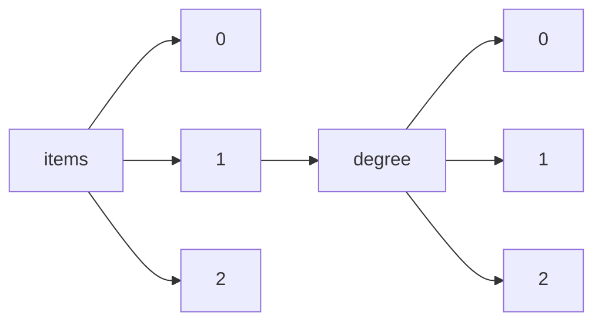

!!! warning "This document is not official Crossref documentation"
# Elements
PATH = items/array/degree/array(1)  
Occurs 419 028 times  
Unique values: > 999  
{ .annotate }

1. A route to an element, for example:  
   The route "items/array/degree/array" corresponds to navigating through the JSON indices as  
   ["items"][0]["degree"][0]  

!!! note "Due to current limitations, only the first 1,000 unique values are counted."

| **Row** | **Value** `String`                                                               | **Count** `Int64` |
|--------:|------------------------------------------------------------------------------------:|---------------------:|
| **1**   | Doctor of Philosophy                                                                | 30 239               |
| **2**   | Doctor of Philosophy (PhD)                                                          | 17 839               |
| **3**   | PhD Thesis                                                                          | 13 798               |
| **4**   | PhD                                                                                 | 13 083               |
| **5**   | Master of Science                                                                   | 10 682               |
| **6**   | Master of Arts                                                                      | 8 053                |
| **7**   | Master of Science (MS)                                                              | 7 489                |
| **8**   | Ph.D.                                                                               | 7 456                |
| **9**   | Master of Philosophy                                                                | 5 737                |
| **10**  | M.Phil.                                                                             | 5 094                |
| **11**  | MS                                                                                  | 5 085                |
| **12**  | Ph. D.                                                                              | 4 084                |
| **13**  | Master                                                                              | 3 704                |
| **14**  | Master of Arts (MA)                                                                 | 3 604                |
| **15**  | D.Min.                                                                              | 2 942                |
| **16**  | Doctor of Philosophy (Ph.D.)                                                        | 2 863                |
| **17**  | Bachelor of Arts with Departmental Honors                                           | 2 707                |
| **18**  | BACHAREL EM ADMINISTRAÇÃO DE EMPRESAS                                               | 2 697                |
| **19**  | M.A.                                                                                | 2 405                |
| **20**  | PHD                                                                                 | 2 393                |
| **21**  | Mestre em Engenharia Elétrica                                                       | 2 109                |
| **22**  | Master of Education                                                                 | 1 961                |
| **23**  | Master of Applied Science                                                           | 1 961                |
| **24**  | Doutor em Ciências                                                                  | 1 868                |
| **25**  | Master of Science (M.S.)                                                            | 1 714                |
| **26**  | Mestre                                                                              | 1 624                |
| **27**  | Doctorate                                                                           | 1 522                |
| **28**  | Mestre em Engenharia Mecânica                                                       | 1 514                |
| **29**  | Master of Architecture                                                              | 1 397                |
| **30**  | Mestrado em Ciências de Computação e Matemática Computacional                       | 1 359                |
| **31**  | Mestre em Educação                                                                  | 1 345                |
| **32**  | Master of Social Sciences                                                           | 1 338                |
| **33**  | Mestrado em Educação                                                                | 1 283                |
| **34**  | Doutor                                                                              | 1 246                |
| **35**  | Master of Engineering                                                               | 1 197                |
| **36**  | MA                                                                                  | 1 156                |
| **37**  | M.S.                                                                                | 1 153                |
| **38**  | Master of Fine Arts (MFA)                                                           | 1 134                |
| **39**  | Master of Medical Sciences                                                          | 1 129                |
| **40**  | Master's Thesis                                                                     | 1 113                |
| **41**  | Doutorado em Educação                                                               | 1 091                |
| **42**  | Doutor em Educação                                                                  | 1 052                |
| **43**  | Doutor em Engenharia Elétrica                                                       | 1 035                |
| **44**  | Pregrado                                                                            | 1 023                |
| **45**  | Master of Business Administration                                                   | 1 017                |
| **46**  | PhD thesis                                                                          | 1 000                |
| **47**  | Mestre em Engenharia Química                                                        | 970                  |
| **48**  | MESTRE EM CIÊNCIAS EM ENGENHARIA ELÉTRICA                                           | 956                  |
| **49**  | Honours Thesis                                                                      | 946                  |
| **50**  | Doctor en Ciencias Naturales                                                        | 941                  |
| **51**  | Mestre em Física                                                                    | 884                  |
| **52**  | BACHAREL EM CIÊNCIAS ECONÔMICAS                                                     | 868                  |
| **53**  | Doctor                                                                              | 866                  |
| **54**  | Mestre em Ciência da Computação                                                     | 852                  |
| **55**  | Mestre em Engenharia Civil                                                          | 817                  |
| **56**  | Master of Social Work                                                               | 808                  |
| **57**  | Mestrado em Matemática                                                              | 785                  |
| **58**  | Th.M.                                                                               | 772                  |
| **59**  | Doutor em Engenharia Mecânica                                                       | 762                  |
| **60**  | Master of Public Health                                                             | 760                  |
| **61**  | MESTRE EM ENGENHARIA MECÂNICA                                                       | 758                  |
| **62**  | Mestrado em História Social                                                         | 754                  |
| **63**  | Mestrado em Física                                                                  | 747                  |
| **64**  | Mestrado                                                                            | 731                  |
| **65**  | MPhil Thesis                                                                        | 726                  |
| **66**  | Mestrado em Administração                                                           | 718                  |
| **67**  | MESTRE EM INFORMÁTICA                                                               | 718                  |
| **68**  | Master of Public Administration                                                     | 715                  |
| **69**  | Master of Housing Management                                                        | 689                  |
| **70**  | BACHAREL EM ENGENHARIA DE PRODUÇÃO                                                  | 673                  |
| **71**  | Mestra                                                                              | 671                  |
| **72**  | Mestre em Química                                                                   | 667                  |
| **73**  | Mestrado em Geografia Humana                                                        | 666                  |
| **74**  | Mestrado em Física Aplicada                                                         | 665                  |
| **75**  | Mestrado em Economia Aplicada                                                       | 656                  |
| **76**  | Master of Science in Environmental Management                                       | 653                  |
| **77**  | PHD (Doctor of Philosophy)                                                          | 649                  |
| **78**  | Master of Science in Urban Planning                                                 | 649                  |
| **79**  | Doutorado em Administração                                                          | 641                  |
| **80**  | Doutorado em Física                                                                 | 634                  |
| **81**  | Mestrado em Tecnologia Nuclear - Aplicações                                         | 627                  |
| **82**  | Doutorado em História Social                                                        | 624                  |
| **83**  | Licenciatura                                                                        | 619                  |
| **84**  | TH.M.                                                                               | 610                  |
| **85**  | Doctor of Musical Arts (DMA)                                                        | 609                  |
| **86**  | Mestre em Ciências Biológicas                                                       | 607                  |
| **87**  | EdD                                                                                 | 600                  |
| **88**  | BACHAREL EM DIREITO                                                                 | 594                  |
| **89**  | Doutorado em Ciências de Computação e Matemática Computacional                      | 590                  |
| **90**  | Doctor of Education (Ed.D.)                                                         | 588                  |
| **91**  | Magíster en Ciencias de la Ingeniería                                               | 580                  |
| **92**  | Mestrado em Estatística                                                             | 577                  |
| **93**  | Mestrado em Hidráulica e Saneamento                                                 | 573                  |
| **94**  | Doutor em Engenharia Química                                                        | 567                  |
| **95**  | D.MIN.                                                                              | 564                  |
| **96**  | Mestrado em Fitotecnia                                                              | 564                  |
| **97**  | Doutorado em Solos e Nutrição de Plantas                                            | 558                  |
| **98**  | Doctoral Thesis                                                                     | 546                  |
| **99**  | Mestrado em Tecnologia Nuclear - Materiais                                          | 546                  |
| **100** | Doutorado em Física Aplicada                                                        | 546                  |
| **101** | Mestrado em Solos e Nutrição de Plantas                                             | 545                  |
| **102** | Mestrado em Ciência da Computação                                                   | 540                  |
| **103** | Doutorado em Matemática                                                             | 534                  |
| **104** | Mestre em Engenharia Agrícola                                                       | 532                  |
| **105** | Doutora em Ciências                                                                 | 530                  |
| **106** | Mestrado em Entomologia                                                             | 522                  |
| **107** | Mestre em Matemática                                                                | 519                  |
| **108** | Mestrado em Enfermagem Fundamental                                                  | 513                  |
| **109** | Doutorado em Geografia Humana                                                       | 511                  |
| **110** | Specialization                                                                      | 505                  |
| **111** | Mestre em Ciências                                                                  | 502                  |
| **112** | MESTRE EM ADMINISTRAÇÃO DE EMPRESAS                                                 | 494                  |
| **113** | Mestrado em Ciência Animal e Pastagens                                              | 491                  |
| **114** | Ed. D.                                                                              | 487                  |
| **115** | ENGENHEIRO MECÂNICO                                                                 | 486                  |
| **116** | Mestre em Linguística                                                               | 485                  |
| **117** | Doutorado em Genética e Melhoramento de Plantas                                     | 484                  |
| **118** | Mestre em Ciências Médicas                                                          | 482                  |
| **119** | Master of Computer Science                                                          | 477                  |
| **120** | MESTRE EM LETRAS                                                                    | 475                  |
| **121** | Mestrado em Estruturas                                                              | 469                  |
| **122** | Mestre em Educação Física                                                           | 467                  |
| **123** | Doutor em Ciências Médicas                                                          | 465                  |
| **124** | BA                                                                                  | 460                  |
| **125** | Mestrado em Química                                                                 | 454                  |
| **126** | Doutora em Educação                                                                 | 449                  |
| **127** | Mestrado em Ciência e Tecnologia de Alimentos                                       | 447                  |
| **128** | Mestre em História                                                                  | 447                  |
| **129** | MESTRE EM ADMINISTRAÇÃO DE EMPRESAS - OPÇÃO PROFISSIONAL                            | 442                  |
| **130** | Mestrado em Filosofia                                                               | 438                  |
| **131** | Mestrado em Engenharia de Produção                                                  | 438                  |
| **132** | Mestrado em Recursos Florestais                                                     | 434                  |
| **133** | Doutorado em Entomologia                                                            | 427                  |
| **134** | Doutorado em Bioquímica                                                             | 425                  |
| **135** | Mestrado em Genética e Melhoramento de Plantas                                      | 424                  |
| **136** | Master's Degree in Technology: Chiropractic                                         | 419                  |
| **137** | Mestrado em Engenharia Química                                                      | 418                  |
| **138** | Doutora                                                                             | 414                  |
| **139** | Doutor em Clínica Odontológica                                                      | 412                  |
| **140** | Doctor en Ciencias Exactas, área Ciencias Biológicas                                | 410                  |
| **141** | Mestre em Tecnologia de Alimentos                                                   | 410                  |
| **142** | Mestra em Educação                                                                  | 402                  |
| **143** | Mestre em Clínica Odontológica                                                      | 402                  |
| **144** | Mestrado em Enfermagem em Saúde Pública                                             | 400                  |
| **145** | MESTRE EM ENGENHARIA DE PRODUÇÃO                                                    | 397                  |
| **146** | Doutorado em Química                                                                | 396                  |
| **147** | Mestrado em Fisiopatologia Experimental                                             | 386                  |
| **148** | MESTRE EM DESIGN                                                                    | 384                  |
| **149** | Master of Science in Engineering                                                    | 381                  |
| **150** | Doutorado em Filosofia                                                              | 377                  |
| **151** | Doutorado em Epidemiologia                                                          | 375                  |
| **152** | Doutor em Linguística                                                               | 374                  |
| **153** | Doctor en Ciencias Exactas, área Química                                            | 369                  |
| **154** | Mestrado em Sistemas de Potência                                                    | 365                  |
| **155** | Mestre em Engenharia de Alimentos                                                   | 365                  |
| **156** | J.C.L.                                                                              | 364                  |
| **157** | Mestrado em Biotecnologia                                                           | 356                  |
| **158** | Mestra em Ciências                                                                  | 356                  |
| **159** | Doutorado em Fitotecnia                                                             | 354                  |
| **160** | Doutorado em Serviços de Saúde Pública                                              | 353                  |
| **161** | MFA                                                                                 | 351                  |
| **162** | Doutor em Engenharia Agrícola                                                       | 349                  |
| **163** | Doutorado em Cardiologia                                                            | 348                  |
| **164** | Master of Science in Mechanical Engineering (MS)                                    | 347                  |
| **165** | Master of Fine Arts                                                                 | 346                  |
| **166** | MESTRE EM CIÊNCIAS DE ENGENHARIA CIVIL                                              | 345                  |
| **167** | Doctor of Education (EdD)                                                           | 344                  |
| **168** | Mestre em Artes                                                                     | 339                  |
| **169** | Doutorado em Físico-Química                                                         | 336                  |
| **170** | Doutorado em Hidráulica e Saneamento                                                | 331                  |
| **171** | Mestre em Sociologia                                                                | 330                  |
| **172** | Mestrado em Psicologia Clínica                                                      | 329                  |
| **173** | Mestrado em Reabilitação Oral                                                       | 328                  |
| **174** | Mestre em Geociências                                                               | 326                  |
| **175** | Doutorado em Enfermagem Fundamental                                                 | 324                  |
| **176** | Mestrado em Física Básica                                                           | 320                  |
| **177** | Doutor em Matemática                                                                | 319                  |
| **178** | Doutorado em Tecnologia Nuclear - Materiais                                         | 318                  |
| **179** | Mestrado em Psicologia Escolar e do Desenvolvimento Humano                          | 318                  |
| **180** | Mestrado em Administração de Organizações                                           | 317                  |
| **181** | Mestrado em Bioengenharia                                                           | 316                  |
| **182** | Mestrado em Qualidade e Produtividade Animal                                        | 316                  |
| **183** | Mestrado em Enfermagem Psiquiátrica                                                 | 314                  |
| **184** | Mestrado em Controladoria e Contabilidade: Contabilidade                            | 312                  |
| **185** | Bachelor - Licence                                                                  | 312                  |
| **186** | Mestrado em Sistemas Digitais                                                       | 311                  |
| **187** | Master of Landscape Architecture                                                    | 311                  |
| **188** | MESTRE EM CIÊNCIAS JURÍDICAS                                                        | 309                  |
| **189** | Mestrado em Anatomia dos Animais Domésticos e Silvestres                            | 308                  |
| **190** | Mestrado em Ciências da Engenharia Ambiental                                        | 308                  |
| **191** | Mestrado em Físico-Química                                                          | 306                  |
| **192** | DOUTOR EM CIÊNCIAS HUMANAS - EDUCAÇÃO                                               | 306                  |
| **193** | Doutorado em Estatística                                                            | 306                  |
| **194** | Mestrado em Filologia e Língua Portuguesa                                           | 303                  |
| **195** | Mestrado em Ciência Política                                                        | 303                  |
| **196** | Bacharelado em Administração                                                        | 302                  |
| **197** | Master of Science in Conservation                                                   | 302                  |
| **198** | Mestrado em Serviços de Saúde Pública                                               | 302                  |
| **199** | Doutor em Ciências Biológicas                                                       | 302                  |
| **200** | Mestrado em Teoria Econômica                                                        | 301                  |
| **201** | Mestrado em Psicologia                                                              | 299                  |
| **202** | Doutorado em Psicologia Escolar e do Desenvolvimento Humano                         | 299                  |
| **203** | Mestrado em Epidemiologia Experimental Aplicada às Zoonoses                         | 299                  |
| **204** | Mestre em Linguística Aplicada                                                      | 298                  |
| **205** | Mestre em Matemática Aplicada                                                       | 297                  |
| **206** | Doutorado em Enfermagem em Saúde Pública                                            | 296                  |
| **207** | Mestre em Filosofia                                                                 | 296                  |
| **208** | Mestre em Odontologia                                                               | 295                  |
| **209** | MESTRE EM ENGENHARIA CIVIL                                                          | 294                  |
| **210** | Doutorado em Tecnologia Nuclear - Aplicações                                        | 291                  |
| **211** | Mestre em Ciência de Alimentos                                                      | 289                  |
| **212** | Mestrado em Direito Processual                                                      | 287                  |
| **213** | Doutor em Ciências Sociais                                                          | 285                  |
| **214** | Mestrado em Engenharia de Construção Civil e Urbana                                 | 283                  |
| **215** | MESTRE EM HISTÓRIA                                                                  | 283                  |
| **216** | Doutor em Ciência de Alimentos                                                      | 282                  |
| **217** | Doutor em História                                                                  | 282                  |
| **218** | Master of Arts in Applied Linguistics                                               | 282                  |
| **219** | Graduation                                                                          | 281                  |
| **220** | Mestrado em Engenharia Metalúrgica e de Materiais                                   | 281                  |
| **221** | Mestrado em Matemática Aplicada                                                     | 281                  |
| **222** | Mestrado em Saúde na Comunidade                                                     | 281                  |
| **223** | Doutor em Filosofia                                                                 | 279                  |
| **224** | Doctor of Education                                                                 | 276                  |
| **225** | Maestría                                                                            | 275                  |
| **226** | Mestrado em Direito do Estado                                                       | 275                  |
| **227** | Mestrado em Fitopatologia                                                           | 274                  |
| **228** | Mestrado em Sociologia                                                              | 274                  |
| **229** | Mestrado em Semiótica e Lingüística Geral                                           | 274                  |
| **230** | Doutorado em Enfermagem                                                             | 273                  |
| **231** | Mestre em Música                                                                    | 271                  |
| **232** | Doutorado em Economia Aplicada                                                      | 270                  |
| **233** | MESTRE EM SERVIÇO SOCIAL                                                            | 270                  |
| **234** | Mestre em Farmacologia                                                              | 270                  |
| **235** | Doutor em Tecnologia de Alimentos                                                   | 269                  |
| **236** | Mestrado em Engenharia Elétrica                                                     | 269                  |
| **237** | Dr. med.                                                                            | 266                  |
| **238** | Management                                                                          | 265                  |
| **239** | Mestrado em Psicologia Social                                                       | 264                  |
| **240** | Doctor of Ministry                                                                  | 262                  |
| **241** | MESTRE EM EDUCAÇÃO                                                                  | 261                  |
| **242** | Mestrado em Produção e Controle Farmacêuticos                                       | 261                  |
| **243** | Doutorado em Sociologia                                                             | 261                  |
| **244** | MESTRE EM TEOLOGIA                                                                  | 261                  |
| **245** | Mestrado em Química Analítica                                                       | 261                  |
| **246** | Mestre em Biologia Funcional e Molecular                                            | 260                  |
| **247** | Doutor em Educação Física                                                           | 260                  |
| **248** | Master of Arts (M.A.)                                                               | 258                  |
| **249** | Doutorado em Patologia                                                              | 258                  |
| **250** | Master of Science in Civil Engineering (MSCE)                                       | 258                  |
| **251** | Doutor em Biologia Funcional e Molecular                                            | 258                  |
| **252** | MESTRE EM ENGENHARIA ELÉTRICA                                                       | 256                  |
| **253** | Mestrado em Geotecnia                                                               | 256                  |
| **254** | MESTRE EM PSICOLOGIA                                                                | 255                  |
| **255** | Doutorado em Ciência Animal e Pastagens                                             | 254                  |
| **256** | Doutorado em Estruturas                                                             | 254                  |
| **257** | Maestría en Ciencias Antropológicas                                                 | 254                  |
| **258** | Mestrado em Enfermagem na Saúde do Adulto                                           | 254                  |
| **259** | MESTRE EM ECONOMIA                                                                  | 254                  |
| **260** | Mestrado em Bioquímica                                                              | 253                  |
| **261** | Mestrado em Estatística e Experimentação Agronômica                                 | 252                  |
| **262** | Mestre em Biologia Celular e Estrutural                                             | 251                  |
| **263** | M.Div.                                                                              | 251                  |
| **264** | Mestrado em Desenvolvimento, Caracterização e Aplicação de Materiais                | 249                  |
| **265** | Mestrado em Microeletrônica                                                         | 247                  |
| **266** | Mestrado em Nutrição e Produção Animal                                              | 247                  |
| **267** | MESTRE EM LOGÍSTICA - OPÇÃO PROFISSIONAL                                            | 247                  |
| **268** | Doutorado em Psicologia Social                                                      | 246                  |
| **269** | Mestre em Desenvolvimento Econômico                                                 | 245                  |
| **270** | Doutor em Engenharia de Alimentos                                                   | 245                  |
| **271** | DOUTOR EM LETRAS                                                                    | 244                  |
| **272** | MESTRE EM METROLOGIA                                                                | 244                  |
| **273** | Mestrado em Antropologia Social                                                     | 244                  |
| **274** | Mestrado em Psicologia Experimental                                                 | 243                  |
| **275** | Ph.d                                                                                | 243                  |
| **276** | Mestrado em Epidemiologia                                                           | 241                  |
| **277** | DOUTOR EM CIÊNCIAS EM ENGENHARIA ELÉTRICA                                           | 241                  |
| **278** | Mestre em Multimeios                                                                | 239                  |
| **279** | Doutor em Matemática Aplicada                                                       | 238                  |
| **280** | Mestrado em Análises Clínicas                                                       | 238                  |
| **281** | MESTRE EM RELAÇÕES INTERNACIONAIS                                                   | 238                  |
| **282** | Doutorado em Controladoria e Contabilidade: Contabilidade                           | 238                  |
| **283** | Mestrado em Odontopediatria                                                         | 237                  |
| **284** | Mestrado em Energia                                                                 | 237                  |
| **285** | S.T.M.                                                                              | 236                  |
| **286** | Mestre em Antropologia Social                                                       | 236                  |
| **287** | Doutorado em Biotecnologia                                                          | 236                  |
| **288** | Mestrado em Farmacologia                                                            | 234                  |
| **289** | Doutorado em Filologia e Língua Portuguesa                                          | 234                  |
| **290** | Mestra em Engenharia Química                                                        | 233                  |
| **291** | Mestrado em Estudos Lingüísticos e Literários em Inglês                             | 233                  |
| **292** | Master of Arts in Transport Policy and Planning                                     | 233                  |
| **293** | Mestrado em Engenharia de Transportes                                               | 232                  |
| **294** | Mestrado em Microbiologia Agrícola                                                  | 232                  |
| **295** | Doutorado em Ciências da Engenharia Ambiental                                       | 232                  |
| **296** | Doutorado em Reabilitação Oral                                                      | 229                  |
| **297** | Mestrado em Direito Civil                                                           | 228                  |
| **298** | Mestre em Ciência Política                                                          | 228                  |
| **299** | Mestrado em Dentística                                                              | 226                  |
| **300** | Mestre em Genética e Biologia Molecular                                             | 225                  |
| **301** | Mestrado em Pediatria                                                               | 224                  |
| **302** | Mestrado em Ecologia Aplicada                                                       | 222                  |
| **303** | Doutorado em Engenharia de Produção                                                 | 222                  |
| **304** | Doutor em Biologia Vegetal                                                          | 221                  |
| **305** | Doutorado em Neurologia                                                             | 221                  |
| **306** | Mestrado em Clínica Veterinária                                                     | 220                  |
| **307** | Doutorado em Física Básica                                                          | 220                  |
| **308** | Mestre em Ciências e Engenharia de Petróleo                                         | 219                  |
| **309** | Mestrado em Engenharia de Controle e Automação Mecânica                             | 219                  |
| **310** | Mestrado em Cuidado em Saúde                                                        | 217                  |
| **311** | Mestrado em Geografia Física                                                        | 217                  |
| **312** | Doutorado em Fisiologia Humana                                                      | 216                  |
| **313** | Doutor em Ciência da Computação                                                     | 215                  |
| **314** | Mestrado em Reprodução Animal                                                       | 213                  |
| **315** | Mestrado em Engenharia Mecânica                                                     | 213                  |
| **316** | Master of Science in Information Technology in Education                            | 213                  |
| **317** | MESTRE EM FILOSOFIA                                                                 | 212                  |
| **318** | Mestrado em Zoologia                                                                | 211                  |
| **319** | Mestrado em Neurologia                                                              | 211                  |
| **320** | Mestrado em Teoria e História da Arquitetura e do Urbanismo                         | 210                  |
| **321** | Doutorado em Epidemiologia Experimental Aplicada às Zoonoses                        | 210                  |
| **322** | Doutor em Engenharia Civil                                                          | 209                  |
| **323** | Mestrado em Direito Econômico e Financeiro                                          | 209                  |
| **324** | Doutor em Genetica e Biologia Molecular                                             | 208                  |
| **325** | Mestrado em Direito Comercial                                                       | 208                  |
| **326** | Mestrado em Nutrição em Saúde Pública                                               | 208                  |
| **327** | Mestrado em Física Aplicada à Medicina e Biologia                                   | 207                  |
| **328** | Mestrado em Ciências Florestais                                                     | 207                  |
| **329** | Mestrado em Arqueologia                                                             | 206                  |
| **330** | Doutor em Odontologia                                                               | 206                  |
| **331** | Mestre em Teoria e História Literária                                               | 206                  |
| **332** | Doutor em Clínica Médica                                                            | 205                  |
| **333** | Doutorado em Qualidade e Produtividade Animal                                       | 204                  |
| **334** | Mestrado em História e Fundamentos da Arquitetura e do Urbanismo                    | 204                  |
| **335** | dr.                                                                                 | 204                  |
| **336** | Mestre em Estatística                                                               | 204                  |
| **337** | Mestre em Saude Coletiva                                                            | 204                  |
| **338** | Mestrado em Botânica                                                                | 203                  |
| **339** | DOUTOR EM ENGENHARIA MECÂNICA                                                       | 203                  |
| **340** | Doutorado                                                                           | 203                  |
| **341** | Master of Journalism                                                                | 203                  |
| **342** | Mestre em Tocoginecologia                                                           | 202                  |
| **343** | Doutorado em Psicologia Clínica                                                     | 202                  |
| **344** | Master of Mass Communication (MMC)                                                  | 202                  |
| **345** | Doutor em Biologia Celular e Estrutural                                             | 202                  |
| **346** | Master of Dental Surgery                                                            | 201                  |
| **347** | Mestrado em Fisiologia e Bioquímica de Plantas                                      | 201                  |
| **348** | Mestrado em Ciências da Reabilitação                                                | 201                  |
| **349** | Mestrado em Obstetrícia e Ginecologia                                               | 200                  |
| **350** | Doutorado em Saúde Ambiental                                                        | 200                  |
| **351** | Doutorado em Ciência Política                                                       | 200                  |
| **352** | Mestrado em Microbiologia                                                           | 200                  |
| **353** | MA (Master of Arts)                                                                 | 199                  |
| **354** | Mestrado em Literatura Brasileira                                                   | 199                  |
| **355** | Doutorado em Biologia (Genética)                                                    | 198                  |
| **356** | Education                                                                           | 198                  |
| **357** | Doutorado em Química Analítica                                                      | 198                  |
| **358** | Mestrado em História Econômica                                                      | 198                  |
| **359** | Doutorado em História Econômica                                                     | 198                  |
| **360** | Mestre em Cirurgia                                                                  | 198                  |
| **361** | Doutorado em Odontopediatria                                                        | 198                  |
| **362** | Doctorado en Ciencias Antropológicas                                                | 197                  |
| **363** | M.DIV.                                                                              | 197                  |
| **364** | Mestrado em Têxtil e Moda                                                           | 196                  |
| **365** | Doutorado em Engenharia Mecânica                                                    | 195                  |
| **366** | Mestra em Ciências Médicas                                                          | 195                  |
| **367** | Doctorado en Ciencias (Química)                                                     | 194                  |
| **368** | Mestre em Economia                                                                  | 193                  |
| **369** | Doutorado em Fitopatologia                                                          | 193                  |
| **370** | Doutorado em História e Fundamentos da Arquitetura e do Urbanismo                   | 193                  |
| **371** | Mestre em Política Científica e Tecnológica                                         | 193                  |
| **372** | Mestrado em Sistemas Eletrônicos                                                    | 192                  |
| **373** | Mestrado em Desenvolvimento no Estado Democrático de Direito                        | 192                  |
| **374** | Doutorado em Fisiopatologia Experimental                                            | 191                  |
| **375** | Doutorado em Dentística                                                             | 191                  |
| **376** | Doutorado em Anatomia dos Animais Domésticos e Silvestres                           | 191                  |
| **377** | Doutor em Ciências Econômicas                                                       | 190                  |
| **378** | Doctor of Medicine                                                                  | 190                  |
| **379** | Doutorado em Recursos Florestais                                                    | 190                  |
| **380** | Doctorado en Biotecnología                                                          | 189                  |
| **381** | Doutorado em Antropologia Social                                                    | 189                  |
| **382** | Mestrado em Biologia (Genética)                                                     | 188                  |
| **383** | Professional Doctorate                                                              | 188                  |
| **384** | Doutorado em Sistemas Digitais                                                      | 188                  |
| **385** | Mestrado em Estudos Comparados de Literaturas de Língua Portuguesa                  | 188                  |
| **386** | Doctor en Comunicación                                                              | 188                  |
| **387** | Mestrado em Teoria Literária e Literatura Comparada                                 | 188                  |
| **388** | Mestrado em Ecologia: Ecossistemas Terrestres e Aquáticos                           | 187                  |
| **389** | Mestre em Geografia                                                                 | 187                  |
| **390** | Mestrado em Psiquiatria                                                             | 187                  |
| **391** | Doutorado em Psicologia Experimental                                                | 186                  |
| **392** | Doutor em Economia                                                                  | 186                  |
| **393** | Master's Degree in Technology: Homoeopathy                                          | 186                  |
| **394** | Mestrado em Medicina Preventiva                                                     | 186                  |
| **395** | DOUTOR EM DESIGN                                                                    | 185                  |
| **396** | Doutor em Química                                                                   | 185                  |
| **397** | International Affairs                                                               | 185                  |
| **398** | Doutorado em Microbiologia                                                          | 185                  |
| **399** | Mestre em Biologia Vegetal                                                          | 185                  |
| **400** | Mestrado em Clínica Cirúrgica Veterinária                                           | 184                  |
| **401** | Doutorado em Imunologia                                                             | 184                  |
| **402** | Doutorado em Geografia Física                                                       | 184                  |
| **403** | Mestrado em Bromatologia                                                            | 183                  |
| **404** | Doutorado em Medicina Preventiva                                                    | 183                  |
| **405** | Mestrado em Engenharia Naval e Oceânica                                             | 182                  |
| **406** | Master of Science in Mechanical Engineering (MSME)                                  | 181                  |
| **407** | Mestrado em Engenharia Hidráulica                                                   | 181                  |
| **408** | Doctor en Ingeniería                                                                | 181                  |
| **409** | Mestrado em Neurociências e Comportamento                                           | 180                  |
| **410** | Mestrado em Língua Espanhola e Literaturas Espanhola e Hispano-Americana            | 180                  |
| **411** | Mestrado em Patologia Experimental e Comparada                                      | 180                  |
| **412** | Doutorado em Sistemas de Potência                                                   | 179                  |
| **413** | Master of Nursing                                                                   | 179                  |
| **414** | Doutorado em Semiótica e Lingüística Geral                                          | 178                  |
| **415** | Mestrado em Clínica Médica                                                          | 176                  |
| **416** | Mestre em Ecologia                                                                  | 176                  |
| **417** | DOUTOR EM TEOLOGIA                                                                  | 175                  |
| **418** | Doutorado em Zoologia                                                               | 175                  |
| **419** | Mestrado em Estudos Culturais                                                       | 175                  |
| **420** | Mestrado em Ciência Ambiental                                                       | 174                  |
| **421** | Masters by Research                                                                 | 174                  |
| **422** | Mestrado em Fonoaudiologia                                                          | 173                  |
| **423** | Mestrado em Irrigação e Drenagem                                                    | 173                  |
| **424** | Mestrado em Saúde Ambiental                                                         | 172                  |
| **425** | BACHAREL EM DESIGN                                                                  | 172                  |
| **426** | Mestrado em Imunologia                                                              | 172                  |
| **427** | Mestrado em Engenharia de Sistemas Agrícolas                                        | 171                  |
| **428** | Mestrado em Poéticas Visuais                                                        | 171                  |
| **429** | Mestrado em Interfaces Sociais da Comunicação                                       | 171                  |
| **430** | Mestre em Ciências Econômicas                                                       | 171                  |
| **431** | Magister en Economía                                                                | 170                  |
| **432** | Doutorado em Enfermagem Psiquiátrica                                                | 170                  |
| **433** | Doutorado em Direito do Estado                                                      | 170                  |
| **434** | Maestría en Biología Experimental                                                   | 169                  |
| **435** | Doutorado em Estudos Lingüísticos e Literários em Inglês                            | 167                  |
| **436** | Doutorado em Química Analítica e Inorgânica                                         | 167                  |
| **437** | Mestrado em Processos de Criação Musical                                            | 167                  |
| **438** | Doutorado em Irrigação e Drenagem                                                   | 166                  |
| **439** | Mestrado em Tecnologia da Arquitetura                                               | 166                  |
| **440** | Mestrado em Endodontia                                                              | 166                  |
| **441** | Doutorado em Engenharia Metalúrgica e de Materiais                                  | 166                  |
| **442** | Doctor en Ciencias Veterinarias                                                     | 166                  |
| **443** | Master of Philosophy (MPHIL)                                                        | 165                  |
| **444** | Doutorado Direto em Cardiologia                                                     | 165                  |
| **445** | Mestrado em Biodinâmica do Movimento Humano                                         | 164                  |
| **446** | Doutorado em Clínica Cirúrgica                                                      | 164                  |
| **447** | Master of Science in Electrical Engineering (MSEE)                                  | 164                  |
| **448** | DOUTOR EM CIÊNCIAS EM INFORMÁTICA                                                   | 164                  |
| **449** | Mestrado em Engenharia de Estruturas                                                | 164                  |
| **450** | Doutorado em Ecologia Aplicada                                                      | 163                  |
| **451** | Computer Science                                                                    | 163                  |
| **452** | Mestra em Química                                                                   | 163                  |
| **453** | Mestrado em Química Analítica e Inorgânica                                          | 161                  |
| **454** | Mestrado em Estética e História da Arte                                             | 160                  |
| **455** | Maestría en Biotecnología                                                           | 159                  |
| **456** | Mestrado em Ensino de Física                                                        | 159                  |
| **457** | Doutorado em Estatística e Experimentação Agronômica                                | 159                  |
| **458** | Mestrado em Oceanografia Biológica                                                  | 158                  |
| **459** | Mestrado em Relações Internacionais                                                 | 158                  |
| **460** | Mestrado em Estomatologia e Biologia Oral                                           | 157                  |
| **461** | Mestra em Ciências da Saúde                                                         | 157                  |
| **462** | Doutorado em Sistemas Eletrônicos                                                   | 157                  |
| **463** | Doutorado em Teoria Literária e Literatura Comparada                                | 157                  |
| **464** | Doutorado em Farmacologia                                                           | 157                  |
| **465** | Doutorado em Engenharia Química                                                     | 157                  |
| **466** | Mestrado em Cultura e Informação                                                    | 156                  |
| **467** | Mestre em Saude da Criança e do Adolescente                                         | 156                  |
| **468** | Mestrado em Sistemas de Informação                                                  | 156                  |
| **469** | MESTRE EM PSICOLOGIA CLÍNICA                                                        | 156                  |
| **470** | Mestrado em Controladoria e Contabilidade                                           | 154                  |
| **471** | Mestrado em Psicobiologia                                                           | 154                  |
| **472** | Mestrado em Saúde Pública                                                           | 153                  |
| **473** | Mestrado em Integração da América Latina                                            | 153                  |
| **474** | Mestre em Enfermagem                                                                | 153                  |
| **475** | Doutorado em Nutrição em Saúde Pública                                              | 152                  |
| **476** | Doctor en Ciencias Exactas, área Física                                             | 152                  |
| **477** | Mestrado em Fisiologia Geral                                                        | 152                  |
| **478** | Mestrado em Medicamentos e Cosméticos                                               | 152                  |
| **479** | Mestrado em Filosofia e Teoria Geral do Direito                                     | 151                  |
| **480** | Master of Public Health (M.P.H.)                                                    | 151                  |
| **481** | Doutor em Música                                                                    | 150                  |
| **482** | DOUTOR EM CIÊNCIAS - INFORMÁTICA                                                    | 149                  |
| **483** | MESTRE EM QUÍMICA                                                                   | 149                  |
| **484** | Mestrado em Transportes                                                             | 149                  |
| **485** | Doutorado em Ciência da Computação                                                  | 148                  |
| **486** | Master of Social Work (MSW)                                                         | 148                  |
| **487** | Maestría en Ciencias (Ingeniería Biomédica)                                         | 147                  |
| **488** | Mestrado em Direito Penal                                                           | 146                  |
| **489** | Doctor of Philosophy (PhD)\n \nPsychology                                           | 145                  |
| **490** | Doutorado em Enfermagem na Saúde do Adulto                                          | 145                  |
| **491** | Doutorado em Cuidado em Saúde                                                       | 145                  |
| **492** | Doutorado em Genética                                                               | 145                  |
| **493** | MESTRE EM ENGENHARIA DE MATERIAIS E DE PROCESSOS QUÍMICOS E METALÚRGICOS            | 144                  |
| **494** | Mestrado em Mestrado Profissional em Matemática em Rede Nacional                    | 144                  |
| **495** | DOUTOR EM FILOSOFIA                                                                 | 143                  |
| **496** | Mestrado em Sistemas Elétricos de Potência                                          | 143                  |
| **497** | DOUTOR EM ENGENHARIA ELÉTRICA                                                       | 143                  |
| **498** | Mestrado em Engenharia Mineral                                                      | 142                  |
| **499** | Doutorado em Psicologia                                                             | 142                  |
| **500** | Mestre em Planejamento de Sistemas Energéticos                                      | 142                  |
| **501** | Doutor em Tocoginecologia                                                           | 141                  |
| **502** | MESTRE EM ENGENHARIA URBANA E AMBIENTAL - OPÇÃO PROFISSIONAL                        | 141                  |
| **503** | Doctor en Medicina                                                                  | 141                  |
| **504** | Mestrado em Direito Internacional                                                   | 140                  |
| **505** | Doutorado em Botânica                                                               | 140                  |
| **506** | DOUTOR EM PSICOLOGIA                                                                | 139                  |
| **507** | Doutorado em Direito Econômico e Financeiro                                         | 139                  |
| **508** | Doutorado em Desenvolvimento, Caracterização e Aplicação de Materiais               | 139                  |
| **509** | Doutorado em Estudos Comparados de Literaturas de Língua Portuguesa                 | 139                  |
| **510** | Doutorado em Reprodução Animal                                                      | 138                  |
| **511** | Master of Management Studies                                                        | 138                  |
| **512** | Doutorado em Bromatologia                                                           | 137                  |
| **513** | Doutorado em Saúde, Ciclos de Vida e Sociedade                                      | 137                  |
| **514** | Mestrado em Fisiologia Humana                                                       | 137                  |
| **515** | Mestrado em Processos e Gestão de Operações                                         | 137                  |
| **516** | Mestrado em Ginecologia e Obstetrícia                                               | 136                  |
| **517** | D.W.S.                                                                              | 136                  |
| **518** | DMA                                                                                 | 135                  |
| **519** | Doctor of Philosophy (PhD)\n \nElectrical Engineering                               | 135                  |
| **520** | Mestrado em Design e Arquitetura                                                    | 135                  |
| **521** | Doutorado em Interfaces Sociais da Comunicação                                      | 134                  |
| **522** | Bacharelado em Engenharia Elétrica                                                  | 134                  |
| **523** | Doctor of Nursing Practice (D.N.P.)                                                 | 134                  |
| **524** | Mestrado em Toxicologia                                                             | 134                  |
| **525** | Doutora em Linguística                                                              | 133                  |
| **526** | Mestrado em Teoria e Prática do Teatro                                              | 133                  |
| **527** | Mestra em História                                                                  | 133                  |
| **528** | Mestrado em Física do Ambiente Agrícola                                             | 133                  |
| **529** | Mestrado em Periodontia                                                             | 132                  |
| **530** | Maestría en Ciencias (Ingeniería Química)                                           | 132                  |
| **531** | Doctor of Philosophy (PhD)\n \nChemistry                                            | 132                  |
| **532** | Mestrado em Toxicologia e Análises Toxicológicas                                    | 131                  |
| **533** | M.A.P.S.                                                                            | 131                  |
| **534** | Mestra em Engenharia Mecânica                                                       | 131                  |
| **535** | Mestra em Linguística                                                               | 131                  |
| **536** | MESTRE EM LETRAS/LITERATURA, CULTURA E CONTEMPORANEIDADE                            | 131                  |
| **537** | phd                                                                                 | 131                  |
| **538** | Master of Science in Occupational Therapy                                           | 130                  |
| **539** | Mestrado em Ciência e Engenharia de Materiais                                       | 130                  |
| **540** | Doctor en Historia                                                                  | 130                  |
| **541** | Doutor em Linguística Aplicada                                                      | 130                  |
| **542** | Doutor em Ecologia                                                                  | 130                  |
| **543** | Doutor em Sociologia                                                                | 129                  |
| **544** | Doutorado em Física Aplicada à Medicina e Biologia                                  | 129                  |
| **545** | Master of Public Administration (MPA)                                               | 128                  |
| **546** | Doutorado em Biodinâmica do Movimento Humano                                        | 128                  |
| **547** | Phd                                                                                 | 128                  |
| **548** | Mestrado em Genética                                                                | 128                  |
| **549** | Doutor em Medicina                                                                  | 128                  |
| **550** | Mestrado em Engenharia de Sistemas                                                  | 127                  |
| **551** | Maestría en Biología                                                                | 127                  |
| **552** | Doctorado en Estudios Organizacionales                                              | 127                  |
| **553** | Doctor of Nursing Practice (DNP)                                                    | 127                  |
| **554** | Doutorado em Arqueologia                                                            | 126                  |
| **555** | Doutorado em Literatura Brasileira                                                  | 126                  |
| **556** | Mestre em Clínica Médica                                                            | 126                  |
| **557** | Doutorado em Análises Clínicas                                                      | 126                  |
| **558** | Doutorado em Psiquiatria                                                            | 126                  |
| **559** | Doutorado em Microeletrônica                                                        | 125                  |
| **560** | Mestrado em Projeto de Arquitetura                                                  | 125                  |
| **561** | Master of Urban Design                                                              | 125                  |
| **562** | Doutorado em Patologia Experimental e Comparada                                     | 125                  |
| **563** | Mestrado em Geotectônica                                                            | 125                  |
| **564** | Doutor em Teoria e História Literária                                               | 125                  |
| **565** | Mestrado em Letras Clássicas                                                        | 125                  |
| **566** | DOUTOR EM CIÊNCIAS DE ENGENHARIA CIVIL                                              | 124                  |
| **567** | Professional                                                                        | 124                  |
| **568** | Mestrado em Biociências Aplicadas à Farmácia                                        | 124                  |
| **569** | Biology                                                                             | 123                  |
| **570** | Doctor of Philosophy in Mechanical Engineering-Engineering Mechanics (PhD)          | 123                  |
| **571** | MESTRE EM CIÊNCIAS SOCIAIS                                                          | 122                  |
| **572** | Doutorado em Pediatria                                                              | 122                  |
| **573** | Mestrado em Biologia Celular e Tecidual                                             | 122                  |
| **574** | BACHAREL EM ENGENHARIA ELÉTRICA                                                     | 122                  |
| **575** | Doutorado em Administração de Organizações                                          | 122                  |
| **576** | UNSPECIFIED                                                                         | 122                  |
| **577** | Doutorado em Medicamentos e Cosméticos                                              | 122                  |
| **578** | Mestrado em Sistemas Dinâmicos                                                      | 121                  |
| **579** | Doutorado em Direito Processual                                                     | 121                  |
| **580** | Mestra em Engenharia Elétrica                                                       | 121                  |
| **581** | Doctor en Letras                                                                    | 120                  |
| **582** | Mestrado em Mudança Social e Participação Política                                  | 120                  |
| **583** | Doctor of Philosophy (PhD)\n \nBiology                                              | 120                  |
| **584** | Mestrado em Tecnologia Nuclear - Reatores                                           | 119                  |
| **585** | Mestrado em Doenças Infecciosas e Parasitárias                                      | 119                  |
| **586** | Doutorado em Ecologia: Ecossistemas Terrestres e Aquáticos                          | 119                  |
| **587** | Doutorado em Química Orgânica                                                       | 119                  |
| **588** | Doutorado em Teoria Econômica                                                       | 119                  |
| **589** | Mestra em Engenharia Civil                                                          | 119                  |
| **590** | Mestrado em Engenharia Mecânica de Projeto de Fabricação                            | 119                  |
| **591** | DOUTOR EM ADMINISTRAÇÃO DE EMPRESAS                                                 | 119                  |
| **592** | Mestrado em Fisioterapia                                                            | 119                  |
| **593** | Doutora em Ciências da Saúde                                                        | 118                  |
| **594** | Doutorado em Endocrinologia                                                         | 118                  |
| **595** | Doutorado em Engenharia de Sistemas Agrícolas                                       | 118                  |
| **596** | Mestrado em Produtos Naturais e Sintéticos                                          | 117                  |
| **597** | M.A.B.S.                                                                            | 117                  |
| **598** | Maestro en Ciencias Empresariales                                                   | 117                  |
| **599** | Doutorado em Biologia da Relação Patógeno-Hospedeiro                                | 116                  |
| **600** | Mestre em Engenharia de Petróleo                                                    | 116                  |
| **601** | Mestrado em Meios e Processos Audiovisuais                                          | 116                  |
| **602** | Mestrado em Biologia da Relação Patógeno-Hospedeiro                                 | 116                  |
| **603** | Doutora em Ciências Sociais                                                         | 115                  |
| **604** | Doutorado em Biologia Celular e Tecidual                                            | 114                  |
| **605** | Doutora em Clínica Odontológica                                                     | 113                  |
| **606** | Mestrado em Química na Agricultura e no Ambiente                                    | 113                  |
| **607** | Doutora em Ciências Médicas                                                         | 111                  |
| **608** | Mestrado em Ciências em Gastroenterologia                                           | 111                  |
| **609** | Mestrado em Ciências da Engenharia de Alimentos                                     | 111                  |
| **610** | Doutora em Ciência de Alimentos                                                     | 111                  |
| **611** | Mestrado em Materiais Metálicos, Cerâmicos e Poliméricos                            | 110                  |
| **612** | Doutorado em Química na Agricultura e no Ambiente                                   | 110                  |
| **613** | Master of Natural Sciences (MNS)                                                    | 110                  |
| **614** | Mestrado em Literatura Portuguesa                                                   | 110                  |
| **615** | Doutorado em Microbiologia Agrícola                                                 | 109                  |
| **616** | Doctor en Ciencias de la Educación                                                  | 109                  |
| **617** | Mestrado em Odontologia Restauradora                                                | 109                  |
| **618** | Mestrado em Fundamentos e Administração de Práticas do Gerenciamento em Enfermagem  | 108                  |
| **619** | Doutorado em Nutrição                                                               | 108                  |
| **620** | Doutorado em Radiologia                                                             | 108                  |
| **621** | Doutor em Saude Coletiva                                                            | 108                  |
| **622** | DNP                                                                                 | 107                  |
| **623** | Doutorado em Produtos Naturais e Sintéticos                                         | 107                  |
| **624** | MESTRE EM GEOGRAFIA                                                                 | 107                  |
| **625** | Mestrado em Gestão de Organizações de Saúde                                         | 107                  |
| **626** | Doutorado em Toxicologia                                                            | 107                  |
| **627** | ENGENHEIRO DE COMPUTAÇÃO                                                            | 107                  |
| **628** | Doutorado em Estomatologia e Biologia Oral                                          | 106                  |
| **629** | Mestra em Clínica Odontológica                                                      | 106                  |
| **630** | Mestrado em Ensino de Química                                                       | 106                  |
| **631** | Doutorado em Direito Civil                                                          | 106                  |
| **632** | Mestrado em Movimento, Postura e Ação Humana                                        | 105                  |
| **633** | Master of Science (MS)\n \nPsychology                                               | 105                  |
| **634** | Doutorado em Matemática Aplicada                                                    | 105                  |
| **635** | Mestrado em Teoria e Pesquisa em Comunicação                                        | 104                  |
| **636** | Mestre em Tecnologia                                                                | 104                  |
| **637** | Mestra em Educação Física                                                           | 104                  |
| **638** | Doutorado em Teoria e História da Arquitetura e do Urbanismo                        | 103                  |
| **639** | Mestrado em Ortopedia e Traumatologia                                               | 103                  |
| **640** | Doutor em Materiais Dentários                                                       | 103                  |
| **641** | Mestrado em Dinâmica das Máquinas e Sistemas                                        | 102                  |
| **642** | Mestrado em Língua e Literatura Alemã                                               | 102                  |
| **643** | DOUTOR EM DIREITO                                                                   | 102                  |
| **644** | Mestrado em Gestão e Inovação na Indústria Animal                                   | 102                  |
| **645** | Doutor em Cirurgia                                                                  | 102                  |
| **646** | Doutorado em Produção e Controle Farmacêuticos                                      | 101                  |
| **647** | Maestría en Estudios Organizacionales                                               | 101                  |
| **648** | Comparative Literature                                                              | 101                  |
| **649** | Master's Degree in Technology: Business Administration                              | 100                  |
| **650** | Mestrado em Insumos Farmacêuticos                                                   | 100                  |
| **651** | Master of Science in Electrical Engineering (MS)                                    | 100                  |
| **652** | Mestra em Ciência de Alimentos                                                      | 100                  |
| **653** | B.S.                                                                                | 99                   |
| **654** | Master of Science in Environmental Engineering (MS)                                 | 99                   |
| **655** | Doutor em Farmacologia                                                              | 99                   |
| **656** | Mestre em Gerontologia                                                              | 99                   |
| **657** | Doutora em Genética e Biologia Molecular                                            | 99                   |
| **658** | Mestrado em Musicologia                                                             | 99                   |
| **659** | Mestrado em Patologia Bucal                                                         | 98                   |
| **660** | Mestrado em Biologia Comparada                                                      | 98                   |
| **661** | Mestrado em Arquitetura, Urbanismo e Tecnologia                                     | 98                   |
| **662** | Mestrado em Planejamento Urbano e Regional                                          | 98                   |
| **663** | Mestrado em Dermatologia                                                            | 98                   |
| **664** | Doutorado em Clínica Veterinária                                                    | 98                   |
| **665** | Mestrado em Tecnologia e Inovação em Enfermagem                                     | 97                   |
| **666** | Mestrado em Biologia Oral                                                           | 97                   |
| **667** | MS (Master of Science)                                                              | 97                   |
| **668** | Especialização em Educação na Diversidade e Cidadania - EJA                         | 97                   |
| **669** | Mestra em Engenharia de Alimentos                                                   | 97                   |
| **670** | Doutora em Biologia Funcional e Molecular                                           | 97                   |
| **671** | Doutorado em Patologia Bucal                                                        | 97                   |
| **672** | Mestrado em Máquinas Agrícolas                                                      | 97                   |
| **673** | Doutora em Engenharia Quimica                                                       | 97                   |
| **674** | Mestrado em Paisagem e Ambiente                                                     | 96                   |
| **675** | Mestra em Linguística Aplicada                                                      | 96                   |
| **676** | Mestrado em Nutrição Humana Aplicada                                                | 96                   |
| **677** | Master of Science (MS)\n \nEnvironmental Studies                                    | 95                   |
| **678** | Doctor en Ciencias Informáticas                                                     | 95                   |
| **679** | Doctor of Philosophy in Electrical Engineering (PhD)                                | 95                   |
| **680** | Magister en Dirección de Empresas                                                   | 95                   |
| **681** | Doutor em Desenvolvimento Economico                                                 | 95                   |
| **682** | Doutorado em Endodontia                                                             | 95                   |
| **683** | Doutor em Saúde Coletiva                                                            | 94                   |
| **684** | Mestrado em Museologia                                                              | 94                   |
| **685** | Doutorado em Obstetrícia e Ginecologia                                              | 94                   |
| **686** | MESTRE EM LETRAS/ESTUDOS DA LINGUAGEM                                               | 94                   |
| **687** | Mestra em Genética e Biologia Molecular                                             | 94                   |
| **688** | Master of Library and Information Science (MLIS)                                    | 94                   |
| **689** | Mestrado em Fissuras Orofaciais                                                     | 94                   |
| **690** | Doutorado em Neurociências e Comportamento                                          | 94                   |
| **691** | BACHAREL E LICENCIADO EM HISTÓRIA                                                   | 94                   |
| **692** | Magister en Ingeniería de Software                                                  | 94                   |
| **693** | Master of Science in Geology (MS)                                                   | 94                   |
| **694** | M.C.S.                                                                              | 94                   |
| **695** | Doutor em Artes                                                                     | 94                   |
| **696** | Master of Fine Arts (MFA)\n \nCreative Writing                                      | 94                   |
| **697** | DOUTOR EM HISTÓRIA                                                                  | 94                   |
| **698** | Psy.D.                                                                              | 93                   |
| **699** | Mestrado em Processos e Distúrbios da Comunicação                                   | 93                   |
| **700** | Master of Science in Petroleum Engineering (MSPE)                                   | 93                   |
| **701** | Mestrado em Estudo dos Meios e da Produção Mediática                                | 93                   |
| **702** | Doutora em História                                                                 | 93                   |
| **703** | Mestrado em Nutrição Experimental                                                   | 92                   |
| **704** | Doutorado em Diagnóstico Bucal                                                      | 92                   |
| **705** | Doctor de la Facultad de Ciencias Agrarias y Forestales                             | 92                   |
| **706** | Mestrado em Mineralogia e Petrologia                                                | 92                   |
| **707** | Doctor en Astronomía                                                                | 91                   |
| **708** | Doutorado em Poéticas Visuais                                                       | 91                   |
| **709** | Mestrado em Ortodontia                                                              | 91                   |
| **710** | Doutorado em Pneumologia                                                            | 90                   |
| **711** | Doctorado en Ciencias (Matemáticas)                                                 | 90                   |
| **712** | MESTRE EM FÍSICA                                                                    | 90                   |
| **713** | Doctorado en Ciencias (Ingeniería Química)                                          | 90                   |
| **714** | Doutora em Odontologia                                                              | 90                   |
| **715** | Mestra em Ciências Biológicas                                                       | 90                   |
| **716** | Mestrado em Direito do Trabalho e da Seguridade Social                              | 89                   |
| **717** | Doutorado em Literatura Portuguesa                                                  | 89                   |
| **718** | Master of Science in Computer Science (MSCS)                                        | 89                   |
| **719** | Mestrado em Empreendedorismo                                                        | 89                   |
| **720** | Mestra em Tecnologia                                                                | 89                   |
| **721** | Mestrado em Oceanografia Física                                                     | 89                   |
| **722** | Mestrado em Estudos Lingüísticos, Literários e Tradutológicos em Francês            | 89                   |
| **723** | Mestrado em Ensino de Biologia                                                      | 89                   |
| **724** | Mestrado em Oncologia                                                               | 89                   |
| **725** | Doutor em Ciência Política                                                          | 88                   |
| **726** | Doutorado em Psicobiologia                                                          | 88                   |
| **727** | Mestrado em Biologia na Agricultura e no Ambiente                                   | 88                   |
| **728** | Doctor en Ciencias Médicas                                                          | 88                   |
| **729** | Mestrado em Ciências Morfofuncionais                                                | 88                   |
| **730** | Master of Science (MS)\n \nBiology                                                  | 88                   |
| **731** | Master of Science in Biological and Agricultural Engineering (MSBAE)                | 87                   |
| **732** | Doutorado em Clínica Médica                                                         | 87                   |
| **733** | Mestrado em Saúde, Ciclos de Vida e Sociedade                                       | 87                   |
| **734** | Doutorado em Otorrinolaringologia                                                   | 87                   |
| **735** | Doutorado em Fundamentos e Administração de Práticas do Gerenciamento em Enfermagem | 86                   |
| **736** | Master of Arts (MA)\n \nEnglish                                                     | 86                   |
| **737** | Mestrado em Engenharia de Sistemas Logísticos                                       | 85                   |
| **738** | Mestrado em Diagnóstico Bucal                                                       | 85                   |
| **739** | Doutorado em Geotecnia                                                              | 85                   |
| **740** | Doutorado em Energia                                                                | 85                   |
| **741** | Bacharelado em Biblioteconomia                                                      | 84                   |
| **742** | Doctor of Philosophy (PhD)\n \nComputer Science                                     | 84                   |
| **743** | Master of Nursing in Advanced Practice                                              | 84                   |
| **744** | MESTRE EM CIÊNCIAS DA ENGENHARIA METALÚRGICA                                        | 84                   |
| **745** | Doutorado em Filosofia e Teoria Geral do Direito                                    | 84                   |
| **746** | Doutor em Planejamento de Sistemas Energéticos                                      | 84                   |
| **747** | Doctor of Philosophy (PhD)\n \nCivil Engineering                                    | 84                   |
| **748** | Mestrado em Língua e Literatura Italiana                                            | 83                   |
| **749** | Mestra em Saúde Coletiva                                                            | 83                   |
| **750** | Maestría en Ciencias (Matemáticas)                                                  | 83                   |
| **751** | Doutorado em Geoquímica e Geotectônica                                              | 83                   |
| **752** | Mestre em Biologia Buco-Dental                                                      | 83                   |
| **753** | Doutorado em Ciência Ambiental                                                      | 82                   |
| **754** | Doutorado em Ciência e Engenharia de Materiais                                      | 82                   |
| **755** | Masters                                                                             | 82                   |
| **756** | Mestrado em Língua, Literatura e Cultura Japonesa                                   | 82                   |
| **757** | Doutor em Biologia Buco-Dental                                                      | 81                   |
| **758** | Doutorado em Nefrologia                                                             | 81                   |
| **759** | Doutor em Multimeios                                                                | 80                   |
| **760** | Mestrado em Astronomia                                                              | 80                   |
| **761** | Doutorado em Oncologia                                                              | 80                   |
| **762** | Mestrado em Meteorologia                                                            | 80                   |
| **763** | Doutorado em Biociências Aplicadas à Farmácia                                       | 80                   |
| **764** | Doctor of Nursing Practice                                                          | 80                   |
| **765** | Mestrado em Pedagogia do Teatro                                                     | 80                   |
| **766** | Doutor em Política Científica e Tecnológica                                         | 79                   |
| **767** | Mestrado em Química Orgânica                                                        | 79                   |
| **768** | Master of Science in Civil Engineering (MS)                                         | 79                   |
| **769** | Doutorado em Engenharia de Construção Civil e Urbana                                | 79                   |
| **770** | Mestrado em Culturas e Identidades Brasileiras                                      | 79                   |
| **771** | Doutorado Direto em Clínica Cirúrgica                                               | 78                   |
| **772** | Master of Design                                                                    | 77                   |
| **773** | Maestro en Administración de Negocios                                               | 77                   |
| **774** | Mestrado em Direito do Trabalho                                                     | 77                   |
| **775** | Doutorado em Cirurgia Torácica e Cardiovascular                                     | 77                   |
| **776** | Doctor of Philosophy in Mechanical Engineering–Engineering Mechanics (PhD)          | 77                   |
| **777** | Doutorado em Engenharia de Controle e Automação Mecânica                            | 77                   |
| **778** | Mestrado em Imunologia Básica e Aplicada                                            | 77                   |
| **779** | Doutorado em Meios e Processos Audiovisuais                                         | 77                   |
| **780** | Doctorado                                                                           | 76                   |
| **781** | Doutorado em Musicologia                                                            | 76                   |
| **782** | Doutorado Direto em Química                                                         | 76                   |
| **783** | DOUTOR EM ENGENHARIA DE PRODUÇÃO                                                    | 76                   |
| **784** | Master of Landscape Architecture (MLA)                                              | 76                   |
| **785** | Doutorado em Fisiologia Geral                                                       | 76                   |
| **786** | Master of Science in Industrial Engineering (MSIE)                                  | 75                   |
| **787** | Doctor en Ciencias Sociales                                                         | 75                   |
| **788** | Doctor of Education (EdD)\n \nCurriculum and Instruction                            | 74                   |
| **789** | Mestrado em Endocrinologia                                                          | 74                   |
| **790** | Doutora em Engenharia de Alimentos                                                  | 74                   |
| **791** | Doutorado em Física do Estado Sólido                                                | 74                   |
| **792** | Mestra em Divulgação Científica e Cultural                                          | 73                   |
| **793** | Doutorado em Integração da América Latina                                           | 73                   |
| **794** | Maestría en Ciencias y Tecnologías de la Información                                | 73                   |
| **795** | Doutorado em Engenharia Elétrica                                                    | 73                   |
| **796** | Doutorado em Ortodontia                                                             | 73                   |
| **797** | Doutor em Radiologia Odontológica                                                   | 73                   |
| **798** | Master of Science in Chemical Engineering (MSChE)                                   | 73                   |
| **799** | Mestrado em Fissuras Orofaciais e Anomalias Relacionadas                            | 73                   |
| **800** | Doutorado em Teoria e Prática do Teatro                                             | 72                   |
| **801** | Doctorado en Ciencias (Física)                                                      | 72                   |
| **802** | Mestrado em Habitat                                                                 | 72                   |
| **803** | Mestre em Medicina                                                                  | 72                   |
| **804** | Doutorado em Sistemas Elétricos de Potência                                         | 72                   |
| **805** | Doutorado em Língua Espanhola e Literaturas Espanhola e Hispano-Americana           | 71                   |
| **806** | Master of Science in Construction Project Management                                | 71                   |
| **807** | Doutorado em Engenharia Mecânica de Projeto de Fabricação                           | 71                   |
| **808** | Mestrado em Geoquímica e Geotectônica                                               | 71                   |
| **809** | Doutorado Direto em Neurologia                                                      | 71                   |
| **810** | Maestría en Ciencias (Matemáticas Aplicadas e Industriales)                         | 71                   |
| **811** | DOUTOR EM LETRAS/LITERATURA, CULTURA E CONTEMPORANEIDADE                            | 70                   |
| **812** | Doctor in Engineering Sciences                                                      | 70                   |
| **813** | Doutorado em Clínica Cirúrgica Veterinária                                          | 70                   |
| **814** | Mestrado em Biociência Animal                                                       | 70                   |
| **815** | Doutora em Biologia Celular e Estrutural                                            | 70                   |
| **816** | Master of Music (MM)\n \nMusic                                                      | 70                   |
| **817** | Mestrado em Estudos Socioculturais e Comportamentais da Educação Física e Esporte   | 69                   |
| **818** | Doutorado Direto em Bioquímica                                                      | 69                   |
| **819** | Doutora em Biologia Vegetal                                                         | 69                   |
| **820** | Doutorado em Processos de Criação Musical                                           | 69                   |
| **821** | M.A.B.C.                                                                            | 69                   |
| **822** | Especialização em Relações Internacionais                                           | 68                   |
| **823** | mestre                                                                              | 68                   |
| **824** | Master of Music (MM)                                                                | 68                   |
| **825** | Doutora em Engenharia Elétrica                                                      | 68                   |
| **826** | Mestrado em Física Nuclear                                                          | 68                   |
| **827** | Mestre em Letras                                                                    | 68                   |
| **828** | Doutorado em Oceanografia Biológica                                                 | 68                   |
| **829** | MESTRE EM MATEMÁTICA                                                                | 68                   |
| **830** | Doutorado em Energia Nuclear na Agricultura e no Ambiente                           | 67                   |
| **831** | Doutorado em Planejamento Urbano e Regional                                         | 67                   |
| **832** | Mestre em Qualidade                                                                 | 67                   |
| **833** | Doutorado em Física Nuclear                                                         | 67                   |
| **834** | Mestrado em Geofísica                                                               | 67                   |
| **835** | Mestrado em Cirurgia do Aparelho Digestivo                                          | 67                   |
| **836** | Doutorado em Direito Comercial                                                      | 66                   |
| **837** | Doutorado em Doenças Infecciosas e Parasitárias                                     | 66                   |
| **838** | Maestría en Humanidades (Filosofía)                                                 | 66                   |
| **839** | Doutorado em Cultura e Informação                                                   | 66                   |
| **840** | Mestrado em Língua e Literatura Francesa                                            | 66                   |
| **841** | Doutora em Engenharia Mecânica                                                      | 66                   |
| **842** | Master of Science (Management)                                                      | 66                   |
| **843** | BACHAREL EM PSICOLOGIA                                                              | 66                   |
| **844** | Doutorado em Saúde Pública                                                          | 65                   |
| **845** | Doutor em Alimentos e Nutrição                                                      | 64                   |
| **846** | Doutorado em Anestesiologia                                                         | 64                   |
| **847** | Doutorado em Periodontia                                                            | 64                   |
| **848** | Dr. sc. ing.                                                                        | 64                   |
| **849** | Mestrado em Doenças Tropicais e Saúde Internacional                                 | 64                   |
| **850** | Doutorado em Estruturas Ambientais Urbanas                                          | 64                   |
| **851** | Doutorado em Sistemas Dinâmicos                                                     | 63                   |
| **852** | Master of Science in Audiology                                                      | 63                   |
| **853** | Doctor of Philosophy (PhD)\n \nPublic Health                                        | 63                   |
| **854** | Mestrado em Geologia Geral e de Aplicação                                           | 63                   |
| **855** | Doutorado em Oftalmologia                                                           | 63                   |
| **856** | Doctorado en Ciencias Biológicas y de la Salud                                      | 63                   |
| **857** | Doutor em Antropologia Social                                                       | 62                   |
| **858** | Doutorado em Letras Clássicas                                                       | 62                   |
| **859** | Doutorado em Ciências da Reabilitação                                               | 62                   |
| **860** | Maestría en Ciencias (Física)                                                       | 61                   |
| **861** | Doutora em Tecnologia de Alimentos                                                  | 61                   |
| **862** | Bacharelado em Serviço Social                                                       | 61                   |
| **863** | Doutorado em Ciências da Engenharia de Alimentos                                    | 60                   |
| **864** | Mestra em Biologia Funcional e Molecular                                            | 60                   |
| **865** | Mestrado em Saúde da Criança e do Adolescente                                       | 60                   |
| **866** | Maestría en Ciencias (Química)                                                      | 60                   |
| **867** | Doutorado em Química Inorgânica                                                     | 59                   |
| **868** | Doutora em Engenharia Agrícola                                                      | 59                   |
| **869** | Doutor em Estomatopatologia                                                         | 59                   |
| **870** | Mestre em Engenharia Automobilistica                                                | 58                   |
| **871** | Doutorado em Fisiologia e Bioquímica de Plantas                                     | 58                   |
| **872** | Mestrado em Processamento de Sinais e Instrumentação                                | 58                   |
| **873** | Doctor of Philosophy (PhD)\n \nBusiness Administration                              | 58                   |
| **874** | Mestra em Saúde, Interdisciplinaridade e Reabilitação                               | 57                   |
| **875** | Doctor of Psychology                                                                | 57                   |
| **876** | Mestrado em Prótese Dentária                                                        | 57                   |
| **877** | Doutorado em Engenharia Hidráulica                                                  | 57                   |
| **878** | Doutorado em Nutrição e Produção Animal                                             | 57                   |
| **879** | Doutorado em Design e Arquitetura                                                   | 56                   |
| **880** | Mestrado em Clínica Cirúrgica                                                       | 56                   |
| **881** | Doutorado em Teoria e Pesquisa em Comunicação                                       | 56                   |
| **882** | Doutorado em Geotectônica                                                           | 56                   |
| **883** | Mestrado em Bioinformática                                                          | 56                   |
| **884** | Mestrado em Economia, Organizações e Gestão do Conhecimento                         | 55                   |
| **885** | Mestrado em Ambiente, Saúde e Sustentabilidade                                      | 55                   |
| **886** | Doutora em Clínica Médica                                                           | 55                   |
| **887** | Mestrado em Sistemas Complexos                                                      | 55                   |
| **888** | Doutorado em Engenharia de Transportes                                              | 54                   |
| **889** | Master of Research in Medicine                                                      | 54                   |
| **890** | Doutora em Saúde Coletiva                                                           | 54                   |
| **891** | Mestrado em Engenharia Automotiva                                                   | 54                   |
| **892** | Mestrado em Ecologia de Agroecossistemas                                            | 53                   |
| **893** | Doctor en Física                                                                    | 53                   |
| **894** | Doctor en Filosofía                                                                 | 53                   |
| **895** | Magister en Tecnología Informática Aplicada en Educación                            | 53                   |
| **896** | Mestrado em Inovação na Construção Civil                                            | 53                   |
| **897** | MESTRE EM COMUNICAÇÃO                                                               | 53                   |
| **898** | Mestra em Odontologia em Saúde Coletiva                                             | 52                   |
| **899** | BACHAREL EM SISTEMAS DE INFORMAÇÃO                                                  | 52                   |
| **900** | Mestra em Engenharia Agrícola                                                       | 52                   |
| **901** | Mestrado em Química Orgânica e Biológica                                            | 52                   |
| **902** | Magister en Marketing Internacional                                                 | 51                   |
| **903** | Master of Arts (MA)\n \nReligious Studies                                           | 51                   |
| **904** | Mestrado em Projetos Educacionais de Ciências                                       | 51                   |
| **905** | Doctor of Philosophy (PhD)\n \nGlobal and Sociocultural Studies                     | 50                   |
| **906** | Doutorado em Bioinformática                                                         | 50                   |
| **907** | Bachelor's Thesis                                                                   | 50                   |
| **908** | Mestrado em Microbiologia Aplicada                                                  | 50                   |
| **909** | Doutorado em Ortopedia e Traumatologia                                              | 49                   |
| **910** | Doutorado em Transportes                                                            | 49                   |
| **911** | Mestre em Materiais Dentários                                                       | 49                   |
| **912** | Mestra em Desenvolvimento Econômico                                                 | 49                   |
| **913** | Doutorado em Materiais Dentários                                                    | 49                   |
| **914** | Doctor of Philosophy (PhD)\n \nInternational Relations                              | 48                   |
| **915** | Doutorado em Urologia                                                               | 48                   |
| **916** | Mestrado em Sustentabilidade                                                        | 48                   |
| **917** | Magister en Trabajo Social                                                          | 48                   |
| **918** | Master of Science (MS)\n \nElectrical Engineering                                   | 48                   |
| **919** | Doutorado em Tecnologia da Arquitetura                                              | 48                   |
| **920** | Doutorado em Astronomia                                                             | 47                   |
| **921** | Mestrado em Planejamento e Operação de Sistemas de Transporte                       | 47                   |
| **922** | Master of Science (MS)\n \nChemistry                                                | 47                   |
| **923** | Mestre em Odontologia em Saúde Coletiva                                             | 47                   |
| **924** | Mestra em Sociologia                                                                | 47                   |
| **925** | Mestrado em Comunicação Humana                                                      | 46                   |
| **926** | Magister en Relaciones Internacionales                                              | 46                   |
| **927** | Doutora em Teoria e História Literária                                              | 45                   |
| **928** | Mestrado em Administração em Serviços de Enfermagem                                 | 45                   |
| **929** | Mestrado em Formação Interdisciplinar em Saúde                                      | 45                   |
| **930** | DOUTOR EM COMUNICAÇÃO                                                               | 45                   |
| **931** | Doutorado em Química Orgânica e Biológica                                           | 45                   |
| **932** | Master of Cognitive Science                                                         | 45                   |
| **933** | masters\_by\_research                                                               | 44                   |
| **934** | Maestría en Humanidades (Historia)                                                  | 44                   |
| **935** | Doutorado em Engenharia Naval e Oceânica                                            | 44                   |
| **936** | Mestrado em Odontologia Social                                                      | 44                   |
| **937** | Doutorado em Saúde na Comunidade                                                    | 43                   |
| **938** | Doutorado em Biologia na Agricultura e no Ambiente                                  | 43                   |
| **939** | Master of Arts in Liberal Arts (MALA)                                               | 42                   |
| **940** | D.Miss.                                                                             | 42                   |
| **941** | Mestrado em Estruturas Ambientais Urbanas                                           | 42                   |
| **942** | Doutorado em Ensino de Física                                                       | 42                   |
| **943** | Magister en Derechos Humanos                                                        | 42                   |
| **944** | Doutor em Geografia                                                                 | 42                   |
| **945** | Master of Science (MS)\n \nMechanical Engineering                                   | 41                   |
| **946** | Doutor em Genética e Biologia Molecular                                             | 41                   |
| **947** | Doutorado em Direito Internacional                                                  | 40                   |
| **948** | Mestrado em Humanidades, Direitos e Outras Legitimidades                            | 40                   |
| **949** | Master of Psychological Medicine                                                    | 40                   |
| **950** | Mestrado em Direitos Humanos                                                        | 39                   |
| **951** | Doutorado em Tecnologia Nuclear - Reatores                                          | 39                   |
| **952** | Master of Science (MS)\n \nHospitality Management                                   | 39                   |
| **953** | Doutorado Direto em Clínica Médica                                                  | 39                   |
| **954** | Doutor em Ciências da Saúde                                                         | 39                   |
| **955** | Doutor em Fisiopatologia Medica                                                     | 39                   |
| **956** | Mestre Profissional em Engenharia Mecanica                                          | 38                   |
| **957** | Mestrado em Recursos Minerais e Meio Ambiente                                       | 38                   |
| **958** | BS                                                                                  | 38                   |
| **959** | Mestre em Educação                                                                  | 38                   |
| **960** | Doutorado em Engenharia de Estruturas                                               | 37                   |
| **961** | Bachiller                                                                           | 37                   |
| **962** | Doctor en Ciencias Bioquímicas                                                      | 37                   |
| **963** | Doutorado em Estudo dos Meios e da Produção Mediática                               | 37                   |
| **964** | Doutorado em Geologia Geral e de Aplicação                                          | 36                   |
| **965** | PH.D.                                                                               | 36                   |
| **966** | Doctor of Education (EdD)\n \nHigher Education                                      | 35                   |
| **967** | Maestro                                                                             | 35                   |
| **968** | Doctor of Philosophy (PhD)\n \nEconomics                                            | 34                   |
| **969** | BACHAREL EM ENGENHARIA DE CONTROLE E AUTOMAÇÃO                                      | 34                   |
| **970** | Doutora em Farmacologia                                                             | 34                   |
| **971** | Master of Science in Sports Science                                                 | 34                   |
| **972** | Mestrado em Pedagogia do Movimento Humano                                           | 34                   |
| **973** | Master of Science (MS)\n \nDietetics and Nutrition                                  | 33                   |
| **974** | DOUTOR EM CIÊNCIAS EM MATEMÁTICA                                                    | 33                   |
| **975** | Mestrado em Engenharia Mecânica de Energia de Fluídos                               | 33                   |
| **976** | MA in Education                                                                     | 33                   |
| **977** | Doutorado em Bioengenharia                                                          | 32                   |
| **978** | Master of Science in Geophysics (MS)                                                | 32                   |
| **979** | D.MISS.                                                                             | 32                   |
| **980** | Doutor em Saude da Criança e do Adolescente                                         | 31                   |
| **981** | Doutorado em Prótese Dentária                                                       | 30                   |
| **982** | Doutor em Economia Aplicada                                                         | 30                   |
| **983** | Doutora em Política Científica e Tecnológica                                        | 30                   |
| **984** | Doutora em Lingüística Aplicada                                                     | 30                   |
| **985** | Master of Science (MS)\n \nStatistics                                               | 29                   |
| **986** | Doutora em Engenharia Civil                                                         | 29                   |
| **987** | Doutorado em Doenças Tropicais e Saúde Internacional                                | 29                   |
| **988** | M.T.S.                                                                              | 29                   |
| **989** | Doutorado em Processos Imunes e Infecciosos                                         | 29                   |
| **990** | Mestrado em Hidrogeologia e Meio Ambiente                                           | 28                   |
| **991** | Doctor of Philosophy in Materials Science and Engineering (PhD)                     | 28                   |
| **992** | Mestrado em Oceanografia Geológica                                                  | 27                   |
| **993** | Master of Science (MS)\n \nEnvironmental Engineering                                | 26                   |
| **994** | Mestrado em Teoria, Ensino e Aprendizagem                                           | 25                   |
| **995** | Master of Arts in China Development Studies                                         | 25                   |
| **996** | Doutorado em Conversão de Biomassa                                                  | 24                   |
| **997** | Doutorado em Ciências Morfofuncionais                                               | 23                   |
| **998** | Doctor of Philosophy (PhD)\n \nPhysics                                              | 21                   |
| **999** | Mestre em Clinica Medica                                                            | 20                   |
| ... | ... | ... |

