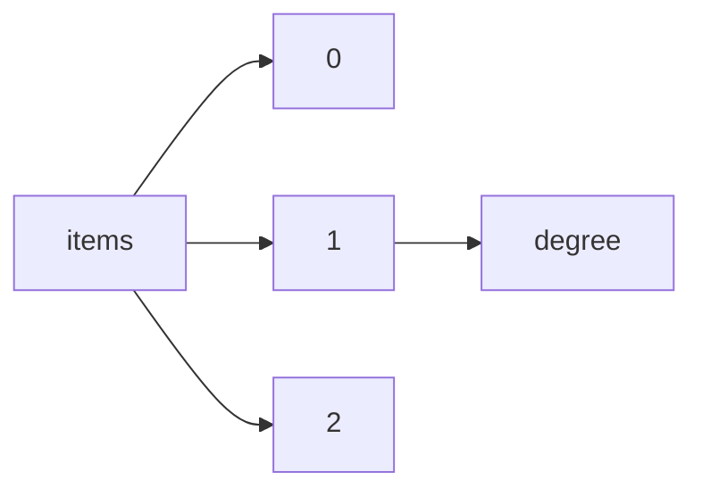

!!! warning "This document is not official Crossref documentation"
# Degree
PATH = items/array/degree(1)  
Occurs 419 028 times  
{ .annotate }

1. A route to an element, for example:  
   The route "items/array/degree" corresponds to navigating through the JSON indices as  
   ["items"][0]["degree"]  

## Properties of Array
See information about elements: [items/array/degree/array](array/index.md)  
Distribution of lengths:  

| **Row** | **Length** `Any` | **Count** `Int64` |
|--------:|--------------------:|---------------------:|
| **1**   | 1                   | 419 028              |

