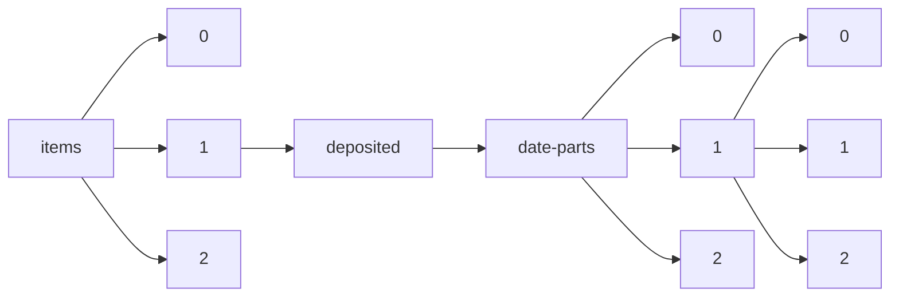

!!! warning "This document is not official Crossref documentation"
# Elements
PATH = items/array/deposited/date-parts/array/array(1)  
Occurs 430 500 717 times  
Unique values: 48  
{ .annotate }

1. A route to an element, for example:  
   The route "items/array/deposited/date-parts/array/array" corresponds to navigating through the JSON indices as  
   ["items"][0]["deposited"]["date-parts"][0][0]  

| **Row** | **Value** `Int64` | **Count** `Int64` |
|--------:|---------------------:|---------------------:|
| **1**   | 2 021                | 33 407 334           |
| **2**   | 2 022                | 24 338 343           |
| **3**   | 2 019                | 22 991 132           |
| **4**   | 4                    | 20 198 710           |
| **5**   | 5                    | 20 188 911           |
| **6**   | 3                    | 18 031 642           |
| **7**   | 6                    | 17 769 458           |
| **8**   | 2 020                | 17 439 085           |
| **9**   | 7                    | 17 396 810           |
| **10**  | 12                   | 17 207 618           |
| **11**  | 1                    | 16 995 440           |
| **12**  | 2                    | 16 614 001           |
| **13**  | 10                   | 15 274 641           |
| **14**  | 2 018                | 14 894 213           |
| **15**  | 8                    | 14 576 937           |
| **16**  | 11                   | 14 028 372           |
| **17**  | 9                    | 13 958 135           |
| **18**  | 2 017                | 10 852 459           |
| **19**  | 2 023                | 8 433 533            |
| **20**  | 23                   | 5 795 833            |
| **21**  | 22                   | 5 749 355            |
| **22**  | 2 016                | 5 321 320            |
| **23**  | 20                   | 5 295 852            |
| **24**  | 21                   | 5 234 605            |
| **25**  | 15                   | 4 907 345            |
| **26**  | 24                   | 4 837 352            |
| **27**  | 16                   | 4 642 592            |
| **28**  | 18                   | 4 456 322            |
| **29**  | 19                   | 4 370 488            |
| **30**  | 17                   | 4 297 292            |
| **31**  | 13                   | 4 282 699            |
| **32**  | 25                   | 4 253 819            |
| **33**  | 29                   | 4 225 552            |
| **34**  | 30                   | 4 177 177            |
| **35**  | 14                   | 4 153 770            |
| **36**  | 28                   | 3 994 710            |
| **37**  | 26                   | 3 991 447            |
| **38**  | 27                   | 3 963 159            |
| **39**  | 31                   | 2 130 434            |
| **40**  | 2 013                | 1 574 337            |
| **41**  | 2 015                | 1 298 143            |
| **42**  | 2 014                | 998 599              |
| **43**  | 2 012                | 750 816              |
| **44**  | 2 011                | 450 325              |
| **45**  | 2 007                | 335 031              |
| **46**  | 2 010                | 167 017              |
| **47**  | 2 009                | 151 536              |
| **48**  | 2 008                | 97 016               |

