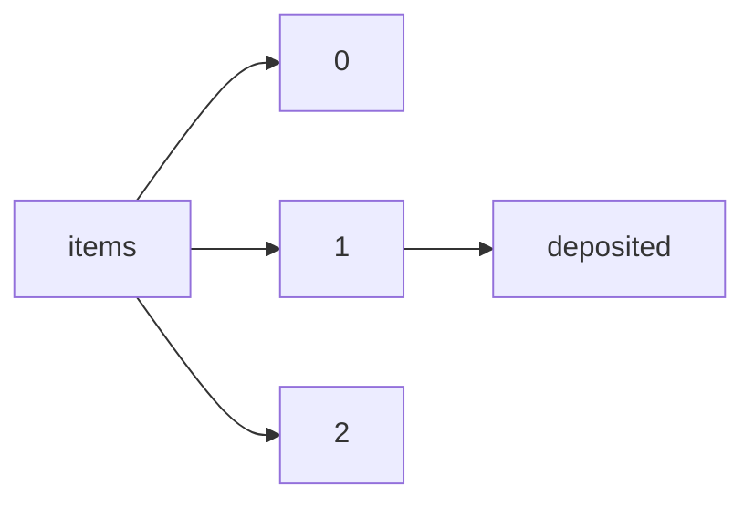

!!! warning "This document is not official Crossref documentation"
# Deposited
PATH = items/array/deposited(1)  
Occurs 143 500 239 times  
{ .annotate }

1. A route to an element, for example:  
   The route "items/array/deposited" corresponds to navigating through the JSON indices as  
   ["items"][0]["deposited"]  

## Date-parts
See more information: [items/array/deposited/date-parts](date-parts/index.md)  
Occurs 143 500 239 timess  

| **Row** | **Length** `Any` | **Count** `Int64` |
|--------:|--------------------:|---------------------:|
| **1**   | 1                   | 143 500 239          |

## Date-time
See more information: [items/array/deposited/date-time](date-time/index.md)  
Occurs 143 500 239 timess  
Unique values: > 999  

!!! note "Due to current limitations, only the first 1,000 unique values are counted."

| **Row** | **Value** `String` | **Count** `Int64` |
|--------:|----------------------:|---------------------:|
| **1**   | 2007-02-13T20:56:13Z  | 152 383              |
| **2**   | 2013-12-16T23:08:32Z  | 99 739               |
| **3**   | 2007-02-13T15:56:13Z  | 84 584               |
| **4**   | 2013-12-16T18:08:32Z  | 57 817               |
| **5**   | 2009-02-02T21:19:43Z  | 1 794                |
| **6**   | 2018-08-15T15:38:28Z  | 1 566                |
| **7**   | 2018-08-15T15:34:29Z  | 1 225                |
| **8**   | 2018-08-15T15:40:44Z  | 910                  |
| **9**   | 2018-08-15T15:38:54Z  | 888                  |
| **10**  | 2018-08-15T11:38:28Z  | 842                  |
| ... | ... | ... |

## Timestamp
See more information: [items/array/deposited/timestamp](timestamp/index.md)  
Occurs 143 500 239 timess  
Unique values: > 999  

!!! note "Due to current limitations, only the first 1,000 unique values are counted."

| **Row** | **Value** `Int64` | **Count** `Int64` |
|--------:|---------------------:|---------------------:|
| **1**   | 1 171 400 173 000    | 152 409              |
| **2**   | 1 387 235 312 000    | 99 758               |
| **3**   | 1 171 382 173 000    | 84 612               |
| **4**   | 1 387 217 312 000    | 57 817               |
| **5**   | 1 233 609 583 000    | 1 800                |
| **6**   | 1 534 347 508 000    | 1 563                |
| **7**   | 1 534 347 269 000    | 1 274                |
| **8**   | 1 534 347 644 000    | 910                  |
| **9**   | 1 534 347 534 000    | 888                  |
| **10**  | 1 534 333 108 000    | 846                  |
| ... | ... | ... |

