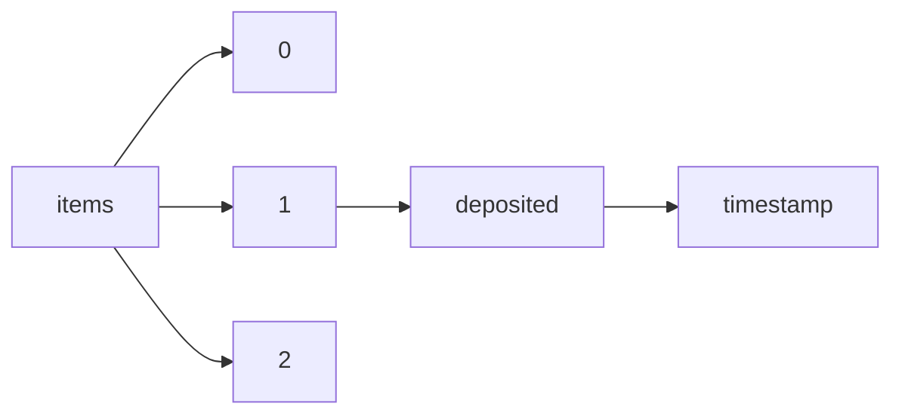

!!! warning "This document is not official Crossref documentation"
# Timestamp
PATH = items/array/deposited/timestamp(1)  
Occurs 143 500 239 times  
Unique values: > 999  
{ .annotate }

1. A route to an element, for example:  
   The route "items/array/deposited/timestamp" corresponds to navigating through the JSON indices as  
   ["items"][0]["deposited"]["timestamp"]  

!!! note "Due to current limitations, only the first 1,000 unique values are counted."

| **Row** | **Value** `Int64` | **Count** `Int64` |
|--------:|---------------------:|---------------------:|
| **1**   | 1 171 400 173 000    | 152 409              |
| **2**   | 1 387 235 312 000    | 99 758               |
| **3**   | 1 171 382 173 000    | 84 612               |
| **4**   | 1 387 217 312 000    | 57 817               |
| **5**   | 1 233 609 583 000    | 1 800                |
| **6**   | 1 534 347 508 000    | 1 563                |
| **7**   | 1 534 347 269 000    | 1 274                |
| **8**   | 1 534 347 644 000    | 910                  |
| **9**   | 1 534 347 534 000    | 888                  |
| **10**  | 1 534 333 108 000    | 846                  |
| **11**  | 1 233 591 583 000    | 631                  |
| **12**  | 1 534 333 244 000    | 614                  |
| **13**  | 1 534 332 869 000    | 541                  |
| **14**  | 1 534 347 507 000    | 534                  |
| **15**  | 1 534 333 134 000    | 530                  |
| **16**  | 1 534 347 732 000    | 480                  |
| **17**  | 1 534 347 265 000    | 421                  |
| **18**  | 1 534 347 639 000    | 419                  |
| **19**  | 1 534 347 677 000    | 381                  |
| **20**  | 1 469 635 710 000    | 369                  |
| **21**  | 1 534 347 652 000    | 361                  |
| **22**  | 1 534 333 332 000    | 322                  |
| **23**  | 1 534 333 107 000    | 317                  |
| **24**  | 1 534 347 664 000    | 289                  |
| **25**  | 1 423 890 000 000    | 262                  |
| **26**  | 1 534 333 239 000    | 221                  |
| **27**  | 1 534 332 865 000    | 211                  |
| **28**  | 1 469 635 698 000    | 201                  |
| **29**  | 1 534 347 498 000    | 198                  |
| **30**  | 1 469 635 902 000    | 177                  |
| **31**  | 1 534 347 595 000    | 177                  |
| **32**  | 1 534 333 277 000    | 169                  |
| **33**  | 1 652 201 808 000    | 164                  |
| **34**  | 1 534 347 622 000    | 163                  |
| **35**  | 1 638 218 424 000    | 162                  |
| **36**  | 1 534 333 252 000    | 161                  |
| **37**  | 1 534 347 734 000    | 158                  |
| **38**  | 1 638 216 861 000    | 158                  |
| **39**  | 1 507 211 104 000    | 154                  |
| **40**  | 1 638 218 072 000    | 152                  |
| **41**  | 1 469 635 804 000    | 149                  |
| **42**  | 1 534 333 098 000    | 139                  |
| **43**  | 1 638 216 163 000    | 137                  |
| **44**  | 1 638 218 082 000    | 136                  |
| **45**  | 1 638 218 091 000    | 135                  |
| **46**  | 1 638 218 086 000    | 134                  |
| **47**  | 1 638 217 436 000    | 132                  |
| **48**  | 1 534 347 361 000    | 132                  |
| **49**  | 1 534 347 433 000    | 130                  |
| **50**  | 1 610 494 205 000    | 130                  |
| **51**  | 1 534 333 264 000    | 130                  |
| **52**  | 1 652 197 610 000    | 129                  |
| **53**  | 1 638 216 476 000    | 127                  |
| **54**  | 1 610 494 199 000    | 126                  |
| **55**  | 1 638 218 081 000    | 125                  |
| **56**  | 1 610 494 204 000    | 124                  |
| **57**  | 1 469 635 895 000    | 124                  |
| **58**  | 1 610 493 855 000    | 122                  |
| **59**  | 1 610 494 202 000    | 122                  |
| **60**  | 1 610 494 375 000    | 121                  |
| **61**  | 1 610 494 361 000    | 121                  |
| **62**  | 1 638 218 079 000    | 120                  |
| **63**  | 1 638 216 175 000    | 119                  |
| **64**  | 1 638 218 066 000    | 119                  |
| **65**  | 1 610 494 376 000    | 118                  |
| **66**  | 1 435 110 300 000    | 118                  |
| **67**  | 1 610 495 006 000    | 118                  |
| **68**  | 1 638 217 439 000    | 118                  |
| **69**  | 1 638 218 758 000    | 117                  |
| **70**  | 1 610 495 019 000    | 117                  |
| **71**  | 1 638 218 078 000    | 117                  |
| **72**  | 1 469 635 653 000    | 116                  |
| **73**  | 1 638 218 076 000    | 115                  |
| **74**  | 1 638 218 056 000    | 115                  |
| **75**  | 1 652 202 000 000    | 115                  |
| **76**  | 1 638 218 094 000    | 114                  |
| **77**  | 1 548 541 656 000    | 114                  |
| **78**  | 1 543 087 751 000    | 114                  |
| **79**  | 1 638 218 434 000    | 113                  |
| **80**  | 1 469 635 880 000    | 113                  |
| **81**  | 1 638 216 158 000    | 113                  |
| **82**  | 1 548 543 005 000    | 113                  |
| **83**  | 1 638 218 071 000    | 113                  |
| **84**  | 1 638 218 074 000    | 113                  |
| **85**  | 1 638 216 147 000    | 111                  |
| **86**  | 1 638 218 073 000    | 111                  |
| **87**  | 1 610 494 359 000    | 111                  |
| **88**  | 1 610 494 200 000    | 110                  |
| **89**  | 1 638 217 767 000    | 110                  |
| **90**  | 1 638 218 042 000    | 109                  |
| **91**  | 1 610 494 355 000    | 109                  |
| **92**  | 1 638 218 090 000    | 108                  |
| **93**  | 1 610 494 337 000    | 108                  |
| **94**  | 1 638 216 145 000    | 108                  |
| **95**  | 1 610 495 017 000    | 108                  |
| **96**  | 1 638 218 093 000    | 107                  |
| **97**  | 1 638 218 092 000    | 107                  |
| **98**  | 1 544 664 000 000    | 107                  |
| **99**  | 1 638 218 080 000    | 106                  |
| **100** | 1 638 218 087 000    | 106                  |
| **101** | 1 638 218 059 000    | 106                  |
| **102** | 1 610 494 965 000    | 106                  |
| **103** | 1 610 495 773 000    | 105                  |
| **104** | 1 638 219 098 000    | 104                  |
| **105** | 1 638 218 089 000    | 104                  |
| **106** | 1 610 494 315 000    | 104                  |
| **107** | 1 638 218 036 000    | 104                  |
| **108** | 1 628 644 831 000    | 103                  |
| **109** | 1 638 218 054 000    | 103                  |
| **110** | 1 610 495 034 000    | 103                  |
| **111** | 1 610 495 777 000    | 102                  |
| **112** | 1 638 219 043 000    | 102                  |
| **113** | 1 469 621 310 000    | 102                  |
| **114** | 1 638 217 435 000    | 101                  |
| **115** | 1 638 218 069 000    | 101                  |
| **116** | 1 489 159 640 000    | 101                  |
| **117** | 1 549 315 502 000    | 101                  |
| **118** | 1 638 217 457 000    | 100                  |
| **119** | 1 534 347 731 000    | 100                  |
| **120** | 1 610 495 005 000    | 100                  |
| **121** | 1 469 635 889 000    | 100                  |
| **122** | 1 638 218 291 000    | 99                   |
| **123** | 1 610 494 280 000    | 99                   |
| **124** | 1 638 218 046 000    | 99                   |
| **125** | 1 638 217 441 000    | 99                   |
| **126** | 1 610 495 759 000    | 99                   |
| **127** | 1 638 217 911 000    | 99                   |
| **128** | 1 638 218 047 000    | 99                   |
| **129** | 1 544 630 051 000    | 99                   |
| **130** | 1 544 630 052 000    | 98                   |
| **131** | 1 610 494 203 000    | 98                   |
| **132** | 1 469 635 794 000    | 98                   |
| **133** | 1 638 218 038 000    | 97                   |
| **134** | 1 610 494 377 000    | 97                   |
| **135** | 1 638 218 060 000    | 97                   |
| **136** | 1 638 218 075 000    | 96                   |
| **137** | 1 638 218 050 000    | 96                   |
| **138** | 1 638 218 070 000    | 95                   |
| **139** | 1 638 218 280 000    | 95                   |
| **140** | 1 610 494 360 000    | 95                   |
| **141** | 1 638 218 116 000    | 95                   |
| **142** | 1 652 201 633 000    | 95                   |
| **143** | 1 638 218 058 000    | 94                   |
| **144** | 1 469 635 689 000    | 94                   |
| **145** | 1 638 218 044 000    | 94                   |
| **146** | 1 469 635 811 000    | 94                   |
| **147** | 1 638 218 049 000    | 94                   |
| **148** | 1 638 218 067 000    | 94                   |
| **149** | 1 638 218 055 000    | 94                   |
| **150** | 1 619 808 609 000    | 93                   |
| **151** | 1 638 218 408 000    | 93                   |
| **152** | 1 638 218 063 000    | 93                   |
| **153** | 1 638 218 041 000    | 93                   |
| **154** | 1 638 219 057 000    | 93                   |
| **155** | 1 638 216 492 000    | 93                   |
| **156** | 1 610 494 964 000    | 93                   |
| **157** | 1 638 218 084 000    | 93                   |
| **158** | 1 652 201 810 000    | 93                   |
| **159** | 1 652 201 871 000    | 92                   |
| **160** | 1 652 201 879 000    | 92                   |
| **161** | 1 638 218 279 000    | 92                   |
| **162** | 1 638 218 043 000    | 92                   |
| **163** | 1 638 218 494 000    | 92                   |
| **164** | 1 469 635 881 000    | 92                   |
| **165** | 1 638 216 183 000    | 92                   |
| **166** | 1 638 219 054 000    | 92                   |
| **167** | 1 638 216 523 000    | 91                   |
| **168** | 1 539 303 604 000    | 91                   |
| **169** | 1 638 216 178 000    | 91                   |
| **170** | 1 610 494 369 000    | 91                   |
| **171** | 1 638 219 056 000    | 91                   |
| **172** | 1 469 635 878 000    | 91                   |
| **173** | 1 610 494 312 000    | 91                   |
| **174** | 1 638 218 052 000    | 91                   |
| **175** | 1 610 494 378 000    | 90                   |
| **176** | 1 638 217 442 000    | 90                   |
| **177** | 1 652 197 252 000    | 90                   |
| **178** | 1 610 494 358 000    | 90                   |
| **179** | 1 610 494 339 000    | 90                   |
| **180** | 1 628 644 837 000    | 89                   |
| **181** | 1 638 217 456 000    | 89                   |
| **182** | 1 658 261 921 000    | 89                   |
| **183** | 1 638 218 037 000    | 88                   |
| **184** | 1 544 664 001 000    | 88                   |
| **185** | 1 638 217 438 000    | 88                   |
| **186** | 1 610 495 029 000    | 88                   |
| **187** | 1 610 493 768 000    | 88                   |
| **188** | 1 638 218 117 000    | 88                   |
| **189** | 1 610 494 198 000    | 88                   |
| **190** | 1 549 315 503 000    | 87                   |
| **191** | 1 638 218 757 000    | 87                   |
| **192** | 1 652 197 615 000    | 87                   |
| **193** | 1 628 644 838 000    | 87                   |
| **194** | 1 610 494 374 000    | 87                   |
| **195** | 1 638 218 764 000    | 87                   |
| **196** | 1 610 494 356 000    | 86                   |
| **197** | 1 610 494 373 000    | 86                   |
| **198** | 1 638 218 062 000    | 86                   |
| **199** | 1 638 216 153 000    | 86                   |
| **200** | 1 652 201 851 000    | 85                   |
| **201** | 1 610 495 008 000    | 85                   |
| **202** | 1 638 219 042 000    | 85                   |
| **203** | 1 610 494 481 000    | 85                   |
| **204** | 1 638 218 083 000    | 85                   |
| **205** | 1 638 218 088 000    | 85                   |
| **206** | 1 488 648 514 000    | 84                   |
| **207** | 1 489 159 639 000    | 84                   |
| **208** | 1 638 218 045 000    | 84                   |
| **209** | 1 610 495 032 000    | 84                   |
| **210** | 1 489 177 701 000    | 84                   |
| **211** | 1 638 218 125 000    | 83                   |
| **212** | 1 401 210 946 000    | 83                   |
| **213** | 1 610 495 307 000    | 83                   |
| **214** | 1 534 347 663 000    | 83                   |
| **215** | 1 638 218 064 000    | 83                   |
| **216** | 1 638 217 437 000    | 83                   |
| **217** | 1 548 265 801 000    | 83                   |
| **218** | 1 610 494 332 000    | 83                   |
| **219** | 1 638 218 053 000    | 82                   |
| **220** | 1 638 218 335 000    | 82                   |
| **221** | 1 610 495 009 000    | 81                   |
| **222** | 1 469 635 695 000    | 81                   |
| **223** | 1 610 495 297 000    | 81                   |
| **224** | 1 610 494 313 000    | 81                   |
| **225** | 1 638 218 057 000    | 81                   |
| **226** | 1 610 495 305 000    | 81                   |
| **227** | 1 534 347 661 000    | 81                   |
| **228** | 1 638 218 068 000    | 80                   |
| **229** | 1 638 218 061 000    | 80                   |
| **230** | 1 628 644 836 000    | 80                   |
| **231** | 1 619 808 611 000    | 80                   |
| **232** | 1 638 216 438 000    | 80                   |
| **233** | 1 489 177 699 000    | 80                   |
| **234** | 1 628 644 832 000    | 79                   |
| **235** | 1 638 216 146 000    | 79                   |
| **236** | 1 546 673 132 000    | 79                   |
| **237** | 1 469 635 886 000    | 79                   |
| **238** | 1 534 347 643 000    | 79                   |
| **239** | 1 610 495 018 000    | 79                   |
| **240** | 1 610 494 372 000    | 79                   |
| **241** | 1 638 217 440 000    | 79                   |
| **242** | 1 638 217 450 000    | 78                   |
| **243** | 1 638 216 489 000    | 78                   |
| **244** | 1 610 494 301 000    | 78                   |
| **245** | 1 610 487 862 000    | 78                   |
| **246** | 1 638 218 272 000    | 78                   |
| **247** | 1 652 197 641 000    | 78                   |
| **248** | 1 488 648 508 000    | 78                   |
| **249** | 1 610 495 010 000    | 78                   |
| **250** | 1 638 218 065 000    | 77                   |
| **251** | 1 610 495 187 000    | 77                   |
| **252** | 1 638 218 106 000    | 77                   |
| **253** | 1 652 197 642 000    | 77                   |
| **254** | 1 610 495 035 000    | 77                   |
| **255** | 1 638 219 051 000    | 77                   |
| **256** | 1 610 494 490 000    | 76                   |
| **257** | 1 610 494 963 000    | 76                   |
| **258** | 1 652 201 852 000    | 76                   |
| **259** | 1 610 494 229 000    | 76                   |
| **260** | 1 638 218 756 000    | 76                   |
| **261** | 1 619 808 610 000    | 75                   |
| **262** | 1 652 201 998 000    | 75                   |
| **263** | 1 638 218 040 000    | 75                   |
| **264** | 1 638 218 028 000    | 74                   |
| **265** | 1 610 490 799 000    | 74                   |
| **266** | 1 638 216 240 000    | 74                   |
| **267** | 1 678 372 555 000    | 74                   |
| **268** | 1 488 648 501 000    | 74                   |
| **269** | 1 652 201 632 000    | 74                   |
| **270** | 1 534 347 230 000    | 74                   |
| **271** | 1 534 347 726 000    | 74                   |
| **272** | 1 652 201 629 000    | 73                   |
| **273** | 1 638 216 509 000    | 73                   |
| **274** | 1 619 808 613 000    | 73                   |
| **275** | 1 652 197 271 000    | 73                   |
| **276** | 1 610 495 753 000    | 73                   |
| **277** | 1 652 197 250 000    | 73                   |
| **278** | 1 638 218 765 000    | 73                   |
| **279** | 1 638 218 275 000    | 73                   |
| **280** | 1 423 872 000 000    | 73                   |
| **281** | 1 469 635 809 000    | 73                   |
| **282** | 1 610 494 971 000    | 72                   |
| **283** | 1 610 492 979 000    | 72                   |
| **284** | 1 547 004 468 000    | 72                   |
| **285** | 1 628 644 972 000    | 72                   |
| **286** | 1 638 218 432 000    | 72                   |
| **287** | 1 638 218 383 000    | 72                   |
| **288** | 1 489 177 703 000    | 72                   |
| **289** | 1 638 216 293 000    | 72                   |
| **290** | 1 638 216 325 000    | 71                   |
| **291** | 1 652 197 612 000    | 71                   |
| **292** | 1 435 107 758 000    | 71                   |
| **293** | 1 488 648 498 000    | 71                   |
| **294** | 1 652 201 749 000    | 71                   |
| **295** | 1 456 414 536 000    | 71                   |
| **296** | 1 488 641 310 000    | 71                   |
| **297** | 1 610 487 013 000    | 71                   |
| **298** | 1 638 218 077 000    | 71                   |
| **299** | 1 488 648 450 000    | 70                   |
| **300** | 1 652 197 275 000    | 70                   |
| **301** | 1 610 494 224 000    | 70                   |
| **302** | 1 610 494 305 000    | 70                   |
| **303** | 1 547 879 130 000    | 70                   |
| **304** | 1 638 218 127 000    | 70                   |
| **305** | 1 610 494 432 000    | 70                   |
| **306** | 1 638 218 035 000    | 70                   |
| **307** | 1 652 197 269 000    | 70                   |
| **308** | 1 610 494 333 000    | 70                   |
| **309** | 1 610 494 188 000    | 70                   |
| **310** | 1 610 494 328 000    | 70                   |
| **311** | 1 610 494 306 000    | 70                   |
| **312** | 1 652 197 253 000    | 69                   |
| **313** | 1 610 494 324 000    | 69                   |
| **314** | 1 610 494 330 000    | 69                   |
| **315** | 1 610 494 338 000    | 69                   |
| **316** | 1 638 217 809 000    | 69                   |
| **317** | 1 534 347 346 000    | 69                   |
| **318** | 1 610 494 515 000    | 68                   |
| **319** | 1 638 218 761 000    | 68                   |
| **320** | 1 638 219 077 000    | 68                   |
| **321** | 1 638 218 048 000    | 68                   |
| **322** | 1 539 303 603 000    | 68                   |
| **323** | 1 652 197 255 000    | 68                   |
| **324** | 1 488 634 277 000    | 68                   |
| **325** | 1 544 662 551 000    | 68                   |
| **326** | 1 638 219 049 000    | 68                   |
| **327** | 1 638 216 236 000    | 68                   |
| **328** | 1 610 494 319 000    | 68                   |
| **329** | 1 610 488 359 000    | 67                   |
| **330** | 1 610 494 335 000    | 67                   |
| **331** | 1 610 494 357 000    | 67                   |
| **332** | 1 610 487 009 000    | 67                   |
| **333** | 1 610 493 868 000    | 67                   |
| **334** | 1 638 219 041 000    | 67                   |
| **335** | 1 638 216 490 000    | 67                   |
| **336** | 1 610 495 021 000    | 67                   |
| **337** | 1 534 347 681 000    | 67                   |
| **338** | 1 610 495 020 000    | 67                   |
| **339** | 1 638 218 290 000    | 67                   |
| **340** | 1 489 177 697 000    | 67                   |
| **341** | 1 638 217 517 000    | 67                   |
| **342** | 1 489 159 641 000    | 67                   |
| **343** | 1 619 808 612 000    | 66                   |
| **344** | 1 610 494 499 000    | 66                   |
| **345** | 1 610 492 685 000    | 66                   |
| **346** | 1 638 218 762 000    | 66                   |
| **347** | 1 488 648 456 000    | 66                   |
| **348** | 1 638 218 262 000    | 66                   |
| **349** | 1 543 485 361 000    | 66                   |
| **350** | 1 488 637 650 000    | 66                   |
| **351** | 1 610 492 968 000    | 66                   |
| **352** | 1 222 436 871 000    | 66                   |
| **353** | 1 678 372 554 000    | 66                   |
| **354** | 1 652 201 408 000    | 66                   |
| **355** | 1 469 635 884 000    | 65                   |
| **356** | 1 638 218 228 000    | 65                   |
| **357** | 1 638 218 285 000    | 65                   |
| **358** | 1 610 487 012 000    | 65                   |
| **359** | 1 610 494 189 000    | 65                   |
| **360** | 1 610 493 938 000    | 65                   |
| **361** | 1 610 491 352 000    | 65                   |
| **362** | 1 539 302 085 000    | 65                   |
| **363** | 1 610 495 417 000    | 65                   |
| **364** | 1 469 635 792 000    | 65                   |
| **365** | 1 638 218 293 000    | 65                   |
| **366** | 1 469 635 790 000    | 64                   |
| **367** | 1 610 495 406 000    | 64                   |
| **368** | 1 652 201 630 000    | 64                   |
| **369** | 1 652 201 781 000    | 64                   |
| **370** | 1 610 491 481 000    | 64                   |
| **371** | 1 610 495 007 000    | 64                   |
| **372** | 1 638 218 287 000    | 64                   |
| **373** | 1 652 197 256 000    | 64                   |
| **374** | 1 652 197 254 000    | 64                   |
| **375** | 1 638 217 463 000    | 64                   |
| **376** | 1 469 635 787 000    | 64                   |
| **377** | 1 658 094 815 000    | 64                   |
| **378** | 1 610 494 557 000    | 64                   |
| **379** | 1 638 218 111 000    | 64                   |
| **380** | 1 489 177 700 000    | 63                   |
| **381** | 1 638 218 277 000    | 63                   |
| **382** | 1 638 218 098 000    | 63                   |
| **383** | 1 638 218 766 000    | 63                   |
| **384** | 1 610 493 939 000    | 63                   |
| **385** | 1 652 201 873 000    | 63                   |
| **386** | 1 610 494 429 000    | 63                   |
| **387** | 1 610 494 164 000    | 63                   |
| **388** | 1 610 494 321 000    | 62                   |
| **389** | 1 652 201 838 000    | 62                   |
| **390** | 1 638 218 332 000    | 62                   |
| **391** | 1 558 491 713 000    | 62                   |
| **392** | 1 488 626 881 000    | 62                   |
| **393** | 1 610 494 323 000    | 62                   |
| **394** | 1 638 218 619 000    | 62                   |
| **395** | 1 610 494 309 000    | 62                   |
| **396** | 1 610 494 322 000    | 62                   |
| **397** | 1 678 372 549 000    | 62                   |
| **398** | 1 469 635 796 000    | 62                   |
| **399** | 1 638 218 706 000    | 62                   |
| **400** | 1 489 177 705 000    | 62                   |
| **401** | 1 678 372 548 000    | 62                   |
| **402** | 1 638 218 498 000    | 62                   |
| **403** | 1 610 495 452 000    | 62                   |
| **404** | 1 469 635 700 000    | 62                   |
| **405** | 1 638 219 102 000    | 61                   |
| **406** | 1 610 495 655 000    | 61                   |
| **407** | 1 638 217 979 000    | 61                   |
| **408** | 1 638 217 969 000    | 61                   |
| **409** | 1 638 218 003 000    | 61                   |
| **410** | 1 610 494 166 000    | 61                   |
| **411** | 1 652 201 405 000    | 61                   |
| **412** | 1 652 201 837 000    | 61                   |
| **413** | 1 610 494 336 000    | 61                   |
| **414** | 1 544 630 053 000    | 61                   |
| **415** | 1 638 216 321 000    | 61                   |
| **416** | 1 610 493 986 000    | 61                   |
| **417** | 1 652 201 828 000    | 61                   |
| **418** | 1 610 494 186 000    | 61                   |
| **419** | 1 489 177 698 000    | 61                   |
| **420** | 1 610 494 431 000    | 60                   |
| **421** | 1 610 494 667 000    | 60                   |
| **422** | 1 638 218 267 000    | 60                   |
| **423** | 1 507 196 704 000    | 60                   |
| **424** | 1 638 216 209 000    | 60                   |
| **425** | 1 539 303 601 000    | 60                   |
| **426** | 1 638 217 462 000    | 60                   |
| **427** | 1 558 490 003 000    | 60                   |
| **428** | 1 489 177 704 000    | 60                   |
| **429** | 1 610 494 317 000    | 60                   |
| **430** | 1 638 217 800 000    | 60                   |
| **431** | 1 642 005 212 000    | 60                   |
| **432** | 1 610 494 563 000    | 60                   |
| **433** | 1 610 487 857 000    | 60                   |
| **434** | 1 610 495 758 000    | 60                   |
| **435** | 1 610 494 320 000    | 59                   |
| **436** | 1 610 494 303 000    | 59                   |
| **437** | 1 638 218 039 000    | 59                   |
| **438** | 1 610 487 851 000    | 59                   |
| **439** | 1 469 635 788 000    | 59                   |
| **440** | 1 469 635 818 000    | 59                   |
| **441** | 1 642 003 267 000    | 59                   |
| **442** | 1 652 197 600 000    | 59                   |
| **443** | 1 469 635 899 000    | 59                   |
| **444** | 1 638 218 051 000    | 59                   |
| **445** | 1 652 197 309 000    | 59                   |
| **446** | 1 558 491 714 000    | 59                   |
| **447** | 1 469 635 755 000    | 59                   |
| **448** | 1 638 218 767 000    | 58                   |
| **449** | 1 652 197 457 000    | 58                   |
| **450** | 1 469 635 909 000    | 58                   |
| **451** | 1 469 635 869 000    | 58                   |
| **452** | 1 638 218 265 000    | 58                   |
| **453** | 1 638 218 109 000    | 58                   |
| **454** | 1 656 453 104 000    | 58                   |
| **455** | 1 652 197 251 000    | 58                   |
| **456** | 1 652 197 592 000    | 58                   |
| **457** | 1 469 621 495 000    | 58                   |
| **458** | 1 610 494 421 000    | 58                   |
| **459** | 1 539 302 084 000    | 58                   |
| **460** | 1 489 260 544 000    | 58                   |
| **461** | 1 642 003 275 000    | 58                   |
| **462** | 1 638 218 288 000    | 58                   |
| **463** | 1 548 674 407 000    | 58                   |
| **464** | 1 488 763 656 000    | 58                   |
| **465** | 1 558 288 849 000    | 58                   |
| **466** | 1 610 494 928 000    | 58                   |
| **467** | 1 489 177 706 000    | 58                   |
| **468** | 1 652 201 416 000    | 57                   |
| **469** | 1 488 641 307 000    | 57                   |
| **470** | 1 610 495 724 000    | 57                   |
| **471** | 1 638 219 174 000    | 57                   |
| **472** | 1 558 498 553 000    | 57                   |
| **473** | 1 610 487 011 000    | 57                   |
| **474** | 1 534 347 272 000    | 57                   |
| **475** | 1 642 005 892 000    | 57                   |
| **476** | 1 638 216 230 000    | 57                   |
| **477** | 1 638 218 085 000    | 57                   |
| **478** | 1 469 635 879 000    | 57                   |
| **479** | 1 638 218 259 000    | 57                   |
| **480** | 1 610 495 723 000    | 57                   |
| **481** | 1 558 478 490 000    | 57                   |
| **482** | 1 610 495 650 000    | 57                   |
| **483** | 1 610 494 962 000    | 57                   |
| **484** | 1 610 487 006 000    | 57                   |
| **485** | 1 672 835 476 000    | 57                   |
| **486** | 1 638 219 076 000    | 57                   |
| **487** | 1 610 495 519 000    | 57                   |
| **488** | 1 610 494 278 000    | 57                   |
| **489** | 1 610 493 024 000    | 56                   |
| **490** | 1 610 495 821 000    | 56                   |
| **491** | 1 610 494 161 000    | 56                   |
| **492** | 1 559 584 645 000    | 56                   |
| **493** | 1 638 218 261 000    | 56                   |
| **494** | 1 642 005 210 000    | 56                   |
| **495** | 1 638 219 044 000    | 56                   |
| **496** | 1 610 494 485 000    | 56                   |
| **497** | 1 638 218 227 000    | 56                   |
| **498** | 1 652 197 370 000    | 56                   |
| **499** | 1 610 490 947 000    | 56                   |
| **500** | 1 638 216 182 000    | 56                   |
| **501** | 1 610 494 668 000    | 56                   |
| **502** | 1 610 495 011 000    | 56                   |
| **503** | 1 488 648 482 000    | 56                   |
| **504** | 1 638 218 264 000    | 56                   |
| **505** | 1 652 197 702 000    | 56                   |
| **506** | 1 488 655 707 000    | 56                   |
| **507** | 1 610 495 820 000    | 55                   |
| **508** | 1 642 003 266 000    | 55                   |
| **509** | 1 638 218 785 000    | 55                   |
| **510** | 1 548 543 003 000    | 55                   |
| **511** | 1 638 218 114 000    | 55                   |
| **512** | 1 558 229 589 000    | 55                   |
| **513** | 1 489 177 702 000    | 55                   |
| **514** | 1 610 494 370 000    | 55                   |
| **515** | 1 638 217 798 000    | 55                   |
| **516** | 1 619 808 608 000    | 55                   |
| **517** | 1 488 648 518 000    | 55                   |
| **518** | 1 610 494 218 000    | 55                   |
| **519** | 1 610 487 455 000    | 55                   |
| **520** | 1 610 494 961 000    | 55                   |
| **521** | 1 638 218 409 000    | 55                   |
| **522** | 1 610 493 769 000    | 55                   |
| **523** | 1 610 495 649 000    | 55                   |
| **524** | 1 638 218 728 000    | 55                   |
| **525** | 1 610 487 844 000    | 55                   |
| **526** | 1 658 094 441 000    | 54                   |
| **527** | 1 638 218 103 000    | 54                   |
| **528** | 1 638 218 524 000    | 54                   |
| **529** | 1 610 495 299 000    | 54                   |
| **530** | 1 652 201 850 000    | 54                   |
| **531** | 1 610 495 368 000    | 54                   |
| **532** | 1 638 218 487 000    | 54                   |
| **533** | 1 642 005 917 000    | 54                   |
| **534** | 1 489 141 641 000    | 54                   |
| **535** | 1 610 495 518 000    | 54                   |
| **536** | 1 638 218 527 000    | 54                   |
| **537** | 1 652 197 273 000    | 54                   |
| **538** | 1 638 218 755 000    | 54                   |
| **539** | 1 488 641 311 000    | 54                   |
| **540** | 1 488 648 459 000    | 54                   |
| **541** | 1 610 494 405 000    | 54                   |
| **542** | 1 488 641 314 000    | 54                   |
| **543** | 1 610 494 979 000    | 54                   |
| **544** | 1 610 487 839 000    | 53                   |
| **545** | 1 652 197 322 000    | 53                   |
| **546** | 1 610 495 667 000    | 53                   |
| **547** | 1 638 218 096 000    | 53                   |
| **548** | 1 610 495 169 000    | 53                   |
| **549** | 1 658 262 186 000    | 53                   |
| **550** | 1 622 741 143 000    | 53                   |
| **551** | 1 610 487 846 000    | 53                   |
| **552** | 1 652 201 868 000    | 53                   |
| **553** | 1 610 494 340 000    | 53                   |
| **554** | 1 610 494 613 000    | 53                   |
| **555** | 1 610 494 674 000    | 53                   |
| **556** | 1 610 493 940 000    | 53                   |
| **557** | 1 488 648 516 000    | 53                   |
| **558** | 1 558 299 300 000    | 53                   |
| **559** | 1 610 495 744 000    | 53                   |
| **560** | 1 610 487 849 000    | 53                   |
| **561** | 1 638 218 382 000    | 53                   |
| **562** | 1 610 494 368 000    | 53                   |
| **563** | 1 610 487 868 000    | 53                   |
| **564** | 1 558 505 822 000    | 53                   |
| **565** | 1 638 218 234 000    | 53                   |
| **566** | 1 610 487 456 000    | 52                   |
| **567** | 1 610 495 648 000    | 52                   |
| **568** | 1 544 612 052 000    | 52                   |
| **569** | 1 638 218 526 000    | 52                   |
| **570** | 1 652 197 266 000    | 52                   |
| **571** | 1 658 262 260 000    | 52                   |
| **572** | 1 610 488 527 000    | 52                   |
| **573** | 1 610 492 546 000    | 52                   |
| **574** | 1 638 217 769 000    | 52                   |
| **575** | 1 638 219 085 000    | 52                   |
| **576** | 1 610 496 024 000    | 52                   |
| **577** | 1 539 303 602 000    | 52                   |
| **578** | 1 488 641 309 000    | 52                   |
| **579** | 1 610 494 334 000    | 52                   |
| **580** | 1 610 487 834 000    | 52                   |
| **581** | 1 652 197 247 000    | 52                   |
| **582** | 1 548 247 801 000    | 52                   |
| **583** | 1 610 490 800 000    | 52                   |
| **584** | 1 638 218 316 000    | 52                   |
| **585** | 1 610 494 671 000    | 52                   |
| **586** | 1 610 491 024 000    | 52                   |
| **587** | 1 638 218 099 000    | 51                   |
| **588** | 1 548 247 800 000    | 51                   |
| **589** | 1 642 005 929 000    | 51                   |
| **590** | 1 610 494 960 000    | 51                   |
| **591** | 1 610 494 341 000    | 51                   |
| **592** | 1 488 648 464 000    | 51                   |
| **593** | 1 489 159 699 000    | 51                   |
| **594** | 1 610 494 222 000    | 51                   |
| **595** | 1 610 487 005 000    | 51                   |
| **596** | 1 469 635 703 000    | 51                   |
| **597** | 1 489 246 122 000    | 51                   |
| **598** | 1 610 494 228 000    | 51                   |
| **599** | 1 638 218 754 000    | 51                   |
| **600** | 1 638 218 110 000    | 50                   |
| **601** | 1 610 489 498 000    | 50                   |
| **602** | 1 558 489 995 000    | 50                   |
| **603** | 1 610 495 976 000    | 50                   |
| **604** | 1 489 141 639 000    | 50                   |
| **605** | 1 610 493 767 000    | 50                   |
| **606** | 1 610 495 178 000    | 50                   |
| **607** | 1 534 332 961 000    | 50                   |
| **608** | 1 558 489 996 000    | 50                   |
| **609** | 1 638 219 045 000    | 50                   |
| **610** | 1 610 492 533 000    | 50                   |
| **611** | 1 638 218 474 000    | 50                   |
| **612** | 1 546 673 131 000    | 50                   |
| **613** | 1 638 218 528 000    | 50                   |
| **614** | 1 558 234 648 000    | 49                   |
| **615** | 1 638 217 432 000    | 49                   |
| **616** | 1 656 602 299 000    | 49                   |
| **617** | 1 638 218 426 000    | 49                   |
| **618** | 1 548 265 800 000    | 49                   |
| **619** | 1 610 487 843 000    | 49                   |
| **620** | 1 610 494 219 000    | 49                   |
| **621** | 1 638 219 106 000    | 49                   |
| **622** | 1 558 299 165 000    | 49                   |
| **623** | 1 456 553 871 000    | 49                   |
| **624** | 1 610 495 754 000    | 49                   |
| **625** | 1 642 003 292 000    | 49                   |
| **626** | 1 638 219 053 000    | 49                   |
| **627** | 1 610 487 007 000    | 49                   |
| **628** | 1 558 490 001 000    | 49                   |
| **629** | 1 610 494 227 000    | 49                   |
| **630** | 1 488 641 313 000    | 49                   |
| **631** | 1 488 648 497 000    | 49                   |
| **632** | 1 554 287 244 000    | 49                   |
| **633** | 1 638 219 092 000    | 48                   |
| **634** | 1 559 051 188 000    | 48                   |
| **635** | 1 559 584 644 000    | 48                   |
| **636** | 1 638 218 268 000    | 48                   |
| **637** | 1 642 005 193 000    | 48                   |
| **638** | 1 610 494 190 000    | 48                   |
| **639** | 1 489 141 640 000    | 48                   |
| **640** | 1 488 641 306 000    | 48                   |
| **641** | 1 610 492 901 000    | 48                   |
| **642** | 1 622 741 144 000    | 48                   |
| **643** | 1 610 487 004 000    | 48                   |
| **644** | 1 610 492 544 000    | 48                   |
| **645** | 1 610 492 759 000    | 48                   |
| **646** | 1 610 494 316 000    | 48                   |
| **647** | 1 638 218 095 000    | 47                   |
| **648** | 1 610 495 745 000    | 47                   |
| **649** | 1 488 518 914 000    | 47                   |
| **650** | 1 488 648 509 000    | 47                   |
| **651** | 1 652 197 369 000    | 47                   |
| **652** | 1 638 218 283 000    | 47                   |
| **653** | 1 489 282 079 000    | 47                   |
| **654** | 1 652 201 793 000    | 47                   |
| **655** | 1 638 218 104 000    | 47                   |
| **656** | 1 638 219 298 000    | 47                   |
| **657** | 1 557 258 705 000    | 47                   |
| **658** | 1 489 159 698 000    | 46                   |
| **659** | 1 456 164 208 000    | 46                   |
| **660** | 1 638 218 270 000    | 46                   |
| **661** | 1 638 216 786 000    | 46                   |
| **662** | 1 557 258 703 000    | 46                   |
| **663** | 1 558 554 295 000    | 46                   |
| **664** | 1 554 306 966 000    | 46                   |
| **665** | 1 610 494 501 000    | 46                   |
| **666** | 1 638 218 130 000    | 46                   |
| **667** | 1 638 218 422 000    | 46                   |
| **668** | 1 488 623 307 000    | 46                   |
| **669** | 1 652 201 834 000    | 46                   |
| **670** | 1 652 197 429 000    | 46                   |
| **671** | 1 610 494 221 000    | 45                   |
| **672** | 1 610 494 225 000    | 45                   |
| **673** | 1 610 494 002 000    | 45                   |
| **674** | 1 489 159 697 000    | 45                   |
| **675** | 1 610 494 331 000    | 45                   |
| **676** | 1 638 218 372 000    | 45                   |
| **677** | 1 554 279 342 000    | 45                   |
| **678** | 1 488 979 677 000    | 45                   |
| **679** | 1 559 116 140 000    | 45                   |
| **680** | 1 489 282 080 000    | 45                   |
| **681** | 1 489 328 869 000    | 45                   |
| **682** | 1 638 217 422 000    | 45                   |
| **683** | 1 610 493 736 000    | 45                   |
| **684** | 1 678 372 612 000    | 45                   |
| **685** | 1 652 197 315 000    | 44                   |
| **686** | 1 610 494 187 000    | 44                   |
| **687** | 1 554 828 423 000    | 44                   |
| **688** | 1 488 641 318 000    | 44                   |
| **689** | 1 652 197 324 000    | 44                   |
| **690** | 1 638 218 237 000    | 44                   |
| **691** | 1 652 197 244 000    | 44                   |
| **692** | 1 610 487 052 000    | 44                   |
| **693** | 1 488 979 676 000    | 44                   |
| **694** | 1 456 414 537 000    | 44                   |
| **695** | 1 489 159 642 000    | 44                   |
| **696** | 1 610 491 289 000    | 44                   |
| **697** | 1 610 494 226 000    | 44                   |
| **698** | 1 488 648 515 000    | 44                   |
| **699** | 1 610 486 983 000    | 44                   |
| **700** | 1 610 495 975 000    | 44                   |
| **701** | 1 534 333 033 000    | 44                   |
| **702** | 1 558 292 256 000    | 44                   |
| **703** | 1 638 217 419 000    | 44                   |
| **704** | 1 610 495 446 000    | 44                   |
| **705** | 1 638 219 097 000    | 44                   |
| **706** | 1 488 641 304 000    | 44                   |
| **707** | 1 558 489 994 000    | 44                   |
| **708** | 1 652 197 245 000    | 44                   |
| **709** | 1 610 495 524 000    | 44                   |
| **710** | 1 638 218 269 000    | 44                   |
| **711** | 1 638 218 005 000    | 43                   |
| **712** | 1 652 197 276 000    | 43                   |
| **713** | 1 488 641 308 000    | 43                   |
| **714** | 1 642 003 245 000    | 43                   |
| **715** | 1 638 218 410 000    | 43                   |
| **716** | 1 610 495 159 000    | 43                   |
| **717** | 1 559 595 008 000    | 43                   |
| **718** | 1 638 219 349 000    | 43                   |
| **719** | 1 658 262 259 000    | 43                   |
| **720** | 1 610 494 314 000    | 43                   |
| **721** | 1 638 217 756 000    | 43                   |
| **722** | 1 558 299 299 000    | 43                   |
| **723** | 1 678 372 544 000    | 43                   |
| **724** | 1 610 494 191 000    | 43                   |
| **725** | 1 638 218 541 000    | 43                   |
| **726** | 1 638 218 163 000    | 43                   |
| **727** | 1 610 486 982 000    | 43                   |
| **728** | 1 610 494 513 000    | 43                   |
| **729** | 1 652 197 248 000    | 43                   |
| **730** | 1 488 648 494 000    | 43                   |
| **731** | 1 558 229 587 000    | 43                   |
| **732** | 1 554 287 258 000    | 43                   |
| **733** | 1 656 453 225 000    | 43                   |
| **734** | 1 558 611 863 000    | 43                   |
| **735** | 1 610 495 403 000    | 43                   |
| **736** | 1 610 487 014 000    | 43                   |
| **737** | 1 652 201 801 000    | 43                   |
| **738** | 1 559 555 189 000    | 43                   |
| **739** | 1 610 491 270 000    | 43                   |
| **740** | 1 610 491 331 000    | 42                   |
| **741** | 1 610 494 302 000    | 42                   |
| **742** | 1 679 604 552 000    | 42                   |
| **743** | 1 558 239 998 000    | 42                   |
| **744** | 1 488 641 305 000    | 42                   |
| **745** | 1 558 570 368 000    | 42                   |
| **746** | 1 488 623 306 000    | 42                   |
| **747** | 1 558 220 601 000    | 42                   |
| **748** | 1 554 783 194 000    | 42                   |
| **749** | 1 610 495 977 000    | 42                   |
| **750** | 1 558 554 294 000    | 42                   |
| **751** | 1 642 003 232 000    | 42                   |
| **752** | 1 652 201 816 000    | 42                   |
| **753** | 1 559 584 642 000    | 42                   |
| **754** | 1 558 489 997 000    | 42                   |
| **755** | 1 558 468 862 000    | 42                   |
| **756** | 1 558 468 863 000    | 42                   |
| **757** | 1 497 625 151 000    | 42                   |
| **758** | 1 610 491 253 000    | 42                   |
| **759** | 1 652 201 403 000    | 42                   |
| **760** | 1 610 494 921 000    | 42                   |
| **761** | 1 488 641 301 000    | 42                   |
| **762** | 1 610 495 451 000    | 42                   |
| **763** | 1 554 783 193 000    | 42                   |
| **764** | 1 610 487 872 000    | 41                   |
| **765** | 1 558 608 828 000    | 41                   |
| **766** | 1 652 201 635 000    | 41                   |
| **767** | 1 610 488 135 000    | 41                   |
| **768** | 1 678 372 567 000    | 41                   |
| **769** | 1 558 490 004 000    | 41                   |
| **770** | 1 610 492 729 000    | 41                   |
| **771** | 1 554 287 214 000    | 41                   |
| **772** | 1 558 478 483 000    | 41                   |
| **773** | 1 488 641 312 000    | 41                   |
| **774** | 1 558 588 620 000    | 41                   |
| **775** | 1 558 566 778 000    | 41                   |
| **776** | 1 638 218 472 000    | 41                   |
| **777** | 1 652 201 642 000    | 41                   |
| **778** | 1 558 490 002 000    | 41                   |
| **779** | 1 678 372 668 000    | 41                   |
| **780** | 1 558 288 848 000    | 41                   |
| **781** | 1 489 328 871 000    | 41                   |
| **782** | 1 554 287 269 000    | 41                   |
| **783** | 1 610 487 454 000    | 41                   |
| **784** | 1 678 372 536 000    | 40                   |
| **785** | 1 610 487 825 000    | 40                   |
| **786** | 1 610 493 725 000    | 40                   |
| **787** | 1 610 489 115 000    | 40                   |
| **788** | 1 638 218 792 000    | 40                   |
| **789** | 1 652 201 766 000    | 40                   |
| **790** | 1 610 491 113 000    | 40                   |
| **791** | 1 534 333 147 000    | 40                   |
| **792** | 1 558 229 588 000    | 40                   |
| **793** | 1 488 641 316 000    | 40                   |
| **794** | 1 610 492 542 000    | 40                   |
| **795** | 1 638 218 258 000    | 40                   |
| **796** | 1 610 492 598 000    | 40                   |
| **797** | 1 638 217 757 000    | 40                   |
| **798** | 1 638 219 283 000    | 40                   |
| **799** | 1 554 279 355 000    | 40                   |
| **800** | 1 558 468 847 000    | 40                   |
| **801** | 1 638 217 784 000    | 40                   |
| **802** | 1 610 495 920 000    | 40                   |
| **803** | 1 642 005 206 000    | 40                   |
| **804** | 1 652 201 637 000    | 40                   |
| **805** | 1 558 498 552 000    | 40                   |
| **806** | 1 610 495 913 000    | 39                   |
| **807** | 1 652 201 641 000    | 39                   |
| **808** | 1 638 218 794 000    | 39                   |
| **809** | 1 610 487 008 000    | 39                   |
| **810** | 1 642 005 962 000    | 39                   |
| **811** | 1 642 003 305 000    | 39                   |
| **812** | 1 558 489 999 000    | 39                   |
| **813** | 1 558 359 417 000    | 39                   |
| **814** | 1 638 218 811 000    | 39                   |
| **815** | 1 539 287 683 000    | 39                   |
| **816** | 1 558 353 137 000    | 39                   |
| **817** | 1 610 487 010 000    | 39                   |
| **818** | 1 488 641 303 000    | 39                   |
| **819** | 1 559 412 446 000    | 39                   |
| **820** | 1 658 262 194 000    | 39                   |
| **821** | 1 488 644 839 000    | 39                   |
| **822** | 1 638 218 744 000    | 39                   |
| **823** | 1 656 453 096 000    | 39                   |
| **824** | 1 489 246 121 000    | 39                   |
| **825** | 1 610 491 292 000    | 39                   |
| **826** | 1 554 732 908 000    | 39                   |
| **827** | 1 610 494 611 000    | 39                   |
| **828** | 1 554 287 259 000    | 39                   |
| **829** | 1 456 553 702 000    | 38                   |
| **830** | 1 554 783 196 000    | 38                   |
| **831** | 1 558 239 997 000    | 38                   |
| **832** | 1 610 491 315 000    | 38                   |
| **833** | 1 642 004 450 000    | 38                   |
| **834** | 1 638 219 016 000    | 38                   |
| **835** | 1 558 403 420 000    | 38                   |
| **836** | 1 558 489 998 000    | 38                   |
| **837** | 1 558 496 341 000    | 38                   |
| **838** | 1 638 218 999 000    | 38                   |
| **839** | 1 642 003 301 000    | 38                   |
| **840** | 1 638 218 263 000    | 38                   |
| **841** | 1 679 604 551 000    | 38                   |
| **842** | 1 638 217 775 000    | 38                   |
| **843** | 1 557 406 919 000    | 38                   |
| **844** | 1 554 287 274 000    | 38                   |
| **845** | 1 489 159 703 000    | 38                   |
| **846** | 1 557 234 054 000    | 38                   |
| **847** | 1 558 491 717 000    | 38                   |
| **848** | 1 558 642 819 000    | 38                   |
| **849** | 1 558 628 850 000    | 38                   |
| **850** | 1 558 509 760 000    | 38                   |
| **851** | 1 678 372 538 000    | 38                   |
| **852** | 1 638 219 213 000    | 38                   |
| **853** | 1 610 494 919 000    | 38                   |
| **854** | 1 652 197 377 000    | 38                   |
| **855** | 1 488 641 302 000    | 38                   |
| **856** | 1 638 218 778 000    | 37                   |
| **857** | 1 677 503 997 000    | 37                   |
| **858** | 1 652 197 368 000    | 37                   |
| **859** | 1 488 515 286 000    | 37                   |
| **860** | 1 610 495 646 000    | 37                   |
| **861** | 1 534 347 625 000    | 37                   |
| **862** | 1 610 495 004 000    | 37                   |
| **863** | 1 610 492 548 000    | 37                   |
| **864** | 1 610 490 180 000    | 37                   |
| **865** | 1 652 201 643 000    | 37                   |
| **866** | 1 642 005 202 000    | 37                   |
| **867** | 1 610 493 526 000    | 37                   |
| **868** | 1 558 629 910 000    | 37                   |
| **869** | 1 657 991 408 000    | 37                   |
| **870** | 1 658 262 225 000    | 37                   |
| **871** | 1 558 643 498 000    | 37                   |
| **872** | 1 488 641 319 000    | 37                   |
| **873** | 1 610 494 304 000    | 37                   |
| **874** | 1 515 751 630 000    | 37                   |
| **875** | 1 642 003 268 000    | 37                   |
| **876** | 1 558 505 240 000    | 37                   |
| **877** | 1 610 495 520 000    | 37                   |
| **878** | 1 554 279 354 000    | 37                   |
| **879** | 1 558 403 421 000    | 37                   |
| **880** | 1 638 218 469 000    | 37                   |
| **881** | 1 488 641 320 000    | 37                   |
| **882** | 1 554 287 221 000    | 37                   |
| **883** | 1 652 201 620 000    | 37                   |
| **884** | 1 558 609 699 000    | 37                   |
| **885** | 1 610 495 030 000    | 37                   |
| **886** | 1 638 216 473 000    | 37                   |
| **887** | 1 497 625 150 000    | 37                   |
| **888** | 1 610 494 595 000    | 37                   |
| **889** | 1 488 641 317 000    | 37                   |
| **890** | 1 652 201 815 000    | 36                   |
| **891** | 1 558 586 579 000    | 36                   |
| **892** | 1 628 644 834 000    | 36                   |
| **893** | 1 638 218 743 000    | 36                   |
| **894** | 1 558 470 956 000    | 36                   |
| **895** | 1 652 197 346 000    | 36                   |
| **896** | 1 638 219 158 000    | 36                   |
| **897** | 1 489 159 705 000    | 36                   |
| **898** | 1 652 197 409 000    | 36                   |
| **899** | 1 642 003 681 000    | 36                   |
| **900** | 1 610 494 326 000    | 36                   |
| **901** | 1 610 491 474 000    | 36                   |
| **902** | 1 557 237 404 000    | 36                   |
| **903** | 1 610 495 181 000    | 36                   |
| **904** | 1 652 201 765 000    | 36                   |
| **905** | 1 558 570 366 000    | 36                   |
| **906** | 1 610 486 980 000    | 36                   |
| **907** | 1 652 197 616 000    | 36                   |
| **908** | 1 558 490 005 000    | 36                   |
| **909** | 1 610 494 230 000    | 36                   |
| **910** | 1 534 347 280 000    | 36                   |
| **911** | 1 652 201 496 000    | 36                   |
| **912** | 1 656 453 454 000    | 36                   |
| **913** | 1 554 287 233 000    | 36                   |
| **914** | 1 610 492 543 000    | 36                   |
| **915** | 1 559 116 940 000    | 36                   |
| **916** | 1 456 414 538 000    | 36                   |
| **917** | 1 658 094 656 000    | 36                   |
| **918** | 1 638 219 105 000    | 36                   |
| **919** | 1 610 492 931 000    | 36                   |
| **920** | 1 610 494 932 000    | 36                   |
| **921** | 1 558 215 189 000    | 36                   |
| **922** | 1 488 641 321 000    | 36                   |
| **923** | 1 652 201 865 000    | 36                   |
| **924** | 1 638 219 127 000    | 36                   |
| **925** | 1 652 201 872 000    | 36                   |
| **926** | 1 610 495 353 000    | 36                   |
| **927** | 1 638 218 136 000    | 35                   |
| **928** | 1 515 751 638 000    | 35                   |
| **929** | 1 554 279 343 000    | 35                   |
| **930** | 1 558 505 823 000    | 35                   |
| **931** | 1 658 262 140 000    | 35                   |
| **932** | 1 666 192 502 000    | 35                   |
| **933** | 1 638 218 304 000    | 35                   |
| **934** | 1 610 493 809 000    | 35                   |
| **935** | 1 610 495 036 000    | 35                   |
| **936** | 1 642 003 296 000    | 35                   |
| **937** | 1 558 498 550 000    | 35                   |
| **938** | 1 638 217 460 000    | 35                   |
| **939** | 1 638 219 173 000    | 35                   |
| **940** | 1 488 623 312 000    | 35                   |
| **941** | 1 610 494 423 000    | 35                   |
| **942** | 1 554 287 247 000    | 35                   |
| **943** | 1 558 643 490 000    | 35                   |
| **944** | 1 558 643 497 000    | 35                   |
| **945** | 1 638 217 960 000    | 35                   |
| **946** | 1 610 494 981 000    | 35                   |
| **947** | 1 558 693 774 000    | 35                   |
| **948** | 1 559 109 639 000    | 35                   |
| **949** | 1 642 003 302 000    | 35                   |
| **950** | 1 642 005 197 000    | 35                   |
| **951** | 1 554 783 266 000    | 35                   |
| **952** | 1 554 732 898 000    | 35                   |
| **953** | 1 610 495 352 000    | 35                   |
| **954** | 1 638 218 305 000    | 35                   |
| **955** | 1 558 239 993 000    | 35                   |
| **956** | 1 559 103 503 000    | 35                   |
| **957** | 1 656 602 154 000    | 35                   |
| **958** | 1 610 495 819 000    | 35                   |
| **959** | 1 488 648 446 000    | 35                   |
| **960** | 1 610 494 923 000    | 35                   |
| **961** | 1 638 218 912 000    | 35                   |
| **962** | 1 554 287 245 000    | 35                   |
| **963** | 1 610 494 984 000    | 35                   |
| **964** | 1 558 468 848 000    | 35                   |
| **965** | 1 558 505 498 000    | 35                   |
| **966** | 1 610 494 163 000    | 35                   |
| **967** | 1 558 359 418 000    | 35                   |
| **968** | 1 638 217 924 000    | 35                   |
| **969** | 1 488 644 841 000    | 35                   |
| **970** | 1 548 543 001 000    | 35                   |
| **971** | 1 554 739 903 000    | 35                   |
| **972** | 1 554 287 250 000    | 35                   |
| **973** | 1 610 494 133 000    | 35                   |
| **974** | 1 554 732 912 000    | 35                   |
| **975** | 1 652 197 371 000    | 35                   |
| **976** | 1 678 372 675 000    | 35                   |
| **977** | 1 610 487 850 000    | 35                   |
| **978** | 1 638 218 257 000    | 35                   |
| **979** | 1 638 218 143 000    | 34                   |
| **980** | 1 656 453 043 000    | 34                   |
| **981** | 1 678 372 671 000    | 34                   |
| **982** | 1 652 201 404 000    | 34                   |
| **983** | 1 489 141 642 000    | 34                   |
| **984** | 1 638 218 916 000    | 34                   |
| **985** | 1 554 306 985 000    | 34                   |
| **986** | 1 638 218 385 000    | 34                   |
| **987** | 1 638 218 384 000    | 34                   |
| **988** | 1 558 403 423 000    | 34                   |
| **989** | 1 558 239 995 000    | 34                   |
| **990** | 1 652 201 563 000    | 34                   |
| **991** | 1 489 159 701 000    | 34                   |
| **992** | 1 678 372 449 000    | 34                   |
| **993** | 1 557 409 125 000    | 34                   |
| **994** | 1 558 220 602 000    | 34                   |
| **995** | 1 638 216 302 000    | 34                   |
| **996** | 1 554 287 260 000    | 34                   |
| **997** | 1 652 197 359 000    | 34                   |
| **998** | 1 558 693 773 000    | 34                   |
| **999** | 1 469 635 673 000    | 34                   |
| ... | ... | ... |

