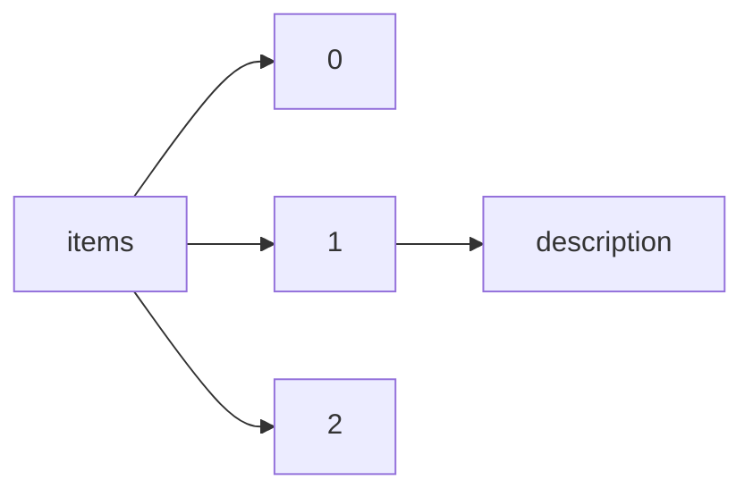

!!! warning "This document is not official Crossref documentation"
# Description
PATH = items/array/description(1)  
Occurs 1 924 823 times  
Unique values: > 999  
{ .annotate }

1. A route to an element, for example:  
   The route "items/array/description" corresponds to navigating through the JSON indices as  
   ["items"][0]["description"]  

!!! note "Due to current limitations, strings longer than 1,000 characters are truncated, which may lead to inaccurate calculations."

!!! note "Due to current limitations, only the first 1,000 unique values are counted."

| **Row** | **Value** `String`                                                                                   | **Count** `Int64` |
|--------:|--------------------------------------------------------------------------------------------------------:|---------------------:|
| **1**   | x-ray diffraction structure                                                                             | 177 078              |
| **2**   | Structure factors: contains datablocks I                                                                | 46 350               |
| **3**   | Supplementary materials                                                                                 | 26 686               |
| **4**   | Crystal structure: contains datablocks global, I                                                        | 22 494               |
| **5**   | Supplementary material                                                                                  | 20 287               |
| **6**   | Crystal structure: contains datablocks I, global                                                        | 17 872               |
| **7**   | supplement file to the article                                                                          | 16 350               |
| **8**   | electron microscopy structure                                                                           | 15 402               |
| **9**   | solution nmr structure                                                                                  | 11 465               |
| **10**  | Supplementary data                                                                                      | 9 943                |
| **11**  | Supplemental data                                                                                       | 8 421                |
| **12**  | Supplemental File                                                                                       | 7 019                |
| **13**  | This assessment has been regenerated.                                                                   | 2 974                |
| **14**  | Drug                                                                                                    | 2 888                |
| **15**  | Supplementary file 1                                                                                    | 2 860                |
| **16**  | Authorea status: Preprint                                                                               | 2 808                |
| **17**  | solution nmr                                                                                            | 2 512                |
| **18**  | Crystal structure: contains datablocks I                                                                | 2 401                |
| **19**  | Description not available                                                                               | 2 363                |
| **20**  | Structure factors: contains datablocks II                                                               | 2 173                |
| **21**  | theoretical model structure                                                                             | 1 377                |
| **22**  | Multi-media file                                                                                        | 1 218                |
| **23**  | Supplementary file 2                                                                                    | 988                  |
| **24**  | 2019                                                                                                    | 967                  |
| **25**  | 2018                                                                                                    | 919                  |
| **26**  | Crystal structure: contains datablocks global, I, II                                                    | 661                  |
| **27**  | Crystal structure: contains datablocks I, New\_Global\_Publ\_Block                                      | 651                  |
| **28**  | Structure factors: contains datablocks III                                                              | 647                  |
| **29**  | Treatment summary                                                                                       | 632                  |
| **30**  | 2017                                                                                                    | 631                  |
| **31**  | Spot Date Range: 900BC - 500BC\n          Ceramics Class: Impasto                                       | 591                  |
| **32**  | Supplementary file 3                                                                                    | 511                  |
| **33**  | Nelson and Olive Sandgren papers - Sabbatical to Europe Slides - 1967-1968                              | 482                  |
| **34**  | Crystal structure: contains datablocks I, II, global                                                    | 427                  |
| **35**  | OECDPublishing                                                                                          | 424                  |
| **36**  | Structure factors: contains datablocks 1                                                                | 418                  |
| **37**  | single-crystal x-ray diffraction structure                                                              | 417                  |
| **38**  | France                                                                                                  | 404                  |
| **39**  | corrigendum to the article                                                                              | 387                  |
| **40**  | Structure factors: contains datablocks                                                                  | 376                  |
| **41**  | OECD Publishing                                                                                         | 355                  |
| **42**  | Structure factors: contains datablocks 2                                                                | 347                  |
| **43**  | Supporting Information.                                                                                 | 315                  |
| **44**  | Supplemental Table 1                                                                                    | 312                  |
| **45**  | Supplementary file 4                                                                                    | 309                  |
| **46**  | The supplemental material contains material that is not included within the paper itself.               | 309                  |
| **47**  | Spot Date Range: 400BC - 50BC\n          Ceramics Class: Black Gloss                                    | 309                  |
| **48**  | ICMJE disclosure forms                                                                                  | 301                  |
| **49**  | Supplemental Video 1                                                                                    | 289                  |
| **50**  | SME and Entrepreneurship Financing                                                                      | 288                  |
| **51**  | CRISPR interference screen of K562 genetically modified using transduction, CRISPR                      | 271                  |
| **52**  | Abstract                                                                                                | 252                  |
| **53**  | Supplemental Table 2                                                                                    | 248                  |
| **54**  | scRNA-seq of C57BL/6 forelimb embryo (10.5 days)                                                        | 248                  |
| **55**  | Structure factors: contains datablocks 3                                                                | 244                  |
| **56**  | Structure factors: contains datablocks IV                                                               | 237                  |
| **57**  | Supplemental Video 2                                                                                    | 218                  |
| **58**  | E&F                                                                                                     | 218                  |
| **59**  | Figure 1                                                                                                | 217                  |
| **60**  | 2016                                                                                                    | 213                  |
| **61**  | Kullandığımız kamera sistemi yardımıyla duvarların iç kısımlarındaki sorunlu kısmı bulup en mükemmel    | 210                  |
| **62**  | This dataset includes main economic indicators covering a wide range of areas, such as quarterly nat    | 208                  |
| **63**  | transgenic enhancer assay of strain FVB/NCrl whole organism embryo (11.5 days) genetically modified     | 203                  |
| **64**  | The supplemental material contains an appendix.                                                         | 200                  |
| **65**  | Évolutions dans les pays membres de l’OCDE                                                              | 195                  |
| **66**  | Developments in Individual Member Countries                                                             | 194                  |
| **67**  | Spot Date Range: 800BC - 500BC\n          Ceramics Class: Impasto Rosso                                 | 192                  |
| **68**  | Supplemental Table 3                                                                                    | 190                  |
| **69**  | Figure 2                                                                                                | 183                  |
| **70**  | Supplementary file 5                                                                                    | 180                  |
| **71**  | Figure 3                                                                                                | 176                  |
| **72**  | Spot Date Range: 675BC - 450BC\n          Ceramics Class: Bucchero                                      | 174                  |
| **73**  | 2012                                                                                                    | 172                  |
| **74**  | The supplementary file includes information related to the main paper.                                  | 172                  |
| **75**  | 1 page                                                                                                  | 172                  |
| **76**  | electron crystallography structure                                                                      | 171                  |
| **77**  | scRNA-seq of C57BL/6 forelimb embryo (13.5 days)                                                        | 167                  |
| **78**  | Figure 4                                                                                                | 166                  |
| **79**  | Country notes                                                                                           | 164                  |
| **80**  | scRNA-seq of C57BL/6 forelimb embryo (11.5 days)                                                        | 163                  |
| **81**  | Rietveld powder data: contains datablocks I                                                             | 161                  |
| **82**  | 2015                                                                                                    | 152                  |
| **83**  | Taxing Wages Married couple                                                                             | 150                  |
| **84**  | Taxing Wages Single Persons                                                                             | 150                  |
| **85**  | Crystal structure: contains datablocks global, I, II, III                                               | 147                  |
| **86**  | Spot Date Range: 500BC - 400BC\n          Ceramics Class: Impasto Chiaro Sabbioso                       | 146                  |
| **87**  | The supplemental material contains material not included with the paper itself.                         | 140                  |
| **88**  | Figure 5                                                                                                | 138                  |
| **89**  | Supplemental Information for 10.1021/cr030092l                                                          | 138                  |
| **90**  | Crystal structure: contains datablocks General, I                                                       | 136                  |
| **91**  | Public finance                                                                                          | 132                  |
| **92**  | Spot Date Range: 50BC - 180AD\n          Ceramics Class: Terra Sigillata                                | 126                  |
| **93**  | Control eCLIP of K562                                                                                   | 125                  |
| **94**  | [img]                                                                                                   | 125                  |
| **95**  | Supplemental table 1                                                                                    | 124                  |
| **96**  | Taxing Wages Income tax Employee social security contributions Cash benefit Marginal rate Gross wage    | 123                  |
| **97**  | Supplementary file 6                                                                                    | 123                  |
| **98**  | Assainissement budgétaire : situations des pays de l’OCDE                                               | 121                  |
| **99**  | Fiscal consolidation in the OECD: Country Profiles                                                      | 119                  |
| **100** | Crystal structure: contains datablocks global, II                                                       | 118                  |
| **101** | supplemental data                                                                                       | 117                  |
| **102** | Crystal structure: contains datablocks I, II, III, global                                               | 116                  |
| **103** | Labour                                                                                                  | 114                  |
| **104** | Control eCLIP of HepG2                                                                                  | 107                  |
| **105** | This is the article's accompanying appendix.                                                            | 104                  |
| **106** | Supplemental Material                                                                                   | 103                  |
| **107** | : Data type: species data                                                                               | 102                  |
| **108** | Spot Date Range: 175BC - 200AD\n          Ceramics Class: Thin Walled                                   | 100                  |
| **109** | Figure 6                                                                                                | 99                   |
| **110** | Table S1                                                                                                | 98                   |
| **111** | RNA Bind-n-Seq                                                                                          | 98                   |
| **112** | The supplemental material contains additional information not included with the paper itself.           | 97                   |
| **113** | pooled clone sequencing                                                                                 | 97                   |
| **114** | coin                                                                                                    | 95                   |
| **115** | scRNA-seq of C57BL/6 forelimb embryo (12.5 days)                                                        | 95                   |
| **116** | null                                                                                                    | 94                   |
| **117** | Supplemental Table 4                                                                                    | 94                   |
| **118** | Supplementary Figures.                                                                                  | 94                   |
| **119** | 3D virtual endocast of the left inner ear                                                               | 92                   |
| **120** | Structure factors: contains datablocks V                                                                | 92                   |
| **121** | Figure 7                                                                                                | 90                   |
| **122** | Impôts Prestations sociales Célibataires                                                                | 90                   |
| **123** | Impôts Prestations sociales Couples mariés                                                              | 89                   |
| **124** | Structure factors: contains datablocks 4                                                                | 88                   |
| **125** | Figure S1                                                                                               | 87                   |
| **126** | stamp                                                                                                   | 82                   |
| **127** | Annex 3                                                                                                 | 81                   |
| **128** | Aid for Trade at a Glance Factsheets                                                                    | 80                   |
| **129** | 2 pages                                                                                                 | 79                   |
| **130** | Quality of life                                                                                         | 79                   |
| **131** | Acknowledgements                                                                                        | 79                   |
| **132** | Supplemental Information for 10.1021/om049581h                                                          | 78                   |
| **133** | Conclusion                                                                                              | 77                   |
| **134** | Voltaire [François Marie Arouet] to Gabriel Cramer, c. Sunday, 30 June 1765                             | 77                   |
| **135** | scRNA-seq of C57BL/6 forelimb embryo (12 days)                                                          | 77                   |
| **136** | enhancer reporter assay of strain FVB/NCrl whole organism embryo (11.5 days) genetically modified (i    | 76                   |
| **137** | loom weight                                                                                             | 76                   |
| **138** | Prices                                                                                                  | 76                   |
| **139** | scRNA-seq of C57BL/6 forelimb embryo (11 days)                                                          | 74                   |
| **140** | Radiology-TEACHES is an online education platform on appropriate imaging developed by the American C    | 74                   |
| **141** | Stamped tile                                                                                            | 73                   |
| **142** | Production and income                                                                                   | 73                   |
| **143** | Population and migration                                                                                | 73                   |
| **144** | Chapter 4                                                                                               | 73                   |
| **145** | Supplementary file 7                                                                                    | 71                   |
| **146** | Structure factors: contains datablocks Ia                                                               | 70                   |
| **147** | Control ChIP-seq of K562 genetically modified using CRISPR                                              | 70                   |
| **148** | Crystal structure: contains datablocks general, I                                                       | 68                   |
| **149** | scRNA-seq of C57BL/6 forelimb embryo (15.5 days)                                                        | 68                   |
| **150** | scRNA-seq of C57BL/6 forelimb embryo (13 days)                                                          | 68                   |
| **151** | spool                                                                                                   | 68                   |
| **152** | Figure 3-1                                                                                              | 67                   |
| **153** | Évaluation générale de la situation macroéconomique                                                     | 67                   |
| **154** | General Assessment of the Macroeconomic Situation                                                       | 67                   |
| **155** | Crystal structure: contains datablocks global, 2                                                        | 66                   |
| **156** | Figure 1-1                                                                                              | 66                   |
| **157** | Spot Date Range: 700BC - 600BC\n          Ceramics Class: Buccheroid Impasto                            | 65                   |
| **158** | Crystal structure: contains datablocks II, global                                                       | 65                   |
| **159** | Science and technology                                                                                  | 65                   |
| **160** | Candidate cis-regulatory elements of activated CD4-positive,  alpha-beta T cell primary cell, candid    | 65                   |
| **161** | Figure 2-1                                                                                              | 65                   |
| **162** | Rietveld powder data: contains datablocks                                                               | 64                   |
| **163** | Figure 8                                                                                                | 64                   |
| **164** | Control ChIP-seq of HepG2                                                                               | 64                   |
| **165** | Figure 4-1                                                                                              | 63                   |
| **166** | Candidate cis-regulatory elements of head of caudate nucleus tissue, candidate regulatory elements f    | 63                   |
| **167** | : Data type: molecular data                                                                             | 63                   |
| **168** | Chapter 3                                                                                               | 63                   |
| **169** | Macroeconomic trends                                                                                    | 60                   |
| **170** | Education                                                                                               | 60                   |
| **171** | Trial reporting checklists                                                                              | 59                   |
| **172** | scientific abstractdoblePoint      we propose to  use isocam  and  isophot to  observe  a  few hundr    | 59                   |
| **173** | Supplemental Video 3                                                                                    | 59                   |
| **174** | The OECD Key Indicators of Informality based on Individuals and their Households (KIIbIH) database p    | 58                   |
| **175** | Crystal structure: contains datablocks global                                                           | 58                   |
| **176** | Évolutions macroéconomiques                                                                             | 58                   |
| **177** | Energy                                                                                                  | 57                   |
| **178** | Spreadsheet contains data on 'Higher Education in Asia'                                                 | 57                   |
| **179** | Supplemental table 3                                                                                    | 57                   |
| **180** | Abstract translation This web only file has been produced by the BMJ Publishing Group from an electr    | 57                   |
| **181** | Figure 5-1                                                                                              | 56                   |
| **182** | Supplemental Information for 10.1021/acs.jpcc.2c06682                                                   | 55                   |
| **183** | Control ChIP-seq of K562 genetically modified using stable transfection                                 | 54                   |
| **184** | Supplemental Table 5                                                                                    | 54                   |
| **185** | : Data type: statistical data                                                                           | 53                   |
| **186** | Control ChIP-seq of K562                                                                                | 53                   |
| **187** | Supplemental Video 4                                                                                    | 52                   |
| **188** | Candidate cis-regulatory elements of middle frontal area 46 tissue, candidate regulatory elements fo    | 52                   |
| **189** | Voltaire [François Marie Arouet] to Charlotte Sophia van Aldenburg, countess of Bentinck, 1751 / 175    | 52                   |
| **190** | The supplementary video includes information related to the main paper.                                 | 52                   |
| **191** | Globalisation                                                                                           | 51                   |
| **192** | scRNA-seq of C57BL/6 forelimb embryo (14 days)                                                          | 51                   |
| **193** | Supplementary video                                                                                     | 51                   |
| **194** | The video includes information related to the main paper.                                               | 51                   |
| **195** | Candidate cis-regulatory elements of T-cell primary cell, candidate regulatory elements for GRCh38 i    | 50                   |
| **196** | Structural policy indicators                                                                            | 50                   |
| **197** | Qualité de vie                                                                                          | 49                   |
| **198** | Bronze coin                                                                                             | 48                   |
| **199** | Supplemental Information for 10.1021/ja043819b                                                          | 48                   |
| **200** | Supplemental File 1                                                                                     | 47                   |
| **201** | Crystal structure: contains datablocks global, 3                                                        | 47                   |
| **202** | bone object                                                                                             | 47                   |
| **203** | Authorea status: Preprint v1                                                                            | 46                   |
| **204** | Control ChIP-seq of VK00033 whole organism embryo (0-24 hours) genetically modified using site-speci    | 46                   |
| **205** | The OECD Economic Outlook online database provides historical trends and future projections for a ra    | 46                   |
| **206** | G                                                                                                       | 45                   |
| **207** | La base de données des Perspectives économiques de l'OCDE contient des données rétrospectives et des    | 45                   |
| **208** | Table S3                                                                                                | 44                   |
| **209** | Supplemental Information for 10.1021/jp7099477                                                          | 44                   |
| **210** | Taxing Wages Gross wage Income tax Employee' & employer'social contributions Cash benefits Labour Co    | 44                   |
| **211** | Supplemental table 2                                                                                    | 44                   |
| **212** | spindle whorl                                                                                           | 44                   |
| **213** | Crystal structure: contains datablocks global, 1                                                        | 44                   |
| **214** | Target RA (J2000): 7.30125 Target Dec (J2000): -30.4537 - Gaia GMag: 11.15 - PI of observing program    | 44                   |
| **215** | Crystal structure: contains datablocks global, III                                                      | 43                   |
| **216** | Finances publiques                                                                                      | 43                   |
| **217** | stamped tile                                                                                            | 43                   |
| **218** | Economic globalisation                                                                                  | 43                   |
| **219** | Supplemental Information for 10.1021/acs.jafc.5b03997                                                   | 43                   |
| **220** | Crystal structure: contains datablocks I, default                                                       | 43                   |
| **221** | Supplementary file 8                                                                                    | 43                   |
| **222** | GM DNase-seq of K562 genetically modified using TALEN                                                   | 43                   |
| **223** | Supporting figures and tables                                                                           | 42                   |
| **224** | 2011                                                                                                    | 42                   |
| **225** | Annexe statistique                                                                                      | 42                   |
| **226** | Crystal structure: contains datablocks I, Global                                                        | 42                   |
| **227** | Les évolutions dans certaines économies non membres                                                     | 42                   |
| **228** | Figure 9                                                                                                | 41                   |
| **229** | Replication Data for reproducing results presented in article.                                          | 41                   |
| **230** | Supplemental Figure 2                                                                                   | 40                   |
| **231** | Public Finance and Economics                                                                            | 40                   |
| **232** | Control ChIP-seq of VK00037 whole organism embryo (0-24 hours) genetically modified using site-speci    | 40                   |
| **233** | 3 pages                                                                                                 | 40                   |
| **234** | Supplemental table 4                                                                                    | 39                   |
| **235** | Objectifs, plans et mesures d’assainissement budgétaire dans les pays de l’OCDE                         | 39                   |
| **236** | Developments in Selected Non-member Economies                                                           | 39                   |
| **237** | Supplemental Information for 10.1021/ic050471s                                                          | 38                   |
| **238** | Structure factors: contains datablocks 5                                                                | 38                   |
| **239** | Chapter 5                                                                                               | 38                   |
| **240** | Supplemental Information for 10.1021/acs.jpclett.2c00914                                                | 37                   |
| **241** | Fiscal consolidation targets, plans and measures in OECD countries                                      | 36                   |
| **242** | 4 pages                                                                                                 | 36                   |
| **243** | Candidate cis-regulatory elements of activated CD8-positive,  alpha-beta memory T cell primary cell,    | 35                   |
| **244** | : Data type: multimedia                                                                                 | 35                   |
| **245** | stamped CBM                                                                                             | 35                   |
| **246** | OECD Turns 50                                                                                           | 34                   |
| **247** | solid-state nmr structure                                                                               | 34                   |
| **248** | Supplementary file                                                                                      | 34                   |
| **249** | Taxing Wages Consumption Taxation                                                                       | 33                   |
| **250** | Intertympanic sinus system                                                                              | 33                   |
| **251** | Profils et politiques des donneurs bilatéraux                                                           | 33                   |
| **252** | Supplemental Information for 10.1021/acs.jcim.0c00294                                                   | 33                   |
| **253** | Lee was one of several artists invited by Genevieve to either exhibit or to teach at Mt Angel Colleg    | 33                   |
| **254** | Prix                                                                                                    | 33                   |
| **255** | Profiles and policies of bilateral donors                                                               | 33                   |
| **256** | Annex A                                                                                                 | 33                   |
| **257** | Environnement                                                                                           | 32                   |
| **258** | Figure 11                                                                                               | 32                   |
| **259** | solid-state nmr                                                                                         | 32                   |
| **260** | ODA TO THE DEVELOPING WORLD BY SECTOR                                                                   | 32                   |
| **261** | fiber diffraction structure                                                                             | 32                   |
| **262** | Structure factors: contains datablocks shelxl                                                           | 32                   |
| **263** | Spot Date Range: 900BC - 770BC\n          Ceramics Class: Impasto                                       | 32                   |
| **264** | Candidate cis-regulatory elements of posterior cingulate gyrus tissue, candidate regulatory elements    | 32                   |
| **265** | Medical device                                                                                          | 32                   |
| **266** | C7, T1                                                                                                  | 32                   |
| **267** | Figure 7-1                                                                                              | 31                   |
| **268** | Crystal structure: contains datablocks 1, 2, global                                                     | 31                   |
| **269** | shRNA RNA-seq of K562 genetically modified using RNAi                                                   | 31                   |
| **270** | pin                                                                                                     | 31                   |
| **271** | Structure factors: contains datablocks VI                                                               | 31                   |
| **272** | ODA TO THE DEVELOPING WORLD BY DONOR AND RECIPIENT                                                      | 31                   |
| **273** | Introduction                                                                                            | 31                   |
| **274** | neutron diffraction structure                                                                           | 30                   |
| **275** | Supplemental Information for 10.1021/acs.jpca.8b07139                                                   | 30                   |
| **276** | Supplemental video 1                                                                                    | 30                   |
| **277** | Supplemental Files                                                                                      | 30                   |
| **278** | Structure factors: contains datablocks Ib                                                               | 30                   |
| **279** | Tax revenues Sub-sectors of government Revenue Statistics Taxation                                      | 29                   |
| **280** | Marché du travail                                                                                       | 29                   |
| **281** | [chart]                                                                                                 | 29                   |
| **282** | transgenic enhancer assay of strain FVB/NCrl whole organism embryo (11.5 days) genetically modified     | 29                   |
| **283** | Crystal structure: contains datablocks 3, global                                                        | 29                   |
| **284** | complete vessel                                                                                         | 29                   |
| **285** | Target RA (J2000): 354.168 Target Dec (J2000): -34.6112 - Gaia GMag: 11.398 - PI of observing progra    | 29                   |
| **286** | Extra figures and tables                                                                                | 28                   |
| **287** | The Jobs Crisis: What Are The Implications For Employment And Social Policy?                            | 28                   |
| **288** | La base de données de l'OCDE sur les indicateurs clés de l'informalité en fonction des individus et     | 28                   |
| **289** | Bronze fragment                                                                                         | 28                   |
| **290** | Description                                                                                             | 28                   |
| **291** | A Single Market for Europe                                                                              | 28                   |
| **292** | Supplemental Video 5                                                                                    | 28                   |
| **293** | Environment                                                                                             | 28                   |
| **294** | Supplementary file 9                                                                                    | 28                   |
| **295** | flow data on foreigners average level '000 migration flows foreigners 1995-1999 , 2000-2004 national    | 27                   |
| **296** | Science et technologies                                                                                 | 27                   |
| **297** | left P1 element                                                                                         | 27                   |
| **298** | debitage                                                                                                | 27                   |
| **299** | Supplemental Information for 10.1021/bi701577q                                                          | 27                   |
| **300** | Tax revenue Revenue Statistics Taxation                                                                 | 27                   |
| **301** | Debitage                                                                                                | 27                   |
| **302** | Discussion paper author comment 1                                                                       | 27                   |
| **303** | Spot Date Range: 1AD - 500AD\n          Ceramics Class: African Cookware                                | 27                   |
| **304** | ring                                                                                                    | 27                   |
| **305** | Supplemental Information for 10.1021/acsinfecdis.0c00400                                                | 27                   |
| **306** | Globalisation économique                                                                                | 27                   |
| **307** | Mt. Angel College Gallery; ���More than a solo show, a recreation of KJ's studio�Û\u9d ï¿½ï¿½ï¿ | 26                   |
| **308** | Supplemental Information 1:Raw data                                                                     | 26                   |
| **309** | Target RA (J2000): 249.315 Target Dec (J2000): 7.18335 - Gaia GMag: 12.193 - PI of observing program    | 26                   |
| **310** | Overview                                                                                                | 26                   |
| **311** | ULF wave power index is a new geomagnetic index that characterizes the turbulent character of the en    | 26                   |
| **312** | Supplemental Information for 10.1021/jacs.9b13473                                                       | 26                   |
| **313** | The crisis and beyond                                                                                   | 26                   |
| **314** | x-ray diffraction, neutron diffraction structure                                                        | 26                   |
| **315** | Énergie                                                                                                 | 26                   |
| **316** | Taxing Wages Gross wage Income tax Employee' & employer'social contributions Cash benefits Labour Co    | 26                   |
| **317** | Energy and transportation                                                                               | 26                   |
| **318** | Article supplement file                                                                                 | 25                   |
| **319** | Éducation                                                                                               | 25                   |
| **320** | Crystal structure: contains datablocks global, I, II, III, IV                                           | 25                   |
| **321** | bronze object                                                                                           | 25                   |
| **322** | Target RA (J2000): 223.349 Target Dec (J2000): 19.1528 - Gaia GMag: 5.743 - PI of observing programm    | 25                   |
| **323** | Supplemental Information for 10.1021/acs.chemmater.2c01731                                              | 24                   |
| **324** | Migration                                                                                               | 24                   |
| **325** | Target RA (J2000): 314.412 Target Dec (J2000): -14.4289 - Gaia GMag: 12.976 - PI of observing progra    | 24                   |
| **326** | Target RA (J2000): 133.149 Target Dec (J2000): 28.3308 - Gaia GMag: 5.714 - PI of observing programm    | 24                   |
| **327** | Supplemental Information for 10.1021/acsami.1c02969                                                     | 24                   |
| **328** | This file is the Spanish version of the article.                                                        | 24                   |
| **329** | Vue d'ensemble                                                                                          | 24                   |
| **330** | Is work the Best Antidote to Poverty?                                                                   | 23                   |
| **331** | Genome 08                                                                                               | 23                   |
| **332** | Supplemental Information for 10.1021/acs.jmedchem.0c01522                                               | 23                   |
| **333** | scRNA-seq of C57BL/6 forelimb embryo (14.5 days)                                                        | 22                   |
| **334** | This file contains information related to the main paper.                                               | 22                   |
| **335** | Crystal structure: contains datablocks Global, I                                                        | 22                   |
| **336** | right P1 element                                                                                        | 22                   |
| **337** | Supplementary Figure S1.                                                                                | 22                   |
| **338** | Supplemental Information for 10.1021/acsnano.2c08668                                                    | 22                   |
| **339** | STATISTICAL ANNEX                                                                                       | 22                   |
| **340** | : Data type: measurement                                                                                | 22                   |
| **341** | Supplemental Information for 10.1021/acsami.1c14342                                                     | 21                   |
| **342** | This file contains the data that is required to replicate the data on your own system.                  | 21                   |
| **343** | Chapter 2                                                                                               | 21                   |
| **344** | Lee was one of several artists invited by Genevieve to either exhibit or to teach at Mt Angel Colleg    | 21                   |
| **345** | supplementary data                                                                                      | 21                   |
| **346** | 3D model of the right bony labyrinth.                                                                   | 21                   |
| **347** | Supplemental Information for 10.1021/acsnano.0c03074                                                    | 21                   |
| **348** | Figure 6-1                                                                                              | 21                   |
| **349** | Supplemental Data Set 1                                                                                 | 21                   |
| **350** | Supplemental Information for 10.1021/jacs.0c04434                                                       | 21                   |
| **351** | Productivité                                                                                            | 21                   |
| **352** | Supporting information                                                                                  | 21                   |
| **353** | Supplemental Information for 10.1021/ic050790j                                                          | 20                   |
| **354** | Supplemental Information for 10.1021/acs.chemmater.9b04037                                              | 20                   |
| **355** | Supplemental Information for 10.1021/acs.jpca.1c07574                                                   | 20                   |
| **356** | Figure 2:                                                                                               | 20                   |
| **357** | Spot Date Range: 200BC - 300AD\n          Ceramics Class: Internal Red Slip Ware                        | 20                   |
| **358** | Crystal structure: contains datablocks 2, global                                                        | 20                   |
| **359** | Richard Brinsley Sheridan to John Grubb, before 1812                                                    | 20                   |
| **360** | This dataset presents statistics on OECD quarterly national accounts (QNA) with data collected from     | 20                   |
| **361** | Mobility and migration in Europe                                                                        | 20                   |
| **362** | Target RA (J2000): 154.646 Target Dec (J2000): -11.7167 - Gaia GMag: 11.85 - PI of observing program    | 20                   |
| **363** | total RNA-seq of Homo sapiens with mild cognitive impairment; middle frontal area 46 tissue female a    | 20                   |
| **364** | Gabrielle Émilie de Châtelet-Lomont d’Haraucourt, marquise Du Châtelet-Lomont [née Le Tonnelier de B    | 19                   |
| **365** | Structure factors: contains datablocks VII                                                              | 19                   |
| **366** | Inequality                                                                                              | 19                   |
| **367** | Target RA (J2000): 97.6366 Target Dec (J2000): 29.6723 - Gaia GMag: 11.5 - PI of observing programme    | 19                   |
| **368** | Target RA (J2000): 24.3543 Target Dec (J2000): -45.6779 - Gaia GMag: 9.166 - PI of observing program    | 19                   |
| **369** | Esta é a mais recente edição dos setores censitários do recenseamento 2010 e oferece um novo horizon    | 19                   |
| **370** | Target RA (J2000): 97.6366 Target Dec (J2000): 29.6723 - Gaia GMag: 11.5 - PI of observing programme    | 19                   |
| **371** | This contains the Spanish version of the article.                                                       | 19                   |
| **372** | Policy Chapter                                                                                          | 19                   |
| **373** | total RNA-seq of C57BL/6 macrophage nuclear fraction                                                    | 19                   |
| **374** | Restarting the growth engine                                                                            | 19                   |
| **375** | Health                                                                                                  | 19                   |
| **376** | solution nmr, solution scattering structure                                                             | 18                   |
| **377** | Supplemental Information for 10.1021/acs.jpca.0c02341                                                   | 18                   |
| **378** | Supplemental                                                                                            | 18                   |
| **379** | faint source monitoring in pht standard filters                                                         | 18                   |
| **380** | Supplemental video 2                                                                                    | 18                   |
| **381** | Supplemental Information for 10.1021/acsapm.0c00522                                                     | 18                   |
| **382** | Control eCLIP of Homo sapiens K562                                                                      | 18                   |
| **383** | Supplemental Information for 10.1021/acs.analchem.0c03926                                               | 18                   |
| **384** | We propose a 10-40ks-field XMM survey over 50 deg2 comma  designed to constrain the dark energy equa    | 18                   |
| **385** | Supplemental Table 6                                                                                    | 18                   |
| **386** | The is the Spanish version of the article.                                                              | 18                   |
| **387** | Structural reforms in times of crisis                                                                   | 18                   |
| **388** | scRNA-seq of Purkinje cell male adult (20 years)                                                        | 18                   |
| **389** | Supplemental Information for 10.1021/acsapm.2c02176                                                     | 17                   |
| **390** | From Willamette University Archives Pacific Northwest Artist's Archive (PNAA)                           | 17                   |
| **391** | Richard Brinsley Sheridan to Richard Peake, before 1816                                                 | 17                   |
| **392** | English                                                                                                 | 17                   |
| **393** | Target RA (J2000): 249.315 Target Dec (J2000): 7.18335 - Gaia GMag: 12.193 - PI of observing program    | 17                   |
| **394** | Sustaining Korea’s convergence to the highest-income countries                                          | 17                   |
| **395** | Supplemental Information for 10.1021/acs.langmuir.1c03444                                               | 17                   |
| **396** | Information and communication technology                                                                | 17                   |
| **397** | TIC                                                                                                     | 17                   |
| **398** | Statistical Annex                                                                                       | 17                   |
| **399** | supplementary appendix                                                                                  | 17                   |
| **400** | This musical piece has been played and recorded by the students of the Conservatoire national supéri    | 17                   |
| **401** | Productivity                                                                                            | 17                   |
| **402** | Supplemental Information for 10.1021/acsami.1c03897                                                     | 17                   |
| **403** | Improving the health-care system                                                                        | 17                   |
| **404** | Supplemental Information for 10.1021/acsenergylett.0c01214                                              | 17                   |
| **405** | Supplemental Information for 10.1021/acscatal.0c00539                                                   | 17                   |
| **406** | Spot Date Range: 600BC - 400BC\n          Ceramics Class: Impasto Chiaro Sabbioso                       | 17                   |
| **407** | Supplemental Information for 10.1021/acs.jmedchem.6b00698                                               | 16                   |
| **408** | Supplemental Information for 10.1021/acs.joc.0c00577                                                    | 16                   |
| **409** | Spot Date Range: 730BC - 580BC\n          Ceramics Class: Impasto                                       | 16                   |
| **410** | Chapter 3. Value chains and the development path                                                        | 16                   |
| **411** | 2006                                                                                                    | 16                   |
| **412** | Supplemental File 2                                                                                     | 16                   |
| **413** | Travail                                                                                                 | 16                   |
| **414** | Control ChIP-seq of A549                                                                                | 16                   |
| **415** | Control ChIP-seq of Homo sapiens HCT116                                                                 | 16                   |
| **416** | Structure factors: contains datablocks 6                                                                | 16                   |
| **417** | Supplemental Information for 10.1021/jacs.7b07704                                                       | 16                   |
| **418** | CTCF TF ChIP-seq of Homo sapiens HCT116                                                                 | 16                   |
| **419** | Supplemental Information for 10.1021/acsapm.1c00653                                                     | 16                   |
| **420** | Supplemental Information for 10.1021/jo0479415                                                          | 16                   |
| **421** | Target RA (J2000): 92.6442 Target Dec (J2000): -21.8646 - Gaia GMag: 7.31 - PI of observing programm    | 16                   |
| **422** | Macroeconomic trends/Évolutions macroéconomiques                                                        | 16                   |
| **423** | Supplemental Information for 10.1021/jacs.0c03118                                                       | 16                   |
| **424** | Target RA (J2000): 167.134 Target Dec (J2000): -29.6532 - Gaia GMag: 10.96 - PI of observing program    | 16                   |
| **425** | : Data type: phylogenetic data                                                                          | 16                   |
| **426** | Supplemental Information for 10.1021/acs.nanolett.2c04270                                               | 16                   |
| **427** | Target RA (J2000): 253.186 Target Dec (J2000): 16.5799 - Gaia GMag: 10.114 - PI of observing program    | 16                   |
| **428** | Russo Gallery in Portland (?)                                                                           | 16                   |
| **429** | shRNA RNA-seq of HepG2 genetically modified using RNAi                                                  | 16                   |
| **430** | Supplemental Information for 10.1021/acsapm.0c01208                                                     | 16                   |
| **431** | Target RA (J2000): 26.6327 Target Dec (J2000): 2.70057 - Gaia GMag: 9.395 - PI of observing programm    | 16                   |
| **432** | Reducing poverty in chile with cash transfers and better jobs                                           | 15                   |
| **433** | Crystal structure: contains datablocks global, II, I                                                    | 15                   |
| **434** | -                                                                                                       | 15                   |
| **435** | Supplemental Information for 10.1021/jacs.2c10083                                                       | 15                   |
| **436** | Supplemental Information for 10.1021/acsami.1c07441                                                     | 15                   |
| **437** | Poster presented at the Library Publishing Forum, March 5-6, 2014                                       | 15                   |
| **438** | Target RA (J2000): 248.597 Target Dec (J2000): -4.01445 - Gaia GMag: 8.89 - PI of observing programm    | 15                   |
| **439** | The file is a comma separated value (CSV) format suitable for input to the Meristogram software. The    | 15                   |
| **440** | Supplementary file 11                                                                                   | 15                   |
| **441** | Supplemental Video 6                                                                                    | 15                   |
| **442** | Supplemental Information for 10.1021/jasms.2c00248                                                      | 15                   |
| **443** | Target RA (J2000): 315.026 Target Dec (J2000): -5.09445 - Gaia GMag: 9.485 - PI of observing program    | 15                   |
| **444** | Statistical annex                                                                                       | 15                   |
| **445** | Supplementary file 10                                                                                   | 15                   |
| **446** | Supplemental Information for 10.1021/acs.jproteome.2c00131                                              | 15                   |
| **447** | Supplemental Information for 10.1021/acs.jcim.6b00591                                                   | 15                   |
| **448** | Supplemental Information for 10.1021/acs.energyfuels.7b01799                                            | 15                   |
| **449** | Spot Date Range: 600BC - 500BC\n          Ceramics Class: Buccheroid Impasto                            | 15                   |
| **450** | solution scattering structure                                                                           | 15                   |
| **451** | Environmental quality                                                                                   | 15                   |
| **452** | Os arquivos do Ministério da Saúde foram obtidos através do Datasus, mês a mês e organizados em base    | 15                   |
| **453** | votive                                                                                                  | 15                   |
| **454** | Supplemental Information for 10.1021/acs.jpclett.1c00697                                                | 15                   |
| **455** | Strengthening innovation                                                                                | 15                   |
| **456** | A sustainable Euro area                                                                                 | 14                   |
| **457** | Supplemental Information for 10.1021/acsbiomaterials.1c00447                                            | 14                   |
| **458** | Supplemental Information for 10.1021/acs.energyfuels.0c02251                                            | 14                   |
| **459** | The PDF includes information related to the main paper.                                                 | 14                   |
| **460** | Supplemental Data                                                                                       | 14                   |
| **461** | Supplemental Information for 10.1021/acs.chemmater.2c03190                                              | 14                   |
| **462** | Supplemental Information for 10.1021/acs.analchem.2c05456                                               | 14                   |
| **463** | Clocks & Rythems                                                                                        | 14                   |
| **464** | " scientific abstract with iso comma  we propose to study the physical nature and evolutionary histo    | 14                   |
| **465** | Supplemental Information for 10.1021/acsami.0c21508                                                     | 14                   |
| **466** | Supplemental Figure 1                                                                                   | 14                   |
| **467** | This dataset introduces patent-based indicators such as indicators of technology development, indica    | 14                   |
| **468** | Supplemental Information for 10.1021/acsami.2c02000                                                     | 14                   |
| **469** | Webcast from Securing the Sustainable Provision of Ecosystem Services in the Alps and the Carpathian    | 14                   |
| **470** | Supplemental Information for 10.1021/acsnano.1c09669                                                    | 14                   |
| **471** | fibula                                                                                                  | 14                   |
| **472** | Crystal structure: contains datablocks III, global                                                      | 14                   |
| **473** | OECDpublishing                                                                                          | 14                   |
| **474** | total RNA-seq of Homo sapiens with Alzheimer's disease; middle frontal area 46 tissue female adult (    | 14                   |
| **475** | Supplemental Information for 10.1021/acs.langmuir.0c02714                                               | 14                   |
| **476** | Supplemental Information for 10.1021/acs.jpclett.0c01138                                                | 14                   |
| **477** | Supplemental Information for 10.1021/jacs.6b11362                                                       | 14                   |
| **478** | Supplemental Information for 10.1021/acs.biomac.0c00726                                                 | 14                   |
| **479** | Supplemental Information for 10.1021/acs.jcim.1c00578                                                   | 14                   |
| **480** | Mt. Angel College Gallery; Exhibit opened Nov, 1970, thru Dec.                                          | 14                   |
| **481** | Supplemental Materials                                                                                  | 14                   |
| **482** | "We propose to image the north east quadrant of M31 to deep limits in the UV comma  optical comma  a    | 14                   |
| **483** | iron object                                                                                             | 14                   |
| **484** | Supplemental Information for 10.1021/acs.chemmater.0c01965                                              | 14                   |
| **485** | Candidate cis-regulatory elements of stomach tissue, candidate regulatory elements for GRCh38 in sto    | 13                   |
| **486** | How Do Industry, Firm and Worker Characteristics Shape Job and Worker Flows?                            | 13                   |
| **487** | Key Data                                                                                                | 13                   |
| **488** | Supplemental Information for 10.1021/acs.jpclett.2c00597                                                | 13                   |
| **489** | Crystal structure: contains datablocks global, 4                                                        | 13                   |
| **490** | bronze fragment                                                                                         | 13                   |
| **491** | 2010                                                                                                    | 13                   |
| **492** | Supplemental table 6                                                                                    | 13                   |
| **493** | Supplemental Information for 10.1021/acs.langmuir.2c03270                                               | 13                   |
| **494** | Supplemental Information for 10.1021/acs.nanolett.0c04426                                               | 13                   |
| **495** | Structure factors: contains datablocks IIa                                                              | 13                   |
| **496** | Supplemental Information for 10.1021/pr070107m                                                          | 13                   |
| **497** | This database contains the full outputs from the analysis, which is also updated every other year in    | 13                   |
| **498** | Supplemental Information for 10.1021/acs.inorgchem.8b02927                                              | 13                   |
| **499** | Supplemental Information for 10.1021/jacs.8b05819                                                       | 13                   |
| **500** | Supplemental Information for 10.1021/acschembio.0c00596                                                 | 13                   |
| **501** | Animation 1                                                                                             | 13                   |
| **502** | Spot Date Range: 400BC - 300BC\n          Ceramics Class: Genucilia Plate                               | 13                   |
| **503** | Eclipse Timing Variations                                                                               | 13                   |
| **504** | Target RA (J2000): 153.26 Target Dec (J2000): -21.5464 - Gaia GMag: 12.847 - PI of observing program    | 13                   |
| **505** | Spool fragment                                                                                          | 13                   |
| **506** | Supplemental Information for 10.1021/acsnano.7b06590                                                    | 13                   |
| **507** | Income and wealth                                                                                       | 13                   |
| **508** | Tertiary education: developing skills for innovation and long-term growth                               | 13                   |
| **509** | Developing Relevant Skills                                                                              | 13                   |
| **510** | Supplemental Information for 10.1021/acsami.0c13098                                                     | 13                   |
| **511** | Supplemental Information for 10.1021/jacs.0c06605                                                       | 12                   |
| **512** | Supplemental Information for 10.1021/jacsau.2c00435                                                     | 12                   |
| **513** | Building blocks for a better functioning housing market in Chile                                        | 12                   |
| **514** | Supplemental Figures                                                                                    | 12                   |
| **515** | Supplemental Information for 10.1021/acsami.1c09648                                                     | 12                   |
| **516** | Flow-FISH CRISPR screen of Homo sapiens BJAB genetically modified (insertion) using transduction, us    | 12                   |
| **517** | Spot Date Range: 700BC - 500BC\n          Ceramics Class: Impasto Rosso                                 | 12                   |
| **518** | Anhang A                                                                                                | 12                   |
| **519** | Supplemental Information for 10.1021/jacs.0c05804                                                       | 12                   |
| **520** | Towards a more inclusive labour market                                                                  | 12                   |
| **521** | Supplemental Information for 10.1021/acs.jmedchem.2c01276                                               | 12                   |
| **522** | Supplemental Information for 10.1021/acsnano.2c07480                                                    | 12                   |
| **523** | Revenu et patrimoine                                                                                    | 12                   |
| **524** | Supplemental Information for 10.1021/acsmaterialslett.2c00055                                           | 12                   |
| **525** | Supplemental Information for 10.1021/acs.jcim.2c01558                                                   | 12                   |
| **526** | Control ChIP-seq of GM12878                                                                             | 12                   |
| **527** | Supplemental Information for 10.1021/acsomega.1c05353                                                   | 12                   |
| **528** | Supplemental Information for 10.1021/acsbiomaterials.0c01355                                            | 12                   |
| **529** | Health status                                                                                           | 12                   |
| **530** | game piece                                                                                              | 12                   |
| **531** | Appendix                                                                                                | 12                   |
| **532** | Control ChIP-seq of Homo sapiens WTC11                                                                  | 12                   |
| **533** | Supplemental Information for 10.1021/acs.jmedchem.1c01196                                               | 12                   |
| **534** | Supplemental Information for 10.1021/acs.langmuir.2c00774                                               | 12                   |
| **535** | Supplemental Information for 10.1021/acs.energyfuels.1c03840                                            | 12                   |
| **536** | Lee was one of several artists invited by Genevieve to either exhibit or to teach at Mt Angel Colleg    | 12                   |
| **537** | Supplemental Information for 10.1021/jacs.0c07224                                                       | 12                   |
| **538** | 2009                                                                                                    | 12                   |
| **539** | Supplemental Information for 10.1021/acsnano.0c01893                                                    | 12                   |
| **540** | Etat de Santé                                                                                           | 12                   |
| **541** | Flow-FISH CRISPR screen of Homo sapiens Jurkat genetically modified (insertion) using transduction,     | 12                   |
| **542** | Candidate cis-regulatory elements of skin epidermis tissue, candidate regulatory elements for GRCh38    | 12                   |
| **543** | 3. Gesundheitspersonal                                                                                  | 12                   |
| **544** | Structural reforms to create balanced growth and resolve imbalances                                     | 12                   |
| **545** | Chapter 7                                                                                               | 12                   |
| **546** | Supplemental Information for 10.1021/acsami.2c22180                                                     | 12                   |
| **547** | Flow-FISH CRISPR screen of Homo sapiens THP-1 genetically modified (insertion) using transduction, u    | 12                   |
| **548** | Target RA (J2000): 271.731 Target Dec (J2000): 6.36589 - Gaia GMag: 12.14 - PI of observing programm    | 12                   |
| **549** | Supplemental Information for 10.1021/jacs.1c10455                                                       | 12                   |
| **550** | Candidate cis-regulatory elements of heart tissue, candidate regulatory elements for GRCh38 in heart    | 12                   |
| **551** | Dr. Sean began his career as a medical physician until a chance conversation with the nephew of a fe    | 11                   |
| **552** | Supplemental Information for 10.1021/acs.jpcc.1c01042                                                   | 11                   |
| **553** | Supplemental Information for 10.1021/acssuschemeng.0c03187                                              | 11                   |
| **554** | Structure factors: contains datablocks CRYSTALS\_cif                                                    | 11                   |
| **555** | Supplemental Information for 10.1021/acs.nanolett.2c01587                                               | 11                   |
| **556** | Impôt sur le revenu Cotisations de sécurité sociale Salaire brut                                        | 11                   |
| **557** | Target RA (J2000): 234.276 Target Dec (J2000): -19.1429 - Gaia GMag: 9.563 - PI of observing program    | 11                   |
| **558** | Supplemental Information for 10.1021/acs.jmedchem.0c02094                                               | 11                   |
| **559** | Excerpt from Shane Bernardo's interview by Fernanda Espinosa, June 2017. Bernardo, Shane. Espinosa,     | 11                   |
| **560** | Job and earnings                                                                                        | 11                   |
| **561** | Willamette University Student Publication                                                               | 11                   |
| **562** | Public finance/Finances publiques                                                                       | 11                   |
| **563** | Supplemental Information for 10.1021/acsomega.2c00667                                                   | 11                   |
| **564** | Supplemental Information for 10.1021/acs.jproteome.1c00093                                              | 11                   |
| **565** | The supplemental material contains material that is not included within the article itself.             | 11                   |
| **566** | Supplemental Information for 10.1021/acs.jmedchem.0c00816                                               | 11                   |
| **567** | Estimates of support to agriculture                                                                     | 11                   |
| **568** | Mondialisation économique                                                                               | 11                   |
| **569** | Climate change policies in Poland – minimising abatement costs                                          | 11                   |
| **570** | Supplemental Information for 10.1021/acsbiomedchemau.2c00017                                            | 11                   |
| **571** | flow data on foreigners average level '000 migration flows foreigners 1995-1999 , 2000-2004 national    | 11                   |
| **572** | Pathways onto (and off) Disability benefits: Assessing the role of Policy and Individual Circumstanc    | 11                   |
| **573** | Supplementary appendix                                                                                  | 11                   |
| **574** | Photos taken at John's studio in NY; John is from Oregon, graduated from U of O Art Dept around 1960    | 11                   |
| **575** | Supplemental Information for 10.1021/acsapm.1c00187                                                     | 11                   |
| **576** | 5. Qualität der medizinischen Versorgung                                                                | 11                   |
| **577** | total RNA-seq of C57BL/6 macrophage cytosolic fraction                                                  | 11                   |
| **578** | Part I. Pan-african comparisons                                                                         | 11                   |
| **579** | Supplemental Information for 10.1021/acssynbio.2c00328                                                  | 11                   |
| **580** | Spot Date Range: 700BC - 500BC\n          Ceramics Class: Impasto                                       | 11                   |
| **581** | Supplemental Information for 10.1021/acsaem.2c02359                                                     | 11                   |
| **582** | Supplemental Information for 10.1021/jacs.0c07951                                                       | 11                   |
| **583** | Supplemental Information for 10.1021/acs.nanolett.1c03314                                               | 11                   |
| **584** | Supplemental Information for 10.1021/acsami.2c17979                                                     | 10                   |
| **585** | Housing                                                                                                 | 10                   |
| **586** | Crystal structure: contains datablocks global, I, publication\_text                                     | 10                   |
| **587** | "This program obtains full-frame comma  four-amp readout bias and dark frames as part of a daily mon    | 10                   |
| **588** | Emplois et gains                                                                                        | 10                   |
| **589** | Taxing Wages Gross wage Income tax Employee' & employer'social contributions Cash benefits Labour Co    | 10                   |
| **590** | 4. Gesundheitsleistungen                                                                                | 10                   |
| **591** | Table 1:                                                                                                | 10                   |
| **592** | Supplemental Information for 10.1021/acs.langmuir.0c02527                                               | 10                   |
| **593** | Crystal structure: contains datablocks global, IV                                                       | 10                   |
| **594** | Supplemental Information for 10.1021/acs.jmedchem.2c00981                                               | 10                   |
| **595** | Supplemental Information for 10.1021/acs.jmedchem.1c01078                                               | 10                   |
| **596** | Figure 5-2                                                                                              | 10                   |
| **597** | We travel to the Lassen Volcanic Region to explore this high subalpine montane region just below the    | 10                   |
| **598** | Target RA (J2000): 62.4571 Target Dec (J2000): -28.3342 - Gaia GMag: 12.916 - PI of observing progra    | 10                   |
| **599** | Supplemental Information for 10.1021/acsnano.1c04602                                                    | 10                   |
| **600** | Supplemental Information for 10.1021/acs.jmedchem.1c00017                                               | 10                   |
| **601** | Supplemental Information for 10.1021/acsnano.0c06894                                                    | 10                   |
| **602** | total RNA-seq of C57BL/6 macrophage chromatin fraction                                                  | 10                   |
| **603** | Target RA (J2000): 195.136 Target Dec (J2000): -21.3992 - Gaia GMag: 13.522 - PI of observing progra    | 10                   |
| **604** | Supplemental Information for 10.1021/acs.jcim.8b00055                                                   | 10                   |
| **605** | Supplemental Information for 10.1021/acsami.2c17792                                                     | 10                   |
| **606** | Target RA (J2000): 186.575 Target Dec (J2000): -51.3628 - Gaia GMag: 9.09 - PI of observing programm    | 10                   |
| **607** | Supplemental Information for 10.1021/acsmaterialslett.0c00094                                           | 10                   |
| **608** | Report on the survey of occurence of resistant Asian corn borer (ACB) populations in selected growin    | 10                   |
| **609** | Supplemental Information for 10.1021/acsanm.1c00689                                                     | 10                   |
| **610** | How redistribution affects the real economy is one of the central, unanswered questions in developme    | 10                   |
| **611** | Data Tables                                                                                             | 10                   |
| **612** | Supplemental Information for 10.1021/acsnano.8b08671                                                    | 10                   |
| **613** | Supplemental Information for 10.1021/acs.analchem.8b05957                                               | 10                   |
| **614** | 3D model of the enamel-dentine junction of the right upper third molar.                                 | 10                   |
| **615** | Supplemental Information for 10.1021/acsami.0c16338                                                     | 10                   |
| **616** | Supplemental Information for 10.1021/acs.langmuir.0c01894                                               | 10                   |
| **617** | microRNA-seq of Homo sapiens with Alzheimer's disease; middle frontal area 46 tissue female adult (9    | 10                   |
| **618** | Supplemental Information for 10.1021/acsami.1c21325                                                     | 10                   |
| **619** | Supplemental Information for 10.1021/jacs.5b11395                                                       | 10                   |
| **620** | Supplemental Information for 10.1021/acsami.2c20504                                                     | 10                   |
| **621** | Supplemental Information for 10.1021/acs.chemmater.0c01676                                              | 10                   |
| **622** | WGBS of Homo sapiens motor neuron                                                                       | 10                   |
| **623** | Animation 2                                                                                             | 10                   |
| **624** | Supplemental Information for 10.1021/acs.jmedchem.1c00369                                               | 10                   |
| **625** | Government performance: policy outputs and outcomes in selected sectors                                 | 10                   |
| **626** | Supplemental Information for 10.1021/acsomega.2c06295                                                   | 10                   |
| **627** | Supplemental Information for 10.1021/jacs.0c09454                                                       | 10                   |
| **628** | Supplemental Information for 10.1021/acs.jpclett.7b02589                                                | 10                   |
| **629** | Supplemental Information for 10.1021/acscatal.0c01414                                                   | 9                    |
| **630** | Voltaire [François Marie Arouet] to Marie Louise Denis [née Mignot], 1745 / 1746                        | 9                    |
| **631** | Education et compétences                                                                                | 9                    |
| **632** | Supplemental Information for 10.1021/acsnano.9b08693                                                    | 9                    |
| **633** | Supplemental Information for 10.1021/acs.jmedchem.1c00420                                               | 9                    |
| **634** | Malawi                                                                                                  | 9                    |
| **635** | Supplemental Information for 10.1021/acs.jmedchem.2c01306                                               | 9                    |
| **636** | Supplemental Information for 10.1021/ic061901x                                                          | 9                    |
| **637** | Supplemental Information for 10.1021/acsami.2c17613                                                     | 9                    |
| **638** | Supplemental Information for 10.1021/acs.jafc.1c00050                                                   | 9                    |
| **639** | Supplemental Information for 10.1021/acs.chemmater.0c04537                                              | 9                    |
| **640** | See EAICD document for details.                                                                         | 9                    |
| **641** | In the following videos, we demonstrate our resilient robotic swarm framework through various simula    | 9                    |
| **642** | Supplemental Information for 10.1021/acs.chemmater.0c03190                                              | 9                    |
| **643** | Supplemental Information for 10.1021/jacs.6b07406                                                       | 9                    |
| **644** | Supplemental Information for 10.1021/acscatal.0c04972                                                   | 9                    |
| **645** | supplementary table                                                                                     | 9                    |
| **646** | Tax revenue Gross domestic product Taxation                                                             | 9                    |
| **647** | Logement                                                                                                | 9                    |
| **648** | total RNA-seq of Homo sapiens motor neuron                                                              | 9                    |
| **649** | Supplemental data set 1                                                                                 | 9                    |
| **650** | HTTP://aip.scitation.org/doi/figure/10.1063/1.4989414#f3 FIG. 3.Simulation results of bud locations.    | 9                    |
| **651** | Medium and long-term developments: challenges and risks                                                 | 9                    |
| **652** | Supplemental Information for 10.1021/jacsau.1c00183                                                     | 9                    |
| **653** | Supplemental Information for 10.1021/acsnano.2c09762                                                    | 9                    |
| **654** | Supplemental Information for 10.1021/acsami.1c10866                                                     | 9                    |
| **655** | Control ChIP-seq of VK00033 whole organism wandering third instar larva genetically modified using s    | 9                    |
| **656** | Figure 3:                                                                                               | 9                    |
| **657** | Supplemental Information for 10.1021/acsnano.2c06180                                                    | 9                    |
| **658** | Supplemental Information for 10.1021/jacs.7b10565                                                       | 9                    |
| **659** | Supplemental Information for 10.1021/jp049461n                                                          | 9                    |
| **660** | Supplemental Information for 10.1021/acsnano.0c02127                                                    | 9                    |
| **661** | Economic globalisation/Globalisation économique                                                         | 9                    |
| **662** | 1. GESUNDHEITSZUSTAND                                                                                   | 9                    |
| **663** | Supplemental Information for 10.1021/jo0357162                                                          | 9                    |
| **664** | Supplemental Information for 10.1021/acsami.1c00798                                                     | 9                    |
| **665** | Kriještorac, Mirsad.                                                                                    | 9                    |
| **666** | Figure 8-1                                                                                              | 9                    |
| **667** | Supplemental Information for 10.1021/jacs.9b10501                                                       | 9                    |
| **668** | Structure factors: contains datablocks IIb                                                              | 9                    |
| **669** | Supplemental Information for 10.1021/acs.jproteome.5b00675                                              | 9                    |
| **670** | Supplemental Information for 10.1021/acs.jctc.1c01211                                                   | 9                    |
| **671** | Written from Camp Bethel, Tennessee                                                                     | 9                    |
| **672** | Supplemental Information for 10.1021/acs.chemmater.0c01184                                              | 9                    |
| **673** | Spot Date Range: 300BC - 250BC\n          Ceramics Class: Black Gloss                                   | 9                    |
| **674** | Supplemental Information for 10.1021/ja0626786                                                          | 9                    |
| **675** | Supplemental Information for 10.1021/jacs.2c13140                                                       | 9                    |
| **676** | Small scale, simplified, polished forms.                                                                | 9                    |
| **677** | Target RA (J2000): 282.963 Target Dec (J2000): 16.5833 - Gaia GMag: 9.38 - PI of observing programme    | 8                    |
| **678** | Supplemental Information for 10.1021/acsnano.7b07797                                                    | 8                    |
| **679** | Supplemental Information for 10.1021/acs.jpcc.1c06835                                                   | 8                    |
| **680** | Supplemental Information for 10.1021/jacs.6b05118                                                       | 8                    |
| **681** | Supplemental Information for 10.1021/acs.jpcc.8b07159                                                   | 8                    |
| **682** | L’évolution à moyen et long terme: défis et risques                                                     | 8                    |
| **683** | Institute of Psychology, Chinese Academy of Sciences                                                    | 8                    |
| **684** | Supplemental Information for 10.1021/acsami.2c12746                                                     | 8                    |
| **685** | Desiderius Erasmus to Rogerus Servatius [translation from Latin into English], between 1480 & 1490      | 8                    |
| **686** | Côte d’Ivoire                                                                                           | 8                    |
| **687** | Supplemental Information for 10.1021/acs.jmedchem.2c00100                                               | 8                    |
| **688** | Structure factors: contains datablocks shelx                                                            | 8                    |
| **689** | Tax reform in Norway: a focus on capital taxation                                                       | 8                    |
| **690** | Supplemental Information for 10.1021/acsami.2c14352                                                     | 8                    |
| **691** | Supplemental Information for 10.1021/jacs.0c08137                                                       | 8                    |
| **692** | Supplemental Information for 10.1021/acs.jnatprod.0c00423                                               | 8                    |
| **693** | Supplemental Information for 10.1021/acs.jmedchem.2c01410                                               | 8                    |
| **694** | Supplemental Information for 10.1021/acs.chemmater.8b03227                                              | 8                    |
| **695** | Civic engagement and governance                                                                         | 8                    |
| **696** | Supplemental Information for 10.1021/acs.analchem.0c04492                                               | 8                    |
| **697** | This dataset includes key monthly and quarterly indicators in growth rates and levels covering a wid    | 8                    |
| **698** | Work and Life balance                                                                                   | 8                    |
| **699** | This contains the Spanish Version of the manuscript.                                                    | 8                    |
| **700** | Supplemental Information for 10.1021/acsapm.0c01219                                                     | 8                    |
| **701** | Mozambique                                                                                              | 8                    |
| **702** | Supplemental Information for 10.1021/acsnano.0c03800                                                    | 8                    |
| **703** | Supplemental Information for 10.1021/acsami.2c22595                                                     | 8                    |
| **704** | Spot Date Range: 305BC - 265BC\n          Ceramics Class: Black Gloss                                   | 8                    |
| **705** | Example 10                                                                                              | 8                    |
| **706** | Education and skills                                                                                    | 8                    |
| **707** | Supplemental Information for 10.1021/acs.jmedchem.2c00144                                               | 8                    |
| **708** | Supplemental Information for 10.1021/acsami.1c09959                                                     | 8                    |
| **709** | Supplemental Information for 10.1021/acsbiomaterials.0c00067                                            | 8                    |
| **710** | Supplemental Information for 10.1021/acsanm.0c03283                                                     | 8                    |
| **711** | Supplemental Information for 10.1021/acs.jproteome.2c00790                                              | 8                    |
| **712** | Target RA (J2000): 258.959 Target Dec (J2000): 19 - Gaia GMag: 9.64 - PI of observing programme: ISA    | 8                    |
| **713** | Supplemental Information for 10.1021/jacs.8b12247                                                       | 8                    |
| **714** | Supplemental Information for 10.1021/acs.jpcc.2c00170                                                   | 8                    |
| **715** | Supplemental Information for 10.1021/jacs.0c01073                                                       | 8                    |
| **716** | Supplemental Information for 10.1021/acs.jpclett.1c01885                                                | 8                    |
| **717** | Supplemental Information for 10.1021/acs.jpclett.7b00479                                                | 8                    |
| **718** | Target RA (J2000): 73.4583 Target Dec (J2000): -17.7734 - Gaia GMag: 9.93 - PI of observing programm    | 8                    |
| **719** | Figure 12                                                                                               | 8                    |
| **720** | We provide additional qualitative shadow removal results of our proposed framework on the ISTD datas    | 8                    |
| **721** | Target RA (J2000): 245.933 Target Dec (J2000): -12.2093 - Gaia GMag: 11.109 - PI of observing progra    | 8                    |
| **722** | Supplemental Table 7                                                                                    | 8                    |
| **723** | Supplemental Information for 10.1021/acsami.2c02236                                                     | 8                    |
| **724** | Supplemental Information for 10.1021/acs.langmuir.0c02654                                               | 8                    |
| **725** | Supplemental Information for 10.1021/acsnano.0c06764                                                    | 8                    |
| **726** | Supplemental Information for 10.1021/acs.jproteome.2c00646                                              | 8                    |
| **727** | Supplemental Information for 10.1021/acs.jproteome.6b00645                                              | 8                    |
| **728** | Supplemental Information for 10.1021/acsnano.0c03801                                                    | 8                    |
| **729** | Supplemental Information for 10.1021/acs.biomac.2c01129                                                 | 8                    |
| **730** | The supplemental material includes a video.                                                             | 8                    |
| **731** | Worked bone                                                                                             | 8                    |
| **732** | Supplemental Information for 10.1021/acs.jpca.0c09833                                                   | 8                    |
| **733** | Supplemental Information for 10.1021/acs.nanolett.2c03232                                               | 8                    |
| **734** | Supplemental Information for 10.1021/acs.nanolett.0c02997                                               | 8                    |
| **735** | Supplemental Information for 10.1021/acsami.0c22167                                                     | 8                    |
| **736** | Supplemental Information for 10.1021/acscatal.0c03927                                                   | 8                    |
| **737** | Zoltan Korda.                                                                                           | 8                    |
| **738** | Figure 10                                                                                               | 8                    |
| **739** | Target RA (J2000): 75.4893 Target Dec (J2000): -6.94621 - Gaia GMag: 10.65 - PI of observing program    | 7                    |
| **740** | Supplemental Information for 10.1021/acs.langmuir.0c02822                                               | 7                    |
| **741** | Supplemental Information for 10.1021/acs.jproteome.1c00938                                              | 7                    |
| **742** | Enhancing efficiency and reducing inequalities in health care                                           | 7                    |
| **743** | Internationalisation of science and technology                                                          | 7                    |
| **744** | Target RA (J2000): 351.77 Target Dec (J2000): -1.28627 - Gaia GMag: 9.838 - PI of observing programm    | 7                    |
| **745** | Supplemental Information for 10.1021/acs.langmuir.0c01523                                               | 7                    |
| **746** | Worked bone fragment                                                                                    | 7                    |
| **747** | Supplemental Information for 10.1021/jacs.0c10904                                                       | 7                    |
| **748** | Supplemental Information for 10.1021/acs.joc.0c00656                                                    | 7                    |
| **749** | Target RA (J2000): 111.852 Target Dec (J2000): 5.22578 - Gaia GMag: 8.59 - PI of observing programme    | 7                    |
| **750** | Supplemental Information for 10.1021/acs.chemmater.0c01304                                              | 7                    |
| **751** | Supplemental Information for 10.1021/acs.chemmater.1c02639                                              | 7                    |
| **752** | Supplemental Information for 10.1021/acs.jproteome.2c00387                                              | 7                    |
| **753** | Table 1                                                                                                 | 7                    |
| **754** | Supplemental Information for 10.1021/acs.jproteome.9b00867                                              | 7                    |
| **755** | Supplemental Information for 10.1021/acs.langmuir.2c02235                                               | 7                    |
| **756** | Ghana                                                                                                   | 7                    |
| **757** | Supplemental Information for 10.1021/acs.jmedchem.0c00654                                               | 7                    |
| **758** | Flux économiques globaux                                                                                | 7                    |
| **759** | BACKGROUND: It is a public health recommendation to accumulate at least 150 minutes per week of mode    | 7                    |
| **760** | In the permanent collection of Mt Angel Abbey; LJ-1 to 14 are the Stations of the Cross, a standard     | 7                    |
| **761** | total RNA-seq of Homo sapiens middle frontal area 46 tissue female adult (90 or above years)            | 7                    |
| **762** | supplementary tables                                                                                    | 7                    |
| **763** | Supplemental Information for 10.1021/acsami.2c17914                                                     | 7                    |
| **764** | Supplemental Information for 10.1021/acsnano.2c09617                                                    | 7                    |
| **765** | Annexe A                                                                                                | 7                    |
| **766** | Supplemental Information for 10.1021/acs.jmedchem.1c01999                                               | 7                    |
| **767** | Supplemental Information for 10.1021/acsnano.2c11241                                                    | 7                    |
| **768** | Supplemental Information for 10.1021/jacs.2c13674                                                       | 7                    |
| **769** | employment income and inflation percentage changes from previous period employment unemployment rate    | 7                    |
| **770** | Supplemental Information for 10.1021/acsnano.8b00047                                                    | 7                    |
| **771** | Supplemental Information for 10.1021/acs.langmuir.0c00756                                               | 7                    |
| **772** | Supplemental Information for 10.1021/acs.jproteome.9b00723                                              | 7                    |
| **773** | Supplemental Information for 10.1021/pr060641e                                                          | 7                    |
| **774** | Supplemental Information for 10.1021/acsnano.2c00199                                                    | 7                    |
| **775** | Supplemental Information for 10.1021/acs.jpcc.2c07218                                                   | 7                    |
| **776** | Supplemental Information for 10.1021/acs.jproteome.1c00542                                              | 7                    |
| **777** | Supplemental Information for 10.1021/acsami.0c04740                                                     | 7                    |
| **778** | Supplemental Information for 10.1021/acs.joc.0c01230                                                    | 7                    |
| **779** | Supplemental Information for 10.1021/acsnano.0c04938                                                    | 7                    |
| **780** | Non-tax revenue Grants Taxation                                                                         | 7                    |
| **781** | Supplemental Information for 10.1021/acs.jmedchem.0c02000                                               | 7                    |
| **782** | Quality of life/Qualité de vie                                                                          | 7                    |
| **783** | Supplemental Information for 10.1021/acs.jpcb.2c04359                                                   | 7                    |
| **784** | Structure factors: contains datablocks 7                                                                | 7                    |
| **785** | This study is a randomized control trial evaluation of a comprehensive financial inclusion program i    | 7                    |
| **786** | A description of this study will be in fields that will not become public until the experiment has c    | 7                    |
| **787** | Supplemental Information for 10.1021/acsnano.2c11070                                                    | 7                    |
| **788** | Figure 13                                                                                               | 7                    |
| **789** | Since 1962 has mostly been living in Oregon; John came to U of O in 1962 as a graduate student. He h    | 7                    |
| **790** | Supplemental Information for 10.1021/acs.langmuir.1c01051                                               | 7                    |
| **791** | Supplemental Information for 10.1021/acs.chemmater.0c04560                                              | 7                    |
| **792** | Supplemental Information for 10.1021/acs.nanolett.1c03952                                               | 7                    |
| **793** | Supplemental Information for 10.1021/acschembio.0c00872                                                 | 7                    |
| **794** | Supplemental Information for 10.1021/jacs.2c01020                                                       | 7                    |
| **795** | Control ChIP-seq of HEK293 genetically modified using site-specific recombination originated from HE    | 7                    |
| **796** | Supplemental Information for 10.1021/jacs.7b10278                                                       | 7                    |
| **797** | Supplemental Information for 10.1021/acs.cgd.7b01292                                                    | 7                    |
| **798** | Supplemental Information for 10.1021/jacs.0c04448                                                       | 7                    |
| **799** | Ensuring financial stability and efficiency                                                             | 7                    |
| **800** | Iron deficiency has been described as a risk factor in secondary restless legs syndrome (RLS), altho    | 7                    |
| **801** | Supplemental Information for 10.1021/acs.jctc.1c00211                                                   | 7                    |
| **802** | Supplemental Information for 10.1021/acsnano.0c05178                                                    | 7                    |
| **803** | Candidate cis-regulatory elements of muscle of arm tissue, candidate regulatory elements for GRCh38     | 7                    |
| **804** | Supplemental Video 9                                                                                    | 6                    |
| **805** | Supplemental Information for 10.1021/acs.jafc.1c05315                                                   | 6                    |
| **806** | 2. Nichtmedizinische Gesundheitsfaktoren                                                                | 6                    |
| **807** | Prices/Prix                                                                                             | 6                    |
| **808** | Supplemental Information for 10.1021/acs.joc.7b02825                                                    | 6                    |
| **809** | Supplemental Information for 10.1021/acsmaterialslett.0c00451                                           | 6                    |
| **810** | Supplemental Information for 10.1021/acscatal.9b00095                                                   | 6                    |
| **811** | Supplemental Information for 10.1021/acs.jnatprod.0c00211                                               | 6                    |
| **812** | Supplemental Information for 10.1021/acs.analchem.2c03299                                               | 6                    |
| **813** | Supplemental Table 9                                                                                    | 6                    |
| **814** | Supplemental Information for 10.1021/acs.jmedchem.0c00182                                               | 6                    |
| **815** | Voltaire [François Marie Arouet] to Marie Louise Denis [née Mignot], 1747                               | 6                    |
| **816** | Supplemental Information for 10.1021/acsami.1c01360                                                     | 6                    |
| **817** | Supplemental Information for 10.1021/jacs.0c02583                                                       | 6                    |
| **818** | Supplemental Information for 10.1021/acsnano.1c04213                                                    | 6                    |
| **819** | Supplemental Information for 10.1021/jacs.0c03710                                                       | 6                    |
| **820** | The Fund for Wisconsin Scholars (FFWS) was established in 2007 with a founding gift of $175 million     | 6                    |
| **821** | Supplemental Information for 10.1021/acs.langmuir.2c01788                                               | 6                    |
| **822** | Target RA (J2000): 182.4 Target Dec (J2000): -3.55222 - Gaia GMag: 13.342 - PI of observing programm    | 6                    |
| **823** | H3K4me3 Mint-ChIP-seq of Homo sapiens HCT116                                                            | 6                    |
| **824** | Supplemental Information for 10.1021/acs.langmuir.2c03146                                               | 6                    |
| **825** | Target RA (J2000): 154.908 Target Dec (J2000): -9.80628 - Gaia GMag: 11.907 - PI of observing progra    | 6                    |
| **826** | 4. Services de santé                                                                                    | 6                    |
| **827** | Supplemental Information for 10.1021/acsanm.2c04640                                                     | 6                    |
| **828** | Supplemental Information for 10.1021/acsnano.2c07948                                                    | 6                    |
| **829** | Crystal structure: contains datablocks I, publication\_text                                             | 6                    |
| **830** | Supplemental Information for 10.1021/acs.est.0c06977                                                    | 6                    |
| **831** | Supplementary Figures and Tables.                                                                       | 6                    |
| **832** | Supplemental Information for 10.1021/acsnano.1c03177                                                    | 6                    |
| **833** | Supplemental Information for 10.1021/acsami.2c18295                                                     | 6                    |
| **834** | Supplemental Information for 10.1021/acs.cgd.2c00211                                                    | 6                    |
| **835** | Spool                                                                                                   | 6                    |
| **836** | 5. Qualité des soins                                                                                    | 6                    |
| **837** | Supplemental Information for 10.1021/jacs.8b09807                                                       | 6                    |
| **838** | Supplemental Information for 10.1021/acsami.1c20548                                                     | 6                    |
| **839** | Supplemental Information for 10.1021/acs.jmedchem.2c01875                                               | 6                    |
| **840** | Supplemental Information for 10.1021/acsnano.2c06682                                                    | 6                    |
| **841** | Supplemental Information for 10.1021/acs.jmedchem.8b01951                                               | 6                    |
| **842** | H3K27ac Mint-ChIP-seq of Homo sapiens HCT116                                                            | 6                    |
| **843** | Target RA (J2000): 107.866 Target Dec (J2000): 48.3304 - Gaia GMag: 11.39 - PI of observing programm    | 6                    |
| **844** | Supplemental Information for 10.1021/acsami.2c20322                                                     | 6                    |
| **845** | Trends - Category B                                                                                     | 6                    |
| **846** | BACKGROUND: There has been a resurgence of interest in the controversial relation between dietary pr    | 6                    |
| **847** | Structure factors: contains datablocks 1a                                                               | 6                    |
| **848** | Supplemental Information for 10.1021/acsnano.2c10709                                                    | 6                    |
| **849** | Angola                                                                                                  | 6                    |
| **850** | Candidate cis-regulatory elements of large intestine tissue, candidate regulatory elements for GRCh3    | 6                    |
| **851** | Supplemental Information for 10.1021/jacs.0c12330                                                       | 6                    |
| **852** | Supplemental Information for 10.1021/acsphotonics.2c01143                                               | 6                    |
| **853** | Supplemental Information for 10.1021/acs.jctc.1c00746                                                   | 6                    |
| **854** | Supplemental Information for 10.1021/acsami.2c20681                                                     | 6                    |
| **855** | Supplemental Information for 10.1021/acsami.3c00281                                                     | 6                    |
| **856** | Crystal structure: contains datablocks default, I                                                       | 6                    |
| **857** | Supplemental Information for 10.1021/acsomega.2c00364                                                   | 6                    |
| **858** | Supplemental Information for 10.1021/acsami.2c12585                                                     | 6                    |
| **859** | Supplemental Information for 10.1021/acsami.7b19853                                                     | 6                    |
| **860** | : Data type: image                                                                                      | 6                    |
| **861** | Supplemental File 3                                                                                     | 6                    |
| **862** | Candidate cis-regulatory elements of muscle of back tissue, candidate regulatory elements for GRCh38    | 6                    |
| **863** | Figure S2                                                                                               | 6                    |
| **864** | Supplemental Information for 10.1021/acsnano.2c02172                                                    | 6                    |
| **865** | Supplemental Information for 10.1021/acs.jpclett.0c01272                                                | 6                    |
| **866** | Taxing Wages Gross wage Income tax Employee' & employer'social contributions Cash benefits Labour Co    | 6                    |
| **867** | [img][img]                                                                                              | 6                    |
| **868** | Supplemental Information for 10.1021/acsagscitech.1c00264                                               | 6                    |
| **869** | Supplemental Information for 10.1021/acs.jmedchem.0c01271                                               | 6                    |
| **870** | Supplemental Information for 10.1021/acs.jmedchem.2c01411                                               | 6                    |
| **871** | Supplemental Information for 10.1021/acs.jctc.1c00446                                                   | 6                    |
| **872** | Discussion paper author comment 2                                                                       | 6                    |
| **873** | Supplemental Information for 10.1021/jacs.7b11338                                                       | 6                    |
| **874** | Supplemental Information for 10.1021/acsami.2c18611                                                     | 6                    |
| **875** | Trasparency in governance                                                                               | 6                    |
| **876** | Supplemental Information for 10.1021/acsinfecdis.0c00128                                                | 6                    |
| **877** | Supplemental Information for 10.1021/acsami.2c04994                                                     | 6                    |
| **878** | Target RA (J2000): 8.73969 Target Dec (J2000): 4.38147 - Gaia GMag: 8.762 - PI of observing programm    | 6                    |
| **879** | Discussion paper short comment 1                                                                        | 6                    |
| **880** | Target RA (J2000): 247.623 Target Dec (J2000): 38.3473 - Gaia GMag: 8.014 - PI of observing programm    | 6                    |
| **881** | Artists of Oregon Annual, 1967 (AOA)                                                                    | 6                    |
| **882** | Supplemental Information for 10.1021/acs.jmedchem.1c00889                                               | 6                    |
| **883** | Flows and Financing                                                                                     | 6                    |
| **884** | Supplemental Information for 10.1021/acsami.7b15759                                                     | 6                    |
| **885** | Structural reforms to reduce unemployment and restore competitiveness                                   | 6                    |
| **886** | Supplemental Information for 10.1021/acs.langmuir.0c03479                                               | 6                    |
| **887** | DNase-seq of head of caudate nucleus tissue female adult (90 or above years) with mild cognitive imp    | 6                    |
| **888** | Supplemental Information for 10.1021/acsami.0c16595                                                     | 6                    |
| **889** | Supplemental Information for 10.1021/acsnano.2c11220                                                    | 6                    |
| **890** | Supplemental Information for 10.1021/acssynbio.0c00369                                                  | 6                    |
| **891** | test                                                                                                    | 6                    |
| **892** | Supplemental Information for 10.1021/ic702154z                                                          | 6                    |
| **893** | Labour market policies                                                                                  | 6                    |
| **894** | Supplemental Information for 10.1021/acs.nanolett.2c02212                                               | 6                    |
| **895** | Target RA (J2000): 222.166 Target Dec (J2000): -57.5882 - Gaia GMag: 10.762 - PI of observing progra    | 6                    |
| **896** | Supplemental Information for 10.1021/acs.chemmater.9b00965                                              | 5                    |
| **897** | Supplemental Information for 10.1021/acsami.1c08438                                                     | 5                    |
| **898** | Supplemental Information for 10.1021/acs.jmedchem.3c00195                                               | 5                    |
| **899** | Supplemental Information for 10.1021/acschembio.7b01014                                                 | 5                    |
| **900** | Supplemental Information for 10.1021/acs.orglett.6b01112                                                | 5                    |
| **901** | Supplemental Information for 10.1021/jacsau.1c00117                                                     | 5                    |
| **902** | Supplemental Information for 10.1021/acsnano.2c10381                                                    | 5                    |
| **903** | Supplemental Information for 10.1021/acsnano.8b08979                                                    | 5                    |
| **904** | Supplemental Information for 10.1021/acsnano.0c06672                                                    | 5                    |
| **905** | flow data on foreigners average level '000 migration flows foreigners 1995-1999 , 2000-2004 national    | 5                    |
| **906** | Social connections                                                                                      | 5                    |
| **907** | CRISPR RNA-seq of HepG2 genetically modified using CRISPR                                               | 5                    |
| **908** | Supplemental Information for 10.1021/acs.joc.8b03221                                                    | 5                    |
| **909** | Supplemental Information for 10.1021/acs.jafc.7b05435                                                   | 5                    |
| **910** | Supplemental Information for 10.1021/acsphotonics.2c01083                                               | 5                    |
| **911** | Supplemental Information for 10.1021/acs.jnatprod.1c00233                                               | 5                    |
| **912** | Supplemental Information for 10.1021/acs.organomet.1c00480                                              | 5                    |
| **913** | Target RA (J2000): 32.2954 Target Dec (J2000): -16.3396 - Gaia GMag: 10.19 - PI of observing program    | 5                    |
| **914** | Supplemental Information for 10.1021/acs.jnatprod.7b00799                                               | 5                    |
| **915** | Supplemental Information for 10.1021/acs.chemmater.1c01129                                              | 5                    |
| **916** | Supplemental Information for 10.1021/acsnano.2c05565                                                    | 5                    |
| **917** | Supplemental Information for 10.1021/jacs.7b08496                                                       | 5                    |
| **918** | Supplemental Information for 10.1021/acs.jpcb.7b07429                                                   | 5                    |
| **919** | The appendix includes information related to the main paper.                                            | 5                    |
| **920** | Supplemental Information for 10.1021/acsmacrolett.5b00742                                               | 5                    |
| **921** | Left middle ear ossicles                                                                                | 5                    |
| **922** | Supplemental Information for 10.1021/acs.jafc.2c00231                                                   | 5                    |
| **923** | Supplemental Information for 10.1021/jacs.0c07257                                                       | 5                    |
| **924** | Enter abstract                                                                                          | 5                    |
| **925** | Supplemental Information for 10.1021/acs.jmedchem.2c01690                                               | 5                    |
| **926** | Supplemental Information for 10.1021/acssynbio.8b00235                                                  | 5                    |
| **927** | Supplemental Information for 10.1021/acsami.2c20636                                                     | 5                    |
| **928** | Supplemental Information for 10.1021/cg070366o                                                          | 5                    |
| **929** | Supplemental Information for 10.1021/acssuschemeng.2c00206                                              | 5                    |
| **930** | Supplemental Information for 10.1021/acs.chemmater.1c01318                                              | 5                    |
| **931** | Footprints of CD14-positive monocyte primary cell, TRACE footprint calls with PWM MA0766.2 in CD14-p    | 5                    |
| **932** | Spot Date Range: 700BC - 600BC\n          Ceramics Class: Impasto Rosso                                 | 5                    |
| **933** | nail                                                                                                    | 5                    |
| **934** | Video 1                                                                                                 | 5                    |
| **935** | Animations of aerial manipulation systems used in Study 1 (MTurk, animation set 1), Study 2 (MTurk,     | 5                    |
| **936** | Candidate cis-regulatory elements of CD8-positive,  alpha-beta memory T cell primary cell, candidate    | 5                    |
| **937** | Supplemental Information for 10.1021/acs.jpcc.0c10562                                                   | 5                    |
| **938** | Supplemental Information for 10.1021/acssuschemeng.0c05928                                              | 5                    |
| **939** | Supplemental Information for 10.1021/acs.analchem.9b05068                                               | 5                    |
| **940** | Supplemental Information for 10.1021/acsbiomaterials.2c01290                                            | 5                    |
| **941** | Supplemental Information for 10.1021/acs.cgd.0c00855                                                    | 5                    |
| **942** | Supplemental Information for 10.1021/acsami.0c09673                                                     | 5                    |
| **943** | Footprints of foreskin fibroblast primary cell, TRACE footprint calls with PWM MA0831.2 in foreskin     | 5                    |
| **944** | Flow-FISH CRISPR screen of Homo sapiens GM12878 genetically modified (insertion) using transduction,    | 5                    |
| **945** | Supplemental Information for 10.1021/acsomega.1c02907                                                   | 5                    |
| **946** | This study analyzes the stakeholders involved in the process of developing and establishing the Fina    | 5                    |
| **947** | Supplemental Information for 10.1021/acs.jproteome.0c00980                                              | 5                    |
| **948** | Supplemental Information for 10.1021/acssynbio.1c00541                                                  | 5                    |
| **949** | Subjective well-being                                                                                   | 5                    |
| **950** | Co-ordinating Investments Across Levels of Government                                                   | 5                    |
| **951** | Supplemental Information for 10.1021/acsomega.9b03326                                                   | 5                    |
| **952** | Supplemental Information for 10.1021/acsami.1c24332                                                     | 5                    |
| **953** | The front cover image shows shear wave thermometry results obtained during the high-intensity focuse    | 5                    |
| **954** | Target RA (J2000): 331.203 Target Dec (J2000): -12.0189 - Gaia GMag: 11.79 - PI of observing program    | 5                    |
| **955** | Supplemental Information for 10.1021/acscombsci.7b00137                                                 | 5                    |
| **956** | Brick stamp                                                                                             | 5                    |
| **957** | Supplemental Information for 10.1021/acsnano.0c01705                                                    | 5                    |
| **958** | Liens sociaux                                                                                           | 5                    |
| **959** | Supplemental Information for 10.1021/acs.jproteome.0c00685                                              | 5                    |
| **960** | Supplemental Information for 10.1021/acs.jmedchem.0c00813                                               | 5                    |
| **961** | Supplemental Information for 10.1021/acs.jproteome.7b00693                                              | 5                    |
| **962** | Supplemental Information for 10.1021/acsami.9b03576                                                     | 5                    |
| **963** | Target RA (J2000): 90.0146 Target Dec (J2000): 2.70655 - Gaia GMag: 9.9 - PI of observing programme:    | 5                    |
| **964** | Supplemental Information for 10.1021/acs.jmedchem.2c00494                                               | 5                    |
| **965** | Target RA (J2000): 190.466 Target Dec (J2000): 17.5222 - Gaia GMag: 11.77 - PI of observing programm    | 5                    |
| **966** | Footprints of foreskin fibroblast primary cell, TRACE footprint calls with PWM MA1535.1 in foreskin     | 5                    |
| **967** | video clip 1                                                                                            | 5                    |
| **968** | Supplemental Information for 10.1021/acs.iecr.2c03209                                                   | 5                    |
| **969** | Supplemental Information for 10.1021/acssuschemeng.1c04804                                              | 5                    |
| **970** | Supplemental Information for 10.1021/acs.langmuir.1c00472                                               | 5                    |
| **971** | Supplemental Information for 10.1021/acs.jafc.1c00273                                                   | 5                    |
| **972** | Supplemental Information for 10.1021/acs.jpcc.2c07910                                                   | 5                    |
| **973** | Ensuring debt sustainability amid strong economic uncertainty                                           | 5                    |
| **974** | Promoting social cohesion in Korea                                                                      | 5                    |
| **975** | Supplemental Information for 10.1021/acsami.1c06647                                                     | 5                    |
| **976** | Supplemental Information for 10.1021/jacs.5b10466                                                       | 5                    |
| **977** | Supplemental Information for 10.1021/acs.nanolett.2c00100                                               | 5                    |
| **978** | Chapter 6. Getting the most out of international capital flows                                          | 5                    |
| **979** | Supplemental Information for 10.1021/ja0724994                                                          | 5                    |
| **980** | Unleashing business innovation                                                                          | 5                    |
| **981** | Supplemental Information for 10.1021/acs.jnatprod.1c00177                                               | 5                    |
| **982** | Target RA (J2000): 161.707 Target Dec (J2000): -9.39902 - Gaia GMag: 7.831 - PI of observing program    | 5                    |
| **983** | Supplemental Information for 10.1021/jacs.2c07372                                                       | 5                    |
| **984** | Supplemental Information for 10.1021/acsami.1c03407                                                     | 5                    |
| **985** | Supplemental Information for 10.1021/acs.joc.1c01125                                                    | 5                    |
| **986** | Supplemental Information for 10.1021/acsmaterialslett.2c00991                                           | 5                    |
| **987** | Supplemental Information for 10.1021/acsami.0c00972                                                     | 5                    |
| **988** | Supplemental Information for 10.1021/acs.inorgchem.7b01692                                              | 5                    |
| **989** | Supplemental Information for 10.1021/acsami.1c05575                                                     | 5                    |
| **990** | Mexico: Demand, output and prices                                                                       | 5                    |
| **991** | Supplemental Information for 10.1021/acsnano.0c02491                                                    | 5                    |
| **992** | Footprints of CD14-positive monocyte primary cell, TRACE footprint calls with PWM MA0804.1 in CD14-p    | 5                    |
| **993** | Supplemental Information for 10.1021/acs.jafc.0c07810                                                   | 5                    |
| **994** | Chapter 6                                                                                               | 5                    |
| **995** | Supplemental Information for 10.1021/acsami.1c09912                                                     | 5                    |
| **996** | Target RA (J2000): 160.559 Target Dec (J2000): -3.83508 - Gaia GMag: 10.054 - PI of observing progra    | 5                    |
| **997** | Supplemental Information for 10.1021/acsnano.2c05524                                                    | 5                    |
| **998** | Supplemental Information for 10.1021/acsomega.2c04273                                                   | 5                    |
| **999** | Supplemental Information for 10.1021/acs.jpcc.1c10054                                                   | 5                    |
| ... | ... | ... |

