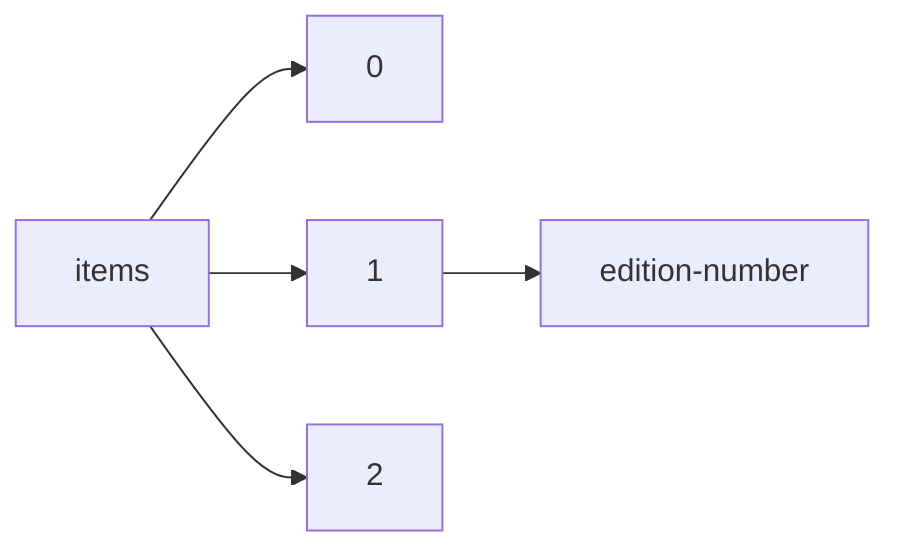

!!! warning "This document is not official Crossref documentation"
# Edition-number
PATH = items/array/edition-number(1)  
Occurs 4 212 247 times  
Unique values: > 999  
{ .annotate }

1. A route to an element, for example:  
   The route "items/array/edition-number" corresponds to navigating through the JSON indices as  
   ["items"][0]["edition-number"]  

!!! note "Due to current limitations, only the first 1,000 unique values are counted."

| **Row** | **Value** `String` | **Count** `Int64` |
|--------:|----------------------:|---------------------:|
| **1**   | 1                     | 2 939 791            |
| **2**   | 0                     | 847 658              |
| **3**   | 2                     | 172 670              |
| **4**   | 3                     | 65 300               |
| **5**   | 4                     | 51 665               |
| **6**   | 5                     | 21 932               |
| **7**   | 6                     | 16 050               |
| **8**   | 1/e                   | 12 704               |
| **9**   | 7                     | 10 285               |
| **10**  | 1st                   | 7 252                |
| **11**  | 8                     | 6 672                |
| **12**  | 9                     | 4 308                |
| **13**  | 10                    | 3 528                |
| **14**  | First                 | 3 375                |
| **15**  | 2/e                   | 3 014                |
| **16**  | 18                    | 2 470                |
| **17**  | 11                    | 2 272                |
| **18**  | 13                    | 1 763                |
| **19**  | Second                | 1 742                |
| **20**  | 12                    | 1 577                |
| **21**  | 17                    | 1 501                |
| **22**  | 14                    | 1 407                |
| **23**  | 16                    | 1 387                |
| **24**  | 3/e                   | 1 037                |
| **25**  | Primera               | 962                  |
| **26**  | ASCE Press            | 956                  |
| **27**  | Second Edition        | 927                  |
| **28**  | 4/e                   | 701                  |
| **29**  | 01                    | 696                  |
| **30**  | I                     | 696                  |
| **31**  | Third Edition         | 688                  |
| **32**  | 22                    | 683                  |
| **33**  | Third                 | 657                  |
| **34**  | revised               | 620                  |
| **35**  | Second edition        | 585                  |
| **36**  | 19                    | 497                  |
| **37**  | 15                    | 491                  |
| **38**  | 30                    | 482                  |
| **39**  | 29                    | 470                  |
| **40**  | Revised               | 468                  |
| **41**  | 1.ª Edição            | 436                  |
| **42**  | 1st Edition           | 413                  |
| **43**  | 20                    | 402                  |
| **44**  | 7/e                   | 392                  |
| **45**  | 1.                    | 389                  |
| **46**  | 21                    | 375                  |
| **47**  | 2021                  | 372                  |
| **48**  | 1ª                    | 340                  |
| **49**  | Fourth                | 325                  |
| **50**  | 2022                  | 319                  |
| **51**  | 2nd                   | 300                  |
| **52**  | 31                    | 298                  |
| **53**  | 2008                  | 282                  |
| **54**  | Fifth Edition         | 278                  |
| **55**  | -                     | 275                  |
| **56**  | 24                    | 264                  |
| **57**  | 32                    | 245                  |
| **58**  | 23                    | 242                  |
| **59**  | Fourth Edition        | 231                  |
| **60**  | 2éd.                  | 226                  |
| **61**  | 2010                  | 225                  |
| **62**  | 2020                  | 220                  |
| **63**  | 100                   | 220                  |
| **64**  | 2003                  | 219                  |
| **65**  | 25                    | 198                  |
| **66**  | 5/e                   | 194                  |
| **67**  | Third edition         | 189                  |
| **68**  | Pertama               | 185                  |
| **69**  | 28                    | 167                  |
| **70**  | 12/e                  | 166                  |
| **71**  | 1a ed.                | 162                  |
| **72**  | 1996                  | 160                  |
| **73**  | 6/e                   | 159                  |
| **74**  | primera               | 158                  |
| **75**  | 2014                  | 157                  |
| **76**  | 1999                  | 149                  |
| **77**  | 2007                  | 149                  |
| **78**  | VOL 1                 | 148                  |
| **79**  | Sixth Edition         | 147                  |
| **80**  | classic               | 141                  |
| **81**  | 2011                  | 140                  |
| **82**  | 2002                  | 139                  |
| **83**  | 1r                    | 136                  |
| **84**  | 1°                    | 126                  |
| **85**  | 2004                  | 125                  |
| **86**  | 3rd                   | 124                  |
| **87**  | 2009                  | 122                  |
| **88**  | 1997                  | 120                  |
| **89**  | 1st edition           | 119                  |
| **90**  | 3éd.                  | 119                  |
| **91**  | 1a. ed.               | 118                  |
| **92**  | Noviembre 2022        | 117                  |
| **93**  | Seventh Edition       | 112                  |
| **94**  | 1. ed.                | 110                  |
| **95**  | Expanded              | 104                  |
| **96**  | 2023                  | 103                  |
| **97**  | 2019                  | 102                  |
| **98**  | 2000                  | 99                   |
| **99**  | second                | 96                   |
| **100** | 1886                  | 95                   |
| **101** | First edition         | 89                   |
| **102** | 1987                  | 88                   |
| **103** | 1ra Edición           | 84                   |
| **104** | Electronica           | 84                   |
| **105** | 8/e                   | 81                   |
| **106** | Revised Edition       | 81                   |
| **107** | Fourth edition        | 80                   |
| **108** | 26                    | 79                   |
| **109** | first                 | 73                   |
| **110** | Fifth                 | 73                   |
| **111** | 41                    | 72                   |
| **112** | 2018                  | 72                   |
| **113** | 1991                  | 70                   |
| **114** | 1ra                   | 69                   |
| **115** | Eighth                | 65                   |
| **116** | 4éd.                  | 61                   |
| **117** | VOL 2                 | 61                   |
| **118** | 27                    | 60                   |
| **119** | digital               | 60                   |
| **120** | 1ªEdição              | 60                   |
| **121** | 133                   | 59                   |
| **122** | 9/e                   | 58                   |
| **123** | 2016                  | 58                   |
| **124** | 54                    | 57                   |
| **125** | 50                    | 57                   |
| **126** | 53                    | 56                   |
| **127** | 121                   | 56                   |
| **128** | 2005                  | 55                   |
| **129** | Fluxo Contínuo        | 54                   |
| **130** | Seventh               | 51                   |
| **131** | 1.ª                   | 51                   |
| **132** | Diciembre 2022        | 50                   |
| **133** | Hb                    | 50                   |
| **134** | Online Edition        | 50                   |
| **135** | ISESP FCTAS RAS       | 49                   |
| **136** | 1973                  | 48                   |
| **137** | 2021 Edition          | 48                   |
| **138** | 1989                  | 47                   |
| **139** | 2 éd.                 | 47                   |
| **140** | Fifth edition         | 47                   |
| **141** | 34                    | 46                   |
| **142** | 1. Aufl.              | 46                   |
| **143** | 2012                  | 46                   |
| **144** | 1ª Edición            | 46                   |
| **145** | First Edition         | 46                   |
| **146** | Primera edición       | 46                   |
| **147** | 2006                  | 45                   |
| **148** | 37                    | 44                   |
| **149** | 42                    | 44                   |
| **150** | 2017                  | 43                   |
| **151** | 43                    | 42                   |
| **152** | 110                   | 41                   |
| **153** | VOL 3                 | 41                   |
| **154** | first edition         | 41                   |
| **155** | 1. Auflage            | 40                   |
| **156** | electrònica           | 40                   |
| **157** | hb                    | 39                   |
| **158** | New                   | 38                   |
| **159** | 1 2                   | 37                   |
| **160** | 1era                  | 37                   |
| **161** | II                    | 36                   |
| **162** | 2                     | 36                   |
| **163** | 1a                    | 36                   |
| **164** | X                     | 36                   |
| **165** | Faculty               | 35                   |
| **166** | 1988                  | 34                   |
| **167** | Print                 | 34                   |
| **168** | FIRST                 | 34                   |
| **169** | 45                    | 33                   |
| **170** | DSM-5-TR              | 32                   |
| **171** | 93                    | 32                   |
| **172** | první                 | 32                   |
| **173** | 1992                  | 32                   |
| **174** | 1990                  | 31                   |
| **175** | 90                    | 31                   |
| **176** | 36                    | 31                   |
| **177** | Extended              | 31                   |
| **178** | 1.ª edição            | 30                   |
| **179** | 39                    | 30                   |
| **180** | 2on                   | 30                   |
| **181** | 2nd Edition           | 30                   |
| **182** | 1réd.                 | 30                   |
| **183** | Reprint               | 30                   |
| **184** | 1ª ed.                | 30                   |
| **185** | 67                    | 29                   |
| **186** | 2nd ed.               | 29                   |
| **187** | 1983                  | 29                   |
| **188** | Eighteenth            | 28                   |
| **189** | 1985                  | 28                   |
| **190** | 2015                  | 28                   |
| **191** | 38                    | 28                   |
| **192** | 77                    | 28                   |
| **193** | Ninth Edition         | 28                   |
| **194** | 1995                  | 27                   |
| **195** | Prace Naukowe         | 27                   |
| **196** | 119                   | 27                   |
| **197** | 33                    | 27                   |
| **198** | 40                    | 27                   |
| **199** | 2d.                   | 26                   |
| **200** | 97                    | 26                   |
| **201** | OmniaScience          | 26                   |
| **202** | 1993                  | 26                   |
| **203** | 7th                   | 26                   |
| **204** | 1998                  | 26                   |
| **205** | 123                   | 25                   |
| **206** | 124                   | 25                   |
| **207** | 1125                  | 25                   |
| **208** | 127                   | 24                   |
| **209** | 1ª edición            | 24                   |
| **210** | 126                   | 24                   |
| **211** | Volume 4              | 24                   |
| **212** | 1615                  | 23                   |
| **213** | 2001                  | 23                   |
| **214** | Dialética             | 23                   |
| **215** | 1994                  | 23                   |
| **216** | 125                   | 23                   |
| **217** | 66                    | 23                   |
| **218** | Sixth edition         | 23                   |
| **219** | 60 copies             | 23                   |
| **220** | 5/e, reprint          | 23                   |
| **221** | FCTAS RAS             | 23                   |
| **222** | 1a edición            | 23                   |
| **223** | 1. Ausg.              | 23                   |
| **224** | 128                   | 23                   |
| **225** | 3 éd.                 | 23                   |
| **226** | Paperback             | 22                   |
| **227** | III                   | 22                   |
| **228** | 1969                  | 22                   |
| **229** | 106                   | 22                   |
| **230** | 2ª                    | 22                   |
| **231** | primera edición       | 22                   |
| **232** | 95                    | 22                   |
| **233** | 5éd.                  | 22                   |
| **234** | 130                   | 22                   |
| **235** | Prace naukowe         | 21                   |
| **236** | 102                   | 21                   |
| **237** | VOL 4                 | 21                   |
| **238** | 2. javított           | 21                   |
| **239** | 44                    | 21                   |
| **240** | 143                   | 21                   |
| **241** | 1978                  | 21                   |
| **242** | 48                    | 20                   |
| **243** | 74                    | 20                   |
| **244** | 111                   | 19                   |
| **245** | pdf                   | 19                   |
| **246** | 1a.                   | 19                   |
| **247** | 22010                 | 18                   |
| **248** | Eighth edition        | 18                   |
| **249** | 56                    | 18                   |
| **250** | Seventh edition       | 18                   |
| **251** | 84                    | 18                   |
| **252** | Updated               | 18                   |
| **253** | 4th                   | 17                   |
| **254** | 1970                  | 17                   |
| **255** | 300                   | 17                   |
| **256** | 78                    | 17                   |
| **257** | TCCRE                 | 17                   |
| **258** | Classic               | 16                   |
| **259** | 49                    | 16                   |
| **260** | Volume 2              | 16                   |
| **261** | 3rd Edition           | 16                   |
| **262** | 58                    | 16                   |
| **263** | VOL 7                 | 16                   |
| **264** | 59                    | 15                   |
| **265** | 55                    | 15                   |
| **266** | New Enlarged          | 15                   |
| **267** | 62                    | 15                   |
| **268** | 201                   | 15                   |
| **269** | VOL 5                 | 15                   |
| **270** | Segunda edición       | 15                   |
| **271** | Volumen VII           | 15                   |
| **272** | Color                 | 14                   |
| **273** | 1º edição             | 14                   |
| **274** | 91                    | 14                   |
| **275** | 60                    | 14                   |
| **276** | Edn 2                 | 14                   |
| **277** | HB Fertigung          | 14                   |
| **278** | 132                   | 14                   |
| **279** | 1a edicion            | 14                   |
| **280** | Classic Edition       | 13                   |
| **281** | Segunda               | 13                   |
| **282** | 105                   | 13                   |
| **283** | second edition        | 13                   |
| **284** | 17th                  | 13                   |
| **285** | Eighth Edition        | 13                   |
| **286** | THIRD EDITION.        | 13                   |
| **287** | Printed               | 12                   |
| **288** | 35                    | 12                   |
| **289** | 1st, softback         | 12                   |
| **290** | 68                    | 12                   |
| **291** | 1082                  | 12                   |
| **292** | 75                    | 12                   |
| **293** | 1ra. ed.              | 12                   |
| **294** | 52                    | 12                   |
| **295** | updated               | 12                   |
| **296** | 65                    | 11                   |
| **297** | Volume II             | 11                   |
| **298** | 1984                  | 11                   |
| **299** | 61                    | 11                   |
| **300** | 71                    | 11                   |
| **301** | 69                    | 11                   |
| **302** | Pronko Lyudmyla       | 11                   |
| **303** | 72                    | 11                   |
| **304** | online edition        | 11                   |
| **305** | Hardback              | 11                   |
| **306** | 6éd.                  | 11                   |
| **307** | 70                    | 11                   |
| **308** | vol1. n2              | 11                   |
| **309** | IV                    | 10                   |
| **310** | 131                   | 10                   |
| **311** | Volume I              | 10                   |
| **312** | Volume 3              | 10                   |
| **313** | 94                    | 10                   |
| **314** | 92                    | 10                   |
| **315** | 109                   | 10                   |
| **316** | 1. vydání             | 10                   |
| **317** | 1.03                  | 10                   |
| **318** | 1979                  | 10                   |
| **319** | VOL 6                 | 9                    |
| **320** | 96                    | 9                    |
| **321** | 1832                  | 9                    |
| **322** | 87                    | 9                    |
| **323** | 89                    | 9                    |
| **324** | 3d.                   | 9                    |
| **325** | 47                    | 9                    |
| **326** | 82                    | 9                    |
| **327** | 88                    | 9                    |
| **328** | 113                   | 9                    |
| **329** | 46                    | 9                    |
| **330** | 1st.                  | 9                    |
| **331** | 112                   | 8                    |
| **332** | 83                    | 8                    |
| **333** | 81                    | 8                    |
| **334** | 120                   | 8                    |
| **335** | 117                   | 8                    |
| **336** | Igor Bielkin          | 8                    |
| **337** | 80                    | 8                    |
| **338** | 1º                    | 8                    |
| **339** | 57                    | 8                    |
| **340** | 76                    | 8                    |
| **341** | 103                   | 8                    |
| **342** | 86                    | 8                    |
| **343** | 98                    | 8                    |
| **344** | 107                   | 8                    |
| **345** | 116                   | 8                    |
| **346** | 115                   | 8                    |
| **347** | Technip               | 8                    |
| **348** | 73                    | 8                    |
| **349** | 79                    | 8                    |
| **350** | 64                    | 8                    |
| **351** | 101                   | 8                    |
| **352** | 122                   | 8                    |
| **353** | 85                    | 8                    |
| **354** | 63                    | 8                    |
| **355** | 108                   | 8                    |
| **356** | 51                    | 8                    |
| **357** | 2nd edition           | 8                    |
| **358** | 118                   | 8                    |
| **359** | Reissue               | 8                    |
| **360** | 114                   | 8                    |
| **361** | 99                    | 8                    |
| **362** | 104                   | 8                    |
| **363** | Digital Online        | 8                    |
| **364** | 138                   | 8                    |
| **365** | 137                   | 7                    |
| **366** | Atena Editora         | 7                    |
| **367** | 136                   | 7                    |
| **368** | 148                   | 7                    |
| **369** | 129                   | 7                    |
| **370** | 1971                  | 7                    |
| **371** | PRIMERA               | 7                    |
| **372** | 5th                   | 7                    |
| **373** | 8th Edition           | 7                    |
| **374** | 151                   | 7                    |
| **375** | 135                   | 7                    |
| **376** | 3rd ed.               | 7                    |
| **377** | 141                   | 7                    |
| **378** | 140                   | 7                    |
| **379** | 134                   | 7                    |
| **380** | 7éd.                  | 7                    |
| **381** | 144                   | 7                    |
| **382** | Educator              | 7                    |
| **383** | 139                   | 6                    |
| **384** | 146                   | 6                    |
| **385** | 154                   | 6                    |
| **386** | 152                   | 6                    |
| **387** | 9éd.                  | 6                    |
| **388** | Tercera               | 6                    |
| **389** | 156                   | 6                    |
| **390** | 145                   | 6                    |
| **391** | 153                   | 6                    |
| **392** | 149                   | 6                    |
| **393** | 142                   | 6                    |
| **394** | PDF                   | 6                    |
| **395** | Editora Oyá           | 6                    |
| **396** | 2.                    | 6                    |
| **397** | 147                   | 6                    |
| **398** | EPUB                  | 6                    |
| **399** | 150                   | 6                    |
| **400** | 160                   | 5                    |
| **401** | a                     | 5                    |
| **402** | 157                   | 5                    |
| **403** | 165                   | 5                    |
| **404** | 155                   | 5                    |
| **405** | Digital               | 5                    |
| **406** | 158                   | 5                    |
| **407** | 159                   | 5                    |
| **408** | PRIMERA EDICIÓN       | 5                    |
| **409** | 162                   | 5                    |
| **410** | online                | 5                    |
| **411** | 161                   | 5                    |
| **412** | 164                   | 5                    |
| **413** | 1re édition           | 5                    |
| **414** | 1826                  | 5                    |
| **415** | 163                   | 5                    |
| **416** | 1.ª Edição 2022       | 5                    |
| **417** | 2011-2012             | 4                    |
| **418** | 172                   | 4                    |
| **419** | 3.ed. rev.            | 4                    |
| **420** | 167                   | 4                    |
| **421** | 177                   | 4                    |
| **422** | 2013                  | 4                    |
| **423** | 2008-2009             | 4                    |
| **424** | 176                   | 4                    |
| **425** | 170                   | 4                    |
| **426** | 2007-2008             | 4                    |
| **427** | 174                   | 4                    |
| **428** | 2018-2019             | 4                    |
| **429** | 6d.                   | 4                    |
| **430** | 169                   | 4                    |
| **431** | 2010-2011             | 4                    |
| **432** | 168                   | 4                    |
| **433** | 175                   | 4                    |
| **434** | 2012-2013             | 4                    |
| **435** | 增订版                | 4                    |
| **436** | 1re                   | 4                    |
| **437** | 173                   | 4                    |
| **438** | 19th                  | 4                    |
| **439** | 2005-2006             | 4                    |
| **440** | 2015-2016             | 4                    |
| **441** | 166                   | 4                    |
| **442** | 2006-2007             | 4                    |
| **443** | 1.2                   | 4                    |
| **444** | 2ND                   | 4                    |
| **445** | 184                   | 3                    |
| **446** | 1966                  | 3                    |
| **447** | 2º edição             | 3                    |
| **448** | 1a. edición           | 3                    |
| **449** | 178                   | 3                    |
| **450** | Primera Edición       | 3                    |
| **451** | ed. 1.                | 3                    |
| **452** | 1.1a                  | 3                    |
| **453** | 1986                  | 3                    |
| **454** | THIRD EDITION         | 3                    |
| **455** | softback              | 3                    |
| **456** | 2009-2010             | 3                    |
| **457** | 2a ed.                | 3                    |
| **458** | 179                   | 3                    |
| **459** | 1ST                   | 3                    |
| **460** | b                     | 3                    |
| **461** | 2.ª                   | 3                    |
| **462** | 171                   | 3                    |
| **463** | a/b                   | 3                    |
| **464** | 180                   | 3                    |
| **465** | sixth                 | 3                    |
| **466** | 02.2015               | 3                    |
| **467** | 1982                  | 3                    |
| **468** | 8éd.                  | 3                    |
| **469** | 8d.                   | 3                    |
| **470** | 2004-2005             | 3                    |
| **471** | 5d.                   | 3                    |
| **472** | 4TH                   | 3                    |
| **473** | 185                   | 3                    |
| **474** | 01.2019               | 3                    |
| **475** | 2.ª edição            | 3                    |
| **476** | 190                   | 2                    |
| **477** | 2md.                  | 2                    |
| **478** | 06.02.2014            | 2                    |
| **479** | 2éditio               | 2                    |
| **480** | 4d.                   | 2                    |
| **481** | 9781789697063         | 2                    |
| **482** | vol1. n3              | 2                    |
| **483** | ePub                  | 2                    |
| **484** | 182                   | 2                    |
| **485** | e-book                | 2                    |
| **486** | 1.1                   | 2                    |
| **487** | 200                   | 2                    |
| **488** | SCIENCEpress          | 2                    |
| **489** | 186                   | 2                    |
| **490** | KIHRAS                | 2                    |
| **491** | 366                   | 2                    |
| **492** | 187                   | 2                    |
| **493** | 2ª edición            | 2                    |
| **494** | 2017:562              | 2                    |
| **495** | 3rd ed. rev.          | 2                    |
| **496** | 188                   | 2                    |
| **497** | 1980                  | 2                    |
| **498** | 2e                    | 2                    |
| **499** | 206                   | 2                    |
| **500** | 2.ed                  | 2                    |
| **501** | 189                   | 2                    |
| **502** | VI                    | 2                    |
| **503** | 1981                  | 2                    |
| **504** | 1898                  | 2                    |
| **505** | Revisé                | 2                    |
| **506** | 387                   | 2                    |
| **507** | print                 | 2                    |
| **508** | 11d.                  | 2                    |
| **509** | 01.2022               | 2                    |
| **510** | 1913                  | 2                    |
| **511** | 6 éd.                 | 2                    |
| **512** | 1910                  | 2                    |
| **513** | 181                   | 2                    |
| **514** | 19.01.2000            | 2                    |
| **515** | 183                   | 2                    |
| **516** | 1st ed.               | 2                    |
| **517** | 04.2016               | 2                    |
| **518** | 2019:554              | 2                    |
| **519** | 4th ed.               | 2                    |
| **520** | 1.0                   | 2                    |
| **521** | 2�d.                  | 2                    |
| **522** | 3.ª edição            | 2                    |
| **523** | 2014-2015             | 2                    |
| **524** | 07.02.2011            | 2                    |
| **525** | 6th                   | 2                    |
| **526** | 211                   | 2                    |
| **527** | -1                    | 2                    |
| **528** | 1977                  | 2                    |
| **529** | Volume 10             | 2                    |
| **530** | второ издание         | 2                    |
| **531** | i                     | 2                    |
| **532** | 198                   | 2                    |
| **533** | XXI                   | 2                    |
| **534** | 2013-2014             | 2                    |
| **535** | paperback             | 2                    |
| **536** | 4.-6. (PDF)           | 1                    |
| **537** | 1.03b                 | 1                    |
| **538** | 475                   | 1                    |
| **539** | 593                   | 1                    |
| **540** | 447                   | 1                    |
| **541** | USIE                  | 1                    |
| **542** | n°216                 | 1                    |
| **543** | ed. 1, p.559.         | 1                    |
| **544** | 9789955209188         | 1                    |
| **545** | 2019:515              | 1                    |
| **546** | 29.07.2016            | 1                    |
| **547** | 2018:520              | 1                    |
| **548** | 2èmédit               | 1                    |
| **549** | 2018:511              | 1                    |
| **550** | 204                   | 1                    |
| **551** | 2017:509              | 1                    |
| **552** | 2nd edb               | 1                    |
| **553** | 2019:552              | 1                    |
| **554** | 2014:569              | 1                    |
| **555** | 01-2022               | 1                    |
| **556** | n°89                  | 1                    |
| **557** | 9786094673856         | 1                    |
| **558** | 03.2015               | 1                    |
| **559** | Case No 1-0001        | 1                    |
| **560** | 2018:548              | 1                    |
| **561** | 6th edn               | 1                    |
| **562** | 1963                  | 1                    |
| **563** | 3ra esición           | 1                    |
| **564** | 7th ed. rev.          | 1                    |
| **565** | b-d                   | 1                    |
| **566** | 2019:544              | 1                    |
| **567** | 2. Aufl.              | 1                    |
| **568** | 2017:520              | 1                    |
| **569** | 9786094673887         | 1                    |
| **570** | 6èmd.                 | 1                    |
| **571** | 1\|                   | 1                    |
| **572** | 2017:508              | 1                    |
| **573** | 2017:502              | 1                    |
| **574** | 2018:542              | 1                    |
| **575** | CAC76                 | 1                    |
| **576** | 7 éd.                 | 1                    |
| **577** | Case No 1-0020        | 1                    |
| **578** | Electronic            | 1                    |
| **579** | 2019:542              | 1                    |
| **580** | 2018:514              | 1                    |
| **581** | 197                   | 1                    |
| **582** | 401                   | 1                    |
| **583** | 2016:535              | 1                    |
| **584** | Nowa Edukacja         | 1                    |
| **585** | 7édition              | 1                    |
| **586** | n°134                 | 1                    |
| **587** | 9786094675331         | 1                    |
| **588** | 2017:512              | 1                    |
| **589** | n°122                 | 1                    |
| **590** | Lokshyna              | 1                    |
| **591** | 2019:538              | 1                    |
| **592** | 2019:536              | 1                    |
| **593** | 1968                  | 1                    |
| **594** | 2018:513              | 1                    |
| **595** | 2019:522              | 1                    |
| **596** | 10.09.2021            | 1                    |
| **597** | 14éd.                 | 1                    |
| **598** | 08.2018               | 1                    |
| **599** | n°202                 | 1                    |
| **600** | 10d.                  | 1                    |
| **601** | 2018:544              | 1                    |
| **602** | Tercera edicion       | 1                    |
| **603** | 303                   | 1                    |
| **604** | 1ª edição             | 1                    |
| **605** | 2019:527              | 1                    |
| **606** | 2èmd.                 | 1                    |
| **607** | 2019:540              | 1                    |
| **608** | 9786094674198         | 1                    |
| **609** | 255                   | 1                    |
| **610** | n°189                 | 1                    |
| **611** | 1-0023                | 1                    |
| **612** | CAC78                 | 1                    |
| **613** | 9786094673900         | 1                    |
| **614** | n°214                 | 1                    |
| **615** | 3ª edición            | 1                    |
| **616** | 2019:534              | 1                    |
| **617** | 195                   | 1                    |
| **618** | 9786094673641         | 1                    |
| **619** | n°213                 | 1                    |
| **620** | firrst                | 1                    |
| **621** | (in Serbian)          | 1                    |
| **622** | 202                   | 1                    |
| **623** | 11.12.2007            | 1                    |
| **624** | Case No 1-0019        | 1                    |
| **625** | 12th                  | 1                    |
| **626** | 2019:505              | 1                    |
| **627** | 2019:535              | 1                    |
| **628** | 203                   | 1                    |
| **629** | 2017:915              | 1                    |
| **630** | 2019:532              | 1                    |
| **631** | Fac-similada          | 1                    |
| **632** | ufpel                 | 1                    |
| **633** | 2019:518              | 1                    |
| **634** | 2018:504              | 1                    |
| **635** | 2018:556              | 1                    |
| **636** | 2019:524              | 1                    |
| **637** | reprint               | 1                    |
| **638** | Ist                   | 1                    |
| **639** | 5èéd.                 | 1                    |
| **640** | 2. Ausg.              | 1                    |
| **641** | 9786094674303         | 1                    |
| **642** | CriticalEdition       | 1                    |
| **643** | 2'''                  | 1                    |
| **644** | 12éd.                 | 1                    |
| **645** | 1949                  | 1                    |
| **646** | Revizuită             | 1                    |
| **647** | 20.12.2005            | 1                    |
| **648** | 2018:554              | 1                    |
| **649** | web & print           | 1                    |
| **650** | 9786094674389         | 1                    |
| **651** | 2019:506              | 1                    |
| **652** | 2.nd                  | 1                    |
| **653** | 23rd                  | 1                    |
| **654** | A.A. Shpak            | 1                    |
| **655** | 2017:545              | 1                    |
| **656** | 9786094673719         | 1                    |
| **657** | Fisrt edition         | 1                    |
| **658** | 435                   | 1                    |
| **659** | 489                   | 1                    |
| **660** | 3èd.                  | 1                    |
| **661** | 287                   | 1                    |
| **662** | 012015                | 1                    |
| **663** | 9786094673634         | 1                    |
| **664** | 1959                  | 1                    |
| **665** | 9786094674037         | 1                    |
| **666** | 3th ed.               | 1                    |
| **667** | 215                   | 1                    |
| **668** | 2018:547              | 1                    |
| **669** | 2018:541              | 1                    |
| **670** | 2019:543              | 1                    |
| **671** | 2019:553              | 1                    |
| **672** | 2O21                  | 1                    |
| **673** | 3                     | 1                    |
| **674** | 2019:502              | 1                    |
| **675** | 2017:501              | 1                    |
| **676** | 196                   | 1                    |
| **677** | 4.                    | 1                    |
| **678** | 3èméd.                | 1                    |
| **679** | 2017:529              | 1                    |
| **680** | 2èéd.                 | 1                    |
| **681** | 7d.                   | 1                    |
| **682** | n°196                 | 1                    |
| **683** | 2017:536              | 1                    |
| **684** | Vol 1                 | 1                    |
| **685** | 2016:557              | 1                    |
| **686** | 3-е изд.              | 1                    |
| **687** | 4.ed                  | 1                    |
| **688** | 22nd                  | 1                    |
| **689** | v 1.0                 | 1                    |
| **690** | 9786094673696         | 1                    |
| **691** | 9789587565836         | 1                    |
| **692** | v.1.                  | 1                    |
| **693** | 2.ª Edição            | 1                    |
| **694** | 2018:537              | 1                    |
| **695** | 2017:517              | 1                    |
| **696** | 2019:541              | 1                    |
| **697** | 2nt ed.               | 1                    |
| **698** | Case No 1-0010        | 1                    |
| **699** | 10th                  | 1                    |
| **700** | 2019:507              | 1                    |
| **701** | Kieli opissa 9        | 1                    |
| **702** | 2017:553              | 1                    |
| **703** | 2018:557              | 1                    |
| **704** | August Akademie       | 1                    |
| **705** | 193                   | 1                    |
| **706** | Frist                 | 1                    |
| **707** | Case No 1-0007        | 1                    |
| **708** | 2019:550              | 1                    |
| **709** | 2019:546              | 1                    |
| **710** | 2019:504              | 1                    |
| **711** | 04.08.2020            | 1                    |
| **712** | OP 64                 | 1                    |
| **713** | 199                   | 1                    |
| **714** | scientific            | 1                    |
| **715** | 9786094674099         | 1                    |
| **716** | 2019:528              | 1                    |
| **717** | 2017 - 2018           | 1                    |
| **718** | n°200                 | 1                    |
| **719** | 3nd ed.               | 1                    |
| **720** | 2018:553              | 1                    |
| **721** | XC; 10                | 1                    |
| **722** | 2018:552              | 1                    |
| **723** | 2017:515              | 1                    |
| **724** | 2019:512              | 1                    |
| **725** | Case No 1-0002        | 1                    |
| **726** | 24th                  | 1                    |
| **727** | ebook                 | 1                    |
| **728** | 2017:519              | 1                    |
| **729** | 2. upplag             | 1                    |
| **730** | 2018:526              | 1                    |
| **731** | 11éd.                 | 1                    |
| **732** | 9786094674341         | 1                    |
| **733** | 4. Aufl.              | 1                    |
| **734** | 2016:503              | 1                    |
| **735** | 207                   | 1                    |
| **736** | 9786094674884         | 1                    |
| **737** | OA ebook              | 1                    |
| **738** | 2017:567              | 1                    |
| **739** | 2019:539              | 1                    |
| **740** | 6TH                   | 1                    |
| **741** | 2019:523              | 1                    |
| **742** | 16éd.                 | 1                    |
| **743** | 2019:533              | 1                    |
| **744** | 2018:540              | 1                    |
| **745** | 209                   | 1                    |
| **746** | 9786094674365         | 1                    |
| **747** | 9786094674242         | 1                    |
| **748** | 2018:550              | 1                    |
| **749** | 2019:508              | 1                    |
| **750** | 2017:514              | 1                    |
| **751** | CAC81                 | 1                    |
| **752** | 222                   | 1                    |
| **753** | 2018:538              | 1                    |
| **754** | 21st                  | 1                    |
| **755** | BPG 26                | 1                    |
| **756** | 2d                    | 1                    |
| **757** | 繁體中文              | 1                    |
| **758** | Primera 2018          | 1                    |
| **759** | Cloth                 | 1                    |
| **760** | a/b/c                 | 1                    |
| **761** | 9786094675362         | 1                    |
| **762** | 2018:524              | 1                    |
| **763** | 1ERA                  | 1                    |
| **764** | 002                   | 1                    |
| **765** | CAC73                 | 1                    |
| **766** | CAC80                 | 1                    |
| **767** | 1.ed.                 | 1                    |
| **768** | 9786094673764         | 1                    |
| **769** | 1ra edición           | 1                    |
| **770** | 2017:528              | 1                    |
| **771** | 9786094674174         | 1                    |
| **772** | 2017:559              | 1                    |
| **773** | Markova E.Y.          | 1                    |
| **774** | p.126                 | 1                    |
| **775** | 9786094674822         | 1                    |
| **776** | 9786094672934         | 1                    |
| **777** | 2019:516              | 1                    |
| **778** | NULL                  | 1                    |
| **779** | Uud. 2. laitos        | 1                    |
| **780** | 2017:525              | 1                    |
| **781** | 2018:545              | 1                    |
| **782** | cac70-2014            | 1                    |
| **783** | 2ra                   | 1                    |
| **784** | 2nd ed. rev.          | 1                    |
| **785** | n°186                 | 1                    |
| **786** | 7.7                   | 1                    |
| **787** | 9786094674785         | 1                    |
| **788** | 2017:549              | 1                    |
| **789** | HEP BEJUNE            | 1                    |
| **790** | 9786094675294         | 1                    |
| **791** | Editora UFSB          | 1                    |
| **792** | 003                   | 1                    |
| **793** | 2. rev. ed.           | 1                    |
| **794** | 2017:542              | 1                    |
| **795** | 1976                  | 1                    |
| **796** | n°194                 | 1                    |
| **797** | 2019:509              | 1                    |
| **798** | 2.º edição            | 1                    |
| **799** | 2.º                   | 1                    |
| **800** | sexta                 | 1                    |
| **801** | 76th                  | 1                    |
| **802** | 192                   | 1                    |
| **803** | c                     | 1                    |
| **804** | 2019:531              | 1                    |
| **805** | Ljournal              | 1                    |
| **806** | WP/2020/329           | 1                    |
| **807** | 2019:529              | 1                    |
| **808** | 2018:502              | 1                    |
| **809** | 2018:536              | 1                    |
| **810** | CAC71-2014            | 1                    |
| **811** | Пересмотренный        | 1                    |
| **812** | О.А. Borysenko        | 1                    |
| **813** | 28.01.2019            | 1                    |
| **814** | 2018:555              | 1                    |
| **815** | 2018:533              | 1                    |
| **816** | 9786094673771         | 1                    |
| **817** | 9786094674471         | 1                    |
| **818** | 554b                  | 1                    |
| **819** | [1st ed.]             | 1                    |
| **820** | a-c                   | 1                    |
| **821** | q                     | 1                    |
| **822** | 2017:516              | 1                    |
| **823** | 9786094673511         | 1                    |
| **824** | Updated 2nd ed.       | 1                    |
| **825** | 03-2023               | 1                    |
| **826** | utb                   | 1                    |
| **827** | 1s                    | 1                    |
| **828** | 2ª ed.                | 1                    |
| **829** | 1916                  | 1                    |
| **830** | 9786094674211         | 1                    |
| **831** | 2nd, revised          | 1                    |
| **832** | Anaya                 | 1                    |
| **833** | 2017:504              | 1                    |
| **834** | 01-2021               | 1                    |
| **835** | 208                   | 1                    |
| **836** | 2017:550              | 1                    |
| **837** | n°178                 | 1                    |
| **838** | 2019:520              | 1                    |
| **839** | Revisión 2            | 1                    |
| **840** | Twenty-Third          | 1                    |
| **841** | Quinta                | 1                    |
| **842** | 2018:523              | 1                    |
| **843** | 2016-2017             | 1                    |
| **844** | 2017:557              | 1                    |
| **845** | 1a ed                 | 1                    |
| **846** | 13éd.                 | 1                    |
| **847** | 2019:548              | 1                    |
| **848** | 2019:525              | 1                    |
| **849** | 2020:503              | 1                    |
| **850** | 2017:522              | 1                    |
| **851** | 3RD                   | 1                    |
| **852** | third                 | 1                    |
| **853** | 2rd ed. rev.          | 1                    |
| **854** | 2017:551              | 1                    |
| **855** | 2018:510              | 1                    |
| **856** | n�65                  | 1                    |
| **857** | 1972                  | 1                    |
| **858** | Open Access           | 1                    |
| **859** | Case No 1-0029        | 1                    |
| **860** | 2019–2020             | 1                    |
| **861** | 05.2014               | 1                    |
| **862** | 4/2019                | 1                    |
| **863** | Primera edició        | 1                    |
| **864** | 1.1r02                | 1                    |
| **865** | 2018:518              | 1                    |
| **866** | 2019:519              | 1                    |
| **867** | 9d.                   | 1                    |
| **868** | 2019:514              | 1                    |
| **869** | 3.                    | 1                    |
| **870** | 08.2015               | 1                    |
| **871** | 004                   | 1                    |
| **872** | 2017:555              | 1                    |
| **873** | První                 | 1                    |
| **874** | 2a.ed.                | 1                    |
| **875** | 2018:508              | 1                    |
| **876** | Expanded Second       | 1                    |
| **877** | 2017:523              | 1                    |
| **878** | 03.2016               | 1                    |
| **879** | 107th                 | 1                    |
| **880** | 16.09.2002            | 1                    |
| **881** | 2007-10-22            | 1                    |
| **882** | 2°                    | 1                    |
| **883** | 02.2016               | 1                    |
| **884** | 5ª edición            | 1                    |
| **885** | Case No 1-0004        | 1                    |
| **886** | 2019:530              | 1                    |
| **887** | Volume 1              | 1                    |
| **888** | 3èmédit               | 1                    |
| **889** | 9786094674532         | 1                    |
| **890** | n°188                 | 1                    |
| **891** | 2019:551              | 1                    |
| **892** | p. 122.               | 1                    |
| **893** | 9786094674259         | 1                    |
| **894** | training manual       | 1                    |
| **895** | Wyd. 2 popr.          | 1                    |
| **896** | 1960                  | 1                    |
| **897** | cac75                 | 1                    |
| **898** | 2017:914              | 1                    |
| **899** | Inspirited            | 1                    |
| **900** | 9786094674495         | 1                    |
| **901** | 1º Edição             | 1                    |
| **902** | 2017:527              | 1                    |
| **903** | 9786094674587         | 1                    |
| **904** | 2018:519              | 1                    |
| **905** | 2017-01               | 1                    |
| **906** | 5th ed. rev.          | 1                    |
| **907** | 14 ed.                | 1                    |
| **908** | n°193                 | 1                    |
| **909** | 2019:510              | 1                    |
| **910** | 205                   | 1                    |
| **911** | 9786094674600         | 1                    |
| **912** | 06.2016               | 1                    |
| **913** | 2018:535              | 1                    |
| **914** | 2da                   | 1                    |
| **915** | 2018:528              | 1                    |
| **916** | 2019:517              | 1                    |
| **917** | 03.2020               | 1                    |
| **918** | n°211                 | 1                    |
| **919** | 2017:566              | 1                    |
| **920** | 9th                   | 1                    |
| **921** | 1,E                   | 1                    |
| **922** | 471                   | 1                    |
| **923** | p. 44.                | 1                    |
| **924** | 194                   | 1                    |
| **925** | Tercera edición       | 1                    |
| **926** | p.130.                | 1                    |
| **927** | 2019:503              | 1                    |
| **928** | 3ra edición           | 1                    |
| **929** | 2018:539              | 1                    |
| **930** | Case No 1-0011        | 1                    |
| **931** | 3 ed.                 | 1                    |
| **932** | 212                   | 1                    |
| **933** | 210                   | 1                    |
| **934** | Case No 1-0021        | 1                    |
| **935** | 2017:511              | 1                    |
| **936** | 2019:521              | 1                    |
| **937** | 2-nd edition          | 1                    |
| **938** | 2018:531              | 1                    |
| **939** | 2017:510              | 1                    |
| **940** | 9786094674402         | 1                    |
| **941** | 1st American          | 1                    |
| **942** | 2018:551              | 1                    |
| **943** | 2015:503              | 1                    |
| **944** | 10 éd.                | 1                    |
| **945** | 425                   | 1                    |
| **946** | 9786094541865         | 1                    |
| **947** | 2º                    | 1                    |
| **948** | 2018:522              | 1                    |
| **949** | 1rst                  | 1                    |
| **950** | 2017:543              | 1                    |
| **951** | 2019:545              | 1                    |
| **952** | 470                   | 1                    |
| **953** | 2019:547              | 1                    |
| **954** | 24.12.2021            | 1                    |
| **955** | 2019:558              | 1                    |
| **956** | 2018:546              | 1                    |
| **957** | 6º edição             | 1                    |
| **958** | 2017:518              | 1                    |
| **959** | Revised edition       | 1                    |
| **960** | 2a                    | 1                    |
| **961** | 2017:544              | 1                    |
| **962** | 01.2020               | 1                    |
| **963** | n°151                 | 1                    |
| **964** | 2018:532              | 1                    |
| **965** | Case No 1-0005        | 1                    |
| **966** | 2015:506              | 1                    |
| **967** | 2018:549              | 1                    |
| **968** | CAC74                 | 1                    |
| **969** | 33.06.2019            | 1                    |
| **970** | Blaue Reihe           | 1                    |
| **971** | 2019:537              | 1                    |
| **972** | 97th                  | 1                    |
| **973** | 9786094674273         | 1                    |
| **974** | 3.ª Edição            | 1                    |
| **975** | 4 éd.                 | 1                    |
| **976** | 3ª                    | 1                    |
| **977** | 02.2014               | 1                    |
| **978** | 2016:566              | 1                    |
| **979** | 2017:570              | 1                    |
| **980** | 2018:501              | 1                    |
| **981** | No 5                  | 1                    |
| **982** | 11th                  | 1                    |
| **983** | 310                   | 1                    |
| **984** | Case No 1-0017        | 1                    |
| **985** | 2017:534              | 1                    |
| **986** | Case No 1-0006        | 1                    |
| **987** | n°160                 | 1                    |
| **988** | 191                   | 1                    |
| **989** | Case No 1-0009        | 1                    |
| **990** | 052016                | 1                    |
| **991** | 2018:515              | 1                    |
| **992** | 9786094674433         | 1                    |
| **993** | 9786094674860         | 1                    |
| **994** | 2017-2018             | 1                    |
| **995** | 2017:556              | 1                    |
| **996** | Pre-Print             | 1                    |
| **997** | «Экон-Информ»         | 1                    |
| **998** | 2017:506              | 1                    |
| **999** | 1 st.                 | 1                    |
| ... | ... | ... |

