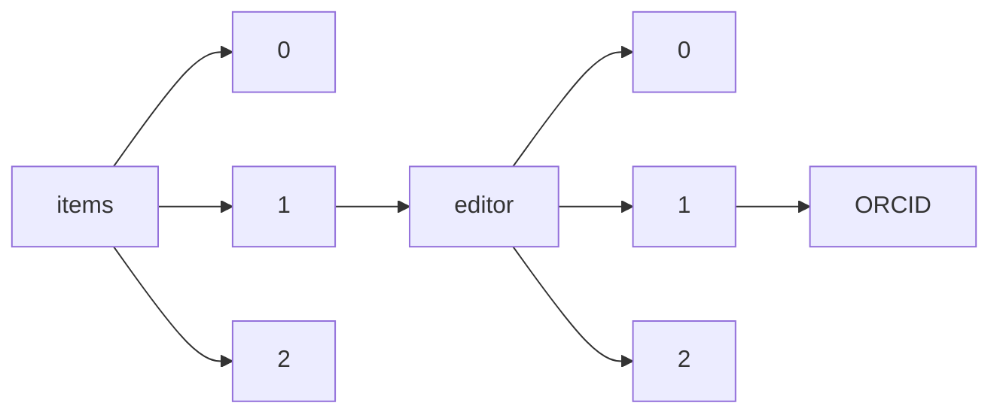

!!! warning "This document is not official Crossref documentation"
# ORCID
PATH = items/array/editor/array/ORCID(1)  
Occurs 241 781 times  
Unique values: > 999  
{ .annotate }

1. A route to an element, for example:  
   The route "items/array/editor/array/ORCID" corresponds to navigating through the JSON indices as  
   ["items"][0]["editor"][0]["ORCID"]  

!!! note "Due to current limitations, only the first 1,000 unique values are counted."

| **Row** | **Value** `String`                | **Count** `Int64` |
|--------:|-------------------------------------:|---------------------:|
| **1**   | http://orcid.org/0000-0002-4465-7034 | 95 712               |
| **2**   | http://orcid.org/0000-0002-7436-3176 | 95 712               |
| **3**   | http://orcid.org/0000-0002-9048-8614 | 359                  |
| **4**   | http://orcid.org/0000-0003-4274-1862 | 344                  |
| **5**   | http://orcid.org/0000-0001-7254-5876 | 310                  |
| **6**   | http://orcid.org/0000-0002-9667-3730 | 306                  |
| **7**   | http://orcid.org/0000-0001-7135-3469 | 289                  |
| **8**   | http://orcid.org/0000-0002-3982-9161 | 270                  |
| **9**   | http://orcid.org/0000-0002-0382-0026 | 261                  |
| **10**  | http://orcid.org/0000-0002-4705-5629 | 238                  |
| **11**  | http://orcid.org/0000-0001-9765-1659 | 211                  |
| **12**  | http://orcid.org/0000-0002-2114-7963 | 195                  |
| **13**  | http://orcid.org/0000-0002-4181-7856 | 188                  |
| **14**  | http://orcid.org/0000-0002-2444-6061 | 180                  |
| **15**  | http://orcid.org/0000-0002-6462-984X | 176                  |
| **16**  | http://orcid.org/0000-0001-7619-0048 | 171                  |
| **17**  | http://orcid.org/0000-0001-8451-0523 | 167                  |
| **18**  | http://orcid.org/0000-0001-5911-9522 | 167                  |
| **19**  | http://orcid.org/0000-0002-8108-5223 | 166                  |
| **20**  | http://orcid.org/0000-0003-0048-1177 | 153                  |
| **21**  | http://orcid.org/0000-0003-2952-4337 | 152                  |
| **22**  | http://orcid.org/0000-0003-3419-0765 | 147                  |
| **23**  | http://orcid.org/0000-0002-6018-0483 | 146                  |
| **24**  | http://orcid.org/0000-0002-2686-5702 | 140                  |
| **25**  | http://orcid.org/0000-0002-4414-5477 | 139                  |
| **26**  | http://orcid.org/0000-0002-8341-1459 | 139                  |
| **27**  | http://orcid.org/0000-0001-7059-0630 | 139                  |
| **28**  | http://orcid.org/0000-0001-5024-5418 | 137                  |
| **29**  | http://orcid.org/0000-0002-7343-1173 | 133                  |
| **30**  | http://orcid.org/0000-0003-1713-012X | 133                  |
| **31**  | http://orcid.org/0000-0002-7472-770X | 132                  |
| **32**  | http://orcid.org/0000-0003-3544-7219 | 129                  |
| **33**  | http://orcid.org/0000-0002-8545-6247 | 121                  |
| **34**  | http://orcid.org/0000-0001-5720-212X | 119                  |
| **35**  | http://orcid.org/0000-0002-8626-7827 | 118                  |
| **36**  | http://orcid.org/0000-0001-6198-7943 | 117                  |
| **37**  | http://orcid.org/0000-0001-6247-0284 | 117                  |
| **38**  | http://orcid.org/0000-0002-4409-8084 | 113                  |
| **39**  | http://orcid.org/0000-0001-6965-0851 | 111                  |
| **40**  | http://orcid.org/0000-0001-9632-5448 | 110                  |
| **41**  | http://orcid.org/0000-0003-4598-0631 | 107                  |
| **42**  | http://orcid.org/0000-0003-4527-3806 | 106                  |
| **43**  | http://orcid.org/0000-0003-4156-2109 | 105                  |
| **44**  | http://orcid.org/0000-0002-6331-0378 | 103                  |
| **45**  | http://orcid.org/0000-0002-6950-1191 | 102                  |
| **46**  | http://orcid.org/0000-0001-8578-2969 | 99                   |
| **47**  | http://orcid.org/0000-0003-3203-1058 | 96                   |
| **48**  | http://orcid.org/0000-0003-4728-5130 | 95                   |
| **49**  | http://orcid.org/0000-0001-5180-7179 | 94                   |
| **50**  | http://orcid.org/0000-0001-6873-7824 | 93                   |
| **51**  | http://orcid.org/0000-0002-5092-0150 | 89                   |
| **52**  | http://orcid.org/0000-0001-7468-0035 | 87                   |
| **53**  | http://orcid.org/0000-0001-8332-936X | 85                   |
| **54**  | http://orcid.org/0000-0001-6698-1241 | 85                   |
| **55**  | http://orcid.org/0000-0002-0460-5344 | 83                   |
| **56**  | http://orcid.org/0000-0002-3014-5636 | 80                   |
| **57**  | http://orcid.org/0000-0001-9099-9169 | 80                   |
| **58**  | http://orcid.org/0000-0001-6906-6620 | 78                   |
| **59**  | http://orcid.org/0000-0001-9713-3480 | 78                   |
| **60**  | http://orcid.org/0000-0002-0700-3349 | 77                   |
| **61**  | http://orcid.org/0000-0002-2751-9924 | 76                   |
| **62**  | http://orcid.org/0000-0002-8200-4341 | 75                   |
| **63**  | http://orcid.org/0000-0003-1965-906X | 70                   |
| **64**  | http://orcid.org/0000-0002-7634-2854 | 68                   |
| **65**  | http://orcid.org/0000-0002-5096-5914 | 67                   |
| **66**  | http://orcid.org/0000-0001-5121-2036 | 67                   |
| **67**  | http://orcid.org/0000-0001-8106-5460 | 64                   |
| **68**  | http://orcid.org/0000-0002-4751-1831 | 63                   |
| **69**  | http://orcid.org/0000-0001-5187-7417 | 63                   |
| **70**  | http://orcid.org/0000-0002-6914-1413 | 62                   |
| **71**  | http://orcid.org/0000-0002-4707-8759 | 62                   |
| **72**  | http://orcid.org/0000-0002-0614-6989 | 61                   |
| **73**  | http://orcid.org/0000-0002-3556-9331 | 61                   |
| **74**  | http://orcid.org/0000-0001-5992-5989 | 61                   |
| **75**  | http://orcid.org/0000-0003-2824-101X | 61                   |
| **76**  | http://orcid.org/0000-0003-0802-8799 | 60                   |
| **77**  | http://orcid.org/0000-0001-6861-8964 | 58                   |
| **78**  | http://orcid.org/0000-0002-6730-1452 | 58                   |
| **79**  | http://orcid.org/0000-0002-3673-0086 | 57                   |
| **80**  | http://orcid.org/0000-0001-7224-7676 | 57                   |
| **81**  | http://orcid.org/0000-0002-4480-3484 | 55                   |
| **82**  | http://orcid.org/0000-0002-5693-5572 | 55                   |
| **83**  | http://orcid.org/0000-0002-7276-3571 | 53                   |
| **84**  | http://orcid.org/0000-0002-2635-7433 | 52                   |
| **85**  | http://orcid.org/0000-0002-0130-1652 | 52                   |
| **86**  | http://orcid.org/0000-0003-1268-9602 | 51                   |
| **87**  | http://orcid.org/0000-0003-2645-0598 | 50                   |
| **88**  | http://orcid.org/0000-0003-4327-520X | 50                   |
| **89**  | http://orcid.org/0000-0003-2409-5959 | 49                   |
| **90**  | http://orcid.org/0000-0002-6034-0432 | 49                   |
| **91**  | http://orcid.org/0000-0001-5031-3329 | 48                   |
| **92**  | http://orcid.org/0000-0002-5755-9409 | 47                   |
| **93**  | http://orcid.org/0000-0001-5371-2974 | 47                   |
| **94**  | http://orcid.org/0000-0003-4983-6389 | 46                   |
| **95**  | http://orcid.org/0000-0002-1292-8602 | 45                   |
| **96**  | http://orcid.org/0000-0002-7528-738X | 44                   |
| **97**  | http://orcid.org/0000-0002-0108-8599 | 43                   |
| **98**  | http://orcid.org/0000-0002-1966-6959 | 43                   |
| **99**  | http://orcid.org/0000-0001-5541-0216 | 43                   |
| **100** | http://orcid.org/0000-0001-8679-2886 | 43                   |
| **101** | http://orcid.org/0000-0002-1627-8395 | 42                   |
| **102** | http://orcid.org/0000-0002-7453-1061 | 41                   |
| **103** | http://orcid.org/0000-0002-3039-0711 | 41                   |
| **104** | http://orcid.org/0000-0001-7292-5430 | 41                   |
| **105** | http://orcid.org/0000-0003-4954-7034 | 41                   |
| **106** | http://orcid.org/0000-0003-2972-2472 | 41                   |
| **107** | http://orcid.org/0000-0002-0889-9220 | 41                   |
| **108** | http://orcid.org/0000-0003-1575-1504 | 41                   |
| **109** | http://orcid.org/0000-0002-7248-6551 | 40                   |
| **110** | http://orcid.org/0000-0003-3164-9876 | 40                   |
| **111** | http://orcid.org/0000-0002-8862-3960 | 40                   |
| **112** | http://orcid.org/0000-0001-7644-7296 | 39                   |
| **113** | http://orcid.org/0000-0001-8615-6409 | 39                   |
| **114** | http://orcid.org/0000-0003-1355-8401 | 39                   |
| **115** | http://orcid.org/0000-0002-3345-2930 | 39                   |
| **116** | http://orcid.org/0000-0002-2059-1595 | 39                   |
| **117** | http://orcid.org/0000-0001-6056-5538 | 39                   |
| **118** | http://orcid.org/0000-0003-2275-1406 | 38                   |
| **119** | http://orcid.org/0000-0001-8472-3828 | 38                   |
| **120** | http://orcid.org/0000-0002-1311-3421 | 38                   |
| **121** | http://orcid.org/0000-0001-9988-6021 | 38                   |
| **122** | http://orcid.org/0000-0001-9065-1832 | 37                   |
| **123** | http://orcid.org/0000-0002-5369-9009 | 37                   |
| **124** | http://orcid.org/0000-0003-2362-8784 | 37                   |
| **125** | http://orcid.org/0000-0001-6929-6370 | 37                   |
| **126** | http://orcid.org/0000-0001-5785-1939 | 37                   |
| **127** | http://orcid.org/0000-0001-8180-0701 | 37                   |
| **128** | http://orcid.org/0000-0002-5123-1031 | 36                   |
| **129** | http://orcid.org/0000-0003-3569-6493 | 36                   |
| **130** | http://orcid.org/0000-0001-6253-505X | 36                   |
| **131** | http://orcid.org/0000-0003-4737-6040 | 36                   |
| **132** | http://orcid.org/0000-0001-8156-979X | 36                   |
| **133** | http://orcid.org/0000-0001-9460-0434 | 36                   |
| **134** | http://orcid.org/0000-0001-8715-4253 | 36                   |
| **135** | http://orcid.org/0000-0002-1254-5839 | 35                   |
| **136** | http://orcid.org/0000-0002-5261-7040 | 35                   |
| **137** | http://orcid.org/0000-0001-6490-1121 | 35                   |
| **138** | http://orcid.org/0000-0003-3159-3534 | 34                   |
| **139** | http://orcid.org/0000-0002-8836-2959 | 34                   |
| **140** | http://orcid.org/0000-0002-6937-038X | 34                   |
| **141** | http://orcid.org/0000-0002-6219-0853 | 34                   |
| **142** | http://orcid.org/0000-0003-1427-2747 | 34                   |
| **143** | http://orcid.org/0000-0001-6901-832X | 33                   |
| **144** | http://orcid.org/0000-0002-8097-2699 | 33                   |
| **145** | http://orcid.org/0000-0003-3150-7210 | 33                   |
| **146** | http://orcid.org/0000-0002-3575-2670 | 32                   |
| **147** | http://orcid.org/0000-0002-2165-8253 | 32                   |
| **148** | http://orcid.org/0000-0002-5990-4333 | 31                   |
| **149** | http://orcid.org/0000-0002-7946-200X | 31                   |
| **150** | http://orcid.org/0000-0003-1374-2858 | 31                   |
| **151** | http://orcid.org/0000-0003-0873-3543 | 31                   |
| **152** | http://orcid.org/0000-0001-8156-9511 | 31                   |
| **153** | http://orcid.org/0000-0003-0846-139X | 31                   |
| **154** | http://orcid.org/0000-0002-1052-2609 | 31                   |
| **155** | http://orcid.org/0000-0002-7461-5214 | 30                   |
| **156** | http://orcid.org/0000-0002-6282-8861 | 30                   |
| **157** | http://orcid.org/0000-0003-2286-3395 | 30                   |
| **158** | http://orcid.org/0000-0002-6969-3744 | 30                   |
| **159** | http://orcid.org/0000-0002-9096-6671 | 30                   |
| **160** | http://orcid.org/0000-0002-7114-6459 | 30                   |
| **161** | http://orcid.org/0000-0002-6725-0093 | 29                   |
| **162** | http://orcid.org/0000-0002-3250-3804 | 29                   |
| **163** | http://orcid.org/0000-0002-6965-1085 | 29                   |
| **164** | http://orcid.org/0000-0001-5518-6584 | 29                   |
| **165** | http://orcid.org/0000-0002-5659-3111 | 29                   |
| **166** | http://orcid.org/0000-0002-6002-6806 | 29                   |
| **167** | http://orcid.org/0000-0002-0123-9895 | 28                   |
| **168** | http://orcid.org/0000-0002-3731-5466 | 28                   |
| **169** | http://orcid.org/0000-0002-4393-0510 | 28                   |
| **170** | http://orcid.org/0000-0003-4338-9063 | 28                   |
| **171** | http://orcid.org/0000-0001-5874-5337 | 28                   |
| **172** | http://orcid.org/0000-0002-5227-6004 | 27                   |
| **173** | http://orcid.org/0000-0002-5626-3999 | 27                   |
| **174** | http://orcid.org/0000-0001-9048-1941 | 27                   |
| **175** | http://orcid.org/0000-0003-1259-0477 | 27                   |
| **176** | http://orcid.org/0000-0002-5143-666X | 27                   |
| **177** | http://orcid.org/0000-0001-7603-6526 | 26                   |
| **178** | http://orcid.org/0000-0003-0084-3131 | 26                   |
| **179** | http://orcid.org/0000-0001-7494-5224 | 26                   |
| **180** | http://orcid.org/0000-0003-2669-5536 | 26                   |
| **181** | http://orcid.org/0000-0001-5946-5257 | 26                   |
| **182** | http://orcid.org/0000-0002-0878-0457 | 26                   |
| **183** | http://orcid.org/0000-0002-2468-0771 | 25                   |
| **184** | http://orcid.org/0000-0001-7819-4202 | 25                   |
| **185** | http://orcid.org/0000-0002-5583-6150 | 25                   |
| **186** | http://orcid.org/0000-0002-7691-6993 | 25                   |
| **187** | http://orcid.org/0000-0001-9102-7927 | 25                   |
| **188** | http://orcid.org/0000-0001-5693-381X | 24                   |
| **189** | http://orcid.org/0000-0002-1055-1258 | 24                   |
| **190** | http://orcid.org/0000-0003-1390-399X | 24                   |
| **191** | http://orcid.org/0000-0002-7375-8037 | 24                   |
| **192** | http://orcid.org/0000-0001-6587-0582 | 24                   |
| **193** | http://orcid.org/0000-0002-0462-6540 | 24                   |
| **194** | http://orcid.org/0000-0001-9797-4722 | 24                   |
| **195** | http://orcid.org/0000-0002-9445-7217 | 24                   |
| **196** | http://orcid.org/0000-0002-8535-8073 | 24                   |
| **197** | http://orcid.org/0000-0003-0352-9498 | 24                   |
| **198** | http://orcid.org/0000-0001-7628-3770 | 24                   |
| **199** | http://orcid.org/0000-0002-8145-747X | 23                   |
| **200** | http://orcid.org/0000-0003-1062-4178 | 23                   |
| **201** | http://orcid.org/0000-0001-9741-1946 | 23                   |
| **202** | http://orcid.org/0000-0002-4251-4785 | 23                   |
| **203** | http://orcid.org/0000-0003-0459-5518 | 23                   |
| **204** | http://orcid.org/0000-0003-0901-2529 | 23                   |
| **205** | http://orcid.org/0000-0002-4029-7051 | 23                   |
| **206** | http://orcid.org/0000-0003-4059-8249 | 23                   |
| **207** | http://orcid.org/0000-0003-3028-6866 | 23                   |
| **208** | http://orcid.org/0000-0003-1542-3498 | 23                   |
| **209** | http://orcid.org/0000-0001-7499-3242 | 22                   |
| **210** | http://orcid.org/0000-0002-5816-8979 | 22                   |
| **211** | http://orcid.org/0000-0003-2967-4765 | 22                   |
| **212** | http://orcid.org/0000-0002-7453-4393 | 22                   |
| **213** | http://orcid.org/0000-0001-7215-9393 | 22                   |
| **214** | http://orcid.org/0000-0001-9151-5154 | 22                   |
| **215** | http://orcid.org/0000-0003-1169-6026 | 22                   |
| **216** | http://orcid.org/0000-0002-2581-070X | 22                   |
| **217** | http://orcid.org/0000-0002-6547-5889 | 22                   |
| **218** | http://orcid.org/0000-0002-2702-7428 | 22                   |
| **219** | http://orcid.org/0000-0001-9116-5289 | 22                   |
| **220** | http://orcid.org/0000-0002-3848-5395 | 21                   |
| **221** | http://orcid.org/0000-0003-1537-872X | 21                   |
| **222** | http://orcid.org/0000-0002-6239-5402 | 21                   |
| **223** | http://orcid.org/0000-0003-3017-3298 | 21                   |
| **224** | http://orcid.org/0000-0001-5698-6014 | 21                   |
| **225** | http://orcid.org/0000-0003-3247-1782 | 21                   |
| **226** | http://orcid.org/0000-0002-8247-129X | 21                   |
| **227** | http://orcid.org/0000-0002-9877-4180 | 21                   |
| **228** | http://orcid.org/0000-0002-4134-9730 | 20                   |
| **229** | http://orcid.org/0000-0001-8163-1952 | 20                   |
| **230** | http://orcid.org/0000-0001-5245-8177 | 20                   |
| **231** | http://orcid.org/0000-0001-5759-3175 | 20                   |
| **232** | http://orcid.org/0000-0003-2195-6258 | 20                   |
| **233** | http://orcid.org/0000-0003-4844-5212 | 20                   |
| **234** | http://orcid.org/0000-0001-9723-8530 | 20                   |
| **235** | http://orcid.org/0000-0001-7224-925X | 20                   |
| **236** | http://orcid.org/0000-0003-0754-2999 | 19                   |
| **237** | http://orcid.org/0000-0003-4344-3592 | 19                   |
| **238** | http://orcid.org/0000-0003-2546-6897 | 19                   |
| **239** | http://orcid.org/0000-0002-7774-1953 | 19                   |
| **240** | http://orcid.org/0000-0002-3596-9407 | 19                   |
| **241** | http://orcid.org/0000-0001-9211-1960 | 19                   |
| **242** | http://orcid.org/0000-0002-6856-0165 | 19                   |
| **243** | http://orcid.org/0000-0003-1404-8737 | 19                   |
| **244** | http://orcid.org/0000-0002-1267-0234 | 19                   |
| **245** | http://orcid.org/0000-0002-3905-2444 | 19                   |
| **246** | http://orcid.org/0000-0002-9679-0582 | 19                   |
| **247** | http://orcid.org/0000-0001-9082-1870 | 19                   |
| **248** | http://orcid.org/0000-0003-2525-1407 | 19                   |
| **249** | http://orcid.org/0000-0002-9453-4091 | 18                   |
| **250** | http://orcid.org/0000-0003-4231-4115 | 18                   |
| **251** | http://orcid.org/0000-0003-3852-3803 | 18                   |
| **252** | http://orcid.org/0000-0003-2306-1415 | 18                   |
| **253** | http://orcid.org/0000-0003-3068-5402 | 18                   |
| **254** | http://orcid.org/0000-0002-6608-8784 | 18                   |
| **255** | http://orcid.org/0000-0003-0471-9859 | 18                   |
| **256** | http://orcid.org/0000-0002-4730-9131 | 18                   |
| **257** | http://orcid.org/0000-0001-5983-4454 | 18                   |
| **258** | http://orcid.org/0000-0001-9774-2550 | 18                   |
| **259** | http://orcid.org/0000-0002-3342-5377 | 17                   |
| **260** | http://orcid.org/0000-0003-0410-5451 | 17                   |
| **261** | http://orcid.org/0000-0001-6118-741X | 17                   |
| **262** | http://orcid.org/0000-0002-2005-8213 | 17                   |
| **263** | http://orcid.org/0000-0002-6687-9025 | 17                   |
| **264** | http://orcid.org/0000-0002-0950-2758 | 17                   |
| **265** | http://orcid.org/0000-0002-8936-5190 | 17                   |
| **266** | http://orcid.org/0000-0002-7916-0618 | 17                   |
| **267** | http://orcid.org/0000-0002-0066-0485 | 17                   |
| **268** | http://orcid.org/0000-0002-9127-3949 | 17                   |
| **269** | http://orcid.org/0000-0002-4044-0970 | 17                   |
| **270** | http://orcid.org/0000-0002-2442-8787 | 17                   |
| **271** | http://orcid.org/0000-0002-4354-3756 | 17                   |
| **272** | http://orcid.org/0000-0001-5943-475X | 17                   |
| **273** | http://orcid.org/0000-0003-3474-019X | 17                   |
| **274** | http://orcid.org/0000-0002-3077-6219 | 16                   |
| **275** | http://orcid.org/0000-0002-2705-8187 | 16                   |
| **276** | http://orcid.org/0000-0001-6658-8255 | 16                   |
| **277** | http://orcid.org/0000-0001-5624-810X | 16                   |
| **278** | http://orcid.org/0000-0001-7787-306X | 16                   |
| **279** | http://orcid.org/0000-0003-3588-7820 | 16                   |
| **280** | http://orcid.org/0000-0001-8746-0293 | 16                   |
| **281** | http://orcid.org/0000-0001-7598-3038 | 16                   |
| **282** | http://orcid.org/0000-0002-8295-9252 | 16                   |
| **283** | http://orcid.org/0000-0002-8937-6789 | 15                   |
| **284** | http://orcid.org/0000-0003-4317-0889 | 15                   |
| **285** | http://orcid.org/0000-0001-6527-369X | 15                   |
| **286** | http://orcid.org/0000-0002-4590-1908 | 15                   |
| **287** | http://orcid.org/0000-0003-0124-4966 | 15                   |
| **288** | http://orcid.org/0000-0003-0851-5298 | 15                   |
| **289** | http://orcid.org/0000-0002-2013-4810 | 15                   |
| **290** | http://orcid.org/0000-0001-9499-7291 | 15                   |
| **291** | http://orcid.org/0000-0002-1711-5942 | 15                   |
| **292** | http://orcid.org/0000-0001-9337-2003 | 15                   |
| **293** | http://orcid.org/0000-0002-2350-9753 | 15                   |
| **294** | http://orcid.org/0000-0003-0666-1240 | 15                   |
| **295** | http://orcid.org/0000-0003-2625-452X | 15                   |
| **296** | http://orcid.org/0000-0001-7170-365X | 15                   |
| **297** | http://orcid.org/0000-0001-8565-8896 | 15                   |
| **298** | http://orcid.org/0000-0001-9869-5055 | 15                   |
| **299** | http://orcid.org/0000-0002-8747-5425 | 15                   |
| **300** | http://orcid.org/0000-0002-2966-7621 | 15                   |
| **301** | http://orcid.org/0000-0001-5938-721X | 14                   |
| **302** | http://orcid.org/0000-0003-2505-8607 | 14                   |
| **303** | http://orcid.org/0000-0003-1495-9143 | 14                   |
| **304** | http://orcid.org/0000-0002-1942-9208 | 14                   |
| **305** | http://orcid.org/0000-0003-0955-0255 | 14                   |
| **306** | http://orcid.org/0000-0002-4002-1143 | 14                   |
| **307** | http://orcid.org/0000-0003-4693-3378 | 14                   |
| **308** | http://orcid.org/0000-0001-5539-9707 | 14                   |
| **309** | http://orcid.org/0000-0002-4598-5064 | 14                   |
| **310** | http://orcid.org/0000-0001-9708-309X | 14                   |
| **311** | http://orcid.org/0000-0003-0018-501X | 14                   |
| **312** | http://orcid.org/0000-0002-2534-4550 | 14                   |
| **313** | http://orcid.org/0000-0001-5467-9264 | 14                   |
| **314** | http://orcid.org/0000-0001-7260-4194 | 14                   |
| **315** | http://orcid.org/0000-0002-5235-7250 | 14                   |
| **316** | http://orcid.org/0000-0001-9978-4332 | 14                   |
| **317** | http://orcid.org/0000-0003-4211-3903 | 14                   |
| **318** | http://orcid.org/0000-0002-1920-0147 | 13                   |
| **319** | http://orcid.org/0000-0001-9435-7905 | 13                   |
| **320** | http://orcid.org/0000-0003-3284-9001 | 13                   |
| **321** | http://orcid.org/0000-0001-7982-726X | 13                   |
| **322** | http://orcid.org/0000-0003-1126-5154 | 13                   |
| **323** | http://orcid.org/0000-0001-7883-3385 | 13                   |
| **324** | http://orcid.org/0000-0002-0888-2875 | 13                   |
| **325** | http://orcid.org/0000-0003-3555-0080 | 13                   |
| **326** | http://orcid.org/0000-0001-8943-3395 | 13                   |
| **327** | http://orcid.org/0000-0002-0870-3216 | 13                   |
| **328** | http://orcid.org/0000-0001-7411-5693 | 13                   |
| **329** | http://orcid.org/0000-0001-7726-0765 | 13                   |
| **330** | http://orcid.org/0000-0001-7178-9748 | 13                   |
| **331** | http://orcid.org/0000-0002-4566-5052 | 13                   |
| **332** | http://orcid.org/0000-0003-1670-6000 | 13                   |
| **333** | http://orcid.org/0000-0003-4399-6859 | 13                   |
| **334** | http://orcid.org/0000-0003-4955-6475 | 13                   |
| **335** | http://orcid.org/0000-0002-4054-4083 | 13                   |
| **336** | http://orcid.org/0000-0003-4226-1201 | 13                   |
| **337** | http://orcid.org/0000-0001-9106-9385 | 13                   |
| **338** | http://orcid.org/0000-0002-6352-304X | 13                   |
| **339** | http://orcid.org/0000-0001-8182-8667 | 12                   |
| **340** | http://orcid.org/0000-0001-8066-4381 | 12                   |
| **341** | http://orcid.org/0000-0002-0566-7264 | 12                   |
| **342** | http://orcid.org/0000-0002-1794-5161 | 12                   |
| **343** | http://orcid.org/0000-0003-4384-5786 | 12                   |
| **344** | http://orcid.org/0000-0003-3502-9324 | 12                   |
| **345** | http://orcid.org/0000-0001-5364-334X | 12                   |
| **346** | http://orcid.org/0000-0002-0978-5137 | 12                   |
| **347** | http://orcid.org/0000-0002-9823-7289 | 12                   |
| **348** | http://orcid.org/0000-0003-4936-7658 | 12                   |
| **349** | http://orcid.org/0000-0002-9883-2686 | 12                   |
| **350** | http://orcid.org/0000-0003-3805-2028 | 12                   |
| **351** | http://orcid.org/0000-0003-2411-227X | 12                   |
| **352** | http://orcid.org/0000-0002-1004-0140 | 12                   |
| **353** | http://orcid.org/0000-0002-6647-8707 | 12                   |
| **354** | http://orcid.org/0000-0002-2353-1969 | 12                   |
| **355** | http://orcid.org/0000-0001-8367-4761 | 12                   |
| **356** | http://orcid.org/0000-0003-3535-1313 | 12                   |
| **357** | http://orcid.org/0000-0002-9577-8266 | 12                   |
| **358** | http://orcid.org/0000-0002-5194-4525 | 12                   |
| **359** | http://orcid.org/0000-0002-1029-0158 | 12                   |
| **360** | http://orcid.org/0000-0001-5152-7572 | 12                   |
| **361** | http://orcid.org/0000-0001-9271-610X | 12                   |
| **362** | http://orcid.org/0000-0002-8465-0996 | 12                   |
| **363** | http://orcid.org/0000-0002-1775-9756 | 12                   |
| **364** | http://orcid.org/0000-0002-7133-7378 | 12                   |
| **365** | http://orcid.org/0000-0002-7266-7336 | 12                   |
| **366** | http://orcid.org/0000-0001-9902-3744 | 12                   |
| **367** | http://orcid.org/0000-0002-0014-3728 | 12                   |
| **368** | http://orcid.org/0000-0001-6673-2616 | 11                   |
| **369** | http://orcid.org/0000-0003-4772-1588 | 11                   |
| **370** | http://orcid.org/0000-0001-6522-7837 | 11                   |
| **371** | http://orcid.org/0000-0002-8430-3214 | 11                   |
| **372** | http://orcid.org/0000-0002-9382-1574 | 11                   |
| **373** | http://orcid.org/0000-0002-9245-440X | 11                   |
| **374** | http://orcid.org/0000-0001-9208-5336 | 11                   |
| **375** | http://orcid.org/0000-0002-3870-6506 | 11                   |
| **376** | http://orcid.org/0000-0003-3438-0446 | 11                   |
| **377** | http://orcid.org/0000-0001-5997-3083 | 11                   |
| **378** | http://orcid.org/0000-0001-9507-0201 | 11                   |
| **379** | http://orcid.org/0000-0002-3247-2948 | 11                   |
| **380** | http://orcid.org/0000-0003-0213-8356 | 11                   |
| **381** | http://orcid.org/0000-0003-2003-100X | 11                   |
| **382** | http://orcid.org/0000-0002-8955-2076 | 11                   |
| **383** | http://orcid.org/0000-0001-8243-4731 | 11                   |
| **384** | http://orcid.org/0000-0003-1722-5188 | 11                   |
| **385** | http://orcid.org/0000-0001-9548-1481 | 11                   |
| **386** | http://orcid.org/0000-0002-4446-6705 | 11                   |
| **387** | http://orcid.org/0000-0001-5041-7443 | 11                   |
| **388** | http://orcid.org/0000-0001-8338-852X | 11                   |
| **389** | http://orcid.org/0000-0001-8646-3222 | 11                   |
| **390** | http://orcid.org/0000-0002-9402-9167 | 10                   |
| **391** | http://orcid.org/0000-0003-4727-9435 | 10                   |
| **392** | http://orcid.org/0000-0001-6569-5497 | 10                   |
| **393** | http://orcid.org/0000-0001-5127-1239 | 10                   |
| **394** | http://orcid.org/0000-0002-2812-1651 | 10                   |
| **395** | http://orcid.org/0000-0002-9882-2111 | 10                   |
| **396** | http://orcid.org/0000-0003-1831-8706 | 10                   |
| **397** | http://orcid.org/0000-0002-6757-2279 | 10                   |
| **398** | http://orcid.org/0000-0003-0352-1373 | 10                   |
| **399** | http://orcid.org/0000-0001-5292-3235 | 10                   |
| **400** | http://orcid.org/0000-0002-2564-4465 | 10                   |
| **401** | http://orcid.org/0000-0003-1305-7404 | 10                   |
| **402** | http://orcid.org/0000-0003-2966-9683 | 10                   |
| **403** | http://orcid.org/0000-0003-1707-1051 | 10                   |
| **404** | http://orcid.org/0000-0003-2572-9730 | 10                   |
| **405** | http://orcid.org/0000-0002-0100-9846 | 10                   |
| **406** | http://orcid.org/0000-0003-3523-4053 | 10                   |
| **407** | http://orcid.org/0000-0001-7410-6594 | 10                   |
| **408** | http://orcid.org/0000-0002-0277-8022 | 10                   |
| **409** | http://orcid.org/0000-0002-6293-8382 | 10                   |
| **410** | http://orcid.org/0000-0002-7944-6800 | 10                   |
| **411** | http://orcid.org/0000-0001-7970-1667 | 10                   |
| **412** | http://orcid.org/0000-0003-0885-1283 | 10                   |
| **413** | http://orcid.org/0000-0003-4486-7012 | 9                    |
| **414** | http://orcid.org/0000-0003-1238-5174 | 9                    |
| **415** | http://orcid.org/0000-0001-7913-6549 | 9                    |
| **416** | http://orcid.org/0000-0001-9106-3573 | 9                    |
| **417** | http://orcid.org/0000-0003-2538-3178 | 9                    |
| **418** | http://orcid.org/0000-0003-3428-1632 | 9                    |
| **419** | http://orcid.org/0000-0002-0231-0585 | 9                    |
| **420** | http://orcid.org/0000-0001-8980-4539 | 9                    |
| **421** | http://orcid.org/0000-0002-2334-6499 | 9                    |
| **422** | http://orcid.org/0000-0002-3408-1457 | 9                    |
| **423** | http://orcid.org/0000-0002-7669-8922 | 9                    |
| **424** | http://orcid.org/0000-0002-7619-0459 | 9                    |
| **425** | http://orcid.org/0000-0002-0525-6940 | 9                    |
| **426** | http://orcid.org/0000-0002-5954-469X | 9                    |
| **427** | http://orcid.org/0000-0002-7680-9899 | 9                    |
| **428** | http://orcid.org/0000-0003-1761-6437 | 9                    |
| **429** | http://orcid.org/0000-0002-6702-4192 | 9                    |
| **430** | http://orcid.org/0000-0003-1369-0525 | 9                    |
| **431** | http://orcid.org/0000-0002-3152-7783 | 9                    |
| **432** | http://orcid.org/0000-0002-4459-9428 | 9                    |
| **433** | http://orcid.org/0000-0003-4523-3791 | 9                    |
| **434** | http://orcid.org/0000-0002-5467-7071 | 9                    |
| **435** | http://orcid.org/0000-0003-4849-6343 | 9                    |
| **436** | http://orcid.org/0000-0002-8594-9092 | 9                    |
| **437** | http://orcid.org/0000-0002-4709-1718 | 9                    |
| **438** | http://orcid.org/0000-0003-0178-1614 | 9                    |
| **439** | http://orcid.org/0000-0002-9945-6387 | 9                    |
| **440** | http://orcid.org/0000-0002-6584-8534 | 9                    |
| **441** | http://orcid.org/0000-0001-9619-1558 | 9                    |
| **442** | http://orcid.org/0000-0002-2277-3990 | 9                    |
| **443** | http://orcid.org/0000-0003-2051-2495 | 9                    |
| **444** | http://orcid.org/0000-0002-8542-7497 | 9                    |
| **445** | http://orcid.org/0000-0002-5927-719X | 9                    |
| **446** | http://orcid.org/0000-0001-8724-9666 | 9                    |
| **447** | http://orcid.org/0000-0001-7972-9977 | 9                    |
| **448** | http://orcid.org/0000-0002-6944-7236 | 9                    |
| **449** | http://orcid.org/0000-0001-7631-0468 | 9                    |
| **450** | http://orcid.org/0000-0003-2409-1130 | 9                    |
| **451** | http://orcid.org/0000-0001-9553-6112 | 9                    |
| **452** | http://orcid.org/0000-0002-3917-0483 | 9                    |
| **453** | http://orcid.org/0000-0003-2195-3997 | 9                    |
| **454** | http://orcid.org/0000-0001-8560-3991 | 8                    |
| **455** | http://orcid.org/0000-0001-8785-2713 | 8                    |
| **456** | http://orcid.org/0000-0001-8767-1031 | 8                    |
| **457** | http://orcid.org/0000-0003-1504-9213 | 8                    |
| **458** | http://orcid.org/0000-0003-2612-8996 | 8                    |
| **459** | http://orcid.org/0000-0002-6295-6556 | 8                    |
| **460** | http://orcid.org/0000-0002-0512-9829 | 8                    |
| **461** | http://orcid.org/0000-0002-3549-0754 | 8                    |
| **462** | http://orcid.org/0000-0002-1668-4975 | 8                    |
| **463** | http://orcid.org/0000-0002-6670-7362 | 8                    |
| **464** | http://orcid.org/0000-0001-7786-8850 | 8                    |
| **465** | http://orcid.org/0000-0002-6384-0731 | 8                    |
| **466** | http://orcid.org/0000-0003-1603-569X | 8                    |
| **467** | http://orcid.org/0000-0002-7267-080X | 8                    |
| **468** | http://orcid.org/0000-0002-3637-6160 | 8                    |
| **469** | http://orcid.org/0000-0001-7644-6410 | 8                    |
| **470** | http://orcid.org/0000-0001-7214-7405 | 8                    |
| **471** | http://orcid.org/0000-0002-3003-758X | 8                    |
| **472** | http://orcid.org/0000-0001-8665-3288 | 8                    |
| **473** | http://orcid.org/0000-0002-1883-4121 | 8                    |
| **474** | http://orcid.org/0000-0001-8018-031X | 8                    |
| **475** | http://orcid.org/0000-0003-0754-1638 | 8                    |
| **476** | http://orcid.org/0000-0003-3039-3776 | 8                    |
| **477** | http://orcid.org/0000-0002-6258-6444 | 8                    |
| **478** | http://orcid.org/0000-0002-7427-2629 | 8                    |
| **479** | http://orcid.org/0000-0003-0384-8878 | 8                    |
| **480** | http://orcid.org/0000-0002-5184-3230 | 8                    |
| **481** | http://orcid.org/0000-0002-0678-7620 | 8                    |
| **482** | http://orcid.org/0000-0001-7766-6052 | 8                    |
| **483** | http://orcid.org/0000-0001-9577-1438 | 8                    |
| **484** | http://orcid.org/0000-0001-8185-8049 | 8                    |
| **485** | http://orcid.org/0000-0002-9950-9792 | 8                    |
| **486** | http://orcid.org/0000-0003-4782-1714 | 8                    |
| **487** | http://orcid.org/0000-0003-2890-4645 | 8                    |
| **488** | http://orcid.org/0000-0002-7182-1725 | 8                    |
| **489** | http://orcid.org/0000-0003-3306-5719 | 7                    |
| **490** | http://orcid.org/0000-0002-2948-741X | 7                    |
| **491** | http://orcid.org/0000-0002-7318-2496 | 7                    |
| **492** | http://orcid.org/0000-0002-2882-3629 | 7                    |
| **493** | http://orcid.org/0000-0002-7002-0977 | 7                    |
| **494** | http://orcid.org/0000-0002-2021-8379 | 7                    |
| **495** | http://orcid.org/0000-0001-7270-3176 | 7                    |
| **496** | http://orcid.org/0000-0003-4374-3587 | 7                    |
| **497** | http://orcid.org/0000-0003-3701-2008 | 7                    |
| **498** | http://orcid.org/0000-0002-9660-9587 | 7                    |
| **499** | http://orcid.org/0000-0002-8814-4193 | 7                    |
| **500** | http://orcid.org/0000-0001-9909-0664 | 7                    |
| **501** | http://orcid.org/0000-0002-2396-0405 | 7                    |
| **502** | http://orcid.org/0000-0001-9875-4182 | 7                    |
| **503** | http://orcid.org/0000-0002-4499-1657 | 7                    |
| **504** | http://orcid.org/0000-0003-0585-1026 | 7                    |
| **505** | http://orcid.org/0000-0002-3416-9950 | 7                    |
| **506** | http://orcid.org/0000-0002-2598-1621 | 7                    |
| **507** | http://orcid.org/0000-0002-2956-6388 | 7                    |
| **508** | http://orcid.org/0000-0002-5251-1801 | 7                    |
| **509** | http://orcid.org/0000-0003-0848-0873 | 7                    |
| **510** | http://orcid.org/0000-0001-5122-0482 | 7                    |
| **511** | http://orcid.org/0000-0002-8477-2483 | 7                    |
| **512** | http://orcid.org/0000-0001-8959-7664 | 7                    |
| **513** | http://orcid.org/0000-0002-6010-7403 | 7                    |
| **514** | http://orcid.org/0000-0001-6127-2470 | 7                    |
| **515** | http://orcid.org/0000-0002-9837-9981 | 7                    |
| **516** | http://orcid.org/0000-0002-9038-3935 | 7                    |
| **517** | http://orcid.org/0000-0003-1613-2748 | 7                    |
| **518** | http://orcid.org/0000-0002-0137-6005 | 7                    |
| **519** | http://orcid.org/0000-0001-9978-4105 | 7                    |
| **520** | http://orcid.org/0000-0002-4302-6505 | 7                    |
| **521** | http://orcid.org/0000-0002-7694-5292 | 7                    |
| **522** | http://orcid.org/0000-0002-4604-5461 | 7                    |
| **523** | http://orcid.org/0000-0002-2177-9741 | 7                    |
| **524** | http://orcid.org/0000-0002-7153-6027 | 7                    |
| **525** | http://orcid.org/0000-0003-3417-2380 | 7                    |
| **526** | http://orcid.org/0000-0001-9269-510X | 7                    |
| **527** | http://orcid.org/0000-0002-6521-0901 | 7                    |
| **528** | http://orcid.org/0000-0002-9018-7977 | 7                    |
| **529** | http://orcid.org/0000-0001-5537-8973 | 7                    |
| **530** | http://orcid.org/0000-0001-8713-9328 | 7                    |
| **531** | http://orcid.org/0000-0002-8422-0136 | 7                    |
| **532** | http://orcid.org/0000-0001-5240-6123 | 7                    |
| **533** | http://orcid.org/0000-0001-6860-647X | 7                    |
| **534** | http://orcid.org/0000-0001-7173-4499 | 7                    |
| **535** | http://orcid.org/0000-0002-8544-6778 | 7                    |
| **536** | http://orcid.org/0000-0002-2318-5023 | 7                    |
| **537** | http://orcid.org/0000-0002-3711-2546 | 7                    |
| **538** | http://orcid.org/0000-0002-9393-2362 | 7                    |
| **539** | http://orcid.org/0000-0002-2979-6538 | 7                    |
| **540** | http://orcid.org/0000-0002-1847-412X | 7                    |
| **541** | http://orcid.org/0000-0002-3836-1827 | 7                    |
| **542** | http://orcid.org/0000-0001-9414-5128 | 6                    |
| **543** | http://orcid.org/0000-0001-9987-5584 | 6                    |
| **544** | http://orcid.org/0000-0001-7286-0876 | 6                    |
| **545** | http://orcid.org/0000-0003-0065-8665 | 6                    |
| **546** | http://orcid.org/0000-0002-3474-8696 | 6                    |
| **547** | http://orcid.org/0000-0001-5397-6363 | 6                    |
| **548** | http://orcid.org/0000-0003-2104-4988 | 6                    |
| **549** | http://orcid.org/0000-0001-5812-7766 | 6                    |
| **550** | http://orcid.org/0000-0002-5729-2898 | 6                    |
| **551** | http://orcid.org/0000-0002-9261-5293 | 6                    |
| **552** | http://orcid.org/0000-0002-6740-593X | 6                    |
| **553** | http://orcid.org/0000-0003-3881-4029 | 6                    |
| **554** | http://orcid.org/0000-0002-5227-8966 | 6                    |
| **555** | http://orcid.org/0000-0003-0525-8054 | 6                    |
| **556** | http://orcid.org/0000-0001-6603-7971 | 6                    |
| **557** | http://orcid.org/0000-0002-6416-5096 | 6                    |
| **558** | http://orcid.org/0000-0002-2954-5149 | 6                    |
| **559** | http://orcid.org/0000-0002-6404-1528 | 6                    |
| **560** | http://orcid.org/0000-0003-4191-5170 | 6                    |
| **561** | http://orcid.org/0000-0003-0416-2528 | 6                    |
| **562** | http://orcid.org/0000-0002-9779-3160 | 6                    |
| **563** | http://orcid.org/0000-0002-0123-8649 | 6                    |
| **564** | http://orcid.org/0000-0001-9307-6095 | 6                    |
| **565** | http://orcid.org/0000-0002-0535-7450 | 6                    |
| **566** | http://orcid.org/0000-0001-9968-0066 | 6                    |
| **567** | http://orcid.org/0000-0002-7571-2593 | 6                    |
| **568** | http://orcid.org/0000-0003-3610-0751 | 6                    |
| **569** | http://orcid.org/0000-0003-0965-1443 | 6                    |
| **570** | http://orcid.org/0000-0003-2759-3224 | 6                    |
| **571** | http://orcid.org/0000-0002-2037-8348 | 6                    |
| **572** | http://orcid.org/0000-0002-4203-1679 | 6                    |
| **573** | http://orcid.org/0000-0002-4735-8697 | 6                    |
| **574** | http://orcid.org/0000-0001-6037-5718 | 6                    |
| **575** | http://orcid.org/0000-0001-8716-1875 | 6                    |
| **576** | http://orcid.org/0000-0002-7107-7887 | 6                    |
| **577** | http://orcid.org/0000-0002-2075-9458 | 6                    |
| **578** | http://orcid.org/0000-0003-3262-3707 | 6                    |
| **579** | http://orcid.org/0000-0001-9623-8053 | 6                    |
| **580** | http://orcid.org/0000-0003-0594-1961 | 6                    |
| **581** | http://orcid.org/0000-0001-8618-5648 | 6                    |
| **582** | http://orcid.org/0000-0002-2475-7775 | 6                    |
| **583** | http://orcid.org/0000-0001-6364-9753 | 6                    |
| **584** | http://orcid.org/0000-0001-6949-2793 | 6                    |
| **585** | http://orcid.org/0000-0003-4880-7682 | 6                    |
| **586** | http://orcid.org/0000-0003-1440-7488 | 6                    |
| **587** | http://orcid.org/0000-0003-2674-4043 | 6                    |
| **588** | http://orcid.org/0000-0003-2860-399X | 6                    |
| **589** | http://orcid.org/0000-0002-5685-1328 | 6                    |
| **590** | http://orcid.org/0000-0003-2653-3772 | 6                    |
| **591** | http://orcid.org/0000-0002-9198-5401 | 6                    |
| **592** | http://orcid.org/0000-0003-3080-2613 | 6                    |
| **593** | http://orcid.org/0000-0003-2557-3182 | 6                    |
| **594** | http://orcid.org/0000-0003-0150-0229 | 6                    |
| **595** | http://orcid.org/0000-0001-9873-5619 | 6                    |
| **596** | http://orcid.org/0000-0001-6807-4362 | 6                    |
| **597** | http://orcid.org/0000-0003-1116-0504 | 6                    |
| **598** | http://orcid.org/0000-0001-6239-0428 | 6                    |
| **599** | http://orcid.org/0000-0003-4713-3911 | 6                    |
| **600** | http://orcid.org/0000-0003-2247-1930 | 6                    |
| **601** | http://orcid.org/0000-0002-2669-3154 | 6                    |
| **602** | http://orcid.org/0000-0002-4978-5027 | 6                    |
| **603** | http://orcid.org/0000-0002-7606-0582 | 6                    |
| **604** | http://orcid.org/0000-0001-6320-3575 | 6                    |
| **605** | http://orcid.org/0000-0001-7292-2109 | 6                    |
| **606** | http://orcid.org/0000-0002-9292-8185 | 6                    |
| **607** | http://orcid.org/0000-0003-1993-3663 | 6                    |
| **608** | http://orcid.org/0000-0002-6865-1075 | 6                    |
| **609** | http://orcid.org/0000-0003-2984-3645 | 6                    |
| **610** | http://orcid.org/0000-0002-7937-7796 | 6                    |
| **611** | http://orcid.org/0000-0001-8734-6482 | 6                    |
| **612** | http://orcid.org/0000-0003-0983-221X | 6                    |
| **613** | http://orcid.org/0000-0002-1121-4894 | 6                    |
| **614** | http://orcid.org/0000-0001-9562-0680 | 5                    |
| **615** | http://orcid.org/0000-0002-8432-2511 | 5                    |
| **616** | http://orcid.org/0000-0001-8992-9243 | 5                    |
| **617** | http://orcid.org/0000-0003-0168-1445 | 5                    |
| **618** | http://orcid.org/0000-0002-6855-0012 | 5                    |
| **619** | http://orcid.org/0000-0002-5828-0741 | 5                    |
| **620** | http://orcid.org/0000-0002-1548-0444 | 5                    |
| **621** | http://orcid.org/0000-0002-1530-159X | 5                    |
| **622** | http://orcid.org/0000-0001-5874-5767 | 5                    |
| **623** | http://orcid.org/0000-0002-6502-2484 | 5                    |
| **624** | http://orcid.org/0000-0001-8993-4835 | 5                    |
| **625** | http://orcid.org/0000-0001-8754-1536 | 5                    |
| **626** | http://orcid.org/0000-0002-8983-9704 | 5                    |
| **627** | http://orcid.org/0000-0001-5770-8091 | 5                    |
| **628** | http://orcid.org/0000-0002-5192-628X | 5                    |
| **629** | http://orcid.org/0000-0002-3829-0168 | 5                    |
| **630** | http://orcid.org/0000-0002-7559-6019 | 5                    |
| **631** | http://orcid.org/0000-0003-0576-5494 | 5                    |
| **632** | http://orcid.org/0000-0003-4624-6834 | 5                    |
| **633** | http://orcid.org/0000-0001-8423-1823 | 5                    |
| **634** | http://orcid.org/0000-0002-0124-7377 | 5                    |
| **635** | http://orcid.org/0000-0003-0855-3147 | 5                    |
| **636** | http://orcid.org/0000-0002-5188-0146 | 5                    |
| **637** | http://orcid.org/0000-0002-0335-1944 | 5                    |
| **638** | http://orcid.org/0000-0002-3099-0354 | 5                    |
| **639** | http://orcid.org/0000-0001-5631-0698 | 5                    |
| **640** | http://orcid.org/0000-0002-9278-2120 | 5                    |
| **641** | http://orcid.org/0000-0003-4731-9185 | 5                    |
| **642** | http://orcid.org/0000-0003-2181-6888 | 5                    |
| **643** | http://orcid.org/0000-0003-1274-9070 | 5                    |
| **644** | http://orcid.org/0000-0003-2129-4223 | 5                    |
| **645** | http://orcid.org/0000-0003-0579-5829 | 5                    |
| **646** | http://orcid.org/0000-0002-2810-865X | 5                    |
| **647** | http://orcid.org/0000-0003-1650-066X | 5                    |
| **648** | http://orcid.org/0000-0003-3927-5063 | 5                    |
| **649** | http://orcid.org/0000-0002-1008-1153 | 5                    |
| **650** | http://orcid.org/0000-0002-7131-7967 | 5                    |
| **651** | http://orcid.org/0000-0003-1343-4775 | 5                    |
| **652** | http://orcid.org/0000-0003-1583-641X | 5                    |
| **653** | http://orcid.org/0000-0002-6786-5194 | 5                    |
| **654** | http://orcid.org/0000-0002-7676-9014 | 5                    |
| **655** | http://orcid.org/0000-0002-7632-1877 | 5                    |
| **656** | http://orcid.org/0000-0003-1512-3073 | 5                    |
| **657** | http://orcid.org/0000-0002-0581-173X | 5                    |
| **658** | http://orcid.org/0000-0002-8072-787X | 5                    |
| **659** | http://orcid.org/0000-0003-2458-3194 | 5                    |
| **660** | http://orcid.org/0000-0001-5487-2857 | 5                    |
| **661** | http://orcid.org/0000-0003-3214-1724 | 5                    |
| **662** | http://orcid.org/0000-0002-0828-3899 | 5                    |
| **663** | http://orcid.org/0000-0001-6640-8955 | 5                    |
| **664** | http://orcid.org/0000-0001-9906-5004 | 5                    |
| **665** | http://orcid.org/0000-0002-4838-5558 | 5                    |
| **666** | http://orcid.org/0000-0001-5781-5858 | 5                    |
| **667** | http://orcid.org/0000-0002-7662-0551 | 5                    |
| **668** | http://orcid.org/0000-0003-3242-0475 | 5                    |
| **669** | http://orcid.org/0000-0001-5913-8424 | 5                    |
| **670** | http://orcid.org/0000-0001-9592-4828 | 5                    |
| **671** | http://orcid.org/0000-0002-0711-4313 | 5                    |
| **672** | http://orcid.org/0000-0002-9922-6549 | 5                    |
| **673** | http://orcid.org/0000-0001-6152-4121 | 5                    |
| **674** | http://orcid.org/0000-0002-4950-8169 | 5                    |
| **675** | http://orcid.org/0000-0002-1870-751X | 5                    |
| **676** | http://orcid.org/0000-0003-4942-8457 | 5                    |
| **677** | http://orcid.org/0000-0002-5050-5651 | 5                    |
| **678** | http://orcid.org/0000-0002-7456-4090 | 5                    |
| **679** | http://orcid.org/0000-0003-0264-8532 | 5                    |
| **680** | http://orcid.org/0000-0003-4464-1689 | 5                    |
| **681** | http://orcid.org/0000-0002-2297-6093 | 5                    |
| **682** | http://orcid.org/0000-0003-1219-4386 | 4                    |
| **683** | http://orcid.org/0000-0002-6384-3983 | 4                    |
| **684** | http://orcid.org/0000-0003-3085-1458 | 4                    |
| **685** | http://orcid.org/0000-0003-3325-7227 | 4                    |
| **686** | http://orcid.org/0000-0002-7532-9770 | 4                    |
| **687** | http://orcid.org/0000-0002-4685-0508 | 4                    |
| **688** | http://orcid.org/0000-0002-0731-4550 | 4                    |
| **689** | http://orcid.org/0000-0002-0400-1786 | 4                    |
| **690** | http://orcid.org/0000-0003-2136-6506 | 4                    |
| **691** | http://orcid.org/0000-0002-1273-0049 | 4                    |
| **692** | http://orcid.org/0000-0001-9832-8933 | 4                    |
| **693** | http://orcid.org/0000-0002-6168-3445 | 4                    |
| **694** | http://orcid.org/0000-0001-6567-766X | 4                    |
| **695** | http://orcid.org/0000-0002-0933-5208 | 4                    |
| **696** | http://orcid.org/0000-0003-2534-809X | 4                    |
| **697** | http://orcid.org/0000-0003-1044-3107 | 4                    |
| **698** | http://orcid.org/0000-0002-0213-3259 | 4                    |
| **699** | http://orcid.org/0000-0003-1206-8400 | 4                    |
| **700** | http://orcid.org/0000-0002-2491-1517 | 4                    |
| **701** | http://orcid.org/0000-0002-1052-8322 | 4                    |
| **702** | http://orcid.org/0000-0003-3660-9187 | 4                    |
| **703** | http://orcid.org/0000-0002-4818-0237 | 4                    |
| **704** | http://orcid.org/0000-0003-3100-6694 | 4                    |
| **705** | http://orcid.org/0000-0003-1647-1918 | 4                    |
| **706** | http://orcid.org/0000-0003-1554-6236 | 4                    |
| **707** | http://orcid.org/0000-0003-0202-7816 | 4                    |
| **708** | http://orcid.org/0000-0002-7928-512X | 4                    |
| **709** | http://orcid.org/0000-0002-0786-9548 | 4                    |
| **710** | http://orcid.org/0000-0002-9278-8194 | 4                    |
| **711** | http://orcid.org/0000-0002-0255-2701 | 4                    |
| **712** | http://orcid.org/0000-0001-7119-9350 | 4                    |
| **713** | http://orcid.org/0000-0002-9427-4429 | 4                    |
| **714** | http://orcid.org/0000-0003-2686-8839 | 4                    |
| **715** | http://orcid.org/0000-0003-4081-4685 | 4                    |
| **716** | http://orcid.org/0000-0002-1046-6870 | 4                    |
| **717** | http://orcid.org/0000-0001-9452-5446 | 4                    |
| **718** | http://orcid.org/0000-0001-9827-1738 | 4                    |
| **719** | http://orcid.org/0000-0002-6328-902X | 4                    |
| **720** | http://orcid.org/0000-0001-5834-0495 | 4                    |
| **721** | http://orcid.org/0000-0002-8338-864X | 4                    |
| **722** | http://orcid.org/0000-0003-4274-4879 | 4                    |
| **723** | http://orcid.org/0000-0001-7282-8497 | 4                    |
| **724** | http://orcid.org/0000-0002-1364-218X | 4                    |
| **725** | http://orcid.org/0000-0003-1754-1287 | 4                    |
| **726** | http://orcid.org/0000-0002-1241-5225 | 4                    |
| **727** | http://orcid.org/0000-0003-3057-4753 | 4                    |
| **728** | http://orcid.org/0000-0001-9079-039X | 4                    |
| **729** | http://orcid.org/0000-0002-1688-2226 | 4                    |
| **730** | http://orcid.org/0000-0002-2661-505X | 4                    |
| **731** | http://orcid.org/0000-0002-7361-3399 | 4                    |
| **732** | http://orcid.org/0000-0003-4430-8122 | 4                    |
| **733** | http://orcid.org/0000-0002-5547-9739 | 4                    |
| **734** | http://orcid.org/0000-0002-2606-3988 | 4                    |
| **735** | http://orcid.org/0000-0003-2195-2847 | 4                    |
| **736** | http://orcid.org/0000-0003-2761-3985 | 4                    |
| **737** | http://orcid.org/0000-0003-1334-6230 | 4                    |
| **738** | http://orcid.org/0000-0001-5765-1259 | 4                    |
| **739** | http://orcid.org/0000-0002-7024-1489 | 4                    |
| **740** | http://orcid.org/0000-0002-7676-4643 | 4                    |
| **741** | http://orcid.org/0000-0001-6960-9525 | 4                    |
| **742** | http://orcid.org/0000-0002-2239-283X | 4                    |
| **743** | http://orcid.org/0000-0002-2787-9292 | 4                    |
| **744** | http://orcid.org/0000-0002-7465-7713 | 4                    |
| **745** | http://orcid.org/0000-0002-4444-6544 | 4                    |
| **746** | http://orcid.org/0000-0002-8530-4518 | 4                    |
| **747** | http://orcid.org/0000-0002-6657-001X | 4                    |
| **748** | http://orcid.org/0000-0002-3600-0163 | 4                    |
| **749** | http://orcid.org/0000-0003-1767-9104 | 4                    |
| **750** | http://orcid.org/0000-0002-9120-5540 | 4                    |
| **751** | http://orcid.org/0000-0002-9462-5823 | 4                    |
| **752** | http://orcid.org/0000-0001-6660-2942 | 4                    |
| **753** | http://orcid.org/0000-0002-3528-6569 | 4                    |
| **754** | http://orcid.org/0000-0002-2446-6548 | 4                    |
| **755** | http://orcid.org/0000-0002-1389-3894 | 4                    |
| **756** | http://orcid.org/0000-0003-2231-2577 | 4                    |
| **757** | http://orcid.org/0000-0002-5010-4137 | 4                    |
| **758** | http://orcid.org/0000-0001-8443-0902 | 4                    |
| **759** | http://orcid.org/0000-0003-1587-8329 | 4                    |
| **760** | http://orcid.org/0000-0003-1214-6317 | 4                    |
| **761** | http://orcid.org/0000-0002-5700-2352 | 4                    |
| **762** | http://orcid.org/0000-0002-1194-4002 | 4                    |
| **763** | http://orcid.org/0000-0002-1312-1878 | 4                    |
| **764** | http://orcid.org/0000-0003-2794-2658 | 4                    |
| **765** | http://orcid.org/0000-0002-8181-2128 | 4                    |
| **766** | http://orcid.org/0000-0001-6976-8710 | 4                    |
| **767** | http://orcid.org/0000-0001-9744-9602 | 4                    |
| **768** | http://orcid.org/0000-0002-2320-9064 | 4                    |
| **769** | http://orcid.org/0000-0001-9219-6239 | 4                    |
| **770** | http://orcid.org/0000-0003-1433-5437 | 4                    |
| **771** | http://orcid.org/0000-0003-4603-3513 | 4                    |
| **772** | http://orcid.org/0000-0002-8761-8289 | 4                    |
| **773** | http://orcid.org/0000-0001-8592-7566 | 4                    |
| **774** | http://orcid.org/0000-0003-3268-3240 | 4                    |
| **775** | http://orcid.org/0000-0002-7420-698X | 4                    |
| **776** | http://orcid.org/0000-0001-5213-2484 | 4                    |
| **777** | http://orcid.org/0000-0002-9685-1576 | 4                    |
| **778** | http://orcid.org/0000-0002-8094-4583 | 4                    |
| **779** | http://orcid.org/0000-0002-5440-8664 | 4                    |
| **780** | http://orcid.org/0000-0002-2419-1943 | 4                    |
| **781** | http://orcid.org/0000-0002-1033-5635 | 4                    |
| **782** | http://orcid.org/0000-0003-4332-1886 | 4                    |
| **783** | http://orcid.org/0000-0002-3362-1642 | 4                    |
| **784** | http://orcid.org/0000-0003-4786-9806 | 4                    |
| **785** | http://orcid.org/0000-0003-1724-1786 | 3                    |
| **786** | http://orcid.org/0000-0002-9767-0056 | 3                    |
| **787** | http://orcid.org/0000-0002-2785-8301 | 3                    |
| **788** | http://orcid.org/0000-0002-5903-6150 | 3                    |
| **789** | http://orcid.org/0000-0002-5409-0748 | 3                    |
| **790** | http://orcid.org/0000-0002-5097-5629 | 3                    |
| **791** | http://orcid.org/0000-0002-0007-2595 | 3                    |
| **792** | http://orcid.org/0000-0002-8581-9554 | 3                    |
| **793** | http://orcid.org/0000-0002-6965-2280 | 3                    |
| **794** | http://orcid.org/0000-0001-6419-931X | 3                    |
| **795** | http://orcid.org/0000-0002-0980-2371 | 3                    |
| **796** | http://orcid.org/0000-0002-4395-1987 | 3                    |
| **797** | http://orcid.org/0000-0001-9447-2292 | 3                    |
| **798** | http://orcid.org/0000-0002-6720-1099 | 3                    |
| **799** | http://orcid.org/0000-0002-0637-843X | 3                    |
| **800** | http://orcid.org/0000-0003-1538-3852 | 3                    |
| **801** | http://orcid.org/0000-0003-4683-2198 | 3                    |
| **802** | http://orcid.org/0000-0003-0254-9286 | 3                    |
| **803** | http://orcid.org/0000-0002-3843-263X | 3                    |
| **804** | http://orcid.org/0000-0002-3115-0787 | 3                    |
| **805** | http://orcid.org/0000-0001-5921-9320 | 3                    |
| **806** | http://orcid.org/0000-0001-5892-743X | 3                    |
| **807** | http://orcid.org/0000-0002-3429-222X | 3                    |
| **808** | http://orcid.org/0000-0003-3313-6783 | 3                    |
| **809** | http://orcid.org/0000-0002-9366-5671 | 3                    |
| **810** | http://orcid.org/0000-0001-5729-3420 | 3                    |
| **811** | http://orcid.org/0000-0002-5571-6220 | 3                    |
| **812** | http://orcid.org/0000-0003-0797-7669 | 3                    |
| **813** | http://orcid.org/0000-0001-9388-4391 | 3                    |
| **814** | http://orcid.org/0000-0002-9778-8855 | 3                    |
| **815** | http://orcid.org/0000-0002-1218-7509 | 3                    |
| **816** | http://orcid.org/0000-0002-1981-566X | 3                    |
| **817** | http://orcid.org/0000-0003-4176-0236 | 3                    |
| **818** | http://orcid.org/0000-0002-5464-259X | 3                    |
| **819** | http://orcid.org/0000-0002-9459-4393 | 3                    |
| **820** | http://orcid.org/0000-0002-1941-4575 | 3                    |
| **821** | http://orcid.org/0000-0001-7149-8588 | 3                    |
| **822** | http://orcid.org/0000-0002-0961-0441 | 3                    |
| **823** | http://orcid.org/0000-0002-6865-4946 | 3                    |
| **824** | http://orcid.org/0000-0002-5543-0265 | 3                    |
| **825** | http://orcid.org/0000-0002-2384-0462 | 3                    |
| **826** | http://orcid.org/0000-0003-0571-1074 | 3                    |
| **827** | http://orcid.org/0000-0002-9513-9990 | 3                    |
| **828** | http://orcid.org/0000-0003-1823-5505 | 3                    |
| **829** | http://orcid.org/0000-0003-2808-6523 | 3                    |
| **830** | http://orcid.org/0000-0002-9420-3751 | 3                    |
| **831** | http://orcid.org/0000-0003-4909-4629 | 3                    |
| **832** | http://orcid.org/0000-0002-9306-7313 | 3                    |
| **833** | http://orcid.org/0000-0002-8980-4210 | 3                    |
| **834** | http://orcid.org/0000-0002-9676-6275 | 3                    |
| **835** | http://orcid.org/0000-0003-1271-8151 | 3                    |
| **836** | http://orcid.org/0000-0003-3342-3192 | 3                    |
| **837** | http://orcid.org/0000-0003-2120-0063 | 3                    |
| **838** | http://orcid.org/0000-0002-1735-6455 | 3                    |
| **839** | http://orcid.org/0000-0002-2747-5618 | 3                    |
| **840** | http://orcid.org/0000-0003-3818-4442 | 3                    |
| **841** | http://orcid.org/0000-0003-0416-2958 | 3                    |
| **842** | http://orcid.org/0000-0002-9343-2202 | 3                    |
| **843** | http://orcid.org/0000-0002-3760-2473 | 3                    |
| **844** | http://orcid.org/0000-0003-0481-790X | 3                    |
| **845** | http://orcid.org/0000-0001-6525-6814 | 3                    |
| **846** | http://orcid.org/0000-0001-8365-6993 | 3                    |
| **847** | http://orcid.org/0000-0002-9992-6094 | 3                    |
| **848** | http://orcid.org/0000-0002-7867-6612 | 3                    |
| **849** | http://orcid.org/0000-0003-2484-4649 | 3                    |
| **850** | http://orcid.org/0000-0002-5012-4162 | 3                    |
| **851** | http://orcid.org/0000-0001-5236-9561 | 3                    |
| **852** | http://orcid.org/0000-0002-1790-0799 | 3                    |
| **853** | http://orcid.org/0000-0003-2463-5134 | 3                    |
| **854** | http://orcid.org/0000-0001-6361-3654 | 3                    |
| **855** | http://orcid.org/0000-0001-9194-854X | 3                    |
| **856** | http://orcid.org/0000-0002-0240-9446 | 3                    |
| **857** | http://orcid.org/0000-0002-0870-0330 | 3                    |
| **858** | http://orcid.org/0000-0002-6173-9365 | 3                    |
| **859** | http://orcid.org/0000-0002-3385-987X | 3                    |
| **860** | http://orcid.org/0000-0002-0955-6940 | 3                    |
| **861** | http://orcid.org/0000-0003-1359-4867 | 3                    |
| **862** | http://orcid.org/0000-0002-2070-385X | 3                    |
| **863** | http://orcid.org/0000-0001-6196-0564 | 3                    |
| **864** | http://orcid.org/0000-0003-3367-3511 | 3                    |
| **865** | http://orcid.org/0000-0002-4891-3760 | 3                    |
| **866** | http://orcid.org/0000-0002-3431-9007 | 3                    |
| **867** | http://orcid.org/0000-0002-8748-6140 | 3                    |
| **868** | http://orcid.org/0000-0003-4059-9284 | 3                    |
| **869** | http://orcid.org/0000-0003-4266-4828 | 3                    |
| **870** | http://orcid.org/0000-0002-6236-5908 | 3                    |
| **871** | http://orcid.org/0000-0003-2881-0227 | 3                    |
| **872** | http://orcid.org/0000-0002-8547-6133 | 3                    |
| **873** | http://orcid.org/0000-0001-7565-8788 | 3                    |
| **874** | http://orcid.org/0000-0002-5254-2712 | 3                    |
| **875** | http://orcid.org/0000-0001-8939-2968 | 3                    |
| **876** | http://orcid.org/0000-0003-3357-1195 | 3                    |
| **877** | http://orcid.org/0000-0001-6453-3648 | 3                    |
| **878** | http://orcid.org/0000-0002-0088-3742 | 3                    |
| **879** | http://orcid.org/0000-0003-3930-5357 | 3                    |
| **880** | http://orcid.org/0000-0001-5720-0941 | 3                    |
| **881** | http://orcid.org/0000-0002-4111-6785 | 3                    |
| **882** | http://orcid.org/0000-0002-0103-2579 | 3                    |
| **883** | http://orcid.org/0000-0002-8319-0123 | 3                    |
| **884** | http://orcid.org/0000-0002-4942-079X | 3                    |
| **885** | http://orcid.org/0000-0002-7653-4063 | 3                    |
| **886** | http://orcid.org/0000-0001-6035-1038 | 3                    |
| **887** | http://orcid.org/0000-0001-8701-3944 | 3                    |
| **888** | http://orcid.org/0000-0001-5327-5559 | 3                    |
| **889** | http://orcid.org/0000-0002-6254-0470 | 3                    |
| **890** | http://orcid.org/0000-0002-3260-8729 | 3                    |
| **891** | http://orcid.org/0000-0002-1779-931X | 3                    |
| **892** | http://orcid.org/0000-0001-7936-0284 | 3                    |
| **893** | http://orcid.org/0000-0002-3218-5631 | 3                    |
| **894** | http://orcid.org/0000-0002-8658-841X | 3                    |
| **895** | http://orcid.org/0000-0002-0862-055X | 3                    |
| **896** | http://orcid.org/0000-0001-8970-5768 | 3                    |
| **897** | http://orcid.org/0000-0002-0936-2660 | 3                    |
| **898** | http://orcid.org/0000-0002-1217-701X | 3                    |
| **899** | http://orcid.org/0000-0002-5317-6275 | 3                    |
| **900** | http://orcid.org/0000-0002-9989-6681 | 3                    |
| **901** | http://orcid.org/0000-0003-2540-5912 | 3                    |
| **902** | http://orcid.org/0000-0002-8625-4305 | 3                    |
| **903** | http://orcid.org/0000-0002-9447-3399 | 3                    |
| **904** | http://orcid.org/0000-0002-6875-1244 | 3                    |
| **905** | http://orcid.org/0000-0002-7741-1057 | 3                    |
| **906** | http://orcid.org/0000-0003-2618-9959 | 3                    |
| **907** | http://orcid.org/0000-0002-7092-6963 | 3                    |
| **908** | http://orcid.org/0000-0003-0786-0081 | 3                    |
| **909** | http://orcid.org/0000-0002-7415-071X | 3                    |
| **910** | http://orcid.org/0000-0003-0183-6910 | 3                    |
| **911** | http://orcid.org/0000-0003-4595-2892 | 3                    |
| **912** | http://orcid.org/0000-0001-6670-2759 | 3                    |
| **913** | http://orcid.org/0000-0002-4495-8945 | 3                    |
| **914** | http://orcid.org/0000-0002-3747-0845 | 3                    |
| **915** | http://orcid.org/0000-0003-0432-5067 | 3                    |
| **916** | http://orcid.org/0000-0003-0879-5795 | 3                    |
| **917** | http://orcid.org/0000-0002-4533-4739 | 3                    |
| **918** | http://orcid.org/0000-0002-7638-1650 | 3                    |
| **919** | http://orcid.org/0000-0002-0244-0945 | 3                    |
| **920** | http://orcid.org/0000-0003-4941-6536 | 3                    |
| **921** | http://orcid.org/0000-0003-1284-2558 | 3                    |
| **922** | http://orcid.org/0000-0002-4732-7305 | 3                    |
| **923** | http://orcid.org/0000-0001-6232-448X | 3                    |
| **924** | http://orcid.org/0000-0002-9601-4620 | 3                    |
| **925** | http://orcid.org/0000-0002-9917-7863 | 3                    |
| **926** | http://orcid.org/0000-0003-2466-9932 | 3                    |
| **927** | http://orcid.org/0000-0001-6317-7012 | 3                    |
| **928** | http://orcid.org/0000-0002-7909-7786 | 3                    |
| **929** | http://orcid.org/0000-0002-2505-9178 | 3                    |
| **930** | http://orcid.org/0000-0002-5002-8904 | 3                    |
| **931** | http://orcid.org/0000-0003-2946-6974 | 3                    |
| **932** | http://orcid.org/0000-0002-5797-3562 | 3                    |
| **933** | http://orcid.org/0000-0002-6154-1877 | 3                    |
| **934** | http://orcid.org/0000-0002-7450-3191 | 3                    |
| **935** | http://orcid.org/0000-0002-0441-7087 | 3                    |
| **936** | http://orcid.org/0000-0003-0793-022X | 3                    |
| **937** | http://orcid.org/0000-0002-0476-9373 | 3                    |
| **938** | http://orcid.org/0000-0003-2832-1319 | 3                    |
| **939** | http://orcid.org/0000-0003-4634-0193 | 3                    |
| **940** | http://orcid.org/0000-0002-7515-2143 | 3                    |
| **941** | http://orcid.org/0000-0002-0873-539X | 3                    |
| **942** | http://orcid.org/0000-0002-6184-9193 | 3                    |
| **943** | http://orcid.org/0000-0002-5547-9990 | 3                    |
| **944** | http://orcid.org/0000-0003-2423-9342 | 3                    |
| **945** | http://orcid.org/0000-0001-8112-5099 | 3                    |
| **946** | http://orcid.org/0000-0003-4819-621X | 3                    |
| **947** | http://orcid.org/0000-0003-2057-8590 | 3                    |
| **948** | http://orcid.org/0000-0002-3172-9246 | 3                    |
| **949** | http://orcid.org/0000-0002-8191-2129 | 3                    |
| **950** | http://orcid.org/0000-0002-1680-3591 | 3                    |
| **951** | http://orcid.org/0000-0003-0726-4212 | 3                    |
| **952** | http://orcid.org/0000-0003-0357-2736 | 3                    |
| **953** | http://orcid.org/0000-0001-9460-5868 | 3                    |
| **954** | http://orcid.org/0000-0001-6211-8790 | 3                    |
| **955** | http://orcid.org/0000-0002-8288-7607 | 3                    |
| **956** | http://orcid.org/0000-0002-2883-0781 | 3                    |
| **957** | http://orcid.org/0000-0001-8005-089X | 3                    |
| **958** | http://orcid.org/0000-0003-1576-9464 | 3                    |
| **959** | http://orcid.org/0000-0001-7574-4133 | 3                    |
| **960** | http://orcid.org/0000-0001-5091-8782 | 3                    |
| **961** | http://orcid.org/0000-0001-5544-5937 | 3                    |
| **962** | http://orcid.org/0000-0002-6728-2423 | 3                    |
| **963** | http://orcid.org/0000-0003-0422-8902 | 3                    |
| **964** | http://orcid.org/0000-0001-9002-9832 | 3                    |
| **965** | http://orcid.org/0000-0003-3589-4414 | 3                    |
| **966** | http://orcid.org/0000-0002-0797-0152 | 3                    |
| **967** | http://orcid.org/0000-0002-4078-1062 | 3                    |
| **968** | http://orcid.org/0000-0002-2300-4536 | 3                    |
| **969** | http://orcid.org/0000-0002-3993-8405 | 3                    |
| **970** | http://orcid.org/0000-0001-9887-0183 | 3                    |
| **971** | http://orcid.org/0000-0002-7729-0523 | 3                    |
| **972** | http://orcid.org/0000-0002-6356-3367 | 3                    |
| **973** | http://orcid.org/0000-0002-0795-0661 | 3                    |
| **974** | http://orcid.org/0000-0001-6279-7893 | 3                    |
| **975** | http://orcid.org/0000-0002-6931-4636 | 3                    |
| **976** | http://orcid.org/0000-0002-8038-1741 | 3                    |
| **977** | http://orcid.org/0000-0002-9072-7160 | 2                    |
| **978** | http://orcid.org/0000-0002-5373-1662 | 2                    |
| **979** | http://orcid.org/0000-0003-1379-9301 | 2                    |
| **980** | http://orcid.org/0000-0002-9465-3453 | 2                    |
| **981** | http://orcid.org/0000-0002-1320-8471 | 2                    |
| **982** | http://orcid.org/0000-0002-0049-4296 | 2                    |
| **983** | http://orcid.org/0000-0001-9891-5441 | 2                    |
| **984** | http://orcid.org/0000-0003-0767-6057 | 2                    |
| **985** | http://orcid.org/0000-0001-9563-4003 | 2                    |
| **986** | http://orcid.org/0000-0003-2777-2126 | 2                    |
| **987** | http://orcid.org/0000-0002-2876-610X | 2                    |
| **988** | http://orcid.org/0000-0002-1678-946X | 2                    |
| **989** | http://orcid.org/0000-0002-4135-103X | 2                    |
| **990** | http://orcid.org/0000-0001-7206-9013 | 2                    |
| **991** | http://orcid.org/0000-0003-0462-7639 | 2                    |
| **992** | http://orcid.org/0000-0003-3235-6688 | 2                    |
| **993** | http://orcid.org/0000-0002-1267-1368 | 2                    |
| **994** | http://orcid.org/0000-0002-7512-2710 | 2                    |
| **995** | http://orcid.org/0000-0002-8534-3947 | 2                    |
| **996** | http://orcid.org/0000-0001-5521-0732 | 2                    |
| **997** | http://orcid.org/0000-0002-3860-4948 | 2                    |
| **998** | http://orcid.org/0000-0002-4237-9763 | 2                    |
| **999** | http://orcid.org/0000-0002-2736-2963 | 2                    |
| ... | ... | ... |

