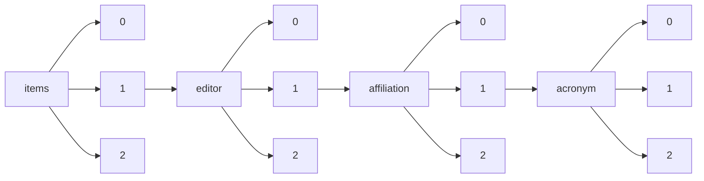

!!! warning "This document is not official Crossref documentation"
# Elements
PATH = items/array/editor/array/affiliation/array/acronym/array(1)  
Occurs 89 times  
Unique values: 11  
{ .annotate }

1. A route to an element, for example:  
   The route "items/array/editor/array/affiliation/array/acronym/array" corresponds to navigating through the JSON indices as  
   ["items"][0]["editor"][0]["affiliation"][0]["acronym"][0]  

| **Row** | **Value** `String` | **Count** `Int64` |
|--------:|----------------------:|---------------------:|
| **1**   | CAU                   | 53                   |
| **2**   | RTI                   | 16                   |
| **3**   | NCSU                  | 10                   |
| **4**   | IZMIRAN               | 2                    |
| **5**   | INAF                  | 2                    |
| **6**   | MLU                   | 1                    |
| **7**   | RGZM                  | 1                    |
| **8**   | WWU                   | 1                    |
| **9**   | KMI                   | 1                    |
| **10**  | CR                    | 1                    |
| **11**  | FSU                   | 1                    |

