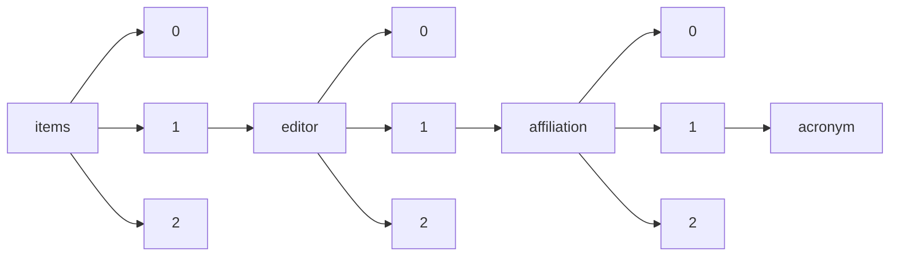

!!! warning "This document is not official Crossref documentation"
# Acronym
PATH = items/array/editor/array/affiliation/array/acronym(1)  
Occurs 89 times  
{ .annotate }

1. A route to an element, for example:  
   The route "items/array/editor/array/affiliation/array/acronym" corresponds to navigating through the JSON indices as  
   ["items"][0]["editor"][0]["affiliation"][0]["acronym"]  

## Properties of Array
See information about elements: [items/array/editor/array/affiliation/array/acronym/array](array/index.md)  
Distribution of lengths:  

| **Row** | **Length** `Any` | **Count** `Int64` |
|--------:|--------------------:|---------------------:|
| **1**   | 1                   | 89                   |

