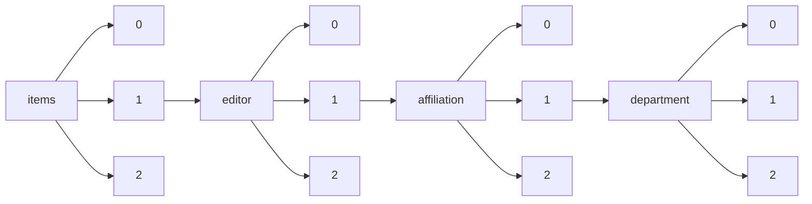

!!! warning "This document is not official Crossref documentation"
# Elements
PATH = items/array/editor/array/affiliation/array/department/array(1)  
Occurs 17 times  
Unique values: 12  
{ .annotate }

1. A route to an element, for example:  
   The route "items/array/editor/array/affiliation/array/department/array" corresponds to navigating through the JSON indices as  
   ["items"][0]["editor"][0]["affiliation"][0]["department"][0]  

| **Row** | **Value** `String`                                      | **Count** `Int64` |
|--------:|-----------------------------------------------------------:|---------------------:|
| **1**   | Radiology                                                  | 5                    |
| **2**   | Breast Imaging                                             | 2                    |
| **3**   | Pediatrics Radiology                                       | 1                    |
| **4**   | Institute of Evolutionary Biology                          | 1                    |
| **5**   | Radiology Department, University of Vermont Medical Center | 1                    |
| **6**   | Interventional Radiology                                   | 1                    |
| **7**   | Feline Outreach                                            | 1                    |
| **8**   | Urology and Medicine                                       | 1                    |
| **9**   | Gastrointestinal Radiology                                 | 1                    |
| **10**  | Neuroradiology                                             | 1                    |
| **11**  | Head & Neck Radiology                                      | 1                    |
| **12**  | Medical Physics                                            | 1                    |

