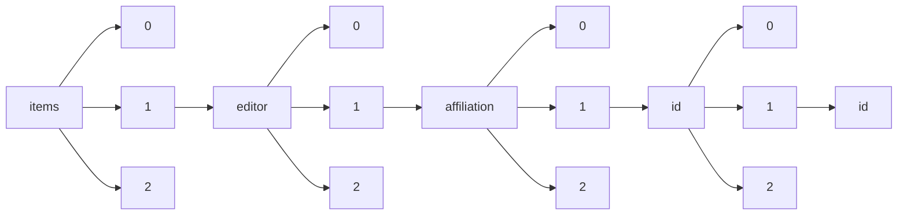

!!! warning "This document is not official Crossref documentation"
# Id
PATH = items/array/editor/array/affiliation/array/id/array/id(1)  
Occurs 3 877 times  
Unique values: 448  
{ .annotate }

1. A route to an element, for example:  
   The route "items/array/editor/array/affiliation/array/id/array/id" corresponds to navigating through the JSON indices as  
   ["items"][0]["editor"][0]["affiliation"][0]["id"][0]["id"]  

| **Row** | **Value** `String`                    | **Count** `Int64` |
|--------:|-----------------------------------------:|---------------------:|
| **1**   | https://ror.org/04a9tmd77                | 156                  |
| **2**   | https://ror.org/00f54p054                | 145                  |
| **3**   | https://ror.org/00hj54h04                | 121                  |
| **4**   | https://ror.org/04pp8hn57                | 78                   |
| **5**   | https://ror.org/052gg0110                | 77                   |
| **6**   | https://ror.org/013meh722                | 72                   |
| **7**   | https://ror.org/00hj8s172                | 72                   |
| **8**   | https://ror.org/03vek6s52                | 72                   |
| **9**   | https://ror.org/05gq02987                | 69                   |
| **10**  | https://ror.org/01cwqze88                | 69                   |
| **11**  | https://ror.org/05dxps055                | 67                   |
| **12**  | https://ror.org/046rm7j60                | 67                   |
| **13**  | https://ror.org/04cvxnb49                | 54                   |
| **14**  | https://ror.org/04v76ef78                | 54                   |
| **15**  | https://ror.org/00b30xv10                | 53                   |
| **16**  | https://ror.org/0165r2y73                | 48                   |
| **17**  | https://ror.org/0316ej306                | 46                   |
| **18**  | https://ror.org/01pxwe438                | 46                   |
| **19**  | https://ror.org/0243gzr89                | 45                   |
| **20**  | https://ror.org/04p491231                | 44                   |
| **21**  | https://ror.org/02crff812                | 43                   |
| **22**  | https://ror.org/012mef835                | 41                   |
| **23**  | https://ror.org/00za53h95                | 40                   |
| **24**  | https://ror.org/02feahw73                | 40                   |
| **25**  | https://ror.org/007ps6h72                | 39                   |
| **26**  | https://ror.org/0190ak572                | 39                   |
| **27**  | https://ror.org/03v76x132                | 38                   |
| **28**  | https://ror.org/03ht1xw27                | 36                   |
| **29**  | https://ror.org/057zh3y96                | 35                   |
| **30**  | https://ror.org/03czfpz43                | 35                   |
| **31**  | https://ror.org/05rrcem69                | 28                   |
| **32**  | https://ror.org/00jmfr291                | 28                   |
| **33**  | https://ror.org/05abbep66                | 26                   |
| **34**  | https://ror.org/01swzsf04                | 26                   |
| **35**  | https://ror.org/03rp50x72                | 26                   |
| **36**  | https://ror.org/024mw5h28                | 26                   |
| **37**  | https://ror.org/02jx3x895                | 25                   |
| **38**  | https://ror.org/009avj582                | 25                   |
| **39**  | https://ror.org/0384j8v12                | 25                   |
| **40**  | https://ror.org/016xsfp80                | 23                   |
| **41**  | https://ror.org/02pttbw34                | 23                   |
| **42**  | https://ror.org/03r8z3t63                | 23                   |
| **43**  | https://ror.org/01zgy1s35                | 22                   |
| **44**  | https://ror.org/02zhqgq86                | 22                   |
| **45**  | https://ror.org/04byxyr05                | 22                   |
| **46**  | https://ror.org/05wg1m734                | 21                   |
| **47**  | https://ror.org/02yrq0923                | 20                   |
| **48**  | https://ror.org/05x2bcf33                | 20                   |
| **49**  | https://ror.org/02wn5qz54                | 20                   |
| **50**  | https://ror.org/05dnene97                | 19                   |
| **51**  | https://ror.org/05bnh6r87                | 19                   |
| **52**  | https://ror.org/02vm5rt34                | 19                   |
| **53**  | https://ror.org/03gf8rp76                | 18                   |
| **54**  | https://ror.org/01an7q238                | 18                   |
| **55**  | https://ror.org/0168r3w48                | 17                   |
| **56**  | https://ror.org/006w34k90                | 17                   |
| **57**  | https://ror.org/0245cg223                | 17                   |
| **58**  | https://ror.org/00py81415                | 17                   |
| **59**  | https://ror.org/043mz5j54                | 16                   |
| **60**  | https://ror.org/052tfza37                | 16                   |
| **61**  | https://ror.org/0567t7073                | 16                   |
| **62**  | https://ror.org/00djv2c17                | 16                   |
| **63**  | https://ror.org/02ttsq026                | 16                   |
| **64**  | https://ror.org/035t8zc32                | 16                   |
| **65**  | https://ror.org/000e0be47                | 14                   |
| **66**  | https://ror.org/04xf4yw96                | 14                   |
| **67**  | https://ror.org/00cvxb145                | 14                   |
| **68**  | https://ror.org/03kpps236                | 14                   |
| **69**  | https://ror.org/03dbr7087                | 14                   |
| **70**  | https://ror.org/01yc7t268                | 13                   |
| **71**  | https://ror.org/02pammg90                | 13                   |
| **72**  | https://ror.org/05a0dhs15                | 13                   |
| **73**  | https://ror.org/04xeg9z08                | 13                   |
| **74**  | https://ror.org/01an3r305                | 13                   |
| **75**  | https://ror.org/034t30j35                | 12                   |
| **76**  | https://ror.org/043ddq142                | 12                   |
| **77**  | https://ror.org/036wvzt09                | 12                   |
| **78**  | https://www.wikidata.org/entity/Q3262326 | 12                   |
| **79**  | https://ror.org/00t9vx427                | 12                   |
| **80**  | https://www.isni.org/0000000120190559    | 12                   |
| **81**  | https://ror.org/035b05819                | 12                   |
| **82**  | https://ror.org/01nrxwf90                | 12                   |
| **83**  | https://ror.org/012zs8222                | 12                   |
| **84**  | https://ror.org/03prydq77                | 12                   |
| **85**  | https://ror.org/02cp04407                | 12                   |
| **86**  | https://ror.org/03wmf1y16                | 11                   |
| **87**  | https://ror.org/04t0gwh46                | 11                   |
| **88**  | https://www.isni.org/0000000121654861    | 11                   |
| **89**  | https://ror.org/04sjchr03                | 11                   |
| **90**  | https://ror.org/04mhzgx49                | 11                   |
| **91**  | https://ror.org/00tw3jy02                | 11                   |
| **92**  | https://ror.org/01s5ya894                | 11                   |
| **93**  | https://ror.org/0153tk833                | 11                   |
| **94**  | https://ror.org/03xez1567                | 10                   |
| **95**  | https://ror.org/02v51f717                | 10                   |
| **96**  | https://ror.org/01tmp8f25                | 10                   |
| **97**  | https://ror.org/041kmwe10                | 10                   |
| **98**  | https://ror.org/04bgfm609                | 9                    |
| **99**  | https://ror.org/03a26mh11                | 9                    |
| **100** | https://ror.org/02grkyz14                | 9                    |
| **101** | https://ror.org/03qxff017                | 9                    |
| **102** | https://ror.org/01ej9dk98                | 9                    |
| **103** | https://ror.org/00bas1c41                | 9                    |
| **104** | https://ror.org/0464eyp60                | 8                    |
| **105** | https://ror.org/05dq2gs74                | 8                    |
| **106** | https://ror.org/03taz7m60                | 8                    |
| **107** | https://ror.org/05qwgg493                | 8                    |
| **108** | https://ror.org/05byvp690                | 8                    |
| **109** | https://ror.org/051fd9666                | 7                    |
| **110** | https://ror.org/0145znz58                | 7                    |
| **111** | https://ror.org/0130frc33                | 7                    |
| **112** | https://ror.org/02r109517                | 7                    |
| **113** | https://ror.org/03e76ya46                | 7                    |
| **114** | https://ror.org/04a7f6w43                | 7                    |
| **115** | https://ror.org/040kfrw16                | 7                    |
| **116** | https://ror.org/040af2s02                | 7                    |
| **117** | https://ror.org/0155zta11                | 7                    |
| **118** | https://ror.org/02s376052                | 7                    |
| **119** | https://ror.org/047s2c258                | 7                    |
| **120** | https://ror.org/04gyf1771                | 7                    |
| **121** | https://ror.org/00t33hh48                | 7                    |
| **122** | https://ror.org/04rjz5883                | 7                    |
| **123** | https://ror.org/02me5cy06                | 6                    |
| **124** | https://ror.org/00dvg7y05                | 6                    |
| **125** | https://ror.org/05apxxy63                | 6                    |
| **126** | https://ror.org/008s83205                | 6                    |
| **127** | https://ror.org/00rqy9422                | 6                    |
| **128** | https://ror.org/036jqmy94                | 6                    |
| **129** | https://ror.org/02t274463                | 6                    |
| **130** | https://ror.org/02kkvpp62                | 6                    |
| **131** | https://ror.org/04xx1tc24                | 6                    |
| **132** | https://ror.org/03g5ew477                | 6                    |
| **133** | https://ror.org/036c27j91                | 6                    |
| **134** | https://ror.org/041nas322                | 6                    |
| **135** | https://ror.org/04rswrd78                | 6                    |
| **136** | https://ror.org/0488bnd65                | 6                    |
| **137** | https://ror.org/057qpr032                | 6                    |
| **138** | https://ror.org/0293rh119                | 6                    |
| **139** | https://ror.org/05f0yaq80                | 6                    |
| **140** | https://ror.org/022kthw22                | 5                    |
| **141** | https://ror.org/05cf8a891                | 5                    |
| **142** | https://ror.org/02mpq6x41                | 5                    |
| **143** | https://ror.org/03wyzt892                | 5                    |
| **144** | https://ror.org/035xkbk20                | 5                    |
| **145** | https://ror.org/01kj2bm70                | 5                    |
| **146** | https://ror.org/02tyrky19                | 5                    |
| **147** | https://ror.org/00v408z34                | 5                    |
| **148** | https://ror.org/00hx57361                | 5                    |
| **149** | https://ror.org/03angcq70                | 5                    |
| **150** | https://ror.org/02bfwt286                | 5                    |
| **151** | https://ror.org/028qa3n13                | 5                    |
| **152** | https://ror.org/05krs5044                | 5                    |
| **153** | https://ror.org/01gb99w41                | 5                    |
| **154** | https://ror.org/0160cpw27                | 5                    |
| **155** | https://ror.org/04g9wch13                | 5                    |
| **156** | https://ror.org/0220mzb33                | 5                    |
| **157** | https://ror.org/01esghr10                | 5                    |
| **158** | https://ror.org/012pb6c26                | 5                    |
| **159** | https://ror.org/0420db125                | 5                    |
| **160** | https://ror.org/03p74gp79                | 5                    |
| **161** | https://ror.org/056jjra10                | 5                    |
| **162** | https://ror.org/0015ws592                | 5                    |
| **163** | https://ror.org/019whta54                | 5                    |
| **164** | https://ror.org/03h2bxq36                | 4                    |
| **165** | https://ror.org/04h9pn542                | 4                    |
| **166** | https://ror.org/01a77tt86                | 4                    |
| **167** | https://ror.org/03cve4549                | 4                    |
| **168** | https://ror.org/01znkr924                | 4                    |
| **169** | https://ror.org/005dvqh91                | 4                    |
| **170** | https://ror.org/02gfc7t72                | 4                    |
| **171** | https://ror.org/04q9qf557                | 4                    |
| **172** | https://ror.org/05b8d3w18                | 4                    |
| **173** | https://ror.org/03yjb2x39                | 4                    |
| **174** | https://ror.org/02f6dcw23                | 4                    |
| **175** | https://ror.org/02qg15b79                | 4                    |
| **176** | https://ror.org/04dkp9463                | 4                    |
| **177** | https://ror.org/01q1z8k08                | 4                    |
| **178** | https://ror.org/00q16t150                | 4                    |
| **179** | https://ror.org/04vqm6w82                | 4                    |
| **180** | https://ror.org/05vt9qd57                | 4                    |
| **181** | https://ror.org/01z1gye03                | 4                    |
| **182** | https://ror.org/05hs6h993                | 4                    |
| **183** | https://ror.org/038t36y30                | 4                    |
| **184** | https://ror.org/03yxnpp24                | 4                    |
| **185** | https://ror.org/02a8bt934                | 4                    |
| **186** | https://ror.org/0207ad724                | 4                    |
| **187** | https://ror.org/00cz47042                | 4                    |
| **188** | https://ror.org/012p63287                | 4                    |
| **189** | https://ror.org/04gnjpq42                | 4                    |
| **190** | https://ror.org/00jc20583                | 4                    |
| **191** | https://ror.org/013cjyk83                | 4                    |
| **192** | https://ror.org/01aj84f44                | 4                    |
| **193** | https://ror.org/01d88se56                | 3                    |
| **194** | https://ror.org/0499dwk57                | 3                    |
| **195** | https://ror.org/01r9z8p25                | 3                    |
| **196** | https://ror.org/04tnbqb63                | 3                    |
| **197** | https://ror.org/04qzfn040                | 3                    |
| **198** | https://ror.org/02s6k3f65                | 3                    |
| **199** | https://ror.org/0107c5v14                | 3                    |
| **200** | https://ror.org/021wm7p51                | 3                    |
| **201** | https://ror.org/03xjacd83                | 3                    |
| **202** | https://ror.org/0420zvk78                | 3                    |
| **203** | https://ror.org/01yp9g959                | 3                    |
| **204** | https://ror.org/02be6w209                | 3                    |
| **205** | https://ror.org/026vcq606                | 3                    |
| **206** | https://ror.org/008zs3103                | 3                    |
| **207** | https://ror.org/01pnej532                | 3                    |
| **208** | https://ror.org/02bpp8r91                | 3                    |
| **209** | https://ror.org/03wjwyj98                | 3                    |
| **210** | https://ror.org/03qt6ba18                | 3                    |
| **211** | https://ror.org/00ggpsq73                | 3                    |
| **212** | https://ror.org/03g001n57                | 3                    |
| **213** | https://ror.org/05twjp994                | 3                    |
| **214** | https://ror.org/02cn3rm21                | 3                    |
| **215** | https://ror.org/046ak2485                | 3                    |
| **216** | https://ror.org/02smfhw86                | 3                    |
| **217** | https://ror.org/03rmrcq20                | 3                    |
| **218** | https://ror.org/04j1n1c04                | 3                    |
| **219** | https://ror.org/02495e989                | 3                    |
| **220** | https://ror.org/04nbhqj75                | 3                    |
| **221** | https://ror.org/04gqx4x78                | 3                    |
| **222** | https://ror.org/02qz8b764                | 3                    |
| **223** | https://ror.org/04dese585                | 3                    |
| **224** | https://ror.org/02vjkv261                | 3                    |
| **225** | https://ror.org/04b6nzv94                | 3                    |
| **226** | https://ror.org/00rs6vg23                | 3                    |
| **227** | https://ror.org/0000pmw59                | 3                    |
| **228** | https://ror.org/00fq5cm18                | 3                    |
| **229** | https://ror.org/00t3r8h32                | 3                    |
| **230** | https://ror.org/021018s57                | 3                    |
| **231** | https://ror.org/04s5mat29                | 3                    |
| **232** | https://ror.org/02bns0488                | 3                    |
| **233** | https://ror.org/01y2jtd41                | 3                    |
| **234** | https://ror.org/042nb2s44                | 3                    |
| **235** | https://ror.org/0492wrx28                | 3                    |
| **236** | https://ror.org/00987cb86                | 2                    |
| **237** | https://ror.org/046865y68                | 2                    |
| **238** | https://ror.org/0575yy874                | 2                    |
| **239** | https://ror.org/032000t02                | 2                    |
| **240** | https://ror.org/01g9ty582                | 2                    |
| **241** | https://ror.org/006jb1a24                | 2                    |
| **242** | https://ror.org/027ynra39                | 2                    |
| **243** | https://ror.org/00k9x6n46                | 2                    |
| **244** | https://ror.org/05r8dqr10                | 2                    |
| **245** | https://ror.org/019wvm592                | 2                    |
| **246** | https://ror.org/01vztzd79                | 2                    |
| **247** | https://ror.org/000cyem11                | 2                    |
| **248** | https://ror.org/03xqtf034                | 2                    |
| **249** | https://ror.org/02dxx6824                | 2                    |
| **250** | https://ror.org/04mfzb702                | 2                    |
| **251** | https://ror.org/010nsgg66                | 2                    |
| **252** | https://ror.org/05trd4x28                | 2                    |
| **253** | https://ror.org/03efmqc40                | 2                    |
| **254** | https://ror.org/047dqcg40                | 2                    |
| **255** | https://ror.org/043jzw605                | 2                    |
| **256** | https://ror.org/022jc0g24                | 2                    |
| **257** | https://ror.org/039a53269                | 2                    |
| **258** | https://ror.org/020aczd56                | 2                    |
| **259** | https://ror.org/017zqws13                | 2                    |
| **260** | https://ror.org/050sv4x28                | 2                    |
| **261** | https://ror.org/04vmvtb21                | 2                    |
| **262** | https://ror.org/03k1gpj17                | 2                    |
| **263** | https://ror.org/023vrr657                | 2                    |
| **264** | https://ror.org/0112mx960                | 2                    |
| **265** | https://ror.org/00088z429                | 2                    |
| **266** | https://ror.org/0294hxs80                | 2                    |
| **267** | https://ror.org/03a1kwz48                | 2                    |
| **268** | https://ror.org/05fs6jp91                | 2                    |
| **269** | https://ror.org/03f0f6041                | 2                    |
| **270** | https://ror.org/02kzqn938                | 2                    |
| **271** | https://ror.org/03npzn484                | 2                    |
| **272** | https://ror.org/00pt8r998                | 2                    |
| **273** | https://ror.org/022fs9h90                | 2                    |
| **274** | https://ror.org/03r0ha626                | 2                    |
| **275** | https://ror.org/01c2cjg59                | 2                    |
| **276** | https://ror.org/02mb95055                | 2                    |
| **277** | https://ror.org/00trqv719                | 2                    |
| **278** | https://ror.org/02xg1m795                | 2                    |
| **279** | https://ror.org/04p5ggc03                | 2                    |
| **280** | https://ror.org/03c4mmv16                | 2                    |
| **281** | https://ror.org/03d1wq758                | 2                    |
| **282** | https://ror.org/018906e22                | 2                    |
| **283** | https://ror.org/02gh4kt33                | 2                    |
| **284** | https://ror.org/0213rcc28                | 2                    |
| **285** | https://ror.org/023hj5876                | 2                    |
| **286** | https://ror.org/03dmz0111                | 2                    |
| **287** | https://ror.org/056d84691                | 2                    |
| **288** | https://ror.org/04rq5mt64                | 2                    |
| **289** | https://ror.org/00wm07d60                | 2                    |
| **290** | https://ror.org/04drvxt59                | 2                    |
| **291** | https://ror.org/04hf5kq57                | 2                    |
| **292** | https://ror.org/02jzgtq86                | 2                    |
| **293** | https://ror.org/03yj89h83                | 2                    |
| **294** | https://ror.org/03zzw1w08                | 2                    |
| **295** | https://ror.org/02en5vm52                | 2                    |
| **296** | https://ror.org/02n2fzt79                | 2                    |
| **297** | https://ror.org/00a6ram87                | 1                    |
| **298** | https://ror.org/01bj3aw27                | 1                    |
| **299** | https://ror.org/05fe7ax82                | 1                    |
| **300** | https://ror.org/021sy4w91                | 1                    |
| **301** | https://ror.org/04374qe70                | 1                    |
| **302** | https://ror.org/05f82e368                | 1                    |
| **303** | https://ror.org/00h6set76                | 1                    |
| **304** | https://ror.org/00te3t702                | 1                    |
| **305** | https://ror.org/036x5ad56                | 1                    |
| **306** | https://ror.org/039bjqg32                | 1                    |
| **307** | https://ror.org/048fyec77                | 1                    |
| **308** | https://ror.org/04qw24q55                | 1                    |
| **309** | https://ror.org/00ygt2y02                | 1                    |
| **310** | https://ror.org/036c9yv20                | 1                    |
| **311** | https://ror.org/022k4wk35                | 1                    |
| **312** | https://ror.org/04m5j1k67                | 1                    |
| **313** | https://ror.org/05n3dz165                | 1                    |
| **314** | https://ror.org/017fpfn86                | 1                    |
| **315** | https://ror.org/01hcx6992                | 1                    |
| **316** | https://ror.org/0509zzg37                | 1                    |
| **317** | https://ror.org/04yrgt058                | 1                    |
| **318** | https://ror.org/02pthyn77                | 1                    |
| **319** | https://ror.org/043z4tv69                | 1                    |
| **320** | https://www.isni.org/0000000405062673    | 1                    |
| **321** | https://ror.org/01sjwvz98                | 1                    |
| **322** | https://ror.org/024d6js02                | 1                    |
| **323** | https://ror.org/01hhn8329                | 1                    |
| **324** | https://ror.org/01ee9ar58                | 1                    |
| **325** | https://ror.org/032d4f246                | 1                    |
| **326** | https://ror.org/05f950310                | 1                    |
| **327** | https://ror.org/00h9jrb69                | 1                    |
| **328** | https://ror.org/054484h93                | 1                    |
| **329** | https://ror.org/00a0jsq62                | 1                    |
| **330** | https://ror.org/050gn5214                | 1                    |
| **331** | https://ror.org/02bqrry13                | 1                    |
| **332** | https://ror.org/01bf9rw71                | 1                    |
| **333** | https://ror.org/02k7v4d05                | 1                    |
| **334** | https://ror.org/03wkt5x30                | 1                    |
| **335** | https://ror.org/040gcmg81                | 1                    |
| **336** | https://ror.org/01r9htc13                | 1                    |
| **337** | https://ror.org/03av75f26                | 1                    |
| **338** | https://ror.org/03anc3s24                | 1                    |
| **339** | https://ror.org/051escj72                | 1                    |
| **340** | https://ror.org/02956yf07                | 1                    |
| **341** | https://ror.org/04cw6st05                | 1                    |
| **342** | https://ror.org/001w7jn25                | 1                    |
| **343** | https://ror.org/02k40bc56                | 1                    |
| **344** | https://ror.org/02f5b7n18                | 1                    |
| **345** | https://ror.org/03yghzc09                | 1                    |
| **346** | https://ror.org/05qpz1x62                | 1                    |
| **347** | https://ror.org/046dg4z72                | 1                    |
| **348** | https://ror.org/02jzrsm59                | 1                    |
| **349** | https://ror.org/052d1a351                | 1                    |
| **350** | https://ror.org/04esvpn06                | 1                    |
| **351** | https://ror.org/03z6z3n38                | 1                    |
| **352** | https://ror.org/00v97ad02                | 1                    |
| **353** | https://ror.org/02hfpnk21                | 1                    |
| **354** | https://ror.org/013v7fk41                | 1                    |
| **355** | https://ror.org/0202bj006                | 1                    |
| **356** | https://ror.org/01cah1n37                | 1                    |
| **357** | https://ror.org/01b3dvp57                | 1                    |
| **358** | https://ror.org/04yrqp957                | 1                    |
| **359** | https://ror.org/01zkghx44                | 1                    |
| **360** | https://ror.org/05qdwtz81                | 1                    |
| **361** | https://ror.org/04ttjf776                | 1                    |
| **362** | https://ror.org/05n3x4p02                | 1                    |
| **363** | https://ror.org/049s0rh22                | 1                    |
| **364** | https://ror.org/024mrxd33                | 1                    |
| **365** | https://ror.org/01dp7jr64                | 1                    |
| **366** | https://ror.org/01kq0pv72                | 1                    |
| **367** | https://ror.org/03fvnzx77                | 1                    |
| **368** | https://ror.org/032nzv584                | 1                    |
| **369** | https://ror.org/00czgcw56                | 1                    |
| **370** | https://ror.org/02309jg23                | 1                    |
| **371** | https://ror.org/053jehz60                | 1                    |
| **372** | https://ror.org/05vzafd60                | 1                    |
| **373** | https://ror.org/02rbfnr22                | 1                    |
| **374** | https://ror.org/01cby8j38                | 1                    |
| **375** | https://ror.org/03zjqec80                | 1                    |
| **376** | https://ror.org/02r2k1c68                | 1                    |
| **377** | https://ror.org/027m9bs27                | 1                    |
| **378** | https://ror.org/03cjqqq10                | 1                    |
| **379** | https://ror.org/04t5xt781                | 1                    |
| **380** | https://ror.org/01pp8nd67                | 1                    |
| **381** | https://ror.org/0495fxg12                | 1                    |
| **382** | https://ror.org/03d0p2685                | 1                    |
| **383** | https://ror.org/05gqaka33                | 1                    |
| **384** | https://ror.org/00hx6zz33                | 1                    |
| **385** | https://ror.org/012gwbh42                | 1                    |
| **386** | https://ror.org/05kxtq558                | 1                    |
| **387** | https://ror.org/0534re684                | 1                    |
| **388** | https://ror.org/00pd74e08                | 1                    |
| **389** | https://ror.org/0081fs513                | 1                    |
| **390** | https://ror.org/03x0d4x24                | 1                    |
| **391** | https://ror.org/03b94tp07                | 1                    |
| **392** | https://ror.org/03ap2av50                | 1                    |
| **393** | https://www.isni.org/0000000119440258    | 1                    |
| **394** | https://ror.org/04teye511                | 1                    |
| **395** | https://ror.org/04b08hq31                | 1                    |
| **396** | https://ror.org/04v8djg66                | 1                    |
| **397** | https://www.isni.org/0000000123423717    | 1                    |
| **398** | https://ror.org/02b6qw903                | 1                    |
| **399** | https://ror.org/02kn6nx58                | 1                    |
| **400** | https://ror.org/019k4jq75                | 1                    |
| **401** | https://ror.org/002pd6e78                | 1                    |
| **402** | https://ror.org/05k6m5t95                | 1                    |
| **403** | https://ror.org/02c5gc203                | 1                    |
| **404** | https://ror.org/00f7hpc57                | 1                    |
| **405** | https://ror.org/02vmz1g97                | 1                    |
| **406** | https://ror.org/01tgyzw49                | 1                    |
| **407** | https://ror.org/05ggc9x40                | 1                    |
| **408** | https://ror.org/0587ef340                | 1                    |
| **409** | https://ror.org/000rdbk18                | 1                    |
| **410** | https://ror.org/04xpsrn94                | 1                    |
| **411** | https://ror.org/04b6x2g63                | 1                    |
| **412** | https://ror.org/0483qx226                | 1                    |
| **413** | https://ror.org/00m6w7z96                | 1                    |
| **414** | https://ror.org/037zgn354                | 1                    |
| **415** | https://ror.org/00mcjh785                | 1                    |
| **416** | https://ror.org/01dr6c206                | 1                    |
| **417** | https://ror.org/03r4m3349                | 1                    |
| **418** | https://ror.org/058qm9p63                | 1                    |
| **419** | https://ror.org/033eqas34                | 1                    |
| **420** | https://ror.org/033vjfk17                | 1                    |
| **421** | https://ror.org/03mpa3n40                | 1                    |
| **422** | https://ror.org/02eptjh02                | 1                    |
| **423** | https://ror.org/036rp1748                | 1                    |
| **424** | https://ror.org/00ynnr806                | 1                    |
| **425** | https://ror.org/03ryywt80                | 1                    |
| **426** | https://ror.org/03gnh5541                | 1                    |
| **427** | https://ror.org/05a28rw58                | 1                    |
| **428** | https://ror.org/037b5pv06                | 1                    |
| **429** | https://ror.org/0538gdx71                | 1                    |
| **430** | https://www.wikidata.org/entity/Q5188229 | 1                    |
| **431** | https://ror.org/0524sp257                | 1                    |
| **432** | https://ror.org/03h7r5v07                | 1                    |
| **433** | https://ror.org/01kg8sb98                | 1                    |
| **434** | https://ror.org/04bdffz58                | 1                    |
| **435** | https://ror.org/01c27hj86                | 1                    |
| **436** | https://ror.org/02twcfp32                | 1                    |
| **437** | https://ror.org/02wnxgj78                | 1                    |
| **438** | https://ror.org/03m2x1q45                | 1                    |
| **439** | https://ror.org/02w0trx84                | 1                    |
| **440** | https://ror.org/03mtd9a03                | 1                    |
| **441** | https://ror.org/02hwp6a56                | 1                    |
| **442** | https://ror.org/05cb4rb43                | 1                    |
| **443** | https://ror.org/01tyv8576                | 1                    |
| **444** | https://ror.org/0400g8r85                | 1                    |
| **445** | https://ror.org/01jsq2704                | 1                    |
| **446** | https://ror.org/03ykbk197                | 1                    |
| **447** | https://ror.org/05t8khn72                | 1                    |
| **448** | https://ror.org/02b4apg34                | 1                    |

