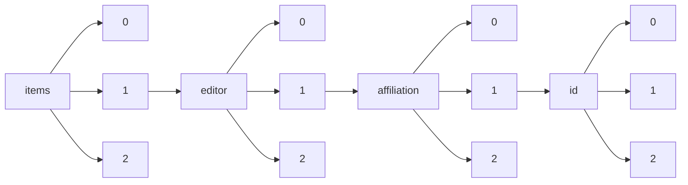

!!! warning "This document is not official Crossref documentation"
# Elements
PATH = items/array/editor/array/affiliation/array/id/array(1)  
Occurs 3 877 times  
{ .annotate }

1. A route to an element, for example:  
   The route "items/array/editor/array/affiliation/array/id/array" corresponds to navigating through the JSON indices as  
   ["items"][0]["editor"][0]["affiliation"][0]["id"][0]  

## Asserted-by
See more information: [items/array/editor/array/affiliation/array/id/array/asserted-by](asserted-by/index.md)  
Occurs 3 877 timess  
Unique values: 1  

| **Row** | **Value** `String` | **Count** `Int64` |
|--------:|----------------------:|---------------------:|
| **1**   | publisher             | 3 877                |

## Id
See more information: [items/array/editor/array/affiliation/array/id/array/id](id/index.md)  
Occurs 3 877 timess  
Unique values: 448  

| **Row** | **Value** `String`     | **Count** `Int64` |
|--------:|--------------------------:|---------------------:|
| **1**   | https://ror.org/04a9tmd77 | 156                  |
| **2**   | https://ror.org/00f54p054 | 145                  |
| **3**   | https://ror.org/00hj54h04 | 121                  |
| **4**   | https://ror.org/04pp8hn57 | 78                   |
| **5**   | https://ror.org/052gg0110 | 77                   |
| **6**   | https://ror.org/013meh722 | 72                   |
| **7**   | https://ror.org/00hj8s172 | 72                   |
| **8**   | https://ror.org/03vek6s52 | 72                   |
| **9**   | https://ror.org/05gq02987 | 69                   |
| **10**  | https://ror.org/01cwqze88 | 69                   |
| ... | ... | ... |

## Id-type
See more information: [items/array/editor/array/affiliation/array/id/array/id-type](id-type/index.md)  
Occurs 3 877 timess  
Unique values: 3  

| **Row** | **Value** `String` | **Count** `Int64` |
|--------:|----------------------:|---------------------:|
| **1**   | ROR                   | 3 838                |
| **2**   | ISNI                  | 26                   |
| **3**   | wikidata              | 13                   |

