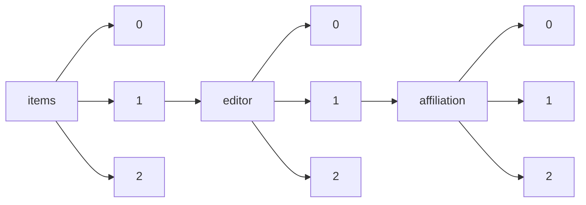

!!! warning "This document is not official Crossref documentation"
# Elements
PATH = items/array/editor/array/affiliation/array(1)  
Occurs 339 751 times  
{ .annotate }

1. A route to an element, for example:  
   The route "items/array/editor/array/affiliation/array" corresponds to navigating through the JSON indices as  
   ["items"][0]["editor"][0]["affiliation"][0]  

## Acronym
See more information: [items/array/editor/array/affiliation/array/acronym](acronym/index.md)  
Occurs 89 timess  

| **Row** | **Length** `Any` | **Count** `Int64` |
|--------:|--------------------:|---------------------:|
| **1**   | 1                   | 89                   |

## Department
See more information: [items/array/editor/array/affiliation/array/department](department/index.md)  
Occurs 17 timess  

| **Row** | **Length** `Any` | **Count** `Int64` |
|--------:|--------------------:|---------------------:|
| **1**   | 1                   | 17                   |

## Id
See more information: [items/array/editor/array/affiliation/array/id](id/index.md)  
Occurs 3 838 timess  

| **Row** | **Length** `Any` | **Count** `Int64` |
|--------:|--------------------:|---------------------:|
| **1**   | 1                   | 3 812                |
| **2**   | 2                   | 13                   |
| **3**   | 3                   | 13                   |

## Name
See more information: [items/array/editor/array/affiliation/array/name](name/index.md)  
Occurs 339 731 timess  
Unique values: > 999  

!!! note "Due to current limitations, only the first 1,000 unique values are counted."

| **Row** | **Value** `String`                                             | **Count** `Int64` |
|--------:|------------------------------------------------------------------:|---------------------:|
| **1**   | NamesforLife, LLC                                                 | 191 424              |
| **2**   | University College Cork                                           | 864                  |
| **3**   | Nanyang Technological Univ. (Singapore)                           | 835                  |
| **4**   | College of Optical Sciences, The Univ. of Arizona (United States) | 797                  |
| **5**   | University College Cork, Ireland.                                 | 785                  |
| **6**   | University of Florence, IT                                        | 744                  |
| **7**   | Warsaw Univ. of Technology (Poland)                               | 741                  |
| **8**   | Institute of Optics and Electronics (China)                       | 722                  |
| **9**   | European Southern Observatory (Germany)                           | 649                  |
| **10**  | The Hong Kong Polytechnic Univ. (Hong Kong, China)                | 579                  |
| ... | ... | ... |

## Place
See more information: [items/array/editor/array/affiliation/array/place](place/index.md)  
Occurs 5 718 timess  

| **Row** | **Length** `Any` | **Count** `Int64` |
|--------:|--------------------:|---------------------:|
| **1**   | 1                   | 5 718                |

