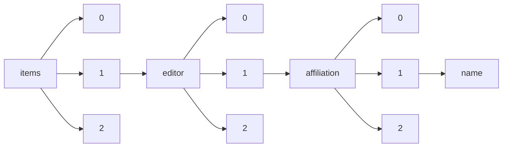

!!! warning "This document is not official Crossref documentation"
# Name
PATH = items/array/editor/array/affiliation/array/name(1)  
Occurs 339 731 times  
Unique values: > 999  
{ .annotate }

1. A route to an element, for example:  
   The route "items/array/editor/array/affiliation/array/name" corresponds to navigating through the JSON indices as  
   ["items"][0]["editor"][0]["affiliation"][0]["name"]  

!!! note "Due to current limitations, only the first 1,000 unique values are counted."

| **Row** | **Value** `String`                                                                                | **Count** `Int64` |
|--------:|-----------------------------------------------------------------------------------------------------:|---------------------:|
| **1**   | NamesforLife, LLC                                                                                    | 191 424              |
| **2**   | University College Cork                                                                              | 864                  |
| **3**   | Nanyang Technological Univ. (Singapore)                                                              | 835                  |
| **4**   | College of Optical Sciences, The Univ. of Arizona (United States)                                    | 797                  |
| **5**   | University College Cork, Ireland.                                                                    | 785                  |
| **6**   | University of Florence, IT                                                                           | 744                  |
| **7**   | Warsaw Univ. of Technology (Poland)                                                                  | 741                  |
| **8**   | Institute of Optics and Electronics (China)                                                          | 722                  |
| **9**   | European Southern Observatory (Germany)                                                              | 649                  |
| **10**  | The Hong Kong Polytechnic Univ. (Hong Kong, China)                                                   | 579                  |
| **11**  | National Research Council Canada (Canada)                                                            | 549                  |
| **12**  | V.E. Zuev Institute of Atmospheric Optics (Russian Federation)                                       | 528                  |
| **13**  | UK Astronomy Technology Ctr. (United Kingdom)                                                        | 492                  |
| **14**  | Shanghai Institute of Optics and Fine Mechanics (China)                                              | 447                  |
| **15**  | The Univ. of Sydney (Australia)                                                                      | 445                  |
| **16**  | The Univ. of Arizona (United States)                                                                 | 440                  |
| **17**  | Seoul National Univ. (Korea, Republic of)                                                            | 432                  |
| **18**  | Air Force Research Lab. (United States)                                                              | 378                  |
| **19**  | USA                                                                                                  | 377                  |
| **20**  | Gwangju Institute of Science and Technology (Korea, Republic of)                                     | 374                  |
| **21**  | University of California, Berkeley, United States                                                    | 371                  |
| **22**  | Harvard-Smithsonian Ctr. for Astrophysics (United States)                                            | 368                  |
| **23**  | TomoWave Laboratories, Inc. (United States)                                                          | 359                  |
| **24**  | Harvard Medical School, United States                                                                | 358                  |
| **25**  | University of Oxford, United Kingdom                                                                 | 344                  |
| **26**  | Tokyo Institute of Technology (Japan)                                                                | 342                  |
| **27**  | Harbin Engineering Univ. (China)                                                                     | 340                  |
| **28**  | Jet Propulsion Lab. (United States)                                                                  | 338                  |
| **29**  | Intel Corp. (United States)                                                                          | 334                  |
| **30**  | Massachusetts Institute of Technology (United States)                                                | 319                  |
| **31**  | Wuhan Univ. (China)                                                                                  | 314                  |
| **32**  | California Institute of Technology, United States                                                    | 313                  |
| **33**  | The Univ. of Tokyo (Japan)                                                                           | 302                  |
| **34**  | Shanghai Institute of Technical Physics (China)                                                      | 299                  |
| **35**  | Subaru Telescope, National Astronomical Observatory of Japan (United States)                         | 292                  |
| **36**  | The Pennsylvania State Univ. (United States)                                                         | 288                  |
| **37**  | U.S. Army Research Lab. (United States)                                                              | 286                  |
| **38**  | Univ. of Shanghai for Science and Technology (China)                                                 | 282                  |
| **39**  | Indiana University                                                                                   | 282                  |
| **40**  | Saratov State Univ. (Russian Federation)                                                             | 278                  |
| **41**  | Editor                                                                                               | 270                  |
| **42**  | Vanderbilt Univ. (United States)                                                                     | 268                  |
| **43**  | Emory University, United States                                                                      | 260                  |
| **44**  | University of Birmingham, UK                                                                         | 254                  |
| **45**  | Politehnica Univ. of Bucharest (Romania)                                                             | 254                  |
| **46**  | Northwestern Univ. (United States)                                                                   | 253                  |
| **47**  | Brandeis University, United States                                                                   | 253                  |
| **48**  | The Univ. of North Carolina at Chapel Hill (United States)                                           | 249                  |
| **49**  | California Institute of Technology (United States)                                                   | 249                  |
| **50**  | Univ. of Michigan (United States)                                                                    | 249                  |
| **51**  | Utrecht University, Netherlands                                                                      | 248                  |
| **52**  | Japan Aerospace Exploration Agency (Japan)                                                           | 240                  |
| **53**  | Washington Univ. in St. Louis (United States)                                                        | 238                  |
| **54**  | The University of Texas at Austin, United States                                                     | 232                  |
| **55**  | Univ. of Žilina (Slovakia)                                                                           | 231                  |
| **56**  | Fudan Univ. (China)                                                                                  | 230                  |
| **57**  | Univ. of California, Davis (United States)                                                           | 230                  |
| **58**  | Lawrence Livermore National Lab. (United States)                                                     | 228                  |
| **59**  | Weill Cornell Medicine, United States                                                                | 224                  |
| **60**  | U.S. Food and Drug Administration (United States)                                                    | 222                  |
| **61**  | NASA Langley Research Ctr. (United States)                                                           | 222                  |
| **62**  | Lawrence Berkeley National Lab. (United States)                                                      | 221                  |
| **63**  | University of Michigan, United States                                                                | 220                  |
| **64**  | Stanford University School of Medicine, United States                                                | 220                  |
| **65**  | University of California, Los Angeles, United States                                                 | 220                  |
| **66**  | Istituto di Fisica Applicata Nello Carrara (Italy)                                                   | 217                  |
| **67**  | Tianjin Univ. (China)                                                                                | 217                  |
| **68**  | NASA Ames Research Ctr. (United States)                                                              | 217                  |
| **69**  | Xi'an Jiaotong Univ. (China)                                                                         | 216                  |
| **70**  | NOVA Optical & Infrared Instrumentation Group at ASTRON (Netherlands)                                | 210                  |
| **71**  | Cyprus Univ. of Technology (Cyprus)                                                                  | 210                  |
| **72**  | IBM Research - Almaden (United States)                                                               | 206                  |
| **73**  | Qorvo™ (United States)                                                                               | 206                  |
| **74**  | Ball Aerospace & Technologies Corp. (United States)                                                  | 205                  |
| **75**  | University of Stirling, UK                                                                           | 205                  |
| **76**  | Univ. Kassel (Germany)                                                                               | 202                  |
| **77**  | Synopsys, Inc. (United States)                                                                       | 201                  |
| **78**  | National Optical Astronomy Observatory (United States)                                               | 198                  |
| **79**  | University Medical Center Hamburg-Eppendorf, Germany                                                 | 198                  |
| **80**  | Siemens Healthcare GmbH (Germany)                                                                    | 197                  |
| **81**  | Johns Hopkins University School of Medicine, United States                                           | 197                  |
| **82**  | Duke Univ. Medical Ctr. (United States)                                                              | 197                  |
| **83**  | Marquette Univ. (United States)                                                                      | 197                  |
| **84**  | China Aerodynamics Research & Development Ctr. (China)                                               | 197                  |
| **85**  | China North Institute of Electronic Equipment (China)                                                | 197                  |
| **86**  | Pacific Northwest National Lab. (United States)                                                      | 197                  |
| **87**  | Institute of High Energy Physics (China)                                                             | 197                  |
| **88**  | SRON Netherlands Institute for Space Research (Netherlands)                                          | 195                  |
| **89**  | Icahn School of Medicine at Mount Sinai                                                              | 195                  |
| **90**  | Beckman Laser Institute and Medical Clinic (United States)                                           | 194                  |
| **91**  | National Association of Professional Women (United States)                                           | 193                  |
| **92**  | Osaka Univ. (Japan)                                                                                  | 193                  |
| **93**  | Columbia University, United States                                                                   | 193                  |
| **94**  | DKIST/National Solar Observatory (United States)                                                     | 193                  |
| **95**  | Max Planck Institute for Heart and Lung Research, Germany                                            | 190                  |
| **96**  | Harvard University, United States                                                                    | 190                  |
| **97**  | AGH Univ. of Science and Technology (Poland)                                                         | 188                  |
| **98**  | Stanford University, United States                                                                   | 184                  |
| **99**  | University of Oxford                                                                                 | 177                  |
| **100** | The Univ. of New Mexico (United States)                                                              | 177                  |
| **101** | Reviresco LLC (United States)                                                                        | 175                  |
| **102** | U.S. Army Night Vision & Electronic Sensors Directorate (United States)                              | 174                  |
| **103** | Middle East Technical University, Turkey                                                             | 174                  |
| **104** | McGill University, Canada                                                                            | 173                  |
| **105** | University of Pennsylvania, United States                                                            | 173                  |
| **106** | Kidger Optics Associates (United Kingdom)                                                            | 172                  |
| **107** | Banpil Photonics, Inc. (United States)                                                               | 170                  |
| **108** | Utrecht University                                                                                   | 167                  |
| **109** | Palacký Univ. Olomouc (Czech Republic)                                                               | 166                  |
| **110** | Military Univ. of Technology (Poland)                                                                | 166                  |
| **111** | University of Cambridge, United Kingdom                                                              | 164                  |
| **112** | Institute of Electronics (Bulgaria)                                                                  | 162                  |
| **113** | Oberösterreichisches Laserzentrum (Austria)                                                          | 159                  |
| **114** | Povolzhskiy State Univ. of Telecommunications and Informatics (Russian Federation)                   | 159                  |
| **115** | Max Planck Institute for Developmental Biology, Germany                                              | 158                  |
| **116** | National Centre for Biological Sciences, Tata Institute of Fundamental Research, India               | 157                  |
| **117** | Chiba Univ. (Japan)                                                                                  | 156                  |
| **118** | Johns Hopkins Univ. (United States)                                                                  | 154                  |
| **119** | University of Newcastle, Australia                                                                   | 154                  |
| **120** | Institute for Automation and Control Processes (Russian Federation)                                  | 154                  |
| **121** | British Journal of Nursing                                                                           | 153                  |
| **122** | The Univ. of Chicago (United States)                                                                 | 151                  |
| **123** | U.S. Department of Agriculture                                                                       | 151                  |
| **124** | Univ. Federal de Santa Catarina (Brazil)                                                             | 150                  |
| **125** | Vrije Univ. Brussel (Belgium)                                                                        | 150                  |
| **126** | Weizmann Institute of Science, Israel                                                                | 149                  |
| **127** | AdValue Photonics, Inc. (United States)                                                              | 149                  |
| **128** | Commonwealth Scientific and Industrial Research Organisation (Australia)                             | 149                  |
| **129** | Brown University, United States                                                                      | 146                  |
| **130** | Université Laval, Canada                                                                             | 146                  |
| **131** | GLOBALFOUNDRIES Inc. (United States)                                                                 | 144                  |
| **132** | Institute of Photonics and Electronics of the ASCR, v.v.i. (Czech Republic)                          | 144                  |
| **133** | National Institute of Standards and Technology (United States)                                       | 143                  |
| **134** | Univ. of Rochester (United States)                                                                   | 142                  |
| **135** | Harbin Institute of Technology (China)                                                               | 141                  |
| **136** | Univ. of California, Los Angeles (United States)                                                     | 141                  |
| **137** | University of California, San Francisco, United States                                               | 139                  |
| **138** | Peking Univ. (China)                                                                                 | 139                  |
| **139** | University of Seville, Spain                                                                         | 138                  |
| **140** | Huazhong Univ. of Science and Technology (China)                                                     | 137                  |
| **141** | Univ. of Toronto (Canada)                                                                            | 137                  |
| **142** | Friedrich-Schiller-Univ. Jena (Germany)                                                              | 137                  |
| **143** | National Institute of Child Health and Human Development, United States                              | 136                  |
| **144** | Columbia Univ.  (United States)                                                                      | 135                  |
| **145** | University of Cambridge                                                                              | 133                  |
| **146** | Univ. Stuttgart  (Germany)                                                                           | 133                  |
| **147** | Univ. of Wisconsin-Madison (United States)                                                           | 133                  |
| **148** | Tohoku University, Japan                                                                             | 131                  |
| **149** | Tsinghua Univ. (China)                                                                               | 130                  |
| **150** | University of Helsinki                                                                               | 129                  |
| **151** | Physics Department, SUNY-Buffalo State College, Buffalo, NY 14222;                                   | 129                  |
| **152** | NASA Goddard Space Flight Ctr. (United States)                                                       | 129                  |
| **153** | Maritime Univ. of Constanta (Romania)                                                                | 127                  |
| **154** | Texas A&M Univ. (United States)                                                                      | 125                  |
| **155** | Romanian Association of Balneology                                                                   | 125                  |
| **156** | University of Huddersfield, UK                                                                       | 125                  |
| **157** | University of Zurich                                                                                 | 123                  |
| **158** | University of Amsterdam                                                                              | 123                  |
| **159** | Univ. at Buffalo (United States)                                                                     | 123                  |
| **160** | Fraunhofer-Institut für Optronik, Systemtechnik und Bildauswertung (Germany)                         | 123                  |
| **161** | Stanford University                                                                                  | 122                  |
| **162** | University of California, Berkeley                                                                   | 121                  |
| **163** | U.S. Naval Research Lab. (United States)                                                             | 120                  |
| **164** | McGill Univ. (Canada)                                                                                | 119                  |
| **165** | Fred Hutchinson Cancer Research Center, United States                                                | 119                  |
| **166** | Laser Zentrum Hannover e.V. (Germany)                                                                | 118                  |
| **167** | Food Engineering and Biotechnology, Middle East Technical University, Ankara, Turkey                 | 118                  |
| **168** | Harvard Medical School                                                                               | 117                  |
| **169** | Univ. Laval (Canada)                                                                                 | 115                  |
| **170** | Univ. of Leuven (Belgium)                                                                            | 114                  |
| **171** | Institute for Information Transmission Problems (Russian Federation)                                 | 114                  |
| **172** | Delphinus Medical Technologies (United States)                                                       | 114                  |
| **173** | Sichuan Univ. (China)                                                                                | 114                  |
| **174** | Columbia University                                                                                  | 113                  |
| **175** | Qioptiq Ltd. (United Kingdom)                                                                        | 112                  |
| **176** | Univ. Politécnica de Madrid (Spain)                                                                  | 112                  |
| **177** | Indra Sistemas, S.A. (Spain)                                                                         | 112                  |
| **178** | EADS Astrium (France)                                                                                | 112                  |
| **179** | Fraunhofer-Institut für Integrierte Systeme und Bauelementetechnologie (Germany)                     | 112                  |
| **180** | Nikon Research Corp. of America (United States)                                                      | 112                  |
| **181** | Carl Zeiss MicroImaging GmbH (Germany)                                                               | 112                  |
| **182** | ULIS (France)                                                                                        | 112                  |
| **183** | STMicroelectronics (R&D) Ltd. (United Kingdom)                                                       | 112                  |
| **184** | Univ. of Central Florida (United States)                                                             | 109                  |
| **185** | Rensselaer Polytechnic Institute (United States)                                                     | 109                  |
| **186** | Imperial College London (United Kingdom)                                                             | 109                  |
| **187** | Ecole Polytechnique (France)                                                                         | 108                  |
| **188** | Institute of Physics and Technology (Russian Federation)                                             | 106                  |
| **189** | University of Texas at Austin, United States                                                         | 106                  |
| **190** | CREOL, The College of Optics and Photonics, Univ. of Central Florida (United States)                 | 106                  |
| **191** | University College London, United Kingdom                                                            | 106                  |
| **192** | Wellman Ctr. for Photomedicine (United States)                                                       | 105                  |
| **193** | Kobe Univ. (Japan)                                                                                   | 105                  |
| **194** | M.V. Lomonosov Moscow SU (Russian Federation)                                                        | 104                  |
| **195** | University of Seville, Seville, Spain                                                                | 104                  |
| **196** | Massachusetts Institute of Technology, United States                                                 | 103                  |
| **197** | University of California, Los Angeles                                                                | 103                  |
| **198** | AGT Associates (United States)                                                                       | 103                  |
| **199** | Middle East Technical University Turkey                                                              | 103                  |
| **200** | Stowers Institute for Medical Research, United States                                                | 102                  |
| **201** | Space Applications Ctr. (India)                                                                      | 102                  |
| **202** | University of Southampton, UK                                                                        | 102                  |
| **203** | Stanford University School of Medicine                                                               | 100                  |
| **204** | Centro de Química, Instituto Venezolano de Investigaciones Científicas, IVIC, Caracas, Venezuela     | 100                  |
| **205** | Univ. Bremen (Germany)                                                                               | 100                  |
| **206** | Xidian Univ. (China)                                                                                 | 99                   |
| **207** | University of Pennsylvania                                                                           | 99                   |
| **208** | University of California, San Diego, United States                                                   | 99                   |
| **209** | Consultant (United States)                                                                           | 99                   |
| **210** | Chinese PLA General Hospital (China)                                                                 | 98                   |
| **211** | University of Georgia                                                                                | 98                   |
| **212** | Sheffield Hallam University, UK                                                                      | 98                   |
| **213** | Suzhou Institute of Biomedical Engineering and Technology (China)                                    | 98                   |
| **214** | University of Toronto, Canada                                                                        | 98                   |
| **215** | Stanford Univ. (United States)                                                                       | 97                   |
| **216** | Institut de Planétologie et d’Astrophysique de Grenoble (France)                                     | 97                   |
| **217** | New Mexico Institute of Mining and Technology (United States)                                        | 97                   |
| **218** | Emory Univ. (United States)                                                                          | 96                   |
| **219** | The AMJ Editorial Team                                                                               | 96                   |
| **220** | National Cheng Kung Univ. (Taiwan)                                                                   | 96                   |
| **221** | eLife, United Kingdom                                                                                | 96                   |
| **222** | The University of Texas at Austin                                                                    | 96                   |
| **223** | Trinity College Dublin, Ireland                                                                      | 93                   |
| **224** | Halmstad Univ. (Sweden)                                                                              | 93                   |
| **225** | Institut Teknologi Sepuluh Nopember (Indonesia)                                                      | 92                   |
| **226** | Interlink Systems Sciences, Inc. (United States)                                                     | 92                   |
| **227** | University of Aveiro, Portugal                                                                       | 92                   |
| **228** | Univ. of Houston (United States)                                                                     | 92                   |
| **229** | University of Lausanne, Switzerland                                                                  | 92                   |
| **230** | Linkoping Univ. (Sweden)                                                                             | 90                   |
| **231** | California Institute of Technology                                                                   | 89                   |
| **232** | e2v Ctr. for Electronic Imaging at The Open Univ. (United Kingdom)                                   | 89                   |
| **233** | Teledyne Imaging Sensors (United States)                                                             | 89                   |
| **234** | U.S. Forest Service                                                                                  | 88                   |
| **235** | Wuhan University of Technology, China                                                                | 88                   |
| **236** | Comenius Univ. in Bratislava (Slovakia)                                                              | 88                   |
| **237** | Information Resources Management Association, USA                                                    | 87                   |
| **238** | National Univ. of Singapore (Singapore)                                                              | 87                   |
| **239** | Sandia National Labs. (United States)                                                                | 87                   |
| **240** | University of Stirling, Stirling, UK                                                                 | 87                   |
| **241** | Fondazione Bruno Kessler (Italy)                                                                     | 86                   |
| **242** | University of Essex, UK                                                                              | 85                   |
| **243** | Univ. Stuttgart (Germany)                                                                            | 85                   |
| **244** | Swinburne Univ. of Technology (Australia)                                                            | 84                   |
| **245** | Chonnam National Univ. (Korea, Republic of)                                                          | 84                   |
| **246** | Nanovation (France)                                                                                  | 84                   |
| **247** | Purple Mountain Observatory (China)                                                                  | 83                   |
| **248** | SUNY Upstate Medical Univ. (United States)                                                           | 83                   |
| **249** | Geisel School of Medicine at Dartmouth (United States)                                               | 83                   |
| **250** | Physikalisch-Technische Bundesanstalt (Germany)                                                      | 83                   |
| **251** | Institute of Industrial Science, The University of Tokyo, Japan                                      | 82                   |
| **252** | National Institute of Neurological Disorders and Stroke, National Institutes of Health, United State | 82                   |
| **253** | Beijing Univ. of Posts and Telecommunications (China)                                                | 81                   |
| **254** | Clemson Univ. (United States)                                                                        | 81                   |
| **255** | Texas Instruments Inc. (United States)                                                               | 81                   |
| **256** | Weill Cornell Medicine                                                                               | 80                   |
| **257** | Univ. of Wollongong (Australia)                                                                      | 80                   |
| **258** | Indian Institute of Science Education and Research (IISER), India                                    | 80                   |
| **259** | Univ. Politécnica de Valencia (Spain)                                                                | 80                   |
| **260** | Shanghai Jiao Tong Univ. (China)                                                                     | 80                   |
| **261** | Icahn School of Medicine at Mount Sinai, United States                                               | 80                   |
| **262** | Shanghai Institute of Technical Physics of the Chinese Academy of Sciences (China)                   | 80                   |
| **263** | University of Vienna                                                                                 | 80                   |
| **264** | Alcatel-Lucent Bell Labs. (United States)                                                            | 80                   |
| **265** | Ufa State Aviation Technical Univ. (Russian Federation)                                              | 80                   |
| **266** | Isaac Newton Group of Telescopes (Spain)                                                             | 79                   |
| **267** | UC Davis Medical Ctr. (United States)                                                                | 79                   |
| **268** | National Radio Astronomy Observatory (United States)                                                 | 79                   |
| **269** | Harvard Univ. (United States)                                                                        | 79                   |
| **270** | University of Reading                                                                                | 79                   |
| **271** | Schafer Corp. (United States)                                                                        | 79                   |
| **272** | IBM Corp. (United States)                                                                            | 79                   |
| **273** | Leibniz-Institut für Photonische Technologien e.V. (Germany)                                         | 79                   |
| **274** | University of Texas at Austin                                                                        | 78                   |
| **275** | GSI Helmholtzzentrum für Schwerionenforschung (Germany)                                              | 78                   |
| **276** | Institute of Remote Sensing Applications (China)                                                     | 78                   |
| **277** | Univ. of Nebraska-Lincoln (United States)                                                            | 78                   |
| **278** | National Univ. of Defense Technology (China)                                                         | 78                   |
| **279** | University of Massachusetts Medical School, United States                                            | 78                   |
| **280** | State Key Lab. of Applied Optics (China)                                                             | 78                   |
| **281** | Northwest Institute of Nuclear Technology (China)                                                    | 78                   |
| **282** | Institute of Applied Physics and Computational Mathematics (China)                                   | 78                   |
| **283** | Wuhan University of Technology , China                                                               | 78                   |
| **284** | Wright State Univ. (United States)                                                                   | 77                   |
| **285** | University of Washington, United States                                                              | 77                   |
| **286** | University of Chicago, United States                                                                 | 77                   |
| **287** | University of Texas Southwestern Medical Center, United States                                       | 77                   |
| **288** | Far Eastern State Transport Univ. (Russian Federation)                                               | 77                   |
| **289** | Univ. of Connecticut (United States)                                                                 | 76                   |
| **290** | The Univ. of Texas at San Antonio (United States)                                                    | 76                   |
| **291** | Howard Hughes Medical Institute, University of California, Berkeley, United States                   | 75                   |
| **292** | Pukyong National Univ. (Korea, Republic of)                                                          | 75                   |
| **293** | Institute of Development Engineering at Loughborough University, United Kingdom                      | 75                   |
| **294** | The BC Cancer Agency Research Ctr. (Canada)                                                          | 75                   |
| **295** | McGill University                                                                                    | 74                   |
| **296** | Univ. Politehnica of Bucharest (Romania)                                                             | 74                   |
| **297** | University of Geneva, Switzerland                                                                    | 74                   |
| **298** | Deutsches Zentrum für Luft- und Raumfahrt e.V. (Germany)                                             | 74                   |
| **299** | Karlsruher Institut für Technologie (Germany)                                                        | 74                   |
| **300** | N.G. Chernyshevsky Saratov National Research State Univ. (Russian Federation)                        | 74                   |
| **301** | FastMetrix, Inc. (United States)                                                                     | 74                   |
| **302** | Oregon Health and Science University, United States                                                  | 73                   |
| **303** | The Univ. of Texas at El Paso (United States)                                                        | 73                   |
| **304** | Purdue Univ. (United States)                                                                         | 73                   |
| **305** | Children's Hospital Los Angeles (United States)                                                      | 73                   |
| **306** | École Normale Supérieure, France                                                                     | 73                   |
| **307** | Joint ALMA Observatory (Chile)                                                                       | 72                   |
| **308** | Utsunomiya Univ. (Japan)                                                                             | 72                   |
| **309** | Muroran Institute of Technology (Japan)                                                              | 72                   |
| **310** | University of Zurich, Switzerland                                                                    | 72                   |
| **311** | Kyoto Institute of Technology (Japan)                                                                | 72                   |
| **312** | Oregon Medical Laser Ctr. (United States)                                                            | 72                   |
| **313** | University of Warwick, UK                                                                            | 72                   |
| **314** | The Univ. of Edinburgh (United Kingdom)                                                              | 72                   |
| **315** | University of California, Davis, United States                                                       | 71                   |
| **316** | Univ. of Massachusetts Lowell (United States)                                                        | 71                   |
| **317** | Ohio Aerospace Institute (United States)                                                             | 71                   |
| **318** | MRC Laboratory of Molecular Biology, United Kingdom                                                  | 71                   |
| **319** | University of York, UK                                                                               | 71                   |
| **320** | U.S. Dept. of Energy (United States)                                                                 | 71                   |
| **321** | Center for C. elegans Anatomy                                                                        | 71                   |
| **322** | Lumoptix, LLC (United States)                                                                        | 71                   |
| **323** | Pennsylvania State University                                                                        | 71                   |
| **324** | The Barcelona Institute of Science and Technology, Spain                                             | 70                   |
| **325** | Univ. Hospital Aachen (Germany)                                                                      | 70                   |
| **326** | The AMJ editorial team                                                                               | 70                   |
| **327** | bbw Hochschule (Germany)                                                                             | 70                   |
| **328** | Univ. of Alberta (Canada)                                                                            | 70                   |
| **329** | Deutsches Elektronen-Synchrotron (Germany)                                                           | 70                   |
| **330** | Colorado State Univ. (United States)                                                                 | 70                   |
| **331** | Texas Children's Hospital, United States                                                             | 70                   |
| **332** | China Northern Institute of Electronic Equipment (China)                                             | 69                   |
| **333** | National Archives                                                                                    | 69                   |
| **334** | Univ. of Southern California (United States)                                                         | 69                   |
| **335** | Newport Instruments (United States)                                                                  | 69                   |
| **336** | China Aerospace Science and Technology Corp. (China)                                                 | 69                   |
| **337** | Hong Kong Institute of Education, Hong Kong                                                          | 69                   |
| **338** | University of Stirling, Stirling, United Kingdom                                                     | 69                   |
| **339** | Southeast Univ. (China)                                                                              | 69                   |
| **340** | Tel Aviv University, Israel                                                                          | 68                   |
| **341** | Univ. of Fukui (Japan)                                                                               | 67                   |
| **342** | Technische Univ. Braunschweig (Germany)                                                              | 67                   |
| **343** | Maxtech International, Inc. (United States)                                                          | 67                   |
| **344** | Yale University                                                                                      | 67                   |
| **345** | SenseIR Solutions, LLC (United States)                                                               | 67                   |
| **346** | Capital Normal Univ. (China)                                                                         | 67                   |
| **347** | Cascade Electro Optics and Episensors (United States)                                                | 67                   |
| **348** | RICOR-Cryogenic & Vacuum Systems (Israel)                                                            | 67                   |
| **349** | University of Michigan                                                                               | 66                   |
| **350** | Massachusetts Institute of Technology                                                                | 66                   |
| **351** | Univ. of St. Andrews (United Kingdom)                                                                | 66                   |
| **352** | Brown University                                                                                     | 66                   |
| **353** | University of California, Santa Cruz                                                                 | 66                   |
| **354** | Howard Hughes Medical Institute, Columbia University, United States                                  | 66                   |
| **355** | Wuhan  Research Institute of Posts and Telecommunications (China)                                    | 66                   |
| **356** | Georgia Institute of Technology (United States)                                                      | 65                   |
| **357** | Univ. of Missouri-Columbia (United States)                                                           | 65                   |
| **358** | Univ. of Michigan (emeritus) (United States)                                                         | 65                   |
| **359** | Meteorological Service of Cyprus (Cyprus)                                                            | 64                   |
| **360** | Agricultural Research Institute (Cyprus)                                                             | 64                   |
| **361** | Memorial Sloan Kettering Cancer Center, United States                                                | 64                   |
| **362** | Cardiff Univ. (United Kingdom)                                                                       | 64                   |
| **363** | Institute of Geophysics, Polish Academy of Sciences                                                  | 64                   |
| **364** | Max-Planck Institute for Evolutionary Biology, Germany                                               | 64                   |
| **365** | University of Edinburgh                                                                              | 63                   |
| **366** | Carnegie Mellon University, United States                                                            | 62                   |
| **367** | Vollum Institute, United States                                                                      | 62                   |
| **368** | MIT Media Lab. (United States)                                                                       | 62                   |
| **369** | Glyndwr Univ. (United Kingdom)                                                                       | 62                   |
| **370** | Rochester Institute of Technology (United States)                                                    | 62                   |
| **371** | Waseda Univ. (Japan)                                                                                 | 61                   |
| **372** | Optoelectronics Research Ctr. (United Kingdom)                                                       | 61                   |
| **373** | University of Plymouth, UK                                                                           | 61                   |
| **374** | Kindai Univ. (Japan)                                                                                 | 61                   |
| **375** | Univ. of Virginia (United States)                                                                    | 61                   |
| **376** | ChromoLogic (United States)                                                                          | 61                   |
| **377** | Univ. degli Studi di Trento (Italy)                                                                  | 61                   |
| **378** | Univ. of Denver (United States)                                                                      | 60                   |
| **379** | Univ. of Oxford (United Kingdom)                                                                     | 60                   |
| **380** | The Chinese University of Hong Kong, Hong Kong                                                       | 60                   |
| **381** | Institute of Electrodynamics, Microwave and Circuit Engineering, University of Technology, Vienna, A | 60                   |
| **382** | Food Engineering and Biotechnology, Middle East Technical University, Turkey                         | 60                   |
| **383** | Duke Univ. (United States)                                                                           | 60                   |
| **384** | MCH Engineering LLC (United States)                                                                  | 60                   |
| **385** | Max Planck Institute for Heart and Lung Research                                                     | 60                   |
| **386** | Cornell University                                                                                   | 60                   |
| **387** | University of Geneva                                                                                 | 60                   |
| **388** | Photronics, Inc. (United States)                                                                     | 60                   |
| **389** | Seattle Pacific University, USA                                                                      | 60                   |
| **390** | Lockheed Martin Aculight (United States)                                                             | 60                   |
| **391** | Univ. degli Studi di Palermo (Italy)                                                                 | 60                   |
| **392** | Mentor Graphics Corp. (United States)                                                                | 60                   |
| **393** | Univ. of Nebraska Lincoln (United States)                                                            | 60                   |
| **394** | University of New South Wales, Australia                                                             | 60                   |
| **395** | National Institutes of Health, United States                                                         | 59                   |
| **396** | Vanderbilt University                                                                                | 59                   |
| **397** | Bar-Ilan Univ. (Israel)                                                                              | 59                   |
| **398** | Univ. of Pennsylvania (United States)                                                                | 59                   |
| **399** | Monash University, Australia                                                                         | 59                   |
| **400** | University of Birmingham , UK                                                                        | 59                   |
| **401** | Koga Research Institute, Ltd. (Japan)                                                                | 58                   |
| **402** | Institute of Applied Sciences and Intelligent Systems (ISASI-CNR) (Italy)                            | 58                   |
| **403** | Beijing Institute of Technology (China)                                                              | 58                   |
| **404** | University College London                                                                            | 58                   |
| **405** | Raytheon Space & Airborne Systems (United States)                                                    | 58                   |
| **406** | University of Helsinki, Finland                                                                      | 58                   |
| **407** | KLA-Tencor/ ICOS Belgium (Belgium)                                                                   | 58                   |
| **408** | REOSC (France)                                                                                       | 58                   |
| **409** | Tokyo Univ. of Agriculture and Technology (Japan)                                                    | 58                   |
| **410** | Institute of Space and Astronautical Science (Japan)                                                 | 58                   |
| **411** | SaraniaSat Inc. (United States)                                                                      | 58                   |
| **412** | Fraunhofer Institute for Photonic Microsystems (Germany)                                             | 58                   |
| **413** | Univ. of Colorado at Boulder (United States)                                                         | 58                   |
| **414** | Martin S. Fridson, CFA, is chief high-yield strategist at Merrill Lynch &amp; Company in New York.   | 58                   |
| **415** | Uppsala Univ. (Sweden)                                                                               | 58                   |
| **416** | Computational Intelligence Group, University of the Basque Country, UPV/EHU, Spain                   | 57                   |
| **417** | University of Wisconsin                                                                              | 57                   |
| **418** | Univ. Autónoma de Madrid (Spain)                                                                     | 57                   |
| **419** | The Boeing Co. (United States)                                                                       | 57                   |
| **420** | Ailamazyan Program Systems Institute of RAS                                                          | 56                   |
| **421** | Golden Gate University                                                                               | 56                   |
| **422** | National Remote Sensing Ctr. (India)                                                                 | 56                   |
| **423** | University of Groningen                                                                              | 56                   |
| **424** | Baylor College of Medicine, United States                                                            | 56                   |
| **425** | University of Victoria, Canada                                                                       | 56                   |
| **426** | Institut für Technische Optik (Germany)                                                              | 56                   |
| **427** | Cardiff University, UK                                                                               | 56                   |
| **428** | Univ. of Pittsburgh (United States)                                                                  | 56                   |
| **429** | RICOR Cryogenic & Vacuum Systems (Israel)                                                            | 55                   |
| **430** | Univ. of Southampton (United Kingdom)                                                                | 55                   |
| **431** | De Montfort University Faculty of Business and Law, UK                                               | 55                   |
| **432** | Microsoft Corp. (United States)                                                                      | 55                   |
| **433** | Columbia Univ. (United States)                                                                       | 55                   |
| **434** | National University of Singapore, Singapore                                                          | 55                   |
| **435** | European Lab. for Non-linear Spectroscopy (Italy)                                                    | 55                   |
| **436** | TNO Defence, Security and Safety (Netherlands)                                                       | 55                   |
| **437** | Maynooth University                                                                                  | 55                   |
| **438** | N.G. Chernyshevsky Saratov State Univ. (Russian Federation)                                          | 55                   |
| **439** | University of North Dakota, USA                                                                      | 55                   |
| **440** | Imperial College of Science, Technology and Medicine (United Kingdom)                                | 55                   |
| **441** | The Univ. of Adelaide (Australia)                                                                    | 54                   |
| **442** | University of Sydney                                                                                 | 54                   |
| **443** | Sun Yat-Sen Univ. (China)                                                                            | 54                   |
| **444** | Imperial College London, United Kingdom                                                              | 54                   |
| **445** | Macquarie Univ. (Australia)                                                                          | 54                   |
| **446** | Harvard University                                                                                   | 54                   |
| **447** | Univ. of California, Berkeley (United States)                                                        | 54                   |
| **448** | National Technical Univ. of Athens (Greece)                                                          | 54                   |
| **449** | Clinical Research Centre (CRC) Lausanne; Lausanne University Hospital (CHUV); University of Lausanne | 54                   |
| **450** | Univ. College Dublin (Ireland)                                                                       | 54                   |
| **451** | Institute of Semiconductors (China)                                                                  | 54                   |
| **452** | Univ. Nacional de Colombia (Colombia)                                                                | 54                   |
| **453** | Univ. Panamericana (Mexico)                                                                          | 54                   |
| **454** | Univ. Miguel Hernández de Elche (Spain)                                                              | 54                   |
| **455** | Instituto PLADEMA, CONICET, UNICEN (Spain)                                                           | 54                   |
| **456** | Teikyo Univ. (Japan)                                                                                 | 54                   |
| **457** | Hainan Univ. (China)                                                                                 | 54                   |
| **458** | Eastman Kodak Co. (United States)                                                                    | 53                   |
| **459** | David Sarnoff Research Ctr. (United States)                                                          | 53                   |
| **460** | Kazan National Research Technical Univ. named after A.N. Tupolev (Russian Federation)                | 53                   |
| **461** | Univ. of Central Florida Office of Research & Commercialization (United States)                      | 53                   |
| **462** | KAIST (Korea, Republic of)                                                                           | 53                   |
| **463** | New York University                                                                                  | 53                   |
| **464** | Univ. of Illinois at Urbana-Champaign (United States)                                                | 52                   |
| **465** | Polaris Sensor Technologies, Inc. (United States)                                                    | 52                   |
| **466** | King Mongkut's Institute of Technology Ladkrabang (Thailand)                                         | 52                   |
| **467** | Technische Univ. Delft (Netherlands)                                                                 | 52                   |
| **468** | SPAWAR Systems Ctr. (United States)                                                                  | 52                   |
| **469** | University of British Columbia, Canada                                                               | 51                   |
| **470** | Universität Wien                                                                                     | 51                   |
| **471** | Basel Univ. Hospital (Switzerland)                                                                   | 51                   |
| **472** | VTT Technical Research Ctr. of Finland Ltd. (Finland)                                                | 51                   |
| **473** | Ctr. Nacional de Microelectrónica, CSIC (Spain)                                                      | 51                   |
| **474** | The Univ. of Western Australia (Australia)                                                           | 51                   |
| **475** | Bielefeld University, Germany                                                                        | 51                   |
| **476** | Ruhr-Universität Bochum                                                                              | 50                   |
| **477** | OPERA Ctr. for Organic Photonics and Electronics Research (Japan)                                    | 50                   |
| **478** | Chuo Univ. (Japan)                                                                                   | 50                   |
| **479** | Yale University, United States                                                                       | 50                   |
| **480** | Leiden University                                                                                    | 49                   |
| **481** | Old Dominion Univ. (United States)                                                                   | 49                   |
| **482** | KnotPrime Inc.. (United States)                                                                      | 49                   |
| **483** | The City College of New York (United States)                                                         | 49                   |
| **484** | University of Copenhagen                                                                             | 49                   |
| **485** | National Institutes of Health                                                                        | 49                   |
| **486** | Ctr. de Investigación y Desarrollo de Tecnología Digital (Mexico)                                    | 49                   |
| **487** | Maine Medical Center Research Institute, United States                                               | 49                   |
| **488** | Stuttgart                                                                                            | 49                   |
| **489** | Advanced Micro Devices, Inc. (United States)                                                         | 49                   |
| **490** | Goethe University                                                                                    | 49                   |
| **491** | Fraunhofer-Institut für Integrierte Systeme und Bauelementetechnologie IISB (Germany)                | 49                   |
| **492** | Nanyang Technological University, Singapore                                                          | 48                   |
| **493** | University of Hamburg                                                                                | 48                   |
| **494** | The Univ. of Hong Kong (Hong Kong, China)                                                            | 48                   |
| **495** | Nursing & Residential Care                                                                           | 48                   |
| **496** | Univ. degli Studi di Roma La Sapienza (Italy)                                                        | 48                   |
| **497** | University of Antwerp                                                                                | 48                   |
| **498** | GE Global Research (United States)                                                                   | 48                   |
| **499** | Changchun Institute of Optics, Fine Mechanics and Physics (China)                                    | 48                   |
| **500** | University of Nottingham, UK                                                                         | 48                   |
| **501** | Univ. de Bourgogne (France)                                                                          | 47                   |
| **502** | Martin S. Fridson, CFA, is CEO of Fridson Vision LLC, New York City.                                 | 47                   |
| **503** | University of Florida                                                                                | 47                   |
| **504** | Northwestern University, United States                                                               | 47                   |
| **505** | Kent State Univ. (United States)                                                                     | 47                   |
| **506** | USDA Agricultural Research Service (United States)                                                   | 46                   |
| **507** | Defence Science and Technology Lab. (United Kingdom)                                                 | 46                   |
| **508** | BeiHang Univ. (China)                                                                                | 46                   |
| **509** | National Electronics and Computer Technology Ctr. (Thailand)                                         | 46                   |
| **510** | NRC                                                                                                  | 46                   |
| **511** | L-3 Communications (United States)                                                                   | 45                   |
| **512** | Consejo Superior de Investigaciones Científicas (Spain)                                              | 45                   |
| **513** | Howard Hughes Medical Institute, Stanford University, United States                                  | 45                   |
| **514** | Ecole Polytechnique Fédérale de Lausanne (Switzerland)                                               | 45                   |
| **515** | Institute of Plasma Physics of the ASCR, v.v.i. (Czech Republic)                                     | 45                   |
| **516** | Illinois Wesleyan Univ. (United States)                                                              | 44                   |
| **517** | Tokai Univ. (Japan)                                                                                  | 44                   |
| **518** | European Space Research and Technology Ctr. (Netherlands)                                            | 44                   |
| **519** | Lockheed Martin Missiles and Fire Control (United States)                                            | 44                   |
| **520** | NASA Headquarters (United States)                                                                    | 44                   |
| **521** | Univ. des Saarlandes (Germany)                                                                       | 44                   |
| **522** | Yale School of Medicine, United States                                                               | 43                   |
| **523** | Ghent University                                                                                     | 43                   |
| **524** | Illinois Institute of Technology (United States)                                                     | 43                   |
| **525** | Emory University                                                                                     | 43                   |
| **526** | National Engineering Lab. for TFT-LCD Materials and TEchnologies (China)                             | 42                   |
| **527** | University of Manchester, UK                                                                         | 42                   |
| **528** | University of Oslo                                                                                   | 42                   |
| **529** | The James Hutton Institute, UK                                                                       | 42                   |
| **530** | Defence Research and Development Organisation (India)                                                | 42                   |
| **531** | Fraunhofer-Institut für Photonische Mikrosysteme (Germany)                                           | 42                   |
| **532** | Kanda University of International Studies, Japan                                                     | 42                   |
| **533** | University of Cambridge, UK                                                                          | 42                   |
| **534** | Institute of Microelectronics (China)                                                                | 42                   |
| **535** | Quanergy Systems, Inc. (United States)                                                               | 42                   |
| **536** | Univ. de Alicante (Spain)                                                                            | 42                   |
| **537** | The City Univ. of New York (United States)                                                           | 42                   |
| **538** | Univ. of Electronic Science and Technology of China (China)                                          | 41                   |
| **539** | ALPhANOV (France)                                                                                    | 41                   |
| **540** | University of North Carolina                                                                         | 41                   |
| **541** | Univ. Twente (Netherlands)                                                                           | 41                   |
| **542** | Paradigm Laser Research Ltd. (Japan)                                                                 | 41                   |
| **543** | Max Planck Institute for Chemical Ecology, Germany                                                   | 41                   |
| **544** | Fraunhofer IWS Dresden (Germany)                                                                     | 41                   |
| **545** | State Key Lab. of Electronic Thin Films & Integrated Devices (China)                                 | 41                   |
| **546** | Oculus VR, LLC (United States)                                                                       | 41                   |
| **547** | Shanghai Institute of Microsystem and Information Technology (China)                                 | 41                   |
| **548** | Facebook Inc. (United States)                                                                        | 40                   |
| **549** | National Institute of Mental Health, National Institutes of Health                                   | 40                   |
| **550** | The Univ. of Buckingham (United Kingdom)                                                             | 40                   |
| **551** | MIT Lincoln Lab. (United States)                                                                     | 40                   |
| **552** | Johns Hopkins University, United States                                                              | 40                   |
| **553** | Qufu Normal University, China                                                                        | 40                   |
| **554** | Silesian Univ. of Technology (Poland)                                                                | 40                   |
| **555** | University of Freiburg                                                                               | 39                   |
| **556** | University of Washington                                                                             | 39                   |
| **557** | The Univ. of York (United Kingdom)                                                                   | 39                   |
| **558** | 1 University of Maine, Orono, Maine                                                                  | 39                   |
| **559** | Curtin Univ. (Australia)                                                                             | 39                   |
| **560** | University of Maryland, United States                                                                | 39                   |
| **561** | Tel Aviv Univ. (Israel)                                                                              | 39                   |
| **562** | School of Biological, Earth and Environmental Sciences, University College Cork, Ireland.            | 38                   |
| **563** | Naval Surface Warfare Ctr. Panama City Div. (United States)                                          | 38                   |
| **564** | 1 Florida State University, Tallahassee, Florida                                                     | 38                   |
| **565** | Pennsylvania State University, United States                                                         | 38                   |
| **566** | University of California, Davis                                                                      | 38                   |
| **567** | Hochschule Deggendorf Technologiecampus Teisnach (Germany)                                           | 38                   |
| **568** | Universidad de La Salle, Bogotá                                                                      | 37                   |
| **569** | Melles Griot (United States)                                                                         | 37                   |
| **570** | University of Minnesota                                                                              | 37                   |
| **571** | Apple Inc.  (United States)                                                                          | 37                   |
| **572** | University of Virginia                                                                               | 37                   |
| **573** | Weizmann Institute of Science                                                                        | 37                   |
| **574** | Virginia Commonwealth Univ. (United States)                                                          | 37                   |
| **575** | ORAFOL Americas, Inc. (United States)                                                                | 37                   |
| **576** | Radboud University Medical Centre, Netherlands                                                       | 37                   |
| **577** | Univ. of Pretoria (South Africa)                                                                     | 37                   |
| **578** | Old Dominion University, Norfolk, VA 23529;                                                          | 37                   |
| **579** | Christian-Albrechts-Universität zu Kiel                                                              | 37                   |
| **580** | Foundation for Research and Technology-Hellas (Greece)                                               | 37                   |
| **581** | Technical Univ. of Crete (Greece)                                                                    | 36                   |
| **582** | Tel Aviv University                                                                                  | 36                   |
| **583** | University of Seville Spain                                                                          | 36                   |
| **584** | Czech Technical Univ. in Prague (Czech Republic)                                                     | 36                   |
| **585** | Duke University                                                                                      | 36                   |
| **586** | University of the Witwatersrand, South Africa                                                        | 36                   |
| **587** | King Abdullah Univ. of Science and Technology (Saudi Arabia)                                         | 36                   |
| **588** | University College Dublin, Ireland                                                                   | 36                   |
| **589** | Harvard T.H. Chan School of Public Health, United States                                             | 36                   |
| **590** | Royal Military Academy (Belgium)                                                                     | 36                   |
| **591** | Florida Institute of Technology (United States)                                                      | 36                   |
| **592** | Swansea University, UK                                                                               | 36                   |
| **593** | New York University, United States                                                                   | 36                   |
| **594** | National Centre for Biological Sciences, Tata Institute of Fundamental Research                      | 36                   |
| **595** | The Ohio State Univ. Wexner Medical Ctr. (United States)                                             | 36                   |
| **596** | Ridgeway Consulting (United Kingdom)                                                                 | 35                   |
| **597** | MobileODT (Israel)                                                                                   | 35                   |
| **598** | Technische Univ. Berlin (Germany)                                                                    | 35                   |
| **599** | Lancaster University                                                                                 | 35                   |
| **600** | XPM Technologies (United States)                                                                     | 35                   |
| **601** | Thales Optronics Ltd. (United Kingdom)                                                               | 35                   |
| **602** | Hanyang Univ. (Korea, Republic of)                                                                   | 35                   |
| **603** | U.S. Army Communications-Electronics Research Development and Engineering Command (United States)    | 35                   |
| **604** | U.S. Army Tank Automotive Research, Development and Engineering Ctr. (United States)                 | 35                   |
| **605** | CSIRO Agriculture and Food, Australia                                                                | 35                   |
| **606** | Space and Naval Warfare Systems Ctr. Pacific (United States)                                         | 35                   |
| **607** | Chinese Academy of Sciences, China                                                                   | 35                   |
| **608** | Cornell Univ. (United States)                                                                        | 35                   |
| **609** | Nanjing Univ. (China)                                                                                | 35                   |
| **610** | Library of Congress                                                                                  | 35                   |
| **611** | McMaster Univ. (Canada)                                                                              | 34                   |
| **612** | Department of Biological Oceanography University of Washington Seattle Washington United States      | 34                   |
| **613** | Bialystok Univ. of Technology (Poland)                                                               | 34                   |
| **614** | Gdansk Univ. of Technology (Poland)                                                                  | 34                   |
| **615** | National Heart, Lung and Blood Institute, National Institutes of Health, United States               | 34                   |
| **616** | University College London, UK                                                                        | 34                   |
| **617** | The Univ. of Pennsylvania Health System (United States)                                              | 34                   |
| **618** | Kansas State University, USA                                                                         | 34                   |
| **619** | Kyoto Univ. (Japan)                                                                                  | 34                   |
| **620** | Shenzhen Univ. (China)                                                                               | 34                   |
| **621** | University of Basel, Switzerland                                                                     | 33                   |
| **622** | Institute of Slavic Studies of the Russian Academy of Sciences                                       | 33                   |
| **623** | United Nations University-Institute of Advanced Studies, Japan                                       | 33                   |
| **624** | Savannah River National Lab. (United States)                                                         | 33                   |
| **625** | Hewlett-Packard Labs. (United States)                                                                | 33                   |
| **626** | Korea Advanced Institute of Science and Technology (Korea, Republic of)                              | 33                   |
| **627** | University of Leuven                                                                                 | 33                   |
| **628** | Vanderbilt University, United States                                                                 | 33                   |
| **629** | Goethe University, Germany                                                                           | 33                   |
| **630** | Drexel Univ. (United States)                                                                         | 33                   |
| **631** | Alabama A&M Univ. (United States)                                                                    | 33                   |
| **632** | Historic Environment Scotland (United Kingdom)                                                       | 33                   |
| **633** | Carnegie Mellon University                                                                           | 33                   |
| **634** | Radboud University                                                                                   | 32                   |
| **635** | The Education University of Hong Kong, Hong Kong                                                     | 32                   |
| **636** | Scripps Institution of Oceanography (United States)                                                  | 32                   |
| **637** | Indian National Ctr. for Ocean Information Services (India)                                          | 32                   |
| **638** | Ben-Gurion Univ. of the Negev (Israel)                                                               | 32                   |
| **639** | Imperial College London, UK                                                                          | 32                   |
| **640** | On leave of absence.                                                                                 | 32                   |
| **641** | University of Western Ontario, Canada                                                                | 32                   |
| **642** | University of Edinburgh, UK                                                                          | 32                   |
| **643** | University of Bremen                                                                                 | 32                   |
| **644** | Kansas State University                                                                              | 32                   |
| **645** | University of Melbourne, Australia                                                                   | 32                   |
| **646** | Konyang Univ. (Korea, Republic of)                                                                   | 32                   |
| **647** | Editor, British Journal of Nursing                                                                   | 32                   |
| **648** | Yonsei Univ. (Korea, Republic of)                                                                    | 31                   |
| **649** | Photonics Systems Group, Irish Photonics Integration Centre, Tyndall National Institute, University  | 31                   |
| **650** | Boston Univ. (United States)                                                                         | 31                   |
| **651** | Biophotonics@Tyndall, Irish Photonics Integration Centre, Tyndall National Institute, University Col | 31                   |
| **652** | Sanders-Brown Center on Aging and Alzheimer's Disease Center, Department of Chemistry, University of | 31                   |
| **653** | Spatial and Regional Economic Research Centre, Department of Economics, University College Cork      | 31                   |
| **654** | Univ. of Dayton (United States)                                                                      | 31                   |
| **655** | University of Loughborough, UK                                                                       | 31                   |
| **656** | University of Bristol                                                                                | 31                   |
| **657** | Centre for Research in Vascular Biology, University College Cork, Cork, Ireland                      | 31                   |
| **658** | Lomonosov Moscow State Univ. (Russian Federation)                                                    | 31                   |
| **659** | National Institute of Neurological Disorders and Stroke, National Institutes of Health               | 31                   |
| **660** | Fitzpatrick Institute For Photonics, Duke Univ. (United States)                                      | 30                   |
| **661** | Centro de Quimica, Instituto Venezolano de Investigaciones Cientificas IVIC, Caracas, Venezuela      | 30                   |
| **662** | Nasfine Photonics, Inc. (United States)                                                              | 30                   |
| **663** | Howard Hughes Medical Institute, The Rockefeller University, United States                           | 30                   |
| **664** | OEwaves, Inc. (United States)                                                                        | 30                   |
| **665** | Department of Physical Medicine and Rehabilitation, Virginia Commonwealth University, Richmond, VA,  | 30                   |
| **666** | Univ. of California, San Francisco (United States)                                                   | 30                   |
| **667** | Agricultural Research Service, U.S. Department of Agriculture                                        | 30                   |
| **668** | University of Utah, United States                                                                    | 30                   |
| **669** | Institute of Atmospheric Optics (Russian Federation)                                                 | 30                   |
| **670** | Univ. of Maryland, College Park (United States)                                                      | 30                   |
| **671** | Harvard TH Chan School of Public Health, United States                                               | 30                   |
| **672** | Space and Naval Warfare Systems Command (United States)                                              | 30                   |
| **673** | Program of Cognitive Neuroscience, Department of Psychology, Babeş-Bolyai University, Cluj-Napoca, C | 30                   |
| **674** | Univ. of Science and Technology of China (China)                                                     | 29                   |
| **675** | Medizinische Univ. Innsbruck (Austria)                                                               | 29                   |
| **676** | Weatherford International Ltd. (United States)                                                       | 29                   |
| **677** | Medizinische Univ. Wien (Austria)                                                                    | 29                   |
| **678** | University of Freiburg, Germany                                                                      | 29                   |
| **679** | University of Pittsburgh                                                                             | 29                   |
| **680** | University of Ottawa                                                                                 | 29                   |
| **681** | Universidad Nacional Autónoma de México, Mexico                                                      | 29                   |
| **682** | Univ. of Maryland, Baltimore County (United States)                                                  | 29                   |
| **683** | Virginia Tech (United States)                                                                        | 29                   |
| **684** | University of Basel                                                                                  | 29                   |
| **685** | Star Science (United States)                                                                         | 28                   |
| **686** | The Wistar Institute, United States                                                                  | 28                   |
| **687** | National Institute of Child Health and Human Development                                             | 28                   |
| **688** | Bangor Univ. (United Kingdom)                                                                        | 28                   |
| **689** | Medical College of Georgia at Augusta University                                                     | 28                   |
| **690** | University of Nottingham                                                                             | 28                   |
| **691** | University of Arizona                                                                                | 28                   |
| **692** | The University of Southern Mississippi, USA                                                          | 28                   |
| **693** | University of California, San Francisco                                                              | 28                   |
| **694** | University of Glasgow, UK                                                                            | 28                   |
| **695** | Raytheon Missile Systems (United States)                                                             | 28                   |
| **696** | Australian National University, Australia                                                            | 28                   |
| **697** | Spin Transfer Technologies, Inc. (United States)                                                     | 28                   |
| **698** | University of Turku                                                                                  | 28                   |
| **699** | Uppsala University, Sweden                                                                           | 27                   |
| **700** | University of Wisconsin-Madison, USA                                                                 | 27                   |
| **701** | Polytechnical Univ. of Bucharest (Romania)                                                           | 27                   |
| **702** | Radboud University Medical Centre                                                                    | 27                   |
| **703** | Kazan State Technical Univ. (Russian Federation)                                                     | 27                   |
| **704** | Univ. of the Witwatersrand (South Africa)                                                            | 27                   |
| **705** | Universiti Teknologi Malaysia, Malaysia                                                              | 27                   |
| **706** | The Univ. of Birmingham (United Kingdom)                                                             | 27                   |
| **707** | KU Leuven                                                                                            | 27                   |
| **708** | University of North Carolina, Chapel Hill, NC, USA                                                   | 27                   |
| **709** | Nano System, Inc. (United States)                                                                    | 27                   |
| **710** | University of Trento, Italy                                                                          | 27                   |
| **711** | Ctr. de Investigaciones en Óptica, A.C. (Mexico)                                                     | 27                   |
| **712** | Institute of Industrial Science, The University of Tokyo                                             | 27                   |
| **713** | Aristotle University of Thessaloniki, Greece                                                         | 27                   |
| **714** | University of Sheffield, United Kingdom                                                              | 27                   |
| **715** | Povolzhskaya State Academy of Telecommunication (Russian Federation)                                 | 27                   |
| **716** | Tokyo University of Foreign Studies                                                                  | 27                   |
| **717** | San Diego State University                                                                           | 27                   |
| **718** | JCD Publishing (United States)                                                                       | 27                   |
| **719** | Povolzhskiy State University of Telecommunication and Informatics (Russian Federation)               | 27                   |
| **720** | NEL America, Inc. (United States)                                                                    | 27                   |
| **721** | The Univ. of North Carolina at Charlotte (United States)                                             | 27                   |
| **722** | Defense Advanced Research Projects Agency (United States)                                            | 26                   |
| **723** | Arizona State University                                                                             | 26                   |
| **724** | Technical Univ. of Denmark (Denmark)                                                                 | 26                   |
| **725** | Univ. of East Anglia (United Kingdom)                                                                | 26                   |
| **726** | University of Pavia, Pavia, Italy                                                                    | 26                   |
| **727** | University of Padua, Padua, Italy                                                                    | 26                   |
| **728** | Univ. Politècnica de Catalunya (Spain)                                                               | 26                   |
| **729** | Univ. of California, Santa Cruz (United States)                                                      | 26                   |
| **730** | InnoSys, Inc. (United States)                                                                        | 26                   |
| **731** | Univ. of Patras (Greece)                                                                             | 26                   |
| **732** | Univ. Osnabrück (Germany)                                                                            | 26                   |
| **733** | Howard Hughes Medical Institute, University of Washington, United States                             | 26                   |
| **734** | Colgate Univ. (United States)                                                                        | 26                   |
| **735** | Southern Research Station                                                                            | 25                   |
| **736** | University of Oviedo, Spain                                                                          | 25                   |
| **737** | Univ. of Missouri (United States)                                                                    | 25                   |
| **738** | Doshisha University, Japan                                                                           | 25                   |
| **739** | Brunel University, UK                                                                                | 25                   |
| **740** | Departments of Medicine and Clinical Epidemiology & Biostatistics, McMaster University, Hamilton, On | 25                   |
| **741** | Faculty of Chemistry, California South University, 14731 Comet St. Irvine, CA 92604, USA             | 25                   |
| **742** | Baylor College of Medicine                                                                           | 24                   |
| **743** | Craig Hospital, Englewood, CO, USA                                                                   | 24                   |
| **744** | Department of Materials Engineering and Chemistry, Faculty of Civil Engineering, Czech Technical Uni | 24                   |
| **745** | Lockheed Martin Advanced Technology Labs. (United States)                                            | 24                   |
| **746** | University of Colorado                                                                               | 24                   |
| **747** | Department of Computer Information Engineering, Sangji University, Wonju, Korea                      | 24                   |
| **748** | Osaka University, Japan                                                                              | 24                   |
| **749** | Roche Diagnostics GmbH (Germany)                                                                     | 24                   |
| **750** | Department of Chemistry, University of Patras, Greece                                                | 24                   |
| **751** | Japan Synchrotron Radiation Research Institute (Japan)                                               | 24                   |
| **752** | Department of Computer Software, Daelim University, Gyeonggi-do, Korea                               | 24                   |
| **753** | University of Edinburgh, United Kingdom                                                              | 24                   |
| **754** | The Univ. of Texas Health Science Ctr. at Houston (United States)                                    | 24                   |
| **755** | Department of Computer Science, The University of York, York YO10 5DD, UK                            | 24                   |
| **756** | LENS - Lab. Europeo di Spettroscopie Non-Lineari (Italy)                                             | 24                   |
| **757** | Department of Interactive Media, Gachon University, Seongnam, Korea                                  | 24                   |
| **758** | Department of Computer Science and Engineering, University of Information Technology and Sciences, D | 24                   |
| **759** | National Cancer Institute, National Institutes of Health, Bethesda, MD, USA                          | 24                   |
| **760** | Louisiana State University, USA                                                                      | 24                   |
| **761** | Division of Information and Communication, Baekseok University, Seoul, Korea                         | 24                   |
| **762** | Georgetown University                                                                                | 24                   |
| **763** | ETC-COMPAS, Netherlands                                                                              | 24                   |
| **764** | Universität Wien Österreich                                                                          | 24                   |
| **765** | U.S. Dept. of Agriculture (United States)                                                            | 24                   |
| **766** | Western Kentucky University                                                                          | 24                   |
| **767** | ASML Netherlands B.V. (Netherlands)                                                                  | 23                   |
| **768** | University of St Andrews                                                                             | 23                   |
| **769** | University of Sheffield                                                                              | 23                   |
| **770** | Univ. of Miami (United States)                                                                       | 23                   |
| **771** | Riyo LLC (United States)                                                                             | 23                   |
| **772** | University of Massachusetts                                                                          | 23                   |
| **773** | Max Planck Institute of Molecular Physiology, Germany                                                | 23                   |
| **774** | Anadolu University, Turkey                                                                           | 23                   |
| **775** | University of Minho, Portugal                                                                        | 23                   |
| **776** | Chungnam National Univ. (Korea, Republic of)                                                         | 23                   |
| **777** | Jade Univ. of Applied Sciences Oldenburg  (Germany)                                                  | 23                   |
| **778** | Washington University School of Medicine, United States                                              | 23                   |
| **779** | Brien Holden Vision Institute (Australia)                                                            | 23                   |
| **780** | Center for Alzheimer's Research, Banner Sun Health Research Institute, Sun City, AZ, USA             | 23                   |
| **781** | Google (United States)                                                                               | 23                   |
| **782** | Auburn Univ. (United States)                                                                         | 23                   |
| **783** | University of Glasgow                                                                                | 23                   |
| **784** | Stockholm University                                                                                 | 23                   |
| **785** | The Univ. of Texas at Austin (United States)                                                         | 22                   |
| **786** | FiveFocal LLC (United States)                                                                        | 22                   |
| **787** | Rose-Hulman Institute of Technology (United States)                                                  | 22                   |
| **788** | Mechanical Engineering Faculty, Laboratory for Materials Technology, University of Applied Science,  | 22                   |
| **789** | U.S. Army Edgewood Chemical Biological Ctr. (United States)                                          | 22                   |
| **790** | Simon Fraser Univ. (Canada)                                                                          | 22                   |
| **791** | Rutgers, The State University of New Jersey                                                          | 22                   |
| **792** | City University of Hong Kong, Hong Kong                                                              | 22                   |
| **793** | Massachusetts General Hospital (United States)                                                       | 22                   |
| **794** | Michigan State University                                                                            | 22                   |
| **795** | Department of Computer Science, Winona State University, Winona, MN, USA                             | 22                   |
| **796** | University Clinic, Department of Traumatology, Regensburg, Germany                                   | 22                   |
| **797** | University of St. Andrews, UK                                                                        | 22                   |
| **798** | Istituto per la Sintesi Organica e la Fotoreattività (Italy)                                         | 22                   |
| **799** | University of Nijmegen                                                                               | 22                   |
| **800** | School of Mechanical Engineering, University of Birmingham, Birmingham, United Kingdom               | 22                   |
| **801** | microfluidic ChipShop GmbH (Germany)                                                                 | 22                   |
| **802** | Berner Fachhochschule Technik und Informatik (Switzerland)                                           | 22                   |
| **803** | Ctr. for Physical Sciences and Technology (Lithuania)                                                | 22                   |
| **804** | Wayne State Univ. (United States)                                                                    | 22                   |
| **805** | Univ. of Tsukuba (Japan)                                                                             | 22                   |
| **806** | Brookhaven National Lab. (United States)                                                             | 22                   |
| **807** | VisionScope Technologies LLC (United States)                                                         | 22                   |
| **808** | The University of Hong Kong, Hong Kong                                                               | 22                   |
| **809** | Netherlands Organization for Applied Scientific Research TNO (Netherlands)                           | 21                   |
| **810** | Technische Univ. Kaiserslautern (Germany)                                                            | 21                   |
| **811** | Missile Defense Agency (United States)                                                               | 21                   |
| **812** | Department of Pathology, Division of Anatomic Pathology, University of Alabama at Birmingham, Birmin | 21                   |
| **813** | University Medical Center Hamburg-Eppendorf                                                          | 21                   |
| **814** | Victoria University, Australia                                                                       | 21                   |
| **815** | optX imaging system (United States)                                                                  | 21                   |
| **816** | Fraunhofer-Institut für Optronik, Systemtechnik und Bildauswertung IOSB (Germany)                    | 21                   |
| **817** | National Central Univ. (Taiwan)                                                                      | 21                   |
| **818** | Consultant Editor                                                                                    | 21                   |
| **819** | The Barcelona Institute of Science and Technology                                                    | 21                   |
| **820** | Ontario Cancer Institute (Canada)                                                                    | 21                   |
| **821** | Technische Univ. Chemnitz (Germany)                                                                  | 21                   |
| **822** | Institut Pasteur, France                                                                             | 21                   |
| **823** | Stanford University Medical Center, United States                                                    | 21                   |
| **824** | Purdue University                                                                                    | 21                   |
| **825** | University of Lincoln                                                                                | 21                   |
| **826** | UBC Microelectronics (Germany)                                                                       | 21                   |
| **827** | Brandeis University                                                                                  | 21                   |
| **828** | Institute of Education                                                                               | 20                   |
| **829** | University of Cologne, Germany                                                                       | 20                   |
| **830** | Northrop Grumman Corp. (United States)                                                               | 20                   |
| **831** | RMIT Univ. (Australia)                                                                               | 20                   |
| **832** | Civil Engineering Department, National Technical University of Athens, Greece                        | 20                   |
| **833** | 1 University of Michigan, Ann Arbor, Michigan                                                        | 20                   |
| **834** | Fraunhofer-Institut für Zuverlässigkeit und Mikrointegration (Germany)                               | 20                   |
| **835** | Հայաստանի պետական տնտեսագիտական համալսարան                                                           | 20                   |
| **836** | Education, Malaysia Institute for Supply Chain Innovation, Malaysia                                  | 20                   |
| **837** | Norfolk State Univ. (United States)                                                                  | 20                   |
| **838** | Univ. at Albany (United States)                                                                      | 20                   |
| **839** | Institute of Physics of the ASCR, v.v.i. (Czech Republic)                                            | 20                   |
| **840** | Nuburu Inc. (United States)                                                                          | 20                   |
| **841** | Applied Technology Associates (United States)                                                        | 20                   |
| **842** | S. Rajaratnam School of International Studies, Nanyang Technological University, Singapore           | 19                   |
| **843** | 2 University of Maine, Orono, Maine                                                                  | 19                   |
| **844** | University of California, Santa Barbara                                                              | 19                   |
| **845** | Osaka University                                                                                     | 19                   |
| **846** | De Montfort University, Leicester                                                                    | 19                   |
| **847** | Univ. de Málaga (Spain)                                                                              | 19                   |
| **848** | Iowa State Univ. of Science and Technology (United States)                                           | 19                   |
| **849** | UK Defence Academy (United Kingdom)                                                                  | 19                   |
| **850** | National Renewable Energy Lab. (United States)                                                       | 19                   |
| **851** | University of Hong Kong, Hong Kong                                                                   | 18                   |
| **852** | Osaka Institute of Technology (Japan)                                                                | 18                   |
| **853** | Swedish University of Agricultural Sciences, Sweden                                                  | 18                   |
| **854** | University of Maryland                                                                               | 18                   |
| **855** | University of Granada, Spain                                                                         | 18                   |
| **856** | University of Alberta, Canada                                                                        | 18                   |
| **857** | University of Piraeus, Greece                                                                        | 18                   |
| **858** | Open University of Catalonia, Spain                                                                  | 18                   |
| **859** | University of California, Santa Barbara, USA                                                         | 18                   |
| **860** | Air Force Space Command (United States)                                                              | 18                   |
| **861** | Universidad de Oviedo, Spain                                                                         | 18                   |
| **862** | Annwvyn Solutions (United Kingdom)                                                                   | 18                   |
| **863** | Universität Wien Universitätsring 1 1010 Wien Österreich                                             | 18                   |
| **864** | Department of Computer Science and Engineering, University of Minnesota, 4-192 EE/CS Building, 200 U | 18                   |
| **865** | Huawei Technologies Duesseldorf GmbH (Germany)                                                       | 18                   |
| **866** | Memorial Sloan Kettering Cancer Center                                                               | 18                   |
| **867** | Burgess Consulting (United Kingdom)                                                                  | 18                   |
| **868** | Texas A&M Univ.-Kingsville (United States)                                                           | 18                   |
| **869** | University of Potsdam                                                                                | 18                   |
| **870** | VIT University, India                                                                                | 18                   |
| **871** | U.S. Environmental Protection Agency                                                                 | 18                   |
| **872** | Institute for Radiobiology and Radiohygiene (Hungary)                                                | 18                   |
| **873** | Universität Bonn Deutschland                                                                         | 18                   |
| **874** | Columbia University, USA                                                                             | 17                   |
| **875** | ECM GmbH (Germany)                                                                                   | 17                   |
| **876** | Lancaster University, UK                                                                             | 17                   |
| **877** | KFPU                                                                                                 | 17                   |
| **878** | Wuhan University of Technology, Wuhan, China                                                         | 17                   |
| **879** | L-3 Communications SSG (United States)                                                               | 17                   |
| **880** | Technische Univ. Dortmund (Germany)                                                                  | 17                   |
| **881** | 1 University of Illinois, Urbana, Illinois                                                           | 17                   |
| **882** | Universidad Autónoma de Baja California, Mexico                                                      | 17                   |
| **883** | Education University of Hong Kong, Hong Kong                                                         | 17                   |
| **884** | Trex Enterprises Corp. (United States)                                                               | 17                   |
| **885** | Stanford School of Medicine (United States)                                                          | 17                   |
| **886** | Cold Spring Harbor Laboratory, United States                                                         | 17                   |
| **887** | U.S. Army RDECOM CERDEC NVESD (United States)                                                        | 17                   |
| **888** | National Institute of Advanced Industrial Science and Technology (Japan)                             | 16                   |
| **889** | Universidad Politécnica de Madrid, Madrid, Spain                                                     | 16                   |
| **890** | University of Leeds                                                                                  | 16                   |
| **891** | Centre hospitalier universitaire vaudois, Lausanne                                                   | 16                   |
| **892** | Queensland University of Technology, Queensland, Australia                                           | 16                   |
| **893** | Univ. of Maria Curie-Sklodowska (Poland)                                                             | 16                   |
| **894** | Department of Industrial Engineering, Narvik University College, Narvik, Norway                      | 16                   |
| **895** | Univ. of Central Oklahoma (United States)                                                            | 16                   |
| **896** | Taiwan Semiconductor Manufacturing Co. (Taiwan)                                                      | 16                   |
| **897** | Applied Materials, Inc. (United States)                                                              | 16                   |
| **898** | Universiti Brunei Darussalam, Brunei                                                                 | 15                   |
| **899** | Ohio State University                                                                                | 15                   |
| **900** | National Institute on Drug Abuse, National Institutes of Health, United States                       | 15                   |
| **901** | University of Queensland                                                                             | 15                   |
| **902** | Universität Tübingen                                                                                 | 15                   |
| **903** | Utah State Univ. (United States)                                                                     | 15                   |
| **904** | University of Utah                                                                                   | 15                   |
| **905** | University of New South Wales                                                                        | 15                   |
| **906** | University of Oxford, UK                                                                             | 15                   |
| **907** | Sciovis Ltd. (United Kingdom)                                                                        | 15                   |
| **908** | University of Wollongong, Australia                                                                  | 15                   |
| **909** | Memorial University of Newfoundland                                                                  | 15                   |
| **910** | Pennsylvania State University, USA                                                                   | 15                   |
| **911** | James Madison University, USA                                                                        | 15                   |
| **912** | Ritsumeikan Univ. (Japan)                                                                            | 15                   |
| **913** | University of Foggia, Italy                                                                          | 15                   |
| **914** | Princess Margaret Hospital (Canada)                                                                  | 14                   |
| **915** | Fox Chase Cancer Center                                                                              | 14                   |
| **916** | Laser-Forschungslabor (Germany)                                                                      | 14                   |
| **917** | Los Alamos National Lab. (United States)                                                             | 14                   |
| **918** | University of California                                                                             | 14                   |
| **919** | LightPath Technologies, Inc. (United States)                                                         | 14                   |
| **920** | University of Oregon                                                                                 | 14                   |
| **921** | Democritus University of Thrace, Greece                                                              | 14                   |
| **922** | 1 Montana State University, Bozeman, MT 59717                                                        | 14                   |
| **923** | Institute of Policy Studies, Singapore                                                               | 14                   |
| **924** | Cranfield Univ. (United Kingdom)                                                                     | 14                   |
| **925** | University of Hong Kong                                                                              | 14                   |
| **926** | Charles University, Prague                                                                           | 14                   |
| **927** | Department of Biomedical Engineering, New Jersey Institute of Technology, Newark, NJ, USA            | 14                   |
| **928** | G-S Plastic Optics (United States)                                                                   | 14                   |
| **929** | University of Stirling                                                                               | 14                   |
| **930** | EOIR Technologies (United States)                                                                    | 14                   |
| **931** | Philips Medical Systems (United States)                                                              | 14                   |
| **932** | Department of Informatics, University of Piraeus, 80 Karaoli & Dimiitriou St., Piraeus 185 34, Greec | 14                   |
| **933** | SlipChip Corp. (United States)                                                                       | 14                   |
| **934** | Архив РАН                                                                                            | 13                   |
| **935** | The MITRE Corp. (United States)                                                                      | 13                   |
| **936** | University of Southampton                                                                            | 13                   |
| **937** | S. Rajaratnam School of International Studies, NTU, Singapore                                        | 13                   |
| **938** | Tsinghua University, China                                                                           | 13                   |
| **939** | University of Florida, USA                                                                           | 13                   |
| **940** | University of Washington US                                                                          | 13                   |
| **941** | University of Padua, IT                                                                              | 13                   |
| **942** | University of A Coruña, Spain                                                                        | 13                   |
| **943** | Western Washington Univ. (United States)                                                             | 13                   |
| **944** | North Carolina State University                                                                      | 13                   |
| **945** | Univ. de Technologie Troyes (France)                                                                 | 13                   |
| **946** | University of St. Augustine for Health Sciences                                                      | 13                   |
| **947** | Ryazan State Radio Engineering Univ. (Russian Federation)                                            | 12                   |
| **948** | Instituto de Telecomunicações (Portugal)                                                             | 12                   |
| **949** | EMCORE Corp. (United States)                                                                         | 12                   |
| **950** | Department of Informatics, The University of Piraeus, 80, Karaoli & Dimitriou St., 185 34 Piraeus Gr | 12                   |
| **951** | Ecole Polytechnique de Montréal (Canada)                                                             | 12                   |
| **952** | Swinburne University of Technology, PO Box 218 Hawthorn, Victoria 3122, Australia                    | 12                   |
| **953** | Oxford Brookes University                                                                            | 12                   |
| **954** | University of Lisbon, Portugal                                                                       | 12                   |
| **955** | Fujitsu Network Communications Inc. (United States)                                                  | 12                   |
| **956** | THOR Photomedicine Ltd. (United Kingdom)                                                             | 12                   |
| **957** | Tulane Univ. (United States)                                                                         | 12                   |
| **958** | Polytechnic of Porto, Portugal                                                                       | 12                   |
| **959** | National Institute of Allergy and Infectious Diseases                                                | 12                   |
| **960** | Walter Reed Army Institute of Research, United States                                                | 12                   |
| **961** | Academisch Medisch Centrum (Netherlands)                                                             | 12                   |
| **962** | Univ. de Las Palmas de Gran Canaria (Spain)                                                          | 12                   |
| **963** | Universitat Autònoma de Barcelona                                                                    | 12                   |
| **964** | Saarland University                                                                                  | 11                   |
| **965** | Univ. of Rochester Laboratory for Laser Energetics (United States)                                   | 11                   |
| **966** | Shanghai Synchrotron Radiation Facility  (China)                                                     | 11                   |
| **967** | The Univ. of New South Wales (Australia)                                                             | 11                   |
| **968** | 601 West 113th Street, #12G, New York, NY 10025, USA. E-mail: cgrenfro@modler.com                    | 11                   |
| **969** | University of Botswana, Botswana                                                                     | 11                   |
| **970** | Radboud University Nijmegen                                                                          | 11                   |
| **971** | Iowa State Univ. (United States)                                                                     | 11                   |
| **972** | Univ. degli Studi di Bari (Italy)                                                                    | 11                   |
| **973** | Universität Münster                                                                                  | 11                   |
| **974** | UC Irvine, USA                                                                                       | 10                   |
| **975** | . . . Deutschland                                                                                    | 10                   |
| **976** | Consiglio Nazionale delle Ricerche (Italy)                                                           | 10                   |
| **977** | Univ. de Strasbourg (France)                                                                         | 10                   |
| **978** | Save the Children Fund UK                                                                            | 10                   |
| **979** | Institute of Development Studies                                                                     | 10                   |
| **980** | National Heart, Lung and Blood Institute, National Institutes of Health                              | 10                   |
| **981** | 2 Western Michigan University, Kalamazoo, MI 49008                                                   | 10                   |
| **982** | Indiana State University, USA                                                                        | 10                   |
| **983** | Department of Neurosciences, Ospedale “Santa Maria della Misericordia”, Udine, Italy                 | 10                   |
| **984** | Australian National University                                                                       | 10                   |
| **985** | Univ. de Fribourg (Switzerland)                                                                      | 10                   |
| **986** | Editorial                                                                                            | 10                   |
| **987** | General Dynamics Mission Systems (United States)                                                     | 10                   |
| **988** | University of Bergamo                                                                                | 10                   |
| **989** | BAE Systems (United Kingdom)                                                                         | 10                   |
| **990** | University of Chicago                                                                                | 10                   |
| **991** | University of Coimbra and INESC Coimbra, Coimbra, Portugal                                           | 10                   |
| **992** | Ruprecht-Karls-Universität Heidelberg Grabengasse 1 69117 Heidelberg Deutschland                     | 10                   |
| **993** | La Jolla Cove Consulting (United States)                                                             | 10                   |
| **994** | Development FOCUS, Consultant to Institute of Development Studies                                    | 10                   |
| **995** | The Scripps Research Institute, United States                                                        | 10                   |
| **996** | ORAFOL Display Optics (United States)                                                                | 10                   |
| **997** | Fitzpatrick Institute for Photonics, Duke Univ. (United States)                                      | 9                    |
| **998** | National Taiwan Univ. (Taiwan)                                                                       | 9                    |
| **999** | ATR Knowledge Science Laboratories, Japan                                                            | 9                    |
| ... | ... | ... |

