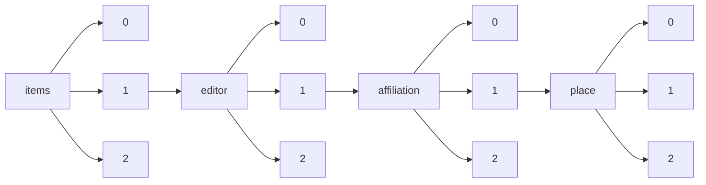

!!! warning "This document is not official Crossref documentation"
# Elements
PATH = items/array/editor/array/affiliation/array/place/array(1)  
Occurs 5 718 times  
Unique values: 98  
{ .annotate }

1. A route to an element, for example:  
   The route "items/array/editor/array/affiliation/array/place/array" corresponds to navigating through the JSON indices as  
   ["items"][0]["editor"][0]["affiliation"][0]["place"][0]  

| **Row** | **Value** `String`        | **Count** `Int64` |
|--------:|-----------------------------:|---------------------:|
| **1**   | United States                | 3 133                |
| **2**   | United Kingdom               | 382                  |
| **3**   | Germany                      | 368                  |
| **4**   | Netherlands                  | 204                  |
| **5**   | France                       | 172                  |
| **6**   | India                        | 167                  |
| **7**   | Canada                       | 150                  |
| **8**   | Switzerland                  | 134                  |
| **9**   | Australia                    | 127                  |
| **10**  | Japan                        | 116                  |
| **11**  | Israel                       | 86                   |
| **12**  | Spain                        | 82                   |
| **13**  | China                        | 67                   |
| **14**  | Kiel                         | 53                   |
| **15**  | South Africa                 | 52                   |
| **16**  | Hong Kong                    | 43                   |
| **17**  | Austria                      | 29                   |
| **18**  | Mexico                       | 25                   |
| **19**  | Republic of Korea            | 23                   |
| **20**  | Denmark                      | 22                   |
| **21**  | Singapore                    | 22                   |
| **22**  | Italy                        | 20                   |
| **23**  | USA                          | 19                   |
| **24**  | Sweden                       | 16                   |
| **25**  | Belgium                      | 16                   |
| **26**  | Finland                      | 14                   |
| **27**  | Brussel                      | 12                   |
| **28**  | Raleigh, NC, US              | 10                   |
| **29**  | Greece                       | 10                   |
| **30**  | Ecuador                      | 10                   |
| **31**  | Ireland                      | 9                    |
| **32**  | Portugal                     | 9                    |
| **33**  | Chile                        | 6                    |
| **34**  | Colombia                     | 6                    |
| **35**  | Argentina                    | 5                    |
| **36**  | UK                           | 5                    |
| **37**  | Hungary                      | 4                    |
| **38**  | Seattle, United States       | 4                    |
| **39**  | Uganda                       | 4                    |
| **40**  | Thailand                     | 4                    |
| **41**  | Croatia                      | 4                    |
| **42**  | Poland                       | 3                    |
| **43**  | Egypt                        | 3                    |
| **44**  | London, United Kingdom       | 3                    |
| **45**  | Washington, DC               | 3                    |
| **46**  | Brazil                       | 3                    |
| **47**  | Tübingen, Germany            | 2                    |
| **48**  | Rome                         | 2                    |
| **49**  | Malaysia                     | 2                    |
| **50**  | Moscow                       | 2                    |
| **51**  | Zurich, Switzerland          | 2                    |
| **52**  | Oulu                         | 2                    |
| **53**  | Ukrain                       | 2                    |
| **54**  | Saudi Arabia                 | 1                    |
| **55**  | Berkeley, United States      | 1                    |
| **56**  | San Francisco, United States | 1                    |
| **57**  | Bethesda, United States      | 1                    |
| **58**  | Münster                      | 1                    |
| **59**  | Cologne, Germany             | 1                    |
| **60**  | Trier                        | 1                    |
| **61**  | Paris, France                | 1                    |
| **62**  | Fribourg                     | 1                    |
| **63**  | Halle (Saale)                | 1                    |
| **64**  | Paris                        | 1                    |
| **65**  | Zürich, Switzerland          | 1                    |
| **66**  | Stanford, United States      | 1                    |
| **67**  | Lynnfield, MA                | 1                    |
| **68**  | New Zealand                  | 1                    |
| **69**  | Washington, United States    | 1                    |
| **70**  | Jena                         | 1                    |
| **71**  | Ithaca, United States        | 1                    |
| **72**  | Padua, Italy                 | 1                    |
| **73**  | Bangkok                      | 1                    |
| **74**  | Rehovot, Israel              | 1                    |
| **75**  | Bern                         | 1                    |
| **76**  | München                      | 1                    |
| **77**  | Almaty                       | 1                    |
| **78**  | Tübingen                     | 1                    |
| **79**  | Gießen                       | 1                    |
| **80**  | Utrecht, Netherlands         | 1                    |
| **81**  | Cambridge, United Kingdom    | 1                    |
| **82**  | Brussels                     | 1                    |
| **83**  | Luxembourg                   | 1                    |
| **84**  | Singapore, Singapore         | 1                    |
| **85**  | Los Angeles, United States   | 1                    |
| **86**  | Chicago, United States       | 1                    |
| **87**  | Turkey                       | 1                    |
| **88**  | New York City, United States | 1                    |
| **89**  | Bonn                         | 1                    |
| **90**  | Nashville, United States     | 1                    |
| **91**  | Bangor, United Kingdom       | 1                    |
| **92**  | Czech Republic               | 1                    |
| **93**  | Irvine, United States        | 1                    |
| **94**  | Mainz                        | 1                    |
| **95**  | Frankfurt am Main, Germany   | 1                    |
| **96**  | Mount Sinai, United States   | 1                    |
| **97**  | Pasadena, United States      | 1                    |
| **98**  | Baltimore, United States     | 1                    |

