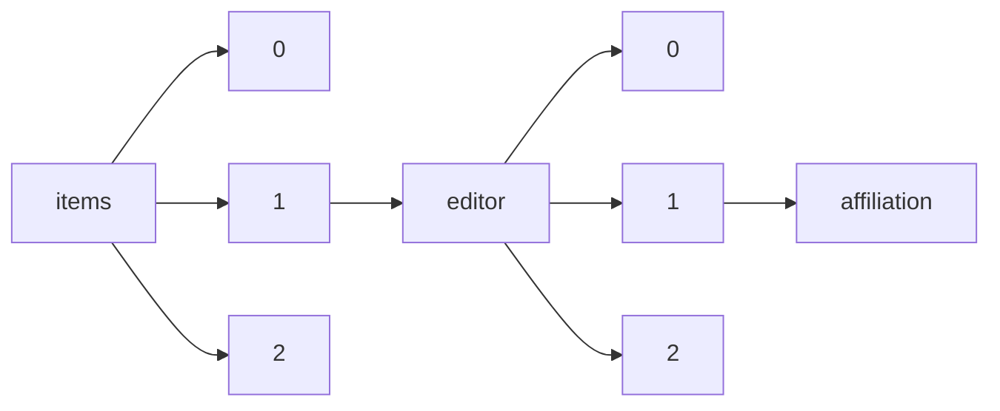

!!! warning "This document is not official Crossref documentation"
# Affiliation
PATH = items/array/editor/array/affiliation(1)  
Occurs 4 903 037 times  
{ .annotate }

1. A route to an element, for example:  
   The route "items/array/editor/array/affiliation" corresponds to navigating through the JSON indices as  
   ["items"][0]["editor"][0]["affiliation"]  

## Properties of Array
See information about elements: [items/array/editor/array/affiliation/array](array/index.md)  
Distribution of lengths:  

| **Row** | **Length** `Any` | **Count** `Int64` |
|--------:|--------------------:|---------------------:|
| **1**   | 0                   | 4 564 548            |
| **2**   | 1                   | 337 526              |
| **3**   | 2                   | 734                  |
| **4**   | 3                   | 180                  |
| **5**   | 4                   | 28                   |
| **6**   | 5                   | 21                   |

