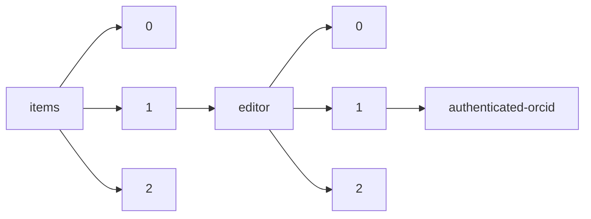

!!! warning "This document is not official Crossref documentation"
# Authenticated-orcid
PATH = items/array/editor/array/authenticated-orcid(1)  
Occurs 241 781 times  
Unique values: 2  
{ .annotate }

1. A route to an element, for example:  
   The route "items/array/editor/array/authenticated-orcid" corresponds to navigating through the JSON indices as  
   ["items"][0]["editor"][0]["authenticated-orcid"]  

| **Row** | **Value** `Bool` | **Count** `Int64` |
|--------:|--------------------:|---------------------:|
| **1**   | false               | 221 992              |
| **2**   | true                | 19 789               |

