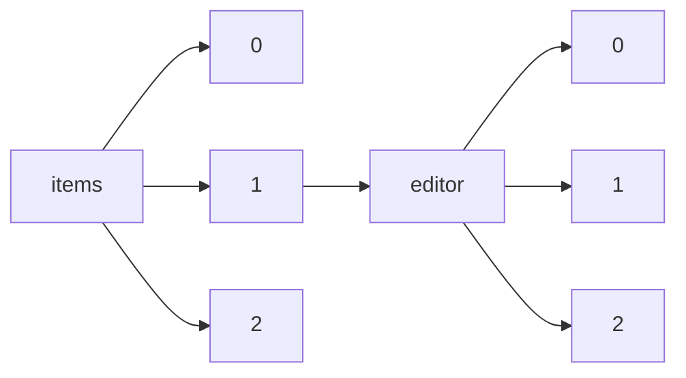

!!! warning "This document is not official Crossref documentation"
# Elements
PATH = items/array/editor/array(1)  
Occurs 4 903 037 times  
{ .annotate }

1. A route to an element, for example:  
   The route "items/array/editor/array" corresponds to navigating through the JSON indices as  
   ["items"][0]["editor"][0]  

## ORCID
See more information: [items/array/editor/array/ORCID](ORCID/index.md)  
Occurs 241 781 timess  
Unique values: > 999  

!!! note "Due to current limitations, only the first 1,000 unique values are counted."

| **Row** | **Value** `String`                | **Count** `Int64` |
|--------:|-------------------------------------:|---------------------:|
| **1**   | http://orcid.org/0000-0002-4465-7034 | 95 712               |
| **2**   | http://orcid.org/0000-0002-7436-3176 | 95 712               |
| **3**   | http://orcid.org/0000-0002-9048-8614 | 359                  |
| **4**   | http://orcid.org/0000-0003-4274-1862 | 344                  |
| **5**   | http://orcid.org/0000-0001-7254-5876 | 310                  |
| **6**   | http://orcid.org/0000-0002-9667-3730 | 306                  |
| **7**   | http://orcid.org/0000-0001-7135-3469 | 289                  |
| **8**   | http://orcid.org/0000-0002-3982-9161 | 270                  |
| **9**   | http://orcid.org/0000-0002-0382-0026 | 261                  |
| **10**  | http://orcid.org/0000-0002-4705-5629 | 238                  |
| ... | ... | ... |

## Affiliation
See more information: [items/array/editor/array/affiliation](affiliation/index.md)  
Occurs 4 903 037 timess  

| **Row** | **Length** `Any` | **Count** `Int64` |
|--------:|--------------------:|---------------------:|
| **1**   | 0                   | 4 564 548            |
| **2**   | 1                   | 337 526              |
| **3**   | 2                   | 734                  |
| **4**   | 3                   | 180                  |
| **5**   | 4                   | 28                   |
| **6**   | 5                   | 21                   |

## Authenticated-orcid
See more information: [items/array/editor/array/authenticated-orcid](authenticated-orcid/index.md)  
Occurs 241 781 timess  
Unique values: 2  

| **Row** | **Value** `Bool` | **Count** `Int64` |
|--------:|--------------------:|---------------------:|
| **1**   | false               | 221 992              |
| **2**   | true                | 19 789               |

## Family
See more information: [items/array/editor/array/family](family/index.md)  
Occurs 4 845 207 timess  
Unique values: > 999  

!!! note "Due to current limitations, only the first 1,000 unique values are counted."

| **Row** | **Value** `String` | **Count** `Int64` |
|--------:|----------------------:|---------------------:|
| **1**   | Parker                | 96 478               |
| **2**   | Garrity               | 95 675               |
| **3**   | Wang                  | 30 041               |
| **4**   | Zhang                 | 24 193               |
| **5**   | Li                    | 22 180               |
| **6**   | Chen                  | 21 753               |
| **7**   | Liu                   | 16 550               |
| **8**   | Storey                | 13 423               |
| **9**   | Smith                 | 13 111               |
| **10**  | Dessain               | 12 929               |
| ... | ... | ... |

## Given
See more information: [items/array/editor/array/given](given/index.md)  
Occurs 4 711 390 timess  
Unique values: > 999  

!!! note "Due to current limitations, only the first 1,000 unique values are counted."

| **Row** | **Value** `String` | **Count** `Int64` |
|--------:|----------------------:|---------------------:|
| **1**   | Charles Thomas        | 95 680               |
| **2**   | George M              | 95 679               |
| **3**   | A.                    | 45 955               |
| **4**   | Michael               | 39 721               |
| **5**   | M.                    | 33 096               |
| **6**   | S.                    | 32 914               |
| **7**   | David                 | 31 921               |
| **8**   | Peter                 | 26 834               |
| **9**   | John                  | 25 647               |
| **10**  | J.                    | 20 172               |
| ... | ... | ... |

## Name
See more information: [items/array/editor/array/name](name/index.md)  
Occurs 57 802 timess  
Unique values: > 999  

!!! note "Due to current limitations, only the first 1,000 unique values are counted."

| **Row** | **Value** `String`                              | **Count** `Int64` |
|--------:|---------------------------------------------------:|---------------------:|
| **1**   | The Optical Society                                | 4 612                |
| **2**   | Auctores Publishing LLC                            | 2 973                |
| **3**   | Instituto Tecnológico Autónomo de México. ITAM     | 2 043                |
| **4**   | World Tourism Organization (UNWTO)                 | 1 190                |
| **5**   | IMAIOS                                             | 924                  |
| **6**   | Cochrane Pregnancy and Childbirth Group            | 856                  |
| **7**   | Cochrane Neonatal Group                            | 723                  |
| **8**   | Editorial Universitat Politècnica de València      | 690                  |
| **9**   | Institute of Geography Russian Academy of Sciences | 598                  |
| **10**  | Cochrane Airways Group                             | 547                  |
| ... | ... | ... |

## Sequence
See more information: [items/array/editor/array/sequence](sequence/index.md)  
Occurs 4 903 037 timess  
Unique values: 2  

| **Row** | **Value** `String` | **Count** `Int64` |
|--------:|----------------------:|---------------------:|
| **1**   | additional            | 3 077 725            |
| **2**   | first                 | 1 825 312            |

## Suffix
See more information: [items/array/editor/array/suffix](suffix/index.md)  
Occurs 101 195 timess  
Unique values: 172  

| **Row** | **Value** `String` | **Count** `Int64` |
|--------:|----------------------:|---------------------:|
| **1**   | Jr                    | 95 832               |
| **2**   | Jr.                   | 2 098                |
| **3**   | MHBA                  | 455                  |
| **4**   | Sr.                   | 334                  |
| **5**   | FRCA                  | 329                  |
| **6**   | III                   | 265                  |
| **7**   | ML FRCA               | 259                  |
| **8**   | MD                    | 123                  |
| **9**   | DEAA                  | 114                  |
| **10**  | PhD                   | 106                  |
| ... | ... | ... |

