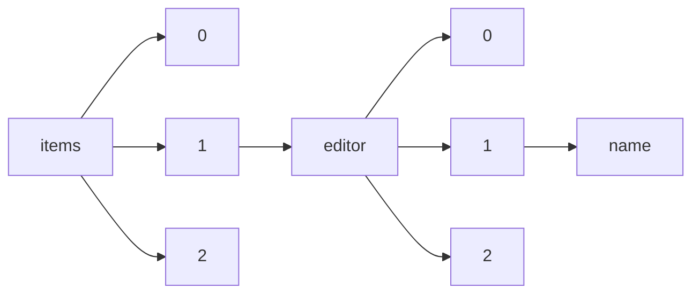

!!! warning "This document is not official Crossref documentation"
# Name
PATH = items/array/editor/array/name(1)  
Occurs 57 802 times  
Unique values: > 999  
{ .annotate }

1. A route to an element, for example:  
   The route "items/array/editor/array/name" corresponds to navigating through the JSON indices as  
   ["items"][0]["editor"][0]["name"]  

!!! note "Due to current limitations, only the first 1,000 unique values are counted."

| **Row** | **Value** `String`                                                                                | **Count** `Int64` |
|--------:|-----------------------------------------------------------------------------------------------------:|---------------------:|
| **1**   | The Optical Society                                                                                  | 4 612                |
| **2**   | Auctores Publishing LLC                                                                              | 2 973                |
| **3**   | Instituto Tecnológico Autónomo de México. ITAM                                                       | 2 043                |
| **4**   | World Tourism Organization (UNWTO)                                                                   | 1 190                |
| **5**   | IMAIOS                                                                                               | 924                  |
| **6**   | Cochrane Pregnancy and Childbirth Group                                                              | 856                  |
| **7**   | Cochrane Neonatal Group                                                                              | 723                  |
| **8**   | Editorial Universitat Politècnica de València                                                        | 690                  |
| **9**   | Institute of Geography Russian Academy of Sciences                                                   | 598                  |
| **10**  | Cochrane Airways Group                                                                               | 547                  |
| **11**  | Facultad de Derecho, Universidad de los Andes                                                        | 542                  |
| **12**  | Cochrane Hepato-Biliary Group                                                                        | 517                  |
| **13**  | Cochrane Gynaecology and Fertility Group                                                             | 415                  |
| **14**  | Cochrane Eyes and Vision Group                                                                       | 413                  |
| **15**  | Cochrane Musculoskeletal Group                                                                       | 405                  |
| **16**  | Cochrane Pain, Palliative and Supportive Care Group                                                  | 405                  |
| **17**  | Cochrane Schizophrenia Group                                                                         | 404                  |
| **18**  | Petrozavodsk State University                                                                        | 400                  |
| **19**  | Cochrane Common Mental Disorders Group                                                               | 395                  |
| **20**  | Universidad Continental                                                                              | 393                  |
| **21**  | Cochrane Heart Group                                                                                 | 388                  |
| **22**  | Cochrane Cystic Fibrosis and Genetic Disorders Group                                                 | 387                  |
| **23**  | Cochrane Kidney and Transplant Group                                                                 | 375                  |
| **24**  | Cochrane Gynaecological, Neuro-oncology and Orphan Cancer Group                                      | 374                  |
| **25**  | Cochrane Vascular Group                                                                              | 356                  |
| **26**  | Cochrane Infectious Diseases Group                                                                   | 356                  |
| **27**  | Cochrane Stroke Group                                                                                | 355                  |
| **28**  | Cochrane Oral Health Group                                                                           | 355                  |
| **29**  | VDI Wissensforum GmbH                                                                                | 344                  |
| **30**  | Cochrane Developmental, Psychosocial and Learning Problems Group                                     | 341                  |
| **31**  | Cochrane Effective Practice and Organisation of Care Group                                           | 327                  |
| **32**  | Cochrane Dementia and Cognitive Improvement Group                                                    | 313                  |
| **33**  | Global Science and Technology Forum Pte Ltd                                                          | 308                  |
| **34**  | Deutsche Gesellschaft für die Vereinten Nationen (DGVN)                                              | 301                  |
| **35**  | Cochrane Wounds Group                                                                                | 279                  |
| **36**  | Cochrane Metabolic and Endocrine Disorders Group                                                     | 275                  |
| **37**  | Cochrane Acute Respiratory Infections Group                                                          | 272                  |
| **38**  | Servicio de Recursos Audiovisuales y Nuevas Tecnologías                                              | 272                  |
| **39**  | Cochrane ENT Group                                                                                   | 270                  |
| **40**  | Verein Deutscher Ingenieure, Gesellschaft für Technikgeschichte                                      | 268                  |
| **41**  | Medires Publishing LLC                                                                               | 254                  |
| **42**  | ATI Italian Termotecnics Association                                                                 | 244                  |
| **43**  | Cochrane Bone, Joint and Muscle Trauma Group                                                         | 239                  |
| **44**  | Cochrane Epilepsy Group                                                                              | 237                  |
| **45**  | Universidade de São Paulo. Faculdade de Filosofia, Letras e Ciências Humanas                         | 234                  |
| **46**  | Cochrane Skin Group                                                                                  | 230                  |
| **47**  | Wissenschaftliche Gesellschaft zum Studium Niedersachsens e.V.                                       | 227                  |
| **48**  | Cochrane Neuromuscular Group                                                                         | 224                  |
| **49**  | Monopolkommission                                                                                    | 221                  |
| **50**  | Austrian Academy of Sciences                                                                         | 219                  |
| **51**  | Orvosi Hetilap Szerkesztősége                                                                        | 210                  |
| **52**  | Limited Liability Company “Engineering Centre the Best Available Technologies”                       | 208                  |
| **53**  | Cochrane Injuries Group                                                                              | 202                  |
| **54**  | Cochrane Colorectal Cancer Group                                                                     | 202                  |
| **55**  | Cochrane IBD Group                                                                                   | 201                  |
| **56**  | C.H.Beck Stiftung                                                                                    | 188                  |
| **57**  | Cochrane Upper GI and Pancreatic Diseases Group                                                      | 185                  |
| **58**  | Global Science and Technology Forum                                                                  | 184                  |
| **59**  | Landscape Architecture Foundation                                                                    | 176                  |
| **60**  | Cochrane Tobacco Addiction Group                                                                     | 166                  |
| **61**  | Cochrane Urology Group                                                                               | 164                  |
| **62**  | EIPOS GmbH, Dresden                                                                                  | 162                  |
| **63**  | Cochrane Hypertension Group                                                                          | 162                  |
| **64**  | JCE                                                                                                  | 157                  |
| **65**  | Cochrane HIV/AIDS Group                                                                              | 156                  |
| **66**  | Deutsche Gesellschaft für Pädiatrische Infektiologie e.V. (DGPI)                                     | 154                  |
| **67**  | Historiker-Verbindungsgruppe bei der Europäischen Kommission / European Union Liaison Committee of H | 154                  |
| **68**  | Claudino Lins Nóbrega Junior                                                                         | 149                  |
| **69**  | et al.                                                                                               | 148                  |
| **70**  | Túlio Márcio de Salles Tibúrcio                                                                      | 148                  |
| **71**  | Adam Mickiewicz University, Poznań                                                                   | 148                  |
| **72**  | Universidad Peruana de Ciencias Aplicadas - UPC                                                      | 146                  |
| **73**  | Ashok Yakkaldevi                                                                                     | 146                  |
| **74**  | Federal Constitutional Court                                                                         | 145                  |
| **75**  | Cochrane Emergency and Critical Care Group                                                           | 143                  |
| **76**  | Universidad de Castilla-La Mancha                                                                    | 143                  |
| **77**  | Cochrane Breast Cancer Group                                                                         | 143                  |
| **78**  | Cochrane Drugs and Alcohol Group                                                                     | 143                  |
| **79**  | Congresse.me                                                                                         | 140                  |
| **80**  | Cochrane Back and Neck Group                                                                         | 134                  |
| **81**  | Cochrane Public Health Group                                                                         | 131                  |
| **82**  | Cochrane Incontinence Group                                                                          | 129                  |
| **83**  | R. Amoêda, S. Lira & C. Pinheiro                                                                     | 128                  |
| **84**  | Cochrane Haematological Malignancies Group                                                           | 125                  |
| **85**  | Universidade de São Paulo. Escola de Comunicações e Artes                                            | 125                  |
| **86**  | Cochrane Consumers and Communication Group                                                           | 125                  |
| **87**  | Bundesarbeitsgemeinschaft der Freien Wohlfahrtspflege e.V., Berlin                                   | 122                  |
| **88**  | Cochrane Anaesthesia Group                                                                           | 122                  |
| **89**  | Technische Universität Dresden                                                                       | 119                  |
| **90**  | ATI Associazione Termotecnica Italiana                                                               | 117                  |
| **91**  | Cochrane Fertility Regulation Group                                                                  | 117                  |
| **92**  | Cochrane Movement Disorders Group                                                                    | 115                  |
| **93**  | Cochrane Anaesthesia, Critical and Emergency Care Group                                              | 114                  |
| **94**  | Limited Liability Company “Engineering Centre The Best Available Technologies”                       | 114                  |
| **95**  | Cochrane Multiple Sclerosis and Rare Diseases of the CNS Group                                       | 108                  |
| **96**  | Bundesverband der Veterinärmedizinstudierenden Deutschland e.V.                                      | 106                  |
| **97**  | Primakov National Research Institute of World Economy and International Relations, Russian Academy o | 106                  |
| **98**  | Austrian Academy of Sciences (ÖAW)                                                                   | 105                  |
| **99**  | Institute for Peace Research and Security Policy at the University of Hamburg / IFSH                 | 104                  |
| **100** | Wohlfahrtswerk Baden-Württemberg                                                                     | 104                  |
| **101** | Cochrane Work Group                                                                                  | 102                  |
| **102** | Verlag Franz Vahlen GmbH                                                                             | 96                   |
| **103** | Hans-Bredow-Institut für Medienforschung an der Universität Hamburg                                  | 95                   |
| **104** | VDI                                                                                                  | 92                   |
| **105** | Institute of Slavic Studies, Russian Academy of Sciences                                             | 91                   |
| **106** | Universidad Santiago de Cali                                                                         | 90                   |
| **107** | Cochrane Lung Cancer Group                                                                           | 88                   |
| **108** | Institut für Friedensforschung und Sicherheitspolitik an der Universität Hamburg / IFSH              | 87                   |
| **109** | Deutscher Juristinnenbund e.V.                                                                       | 86                   |
| **110** | Universidade de São Paulo. Faculdade de Educação                                                     | 86                   |
| **111** | Institute for Oriental and European Archaeology                                                      | 83                   |
| **112** | KLS Accounting & Valuation GmbH                                                                      | 83                   |
| **113** | Österreichische Akademie der Wissenschaften                                                          | 83                   |
| **114** | Prasetiya Mulya Publishing, Jakarta, Indonesia                                                       | 82                   |
| **115** | Institut für Europäische Politik                                                                     | 82                   |
| **116** | fib. The International Federation for Structural Concrete                                            | 81                   |
| **117** | Universität des Saarlandes, Rechts- und   Wirtschaftswissenschaftliche Fakultät; Europa-Institut, Se | 80                   |
| **118** | Universidad Autónoma del Estado de Morelos                                                           | 79                   |
| **119** | prof. Stjepan Lakušić                                                                                | 76                   |
| **120** | Deutsche Vereinigung für Parlamentsfragen                                                            | 76                   |
| **121** | Cochrane Gut Group                                                                                   | 75                   |
| **122** | Stirling International Association                                                                   | 74                   |
| **123** | Universidad Icesi                                                                                    | 73                   |
| **124** | Universidad Peruana de Ciencias Aplicadas (UPC)                                                      | 73                   |
| **125** | North-West University                                                                                | 72                   |
| **126** | Cochrane Childhood Cancer Group                                                                      | 71                   |
| **127** | Cochrane Methodology Review Group                                                                    | 69                   |
| **128** | ClinicSearch Publishing LLC                                                                          | 68                   |
| **129** | Universitat Oberta de Catalunya                                                                      | 68                   |
| **130** | Petrozavodsk state university                                                                        | 65                   |
| **131** | Center for Financial Studies                                                                         | 65                   |
| **132** | Sociedad Aragonesa de Gestión Agroambiental, S.L.U.(SARGA)                                           | 64                   |
| **133** | Universidad Autónoma de Madrid, Madrid, Spain                                                        | 64                   |
| **134** | Cochrane Colorectal Group                                                                            | 64                   |
| **135** | Richard Boorberg Verlag                                                                              | 63                   |
| **136** | BuFAS e.V.                                                                                           | 61                   |
| **137** | Dominican University of California                                                                   | 61                   |
| **138** | IEE                                                                                                  | 56                   |
| **139** | Konrad-Adenauer-Stiftung e.V.                                                                        | 56                   |
| **140** | Deutscher Hebammenverband                                                                            | 56                   |
| **141** | Organ des Bundesverbandes Öffentliche Dienstleistungen - Deutsche Sektion des CEEP                   | 55                   |
| **142** | Verbindung mit der Arbeitsgemeinschaft Sozialwissenschaflticher Institute e.V. Bonn                  | 55                   |
| **143** | Vorstand und Beirat der Deutschen Vereinigung für Politische Wissenschaft                            | 54                   |
| **144** | Universidad Politécnica Salesiana                                                                    | 53                   |
| **145** | Dijana Vuletić                                                                                       | 53                   |
| **146** | Secretariado de Recursos Audiovisuales y Nuevas Tecnologías                                          | 51                   |
| **147** | University of St Andrews                                                                             | 50                   |
| **148** | Hans Böckler Stiftung und ETUI European Trade Union Institute                                        | 50                   |
| **149** | Universidade de São Paulo. Faculdade de Saúde Pública                                                | 50                   |
| **150** | A.M. Gorky Institute of World Literature of the Russian Academy of Sciences                          | 49                   |
| **151** | European Scientific Platform                                                                         | 49                   |
| **152** | NGO European Scientific Platform                                                                     | 49                   |
| **153** | Deutscher Hebammenverband e.V.                                                                       | 48                   |
| **154** | Aybars Arda Kılıçer                                                                                  | 48                   |
| **155** | Cochrane Haematology Group                                                                           | 47                   |
| **156** | Institute of Geophysics, Polish Academy of Sciences                                                  | 47                   |
| **157** | Universidad de Ibagué                                                                                | 47                   |
| **158** | -                                                                                                    | 46                   |
| **159** | Eduardo Alves Rodrigues                                                                              | 46                   |
| **160** | Faculty of Chemical Engineering and Technology, Croatia                                              | 44                   |
| **161** | Universidad de Salamanca                                                                             | 44                   |
| **162** | Молодіжна наукова ліга                                                                               | 43                   |
| **163** | Auftrag der Sektion Internationale Politik der DVPM                                                  | 43                   |
| **164** | Consello da Cultura Galega                                                                           | 42                   |
| **165** | Cochrane STI Group                                                                                   | 42                   |
| **166** | The Editors                                                                                          | 42                   |
| **167** | Universität Leipzig                                                                                  | 41                   |
| **168** | Universidad Católica Luis Amigó                                                                      | 40                   |
| **169** | Joaquim Elói Cirne de Toledo Júnior                                                                  | 40                   |
| **170** | Arbeitskreis Internes Rechnungswesen der Schmalenbach-Gesellschaft für Betriebswirtschaft e.V.       | 39                   |
| **171** | Avi Bareli                                                                                           | 37                   |
| **172** | University of Geneva                                                                                 | 37                   |
| **173** | Fachverband der Stuckateure für Ausbau und Fassade                                                   | 36                   |
| **174** | Universidade de São Paulo. Instituto de Estudos Avançados                                            | 36                   |
| **175** | Universität Leipzig, Leipzig                                                                         | 36                   |
| **176** | Springer Fachmedien Wiesbaden                                                                        | 36                   |
| **177** | Shirshov Institute of Oceanology, Russian Academy of Sciences                                        | 36                   |
| **178** | Universidad ORT Uruguay                                                                              | 35                   |
| **179** | Universidad Autónoma de Madrid, C/Ivan Pavlov, 6, 28049 Madrid, Spain                                | 35                   |
| **180** | Universidade de São Paulo. Escola de Artes, Ciências e Humanidades                                   | 35                   |
| **181** | Assoc. prof. Nenad Bolf                                                                              | 35                   |
| **182** | Tuba ALPYILDIZ                                                                                       | 34                   |
| **183** | Internationale Richard Strauss-Gesellschaft                                                          | 34                   |
| **184** | Konrad Lorenz editores                                                                               | 33                   |
| **185** | Notarkammer Sachsen-Anhalt                                                                           | 33                   |
| **186** | The University of Auckland, Auckland, New Zealand                                                    | 33                   |
| **187** | Universidad Cooperativa de Colombia                                                                  | 33                   |
| **188** | REAL ACADEMIA GALEGA                                                                                 | 32                   |
| **189** | Cochrane Editorial Unit                                                                              | 32                   |
| **190** | Institut fuer Technologiefolgenabschaetzung der OEAW                                                 | 32                   |
| **191** | University of Arizona. Library                                                                       | 31                   |
| **192** | European Council for Agricultural Law / Comité Européen de Droit Rural / Europäisches Komitee für Ag | 31                   |
| **193** | Umweltbundesamt                                                                                      | 30                   |
| **194** | Deutschen Comenius-Gesellschaft                                                                      | 30                   |
| **195** | PEN-Zentrum-Deutschland                                                                              | 30                   |
| **196** | Cristina M. Quintella                                                                                | 29                   |
| **197** | National Climatic Data Center (U.S.)                                                                 | 29                   |
| **198** | Family Larsson-Rosenquist Foundation                                                                 | 29                   |
| **199** | Facultad de Derecho Universidad de los Andes                                                         | 29                   |
| **200** | Caro Ass e.V.                                                                                        | 28                   |
| **201** | Verein Junges Strafrecht e.V.                                                                        | 28                   |
| **202** | Illig                                                                                                | 28                   |
| **203** | European Society for Paediatric Endocrinology (ESPE)                                                 | 28                   |
| **204** | Servicio de Publicaciones y Difusión Científica de la Universidad de Las Palmas de Gran Canaria      | 28                   |
| **205** | Società Geologica Italiana                                                                           | 28                   |
| **206** | Міжнародний центр наукових досліджень (МЦНД)                                                         | 27                   |
| **207** | Assist. prof. dr. sc. Nenad Bolf                                                                     | 27                   |
| **208** | Konrad Lorenz Editores                                                                               | 27                   |
| **209** | OEAW                                                                                                 | 27                   |
| **210** | Österreichischer Juristentag                                                                         | 27                   |
| **211** | Institut für Bankhistorische Forschung e.V.                                                          | 26                   |
| **212** | Universidade de São Paulo. Faculdade de Arquitetura e Urbanismo                                      | 26                   |
| **213** | Draw Science                                                                                         | 25                   |
| **214** | Europäisches Zentrum für Föderalismus-Forschung Tübingen                                             | 25                   |
| **215** | American Institute of Aeronautics and Astronautics                                                   | 25                   |
| **216** | Rheinisch-Westfälischen Akademie der Wissenschaften                                                  | 24                   |
| **217** | Universidad de Las Palmas de Gran Canaria                                                            | 24                   |
| **218** | ATENEO XAUXA - ASOCIACIÓN HISTÓRICA Y CULTURAL                                                       | 23                   |
| **219** | Verein deutscher Ingenieure                                                                          | 23                   |
| **220** | International Association of Logopedics and Phoniatrics                                              | 23                   |
| **221** | Hans-Bredow-Institut für Medienforschung an der Universität  Hamburg                                 | 23                   |
| **222** | Gesellschaft für afrikanisches Recht e.V.                                                            | 23                   |
| **223** | National university "                                                                                | 23                   |
| **224** | Universidad del Rosario                                                                              | 23                   |
| **225** | Fachgruppe Inobhutnahme                                                                              | 23                   |
| **226** | Prof. Stjepan Lakusic                                                                                | 23                   |
| **227** | Universidade de São Paulo. Instituto de Arquitetura e Urbanismo de São Carlos                        | 23                   |
| **228** | Institut für Rechtsfragen der Medizin, Düsseldorf                                                    | 23                   |
| **229** | Adam Mickiewicz University, Poznań, Poland                                                           | 22                   |
| **230** | Deutschen Hebammenverband (DHV)                                                                      | 22                   |
| **231** | DZ BANK AG, Deutsche Zentral-Genossenschaftsbank                                                     | 22                   |
| **232** | CLSU International Journal of Science & Technology                                                   | 22                   |
| **233** | Forschungsgesellschaft Landschaftsentwicklung Landschaftsbau e.V. (FLL)                              | 22                   |
| **234** | Verbindung mit der  Arbeitsgemeinschaft Sozialwissenschaflticher Institute e.V. Bonn                 | 22                   |
| **235** | Fakultät für Vergleichende Staats- und Rechtswissenschaften der Andrássy Gyula Universität Budapest  | 22                   |
| **236** | Texas Parks and Wildlife Department 4200 Smith School Road, Austin, Texas 78744, USA                 | 22                   |
| **237** | Historische Kommission für Niedersachsen und Bremen                                                  | 22                   |
| **238** | Institut für bankhistorische Forschung e.V.                                                          | 22                   |
| **239** | Russian Presidential Academy of National Economy and Public Administration                           | 21                   |
| **240** | PWC GmbH WPG                                                                                         | 21                   |
| **241** | Odessa maritime academy"                                                                             | 21                   |
| **242** | VDI & VDE                                                                                            | 21                   |
| **243** | Wissenschaftliche Gesellschaft zur Erforschung Niedersachsens e.V.                                   | 21                   |
| **244** | Auctores                                                                                             | 21                   |
| **245** | National Pingtung University of Science and Technology                                               | 21                   |
| **246** | Kolleg-Forschergruppe 'Multiple Secularities - Beyond the West, Beyond Modernities                   | 21                   |
| **247** | Deutscher Verein für öffentliche und private Fürsorge e.V.                                           | 21                   |
| **248** | Institutul Național de Cercetări Economice                                                           | 20                   |
| **249** | European Travel Commission (ETC)                                                                     | 20                   |
| **250** | Verein für Socialpolitik                                                                             | 20                   |
| **251** | Luciana Nogueira                                                                                     | 20                   |
| **252** | World Bank                                                                                           | 20                   |
| **253** | Universidade de São Paulo. Instituto de Arquitetura e Urbanismo                                      | 20                   |
| **254** | Universidade de São Paulo. Museu de Arqueologia e Etnologia                                          | 20                   |
| **255** | Institut fuer Technikfolgenabschaetzung der OEAW                                                     | 20                   |
| **256** | Real Academia Galega                                                                                 | 20                   |
| **257** | Valéria Motta                                                                                        | 20                   |
| **258** | Arizona. State Land Department                                                                       | 19                   |
| **259** | Richard Boorberg Verlag GmbH & Co KG                                                                 | 19                   |
| **260** | Universidade de São Paulo. Instituto de Psicologia                                                   | 19                   |
| **261** | Europäisches Zentrum für Föderalismus-Forschung Tübingen (EZFF)                                      | 19                   |
| **262** | Universidade de Coimbra                                                                              | 19                   |
| **263** | ABA España. Laurel 1 1C 11130 Chiclana (Cadiz) SPAIN                                                 | 19                   |
| **264** | University of Helsinki, FI                                                                           | 19                   |
| **265** | Universidade Federal de Santa Maria                                                                  | 19                   |
| **266** | Europa Institut an der Universität Zürich                                                            | 19                   |
| **267** | Springer Fachmedien Wiesbaden GmbH                                                                   | 19                   |
| **268** | Romanian Association of Balneology                                                                   | 19                   |
| **269** | Martinus Nijhoff                                                                                     | 19                   |
| **270** | Grand Mend México, S.A. de C.V.                                                                      | 18                   |
| **271** | Arbeitsgemeinschaft Medizinrecht im Deutschen Anwaltverein, Berlin                                   | 18                   |
| **272** | Städtetag Baden-Württemberg                                                                          | 18                   |
| **273** | Technische Universität Dresden Zentrum für Bauforschung - Institut für Bauklimatik                   | 18                   |
| **274** | Hochschule für öffentliche Verwaltung Kehl                                                           | 18                   |
| **275** | Fakultet kemijskog inženjerstva i tehnologije, Sveučilište u Zagrebu, Marulićev trg 19, 10 000 Zagre | 18                   |
| **276** | Landkreistag Baden-Württemberg                                                                       | 18                   |
| **277** | Deloitte GmbH Wirtschaftsprüfungsgesellschaft                                                        | 17                   |
| **278** | Russian National Public Library for Science and Technology                                           | 17                   |
| **279** | Kongress der Sozialwirtschaft e.V.                                                                   | 17                   |
| **280** | European Space Agency                                                                                | 17                   |
| **281** | Fundación Miguel Lillo                                                                               | 17                   |
| **282** | Forschungsgruppe SpOGATA                                                                             | 17                   |
| **283** | SMGV Schweizerischer Maler- und Gipserunternehmer-Verband                                            | 17                   |
| **284** | Michigan State University                                                                            | 17                   |
| **285** | Institut für Sächsische Geschichte und Volkskunde, Dresden                                           | 17                   |
| **286** | Editors                                                                                              | 17                   |
| **287** | Aktionsbündnis Patientensicherheit e.V. (APS)                                                        | 17                   |
| **288** | Moscow State Institute of International Relations                                                    | 17                   |
| **289** | Universidad Peruana de Ciencias Aplicadas                                                            | 17                   |
| **290** | Historischen Gesellschaft der Deutschen Bank e.V.                                                    | 17                   |
| **291** | Pediatric Endosurgery Group, Bangladesh                                                              | 16                   |
| **292** | University of Pretoria                                                                               | 16                   |
| **293** | Institute for Medieval Research                                                                      | 16                   |
| **294** | LIWF - Leipziger Institut für angewandte Weiterbildungsforschung e.V.                                | 16                   |
| **295** | Deutsche Gesellschaft für Geschichte und Theorie der Biologie                                        | 16                   |
| **296** | Centro Nacional de Investigaciones de Café                                                           | 16                   |
| **297** | Rheinisch-Westfälische Akademie der Wissenschaften                                                   | 16                   |
| **298** | National Marine Fisheries Service, Northeast Fisheries Science Center, Highlands, New Jersey         | 16                   |
| **299** | Zentrum für Baltische und Skandinavische Archäologie (ZBSA)                                          | 16                   |
| **300** | Os Editores                                                                                          | 16                   |
| **301** | Institut für Ökologie                                                                                | 15                   |
| **302** | JP. Vasseur                                                                                          | 15                   |
| **303** | Russian State University for the Humanities                                                          | 15                   |
| **304** | The Scrum Patterns Group:                                                                            | 15                   |
| **305** | International Committee for Display Metrology                                                        | 15                   |
| **306** | Center for Systems Integration and Sustainability Department of Fisheries and Wildlife, Michigan Sta | 15                   |
| **307** | European Association of Urology (eau)                                                                | 15                   |
| **308** | Editora UFSM                                                                                         | 15                   |
| **309** | Universidad de Málaga, Málaga, Spain                                                                 | 15                   |
| **310** | Facultad de Derecho, Universidad\n            de los Andes                                           | 15                   |
| **311** | �sterreichische Gesellschaft f�r H�matologie und Onkologie                                           | 15                   |
| **312** | Great Lakes Fishery Commission 2100 Commonwealth Boulevard, Suite 100, Ann Arbor, Michigan 48105, US | 15                   |
| **313** | Science Repository                                                                                   | 15                   |
| **314** | Deutsche Gesellschaft f�r Transfusionsmedizin und Immunh�matologie                                   | 15                   |
| **315** | Universidade de São Paulo. Escola Superior de Agricultura Luiz de Queiroz                            | 15                   |
| **316** | Los Editores                                                                                         | 15                   |
| **317** | Universidade de São Paulo. Faculdade de Economia, Administração e Contabilidade                      | 15                   |
| **318** | Universidade de São Paulo. Instituto de Biociências                                                  | 15                   |
| **319** | Agnaldo Rodrigues da Silva                                                                           | 14                   |
| **320** | Universidade de São Paulo. Museu de Arte Contemporânea                                               | 14                   |
| **321** | Selim Alan                                                                                           | 14                   |
| **322** | Deutsch-Französisches Institut (dfi)                                                                 | 14                   |
| **323** | Bundesärztekammer auf Empfehlung ihres Wissenschaftlichen Beirats                                    | 14                   |
| **324** | Heart Matters Consulting, Spokane, Washington, US                                                    | 14                   |
| **325** | AAP Section on Adolescent Health                                                                     | 14                   |
| **326** | GRAND MEND MEXICO, S.A. DE C.V.                                                                      | 14                   |
| **327** | Collegium Internationale Allergologicum                                                              | 14                   |
| **328** | Commissie voor het Adatrecht                                                                         | 14                   |
| **329** | Marxer & Partner Rechtsanwälte                                                                       | 14                   |
| **330** | University of Dundee                                                                                 | 13                   |
| **331** | Ringerverband NRW e.V.                                                                               | 13                   |
| **332** | Steinhauser Consulting Engineers ZT GmbH                                                             | 13                   |
| **333** | Österreichische Geographische Gesellschaft                                                           | 13                   |
| **334** | Arbeitsgemeinschaft Rechtsanwälte im Medizinrecht e.V.                                               | 13                   |
| **335** | International Research and Publishing Academy                                                        | 13                   |
| **336** | Word Tourism Organization (UNWTO)                                                                    | 13                   |
| **337** | �sterreichische Gesellschaft f�r Gyn�kologie und Geburtshilfe                                        | 13                   |
| **338** | Sportjugend NRW                                                                                      | 13                   |
| **339** | Institute of Slavic Studies of the RAS                                                               | 13                   |
| **340** | Deutsches Jugendinstitut                                                                             | 13                   |
| **341** | VDI/VDE                                                                                              | 13                   |
| **342** | Instituto Federal de Educação, Ciência e Tecnologia do Pará – Campus Castanhal                       | 13                   |
| **343** | Deutsche Gesellschaft f�r H�matologie und Onkologie                                                  | 13                   |
| **344** | RWTH International Academy gGmbH                                                                     | 13                   |
| **345** | Erhalten historischer Bauwerke e.V., Karlsruhe                                                       | 12                   |
| **346** | Kaiserlichen Gesundheitsamte                                                                         | 12                   |
| **347** | Deutsches Institut für Menschenrechte                                                                | 12                   |
| **348** | BMZ - Bundesministerium für Wirtschaftliche Zusammenarbeit und Entwicklung                           | 12                   |
| **349** | Universidad de Antioquia                                                                             | 12                   |
| **350** | Ministerio de Asuntos Económicos y Transformación Digital                                            | 12                   |
| **351** | Hochschulinitiative Demokratischer Sozialismus                                                       | 12                   |
| **352** | pro:21 GmbH, Bonn                                                                                    | 12                   |
| **353** | Adam Mickiewicz University                                                                           | 12                   |
| **354** | Institut für Afrika-Kunde                                                                            | 12                   |
| **355** | Landessportbund NRW                                                                                  | 12                   |
| **356** | Universitäts-Gesellschaft                                                                            | 12                   |
| **357** | The Institute of Lithuanian Literature and Folklore                                                  | 12                   |
| **358** | SAE-China                                                                                            | 12                   |
| **359** | Association of European Border Regions                                                               | 12                   |
| **360** | USA National Phenology Network                                                                       | 12                   |
| **361** | University of Nevada, Nevada, Reno, US                                                               | 12                   |
| **362** | Commission for Interdisciplinary Ecological Studies (KIOES)                                          | 12                   |
| **363** | ESWiD Evangelischer Bundesverband für Immobilienwesen in Wissenschaft und Praxis e.V.                | 12                   |
| **364** | Universidad Autónoma de Chapingo                                                                     | 12                   |
| **365** | Editorial UNIMAR                                                                                     | 12                   |
| **366** | Universidad del Sinú-Elías Bechara Zainum                                                            | 12                   |
| **367** | Horváth & Partner                                                                                    | 12                   |
| **368** | Department of Fisheries and Wildlife, Michigan State University 1405 South Harrison Road, Suite 318, | 12                   |
| **369** | Royal Irish Academy                                                                                  | 12                   |
| **370** | Universidad del Valle                                                                                | 12                   |
| **371** | Fundação Dom Cabral                                                                                  | 12                   |
| **372** | Sächsischen Staatsministerium der Justiz und für Demokratie, Europa und Gleichstellung               | 12                   |
| **373** | Bundesministerium für Wirtschaftliche Zusammenarbeit und Entwicklung                                 | 12                   |
| **374** | Uniwersytet Pedagogiczny w Krakowie                                                                  | 11                   |
| **375** | Universidade de São Paulo. Faculdade de Filosofia, Ciências e Letras de Ribeirão Preto               | 11                   |
| **376** | Technical university of Liberec, Czech Republic                                                      | 11                   |
| **377** | Universidad de Guanajuato                                                                            | 11                   |
| **378** | Württembergischer Fußballverband e.V.                                                                | 11                   |
| **379** | Leitungsgruppen des Nationalen Forschungsprogramm «Steuerung des Energieverbrauchs» (NFP 71)         | 11                   |
| **380** | Soci�t� Suisse de Gyn�cologie                                                                        | 11                   |
| **381** | Projektträger Energie, Forschungszentrum Jülich                                                      | 11                   |
| **382** | Institut für Bildungsforschung und Bildungsrecht e.V.                                                | 11                   |
| **383** | NW Judo-Verband e.V.                                                                                 | 11                   |
| **384** | Historiker-Verbindungsgruppe bei der Europäischen Kommission / European Union Liaison Committee of H | 11                   |
| **385** | Institute for the History of Material Culture Russian Academy of Sciences                            | 11                   |
| **386** | FISITA                                                                                               | 11                   |
| **387** | A.M. Gorky Institute of World literature of the Russian Academy of Sciences                          | 11                   |
| **388** | Deutsch-Französisches Institut                                                                       | 11                   |
| **389** | Sennestadt GmbH                                                                                      | 11                   |
| **390** | DHV – Deutscher Hebammenverband                                                                      | 11                   |
| **391** | Bund Deutscher Hebammen                                                                              | 11                   |
| **392** | Department of Fisheries and Oceans, Pacific Biological Station, 3190 Hammond Bay Road, Nanaimo, Brit | 11                   |
| **393** | Northeast Fisheries Science Center, National Marine Fisheries Service Woods Hole, Massachusetts 0254 | 11                   |
| **394** | U.S. Geological Survey, Columbia Environmental Research Center 4200 New Haven Road, Columbia, Missou | 11                   |
| **395** | Aquatic Ecology Section, California Department of Water Resources 3251 S Street, Sacramento, Califor | 10                   |
| **396** | Stichting Groningen Journal of International Law                                                     | 10                   |
| **397** | Universidade Estadual de Campinas                                                                    | 10                   |
| **398** | Journal of Science with Technological Applications                                                   | 10                   |
| **399** | Muhammad Aqeel                                                                                       | 10                   |
| **400** | Universidad Nacional Experimental Rafael María Baralt                                                | 10                   |
| **401** | University of Latvia                                                                                 | 10                   |
| **402** | Universidade de São Paulo. Faculdade de Zootecnia e Engenharia de Alimentos                          | 10                   |
| **403** | Institut für Landschaftsentwicklung, Erholungs- und Naturschutzplanung, Universität für Bodenkultur  | 10                   |
| **404** | Ir. Joaquim Farias, OSB                                                                              | 10                   |
| **405** | Pöllath + Partners                                                                                   | 10                   |
| **406** | ZHAW School of Management and Law                                                                    | 10                   |
| **407** | Max Planck Institute for European Legal History                                                      | 10                   |
| **408** | Deutscher Bundestag                                                                                  | 10                   |
| **409** | NOAA Fisheries, Northwest Fisheries Science Center 2725 Montlake Boulevard East, Seattle, Washington | 10                   |
| **410** | Fisheries and Oceans Canada, Pacific Biological Station 3190 Hammond Bay Road, Nanaimo, British Colu | 10                   |
| **411** | Food and Agriculture Organization of the United Nations Fisheries and Aquaculture Department Viale d | 10                   |
| **412** | State Key Laboratory of Freshwater Ecology and Biotechnology, Institute of Hydrobiology Chinese Acad | 10                   |
| **413** | TA-SWISS                                                                                             | 10                   |
| **414** | Institute of Slavic Studies RAS                                                                      | 10                   |
| **415** | Committee D-18                                                                                       | 10                   |
| **416** | Universitäts-Gesellschaft Heidelberg                                                                 | 10                   |
| **417** | Committee D-2                                                                                        | 10                   |
| **418** | Bundesumweltministerium                                                                              | 10                   |
| **419** | M.P. Shulgin State Road Research Institute State Enterprise - DerzhdorNDI SE, Kyiv, Ukraine          | 9                    |
| **420** | Universidad de La Laguna (España)                                                                    | 9                    |
| **421** | Arizona NEMO                                                                                         | 9                    |
| **422** | Institute of Landscape Development, Recreation and Conservation Planning, University of Natural Reso | 9                    |
| **423** | DHV                                                                                                  | 9                    |
| **424** | Deutscher Gewerkschaftsbund Niederbayern                                                             | 9                    |
| **425** | Primakov National Research Institute of World Economy and International Relations, Russian Academy o | 9                    |
| **426** | Latvijas Universitāte                                                                                | 9                    |
| **427** | CEDR                                                                                                 | 9                    |
| **428** | Jade Hochschule Oldenburg                                                                            | 9                    |
| **429** | Research Institute of Wildlife Ecology University of Veterinary Medicine Vienna                      | 9                    |
| **430** | Iowa Department of Natural Resources 24570 U.S. Highway 34, Chariton, Iowa 50049, USA                | 9                    |
| **431** | Universidade de São Paulo. Grupo de Pesquisa em Políticas Públicas para o Acesso à Informação        | 9                    |
| **432** | Arbeitsgemeinschaft KZ Transport 1945                                                                | 9                    |
| **433** | Arbeitsgemeinschaft Medizinrecht im Deutschen Anwaltverein                                           | 9                    |
| **434** | Forschungsinstitut für Wildtierkunde und Ökologie, Veterinärmedizinische Universität Wien            | 9                    |
| **435** | Verband der Reservisten der Deutschen Bundeswehr e.V.                                                | 9                    |
| **436** | Deutsche Gesellschaft f�r Verdauungs- und Stoffwechselkrankheiten                                    | 9                    |
| **437** | Foundation of Men’s Health                                                                           | 9                    |
| **438** | Comité de direction du Programme National de Recherche «Gérer la consommation d’énergie» (PNR 71)    | 9                    |
| **439** | Institut für Friedensforschung                                                                       | 9                    |
| **440** | Arizona. Department of Health Services                                                               | 9                    |
| **441** | Fundación Barrié                                                                                     | 9                    |
| **442** | European Society for Surgical Research (ESSR)                                                        | 9                    |
| **443** | Dt.  Komitee zum Humanitären Völkerrecht                                                             | 9                    |
| **444** | Department of Fisheries and Oceans, Bedford Institute of Oceanography, Post Office Box 1006, Dartmou | 9                    |
| **445** | International Society of Geographical Pathology                                                      | 9                    |
| **446** | Institute for Fisheries Research Michigan Department of Natural Resources and University of Michigan | 9                    |
| **447** | Институт славяноведения РАН                                                                          | 9                    |
| **448** | Mazowieckie Biuro Planowania Regionalnego w Warszawie                                                | 9                    |
| **449** | Im Auftrag der Gesellschaft für Unternehmensgeschichte e. V.                                         | 8                    |
| **450** | Schiffbautechnische Gesellschaft                                                                     | 8                    |
| **451** | Stiftung Männergesundheit                                                                            | 8                    |
| **452** | Universidade de São Paulo. Escola Superior de Agricultura "Luiz de Queiroz                           | 8                    |
| **453** | Avi Bareli, Ofer Shiff                                                                               | 8                    |
| **454** | GESELLSCHAFT FÜR THEORIE UND GESCHICHTE AUDIOVISUELLER KOMMUNIKATION E.V.                            | 8                    |
| **455** | Instituto Federal Catarinense                                                                        | 8                    |
| **456** | Universidade de São Paulo. Faculdade de Medicina Veterinária e Zootecnia                             | 8                    |
| **457** | Palgrave Macmillan                                                                                   | 8                    |
| **458** | Gesellschaft für Theorie und Geschichte audiovisueller Kommunikation e.V.                            | 8                    |
| **459** | Universidad de Bogotá Jorge Tadeo Lozano, Colombia                                                   | 8                    |
| **460** | University of Florida Post Office Box 110240, Gainesville, Florida 32611, USA                        | 8                    |
| **461** | Institut za savremenu istoriju                                                                       | 8                    |
| **462** | Bundesministerium der Justiz und für Verbraucherschutz                                               | 8                    |
| **463** | Universidade Federal de Santa Catarina (UFSC)                                                        | 8                    |
| **464** | Trainerakademie Köln                                                                                 | 8                    |
| **465** | Kritische Justiz                                                                                     | 8                    |
| **466** | Northwest Fisheries Science Center, National Marine Fisheries Service National Oceanic and Atmospher | 8                    |
| **467** | SPA Committee                                                                                        | 8                    |
| **468** | Staatskanzlei NRW                                                                                    | 8                    |
| **469** | Universidade de São Paulo. Escola Politécnica                                                        | 8                    |
| **470** | Fisheries and Oceans Canada, Pacific Biological Station 3190 Hammond Bay Road, Nanaimo, British Colu | 8                    |
| **471** | Institut für Bauforschung e.V. IFB, Hannover                                                         | 8                    |
| **472** | Oxford Handbooks Editorial Board                                                                     | 8                    |
| **473** | Deutsche Gesellschaft für Internationale Zusammenarbeit (GIZ) GmbH                                   | 8                    |
| **474** | The editors                                                                                          | 8                    |
| **475** | Europäischen Zentrum für Föderalismus-Forschung Tübingen (EZFF)                                      | 8                    |
| **476** | Bodega Marine Laboratory, University of California, Davis Post Office Box 247, Bodega Bay, Californi | 8                    |
| **477** | Leitungsgruppen des Nationalen Forschungsprogramm «Energiewende» (NFP 70)                            | 8                    |
| **478** | Munich Security Conference                                                                           | 8                    |
| **479** | Associação das Universidades de Língua Portuguesa (AULP)                                             | 8                    |
| **480** | Committee B-4                                                                                        | 8                    |
| **481** | Universidade de São Paulo. Instituto de Estudos Brasileiros                                          | 8                    |
| **482** | Sociedad Española de Enfermería Nefrológica                                                          | 8                    |
| **483** | Schriftleitung der „Naturwissenschaften“                                                             | 8                    |
| **484** | Max Himmelheber-Stiftung GmbH                                                                        | 8                    |
| **485** | Dr. sc. Danko Škare                                                                                  | 8                    |
| **486** | Stockholm University, SE                                                                             | 8                    |
| **487** | Gesellschaft für Theorie und Geschichte audiovisueller Kommunikation e. V.                           | 7                    |
| **488** | UNESCO United Nations Educational Scientific and Cultural Organization                               | 7                    |
| **489** | Enquete-Kommission „Zukunft des Bürgerschaftlichen Engagements“ Deutscher Bundestag                  | 7                    |
| **490** | Gmelin-Institut für Anorganische Chemie und Grenzgebiete in der Max-Planck-Gesellschaft zur Förderun | 7                    |
| **491** | Bayerische Gesellschaft f�r Geburtshilfe und Frauenheilkunde                                         | 7                    |
| **492** | JAPM Editorial Office                                                                                | 7                    |
| **493** | Rat für Sozial- und Wirtschaftsdaten                                                                 | 7                    |
| **494** | Department of Biology and Ecology of Fishes Leibniz-Institute of Freshwater Ecology and Inland Fishe | 7                    |
| **495** | Uniwersytet w Białymstoku                                                                            | 7                    |
| **496** | Associate Professor, School of Education, Career Point University, Kota Rajasthan-India              | 7                    |
| **497** | Universidad de La Salle, Rectoría                                                                    | 7                    |
| **498** | Magistrat                                                                                            | 7                    |
| **499** | El Colegio de Morelos                                                                                | 7                    |
| **500** | Steering Committee of the National Research Programm “Energy Turnaround” (NRP 70)                    | 7                    |
| **501** | Sophokles                                                                                            | 7                    |
| **502** | Universidad César Vallejo                                                                            | 7                    |
| **503** | Fisheries and Oceans Canada, Ocean and Environmental Sciences Branch Maurice Lamontagne Institute, 8 | 7                    |
| **504** | Initiative Queer Nations                                                                             | 7                    |
| **505** | Wisconsin Department of Natural Resources 3911 Fish Hatchery Road, Fitchburg, Wisconsin 53711, USA   | 7                    |
| **506** | International Society for Oncodevelopmental Biology and Medicine                                     | 7                    |
| **507** | Texas Parks and Wildlife Department, Inland Fisheries Division 505 Staples Road, Building 1, San Mar | 7                    |
| **508** | Expert Committee of Chinese Society of Cultural Relics                                               | 7                    |
| **509** | Kommission für Entwicklungsfragen                                                                    | 7                    |
| **510** | Deutschen Kunststoff-Institut                                                                        | 7                    |
| **511** | Fisheries Division, Nebraska Game and Parks Commission 2200 N. 33rd Street, Lincoln, Nebraska 68503, | 7                    |
| **512** | Dortmunder Zentrum für Schulsportfoschung                                                            | 7                    |
| **513** | Universidade de São Paulo. Instituto de Energia e Ambiente                                           | 7                    |
| **514** | Centro de Investigación y de Estudios Avanzados del IPN                                              | 7                    |
| **515** | California Journal of Politics and Policy                                                            | 7                    |
| **516** | FUERP-ESRP                                                                                           | 7                    |
| **517** | Universidade de São Paulo. Instituto de Relações Internacionais                                      | 7                    |
| **518** | KEA Klimaschutz- und Energieagentur Baden-Württemberg                                                | 7                    |
| **519** | Nebraska Game and Parks Commission 2200 North 33rd Street, Lincoln, Nebraska 68503, USA              | 7                    |
| **520** | Alaska Department of Fish and Game 333 Raspberry Road, Anchorage, Alaska 99518, USA                  | 7                    |
| **521** | KEA Klimaschutz- und Energieagentur Baden-Württemberg GmbH                                           | 7                    |
| **522** | National Marine Fisheries Service, Auke Bay Laboratory 11305 Glacier Highway, Juneau, Alaska 99801,  | 7                    |
| **523** | Instituto Politécnico de Castelo Branco                                                              | 7                    |
| **524** | prof. Stjepan Lakusic                                                                                | 7                    |
| **525** | Anísio Francisco Soares                                                                              | 7                    |
| **526** | Bundesarbeitsgemeinschaft der Freien Wohlfahrtspflege (BAGFW)                                        | 7                    |
| **527** | Cláudio Alberto Gellis de Mattos Dias                                                                | 7                    |
| **528** | II Congreso Internacional ISUF-H Zaragoza 2018                                                       | 7                    |
| **529** | Patrick Rodrigues Fleury Cabral                                                                      | 7                    |
| **530** | Carla Viana Dendasck                                                                                 | 7                    |
| **531** | Universidade de Lisboa                                                                               | 7                    |
| **532** | Zentrum für Türkeistudien                                                                            | 7                    |
| **533** | China Society of Administration for Industry & Commerce (CSAIC)                                      | 7                    |
| **534** | Ministère des Ressources naturelles et de la Faune du Québec Direction de la recherche sur la faun | 7                    |
| **535** | Schweizerische Gesellschaft f�r H�matologie und Onkologie                                            | 7                    |
| **536** | Institut für Demokratieforschung                                                                     | 7                    |
| **537** | Laboratório Nacional de Engenharia Civil                                                             | 7                    |
| **538** | Editora Poisson                                                                                      | 7                    |
| **539** | Department of Market Regulation, State Administration for Industry and Commerce of the People's Repu | 7                    |
| **540** | University of Arkansas at Pine Bluff Aquaculture/Fisheries Science Center of Excellence 1200 North U | 7                    |
| **541** | Nordwestdeutsche Forstliche Versuchsanstalt                                                          | 7                    |
| **542** | School of Aquatic and Fishery Sciences, University of Washington Box 355020, Seattle, Washington 981 | 6                    |
| **543** | Universidade de São Paulo. Faculdade de Odontologia de Bauru                                         | 6                    |
| **544** | HDR-LMS One Blue Hill Plaza, Pearl River, New York 10965 USA Karim.Abood@hdrinc.com                  | 6                    |
| **545** | U.S. Geological Survey, National Climate Change and Wildlife Science Center 12201 Sunrise Valley Dri | 6                    |
| **546** | acatech - Deutsche Akademie der Technikwissenschaften                                                | 6                    |
| **547** | А.М. Gorky Institute of World Literature of the Russian Academy of Sciences                          | 6                    |
| **548** | Fish and Wildlife Research Institute, Florida Fish and Wildlife Conservation Commission 100 Eighth A | 6                    |
| **549** | Soci�t� Francophone de Primatologie                                                                  | 6                    |
| **550** | University of Arizona. Cooperative Extension                                                         | 6                    |
| **551** | Universidade de São Paulo. Escola de Engenharia de São Carlos                                        | 6                    |
| **552** | Pontificia Universidad Javeriana                                                                     | 6                    |
| **553** | Department of Natural Resources, Cornell Biological Field Station 900 Shackelton Point Road, Bridgep | 6                    |
| **554** | Bayerische Akademie der Wissenschaften                                                               | 6                    |
| **555** | University of Zagreb, Faculty of Chemical Engineering and Technology, Marulićev trg 19, HR-10 000 Za | 6                    |
| **556** | Fisheries and Oceans Canada 200 Kent Street, Ottawa, Ontario K1A 0E6, Canada                         | 6                    |
| **557** | Universität des Saarlandes, Rechts- und Wirtschaftswissenschaftliche Fakultät; Europa-Institut, Se   | 6                    |
| **558** | Texas Parks and Wildlife Department, Inland Fisheries Division 4200 Smith School Road, Austin, Texas | 6                    |
| **559** | Perm National Research Polytechnic University                                                        | 6                    |
| **560** | IJSER                                                                                                | 6                    |
| **561** | Committee E-1                                                                                        | 6                    |
| **562** | Deutschen Gesellschaft für Internationale Zusammenarbeit (GIZ) GmbH                                  | 6                    |
| **563** | Württembergischen Fußballverband e. V.                                                               | 6                    |
| **564** | Verband der Chemischen Industrie e.V., Landesverband Nordost                                         | 6                    |
| **565** | Universitaria Agustiniana                                                                            | 6                    |
| **566** | acatech — Deutsche Akademie der Technikwissenschaften, 2012                                          | 6                    |
| **567** | Research Institute for Nature and Forest, Fish Research Center Dwersbos 28, B-1630 Linkebeek, Belgiu | 6                    |
| **568** | Bundesamt für Verbraucherschutz und Lebensmittelsicherheit (BVL)                                     | 6                    |
| **569** | Institut für Landschatfsentwicklung, Erholungs- und Naturschutzplanung (ILEN) Dept. für Raum, Landsc | 6                    |
| **570** | Center for Systems Integration and Sustainability Department of Fisheries and Wildlife, Michigan Sta | 6                    |
| **571** | Bundesamt für Verbraucherschutz und Lebensmittelsicherheit                                           | 6                    |
| **572** | Fundación Universitaria Panamericana                                                                 | 6                    |
| **573** | Programa de Pós-graduação em Integração da América Latina (PROLAM/USP)                               | 6                    |
| **574** | Deutsche Hochschule der Polizei                                                                      | 6                    |
| **575** | School of Earth, Environmental and Marine Sciences, University of Texas Rio Grande Valley One West U | 6                    |
| **576** | Arizona. Department of Public Safety. Research and Planning, Arizona Criminal Justice Commission. St | 6                    |
| **577** | Arbeitskreis der Sachverständigen im bayerischen Maler- und Lackiererhandwerk                        | 6                    |
| **578** | Fish Ecology and Conservation Physiology Laboratory Department of Biology and Institute of Environme | 6                    |
| **579** | Maria Aparecida da Silva Oliveira                                                                    | 6                    |
| **580** | Weisser Ring e.V.                                                                                    | 6                    |
| **581** | Schweizerische Gesellschaft f�r Gyn�kologie                                                          | 6                    |
| **582** | Институт экономических проблем им. Г.П. Лузина – обособленное подразделение ФИЦ КНЦ РАН, (ИЭП КНЦ РА | 6                    |
| **583** | Nordrhein-Westfälischen Akademie der Wissenschaften                                                  | 6                    |
| **584** | NOAA Southwest Fisheries Science Center 110 Shaffer Road, Santa Cruz, California 95060, USA          | 6                    |
| **585** | Ministère des Affaires étrangères                                                                    | 6                    |
| **586** | Central and Arctic Region, Department of Fisheries and Oceans, Winnipeg, Manitoba, R3T 2N6, Canada   | 6                    |
| **587** | Universidade de São Paulo, Instituto de Psicologia                                                   | 6                    |
| **588** | Gandhi College of Arts and Science                                                                   | 6                    |
| **589** | Universidad Nacional Autónoma de México                                                              | 6                    |
| **590** | Normandeau Associates, Inc., 1921 River Road, Drumore, Pennsylvania 17518, USA                       | 6                    |
| **591** | Fisheries and Oceans Canada, Pacific Biological Station Nanaimo, British Columbia V9T 6N7, Canada    | 6                    |
| **592** | Auftrag der Sektion Internationale Politik der  DVPM                                                 | 6                    |
| **593** | Institut für Mittelstandsforschung Bonn                                                              | 6                    |
| **594** | Bundesministerium für wirtschaftliche Zusammenarbeit und Entwicklung                                 | 5                    |
| **595** | Southeast Environmental Research Center Department of Earth and Environment, Florida International U | 5                    |
| **596** | NOAA Fisheries Northwest Fisheries Science Center 2725 Montlake Boulevard East, Seattle, Washington  | 5                    |
| **597** | Lomonosov Moscow State University                                                                    | 5                    |
| **598** | University of Westminster, GB                                                                        | 5                    |
| **599** | Deutsches Krebsforschungszentrum                                                                     | 5                    |
| **600** | International Higher Education Teaching and Learning Association                                     | 5                    |
| **601** | College of Natural Resources, University of Wisconsin–Stevens Point 800 Reserve Street, Stevens Poin | 5                    |
| **602** | Universidade Federal do Paraná                                                                       | 5                    |
| **603** | 1162 Rock Cliff Drive, Martinsburg, West Virginia 25401, USA                                         | 5                    |
| **604** | Faculty of Chemical Engineering and Technology, Universitiy in Zagreb, Croatia                       | 5                    |
| **605** | Institute of Hydrobiology, Chinese Academy of Sciences 7 South Donghu Road, Wuhan, Hubei 430072, P.  | 5                    |
| **606** | Idaho Department of Fish and Game 2885 West Kathleen Avenue, Coeur d’Alene, Idaho 83815, USA         | 5                    |
| **607** | University of Guyana                                                                                 | 5                    |
| **608** | Федеральное государственное бюджетное учреждение науки Федеральный исследовательский центр «Кольский | 5                    |
| **609** | Food and Agriculture Organization of the United Nations Subregional Office for the Caribbean 2nd flo | 5                    |
| **610** | Mainzer Assistententagung Öffentliches Recht e.V.                                                    | 5                    |
| **611** | Landeszentrale für Medien und Kommunikation Rheinland-Pfalz                                          | 5                    |
| **612** | Fisheries and Oceans Canada Ottawa, Ontario K1A 0A6, Canada                                          | 5                    |
| **613** | Bruno de Seixas Carvalho                                                                             | 5                    |
| **614** | NOAA Fisheries, Northwest Fisheries Science Center Resource Enhancement and Utilization Technologies | 5                    |
| **615** | Department of Zoology, National University of Ireland University Road, Galway, Ireland               | 5                    |
| **616** | Texas Parks and Wildlife Department Post Office Box 1685, San Marcos, Texas 78667, USA               | 5                    |
| **617** | Cambridge Journal of International and Comparative Law                                               | 5                    |
| **618** | Northwest Fisheries Science Center National Oceanic and Atmospheric Administration National Marine F | 5                    |
| **619** | University of Michigan 440 Church Street, Ann Arbor, Michigan 48109, USA                             | 5                    |
| **620** | Institut für Sozialarbeit und Sozialpädagogik e.V.                                                   | 5                    |
| **621** | Lehrstuhl für Theoretische Hüttenkunde                                                               | 5                    |
| **622** | Sveučilište u Zagrebu, Fakultet kemijskog inženjerstva i tehnologije, Marulićev trg 19, 10 000 Zagre | 5                    |
| **623** | Illinois Natural History Survey, Kaskaskia Biological Station 1235 County Road 1000N, Sullivan, Illi | 5                    |
| **624** | Monash University                                                                                    | 5                    |
| **625** | Spring Library                                                                                       | 5                    |
| **626** | University of Zululand                                                                               | 5                    |
| **627** | Division of Biology, Kansas State University, Manhattan, Kansas 66506, USA                           | 5                    |
| **628** | Northwest Power and Conservation Council 851 SW Sixth Avenue, Suite 1100, Portland, Oregon 97204, US | 5                    |
| **629** | Columbia River Inter-Tribal Fish Commission 700 NE Multnomah Street, Suite 1200, Portland, Oregon 97 | 5                    |
| **630** | Texas Parks and Wildlife Department 5103 Junction Highway, Mountain Home, Texas 78058, USA           | 5                    |
| **631** | Institute of Marine Science of the National Research Council, Largo Fiera della Pesca 1, Ancona 6012 | 5                    |
| **632** | Harald G. Zechmeister                                                                                | 5                    |
| **633** | Deutsches Zentrum für Altersfragen                                                                   | 5                    |
| **634** | Moscow School of Social and Economic Sciences                                                        | 5                    |
| **635** | Universidad Central                                                                                  | 5                    |
| **636** | Universidad Mariana                                                                                  | 5                    |
| **637** | Instituto Nacional de Salud                                                                          | 5                    |
| **638** | University of Eastern Finland, FI                                                                    | 5                    |
| **639** | U.S. Geological Survey, 8505 Research Way, Middleton, Wisconsin 53562, USA                           | 5                    |
| **640** | U.S. Geological Survey, 345 Middlefield Road, Menlo Park, California 94025, USA                      | 5                    |
| **641** | Tennessee Wildlife Resources Agency Post Office Box 40747, Nashville, Tennessee 37204, USA           | 5                    |
| **642** | Universität des Saarlandes, Rechts- und Wirtschaftswissenschaftliche Fakultät; Europa-Institut, Sekt | 5                    |
| **643** | Committee D02                                                                                        | 5                    |
| **644** | Department of Fisheries and Aquatic Sciences, IFAS, University of Florida 7922 NW 71 st Street, Gain | 5                    |
| **645** | Comité de direction du Programme National de Recherche «Virage énergétique» (PNR 70)                 | 5                    |
| **646** | University of Johannesburg                                                                           | 5                    |
| **647** | U.S. Geological Survey, Leetown Science Center S. O. Conte Anadromous Fish Research Center One Migra | 5                    |
| **648** | U.S. Geological Survey, Florida Integrated Science Center 7920 NW 71st Street, Gainesville, Florida  | 5                    |
| **649** | Instituto Todos pela Saúde (ITPS)                                                                    | 5                    |
| **650** | Universidad de Sevilla. Facultad de Ciencias de la Educación. Dpto. Didáctica y Organización Educati | 5                    |
| **651** | Research Center for Biodiversity, Academia Sinica No. 128, Sec. 2, Academia Road, Nankang, Taipei 11 | 5                    |
| **652** | Institut für Wildbiologie und Jagdwirtschaft (IWJ) Dept. für Integrative Biologie                    | 5                    |
| **653** | Universidade de São Paulo. Escola Superior de Agricultura “Luiz de Queiroz”                          | 5                    |
| **654** | Primakov National Research Institute of World Economy and International Relations, Russian Academy o | 5                    |
| **655** | Горный институт Кольского научного центра РАН                                                        | 5                    |
| **656** | The NCHERM Group, LLC.                                                                               | 5                    |
| **657** | Department of Environmental and Forest Biology State University of New York College of Environmental | 5                    |
| **658** | Steering Committee of the National Research Programm “Managing Energy Consumption” (NRP 71)          | 5                    |
| **659** | NOAA/National Marine Fisheries Service, Northeast Fisheries Science Center 28 Tarzwell Drive, Narrag | 5                    |
| **660** | Benjamin Kahan                                                                                       | 5                    |
| **661** | Polar Research Institute of Marine Fisheries and Oceanography (PINRO) Knipovich-Street, 6, Murmansk, | 5                    |
| **662** | U.S. Geological Survey, Mississippi Cooperative Fish and Wildlife Research Unit Post Office Box 9691 | 5                    |
| **663** | Vienna Institute for Comparative Economic Studies (Wiener Institut für Internationale Wirtschaftsver | 5                    |
| **664** | MINISTERIUM FÜR ARBEIT, GESUNDHEIT UND SOZIALES DES LANDES NORDRHEIN-WESTFALEN                       | 5                    |
| **665** | Department of Zoology, University of Cambridge Downing Street, Cambridge CB2 3EJ, UK                 | 5                    |
| **666** | National Marine Fisheries Service, Northeast Fisheries Science Center, Woods Hole, Massachusetts     | 5                    |
| **667** | Man and the Biosphere Programme                                                                      | 5                    |
| **668** | Florida Fish and Wildlife Conservation Commission, Fish and Wildlife Research Institute 100 8th Aven | 4                    |
| **669** | Missouri Department of Conservation 701 James McCarthy Drive, St. Joseph, Missouri 64507, USA        | 4                    |
| **670** | Conservation Genetics Laboratory, U.S. Fish and Wildlife Service 1011 East Tudor Road, Anchorage, Al | 4                    |
| **671** | Faculdade de Educação da Universidade de São Paulo                                                   | 4                    |
| **672** | ASTM Committee D-18                                                                                  | 4                    |
| **673** | Universidad icesi                                                                                    | 4                    |
| **674** | Missouri Department of Conservation 1110 South College Avenue, Columbia, Missouri 65201, USA         | 4                    |
| **675** | Murmansk Marine Biological Institute RAS                                                             | 4                    |
| **676** | Washington Department of Fish and Wildlife 600 Capitol Way North, Olympia, Washington 98501, USA     | 4                    |
| **677** | Department of Fisheries and Wildlife, Oregon State University Corvallis, Oregon 97331, USA           | 4                    |
| **678** | Universidade de São Paulo. Faculdade de Economia, Administração, Contabilidade                       | 4                    |
| **679** | Instituto de Tecnologia em Imunobiológicos                                                           | 4                    |
| **680** | Erhalten historischer Bauwerke e.V.                                                                  | 4                    |
| **681** | Odessa National Economic University                                                                  | 4                    |
| **682** | Aquatic Ecology Section, California Department of Water Resources 3251 S Street, Sacramento, Califor | 4                    |
| **683** | Fisheries and Aquaculture Department Food and Agriculture Organization of the United Nations Viale d | 4                    |
| **684** | Уральский федеральный университет                                                                    | 4                    |
| **685** | Marine Resources Research Institute South Carolina Department of Natural Resources Post Office Box 1 | 4                    |
| **686** | U.S. Geological Survey, Placer Hall, 6000 J Street, Sacramento, California 95819-6129, USA           | 4                    |
| **687** | University of Jyväskylä, FI                                                                          | 4                    |
| **688** | Historischer Verein für den Niederrhein                                                              | 4                    |
| **689** | Department of Wildlife, Fish and Environmental Studies Swedish University of Agricultural Sciences S | 4                    |
| **690** | Department of Fisheries and Wildlife, Michigan State University 480 Wilson Road, 13 Natural Resource | 4                    |
| **691** | Geophysical Center RAS                                                                               | 4                    |
| **692** | MAB Man and the Biosphere Programme                                                                  | 4                    |
| **693** | Department of Ecology and Evolutionary Biology, University of Toronto Toronto, Ontario M5S3G5, Canad | 4                    |
| **694** | Fraunhofer-Informationszentrum Raum und Bau, Stuttgart                                               | 4                    |
| **695** | Fish Ecology and Conservation Physiology Laboratory Department of Biology and Institute of Environme | 4                    |
| **696** | Louisiana Sea Grant College Program Louisiana State University Baton Rouge, Louisiana 70803 USA      | 4                    |
| **697** | Trout Unlimited 910 Main Street, Suite 342, Boise, Idaho 83702, USA                                  | 4                    |
| **698** | Sociedad Latino-Americana de Endocrinolog�a Pedi�trica (SLEP)                                        | 4                    |
| **699** | The Key Laboratory of Aquatic Biodiversity and Conservation Institute of Hydrobiology of the Chinese | 4                    |
| **700** | Aquatic Toxicology Program, School of Veterinary Medicine Department of Anatomy, Physiology and Cell | 4                    |
| **701** | West Virginia University Morgantown, West Virginia 26506, USA                                        | 4                    |
| **702** | Northeast Fisheries Science Center, National Marine Fisheries Service Narragansett, Rhode Island 028 | 4                    |
| **703** | California Department of Water Resources, 3251 S Street Sacramento, California 95816-7017, USA       | 4                    |
| **704** | Universidade de São Paulo, Instituto de Arquitetura e Urbanismo de São Carlos                        | 4                    |
| **705** | Moss Landing Marine Laboratories Post Office Box 450, Moss Landing, California 95039-0450, USA       | 4                    |
| **706** | Minnesota Department of Natural Resources, Bemidji Area Fisheries Office 2114 Bemidji Avenue, Bemidj | 4                    |
| **707** | Universidad de Sevilla                                                                               | 4                    |
| **708** | Global Tourism Economy Research Centre (GTERC)                                                       | 4                    |
| **709** | Fisheries and Illinois Aquaculture Research Center Department of Zoology Southern Illinois Universit | 4                    |
| **710** | Marine and Environmental Biology and Policy Program, Monmouth University 400 Cedar Avenue, West Long | 4                    |
| **711** | Studiengesellschaft für Tunnel und Verkehrsanlagen e.V. -STUVA-                                      | 4                    |
| **712** | German Society for Transfusion Medicine and Immunohematology (DGTI)                                  | 4                    |
| **713** | Universidade Federal do Pará                                                                         | 4                    |
| **714** | acatech - Deutsche Akademie der Technikwissenschaften, 2012                                          | 4                    |
| **715** | Fish and Wildlife Research Institute, Florida Fish and Wildlife Conservation Commission 100 8th Aven | 4                    |
| **716** | Illinois River Biological Station, Illinois Natural History Survey Institute of Natural Resource Sus | 4                    |
| **717** | Department of Fisheries Science, Virginia Institute of Marine Science Post Office Box 1346, Gloucest | 4                    |
| **718** | Wiener Psychoanalytische Vereinigung                                                                 | 4                    |
| **719** | Kielce University of Technology                                                                      | 4                    |
| **720** | University of Cape Town, Department of Chemical Engineering, Minerals to Metals Initiative           | 4                    |
| **721** | Frísia Cooperativa Agroindustrial                                                                    | 4                    |
| **722** | Geophysical Center of the Russian Academy of Sciences (GC RAS), Moscow, Russia                       | 4                    |
| **723** | Aquatic Station, Department of Biology, Texas State University 601 University Drive, San Marcos, Tex | 4                    |
| **724** | Universidade de São Paulo. Programa de Pós-Graduação em Integração da América Latina                 | 4                    |
| **725** | National Kaohsiung University of Applied Science                                                     | 4                    |
| **726** | Département de Biologie, Institut de Biologie Intégrative et des Systèmes (IBIS) Pavillon Charles-Eu | 4                    |
| **727** | Department of Physics, Indo-American College, Cheyyar – 604407                                       | 4                    |
| **728** | Pädagogische Hochschule Wien                                                                         | 4                    |
| **729** | University of York                                                                                   | 4                    |
| **730** | Department of Biological Sciences, Idaho State University Stop 8007, Pocatello, Idaho 83209, USA     | 4                    |
| **731** | Historische Kommission für Schlesien                                                                 | 4                    |
| **732** | Polytechnic Institute of Castelo Branco                                                              | 4                    |
| **733** | Hochschulinitiative demokratischer Sozialismus                                                       | 4                    |
| **734** | Rheinisch-Westfälische Technische Hochschule Aachen                                                  | 4                    |
| **735** | Badan Pengembangan dan Pembinaan Bahasa, Kementerian Pendidikan dan Kebudayaan                       | 4                    |
| **736** | Gesellschaft für Rheinische Geschichtskunde                                                          | 4                    |
| **737** | Verein Arzneimittel und Kooperation im Gesundheitswesen e.V. (AKG)                                   | 4                    |
| **738** | Oklahoma Department of Wildlife 9097 North 34th Street West, Porter, Oklahoma 74454, USA             | 4                    |
| **739** | Research Institute for Nature and Forest, Kliniekstraat 25, B-1070 Brussels, Belgium                 | 4                    |
| **740** | North Carolina Wildlife Resources Commission 645 Fish Hatchery Road, Marion, North Carolina 28752, U | 4                    |
| **741** | U.S. Geological Survey, Southeast Ecological Science Center 7920 NW 71st Street, Gainesville, Florid | 4                    |
| **742** | Northwest Fisheries Science Center NOAA Fisheries 2725 Montlake Boulevard E., Seattle, Washington 98 | 4                    |
| **743** | University of Maryland Center for Environmental Science Chesapeake Biological Laboratory Post Office | 4                    |
| **744** | Kootenai Tribe of Idaho, Post Office Box 1269, Bonners Ferry, Idaho 83805, USA                       | 4                    |
| **745** | National Research and Innovation Agency                                                              | 4                    |
| **746** | Marine Science Program and Department of Biological Sciences, University of South Carolina 715 Sumte | 4                    |
| **747** | Deutsches Energieberater-Netzwerk e.V.                                                               | 4                    |
| **748** | Midwest Biodiversity Institute, Center for Applied Bioassessment and Biocriteria Post Office Box 215 | 4                    |
| **749** | Instituto Español de Oceanografía—Unidad de Cádiz Puerto Pesquero—Muelle de Levante s/n, 11006 Cádiz | 4                    |
| **750** | Faculdade de Tecnologia e Ciências do Norte do Paraná – UniFatecie                                   | 4                    |
| **751** | Department of Biology, California State University, Chico, Chico, California 95928, USA              | 4                    |
| **752** | Keller                                                                                               | 4                    |
| **753** | NOAA Fisheries Service Southeast Regional Office 263 13th Avenue South, St. Petersburg, Florida 3370 | 4                    |
| **754** | U.S. Geological Survey, c/o USEPA New England, Suite 1100 (HBS) 1 Congress Street, Boston, Massachus | 4                    |
| **755** | Câmara Municipal de Lisboa, Portugal                                                                 | 4                    |
| **756** | Lake Champlain Research Institute and Center  for Earth and Environmental Science Plattsburgh State  | 4                    |
| **757** | Department of Wildlife and Fisheries Sciences, South Dakota State University NPB 138, Box 2140B, Bro | 4                    |
| **758** | Darling Marine Center, University of Maine, Walpole, Maine                                           | 4                    |
| **759** | �sterreichische Gesellschaft f�r Hals-, Nasen- und Ohrenheilkunde, Kopf- und Halschirurgie           | 4                    |
| **760** | National Marine Fisheries Service, Alaska Fisheries Science Center, Auke Bay Laboratories 17109 Poin | 4                    |
| **761** | Bayerisches Forschungszentrum für Interreligiöse Diskurse (BaFID)                                    | 4                    |
| **762** | Department of Biology, University of Victoria P.O. Box 3020, Victoria, B.C. V8W 3N5, Canada          | 4                    |
| **763** | Schiffbautechnischen Gesellschaft                                                                    | 4                    |
| **764** | Universidad de La Laguna                                                                             | 4                    |
| **765** | Center for Natural Resource Economics & Policy Louisiana State University, Baton Rouge, Louisiana 70 | 4                    |
| **766** | Yangtze River Fisheries Research Institute, Chinese Academy of Fishery Sciences No. 8, 1st Wudayuan  | 4                    |
| **767** | Laboratoire Evolution et Diversité Biologique, UMR 5174 118 route de Narbonne, 31062 Toulouse cedex  | 4                    |
| **768** | School of Renewable Natural Resources, Louisiana State University Agricultural Center, 227 Renewable | 4                    |
| **769** | Florida Fish and Wildlife Conservation Commission, Fish and Wildlife Research Institute 5300 High Br | 4                    |
| **770** | University of Warsaw, Faculty of Management                                                          | 4                    |
| **771** | Northwest Fisheries Science Center, National Marine Fisheries Service 2725 Montlake Boulevard East,  | 4                    |
| **772** | School of Fisheries and Ocean Sciences, 245 O'Neill Building, University of Alaska Fairbanks, Fairba | 4                    |
| **773** | U.S. Department of Commerce National Oceanic and Atmospheric Administration National Marine Fisherie | 4                    |
| **774** | University of the Free State                                                                         | 4                    |
| **775** | Quester Tangent Corp., Sidney, British Columbia, Canada                                              | 4                    |
| **776** | Department of Fisheries, 203 Swingle Hall Auburn University, Auburn, Alabama 36849, USA              | 4                    |
| **777** | Universidade de São Paulo. Instituto de Química de São Carlos                                        | 4                    |
| **778** | INRA UMR 985 Écologie et santé des Ecosystèmes F- 35000 Rennes, France                               | 4                    |
| **779** | Arkansas Game and Fish Commission No. 2 Natural Resource Drive, Little Rock, Arkansas 72205, USA     | 4                    |
| **780** | University of Newcastle, Newcastle upon Tyne, England, UK                                            | 4                    |
| **781** | Institute of Marine Research, P.O. Box 6404, NO-9294 Tromsø, Norway                                  | 4                    |
| **782** | Center for Shark Research, Mote Marine Laboratory 1600 Ken Thompson Parkway, Sarasota, Florida 34236 | 4                    |
| **783** | GLOBArt                                                                                              | 4                    |
| **784** | South Carolina Department of Natural Resources 1921 Vanboklen Road, Eastover, South Carolina 29044,  | 4                    |
| **785** | Instituto Federal do Pará                                                                            | 4                    |
| **786** | Centro Interdisciplinario de Ciencias Marinas del Instituto Politécnico Nacional Apartado Postal 592 | 4                    |
| **787** | U.S. Geological Survey, Oklahoma Cooperative Fish and Wildlife Research Unit Department of Natural R | 4                    |
| **788** | Washington Department of Fish and Wildlife 16018 Mill Creek Boulevard, Mill Creek, Washington 98012, | 4                    |
| **789** | U.S. Geological Survey, Leetown Science Center, National Fish Health Research Laboratory 11649 Leeto | 4                    |
| **790** | Quantitative Ecology and Resource Management/School of Aquatic and Fishery Sciences, Box 355020, Uni | 3                    |
| **791** | South Carolina Department of Natural Resources Freshwater Fisheries Research Laboratory 1921 VanBokl | 3                    |
| **792** | Department of Fish and Wildlife Resources and Aquaculture Research Institute University of Idaho, Mo | 3                    |
| **793** | Iowa Department of Natural Resources 24143 Highway 52, Bellevue, Iowa 52031, USA                     | 3                    |
| **794** | Ausschuß für wirtschaftliche Verwaltung (AWV)                                                        | 3                    |
| **795** | Ohio River Valley Water Sanitation Commission (retired) 5735 Kellogg Avenue, Cincinnati, Ohio 45230, | 3                    |
| **796** | State Key Laboratory of Freshwater Ecology and Biotechnology Institute of Hydrobiology, Chinese Acad | 3                    |
| **797** | Wisconsin Department of Natural Resources, 1350 Femrite Drive Monona, Wisconsin 53716-3736, USA      | 3                    |
| **798** | Universität für Bodenkultur Wien                                                                     | 3                    |
| **799** | Universidade de São Paulo. - Instituto de Energia e Ambiente                                         | 3                    |
| **800** | Primakov Institute of World Economy and International Relations, Russian Academy of Sciences (IMEMO) | 3                    |
| **801** | FAUP                                                                                                 | 3                    |
| **802** | National Marine Fisheries Service, Alaska Fisheries Science Center, Seattle, Washington              | 3                    |
| **803** | National Marine Fisheries Service, NOAA, Beaufort Laboratory, 101 Pivers Island Road Beaufort, North | 3                    |
| **804** | Northwest Fisheries Science Center, National Marine Fisheries Service 2725 Montlake Boulevard East,  | 3                    |
| **805** | Tagesklinik für Kinder- & Jugendpsychiatrie der GGP-Gruppe in Rostock, DE                            | 3                    |
| **806** | U.S. Geological Survey, Pacific Science Center, Santa Cruz, California                               | 3                    |
| **807** | Mississippi State University, Department of Wildlife and Fisheries, Box 9690, Mississippi State Univ | 3                    |
| **808** | Associação Redes de Desenvolvimento da Maré                                                          | 3                    |
| **809** | FBAP                                                                                                 | 3                    |
| **810** | CR Environmental, Inc., Falmouth, Massachusetts                                                      | 3                    |
| **811** | U.S. Geological Survey, Columbia Environmental Research Center 4200 New Haven Road, Columbia, Missou | 3                    |
| **812** | Редакция                                                                                             | 3                    |
| **813** | Department of Biology, Washington and Lee University 204 West Washington Street, Lexington, Virginia | 3                    |
| **814** | Institute of Slavic Studies of the Russian Academy of Sciences                                       | 3                    |
| **815** | Florida Fish and Wildlife Conservation Commission, Fish and Wildlife Research Institute 100 Eighth A | 3                    |
| **816** | Osprey Aquatic Sciences, LLC 47 West Shore Road, Windham, New Hampshire 03087, USA                   | 3                    |
| **817** | S. O. Conte Anadromous Fish Research Center, Biological Resources Discipline U.S. Geological Survey, | 3                    |
| **818** | Norwegian University of Life Sciences (UMB), Ås, Norway                                              | 3                    |
| **819** | Falkland Islands Fisheries Department P.O. Box 598, FIPASS, Stanley, Falkland Islands                | 3                    |
| **820** | Aquatic Life Laboratory (SAL), Department of Biology, Hacettepe University Ankara 06800, Turkey      | 3                    |
| **821** | Long Barn, Stoke by Clare, Suffolk CO10 8HJ, UK                                                      | 3                    |
| **822** | Yangtze River Fisheries Research Institute, Chinese Academy of Fishery Sciences, No. 8, 1st Wudayuan | 3                    |
| **823** | School of Fisheries, Aquaculture and Aquatic Sciences, Auburn University 8300 State Highway 104, Fai | 3                    |
| **824** | Department of Forestry and Environmental Resources and the Center for Earth Observation North Caroli | 3                    |
| **825** | Institute of Marine Science, University of Alaska Fairbanks, 245 O’Neill Building, Post Office Box 7 | 3                    |
| **826** | Walter Hallstein-Institut für Europäisches Verfassungsrecht                                          | 3                    |
| **827** | Universidade Federal de Uberlândia                                                                   | 3                    |
| **828** | Department of Fisheries and Oceans 501 University Crescent, Winnipeg, Manitoba R3T 2N6, Canada       | 3                    |
| **829** | Department of Biology, University of Bergen, Post Office Box 7800, 5020 Bergen, Norway               | 3                    |
| **830** | Missouri Department of Conservation Post Office Box 368, Clinton, Missouri 64735, USA                | 3                    |
| **831** | Institute of Geography, Chinese Academy of Sciences, Bldg. 917 Datun Road, Anwai, Beijing 100101, PR | 3                    |
| **832** | Universidade de São Paulo. Escola de Enfermagem de Ribeirão Preto                                    | 3                    |
| **833** | Pacific States Marine Fisheries Commission                                                           | 3                    |
| **834** | University of Hawaii, Hawaii Institute of Marine Biology and Zoology Department Post Office Box 1346 | 3                    |
| **835** | Cornell Biological Field Station Department of Natural Resources, Cornell University 900 Shackelton  | 3                    |
| **836** | Marine Resources Research Institute, South Carolina Department of Natural Resources, P. O. Box 12559 | 3                    |
| **837** | Cemagref: Estuarine ecosystems and diadromous fish research unit 50 av. de Verdun F 33612 CESTAS Ced | 3                    |
| **838** | Michigan Department of Natural Resources                                                             | 3                    |
| **839** | American Sportfishing Association 1001 North Fairfax Street, Suite 501, Alexandria, Virginia 22314,  | 3                    |
| **840** | Department of Earth and Space Sciences University of Washington, Seattle, Washington 98195, USA      | 3                    |
| **841** | U.S. Army Corps of Engineers, Post Office Box 2946, Portland, Oregon 97208, USA                      | 3                    |
| **842** | Instituto Portugês de Investigação das Pescas e do Mar, Lisboa, Portugal                             | 3                    |
| **843** | CUREM: Center for Urban & Real Estate Management Zurich                                              | 3                    |
| **844** | Department of Fish and Wildlife Conservation, Virginia Tech 310 West Campus Drive, Blacksburg, Virgi | 3                    |
| **845** | Centre for Environment, Fisheries, and Aquaculture Science, Lowestoft Laboratory, Lowestoft NR33 OHT | 3                    |
| **846** | King County Department of Natural Resources and Parks 201 South Jackson, Suite 600, Seattle, Washing | 3                    |
| **847** | International Organization of Supreme Audit Institutions (INTOSAI)                                   | 3                    |
| **848** | World Tourism organization (UNWTO)                                                                   | 3                    |
| **849** | Ocean Research Institute, The University of Tokyo Minamidai, Nakano, Tokyo 164-8639, Japan           | 3                    |
| **850** | Department of Biological Sciences, University of Manitoba Winnipeg, Manitoba R3T 2N2, Canada         | 3                    |
| **851** | National Marine Fisheries Service, Auke Bay Lab, Juneau, Alaska                                      | 3                    |
| **852** | U.S. Geological Survey                                                                               | 3                    |
| **853** | Universidade de Santiago de Compostela                                                               | 3                    |
| **854** | Departamento de Biología Marina Universidad Católica del Norte—Sede Coquimbo Casilla 117 Coquimbo, C | 3                    |
| **855** | School of Natural Resources, West Virginia University Morgantown, West Virginia 26506, USA           | 3                    |
| **856** | Florida Marine Research Institute, Florida Department of Environmental Protection 100 8th Avenue SE, | 3                    |
| **857** | American Association of Swine Veterinarians                                                          | 3                    |
| **858** | Editorial Cuadernos de Arquitectura                                                                  | 3                    |
| **859** | Department of Fisheries and Wildlife, Michigan State University Room 13 Natural Resources Building,  | 3                    |
| **860** | Uniwersytet Ekonomiczny w Katowicach, Katowice, Polska                                               | 3                    |
| **861** | University of Minnesota, 5013 Miller Trunk Highway Duluth, Minnesota 55811, USA                      | 3                    |
| **862** | University of the Western Cape                                                                       | 3                    |
| **863** | Bialystok University of Technology                                                                   | 3                    |
| **864** | U.S. Forest Service, National Genomics Center for Wildlife and Fish Conservation Rocky Mountain Rese | 3                    |
| **865** | Ocean Research Institute, The University of Tokyo 1-15-1 Minamidai, Nakano, Tokyo, 164-8639 Japan    | 3                    |
| **866** | Universidade Federal de São Paulo                                                                    | 3                    |
| **867** | Abernathy Fish Techology Center, U.S. Fish and Wildlife Service 1440 Abernathy Creek Road, Longview, | 3                    |
| **868** | L.N. Gumilyov EURASIAN NATIONAL UNIVERSITY                                                           | 3                    |
| **869** | Cornell University                                                                                   | 3                    |
| **870** | Ocean Research Institute, The University of Tokyo 1-15-1 Minamidai, Nakano, Tokyo 164-8639 Japan     | 3                    |
| **871** | Deutsche Comenius-Gesellschaft                                                                       | 3                    |
| **872** | Alden Research Laboratory, Inc., 30 Shrewsbury Street, Holden, Massachusetts 01520, USA              | 3                    |
| **873** | Aquatic Animal Health Program, Department of Microbiology and Immunology College of Veterinary Medic | 3                    |
| **874** | U.S. Geological Survey Nevada Water Science Center, 2730 North Deer Run Road Carson City, Nevada 897 | 3                    |
| **875** | Hudson River Fisheries Unit, New York State Department of Environmental Conservation 21 South Putt C | 3                    |
| **876** | Department of Aquatic Resources Management, Bogor Agricultural University Jl. Agatis, Kampus IPB Dra | 3                    |
| **877** | U.S. Geological Survey, Alaska Science Center 4210 University Drive, Anchorage, Alaska 99508, USA    | 3                    |
| **878** | Department of Marine Biology Texas A&M University at Galveston 5007 Avenue U, Galveston, Texas 77551 | 3                    |
| **879** | Fish Ecology and Conservation Physiology Laboratory, Department of Biology, Carleton University, 112 | 3                    |
| **880** | Center for Systems Integration and Sustainability, Department of Fisheries and Wildlife, Michigan St | 3                    |
| **881** | LUZIN INSTITUTE FOR ECONOMIC STUDIES                                                                 | 3                    |
| **882** | Paleoecological Environmental Assessment and Research Laboratory (PEARL) Department of Biology, Quee | 3                    |
| **883** | Ocean Research Institute, University of Tokyo Minamidai, Nakano, Tokyo 164–8639, Japan               | 3                    |
| **884** | National Oceanic and Atmospheric Administration, Beaufort Laboratory 101 Pivers Island Road, Beaufor | 3                    |
| **885** | Division of Fish and Wildlife, Indiana Department of Natural Resources Indianapolis, Indiana 46204,  | 3                    |
| **886** | Octaedro Editorial                                                                                   | 3                    |
| **887** | Copenhagen Resource Institute                                                                        | 3                    |
| **888** | Universidad Autónoma de Querétaro                                                                    | 3                    |
| **889** | Österreichische Gesellschaft für Geomechanik                                                         | 3                    |
| **890** | Universidad Autónoma de San Luis Potosí (UASL)                                                       | 3                    |
| **891** | NOAA Office of Coast Survey 646 Cajundome Boulevard, Lafayette, Louisiana 70506, USA                 | 3                    |
| **892** | Universidade de São Paulo. Instituto de Física de São Carlos                                         | 3                    |
| **893** | Duke University Marine Laboratory 135 Duke Marine Lab Road, Beaufort, North Carolina 28516, USA      | 3                    |
| **894** | Fish Ecology Division, Northwest Fisheries Science Center National Marine Fisheries Service 2725 Mon | 3                    |
| **895** | Department of Fish and Wildlife Conservation, Virginia Polytechnic Institute and State University 10 | 3                    |
| **896** | Northwest Marine Technology, Inc. 955 Malin Lane SW, Tumwater, Washington 98501, USA                 | 3                    |
| **897** | Institute of Applied Psychology, Jagiellonian University in Cracow, Poland                           | 3                    |
| **898** | UNIVERSIDAD PABLO DE OLAVIDE - DEPARTAMENTO DE EDUCACIÓN Y PSICOLOGÍA SOCIAL                         | 3                    |
| **899** | South Carolina Department of Natural Resources, Marine Resources Research Institute Post Office Box  | 3                    |
| **900** | American Fisheries Society 5410 Grosvenor Lane, Suite 110, Bethesda, Maryland 20814, USA             | 3                    |
| **901** | Marine Resources Research Institute, South Carolina Department of Natural Resources, Charleston, Sou | 3                    |
| **902** | Wyoming Game and Fish Department, 260 Buena Vista, Lander, Wyoming 82520, USA                        | 3                    |
| **903** | Indonesian Institute Of Sciences                                                                     | 3                    |
| **904** | EAUM                                                                                                 | 3                    |
| **905** | School of Aquatic and Fishery Sciences, University of Washington, Seattle, Washington 98195, USA     | 3                    |
| **906** | Fisheries and Illinois Aquaculture Center, Department of Zoology Center for Ecology, Southern Illino | 3                    |
| **907** | Ohio Sea Grant College Program 1314 Kinnear Road, Columbus, Ohio 43212, USA                          | 3                    |
| **908** | University of Bari, Department of Zoology Via E. Orabona 4, 70125, Bari, Italy                       | 3                    |
| **909** | Internationale Organization of Supreme Audit Institutions (INTOSAI)                                  | 3                    |
| **910** | Universidade Federal do Tocantins                                                                    | 3                    |
| **911** | Department of Animal Science, University of California, One Shields Avenue, Davis, California 95616- | 3                    |
| **912** | Institut des sciences de la mer de Rimouski (ISMER) Université du Québec à Rimouski, 310, allée  | 3                    |
| **913** | School of Aquatic and Fishery Sciences Box 355020, University of Washington, Seattle, Washington 981 | 3                    |
| **914** | Department of Geography, King’s College London, Strand, London WC2R 2LS, UK.                         | 3                    |
| **915** | Fisheries Propagation Science Center College of Natural Resources, University of Wisconsin–Stevens P | 3                    |
| **916** | Corporación Colombiana de Investigación Agropecuaria (Agrosavia)                                     | 3                    |
| **917** | South Carolina Department of Natural Resources Marine Resources Research Institute, Charleston, Sout | 3                    |
| **918** | Ministère des Ressources naturelles et de la faune du Québec 506 rue Lafontaine, Rivière-du-Loup, Qu | 3                    |
| **919** | BIOCONSERVACIÓN, A.C., and Universidad A. De Nuevo León. San Nicolás, N. L., México                  | 3                    |
| **920** | Proceedings of the International Symposium “Challenges for Diadromous Fishes in a Dynamic Global Env | 3                    |
| **921** | Corporación Universitaria Autónoma del Cauca                                                         | 3                    |
| **922** | Deutscher Beton- und Bautechnik-Verein E.V., Berlin                                                  | 3                    |
| **923** | University of Kentucky Center for Applied Energy Research                                            | 3                    |
| **924** | Grupo CONDROS. Laboratorio de Recursos Icticos. Instituto de Biología Marina y Pesquera “Alte. Storn | 3                    |
| **925** | Center For Habitat Studies, Moss Landing Marine Laboratories, Moss Landing, California               | 3                    |
| **926** | Committee E-08                                                                                       | 3                    |
| **927** | Department of Fish and Wildlife Sciences, University of Idaho 875 Perimeter Drive MS 1136, Moscow, I | 3                    |
| **928** | Fakultet kemijskog inženjerstva i tehnologije Sveučilišta u Zagrebu                                  | 3                    |
| **929** | Proceedings of the Symposium Rotenone in Fisheries: Are the Rewards Worth the Risks Held in St. Loui | 3                    |
| **930** | Vinnytsia Institute of Economics and Social Sciences of The University "Ukraine"                     | 3                    |
| **931** | The Ume/Vindel River Fishery Advisory Board Vindelvägen 3, Sorsele SE-924 94, Sweden              | 3                    |
| **932** | University of New Hampshire, Center for Coastal and Ocean Mapping, Durham, New Hampshire 03824, USA  | 3                    |
| **933** | Native Anadromous Fish and Watershed Branch, California Department of Fish and Game 8175 Alpine Aven | 3                    |
| **934** | U.S. Geological Survey, Conte Anadromous Fish Research Center Turners Falls, Massachusetts 01376, US | 3                    |
| **935** | N. LAVEROV FEDERAL CENTER FOR INTEGRATED ARCTIC RESEARCH OF THE URAL BRANCH OF THE RUSSIAN ACADEMY O | 3                    |
| **936** | UMR BOREA, Département Milieux et Peuplements Aquatiques MNHN, CNRS 7208, IRD 207, UMPC, Muséum Nati | 3                    |
| **937** | Florida Fish and Wildlife Research Institute, Florida Fish and Wildlife Conservation Commission 100  | 3                    |
| **938** | Wissenschaftliches Institut der AOK (WIdO), DE                                                       | 3                    |
| **939** | Division of Fisheries, Post Office Box CR 52, Crawl CRBX, Bermuda                                    | 3                    |
| **940** | Московский государственный университет им. М.В. Ломоносова                                           | 3                    |
| **941** | Texas Parks and Wildlife Department, Heart of the Hills Fisheries Science Center 5103 Junction Highw | 3                    |
| **942** | Vantuna Research Group, Occidental College 1600 Campus Road, Los Angeles, California 90041, USA      | 3                    |
| **943** | Department of Wildlife and Fisheries Box 9690, Mississippi State, Mississippi 39762, USA             | 3                    |
| **944** | Arizona. Department of Water Resources                                                               | 3                    |
| **945** | School of Maritime Business and Management, Universiti Malaysia Terengganu Kuala Nerus, Terengganu 2 | 3                    |
| **946** | National Oceanic and Atmospheric Administration, National Marine Fisheries Service Northeast Fisheri | 3                    |
| **947** | Институт проблем промышленной экологии Севера КНЦ РАН                                                | 3                    |
| **948** | Department of Oceanography & Coastal Sciences, Louisiana State University Baton Rouge, Louisiana, 70 | 3                    |
| **949** | Tribal Fisheries Program, Department of Natural Resources Confederated Tribes of the Umatilla Indian | 3                    |
| **950** | U.S. Geological Survey, Alaska Science Center 4230 University Drive, Suite 201, Anchorage, Alaska 99 | 3                    |
| **951** | Cemagref, Unité Ressources Aquatiques Continentales, 50 avenue de Verdun, 33612, Cestas cedex, Franc | 3                    |
| **952** | DTM Consulting, Inc.                                                                                 | 3                    |
| **953** | Kaiserlichen Gesundheitsamt                                                                          | 3                    |
| **954** | Faculty of Applied Sciences, Universiti Teknologi MARA (UiTM), 40450 Shah Alam, Selangor, Malaysia   | 3                    |
| **955** | Oyster Geophysics Program, Department of Oceanography and Coastal Sciences, SC&E, Louisiana State Un | 3                    |
| **956** | Universidade de São Paulo, Faculdade de Saúde Pública                                                | 3                    |
| **957** | Russian State Archive of Economy                                                                     | 3                    |
| **958** | NOAA National Ocean Service, Office of Coast Survey, Hydrographic Systems and Technology Programs, S | 3                    |
| **959** | U.S. Department of Commerce National Oceanic and Atmospheric Administration National Marine Fisherie | 3                    |
| **960** | Universidade de São Paulo. Faculdade de Ciências Farmacêuticas                                       | 3                    |
| **961** | Ontario Ministry of Natural Resources and Forestry (retired) 264 Clonakilty Line, Ennismore, Ontario | 3                    |
| **962** | Biodiversity Center, Department of Integrative Biology, University of Texas at Austin 10100 Burnet R | 3                    |
| **963** | iRAPA International Journal of Business Studies                                                      | 3                    |
| **964** | Cemagref, Estuarine Ecosystems and Diadromous Fish Research Unit 33612 Cestas cedex, France          | 3                    |
| **965** | Missouri Department of Conservation 2302 County Park Drive, Cape Girardeau, Missouri 63701, USA      | 3                    |
| **966** | NOAA Fisheries Northwest Fisheries Science Center 2725 Montlake Boulevard E, Seattle, Washington 981 | 3                    |
| **967** | Department of Oceanography and Coastal Studies, Louisiana State University, Baton Rouge, Louisiana 7 | 3                    |
| **968** | Maryland Fisheries Resource Office, U.S. Fish and Wildlife Service, 177 Admiral Cochrane Drive, Anna | 3                    |
| **969** | Department of Animal Science, University of California, Davis, California 95616, USA                 | 3                    |
| **970** | Haskin Shellfish Research Laboratory, Institute of Marine and Coastal Sciences Rutgers, The State Un | 3                    |
| **971** | Committee D-9                                                                                        | 3                    |
| **972** | USDA Forest Service, Pacific Northwest Research Station, 3200 SW Jefferson Way, Corvallis, Oregon 97 | 3                    |
| **973** | Alden Research Laboratory, Inc. 30 Shrewsbury Street, Holden, Massachusetts 01355, USA               | 3                    |
| **974** | Universidad de Extremadura                                                                           | 3                    |
| **975** | Moss Landing Marine Laboratories, Moss Landing, California                                           | 3                    |
| **976** | Policía Nacional de Colombia                                                                         | 3                    |
| **977** | Universidad de São Paulo. Escuela Politécnica                                                        | 3                    |
| **978** | Florida Fish and Wildlife Conservation Commission, Florida Marine Research Institute, St. Petersburg | 3                    |
| **979** | China Society of Automotive Engineers                                                                | 3                    |
| **980** | Reichsgesundheitsamt                                                                                 | 3                    |
| **981** | U.S. Fish and Wildlife Service Region 3 Fisheries Program Bishop Henry Whipple Federal Building 1 Fe | 3                    |
| **982** | School of Aquatic and Fishery Sciences, University of Washington, Box 355020, Seattle, Washington 98 | 3                    |
| **983** | Deutsches Orient-Institut                                                                            | 3                    |
| **984** | School of Resource and Environmental Management, Simon Fraser University 8888 University Drive, Burn | 3                    |
| **985** | Department of Fisheries and Aquaculture, University of Rhode Island Fisheries Center, East Farm, Kin | 3                    |
| **986** | Ernst-Herzfeld-Gesellschaft e.V.                                                                     | 3                    |
| **987** | Carleton University                                                                                  | 3                    |
| **988** | The Nicholai Studies                                                                                 | 3                    |
| **989** | Northwest Fisheries Science Center, National Marine Fisheries Service 2725 Montlake Boulevard East,  | 3                    |
| **990** | Oklahoma Department of Wildlife Conservation P.O. Box 1201, Jenks, Oklahoma 74037, USA               | 3                    |
| **991** | Conservation Fund Freshwater Institute 1098 Turner Road, Shepherdstown, West Virginia 25443, USA     | 3                    |
| **992** | Auke Bay Laboratory, Alaska Fisheries Science Center, National Marine Fisheries Service, 11305 Glaci | 3                    |
| **993** | Department of Biology, Fisheries Research, 218 Brooks Hall, Central Michigan University, Mt. Pleasan | 3                    |
| **994** | Agrocampus Rennes, INRA, UMR 985 Ecologie et Santé des Ecosystèmes 65 rue de St Brieuc, 35042 Rennes | 3                    |
| **995** | Beaufort Laboratory, Southeast Fisheries Science Center National Marine Fisheries Service 101 Pivers | 3                    |
| **996** | Corps of Engineers, CENWP-PM-E, Post Office Box 2946, Portland, Oregon 97208, USA                    | 3                    |
| **997** | Department of Biology and Museum of Southwestern Biology, MSC 03-2020 University of New Mexico, Albu | 3                    |
| **998** | Food and Agriculture Organization of the United Nations Regional Office for Asia and the Pacific 39  | 3                    |
| **999** | National Oceanic and Atmospheric Administration National Marine Fisheries Services, Northwest Fisher | 3                    |
| ... | ... | ... |

