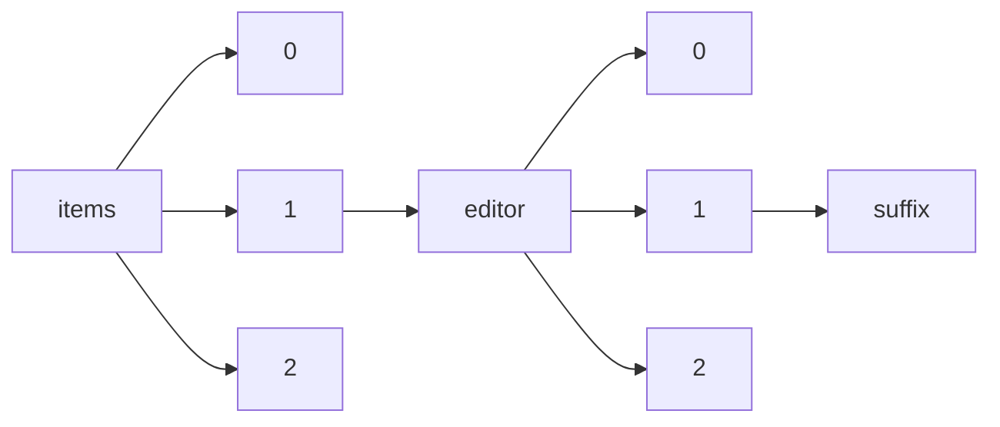

!!! warning "This document is not official Crossref documentation"
# Suffix
PATH = items/array/editor/array/suffix(1)  
Occurs 101 195 times  
Unique values: 172  
{ .annotate }

1. A route to an element, for example:  
   The route "items/array/editor/array/suffix" corresponds to navigating through the JSON indices as  
   ["items"][0]["editor"][0]["suffix"]  

| **Row** | **Value** `String` | **Count** `Int64` |
|--------:|----------------------:|---------------------:|
| **1**   | Jr                    | 95 832               |
| **2**   | Jr.                   | 2 098                |
| **3**   | MHBA                  | 455                  |
| **4**   | Sr.                   | 334                  |
| **5**   | FRCA                  | 329                  |
| **6**   | III                   | 265                  |
| **7**   | ML FRCA               | 259                  |
| **8**   | MD                    | 123                  |
| **9**   | DEAA                  | 114                  |
| **10**  | PhD                   | 106                  |
| **11**  | D.E.A.A.              | 103                  |
| **12**  | II                    | 90                   |
| **13**  | FEBO                  | 72                   |
| **14**  | MPH, FRCGP            | 67                   |
| **15**  | MD, PhD               | 59                   |
| **16**  | Dr.                   | 59                   |
| **17**  | IV                    | 57                   |
| **18**  | MBA                   | 52                   |
| **19**  | M.A.                  | 51                   |
| **20**  | FERC                  | 50                   |
| **21**  | MS, MRCVS             | 41                   |
| **22**  | MA, DEAA              | 37                   |
| **23**  | Dr                    | 29                   |
| **24**  | DECVCP                | 28                   |
| **25**  | DECVIM-Ca             | 28                   |
| **26**  | Júnior                | 22                   |
| **27**  | MD, DMD               | 20                   |
| **28**  | et al.                | 19                   |
| **29**  | Ph.D RD               | 19                   |
| **30**  | M.Sc.                 | 17                   |
| **31**  | Ph.D.                 | 17                   |
| **32**  | MA,FRCP               | 16                   |
| **33**  | M.A., DEAA            | 16                   |
| **34**  | Sr                    | 14                   |
| **35**  | MME                   | 13                   |
| **36**  | VMD MS                | 12                   |
| **37**  | MSc                   | 12                   |
| **38**  | Neto                  | 11                   |
| **39**  | MAS, Msc              | 10                   |
| **40**  | Filho                 | 10                   |
| **41**  | chair                 | 8                    |
| **42**  | Ed.                   | 8                    |
| **43**  | Junior                | 7                    |
| **44**  | Prof.                 | 7                    |
| **45**  | (Co-Editor            | 6                    |
| **46**  | , Contribu            | 5                    |
| **47**  | MD, FRCP              | 5                    |
| **48**  | Professor             | 5                    |
| **49**  | , Editor i            | 5                    |
| **50**  | Guest Edit            | 4                    |
| **51**  | IIIIVX                | 4                    |
| **52**  | Roux                  | 4                    |
| **53**  | Faucheur              | 4                    |
| **54**  | (Editor Ch            | 4                    |
| **55**  | JR.                   | 4                    |
| **56**  | MD, MBBS              | 3                    |
| **57**  | Johns                 | 3                    |
| **58**  | JÚNIOR                | 3                    |
| **59**  | Mr                    | 3                    |
| **60**  | M.D.                  | 3                    |
| **61**  | Mr.                   | 3                    |
| **62**  | S.J.                  | 3                    |
| **63**  | FSC                   | 3                    |
| **64**  | AM                    | 3                    |
| **65**  | PHD                   | 2                    |
| **66**  | Editor                | 2                    |
| **67**  | Chair                 | 2                    |
| **68**  | BSc                   | 2                    |
| **69**  | Ph. D.                | 2                    |
| **70**  | S. J.                 | 2                    |
| **71**  | junior                | 2                    |
| **72**  | (Co-Lead E            | 2                    |
| **73**  | PsyD                  | 2                    |
| **74**  | JR                    | 2                    |
| **75**  | Director              | 2                    |
| **76**  | MB, MD                | 2                    |
| **77**  | JUNIOR                | 2                    |
| **78**  | Experiment            | 2                    |
| **79**  | DR-                   | 1                    |
| **80**  | Santos                | 1                    |
| **81**  | M.D. Ph.D.            | 1                    |
| **82**  | MD, FRCPCH            | 1                    |
| **83**  | OP                    | 1                    |
| **84**  | MBBS, MD,             | 1                    |
| **85**  | FAIA                  | 1                    |
| **86**  | Oliveira              | 1                    |
| **87**  | (Hrsg.)               | 1                    |
| **88**  | sf                    | 1                    |
| **89**  | MD, FACC,             | 1                    |
| **90**  | Edited by             | 1                    |
| **91**  | DVM MSc Ph            | 1                    |
| **92**  | RN, PhD               | 1                    |
| **93**  | Chairman o            | 1                    |
| **94**  | Thành                 | 1                    |
| **95**  | Mghazli               | 1                    |
| **96**  | MD PhD MD             | 1                    |
| **97**  | ABD                   | 1                    |
| **98**  | MD, FRCS(E            | 1                    |
| **99**  | S.D.B.                | 1                    |
| **100** | MBChB, FRC            | 1                    |
| **101** | ,                     | 1                    |
| **102** | MBChB, MD,            | 1                    |
| **103** | MA (Oxon),            | 1                    |
| **104** | RVT, VTS (            | 1                    |
| **105** | Ngoc                  | 1                    |
| **106** | Salim                 | 1                    |
| **107** | M. A.                 | 1                    |
| **108** | MRes (c)              | 1                    |
| **109** | II, Guest             | 1                    |
| **110** | Ms.                   | 1                    |
| **111** | MD, MSc               | 1                    |
| **112** | jr.                   | 1                    |
| **113** | sr.                   | 1                    |
| **114** | MD, FIPP              | 1                    |
| **115** | LT                    | 1                    |
| **116** | G                     | 1                    |
| **117** | III.                  | 1                    |
| **118** | Harney                | 1                    |
| **119** | MD, MB                | 1                    |
| **120** | RN(EP), Ph            | 1                    |
| **121** | 029645                | 1                    |
| **122** | (Hg.)                 | 1                    |
| **123** | MA FRCGP              | 1                    |
| **124** | Sra.                  | 1                    |
| **125** | Dra.                  | 1                    |
| **126** | JR.,                  | 1                    |
| **127** | PhD,FEBOT             | 1                    |
| **128** | B.Sc                  | 1                    |
| **129** | HonRICS               | 1                    |
| **130** | MD, MBA, A            | 1                    |
| **131** | MS FRCS (G            | 1                    |
| **132** | DVM PhD               | 1                    |
| **133** | QC CEng               | 1                    |
| **134** | Cand. scie            | 1                    |
| **135** | J.P.                  | 1                    |
| **136** | MA BM BCh             | 1                    |
| **137** | MA, Phd               | 1                    |
| **138** | der Linde             | 1                    |
| **139** | MD FRCP FM            | 1                    |
| **140** | MA, MD, FR            | 1                    |
| **141** | Ph. D                 | 1                    |
| **142** | Chm.                  | 1                    |
| **143** | PhD,C.Psyc            | 1                    |
| **144** | PPMG                  | 1                    |
| **145** | MD, MPH (H            | 1                    |
| **146** | , Jr                  | 1                    |
| **147** | MD, FRACP             | 1                    |
| **148** | Vĩnh                  | 1                    |
| **149** | MD, FRCP,             | 1                    |
| **150** | PhD, FRCP             | 1                    |
| **151** | Malki                 | 1                    |
| **152** | Sean                  | 1                    |
| **153** | PhD, RN, C            | 1                    |
| **154** | MD, MSPH              | 1                    |
| **155** | 5988151               | 1                    |
| **156** | Chairman &            | 1                    |
| **157** | NETO                  | 1                    |
| **158** | DVM MS PhD            | 1                    |
| **159** | SThL(JusCa            | 1                    |
| **160** | DDS FACP              | 1                    |
| **161** | den Berghe            | 1                    |
| **162** | Miss                  | 1                    |
| **163** | DM, FRCP,             | 1                    |
| **164** | MD MHS-CL             | 1                    |
| **165** | Mrs.                  | 1                    |
| **166** | D.Sc                  | 1                    |
| **167** | FRCS                  | 1                    |
| **168** | BDS MS FAC            | 1                    |
| **169** | I                     | 1                    |
| **170** | Clinical P            | 1                    |
| **171** | Chairman              | 1                    |
| **172** | MSc, PhD,             | 1                    |

