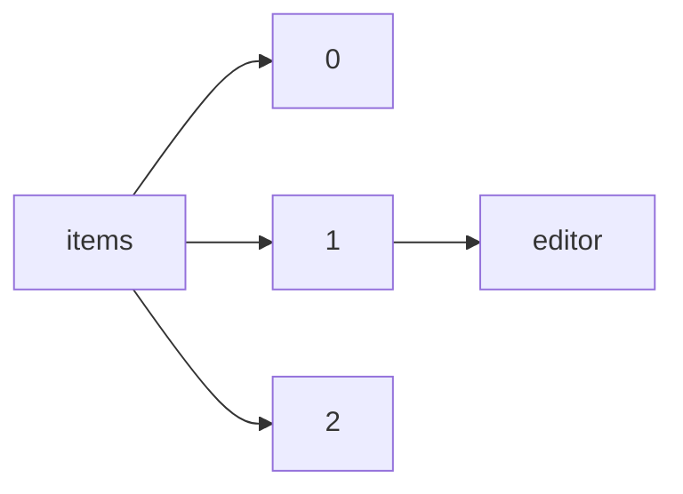

!!! warning "This document is not official Crossref documentation"
# Editor
PATH = items/array/editor(1)  
Occurs 2 567 228 times  
{ .annotate }

1. A route to an element, for example:  
   The route "items/array/editor" corresponds to navigating through the JSON indices as  
   ["items"][0]["editor"]  

## Properties of Array
See information about elements: [items/array/editor/array](array/index.md)  
Distribution of lengths:  

| **Row** | **Length** `Any` | **Count** `Int64` |
|--------:|--------------------:|---------------------:|
| **1**   | 1                   | 1 364 593            |
| **2**   | 2                   | 660 819              |
| **3**   | 3                   | 296 855              |
| **4**   | 4                   | 126 833              |
| **5**   | 5                   | 57 280               |
| **6**   | 6                   | 23 500               |
| **7**   | 7                   | 11 592               |
| **8**   | 8                   | 7 001                |
| **9**   | 9                   | 3 986                |
| **10**  | 10                  | 4 068                |
| ... | ... | ... |

