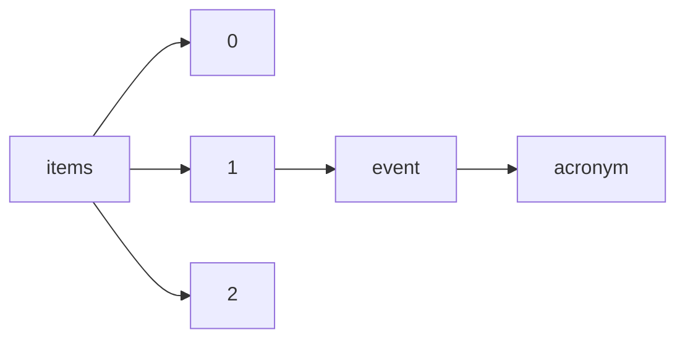

!!! warning "This document is not official Crossref documentation"
# Acronym
PATH = items/array/event/acronym(1)  
Occurs 2 324 307 times  
Unique values: > 999  
{ .annotate }

1. A route to an element, for example:  
   The route "items/array/event/acronym" corresponds to navigating through the JSON indices as  
   ["items"][0]["event"]["acronym"]  

!!! note "Due to current limitations, only the first 1,000 unique values are counted."

| **Row** | **Value** `String`     | **Count** `Int64` |
|--------:|--------------------------:|---------------------:|
| **1**   | ANNUAL                    | 43 451               |
| **2**   | GMDMEETING                | 19 858               |
| **3**   | FiO                       | 13 298               |
| **4**   | OFC                       | 12 418               |
| **5**   | CLEO\_SI                  | 9 181                |
| **6**   | OAM                       | 8 910                |
| **7**   | CLEO\_AT                  | 7 345                |
| **8**   | ICES                      | 5 717                |
| **9**   | ice2016                   | 5 658                |
| **10**  | CLEO                      | 5 212                |
| **11**  | HICSS                     | 5 037                |
| **12**  | FFL                       | 4 794                |
| **13**  | CLEO\_QELS                | 4 569                |
| **14**  | ACPC                      | 4 444                |
| **15**  | ISMS                      | 4 120                |
| **16**  | ASSL                      | 3 884                |
| **17**  | UP                        | 3 178                |
| **18**  | eLSE                      | 2 524                |
| **19**  | SGEM2017                  | 2 469                |
| **20**  | SGEM2018                  | 2 433                |
| **21**  | ACP                       | 2 362                |
| **22**  | FFC                       | 2 350                |
| **23**  | F & L                     | 2 323                |
| **24**  | NVC                       | 2 184                |
| **25**  | CLEO\_Europe              | 2 130                |
| **26**  | COBEQ 2014                | 2 104                |
| **27**  | OH                        | 1 959                |
| **28**  | NLO                       | 1 919                |
| **29**  | SGEMSOCIAL2018            | 1 915                |
| **30**  | ESREL                     | 1 914                |
| **31**  | OIC                       | 1 911                |
| **32**  | EDULEARN21                | 1 841                |
| **33**  | SGEM2019                  | 1 812                |
| **34**  | OFS                       | 1 804                |
| **35**  | ASSP                      | 1 736                |
| **36**  | CONTECSI                  | 1 719                |
| **37**  | IMECE2000                 | 1 713                |
| **38**  | DH                        | 1 713                |
| **39**  | BIOMED                    | 1 685                |
| **40**  | IMECE2005                 | 1 682                |
| **41**  | EDULEARN22                | 1 678                |
| **42**  | ICERI2019                 | 1 651                |
| **43**  | IPR                       | 1 647                |
| **44**  | EDULEARN18                | 1 638                |
| **45**  | IMECE2004                 | 1 631                |
| **46**  | IMECE2012                 | 1 629                |
| **47**  | IMECE2013                 | 1 624                |
| **48**  | EDULEARN19                | 1 618                |
| **49**  | SGEMSOCIAL2017            | 1 604                |
| **50**  | Sudak                     | 1 591                |
| **51**  | EDULEARN17                | 1 590                |
| **52**  | LS                        | 1 582                |
| **53**  | ICERI2018                 | 1 579                |
| **54**  | INTED2022                 | 1 579                |
| **55**  | INTED2021                 | 1 558                |
| **56**  | IMECE2002                 | 1 547                |
| **57**  | ICERI2021                 | 1 529                |
| **58**  | INTED2019                 | 1 519                |
| **59**  | SAE BRAZIL                | 1 514                |
| **60**  | IGARSS-03                 | 1 513                |
| **61**  | IMECE2003                 | 1 493                |
| **62**  | ECBO                      | 1 488                |
| **63**  | INTED2020                 | 1 485                |
| **64**  | PIBIC - 2016              | 1 479                |
| **65**  | AERA                      | 1 479                |
| **66**  | IMECE2011                 | 1 474                |
| **67**  | ICERI2020                 | 1 470                |
| **68**  | INTED2018                 | 1 470                |
| **69**  | IMECE2001                 | 1 467                |
| **70**  | INTED2017                 | 1 438                |
| **71**  | IEMBS-04                  | 1 437                |
| **72**  | ISCAS-06                  | 1 432                |
| **73**  | INTED2023                 | 1 425                |
| **74**  | AEROTECH                  | 1 420                |
| **75**  | SFL                       | 1 418                |
| **76**  | ICERI2017                 | 1 399                |
| **77**  | ISCAS-93                  | 1 398                |
| **78**  | PIBIC                     | 1 397                |
| **79**  | IMECE2006                 | 1 386                |
| **80**  | ICERI2022                 | 1 381                |
| **81**  | IEMBS-02                  | 1 364                |
| **82**  | revpibic                  | 1 358                |
| **83**  | UNICAMP-PIBIC             | 1 354                |
| **84**  | BMEEMB-99                 | 1 337                |
| **85**  | AHFE 2022                 | 1 336                |
| **86**  | LAOP                      | 1 334                |
| **87**  | EDULEARN16                | 1 328                |
| **88**  | IMECE2014                 | 1 320                |
| **89**  | IMECE2010                 | 1 319                |
| **90**  | EDULEARN20                | 1 315                |
| **91**  | Paris2017                 | 1 313                |
| **92**  | NFOEC                     | 1 303                |
| **93**  | APS-05                    | 1 299                |
| **94**  | PAC-93                    | 1 291                |
| **95**  | CHI '20                   | 1 288                |
| **96**  | CHI '19                   | 1 272                |
| **97**  | COB17                     | 1 269                |
| **98**  | IMECE99                   | 1 260                |
| **99**  | ICERI2016                 | 1 260                |
| **100** | CHI '21                   | 1 259                |
| **101** | PAC-97                    | 1 256                |
| **102** | IMECE97                   | 1 249                |
| **103** | INTED2016                 | 1 236                |
| **104** | QELS                      | 1 234                |
| **105** | ICRC2021                  | 1 232                |
| **106** | ICASSP-03                 | 1 230                |
| **107** | STAPP                     | 1 223                |
| **108** | ISAHP                     | 1 222                |
| **109** | CLEOPR                    | 1 218                |
| **110** | IMECE98                   | 1 218                |
| **111** | WCICA-04                  | 1 218                |
| **112** | IMECE2007                 | 1 215                |
| **113** | IDETC-CIE2007             | 1 215                |
| **114** | ISCAS-04                  | 1 213                |
| **115** | CHI '18                   | 1 210                |
| **116** | COMVEC                    | 1 208                |
| **117** | ICASSP-04                 | 1 205                |
| **118** | IGARSS-02                 | 1 202                |
| **119** | IDETC-CIE2009             | 1 198                |
| **120** | IMECE2009                 | 1 196                |
| **121** | OFT                       | 1 186                |
| **122** | IMECE2008                 | 1 182                |
| **123** | emc2020                   | 1 171                |
| **124** | IPRSN                     | 1 171                |
| **125** | COB2019                   | 1 169                |
| **126** | GT2014                    | 1 161                |
| **127** | GT2020                    | 1 160                |
| **128** | ICSMC-99                  | 1 152                |
| **129** | Amsterdam2014             | 1 147                |
| **130** | GT2012                    | 1 139                |
| **131** | COBEQ 2018                | 1 134                |
| **132** | JNGCGC                    | 1 134                |
| **133** | ISCAS-02                  | 1 118                |
| **134** | CHI'16                    | 1 117                |
| **135** | IDETC-CIE2011             | 1 116                |
| **136** | UBT-IC                    | 1 106                |
| **137** | CHI '22                   | 1 104                |
| **138** | IEMBS-96                  | 1 099                |
| **139** | COBEM2015                 | 1 096                |
| **140** | interspeech\_2022         | 1 095                |
| **141** | ICRC2015                  | 1 094                |
| **142** | Madrid2015                | 1 093                |
| **143** | PAC-01                    | 1 092                |
| **144** | NLGW                      | 1 088                |
| **145** | IGARSS-01                 | 1 085                |
| **146** | Photonics                 | 1 084                |
| **147** | PAC-03                    | 1 083                |
| **148** | PAC-95                    | 1 081                |
| **149** | London2013                | 1 076                |
| **150** | IMECE2015                 | 1 075                |
| **151** | GT2016                    | 1 073                |
| **152** | GT2018                    | 1 064                |
| **153** | IEMBS-01                  | 1 061                |
| **154** | INTMAG-98                 | 1 059                |
| **155** | IGARSS-00                 | 1 051                |
| **156** | IMECE2016                 | 1 050                |
| **157** | PASS CAR                  | 1 047                |
| **158** | SIGGRAPH '06              | 1 046                |
| **159** | CDC-03                    | 1 041                |
| **160** | Copenhagen2018            | 1 038                |
| **161** | CHI '17                   | 1 037                |
| **162** | CHI '14                   | 1 032                |
| **163** | GT2015                    | 1 031                |
| **164** | ICSMC-04                  | 1 026                |
| **165** | ICASSP-97                 | 1 026                |
| **166** | BRASILCONG                | 1 025                |
| **167** | GT2017                    | 1 019                |
| **168** | CDC-96                    | 1 019                |
| **169** | CHI '13                   | 1 014                |
| **170** | interspeech\_2020         | 1 010                |
| **171** | COSI                      | 1 009                |
| **172** | Cobramseg                 | 1 005                |
| **173** | ISCAS-03                  | 999                  |
| **174** | Copenhagen2012            | 998                  |
| **175** | IMECE2018                 | 995                  |
| **176** | ICASSP-01                 | 992                  |
| **177** | CDC-97                    | 985                  |
| **178** | IDETC-CIE2005             | 983                  |
| **179** | GT2010                    | 978                  |
| **180** | ICPR-00                   | 977                  |
| **181** | IMECE2021                 | 974                  |
| **182** | ICSE '18                  | 971                  |
| **183** | GT2013                    | 969                  |
| **184** | ICASSP-00                 | 967                  |
| **185** | ISCAS-01                  | 967                  |
| **186** | interspeech\_2021         | 964                  |
| **187** | IEMBS-03                  | 961                  |
| **188** | ACC-95                    | 961                  |
| **189** | SGEM2015                  | 960                  |
| **190** | GT2011                    | 959                  |
| **191** | ISCAS-00                  | 958                  |
| **192** | COB2021                   | 953                  |
| **193** | CDC-00                    | 947                  |
| **194** | CHI '15                   | 943                  |
| **195** | IJCAI-2019                | 943                  |
| **196** | APS-03                    | 943                  |
| **197** | ICASSP-98                 | 940                  |
| **198** | IQEC                      | 936                  |
| **199** | IDETC-CIE2015             | 931                  |
| **200** | MM '22                    | 929                  |
| **201** | IMECE2017                 | 929                  |
| **202** | IEMBS-98                  | 923                  |
| **203** | SGEM2020                  | 923                  |
| **204** | CDC-01                    | 920                  |
| **205** | icslp\_2000               | 920                  |
| **206** | GT2019                    | 918                  |
| **207** | ICRC2019                  | 918                  |
| **208** | interspeech\_2019         | 915                  |
| **209** | IMECE2019                 | 914                  |
| **210** | CDC-99                    | 909                  |
| **211** | IDETC-CIE2013             | 906                  |
| **212** | ICASSP-95                 | 904                  |
| **213** | IEMBS-00                  | 902                  |
| **214** | GT2008                    | 898                  |
| **215** | ACC-03                    | 898                  |
| **216** | BIO                       | 896                  |
| **217** | GT2022                    | 891                  |
| **218** | Vienna2011                | 888                  |
| **219** | ISCAS-98                  | 884                  |
| **220** | 12IPTC                    | 883                  |
| **221** | IDETC-CIE2014             | 882                  |
| **222** | WTC2005                   | 881                  |
| **223** | OMAE2018                  | 880                  |
| **224** | INTMAG-02                 | 879                  |
| **225** | ICRC2017                  | 876                  |
| **226** | interspeech\_2005         | 870                  |
| **227** | ISCAS-99                  | 869                  |
| **228** | AHFE                      | 867                  |
| **229** | CLEO-02                   | 864                  |
| **230** | EARTHMOVING               | 860                  |
| **231** | WCICA-00                  | 860                  |
| **232** | SETC                      | 856                  |
| **233** | CHI '12                   | 854                  |
| **234** | IJCAI-2018                | 854                  |
| **235** | IEMBS-95                  | 854                  |
| **236** | CBEE                      | 851                  |
| **237** | icslp\_1998               | 849                  |
| **238** | ICSMC-98                  | 847                  |
| **239** | CDC-94                    | 847                  |
| **240** | CBA2018                   | 846                  |
| **241** | ICIP-01                   | 845                  |
| **242** | SIGGRAPH07                | 844                  |
| **243** | COBENGE                   | 839                  |
| **244** | OMAE2013                  | 838                  |
| **245** | OMAE2019                  | 835                  |
| **246** | OMAE2014                  | 832                  |
| **247** | IJCNN-99                  | 828                  |
| **248** | interspeech\_2011         | 827                  |
| **249** | CDC-95                    | 820                  |
| **250** | CHI '11                   | 819                  |
| **251** | IDETC-CIE2012             | 818                  |
| **252** | CDC-02                    | 818                  |
| **253** | ICMLC-04                  | 809                  |
| **254** | FTT                       | 808                  |
| **255** | SIAT                      | 808                  |
| **256** | 22ADIP                    | 806                  |
| **257** | CEST                      | 805                  |
| **258** | ICSMC-95                  | 804                  |
| **259** | FTS                       | 804                  |
| **260** | eurospeech\_2003          | 797                  |
| **261** | interspeech\_2017         | 796                  |
| **262** | PESC-04                   | 794                  |
| **263** | ICASSP-94                 | 790                  |
| **264** | ICCSEE-13                 | 789                  |
| **265** | OAA                       | 788                  |
| **266** | IHTC14                    | 785                  |
| **267** | IJCAI-2017                | 782                  |
| **268** | ICONE29                   | 781                  |
| **269** | interspeech\_2010         | 781                  |
| **270** | interspeech\_2016         | 775                  |
| **271** | OH & P                    | 768                  |
| **272** | IMECE2022                 | 766                  |
| **273** | IGARSS-96                 | 766                  |
| **274** | DETC99                    | 766                  |
| **275** | interspeech\_2009         | 765                  |
| **276** | ICSMC-03                  | 761                  |
| **277** | GT2007                    | 760                  |
| **278** | ICASSP-96                 | 759                  |
| **279** | DATE14                    | 753                  |
| **280** | GT2006                    | 753                  |
| **281** | ICIP-03                   | 752                  |
| **282** | ICONE25                   | 751                  |
| **283** | interspeech\_2018         | 750                  |
| **284** | Anais CBA 2020            | 750                  |
| **285** | APS-01                    | 749                  |
| **286** | interspeech\_2013         | 749                  |
| **287** | ENEGEP 2018               | 748                  |
| **288** | ICSMC-97                  | 747                  |
| **289** | IDETC-CIE2019             | 746                  |
| **290** | IEMBS-97                  | 746                  |
| **291** | interspeech\_2007         | 745                  |
| **292** | interspeech\_2015         | 743                  |
| **293** | IDETC-CIE2017             | 742                  |
| **294** | 38IAHRWC                  | 737                  |
| **295** | GT2004                    | 733                  |
| **296** | CDC-93                    | 732                  |
| **297** | APS-02                    | 731                  |
| **298** | IJCAI-PRICAI-2020         | 731                  |
| **299** | IDETC-CIE2001             | 731                  |
| **300** | IDETC-CIE2010             | 730                  |
| **301** | SGEM2016                  | 730                  |
| **302** | PPPOS-01                  | 728                  |
| **303** | DETC95                    | 727                  |
| **304** | ISCAS-94                  | 727                  |
| **305** | IDETC-CIE2018             | 726                  |
| **306** | IGARSS-99                 | 725                  |
| **307** | interspeech\_2004         | 723                  |
| **308** | eurospeech\_1997          | 722                  |
| **309** | IMECE2020                 | 720                  |
| **310** | WCICA-02                  | 719                  |
| **311** | METAL                     | 719                  |
| **312** | PAC-99                    | 719                  |
| **313** | GT2021                    | 716                  |
| **314** | GLOCOM-01                 | 713                  |
| **315** | IHTC-15                   | 713                  |
| **316** | ICPR-02                   | 712                  |
| **317** | ISCAS-97                  | 708                  |
| **318** | MEMSYS-03                 | 707                  |
| **319** | QELS-05                   | 705                  |
| **320** | IJCAI-2022                | 704                  |
| **321** | MM '21                    | 704                  |
| **322** | OMAE2017                  | 704                  |
| **323** | IDETC-CIE2016             | 703                  |
| **324** | SSDM2011                  | 703                  |
| **325** | INOVAGRI2014              | 702                  |
| **326** | interspeech\_2008         | 702                  |
| **327** | IHTC13                    | 702                  |
| **328** | GLOCOM-03                 | 701                  |
| **329** | por2006                   | 700                  |
| **330** | T & B                     | 697                  |
| **331** | IEMBS-94                  | 695                  |
| **332** | 21ADIP                    | 695                  |
| **333** | ICIP-02                   | 694                  |
| **334** | FEDSM2003                 | 692                  |
| **335** | PVP2006-ICPVT-11          | 692                  |
| **336** | TENCON-93                 | 689                  |
| **337** | ENEGEP 2021               | 689                  |
| **338** | CILAMCE2017               | 687                  |
| **339** | ICONE21                   | 683                  |
| **340** | IDETC-CIE2003             | 681                  |
| **341** | ICONE18                   | 679                  |
| **342** | icslp\_2002               | 679                  |
| **343** | OMAE2009                  | 677                  |
| **344** | ENEQPE2020                | 676                  |
| **345** | IJCNN-93                  | 673                  |
| **346** | ECCB 2018                 | 672                  |
| **347** | 19ADIP                    | 670                  |
| **348** | lnv2003                   | 666                  |
| **349** | SSDM2009                  | 666                  |
| **350** | CLEOE-00                  | 665                  |
| **351** | can2004                   | 664                  |
| **352** | CHI '09                   | 664                  |
| **353** | PVP2011                   | 664                  |
| **354** | 20ADIP                    | 663                  |
| **355** | CLEO-99                   | 662                  |
| **356** | interspeech\_2006         | 660                  |
| **357** | OMAE2011                  | 660                  |
| **358** | PVP2014                   | 659                  |
| **359** | ACC-94                    | 659                  |
| **360** | 39th IAHR Wolrd Congress  | 656                  |
| **361** | coninter2020              | 656                  |
| **362** | OMAE2010                  | 654                  |
| **363** | 17ADIP                    | 653                  |
| **364** | OMAE2020                  | 653                  |
| **365** | 3D                        | 652                  |
| **366** | IDETC-CIE2008             | 651                  |
| **367** | OMAE2012                  | 649                  |
| **368** | ICC-02                    | 645                  |
| **369** | BS2019                    | 645                  |
| **370** | IGARSS-94                 | 641                  |
| **371** | CDC-98                    | 641                  |
| **372** | Sensors                   | 641                  |
| **373** | OMAE2008                  | 639                  |
| **374** | IJCAI-2021                | 637                  |
| **375** | RADConf                   | 635                  |
| **376** | DETC97                    | 632                  |
| **377** | ICSLP-96                  | 631                  |
| **378** | CON18                     | 630                  |
| **379** | NSSMIC-00                 | 629                  |
| **380** | min2007                   | 629                  |
| **381** | SSDM2012                  | 629                  |
| **382** | ICIP-96                   | 628                  |
| **383** | GT2005                    | 627                  |
| **384** | ROBOT-00                  | 626                  |
| **385** | PLASMA-03                 | 626                  |
| **386** | SSDM2010                  | 625                  |
| **387** | CHI '10                   | 625                  |
| **388** | ICISCAE 2021              | 624                  |
| **389** | eurospeech\_2001          | 623                  |
| **390** | CLEOPR-03                 | 622                  |
| **391** | ICHEP2016                 | 621                  |
| **392** | WWW '19                   | 621                  |
| **393** | ICC-01                    | 621                  |
| **394** | SBR 2019                  | 620                  |
| **395** | ECCOMAS Congress 2016     | 620                  |
| **396** | ssemse-15                 | 620                  |
| **397** | GT2002                    | 620                  |
| **398** | ROBOT-02                  | 619                  |
| **399** | ICIP-98                   | 618                  |
| **400** | CLEOE-03                  | 616                  |
| **401** | MM '20                    | 615                  |
| **402** | 18ADIP                    | 615                  |
| **403** | GT2009                    | 614                  |
| **404** | PVP2009                   | 613                  |
| **405** | prov2008                  | 613                  |
| **406** | ICSMC-02                  | 611                  |
| **407** | PVP2017                   | 610                  |
| **408** | XX SINAFERM               | 610                  |
| **409** | ISCAS-96                  | 610                  |
| **410** | SICE-02                   | 609                  |
| **411** | IGARSS-97                 | 607                  |
| **412** | cil2002                   | 605                  |
| **413** | SBC2012                   | 604                  |
| **414** | TB                        | 600                  |
| **415** | PVP2015                   | 599                  |
| **416** | SBC2009                   | 599                  |
| **417** | GT2000                    | 599                  |
| **418** | ICIP-97                   | 598                  |
| **419** | PVP2008                   | 596                  |
| **420** | AIAM2021                  | 593                  |
| **421** | icmmcce-15                | 593                  |
| **422** | ICNN-94                   | 593                  |
| **423** | INOVAGRI2017              | 592                  |
| **424** | eurospeech\_1999          | 592                  |
| **425** | SGEM2021                  | 592                  |
| **426** | SBC2013                   | 591                  |
| **427** | interspeech\_2012         | 590                  |
| **428** | WWW '22                   | 589                  |
| **429** | ROBOT-98                  | 589                  |
| **430** | GT2003                    | 586                  |
| **431** | ICSMC-00                  | 585                  |
| **432** | WEBIST                    | 585                  |
| **433** | OMAE2015                  | 584                  |
| **434** | interspeech\_2014         | 578                  |
| **435** | SSDM2018                  | 578                  |
| **436** | tfl2005                   | 575                  |
| **437** | SIGGRAPH '08              | 573                  |
| **438** | OMAE2022                  | 572                  |
| **439** | soberebpc2021             | 571                  |
| **440** | MWSYM-03                  | 570                  |
| **441** | 16ADIP                    | 570                  |
| **442** | ICIP-94                   | 568                  |
| **443** | APS-00                    | 568                  |
| **444** | ROBOT-97                  | 568                  |
| **445** | PES-04                    | 568                  |
| **446** | icslp\_1996               | 567                  |
| **447** | CIKM '22                  | 567                  |
| **448** | QIM                       | 567                  |
| **449** | IDETC-CIE2000             | 566                  |
| **450** | CIDHCoimbra               | 565                  |
| **451** | CBRN                      | 564                  |
| **452** | SSDM2015                  | 564                  |
| **453** | IROS-04                   | 564                  |
| **454** | APS-98                    | 563                  |
| **455** | PVP2007                   | 562                  |
| **456** | ORSA                      | 562                  |
| **457** | ICHEP2020                 | 562                  |
| **458** | IJCNN-05                  | 559                  |
| **459** | SSDM2006                  | 554                  |
| **460** | MM '10                    | 553                  |
| **461** | EPS-HEP2017               | 552                  |
| **462** | IJCNN-03                  | 552                  |
| **463** | SSDM2008                  | 551                  |
| **464** | PVP2018                   | 551                  |
| **465** | PVP2004                   | 550                  |
| **466** | Glasgow1995               | 545                  |
| **467** | ICHEP2022                 | 545                  |
| **468** | PVP2005                   | 545                  |
| **469** | ICMLC-03                  | 544                  |
| **470** | WCPEC-94                  | 544                  |
| **471** | CHI '08                   | 544                  |
| **472** | reno2009                  | 544                  |
| **473** | PVP2016                   | 542                  |
| **474** | sca2001                   | 541                  |
| **475** | APS-97                    | 540                  |
| **476** | SIGGRAPH98                | 539                  |
| **477** | GA                        | 538                  |
| **478** | ichssr-22                 | 536                  |
| **479** | APS-94                    | 534                  |
| **480** | GECCO07                   | 533                  |
| **481** | PIMRC-03                  | 532                  |
| **482** | IECON-02                  | 532                  |
| **483** | icslp\_1994               | 528                  |
| **484** | icemci-21                 | 527                  |
| **485** | IGARSS-93                 | 526                  |
| **486** | SSDM2005                  | 526                  |
| **487** | INTMAG-97                 | 526                  |
| **488** | CIKM'12                   | 525                  |
| **489** | VETEC-98                  | 524                  |
| **490** | EMEIT-12                  | 523                  |
| **491** | PLASMA-97                 | 522                  |
| **492** | Amsterdam1996             | 521                  |
| **493** | dall2012                  | 520                  |
| **494** | ICONE26                   | 520                  |
| **495** | VETECS-00                 | 519                  |
| **496** | 09IPTC                    | 518                  |
| **497** | OFC-02                    | 518                  |
| **498** | SBC2008                   | 517                  |
| **499** | HICSS-01                  | 515                  |
| **500** | SBC2007                   | 514                  |
| **501** | GLOCOM-04                 | 513                  |
| **502** | BGRS/SB-2022              | 513                  |
| **503** | ESDA2010                  | 510                  |
| **504** | P&D Design 2015           | 510                  |
| **505** | SGEM2011                  | 508                  |
| **506** | CIT20                     | 507                  |
| **507** | ROBOT-96                  | 507                  |
| **508** | SIGCSE '20                | 507                  |
| **509** | PESW-00                   | 506                  |
| **510** | ICONE14                   | 505                  |
| **511** | COBRAMSEG2016             | 505                  |
| **512** | SCTCMG 2019               | 504                  |
| **513** | pitt2010                  | 504                  |
| **514** | ICC-03                    | 503                  |
| **515** | ENEGEP 2019               | 503                  |
| **516** | GT1997                    | 501                  |
| **517** | PVP2010                   | 498                  |
| **518** | ASPB                      | 497                  |
| **519** | VETEC-03                  | 496                  |
| **520** | INTMAG-03                 | 496                  |
| **521** | ISIT-00                   | 496                  |
| **522** | GECCO '11                 | 495                  |
| **523** | GT1994                    | 495                  |
| **524** | SBAI 2019                 | 494                  |
| **525** | SBC2011                   | 494                  |
| **526** | ICPR-98                   | 493                  |
| **527** | ICSMC-93                  | 492                  |
| **528** | GT1996                    | 492                  |
| **529** | SSDM2017                  | 492                  |
| **530** | MODSIM2013                | 491                  |
| **531** | MWSYM-02                  | 491                  |
| **532** | CCN                       | 491                  |
| **533** | PIMRC-02                  | 491                  |
| **534** | ROBOT-94                  | 490                  |
| **535** | ichess-21                 | 489                  |
| **536** | IODC                      | 489                  |
| **537** | SSDM2019                  | 488                  |
| **538** | ISIT-97                   | 488                  |
| **539** | ICONE22                   | 487                  |
| **540** | loui2011                  | 485                  |
| **541** | MODSIM2011                | 484                  |
| **542** | SICITE2015                | 483                  |
| **543** | PeD 2018                  | 482                  |
| **544** | VETECS-04                 | 480                  |
| **545** | ICONE16                   | 479                  |
| **546** | ICSMC-96                  | 478                  |
| **547** | VAM21                     | 477                  |
| **548** | WWW '21                   | 477                  |
| **549** | ISIT-94                   | 477                  |
| **550** | mmebc-16                  | 477                  |
| **551** | CIKM '21                  | 477                  |
| **552** | ENEGEP 2017               | 477                  |
| **553** | PESS-00                   | 475                  |
| **554** | P&D 2022                  | 474                  |
| **555** | SAC '08                   | 474                  |
| **556** | CIT18                     | 474                  |
| **557** | CIKM '09                  | 472                  |
| **558** | spo2017                   | 472                  |
| **559** | IROS-03                   | 471                  |
| **560** | IECON-98                  | 471                  |
| **561** | IECEC                     | 469                  |
| **562** | HT-FED2004                | 468                  |
| **563** | XIII COBEQ-IC             | 466                  |
| **564** | ICPST-02                  | 465                  |
| **565** | GLOCOM-96                 | 463                  |
| **566** | OPTCOMP                   | 461                  |
| **567** | IJCNN-98                  | 461                  |
| **568** | NSSMIC-01                 | 461                  |
| **569** | ICSMC-94                  | 459                  |
| **570** | GLOCOM-98                 | 458                  |
| **571** | COMPDYN 2019              | 457                  |
| **572** | SIGGRAPH99                | 456                  |
| **573** | IJCNN-02                  | 454                  |
| **574** | VETECF-02                 | 453                  |
| **575** | ICCIA-12                  | 453                  |
| **576** | PVP2013                   | 453                  |
| **577** | ISCKMC                    | 452                  |
| **578** | APCChE                    | 451                  |
| **579** | MWSYM-00                  | 451                  |
| **580** | SSDM2016                  | 449                  |
| **581** | OMAE2016                  | 449                  |
| **582** | GLOCOM-99                 | 448                  |
| **583** | PVP2012                   | 447                  |
| **584** | GT2001                    | 447                  |
| **585** | ICHEP 2010                | 446                  |
| **586** | ENEGEP 2020               | 442                  |
| **587** | COBEQ IC 2017             | 441                  |
| **588** | MM '11                    | 440                  |
| **589** | ICNN-97                   | 439                  |
| **590** | itms-15                   | 438                  |
| **591** | IROS-02                   | 438                  |
| **592** | PIMRC-04                  | 437                  |
| **593** | OMAE2007                  | 437                  |
| **594** | ISIT-98                   | 437                  |
| **595** | ICONE24                   | 436                  |
| **596** | SAC'10                    | 435                  |
| **597** | IQEC-00                   | 434                  |
| **598** | ICSE11                    | 433                  |
| **599** | icfied-22                 | 433                  |
| **600** | DETC-CIE96                | 432                  |
| **601** | 21ATCE                    | 431                  |
| **602** | 06ATCE                    | 431                  |
| **603** | WWW '15                   | 429                  |
| **604** | 03ATCE                    | 429                  |
| **605** | ICONE10                   | 429                  |
| **606** | miss2013                  | 429                  |
| **607** | VETEC-97                  | 428                  |
| **608** | 20IPTC                    | 426                  |
| **609** | PVSC-05                   | 426                  |
| **610** | iscfec-20                 | 425                  |
| **611** | msetasse-16               | 424                  |
| **612** | 04ATCE                    | 423                  |
| **613** | ICME-04                   | 422                  |
| **614** | ICINCO                    | 422                  |
| **615** | CHI07                     | 422                  |
| **616** | ISIT-02                   | 422                  |
| **617** | APS-96                    | 421                  |
| **618** | FEDSM2007                 | 420                  |
| **619** | Optofluidics 2017         | 420                  |
| **620** | SHM 2019                  | 418                  |
| **621** | COBEQ IC 2015             | 417                  |
| **622** | icesame-17                | 416                  |
| **623** | DETC92                    | 415                  |
| **624** | LATTICE 2013              | 414                  |
| **625** | SEPD                      | 413                  |
| **626** | PICMET-97                 | 412                  |
| **627** | SAC09                     | 412                  |
| **628** | SBC2010                   | 412                  |
| **629** | SIGGRAPH '97              | 411                  |
| **630** | IAS-00                    | 411                  |
| **631** | ICCT-03                   | 410                  |
| **632** | SAC '19                   | 410                  |
| **633** | GT1992                    | 410                  |
| **634** | GECCO '14                 | 410                  |
| **635** | IPDPS-03                  | 409                  |
| **636** | GT1991                    | 408                  |
| **637** | 22IPTC                    | 408                  |
| **638** | SSDM2007                  | 406                  |
| **639** | SIGGRAPH09                | 405                  |
| **640** | CIKM08                    | 405                  |
| **641** | IECON-03                  | 405                  |
| **642** | QUALIHOSP                 | 403                  |
| **643** | GECCO '19                 | 402                  |
| **644** | PLASMA-99                 | 402                  |
| **645** | BS 2013                   | 401                  |
| **646** | ICCASM-12                 | 400                  |
| **647** | INOVAGRI2015              | 399                  |
| **648** | PES-03                    | 398                  |
| **649** | DETC93                    | 398                  |
| **650** | ARMA22                    | 397                  |
| **651** | iccese-19                 | 397                  |
| **652** | ROBOT-03                  | 395                  |
| **653** | ICMA-05                   | 395                  |
| **654** | COF2017                   | 394                  |
| **655** | MWSYM-94                  | 394                  |
| **656** | GT1995                    | 391                  |
| **657** | ACSSC-03                  | 391                  |
| **658** | GECCO '10                 | 391                  |
| **659** | FIE-99                    | 391                  |
| **660** | PVP2002                   | 390                  |
| **661** | SEED 2022                 | 389                  |
| **662** | FEDSM2014                 | 388                  |
| **663** | 10ATCE                    | 388                  |
| **664** | SIGGRAPH '10              | 387                  |
| **665** | MWSYM-97                  | 387                  |
| **666** | ISME13                    | 386                  |
| **667** | PLASMA-02                 | 386                  |
| **668** | GLOCOM-94                 | 385                  |
| **669** | EPS-HEP 2009              | 384                  |
| **670** | OCEANS-94                 | 383                  |
| **671** | CIKM '19                  | 383                  |
| **672** | GT1990                    | 382                  |
| **673** | COMPDYN 2017              | 381                  |
| **674** | APS-93                    | 381                  |
| **675** | 11ATCE                    | 380                  |
| **676** | KDD '20                   | 379                  |
| **677** | SWC 2011                  | 379                  |
| **678** | ICSE '20                  | 379                  |
| **679** | VETECS-02                 | 378                  |
| **680** | 08ATCE                    | 378                  |
| **681** | SIGGRAPH02                | 378                  |
| **682** | MWSCAS-03                 | 378                  |
| **683** | OCCCAS-02                 | 378                  |
| **684** | SSDM2020                  | 376                  |
| **685** | PLASMA-96                 | 376                  |
| **686** | IMTC-94                   | 375                  |
| **687** | LEOS-94                   | 375                  |
| **688** | VETECF-00                 | 374                  |
| **689** | OMAE2021                  | 374                  |
| **690** | SIGGRAPH '15              | 373                  |
| **691** | LACCEI2022                | 373                  |
| **692** | ICAIIS 2021               | 372                  |
| **693** | ICME-00                   | 372                  |
| **694** | 05ATCE                    | 372                  |
| **695** | ESDA2012                  | 372                  |
| **696** | VETEC-94                  | 371                  |
| **697** | GT1993                    | 371                  |
| **698** | ULTSYM-03                 | 369                  |
| **699** | LEOS-98                   | 369                  |
| **700** | LEOS-00                   | 367                  |
| **701** | IDETC-CIE2004             | 366                  |
| **702** | CIKM '13                  | 366                  |
| **703** | UbiComp '16               | 365                  |
| **704** | 14ATCE                    | 364                  |
| **705** | CHI04                     | 364                  |
| **706** | Anais SBSE 2020           | 363                  |
| **707** | ESDA2008                  | 363                  |
| **708** | MWSCAS-02                 | 363                  |
| **709** | SENSOR-03                 | 363                  |
| **710** | IDETC-CIE2006             | 362                  |
| **711** | WCNC-03                   | 362                  |
| **712** | LEOS-03                   | 362                  |
| **713** | BGRS/SB-2020              | 361                  |
| **714** | PVP2003                   | 360                  |
| **715** | IECON-94                  | 359                  |
| **716** | CHI06                     | 359                  |
| **717** | ICOSP-00                  | 359                  |
| **718** | 14IPTC                    | 359                  |
| **719** | 09ATCE                    | 356                  |
| **720** | ESDA2006                  | 356                  |
| **721** | OCEANS-04                 | 356                  |
| **722** | ICSE '08                  | 355                  |
| **723** | GECCO '17                 | 355                  |
| **724** | KDD '22                   | 353                  |
| **725** | MWSYM-04                  | 352                  |
| **726** | ERES 2018                 | 352                  |
| **727** | OFC-00                    | 351                  |
| **728** | WWW '20                   | 351                  |
| **729** | GECCO05                   | 349                  |
| **730** | iccessh-18                | 348                  |
| **731** | FEDSM2006                 | 347                  |
| **732** | OMAE2006                  | 347                  |
| **733** | HICSS-02                  | 346                  |
| **734** | IECON-93                  | 345                  |
| **735** | WWW 2012                  | 344                  |
| **736** | Congresso Humaniza        | 342                  |
| **737** | SENSOR-97                 | 341                  |
| **738** | 22ATCE                    | 341                  |
| **739** | LATTICE2021               | 340                  |
| **740** | GECCO08                   | 340                  |
| **741** | HT2007                    | 340                  |
| **742** | ICETMS-13                 | 338                  |
| **743** | IPC2006                   | 337                  |
| **744** | PVP2022                   | 336                  |
| **745** | 10th WCCM 2012            | 336                  |
| **746** | ISBI-04                   | 335                  |
| **747** | MM04                      | 335                  |
| **748** | 19ATCE                    | 335                  |
| **749** | UbiComp '18               | 334                  |
| **750** | GT1989                    | 334                  |
| **751** | ICECS-03                  | 333                  |
| **752** | ENTAC 2014                | 333                  |
| **753** | II COINTER PDVAGRO        | 333                  |
| **754** | GECCO '21                 | 332                  |
| **755** | icadme-15                 | 332                  |
| **756** | icadce-16                 | 332                  |
| **757** | NSSMIC-99                 | 331                  |
| **758** | ICPST-04                  | 331                  |
| **759** | FEDSM2010                 | 330                  |
| **760** | MM '18                    | 330                  |
| **761** | GECCO '15                 | 329                  |
| **762** | SIGCSE '21                | 328                  |
| **763** | icmmita-15                | 327                  |
| **764** | MWSCAS-94                 | 327                  |
| **765** | 12ADIPEC                  | 327                  |
| **766** | DETC91                    | 327                  |
| **767** | Educon 2020               | 326                  |
| **768** | SIGGRAPH '14              | 325                  |
| **769** | SIGGRAPH '96              | 325                  |
| **770** | LEOS-97                   | 325                  |
| **771** | HICSS-00                  | 325                  |
| **772** | ICSE '10                  | 324                  |
| **773** | ICIPS-97                  | 324                  |
| **774** | 99ATCE                    | 324                  |
| **775** | 73-congresso-anual-da-abm | 323                  |
| **776** | CST2008                   | 321                  |
| **777** | iccet-15                  | 321                  |
| **778** | LEOS-93                   | 320                  |
| **779** | emim-16                   | 319                  |
| **780** | SSDM2004                  | 319                  |
| **781** | fmsmt-17                  | 319                  |
| **782** | IDETC-CIE2002             | 318                  |
| **783** | BS 2015                   | 317                  |
| **784** | MM08                      | 316                  |
| **785** | ICARCV-04                 | 316                  |
| **786** | PPC-99                    | 315                  |
| **787** | END                       | 315                  |
| **788** | 15th BMOS                 | 314                  |
| **789** | NSSMIC-98                 | 314                  |
| **790** | 15OTC                     | 310                  |
| **791** | iserss-19                 | 310                  |
| **792** | cesses-19                 | 309                  |
| **793** | 07ATCE                    | 309                  |
| **794** | IV COINTER PDVL           | 308                  |
| **795** | UbiComp '14               | 307                  |
| **796** | IPC2008                   | 307                  |
| **797** | ICC-97                    | 306                  |
| **798** | 16OTC                     | 306                  |
| **799** | MM '12                    | 306                  |
| **800** | SAC07                     | 304                  |
| **801** | SAC04                     | 304                  |
| **802** | 14OTCA                    | 302                  |
| **803** | SIGIR '20                 | 301                  |
| **804** | xcbc                      | 301                  |
| **805** | NSSMIC-97                 | 301                  |
| **806** | SSDM2003                  | 300                  |
| **807** | icmse-15                  | 299                  |
| **808** | LACSEA                    | 299                  |
| **809** | IROS-00                   | 298                  |
| **810** | ULTSYM-97                 | 298                  |
| **811** | GLOCOM-97                 | 297                  |
| **812** | PLASMA-98                 | 297                  |
| **813** | ICICS-97                  | 296                  |
| **814** | ICIBET-13                 | 296                  |
| **815** | CCS'16                    | 295                  |
| **816** | EITCE 2021                | 294                  |
| **817** | NSSMIC-02                 | 294                  |
| **818** | DOMO                      | 293                  |
| **819** | OFC-97                    | 293                  |
| **820** | SAC 2015                  | 291                  |
| **821** | SIGCSE '18                | 291                  |
| **822** | AERO-00                   | 290                  |
| **823** | HICSS-97                  | 289                  |
| **824** | 2007 ICU Vienna           | 289                  |
| **825** | SSDM1993                  | 289                  |
| **826** | ULTSYM-01                 | 289                  |
| **827** | iceep-18                  | 288                  |
| **828** | ACL-IJCNLP '09            | 286                  |
| **829** | GLOCOM-93                 | 286                  |
| **830** | FedCSIS 2016              | 285                  |
| **831** | icmmita-16                | 284                  |
| **832** | CinC2018                  | 284                  |
| **833** | CCS '22                   | 283                  |
| **834** | IAS-03                    | 283                  |
| **835** | 98SPE                     | 282                  |
| **836** | 14CONTECSI                | 282                  |
| **837** | ADMMS                     | 281                  |
| **838** | PLASMA-00                 | 280                  |
| **839** | AAMAS07                   | 279                  |
| **840** | ASSBT                     | 278                  |
| **841** | IJTC2007                  | 278                  |
| **842** | ICPR-94                   | 276                  |
| **843** | SVC TechCon               | 274                  |
| **844** | 10OTC                     | 274                  |
| **845** | MNC2007                   | 274                  |
| **846** | 10ROGC                    | 272                  |
| **847** | HT2008                    | 272                  |
| **848** | ICWET '10                 | 271                  |
| **849** | IMTC-97                   | 271                  |
| **850** | 09OTC                     | 270                  |
| **851** | FedCSIS 2017              | 270                  |
| **852** | MM06                      | 269                  |
| **853** | GECCO '20                 | 269                  |
| **854** | BS 2017                   | 268                  |
| **855** | LACCEI2021                | 267                  |
| **856** | GECCO09                   | 267                  |
| **857** | icss-18                   | 263                  |
| **858** | 10IOGCEC                  | 263                  |
| **859** | FedCSIS 2015              | 263                  |
| **860** | 12ROGC                    | 262                  |
| **861** | 10HSE                     | 261                  |
| **862** | 30ENANPAP2021             | 261                  |
| **863** | mhehd-22                  | 260                  |
| **864** | ISARC2011                 | 258                  |
| **865** | ICOSP-98                  | 257                  |
| **866** | ICMLC-02                  | 257                  |
| **867** | URTeC 2017                | 257                  |
| **868** | MM07                      | 257                  |
| **869** | FIE-97                    | 255                  |
| **870** | 75-congresso-anual-da-abm | 254                  |
| **871** | PVSC-97                   | 254                  |
| **872** | ACSSC-97                  | 253                  |
| **873** | 08OTC                     | 253                  |
| **874** | CROWNCOM                  | 253                  |
| **875** | InterPACK2009             | 252                  |
| **876** | sober2022                 | 252                  |
| **877** | CST2006                   | 252                  |
| **878** | CIKM '10                  | 252                  |
| **879** | ECOC-01                   | 251                  |
| **880** | DSCC2010                  | 249                  |
| **881** | ULTSYM-98                 | 249                  |
| **882** | ICCT-00                   | 249                  |
| **883** | SCTMG 2020                | 248                  |
| **884** | CPEM-00                   | 247                  |
| **885** | HT2003                    | 247                  |
| **886** | SBrT2005                  | 245                  |
| **887** | 03OTC                     | 245                  |
| **888** | SAC 2017                  | 245                  |
| **889** | SIGMOD/PODS '21           | 245                  |
| **890** | ICEM2003                  | 244                  |
| **891** | FEDSM2017                 | 243                  |
| **892** | NGFM19                    | 243                  |
| **893** | iceeecs-16                | 242                  |
| **894** | MSEC2017                  | 241                  |
| **895** | 12HSE                     | 241                  |
| **896** | APMC-97                   | 240                  |
| **897** | GLOCOM-00                 | 239                  |
| **898** | ICSE '14                  | 239                  |
| **899** | OCEANS-00                 | 239                  |
| **900** | IAS-97                    | 239                  |
| **901** | SIGMOD/PODS '22           | 239                  |
| **902** | icaees-15                 | 237                  |
| **903** | 05OTC                     | 236                  |
| **904** | ISIE-97                   | 235                  |
| **905** | TENCON-00                 | 233                  |
| **906** | ASPDAC-05                 | 232                  |
| **907** | SAC '20                   | 232                  |
| **908** | icemeet-16                | 232                  |
| **909** | ICMMT-02                  | 231                  |
| **910** | NANO-03                   | 231                  |
| **911** | OMAE2005                  | 231                  |
| **912** | TENCON-02                 | 231                  |
| **913** | IEMC-04                   | 230                  |
| **914** | SIGGRAPH '12              | 229                  |
| **915** | MM '13                    | 228                  |
| **916** | 04OTC                     | 227                  |
| **917** | CCS '19                   | 226                  |
| **918** | IEMDC-03                  | 226                  |
| **919** | Paris2012                 | 225                  |
| **920** | FUZZY-01                  | 224                  |
| **921** | ICECS-98                  | 223                  |
| **922** | SAC '22                   | 222                  |
| **923** | iemss-17                  | 222                  |
| **924** | SEPD2022                  | 221                  |
| **925** | ACSSC-98                  | 221                  |
| **926** | SIGCSE '17                | 221                  |
| **927** | PPC-97                    | 220                  |
| **928** | CRMICO-00                 | 220                  |
| **929** | 99OTC                     | 220                  |
| **930** | MELCON-00                 | 219                  |
| **931** | ITSC2011                  | 219                  |
| **932** | WSC-03                    | 218                  |
| **933** | HILAS                     | 217                  |
| **934** | CC2007                    | 216                  |
| **935** | IECEC-97                  | 216                  |
| **936** | 98OTC                     | 215                  |
| **937** | ICSE06                    | 215                  |
| **938** | CST1994                   | 214                  |
| **939** | 24º CIAED                 | 214                  |
| **940** | 07OTC                     | 213                  |
| **941** | ES2010                    | 213                  |
| **942** | ISKE 2007                 | 211                  |
| **943** | FIE-02                    | 211                  |
| **944** | CIED                      | 209                  |
| **945** | ICIS '09                  | 209                  |
| **946** | InterPACK2007             | 208                  |
| **947** | ISSCC-023                 | 208                  |
| **948** | WWW '09                   | 207                  |
| **949** | SSAH 2018                 | 207                  |
| **950** | PPC-03                    | 206                  |
| **951** | FUSION-97                 | 206                  |
| **952** | CIKM05                    | 205                  |
| **953** | SIGMOD/PODS'17            | 205                  |
| **954** | ICCS-02                   | 204                  |
| **955** | IECON-97                  | 204                  |
| **956** | MEMSYS-04                 | 203                  |
| **957** | 79OTC                     | 202                  |
| **958** | DATE 2015                 | 202                  |
| **959** | 02OTC                     | 201                  |
| **960** | PIMRC-00                  | 200                  |
| **961** | ITSC-03                   | 199                  |
| **962** | VI SIMBBTEC               | 199                  |
| **963** | ASC 2018                  | 194                  |
| **964** | SGEM2012                  | 194                  |
| **965** | SGEM2022                  | 194                  |
| **966** | ECT2006                   | 193                  |
| **967** | CSCL'09                   | 192                  |
| **968** | DAC04                     | 192                  |
| **969** | DAC '07                   | 192                  |
| **970** | V COINTER PDVL            | 191                  |
| **971** | CIKM '14                  | 190                  |
| **972** | MILCOM-97                 | 190                  |
| **973** | 96OTC                     | 188                  |
| **974** | Saint Petersburg2016      | 188                  |
| **975** | 01OTC                     | 188                  |
| **976** | SSSIT2013                 | 184                  |
| **977** | PESC-00                   | 184                  |
| **978** | SIGCSE '12                | 183                  |
| **979** | WWW '14                   | 183                  |
| **980** | ICPADM-00                 | 182                  |
| **981** | FIE-00                    | 182                  |
| **982** | 89OTC                     | 182                  |
| **983** | IPEMC-00                  | 182                  |
| **984** | ESEC/FSE07                | 182                  |
| **985** | NAACL '09                 | 181                  |
| **986** | 76OTC                     | 181                  |
| **987** | 95OTC                     | 180                  |
| **988** | IPC2010                   | 179                  |
| **989** | 06OTC                     | 179                  |
| **990** | ISCCCA-13                 | 178                  |
| **991** | CEC-04                    | 177                  |
| **992** | ULTSYM-02                 | 176                  |
| **993** | 93OTC                     | 175                  |
| **994** | 97OTC                     | 175                  |
| **995** | ASONAM '13                | 175                  |
| **996** | 00OTC                     | 174                  |
| **997** | CSCL'07                   | 173                  |
| **998** | CIE-02                    | 173                  |
| **999** | ICOSP-02                  | 173                  |
| ... | ... | ... |

