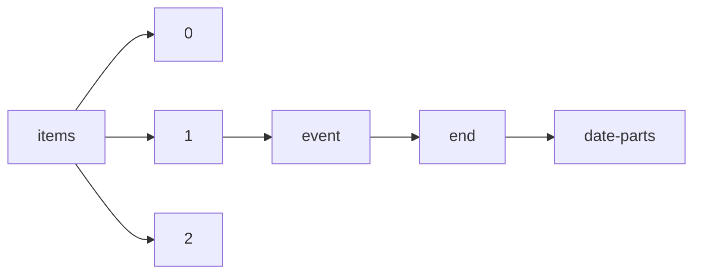

!!! warning "This document is not official Crossref documentation"
# Date-parts
PATH = items/array/event/end/date-parts(1)  
Occurs 4 429 627 times  
{ .annotate }

1. A route to an element, for example:  
   The route "items/array/event/end/date-parts" corresponds to navigating through the JSON indices as  
   ["items"][0]["event"]["end"]["date-parts"]  

## Properties of Array
See information about elements: [items/array/event/end/date-parts/array](array/index.md)  
Distribution of lengths:  

| **Row** | **Length** `Any` | **Count** `Int64` |
|--------:|--------------------:|---------------------:|
| **1**   | 1                   | 4 429 627            |

