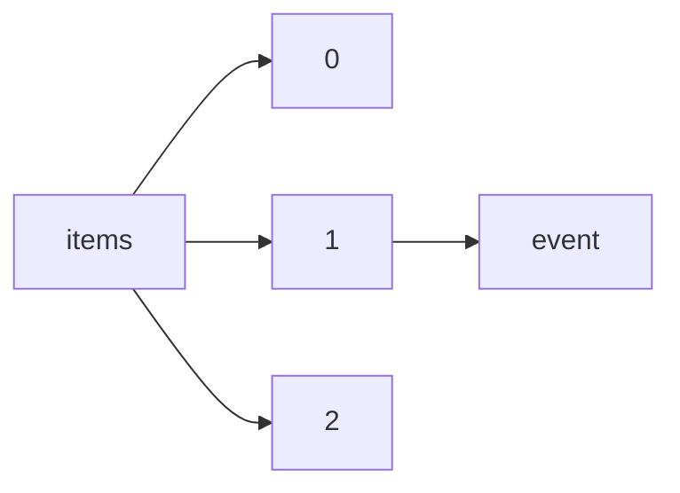

!!! warning "This document is not official Crossref documentation"
# Event
PATH = items/array/event(1)  
Occurs 7 709 289 times  
{ .annotate }

1. A route to an element, for example:  
   The route "items/array/event" corresponds to navigating through the JSON indices as  
   ["items"][0]["event"]  

## Acronym
See more information: [items/array/event/acronym](acronym/index.md)  
Occurs 2 324 307 timess  
Unique values: > 999  

!!! note "Due to current limitations, only the first 1,000 unique values are counted."

| **Row** | **Value** `String` | **Count** `Int64` |
|--------:|----------------------:|---------------------:|
| **1**   | ANNUAL                | 43 451               |
| **2**   | GMDMEETING            | 19 858               |
| **3**   | FiO                   | 13 298               |
| **4**   | OFC                   | 12 418               |
| **5**   | CLEO\_SI              | 9 181                |
| **6**   | OAM                   | 8 910                |
| **7**   | CLEO\_AT              | 7 345                |
| **8**   | ICES                  | 5 717                |
| **9**   | ice2016               | 5 658                |
| **10**  | CLEO                  | 5 212                |
| ... | ... | ... |

## End
See more information: [items/array/event/end](end/index.md)  
Occurs 4 429 627 timess  

## Location
See more information: [items/array/event/location](location/index.md)  
Occurs 6 855 780 timess  
Unique values: > 999  

!!! note "Due to current limitations, only the first 1,000 unique values are counted."

| **Row** | **Value** `String`  | **Count** `Int64` |
|--------:|-----------------------:|---------------------:|
| **1**   | Beijing, China         | 123 833              |
| **2**   | Shanghai, China        | 77 811               |
| **3**   | Wuhan, China           | 50 402               |
| **4**   | San Diego, CA, USA     | 48 746               |
| **5**   | Chengdu, China         | 48 692               |
| **6**   | San Diego, CA          | 47 030               |
| **7**   | San Francisco, CA, USA | 45 919               |
| **8**   | Singapore              | 43 093               |
| **9**   | San Jose, CA           | 41 889               |
| **10**  | Washington, DC, USA    | 41 463               |
| ... | ... | ... |

## Name
See more information: [items/array/event/name](name/index.md)  
Occurs 7 709 289 timess  
Unique values: > 999  

!!! note "Due to current limitations, only the first 1,000 unique values are counted."

| **Row** | **Value** `String`                          | **Count** `Int64` |
|--------:|-----------------------------------------------:|---------------------:|
| **1**   | Offshore Technology Conference                 | 13 739               |
| **2**   | SPE Annual Technical Conference and Exhibition | 13 587               |
| **3**   | Frontiers in Optics                            | 13 211               |
| **4**   | Optical Fiber Communication Conference         | 12 325               |
| **5**   | SPIE Astronomical Telescopes + Instrumentation | 11 458               |
| **6**   | SPIE Optical Engineering + Applications        | 10 116               |
| **7**   | Pre-1964 SAE Technical Papers                  | 9 782                |
| **8**   | CLEO: Science and Innovations                  | 9 128                |
| **9**   | SPIE Defense, Security, and Sensing            | 8 923                |
| **10**  | OSA Annual Meeting                             | 8 825                |
| ... | ... | ... |

## Number
See more information: [items/array/event/number](number/index.md)  
Occurs 358 619 timess  
Unique values: 380  

| **Row** | **Value** `String` | **Count** `Int64` |
|--------:|----------------------:|---------------------:|
| **1**   | 1                     | 24 973               |
| **2**   | 01                    | 19 110               |
| **3**   | 2                     | 13 926               |
| **4**   | 3                     | 11 604               |
| **5**   | 7                     | 11 556               |
| **6**   | 5                     | 11 476               |
| **7**   | 4                     | 10 593               |
| **8**   | 9                     | 10 576               |
| **9**   | 11                    | 10 071               |
| **10**  | 8                     | 9 729                |
| ... | ... | ... |

## Sponsor
See more information: [items/array/event/sponsor](sponsor/index.md)  
Occurs 898 932 timess  

| **Row** | **Length** `Any` | **Count** `Int64` |
|--------:|--------------------:|---------------------:|
| **1**   | 1                   | 672 173              |
| **2**   | 2                   | 134 809              |
| **3**   | 3                   | 48 169               |
| **4**   | 4                   | 16 501               |
| **5**   | 5                   | 6 996                |
| **6**   | 6                   | 9 621                |
| **7**   | 7                   | 3 398                |
| **8**   | 8                   | 2 744                |
| **9**   | 9                   | 2 942                |
| **10**  | 10                  | 1 579                |

## Start
See more information: [items/array/event/start](start/index.md)  
Occurs 4 633 262 timess  

## Theme
See more information: [items/array/event/theme](theme/index.md)  
Occurs 117 880 timess  
Unique values: > 999  

!!! note "Due to current limitations, only the first 1,000 unique values are counted."

| **Row** | **Value** `String`                                                                     | **Count** `Int64` |
|--------:|------------------------------------------------------------------------------------------:|---------------------:|
| **1**   | Computer Aided Architectural Design                                                       | 7 374                |
| **2**   | Artificial Intelligence                                                                   | 5 216                |
| **3**   | Machine Vision, Image Processing & Pattern Recognition                                    | 3 019                |
| **4**   | Computational Methods in Applied Sciences and Engineering                                 | 2 818                |
| **5**   | Real Estate                                                                               | 2 747                |
| **6**   | Science and Technology of Solid-State Sensors, Actuators, and Microsystems                | 1 488                |
| **7**   | Oral Presentations                                                                        | 1 431                |
| **8**   | Forschung heute – Zukunft morgen                                                          | 1 312                |
| **9**   | Design, automation, and test                                                              | 1 150                |
| **10**  | Deutsche Gesellschaft für Hals-Nasen-Ohren-Heilkunde, Kopf- und Hals-Chirurgie e.V., Bonn | 986                  |
| ... | ... | ... |

