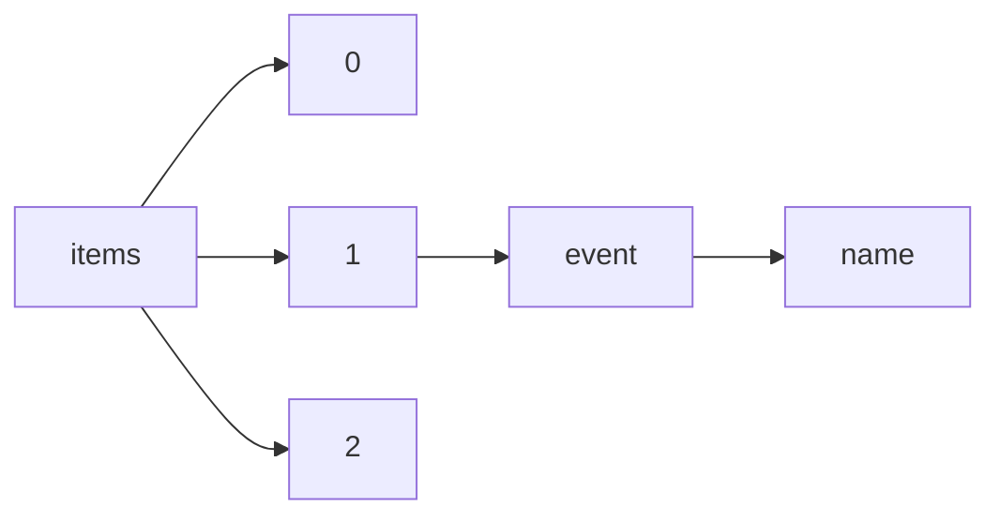

!!! warning "This document is not official Crossref documentation"
# Name
PATH = items/array/event/name(1)  
Occurs 7 709 289 times  
Unique values: > 999  
{ .annotate }

1. A route to an element, for example:  
   The route "items/array/event/name" corresponds to navigating through the JSON indices as  
   ["items"][0]["event"]["name"]  

!!! note "Due to current limitations, only the first 1,000 unique values are counted."

| **Row** | **Value** `String`                                                                                | **Count** `Int64` |
|--------:|-----------------------------------------------------------------------------------------------------:|---------------------:|
| **1**   | Offshore Technology Conference                                                                       | 13 739               |
| **2**   | SPE Annual Technical Conference and Exhibition                                                       | 13 587               |
| **3**   | Frontiers in Optics                                                                                  | 13 211               |
| **4**   | Optical Fiber Communication Conference                                                               | 12 325               |
| **5**   | SPIE Astronomical Telescopes + Instrumentation                                                       | 11 458               |
| **6**   | SPIE Optical Engineering + Applications                                                              | 10 116               |
| **7**   | Pre-1964 SAE Technical Papers                                                                        | 9 782                |
| **8**   | CLEO: Science and Innovations                                                                        | 9 128                |
| **9**   | SPIE Defense, Security, and Sensing                                                                  | 8 923                |
| **10**  | OSA Annual Meeting                                                                                   | 8 825                |
| **11**  | SPIE Proceedings                                                                                     | 8 187                |
| **12**  | International Congress &  Exposition                                                                 | 7 892                |
| **13**  | SPIE Medical Imaging                                                                                 | 7 613                |
| **14**  | SPIE BiOS                                                                                            | 7 501                |
| **15**  | CLEO: Applications and Technology                                                                    | 7 266                |
| **16**  | American Thoracic Society 2020 International Conference, May 15-20, 2020 - Philadelphia, PA          | 7 159                |
| **17**  | International Petroleum Technology Conference                                                        | 6 708                |
| **18**  | American Thoracic Society 2019 International Conference, May 17-22, 2019 - Dallas, TX                | 6 669                |
| **19**  | SPIE OPTO                                                                                            | 6 531                |
| **20**  | American Thoracic Society 2012 International Conference, May 18-23, 2012 • San Francisco, California | 6 201                |
| **21**  | American Thoracic Society 2010 International Conference, May 14-19, 2010 • New Orleans               | 6 044                |
| **22**  | International Symposium on Optical Science and Technology                                            | 5 747                |
| **23**  | American Thoracic Society 2011 International Conference, May 13-18, 2011 • Denver Colorado           | 5 718                |
| **24**  | 2016 International Congress of Entomology                                                            | 5 658                |
| **25**  | American Thoracic Society 2009 International Conference, May 15-20, 2009 • San Diego, California     | 5 600                |
| **26**  | Asia Communications and Photonics Conference                                                         | 5 597                |
| **27**  | SPIE Smart Structures and Materials + Nondestructive Evaluation and Health Monitoring                | 5 566                |
| **28**  | SAE International Congress and Exposition                                                            | 5 278                |
| **29**  | Conference on Lasers and Electro-Optics                                                              | 5 212                |
| **30**  | 2020 AERA Annual Meeting                                                                             | 5 087                |
| **31**  | GSA Annual Meeting in Seattle, Washington, USA - 2017                                                | 4 814                |
| **32**  | Hawaii International Conference on System Sciences                                                   | 4 806                |
| **33**  | American Thoracic Society 2022 International Conference, May 13-18, 2022 - San Francisco, CA         | 4 754                |
| **34**  | IEEE International Conference on Acoustics, Speech, and Signal Processing                            | 4 740                |
| **35**  | IS&T/SPIE Electronic Imaging                                                                         | 4 648                |
| **36**  | GSA Annual Meeting in Denver, Colorado, USA - 2016                                                   | 4 614                |
| **37**  | International Conference On Environmental Systems                                                    | 4 464                |
| **38**  | SPIE Advanced Lithography                                                                            | 4 375                |
| **39**  | ERS International Congress 2019 abstracts                                                            | 4 284                |
| **40**  | Annual European Congress of Rheumatology, EULAR 2018, Amsterdam, 13–16 June 2018                     | 4 279                |
| **41**  | ERS International Congress 2018 abstracts                                                            | 4 258                |
| **42**  | CLEO: QELS\_Fundamental Science                                                                      | 4 226                |
| **43**  | SPIE's International Symposium on Optical Science, Engineering, and Instrumentation                  | 4 225                |
| **44**  | 2019 AERA Annual Meeting                                                                             | 4 178                |
| **45**  | Annual European Congress of Rheumatology, 14–17 June, 2017                                           | 4 108                |
| **46**  | 2022 AERA Annual Meeting                                                                             | 4 062                |
| **47**  | ERS International Congress 2020 abstracts                                                            | 4 050                |
| **48**  | American Thoracic Society 2021 International Conference, May 14-19, 2021 - San Diego, CA             | 4 047                |
| **49**  | SPIE LASE                                                                                            | 3 954                |
| **50**  | ERS International Congress 2016 abstracts                                                            | 3 938                |
| **51**  | International Technology, Education and Development Conference                                       | 3 934                |
| **52**  | 2021 AERA Annual Meeting                                                                             | 3 911                |
| **53**  | Annual European Congress of Rheumatology, EULAR 2019, Madrid, 12–15 June 2019                        | 3 894                |
| **54**  | ERS International Congress 2017 abstracts                                                            | 3 800                |
| **55**  | Annual Congress 2015                                                                                 | 3 744                |
| **56**  | Advanced Solid State Lasers                                                                          | 3 673                |
| **57**  | SPIE Defense + Security                                                                              | 3 636                |
| **58**  | Abu Dhabi International Petroleum Exhibition & Conference                                            | 3 630                |
| **59**  | GSA Annual Meeting in Phoenix, Arizona, USA - 2019                                                   | 3 548                |
| **60**  | GSA Annual Meeting in Indianapolis, Indiana, USA - 2018                                              | 3 518                |
| **61**  | SAE World Congress &  Exhibition                                                                     | 3 479                |
| **62**  | ERS International Congress 2022 abstracts                                                            | 3 414                |
| **63**  | SPIE Photonics Europe                                                                                | 3 306                |
| **64**  | GSA Connects 2022 meeting in Denver, Colorado                                                        | 3 255                |
| **65**  | Defense and Security Symposium                                                                       | 3 232                |
| **66**  | Defense and Security                                                                                 | 3 218                |
| **67**  | ERS International Congress 2021 abstracts                                                            | 3 170                |
| **68**  | Goldschmidt2020                                                                                      | 3 165                |
| **69**  | Medical Imaging                                                                                      | 3 140                |
| **70**  | 2008 4th International Conference on Wireless Communications, Networking and Mobile Computing (WiCOM | 3 055                |
| **71**  | ТЕНДЕНЦИИ РАЗВИТИЯ НАУКИ И ОБРАЗОВАНИЯ                                                               | 2 894                |
| **72**  | International Conference on Education and New Learning Technologies                                  | 2 822                |
| **73**  | GSA 2020 Connects Online                                                                             | 2 785                |
| **74**  | International Conference on Ultrafast Phenomena                                                      | 2 774                |
| **75**  | AIAA SCITECH 2022 Forum                                                                              | 2 693                |
| **76**  | AIAA SCITECH 2023 Forum                                                                              | 2 662                |
| **77**  | Goldschmidt2021                                                                                      | 2 639                |
| **78**  | Optics & Photonics 2005                                                                              | 2 629                |
| **79**  | GSA Connects 2021 in Portland, Oregon                                                                | 2 574                |
| **80**  | Astronomical Telescopes and Instrumentation                                                          | 2 571                |
| **81**  | WCX SAE World Congress Experience                                                                    | 2 566                |
| **82**  | Optical Engineering + Applications                                                                   | 2 560                |
| **83**  | Unconventional Resources Technology Conference                                                       | 2 534                |
| **84**  | SPIE Remote Sensing                                                                                  | 2 423                |
| **85**  | Proceedings of the Annual International Conference of the IEEE Engineering in Medicine and Biology S | 2 366                |
| **86**  | Aerospace/Defense Sensing and Controls                                                               | 2 359                |
| **87**  | AIAA Scitech 2020 Forum                                                                              | 2 334                |
| **88**  | 18th International Multidisciplinary Scientific GeoConference SGEM2018                               | 2 330                |
| **89**  | Remote Sensing                                                                                       | 2 322                |
| **90**  | AIAA Guidance, Navigation, and Control Conference                                                    | 2 318                |
| **91**  | Optical Science and Technology, SPIE's 48th Annual Meeting                                           | 2 302                |
| **92**  | International Kimberlite Conference                                                                  | 2 297                |
| **93**  | AIAA Scitech 2019 Forum                                                                              | 2 284                |
| **94**  | 2010 International Conference on Computer Application and System Modeling (ICCASM 2010)              | 2 282                |
| **95**  | SPIE NanoScience + Engineering                                                                       | 2 267                |
| **96**  | Photonics Europe                                                                                     | 2 259                |
| **97**  | 2011 International Conference on E-Business and E-Government (ICEE)                                  | 2 238                |
| **98**  | 17th International Multidisciplinary Scientific GeoConference SGEM2017                               | 2 198                |
| **99**  | IGARSS 2018 - 2018 IEEE International Geoscience and Remote Sensing Symposium                        | 2 168                |
| **100** | Goldschmidt2022                                                                                      | 2 160                |
| **101** | Optical Science, Engineering and Instrumentation '97                                                 | 2 139                |
| **102** | The European Conference on Lasers and Electro-Optics                                                 | 2 130                |
| **103** | 2006 6th World Congress on Intelligent Control and Automation                                        | 2 129                |
| **104** | MTT-S International Microwave Symposium Digest                                                       | 2 118                |
| **105** | XX Congresso Brasileiro de Engenharia Química                                                        | 2 104                |
| **106** | SPE Russian Petroleum Technology Conference                                                          | 2 077                |
| **107** | 2011 International Conference on Remote Sensing, Environment and Transportation Engineering (RSETE)  | 2 063                |
| **108** | AIAA Guidance, Navigation, and Control Conference and Exhibit                                        | 1 979                |
| **109** | 2022 IEEE/CVF Conference on Computer Vision and Pattern Recognition (CVPR)                           | 1 976                |
| **110** | 2015 37th Annual International Conference of the IEEE Engineering in Medicine and Biology Society (E | 1 938                |
| **111** | International Conference on Computer Vision Theory and Applications                                  | 1 906                |
| **112** | 2011 33rd Annual International Conference of the IEEE Engineering in Medicine and Biology Society    | 1 902                |
| **113** | SPIE's 1996 International Symposium on Optical Science, Engineering, and Instrumentation             | 1 899                |
| **114** | 2009 International Conference on Management and Service Science (MASS)                               | 1 876                |
| **115** | Smart Structures and Materials                                                                       | 1 876                |
| **116** | 2005 IEEE Engineering in Medicine and Biology 27th Annual Conference                                 | 1 873                |
| **117** | IGARSS 2019 - 2019 IEEE International Geoscience and Remote Sensing Symposium                        | 1 853                |
| **118** | 2013 35th Annual International Conference of the IEEE Engineering in Medicine and Biology Society (E | 1 848                |
| **119** | GLOBECOM 2015 - 2015 IEEE Global Communications Conference                                           | 1 845                |
| **120** | IGARSS 2022 - 2022 IEEE International Geoscience and Remote Sensing Symposium                        | 1 844                |
| **121** | SPIE's 1995 International Symposium on Optical Science, Engineering, and Instrumentation             | 1 840                |
| **122** | Energy Society General Meeting                                                                       | 1 840                |
| **123** | Optical Science and Technology, the SPIE 49th Annual Meeting                                         | 1 826                |
| **124** | 2008 7th World Congress on Intelligent Control and Automation                                        | 1 825                |
| **125** | IGARSS 2016 - 2016 IEEE International Geoscience and Remote Sensing Symposium                        | 1 821                |
| **126** | IGARSS 2021 - 2021 IEEE International Geoscience and Remote Sensing Symposium                        | 1 816                |
| **127** | ICASSP 2022 - 2022 IEEE International Conference on Acoustics, Speech and Signal Processing (ICASSP) | 1 807                |
| **128** | 2011 Second International Conference on Mechanic Automation and Control Engineering (MACE)           | 1 800                |
| **129** | 2017 36th Chinese Control Conference (CCC)                                                           | 1 795                |
| **130** | 13th International Conference on Education and New Learning Technologies                             | 1 776                |
| **131** | IGARSS 2012 - 2012 IEEE International Geoscience and Remote Sensing Symposium                        | 1 774                |
| **132** | 32nd Triennial Congress of the International Commission on Occupational Health (ICOH), Dublin, Irela | 1 773                |
| **133** | International Conference on Image Processing                                                         | 1 768                |
| **134** | 2016 35th Chinese Control Conference (CCC)                                                           | 1 763                |
| **135** | XIth International Congress on Thrombosis and Haemostasis                                            | 1 760                |
| **136** | AIAA Scitech 2021 Forum                                                                              | 1 756                |
| **137** | 2011 International Conference on Electric Technology and Civil Engineering (ICETCE)                  | 1 754                |
| **138** | 2010 2nd International Conference on Information Science and Engineering (ICISE)                     | 1 739                |
| **139** | 2009 Annual International Conference of the IEEE Engineering in Medicine and Biology Society         | 1 728                |
| **140** | 2014 36th Annual International Conference of the IEEE Engineering in Medicine and Biology Society (E | 1 721                |
| **141** | 19th SGEM International Multidisciplinary Scientific GeoConference EXPO Proceedings                  | 1 717                |
| **142** | 2015 ASEE Annual Conference and Exposition                                                           | 1 715                |
| **143** | ASME 2000 International Mechanical Engineering Congress and Exposition                               | 1 713                |
| **144** | 2011 International Conference on Electrical and Control Engineering (ICECE)                          | 1 709                |
| **145** | 2020 ASEE Virtual Annual Conference Content Access                                                   | 1 706                |
| **146** | 2007 29th Annual International Conference of the IEEE Engineering in Medicine and Biology Society    | 1 705                |
| **147** | Conference Proceedings. Annual International Conference of the IEEE Engineering in Medicine and Biol | 1 702                |
| **148** | ICASSP 2021 - 2021 IEEE International Conference on Acoustics, Speech and Signal Processing (ICASSP) | 1 700                |
| **149** | 2011 ASEE Annual Conference & Exposition                                                             | 1 693                |
| **150** | 2019 ASEE Annual Conference & Exposition                                                             | 1 687                |
| **151** | Lasers and Applications in Science and Engineering                                                   | 1 686                |
| **152** | IEEE International Conference on Communications                                                      | 1 685                |
| **153** | ICASSP 2020 - 2020 IEEE International Conference on Acoustics, Speech and Signal Processing (ICASSP) | 1 685                |
| **154** | ICASSP 2019 - 2019 IEEE International Conference on Acoustics, Speech and Signal Processing (ICASSP) | 1 683                |
| **155** | ASME 2005 International Mechanical Engineering Congress and Exposition                               | 1 682                |
| **156** | 2016 Progress in Electromagnetic Research Symposium (PIERS)                                          | 1 681                |
| **157** | ICASSP 2014 - 2014 IEEE International Conference on Acoustics, Speech and Signal Processing (ICASSP) | 1 670                |
| **158** | 2016 ASEE Annual Conference & Exposition                                                             | 1 669                |
| **159** | 2017 ASEE Annual Conference & Exposition                                                             | 1 667                |
| **160** | Asia-Pacific Optical Communications                                                                  | 1 665                |
| **161** | 2012 34th Annual International Conference of the IEEE Engineering in Medicine and Biology Society (E | 1 664                |
| **162** | 2018 37th Chinese Control Conference (CCC)                                                           | 1 655                |
| **163** | 12th annual International Conference of Education, Research and Innovation                           | 1 651                |
| **164** | 2011 International Conference on Multimedia Technology (ICMT)                                        | 1 650                |
| **165** | 2010 International Conference on Management and Service Science (MASS 2010)                          | 1 645                |
| **166** | 2018 ASEE Annual Conference & Exposition                                                             | 1 641                |
| **167** | 10th International Conference on Education and New Learning Technologies                             | 1 638                |
| **168** | ASME 2004 International Mechanical Engineering Congress and Exposition                               | 1 631                |
| **169** | 5th SGEM International Multidisciplinary Scientific Conferences on SOCIAL SCIENCES and ARTS SGEM2018 | 1 631                |
| **170** | 2019 Conference on Lasers and Electro-Optics Europe & European Quantum Electronics Conference (CLEO/ | 1 626                |
| **171** | 2010 32nd Annual International Conference of the IEEE Engineering in Medicine and Biology Society (E | 1 600                |
| **172** | 2007 Annual Conference & Exposition                                                                  | 1 585                |
| **173** | 2016 38th Annual International Conference of the IEEE Engineering in Medicine and Biology Society (E | 1 581                |
| **174** | 2005 IEEE International Symposium on Circuits and Systems                                            | 1 569                |
| **175** | 2021 IEEE/CVF International Conference on Computer Vision (ICCV)                                     | 1 565                |
| **176** | 2010 International Conference on Mechanic Automation and Control Engineering (MACE)                  | 1 565                |
| **177** | ASME 2012 International Mechanical Engineering Congress and Exposition                               | 1 558                |
| **178** | 15th International Technology, Education and Development Conference                                  | 1 558                |
| **179** | ICASSP 2013 - 2013 IEEE International Conference on Acoustics, Speech and Signal Processing (ICASSP) | 1 557                |
| **180** | 2014 33rd Chinese Control Conference (CCC)                                                           | 1 557                |
| **181** | The 2006 IEEE International Joint Conference on Neural Network Proceedings                           | 1 554                |
| **182** | 14th International Conference on Education and New Learning Technologies                             | 1 551                |
| **183** | SPIE Optics + Photonics                                                                              | 1 549                |
| **184** | 11th International Conference on Education and New Learning Technologies                             | 1 547                |
| **185** | ASME 2002 International Mechanical Engineering Congress and Exposition                               | 1 547                |
| **186** | ASME 2013 International Mechanical Engineering Congress and Exposition                               | 1 537                |
| **187** | 14th annual International Conference of Education, Research and Innovation                           | 1 529                |
| **188** | 13th International Technology, Education and Development Conference                                  | 1 519                |
| **189** | IECON 2017 - 43rd Annual Conference of the IEEE Industrial Electronics Society                       | 1 509                |
| **190** | IGARSS 2020 - 2020 IEEE International Geoscience and Remote Sensing Symposium                        | 1 509                |
| **191** | 2012 ASEE Annual Conference & Exposition                                                             | 1 506                |
| **192** | 2008 30th Annual International Conference of the IEEE Engineering in Medicine and Biology Society    | 1 503                |
| **193** | 2011 International Conference on Electric Information and Control Engineering (ICEICE)               | 1 502                |
| **194** | 11th annual International Conference of Education, Research and Innovation                           | 1 497                |
| **195** | Photonics Asia 2004                                                                                  | 1 494                |
| **196** | Biomedical Optics                                                                                    | 1 489                |
| **197** | 16th International Technology, Education and Development Conference                                  | 1 487                |
| **198** | ASME 2011 International Mechanical Engineering Congress and Exposition                               | 1 486                |
| **199** | XXIV Congresso de Iniciação Científica da UNICAMP - 2016                                             | 1 479                |
| **200** | 15th International Multidisciplinary Scientific GeoConference SGEM2015                               | 1 477                |
| **201** | 2020 IEEE/CVF Conference on Computer Vision and Pattern Recognition (CVPR)                           | 1 474                |
| **202** | 2020 42nd Annual International Conference of the IEEE Engineering in Medicine and Biology Society (E | 1 472                |
| **203** | 12th International Technology, Education and Development Conference                                  | 1 470                |
| **204** | ICASSP 2011 - 2011 IEEE International Conference on Acoustics, Speech and Signal Processing (ICASSP) | 1 465                |
| **205** | 2006 Conference on Lasers and Electro-Optics and 2006 Quantum Electronics and Laser Science Conferen | 1 456                |
| **206** | 2021 43rd Annual International Conference of the IEEE Engineering in Medicine & Biology Society (EMB | 1 442                |
| **207** | 2008 International Conference on Computer Science and Software Engineering                           | 1 441                |
| **208** | Optical Interference Coatings                                                                        | 1 439                |
| **209** | 2006 Annual Conference & Exposition                                                                  | 1 435                |
| **210** | Advanced Solid-State Photonics                                                                       | 1 433                |
| **211** | 2006 IEEE International Symposium on Circuits and Systems                                            | 1 432                |
| **212** | 2011 International Conference on Management and Service Science (MASS 2011)                          | 1 431                |
| **213** | 2010 4th International Conference on Bioinformatics and Biomedical Engineering (iCBBE)               | 1 427                |
| **214** | 2017 Chinese Automation Congress (CAC)                                                               | 1 423                |
| **215** | 17th International Technology, Education and Development Conference                                  | 1 423                |
| **216** | 2013 Conference on Lasers & Electro-Optics Europe & International Quantum Electronics Conference CLE | 1 423                |
| **217** | SITC 37th Annual Meeting (SITC 2022) Abstracts                                                       | 1 422                |
| **218** | 2017 IEEE International Ultrasonics Symposium (IUS)                                                  | 1 421                |
| **219** | 2021 IEEE/CVF Conference on Computer Vision and Pattern Recognition (CVPR)                           | 1 418                |
| **220** | 14th International Technology, Education and Development Conference                                  | 1 415                |
| **221** | 1992 14th Annual International Conference of the IEEE Engineering in Medicine and Biology Society    | 1 410                |
| **222** | 13th annual International Conference of Education, Research and Innovation                           | 1 410                |
| **223** | International Conference on Acoustics, Speech, and Signal Processing                                 | 1 409                |
| **224** | IEEE International Conference on Robotics and Automation                                             | 1 406                |
| **225** | ICA 2013 Montreal                                                                                    | 1 403                |
| **226** | 2010 3rd IEEE International Conference on Computer Science and Information Technology (ICCSIT 2010)  | 1 401                |
| **227** | 2020 25th International Conference on Pattern Recognition (ICPR)                                     | 1 392                |
| **228** | San Diego '92                                                                                        | 1 388                |
| **229** | ASME 2006 International Mechanical Engineering Congress and Exposition                               | 1 387                |
| **230** | 2004 Annual Conference                                                                               | 1 386                |
| **231** | 2015 34th Chinese Control Conference (CCC)                                                           | 1 386                |
| **232** | 2005 IEEE International Geoscience and Remote Sensing Symposium, 2005. IGARSS '05.                   | 1 385                |
| **233** | 2014 ASEE Annual Conference & Exposition                                                             | 1 384                |
| **234** | 2018 40th Annual International Conference of the IEEE Engineering in Medicine and Biology Society (E | 1 381                |
| **235** | 2013 ASEE Annual Conference & Exposition                                                             | 1 372                |
| **236** | International Fuels &  Lubricants Meeting &  Exposition                                              | 1 368                |
| **237** | SPIE's 1994 International Symposium on Optics, Imaging, and Instrumentation                          | 1 367                |
| **238** | 2019 Chinese Control Conference (CCC)                                                                | 1 363                |
| **239** | AeroSense 2000                                                                                       | 1 360                |
| **240** | OE/LASE '94                                                                                          | 1 355                |
| **241** | 2010 International Conference on E-Product E-Service and E-Entertainment (ICEEE 2010)                | 1 353                |
| **242** | 2017 29th Chinese Control And Decision Conference (CCDC)                                             | 1 350                |
| **243** | SAE 2005 World Congress &  Exhibition                                                                | 1 347                |
| **244** | European Conference on Biomedical Optics                                                             | 1 347                |
| **245** | Integrated Photonics Research                                                                        | 1 345                |
| **246** | 2007 IEEE Antennas and Propagation Society International Symposium                                   | 1 344                |
| **247** | 2005 Annual Conference                                                                               | 1 341                |
| **248** | (ICASSP '05). IEEE International Conference on Acoustics, Speech, and Signal Processing, 2005.       | 1 336                |
| **249** | 2008 Conference on Lasers and Electro-Optics (CLEO)                                                  | 1 333                |
| **250** | 2009 5th International Conference on Wireless Communications, Networking and Mobile Computing (WiCOM | 1 327                |
| **251** | 2020 Chinese Automation Congress (CAC)                                                               | 1 326                |
| **252** | SPIE's 1993 International Symposium on Optics, Imaging, and Instrumentation                          | 1 317                |
| **253** | SAE 2006 World Congress &  Exhibition                                                                | 1 315                |
| **254** | 2021 China Automation Congress (CAC)                                                                 | 1 314                |
| **255** | 2015 IEEE International Magnetics Conference (INTERMAG)                                              | 1 312                |
| **256** | 2002 Annual Conference                                                                               | 1 310                |
| **257** | IEEE International Symposium on Circuits and Systems                                                 | 1 310                |
| **258** | Qatar Foundation Annual Research Conference Proceedings                                              | 1 308                |
| **259** | IGARSS 2014 - 2014 IEEE International Geoscience and Remote Sensing Symposium                        | 1 305                |
| **260** | CLEO 2007                                                                                            | 1 304                |
| **261** | National Fiber Optic Engineers Conference                                                            | 1 303                |
| **262** | 2005 Particle Accelerator Conference                                                                 | 1 301                |
| **263** | 2008 Annual Conference & Exposition                                                                  | 1 299                |
| **264** | 47th AIAA Aerospace Sciences Meeting including The New Horizons Forum and Aerospace Exposition       | 1 299                |
| **265** | Abstract- und Posterband – 89. Jahresversammlung der Deutschen Gesellschaft für HNO-Heilkunde, Kopf- | 1 296                |
| **266** | IECON 2013 - 39th Annual Conference of the IEEE Industrial Electronics Society                       | 1 296                |
| **267** | 44th IEEE Conference on Decision and Control                                                         | 1 296                |
| **268** | AERA 2022                                                                                            | 1 287                |
| **269** | ASME 2001 International Mechanical Engineering Congress and Exposition                               | 1 281                |
| **270** | Asia Communications and Photonics Conference and Exhibition                                          | 1 278                |
| **271** | GLOBECOM 2010 - 2010 IEEE Global Communications Conference                                           | 1 272                |
| **272** | AeroSense 2002                                                                                       | 1 270                |
| **273** | ICC 2012 - 2012 IEEE International Conference on Communications                                      | 1 263                |
| **274** | 50th AIAA Aerospace Sciences Meeting including the New Horizons Forum and Aerospace Exposition       | 1 260                |
| **275** | 2010 Annual Conference & Exposition                                                                  | 1 260                |
| **276** | ASME 1999 International Mechanical Engineering Congress and Exposition                               | 1 260                |
| **277** | 2005 IEEE Antennas and Propagation Society International Symposium                                   | 1 259                |
| **278** | 2009 Annual Conference & Exposition                                                                  | 1 258                |
| **279** | 2021 IEEE International Conference on Robotics and Automation (ICRA)                                 | 1 257                |
| **280** | AeroSense 2003                                                                                       | 1 255                |
| **281** | 2019 IEEE/CVF Conference on Computer Vision and Pattern Recognition (CVPR)                           | 1 249                |
| **282** | IEEE International Symposium on Information Theory                                                   | 1 249                |
| **283** | 44th AIAA Aerospace Sciences Meeting and Exhibit                                                     | 1 248                |
| **284** | ESGO Annual Meeting Abstracts                                                                        | 1 245                |
| **285** | Abstract- und Posterband – 91. Jahresversammlung der Deutschen Gesellschaft für HNO-Heilkunde, Kopf- | 1 243                |
| **286** | 2012 IEEE 51st Annual Conference on Decision and Control (CDC)                                       | 1 243                |
| **287** | XXV Congresso de Iniciação Cientifica da Unicamp                                                     | 1 238                |
| **288** | 2006 SICE-ICASE International Joint Conference                                                       | 1 236                |
| **289** | IGARSS 2008 - 2008 IEEE International Geoscience and Remote Sensing Symposium                        | 1 233                |
| **290** | ICASSP 2018 - 2018 IEEE International Conference on Acoustics, Speech and Signal Processing (ICASSP) | 1 233                |
| **291** | ICASSP 2008 - 2008 IEEE International Conference on Acoustics, Speech and Signal Processing          | 1 230                |
| **292** | 2017 IEEE International Symposium on Antennas and Propagation & USNC/URSI National Radio Science Mee | 1 225                |
| **293** | 12th European Quantum Electronics Conference CLEO EUROPE/EQEC                                        | 1 225                |
| **294** | 2011 50th IEEE Conference on Decision and Control and European Control Conference (CDC-ECC 2011)     | 1 224                |
| **295** | 2010 49th IEEE Conference on Decision and Control (CDC)                                              | 1 224                |
| **296** | 2004 IEEE International Conference on Acoustics, Speech, and Signal Processing                       | 1 221                |
| **297** | 2014 IEEE International Conference on Image Processing (ICIP)                                        | 1 219                |
| **298** | ASME 1998 International Mechanical Engineering Congress and Exposition                               | 1 218                |
| **299** | 2003 Annual Conference                                                                               | 1 218                |
| **300** | 24th ABCM International Congress of Mechanical Engineering                                           | 1 217                |
| **301** | ASME 2007 International Design Engineering Technical Conferences and Computers and Information in En | 1 217                |
| **302** | ASME 2007 International Mechanical Engineering Congress and Exposition                               | 1 216                |
| **303** | 11th European Quantum Electronics Conference (CLEO/EQEC)                                             | 1 216                |
| **304** | 2010 8th World Congress on Intelligent Control and Automation (WCICA 2010)                           | 1 215                |
| **305** | 2017 IEEE International Conference on Acoustics, Speech and Signal Processing (ICASSP)               | 1 211                |
| **306** | Canadian International Petroleum Conference                                                          | 1 211                |
| **307** | IEEE International IEEE International IEEE International Geoscience and Remote Sensing Symposium, 20 | 1 206                |
| **308** | 2013 IEEE 52nd Annual Conference on Decision and Control (CDC)                                       | 1 204                |
| **309** | 2015 54th IEEE Conference on Decision and Control (CDC)                                              | 1 200                |
| **310** | 12th International Conference on Education and New Learning Technologies                             | 1 199                |
| **311** | 2016 IEEE 55th Conference on Decision and Control (CDC)                                              | 1 198                |
| **312** | The European Physical Society Conference on High Energy Physics                                      | 1 196                |
| **313** | SPIE Defense and Security Symposium                                                                  | 1 194                |
| **314** | 2022 China Automation Congress (CAC)                                                                 | 1 187                |
| **315** | ASME 1997 International Mechanical Engineering Congress and Exposition                               | 1 184                |
| **316** | IGARSS 2010 - 2010 IEEE International Geoscience and Remote Sensing Symposium                        | 1 184                |
| **317** | Annual European Congress of Rheumatology, Annals of the rheumatic diseases ARD July 2001             | 1 181                |
| **318** | OE/LASE '89                                                                                          | 1 180                |
| **319** | 57th International Astronautical Congress                                                            | 1 180                |
| **320** | Aerospace Technology Conference and Exposition                                                       | 1 179                |
| **321** | 2007 European Conference on Lasers and Electro-Optics and the International Quantum Electronics Conf | 1 179                |
| **322** | SPIE Sensing Technology + Applications                                                               | 1 179                |
| **323** | ASME Turbo Expo 2014: Turbine Technical Conference and Exposition                                    | 1 176                |
| **324** | Abstract- und Posterband - 93. Jahresversammlung der Deutschen Gesellschaft für HNO-Heilkunde, Kopf- | 1 173                |
| **325** | SAE 2000 World Congress                                                                              | 1 170                |
| **326** | Superalloys                                                                                          | 1 170                |
| **327** | 54th AIAA Aerospace Sciences Meeting                                                                 | 1 169                |
| **328** | 26th Annual International Conference of the IEEE Engineering in Medicine and Biology Society         | 1 166                |
| **329** | Mechanical Engineering and Information Technology (EMEIT)                                            | 1 165                |
| **330** | 2021 33rd Chinese Control and Decision Conference (CCDC)                                             | 1 164                |
| **331** | 2009 Joint 48th IEEE Conference on Decision and Control (CDC) and 28th Chinese Control Conference (C | 1 157                |
| **332** | 1993 IEEE International Symposium on Circuits and Systems                                            | 1 157                |
| **333** | 2018 IEEE International Symposium on Antennas and Propagation & USNC/URSI National Radio Science Mee | 1 157                |
| **334** | 48th AIAA Aerospace Sciences Meeting Including the New Horizons Forum and Aerospace Exposition       | 1 152                |
| **335** | 2022 IEEE/RSJ International Conference on Intelligent Robots and Systems (IROS)                      | 1 148                |
| **336** | CHI '21: CHI Conference on Human Factors in Computing Systems                                        | 1 146                |
| **337** | AeroSense '99                                                                                        | 1 145                |
| **338** | 2011 International Conference on Consumer Electronics, Communications and Networks (CECNet)          | 1 143                |
| **339** | 37th International Cosmic Ray Conference                                                             | 1 141                |
| **340** | Annual Technical Meeting                                                                             | 1 139                |
| **341** | 2009 Chinese Control and Decision Conference (CCDC)                                                  | 1 136                |
| **342** | 2007 International Conference on Wireless Communications, Networking and Mobile Computing            | 1 136                |
| **343** | 2012 IEEE Power & Energy Society General Meeting. New Energy Horizons - Opportunities and Challenges | 1 131                |
| **344** | CHI '18: CHI Conference on Human Factors in Computing Systems                                        | 1 130                |
| **345** | VIIIth International Congress on Thrombosis and Haemostasis                                          | 1 129                |
| **346** | ASME 2014 International Mechanical Engineering Congress and Exposition                               | 1 127                |
| **347** | ASME 2011 International Design Engineering Technical Conferences and Computers and Information in En | 1 125                |
| **348** | ASME 2010 International Mechanical Engineering Congress and Exposition                               | 1 124                |
| **349** | Optical Engineering and Photonics in Aerospace Sensing                                               | 1 124                |
| **350** | 2010 IEEE International Symposium Antennas and Propagation and CNC-USNC/URSI Radio Science Meeting   | 1 121                |
| **351** | ICASSP 2009 - 2009 IEEE International Conference on Acoustics, Speech and Signal Processing          | 1 115                |
| **352** | International Conference on Science and Technology of Synthetic Metals                               | 1 114                |
| **353** | 2010 17th IEEE International Conference on Image Processing (ICIP 2010)                              | 1 112                |
| **354** | 2015 IEEE International Symposium on Antennas and Propagation & USNC/URSI National Radio Science Mee | 1 111                |
| **355** | 2012 IEEE Antennas and Propagation Society International Symposium and USNC/URSI National Radio Scie | 1 111                |
| **356** | 13th International Conference on Applied Human Factors and Ergonomics (AHFE 2022)                    | 1 110                |
| **357** | Laser Science                                                                                        | 1 108                |
| **358** | 2015 27th Chinese Control and Decision Conference (CCDC)                                             | 1 108                |
| **359** | 2018 AIAA Aerospace Sciences Meeting                                                                 | 1 108                |
| **360** | 2014 11th World Congress on Intelligent Control and Automation (WCICA)                               | 1 105                |
| **361** | XXIII Congresso de Iniciação Científica da Unicamp                                                   | 1 104                |
| **362** | 2008 IEEE Nuclear Science Symposium and Medical Imaging conference (2008 NSS/MIC)                    | 1 101                |
| **363** | 2014 XXXIth URSI General Assembly and Scientific Symposium (URSI GASS)                               | 1 099                |
| **364** | 18th Annual International Conference of the IEEE Engineering in Medicine and Biology Society         | 1 099                |
| **365** | ICASSP 2015 - 2015 IEEE International Conference on Acoustics, Speech and Signal Processing (ICASSP) | 1 093                |
| **366** | 2019 41st Annual International Conference of the IEEE Engineering in Medicine & Biology Society (EMB | 1 090                |
| **367** | 2009 WRI World Congress on Computer Science and Information Engineering                              | 1 089                |
| **368** | SPIE's International Symposium on Optical Engineering and Photonics in Aerospace Sensing             | 1 088                |
| **369** | 2021 Conference on Lasers and Electro-Optics Europe & European Quantum Electronics Conference (CLEO/ | 1 088                |
| **370** | 2008 Chinese Control and Decision Conference (CCDC)                                                  | 1 087                |
| **371** | 2010 Sixth International Conference on Natural Computation (ICNC)                                    | 1 083                |
| **372** | 25th International Congress of Mechanical Engineering                                                | 1 080                |
| **373** | ASME Turbo Expo 2018: Turbomachinery Technical Conference and Exposition                             | 1 080                |
| **374** | IEEE 60th Vehicular Technology Conference, 2004. VTC2004-Fall. 2004                                  | 1 079                |
| **375** | San Diego, '91, San Diego, CA                                                                        | 1 079                |
| **376** | 2008 IEEE Antennas and Propagation Society International Symposium and USNC/URSI National Radio Scie | 1 078                |
| **377** | SEG Technical Program Expanded Abstracts 2019                                                        | 1 078                |
| **378** | 2011 XXXth URSI General Assembly and Scientific Symposium                                            | 1 077                |
| **379** | SEG Technical Program Expanded Abstracts 2015                                                        | 1 075                |
| **380** | 2020 IEEE International Conference on Robotics and Automation (ICRA)                                 | 1 075                |
| **381** | 2010 6th International Conference on Wireless Communications, Networking and Mobile Computing (WiCOM | 1 075                |
| **382** | 2008 IEEE International Conference on Communications                                                 | 1 075                |
| **383** | ICASSP 2012 - 2012 IEEE International Conference on Acoustics, Speech and Signal Processing          | 1 074                |
| **384** | International Conference on Particle Accelerators                                                    | 1 073                |
| **385** | 2010 American Control Conference (ACC 2010)                                                          | 1 070                |
| **386** | 2011 International Conference on Computer Science and Service System (CSSS)                          | 1 069                |
| **387** | ASME 2016 International Mechanical Engineering Congress and Exposition                               | 1 065                |
| **388** | 82nd EAGE Annual Conference & Exhibition                                                             | 1 060                |
| **389** | Photonics Asia 2002                                                                                  | 1 059                |
| **390** | SPE Asia Pacific Oil and Gas Conference and Exhibition                                               | 1 057                |
| **391** | ASME 2008 International Mechanical Engineering Congress and Exposition                               | 1 056                |
| **392** | The International Symposium on the Analytic Hierarchy Process                                        | 1 056                |
| **393** | 2009 3rd International Conference on Bioinformatics and Biomedical Engineering (iCBBE)               | 1 056                |
| **394** | 2010 International Conference on E-Business and E-Government (ICEE)                                  | 1 054                |
| **395** | IECON 2018 - 44th Annual Conference of the IEEE Industrial Electronics Society                       | 1 053                |
| **396** | 2018 IEEE Energy Conversion Congress and Exposition (ECCE)                                           | 1 052                |
| **397** | IGARSS 2000. IEEE 2000 International Geoscience and Remote Sensing Symposium. Taking the Pulse of th | 1 052                |
| **398** | 2019 Chinese Control And Decision Conference (CCDC)                                                  | 1 052                |
| **399** | 2017 39th Annual International Conference of the IEEE Engineering in Medicine and Biology Society (E | 1 049                |
| **400** | IEEE Antennas and Propagation Society International Symposium                                        | 1 049                |
| **401** | 2006 IEEE International Symposium on Geoscience and Remote Sensing                                   | 1 047                |
| **402** | 75th EAGE Conference and Exhibition incorporating SPE EUROPEC 2013                                   | 1 046                |
| **403** | SPIE's 1995 Symposium on OE/Aerospace Sensing and Dual Use Photonics                                 | 1 046                |
| **404** | 2013 IEEE International Symposium on Antennas and Propagation & USNC/URSI National Radio Science Mee | 1 045                |
| **405** | Proceedings of 2005 International Conference on Machine Learning and Cybernetics                     | 1 042                |
| **406** | 53rd AIAA Aerospace Sciences Meeting                                                                 | 1 041                |
| **407** | 2010 20th International Conference on Pattern Recognition (ICPR)                                     | 1 041                |
| **408** | IGARSS 2013 - 2013 IEEE International Geoscience and Remote Sensing Symposium                        | 1 039                |
| **409** | 80th EAGE Conference and Exhibition 2018                                                             | 1 038                |
| **410** | 2010 Asia-Pacific Power and Energy Engineering Conference                                            | 1 037                |
| **411** | 2019 IEEE 58th Conference on Decision and Control (CDC)                                              | 1 036                |
| **412** | IEEE Symposium Conference Record Nuclear Science 2004.                                               | 1 035                |
| **413** | 2010 International Conference on Electrical and Control Engineering (ICECE)                          | 1 033                |
| **414** | 2006 IEEE International Conference on Acoustics Speed and Signal Processing                          | 1 025                |
| **415** | GLOBECOM 2009 - 2009 IEEE Global Telecommunications Conference                                       | 1 025                |
| **416** | 2019 International Conference on Robotics and Automation (ICRA)                                      | 1 024                |
| **417** | ICC 2009 - 2009 IEEE International Conference on Communications                                      | 1 024                |
| **418** | 2022 IEEE International Symposium on Antennas and Propagation and USNC-URSI Radio Science Meeting (A | 1 024                |
| **419** | IGARSS 2011 - 2011 IEEE International Geoscience and Remote Sensing Symposium                        | 1 019                |
| **420** | 35th IEEE Conference on Decision and Control                                                         | 1 019                |
| **421** | 46th AIAA Aerospace Sciences Meeting and Exhibit                                                     | 1 016                |
| **422** | WCX World Congress Experience                                                                        | 1 016                |
| **423** | Images of the Twenty-First Century. Annual International Engineering in Medicine and Biology Society | 1 015                |
| **424** | 76th EAGE Conference and Exhibition 2014                                                             | 1 015                |
| **425** | 2021 40th Chinese Control Conference (CCC)                                                           | 1 014                |
| **426** | 2018 IEEE Conference on Decision and Control (CDC)                                                   | 1 013                |
| **427** | 2011 5th International Conference on Bioinformatics and Biomedical Engineering                       | 1 013                |
| **428** | 2015 IEEE International Conference on Image Processing (ICIP)                                        | 1 012                |
| **429** | 2016 IEEE International Symposium on Antennas and Propagation & USNC/URSI National Radio Science Mee | 1 012                |
| **430** | SEG Technical Program Expanded Abstracts 2018                                                        | 1 012                |
| **431** | 2007 IEEE Particle Accelerator Conference (PAC)                                                      | 1 005                |
| **432** | SAE 2002 World Congress &  Exhibition                                                                | 1 005                |
| **433** | GLOBECOM 2022 - 2022 IEEE Global Communications Conference                                           | 1 004                |
| **434** | 1997 Particle Accelerator Conference                                                                 | 1 004                |
| **435** | IEEE International Conference on Acoustics Speech and Signal Processing ICASSP-02                    | 1 001                |
| **436** | 2007 American Control Conference                                                                     | 1 000                |
| **437** | GLOBECOM 2018 - 2018 IEEE Global Communications Conference                                           | 998                  |
| **438** | ASME 2003 International Mechanical Engineering Congress and Exposition                               | 997                  |
| **439** | OE/LASE'93: Optics, Electro-Optics, & Laser Applications in Science& Engineering                     | 993                  |
| **440** | Abu Dhabi International Petroleum Exhibition and Conference                                          | 992                  |
| **441** | International Conference on Eurasian Economies                                                       | 991                  |
| **442** | IEEE GLOBECOM 2008 - 2008 IEEE Global Telecommunications Conference                                  | 991                  |
| **443** | Proceedings of the 2004 American Control Conference                                                  | 990                  |
| **444** | 81st EAGE Conference and Exhibition 2019                                                             | 990                  |
| **445** | ICC 2014 - 2014 IEEE International Conference on Communications                                      | 989                  |
| **446** | IECON 2012 - 38th Annual Conference of IEEE Industrial Electronics                                   | 981                  |
| **447** | ASME Turbo Expo 2010: Power for Land, Sea, and Air                                                   | 980                  |
| **448** | INTERMAG Asia 2005: Digest of the IEEE International Magnetics Conference                            | 979                  |
| **449** | CHI '19: CHI Conference on Human Factors in Computing Systems                                        | 979                  |
| **450** | SEG Technical Program Expanded Abstracts 2017                                                        | 978                  |
| **451** | 2011 IEEE Global Communications Conference (GLOBECOM 2011)                                           | 977                  |
| **452** | 2018 IEEE/RSJ International Conference on Intelligent Robots and Systems (IROS)                      | 976                  |
| **453** | International Conference on Acoustics, Speech and Signal Processing (ICASSP'03)                      | 976                  |
| **454** | ASME 2021 International Mechanical Engineering Congress and Exposition                               | 974                  |
| **455** | 2011 IEEE Power & Energy Society General Meeting                                                     | 973                  |
| **456** | 2002 IEEE International Symposium on Circuits and Systems                                            | 969                  |
| **457** | ASME Turbo Expo 2015: Turbine Technical Conference and Exposition                                    | 969                  |
| **458** | 2007 46th IEEE Conference on Decision and Control                                                    | 967                  |
| **459** | 51st AIAA Aerospace Sciences Meeting including the New Horizons Forum and Aerospace Exposition       | 967                  |
| **460** | SAE 2001 World Congress                                                                              | 967                  |
| **461** | 2019 IEEE Energy Conversion Congress and Exposition (ECCE)                                           | 966                  |
| **462** | Abstract- und Posterband – 90. Jahresversammlung der Deutschen Gesellschaft für HNO-Heilkunde, Kopf- | 965                  |
| **463** | Instruments (ICEMI)                                                                                  | 964                  |
| **464** | CHI '14: CHI Conference on Human Factors in Computing Systems                                        | 964                  |
| **465** | SEG Technical Program Expanded Abstracts 2016                                                        | 963                  |
| **466** | ISCAS 2000 Geneva. 2000 IEEE International Symposium on Circuits and Systems. Emerging Technologies  | 962                  |
| **467** | 1997 IEEE International Conference on Acoustics, Speech, and Signal Processing                       | 961                  |
| **468** | IECON 2019 - 45th Annual Conference of the IEEE Industrial Electronics Society                       | 956                  |
| **469** | 2019 22nd International Conference on Electrical Machines and Systems (ICEMS)                        | 956                  |
| **470** | ICC 2019 - 2019 IEEE International Conference on Communications (ICC)                                | 955                  |
| **471** | Photonics West '96                                                                                   | 955                  |
| **472** | ESGE Days                                                                                            | 952                  |
| **473** | ICC 2013 - 2013 IEEE International Conference on Communications                                      | 950                  |
| **474** | GLOBECOM 2012 - 2012 IEEE Global Communications Conference                                           | 949                  |
| **475** | 7th Joint MMM-Intermag Conference. Abstracts                                                         | 948                  |
| **476** | CHI '20: CHI Conference on Human Factors in Computing Systems                                        | 947                  |
| **477** | 2001 23rd Annual International Conference of the IEEE Engineering n Medicine and Biology Society     | 943                  |
| **478** | Twenty-Eighth International Joint Conference on Artificial Intelligence {IJCAI-19}                   | 943                  |
| **479** | Guidance and Control Conference                                                                      | 942                  |
| **480** | 2006 IEEE International Conference on Communications                                                 | 940                  |
| **481** | 2016 American Control Conference (ACC)                                                               | 940                  |
| **482** | 2011 International Conference on Electronics, Communications and Control (ICECC)                     | 939                  |
| **483** | ASME Turbo Expo 2017: Turbomachinery Technical Conference and Exposition                             | 939                  |
| **484** | 2011 IEEE/MTT-S International Microwave Symposium - MTT 2011                                         | 937                  |
| **485** | 40th AIAA Aerospace Sciences Meeting & Exhibit                                                       | 936                  |
| **486** | CHI '15: CHI Conference on Human Factors in Computing Systems                                        | 936                  |
| **487** | 2010 IEEE/MTT-S International Microwave Symposium - MTT 2010                                         | 935                  |
| **488** | 39th Aerospace Sciences Meeting and Exhibit                                                          | 934                  |
| **489** | 2013 IEEE Power & Energy Society General Meeting                                                     | 933                  |
| **490** | 37th Aerospace Sciences Meeting and Exhibit                                                          | 933                  |
| **491** | 2013 20th IEEE International Conference on Image Processing (ICIP)                                   | 932                  |
| **492** | 2020 IEEE/RSJ International Conference on Intelligent Robots and Systems (IROS)                      | 928                  |
| **493** | 2007 IEEE International Conference on Communications                                                 | 928                  |
| **494** | IEEE Globecom 2006                                                                                   | 925                  |
| **495** | AAP National Conference & Exhibition Meeting Abstracts                                               | 923                  |
| **496** | International Heat Transfer Conference 16                                                            | 918                  |
| **497** | ASME 2013 International Design Engineering Technical Conferences and Computers and Information in En | 918                  |
| **498** | 77th EAGE Conference and Exhibition 2015                                                             | 915                  |
| **499** | SAE 2004 World Congress &  Exhibition                                                                | 914                  |
| **500** | 2009 Asia-Pacific Power and Energy Engineering Conference                                            | 911                  |
| **501** | 1999 Conference on Decision and Control                                                              | 909                  |
| **502** | 2016 International Conference on Electrical, Electronics, and Optimization Techniques (ICEEOT)       | 908                  |
| **503** | 2019 IEEE International Symposium on Antennas and Propagation and USNC-URSI Radio Science Meeting    | 906                  |
| **504** | 52nd Aerospace Sciences Meeting                                                                      | 903                  |
| **505** | 2015 American Control Conference (ACC)                                                               | 901                  |
| **506** | ASME Turbo Expo 2008: Power for Land, Sea, and Air                                                   | 899                  |
| **507** | 2010 3rd International Conference on Advanced Computer Theory and Engineering (ICACTE 2010)          | 896                  |
| **508** | AIAA Guidance, Navigation and Control Conference and Exhibit                                         | 894                  |
| **509** | ASME 2018 37th International Conference on Ocean, Offshore and Arctic Engineering                    | 893                  |
| **510** | 18th International Conference on Pattern Recognition (ICPR'06)                                       | 893                  |
| **511** | 1999 IEEE International Conference on Acoustics, Speech, and Signal Processing. Proceedings. ICASSP9 | 891                  |
| **512** | 1988 Los Angeles Symposium--O-E/LASE '88                                                             | 890                  |
| **513** | 35th Aerospace Sciences Meeting and Exhibit                                                          | 889                  |
| **514** | SAE 2014 World Congress &  Exhibition                                                                | 889                  |
| **515** | 2016 IEEE International Conference on Acoustics, Speech and Signal Processing (ICASSP)               | 889                  |
| **516** | ICC 2010 - 2010 IEEE International Conference on Communications                                      | 887                  |
| **517** | 38th Aerospace Sciences Meeting and Exhibit                                                          | 886                  |
| **518** | IADC/SPE Drilling Conference                                                                         | 886                  |
| **519** | IEEE International Conference on Systems, Man and Cybernetics                                        | 885                  |
| **520** | Digital Holography and Three-Dimensional Imaging                                                     | 883                  |
| **521** | 2018 IEEE International Symposium on Circuits and Systems (ISCAS)                                    | 883                  |
| **522** | World Tribology Congress III                                                                         | 882                  |
| **523** | 2000 International Conference on Acoustics, Speech and Signal Processing                             | 881                  |
| **524** | 2009 Second International Conference on Intelligent Computation Technology and Automation            | 877                  |
| **525** | 2008 Chinese Control Conference (CCC)                                                                | 876                  |
| **526** | 2015 IEEE International Conference on Robotics and Automation (ICRA)                                 | 876                  |
| **527** | GLOBECOM 2016 - 2016 IEEE Global Communications Conference                                           | 874                  |
| **528** | 2013 IEEE International Conference on Robotics and Automation (ICRA)                                 | 873                  |
| **529** | INTERMAG 2006 - IEEE International Magnetics Conference                                              | 872                  |
| **530** | 2009 IEEE/RSJ International Conference on Intelligent Robots and Systems (IROS 2009)                 | 867                  |
| **531** | OE/LASE '92                                                                                          | 866                  |
| **532** | Interspeech 2022                                                                                     | 865                  |
| **533** | 2013 IEEE/RSJ International Conference on Intelligent Robots and Systems (IROS 2013)                 | 864                  |
| **534** | Proceedings of the 2005, American Control Conference, 2005.                                          | 864                  |
| **535** | 2004 43rd IEEE Conference on Decision and Control (CDC) (IEEE Cat. No.04CH37601)                     | 861                  |
| **536** | 2019 44th International Conference on Infrared, Millimeter, and Terahertz Waves (IRMMW-THz)          | 861                  |
| **537** | 2012 IEEE Nuclear Science Symposium and Medical Imaging Conference (2012 NSS/MIC)                    | 860                  |
| **538** | 2003 Bipolar/BiCMOS Circuits and Technology Meeting (IEEE Cat. No.03CH37440)                         | 859                  |
| **539** | ASME 2009 International Mechanical Engineering Congress and Exposition                               | 859                  |
| **540** | 2015 IEEE Energy Conversion Congress and Exposition                                                  | 858                  |
| **541** | 2019 IEEE/CVF International Conference on Computer Vision (ICCV)                                     | 858                  |
| **542** | 2011 IEEE Antennas and Propagation Society International Symposium and USNC/URSI National Radio Scie | 857                  |
| **543** | 49th AIAA Aerospace Sciences Meeting including the New Horizons Forum and Aerospace Exposition       | 857                  |
| **544** | 2017 IEEE Energy Conversion Congress and Exposition (ECCE)                                           | 855                  |
| **545** | 54th International Astronautical Congress of the International Astronautical Federation, the Interna | 849                  |
| **546** | 2021 International Joint Conference on Neural Networks (IJCNN)                                       | 849                  |
| **547** | 2009 IEEE Nuclear Science Symposium and Medical Imaging Conference (NSS/MIC 2009)                    | 847                  |
| **548** | CHI '17: CHI Conference on Human Factors in Computing Systems                                        | 847                  |
| **549** | 1994 33rd IEEE Conference on Decision and Control                                                    | 847                  |
| **550** | 2010 International Conference on Measuring Technology and Mechatronics Automation (ICMTMA 2010)      | 846                  |
| **551** | ASME 2014 33rd International Conference on Ocean, Offshore and Arctic Engineering                    | 845                  |
| **552** | SPE/IADC Drilling Conference                                                                         | 844                  |
| **553** | 2021 IEEE Energy Conversion Congress and Exposition (ECCE)                                           | 843                  |
| **554** | GLOBECOM 2019 - 2019 IEEE Global Communications Conference                                           | 842                  |
| **555** | 2022 IEEE International Conference on Big Data (Big Data)                                            | 840                  |
| **556** | 2022 IEEE 5th International Electrical and Energy Conference (CIEEC)                                 | 839                  |
| **557** | SAE 2016 World Congress and Exhibition                                                               | 838                  |
| **558** | 2010 IEEE/RSJ International Conference on Intelligent Robots and Systems (IROS 2010)                 | 837                  |
| **559** | 2nd International Conference on Computer and Automation Engineering (ICCAE 2010)                     | 835                  |
| **560** | Energy Society General Meeting (PES)                                                                 | 833                  |
| **561** | CHI'16: CHI Conference on Human Factors in Computing Systems                                         | 833                  |
| **562** | 55th International Astronautical Congress of the International Astronautical Federation, the Interna | 831                  |
| **563** | Interspeech 2021                                                                                     | 831                  |
| **564** | ASME 2005 International Design Engineering Technical Conferences and Computers and Information in En | 830                  |
| **565** | IECON 2015 - 41st Annual Conference of the IEEE Industrial Electronics Society                       | 828                  |
| **566** | International Conference on Neural Networks                                                          | 828                  |
| **567** | Interspeech 2019                                                                                     | 825                  |
| **568** | SEG Technical Program Expanded Abstracts 2013                                                        | 824                  |
| **569** | SEG Technical Program Expanded Abstracts 2009                                                        | 823                  |
| **570** | 2007 IEEE Power Engineering Society General Meeting                                                  | 823                  |
| **571** | 2006 IEEE/RSJ International Conference on Intelligent Robots and Systems                             | 822                  |
| **572** | 2011 Asia-Pacific Power and Energy Engineering Conference (APPEEC)                                   | 822                  |
| **573** | XXI I Congresso Brasileiro de Nutrologia                                                             | 822                  |
| **574** | 2020 International Joint Conference on Neural Networks (IJCNN)                                       | 821                  |
| **575** | 2011 International Conference on Measuring Technology and Mechatronics Automation (ICMTMA)           | 821                  |
| **576** | SAE 2015 World Congress &  Exhibition                                                                | 820                  |
| **577** | 2010 Chinese Control and Decision Conference (CCDC)                                                  | 820                  |
| **578** | SPIE Optics + Optoelectronics                                                                        | 817                  |
| **579** | 2005 Asia-Pacific Microwave                                                                          | 816                  |
| **580** | World Congress on Genetics Applied to Livestock Production                                           | 816                  |
| **581** | 2020 American Control Conference (ACC)                                                               | 816                  |
| **582** | 2010 International Conference on Intelligent Computation Technology and Automation (ICICTA)          | 816                  |
| **583** | 2006 IEEE International Conference on Systems, Man and Cybernetics                                   | 815                  |
| **584** | Optoelectronics and High-Power Lasers & Applications                                                 | 815                  |
| **585** | Abstracts for the STI & HIV World Congress (Joint Meeting of the 23rd ISSTDR and 20th IUSTI), July 1 | 814                  |
| **586** | CHI '11: CHI Conference on Human Factors in Computing Systems                                        | 814                  |
| **587** | 2007 IEEE Pulsed Power Plasma Science Conference                                                     | 814                  |
| **588** | IECON 2006 - 32nd Annual Conference on IEEE Industrial Electronics                                   | 813                  |
| **589** | 2022 IEEE International Conference on Robotics and Automation (ICRA)                                 | 812                  |
| **590** | Congresso Brasileiro de Mecânica dos Solos e Engenharia Geotécnica                                   | 811                  |
| **591** | ASME Turbo Expo 2012: Turbine Technical Conference and Exposition                                    | 810                  |
| **592** | SAE 2011 World Congress &  Exhibition                                                                | 810                  |
| **593** | 2008 19th International Conference on Pattern Recognition (ICPR)                                     | 810                  |
| **594** | 2022 44th Annual International Conference of the IEEE Engineering in Medicine & Biology Society (EMB | 809                  |
| **595** | 2nd European Conference on Antennas and Propagation (EuCAP 2007)                                     | 807                  |
| **596** | 2022 IEEE Energy Conversion Congress and Exposition (ECCE)                                           | 805                  |
| **597** | ISCAS 2003. International Symposium on Circuits and Systems                                          | 805                  |
| **598** | 2009 16th IEEE International Conference on Image Processing ICIP 2009                                | 803                  |
| **599** | Electronic Imaging                                                                                   | 802                  |
| **600** | 56th International Astronautical Congress of the International Astronautical Federation, the Interna | 801                  |
| **601** | 2012 IEEE PES Asia-Pacific Power and Energy Engineering Conference (APPEEC)                          | 798                  |
| **602** | ASME Turbo Expo 2016: Turbomachinery Technical Conference and Exposition                             | 795                  |
| **603** | 2010 IEEE International Conference on Robotics and Automation (ICRA 2010)                            | 794                  |
| **604** | 2009 European Control Conference (ECC)                                                               | 794                  |
| **605** | 2007 Quantum Electronics and Laser Science Conference                                                | 792                  |
| **606** | 2008 American Control Conference (ACC '08)                                                           | 791                  |
| **607** | ICASSP '94. IEEE International Conference on Acoustics, Speech and Signal Processing                 | 790                  |
| **608** | 2020 14th European Conference on Antennas and Propagation (EuCAP)                                    | 789                  |
| **609** | 2nd International Conference on Computer Science and Electronics Engineering (ICCSEE 2013)           | 789                  |
| **610** | 2004 International Conference on Image Processing, 2004. ICIP '04.                                   | 789                  |
| **611** | 2018 25th IEEE International Conference on Image Processing (ICIP)                                   | 787                  |
| **612** | 2014 IEEE 40th Photovoltaic Specialists Conference (PVSC)                                            | 785                  |
| **613** | 2010 14th International Heat Transfer Conference                                                     | 785                  |
| **614** | ICC 2022 - IEEE International Conference on Communications                                           | 784                  |
| **615** | 2010 IEEE Nuclear Science Symposium and Medical Imaging Conference (2010 NSS/MIC)                    | 783                  |
| **616** | ASME 2015 International Mechanical Engineering Congress and Exposition                               | 782                  |
| **617** | 2016 IEEE International Conference on Image Processing (ICIP)                                        | 782                  |
| **618** | Proceedings of 16th American CONTROL Conference                                                      | 780                  |
| **619** | 2020 Chinese Control And Decision Conference (CCDC)                                                  | 773                  |
| **620** | 2022 41st Chinese Control Conference (CCC)                                                           | 771                  |
| **621** | 36th IEEE Conference on Decision and Control                                                         | 771                  |
| **622** | 2001 Particle Accelerator Conference                                                                 | 771                  |
| **623** | LOW TEMPERATURE PHYSICS: 24th International Conference on Low Temperature Physics - LT24             | 770                  |
| **624** | IEEE International Conference on Systems, Man, and Cybernetics                                       | 769                  |
| **625** | 2010 35th IEEE Photovoltaic Specialists Conference (PVSC)                                            | 767                  |
| **626** | ASME Turbo Expo 2022: Turbomachinery Technical Conference and Exposition                             | 766                  |
| **627** | 29th IEEE Conference on Decision and Control                                                         | 761                  |
| **628** | 2018 Chinese Automation Congress (CAC)                                                               | 760                  |
| **629** | ASME 2015 International Design Engineering Technical Conferences and Computers and Information in En | 758                  |
| **630** | 2007 Chinese Control Conference                                                                      | 758                  |
| **631** | 2014 IEEE Power & Energy Society General Meeting                                                     | 757                  |
| **632** | ESGO 2022 Congress                                                                                   | 754                  |
| **633** | 2017 IEEE Conference on Computer Vision and Pattern Recognition (CVPR)                               | 754                  |
| **634** | Nonlinear Guided Waves and Their Applications                                                        | 753                  |
| **635** | Interspeech 2017                                                                                     | 752                  |
| **636** | 2016 IEEE 43rd Photovoltaic Specialists Conference (PVSC)                                            | 752                  |
| **637** | AIAA Aviation 2019 Forum                                                                             | 751                  |
| **638** | EM)                                                                                                  | 751                  |
| **639** | 2009 First International Conference on Information Science and Engineering                           | 745                  |
| **640** | 2008 Conference on Optical Fiber Communication - OFC 2008 Collocated National Fiber Optic Engineers  | 744                  |
| **641** | 2008 Asia Pacific Microwave Conference                                                               | 741                  |
| **642** | 2019 IEEE International Symposium on Circuits and Systems (ISCAS)                                    | 740                  |
| **643** | ASME 2011 Turbo Expo: Turbine Technical Conference and Exposition                                    | 739                  |
| **644** | 2005 IEEE International Conference on Robotics and Automation                                        | 739                  |
| **645** | 2008 15th IEEE International Conference on Image Processing                                          | 739                  |
| **646** | 2019 IEEE/RSJ International Conference on Intelligent Robots and Systems (IROS)                      | 739                  |
| **647** | PHYSICS OF SEMICONDUCTORS: 28th International Conference on the Physics of Semiconductors - ICPS 200 | 738                  |
| **648** | 2020 IEEE International Symposium on Antennas and Propagation and North American Radio Science Meeti | 738                  |
| **649** | SAE 2010 World Congress &  Exhibition                                                                | 737                  |
| **650** | 2012 24th Chinese Control and Decision Conference (CCDC)                                             | 735                  |
| **651** | ASME Turbo Expo 2013: Turbine Technical Conference and Exposition                                    | 735                  |
| **652** | 2007 IEEE 18th International Symposium on Personal, Indoor and Mobile Radio Communications           | 735                  |
| **653** | 2008 Congress on Image and Signal Processing                                                         | 733                  |
| **654** | High Density Packaging (ICEPT-HDP)                                                                   | 732                  |
| **655** | 41st Aerospace Sciences Meeting and Exhibit                                                          | 729                  |
| **656** | International Conference on Applied Human Factors and Ergonomics (AHFE)                              | 728                  |
| **657** | IEEE International Symposium on Circuits and Systems - ISCAS '94                                     | 727                  |
| **658** | 2018 IEEE/CVF Conference on Computer Vision and Pattern Recognition (CVPR)                           | 727                  |
| **659** | ADIPEC                                                                                               | 725                  |
| **660** | Design Automation and Test in Europe                                                                 | 725                  |
| **661** | 2022 American Control Conference (ACC)                                                               | 725                  |
| **662** | European Control Conference 2007 (ECC)                                                               | 724                  |
| **663** | 2022 34th Chinese Control and Decision Conference (CCDC)                                             | 723                  |
| **664** | 2014 22nd International Conference on Pattern Recognition (ICPR)                                     | 723                  |
| **665** | 2010 International Conference on Computer Design and Applications (ICCDA 2010)                       | 723                  |
| **666** | 12th European Conference on Antennas and Propagation (EuCAP 2018)                                    | 722                  |
| **667** | the international conference                                                                         | 720                  |
| **668** | 2020 IEEE 4th Conference on Energy Internet and Energy System Integration (EI2)                      | 720                  |
| **669** | 2009 IEEE International Symposium on Circuits and Systems - ISCAS 2009                               | 718                  |
| **670** | IEEE International Magnetics Conference                                                              | 717                  |
| **671** | 2013 IEEE 40th International Conference on Plasma Sciences (ICOPS)                                   | 716                  |
| **672** | 2008 47th IEEE Conference on Decision and Control                                                    | 716                  |
| **673** | ICC 2016 - 2016 IEEE International Conference on Communications                                      | 715                  |
| **674** | ASME 2017 36th International Conference on Ocean, Offshore and Arctic Engineering                    | 715                  |
| **675** | 2020 IEEE Energy Conversion Congress and Exposition (ECCE)                                           | 708                  |
| **676** | 2009 International Conference on Mechatronics and Automation (ICMA)                                  | 707                  |
| **677** | Astronomical Telescopes & Instrumentation                                                            | 707                  |
| **678** | 2021 CIE International Conference on Radar (Radar)                                                   | 705                  |
| **679** | Thirty-First International Joint Conference on Artificial Intelligence {IJCAI-22}                    | 704                  |
| **680** | Optical Fiber Sensors                                                                                | 703                  |
| **681** | 2017 25th International Conference on Nuclear Engineering                                            | 703                  |
| **682** | 2003 IEEE International Symposium on Antennas and Propagation: URSI North American Radio Science Mee | 703                  |
| **683** | IGARSS 2003. 2003 IEEE International Geoscience and Remote Sensing Symposium.                        | 703                  |
| **684** | 2011 IEEE International Symposium on Circuits and Systems (ISCAS)                                    | 702                  |
| **685** | the Workshop                                                                                         | 702                  |
| **686** | TENCON 2016 - 2016 IEEE Region 10 Conference                                                         | 701                  |
| **687** | 2nd International Multidisciplinary Scientific Conference on Social Sciences and Arts SGEM2015       | 700                  |
| **688** | 2004 IEEE International Symposium on Circuits and Systems                                            | 699                  |
| **689** | 2010 International Conference on Computer, Mechatronics, Control and Electronic Engineering (CMCE 20 | 698                  |
| **690** | 34th AIAA/ASME/SAE/ASEE Joint Propulsion Conference and Exhibit                                      | 696                  |
| **691** | Faculty of Paediatrics of the Royal College of Physicians of Ireland, 9th Europaediatrics Congress,  | 692                  |
| **692** | ASME/JSME 2003 4th Joint Fluids Summer Engineering Conference                                        | 692                  |
| **693** | 2007 International Conference on Mechatronics and Automation                                         | 692                  |
| **694** | 36th AIAA Aerospace Sciences Meeting and Exhibit                                                     | 690                  |
| **695** | 2017 IEEE Global Communications Conference (GLOBECOM 2017)                                           | 686                  |
| **696** | ASME 2003 International Design Engineering Technical Conferences and Computers and Information in En | 681                  |
| **697** | TENCON 2004. 2004 IEEE Region 10 Conference                                                          | 681                  |
| **698** | ASME 2011 Pressure Vessels and Piping Conference                                                     | 673                  |
| **699** | AIAA AVIATION 2022 Forum                                                                             | 672                  |
| **700** | 2017 International Conference on Energy, Communication, Data Analytics and Soft Computing (ICECDS)   | 672                  |
| **701** | 2016 IEEE International Conference on Systems, Man, and Cybernetics (SMC)                            | 672                  |
| **702** | Photonics East '99                                                                                   | 672                  |
| **703** | 2017 Building Simulation Conference                                                                  | 669                  |
| **704** | 2008 IEEE/RSJ International Conference on Intelligent Robots and Systems                             | 669                  |
| **705** | VIIth International Congress on Thrombosis and Haemostasis                                           | 668                  |
| **706** | 2019 IEEE International Conference on Big Data (Big Data)                                            | 667                  |
| **707** | 42nd AIAA/ASME/SAE/ASEE Joint Propulsion Conference & Exhibit                                        | 667                  |
| **708** | International Conference of Logistics Engineering and Management (ICLEM) 2010                        | 666                  |
| **709** | Second International Conference on Transportation Engineering                                        | 666                  |
| **710** | 42nd IEEE International Conference on Decision and Control (IEEE Cat. No.03CH37475)                  | 666                  |
| **711** | ASME 2009 International Design Engineering Technical Conferences and Computers and Information in En | 664                  |
| **712** | 2009 4th IEEE Conference on Industrial Electronics and Applications (ICIEA)                          | 663                  |
| **713** | World Environmental and Water Resources Congress 2009                                                | 662                  |
| **714** | INTERMAG 2000 Digest of Technical Papers. 2000 IEEE International Magnetics Conference               | 662                  |
| **715** | 29th Aerospace Sciences Meeting                                                                      | 661                  |
| **716** | 2021 IEEE International Conference on Big Data (Big Data)                                            | 659                  |
| **717** | IECON 2021 - 47th Annual Conference of the IEEE Industrial Electronics Society                       | 656                  |
| **718** | Eighth International Conference of Chinese Logistics and Transportation Professionals (ICCLTP)       | 656                  |
| **719** | 2022 IEEE International Conference on Bioinformatics and Biomedicine (BIBM)                          | 655                  |
| **720** | CHI '12: CHI Conference on Human Factors in Computing Systems                                        | 654                  |
| **721** | Qatar Foundation Annual Research Forum                                                               | 654                  |
| **722** | ASME 2020 39th International Conference on Ocean, Offshore and Arctic Engineering                    | 653                  |
| **723** | 2010 IEEE 3rd International Nanoelectronics Conference (INEC)                                        | 649                  |
| **724** | WCICA 2000. Proceedings of the 3rd World Congress on Intelligent Control and Automation              | 648                  |
| **725** | 2007 IEEE International Conference on Image Processing                                               | 646                  |
| **726** | 2018 IEEE 7th World Conference on Photovoltaic Energy Conversion (WCPEC) (A Joint Conference of 45th | 646                  |
| **727** | 2019 IEEE Power & Energy Society General Meeting (PESGM)                                             | 646                  |
| **728** | 2016 IEEE/RSJ International Conference on Intelligent Robots and Systems (IROS)                      | 645                  |
| **729** | ASME 2006 Pressure Vessels and Piping/ICPVT-11 Conference                                            | 644                  |
| **730** | 2017 IEEE International Symposium on Circuits and Systems (ISCAS)                                    | 643                  |
| **731** | 1997 IEEE International Symposium on Circuits and Systems. Circuits and Systems in the Information A | 643                  |
| **732** | ICC 2011 - 2011 IEEE International Conference on Communications                                      | 643                  |
| **733** | IEEE International Conference on Communications, 2005. ICC 2005. 2005                                | 642                  |
| **734** | 2008 9th International Conference on Signal Processing (ICSP 2008)                                   | 641                  |
| **735** | 2022 IEEE 61st Conference on Decision and Control (CDC)                                              | 638                  |
| **736** | Photonics China '98                                                                                  | 637                  |
| **737** | 40th Conference on Decision and Control                                                              | 637                  |
| **738** | 2013 European Control Conference (ECC)                                                               | 636                  |
| **739** | First International Conference on Transportation Engineering                                         | 636                  |
| **740** | ICC 2020 - 2020 IEEE International Conference on Communications (ICC)                                | 636                  |
| **741** | 2008 Fifth International Conference on Fuzzy Systems and Knowledge Discovery (FSKD)                  | 636                  |
| **742** | 2009 International Conference on Machine Learning and Cybernetics (ICMLC)                            | 634                  |
| **743** | 2009 International Workshop on Intelligent Systems and Applications                                  | 634                  |
| **744** | Proceedings of 2000 American Control Conference (ACC 2000)                                           | 634                  |
| **745** | ASME 2016 International Design Engineering Technical Conferences and Computers and Information in En | 633                  |
| **746** | 2013 Transducers & Eurosensors XXVII: The 17th International Conference on Solid-State Sensors, Actu | 632                  |
| **747** | AIAA AVIATION 2020 FORUM                                                                             | 632                  |
| **748** | 2015 Annual IEEE India Conference (INDICON)                                                          | 632                  |
| **749** | Optical Amplifiers and Their Applications                                                            | 630                  |
| **750** | Fall Meeting of the Society of Petroleum Engineers of AIME                                           | 629                  |
| **751** | 30th International Conference on Plasma Science                                                      | 626                  |
| **752** | CHI '10: CHI Conference on Human Factors in Computing Systems                                        | 625                  |
| **753** | 2013 International Conference on Mechatronic Sciences, Electric Engineering and Computer (MEC)       | 622                  |
| **754** | ICASSP-88., International Conference on Acoustics, Speech, and Signal Processing                     | 621                  |
| **755** | 2010 IEEE Congress on Evolutionary Computation (CEC)                                                 | 620                  |
| **756** | 2016 IEEE International Conference on Robotics and Automation (ICRA)                                 | 620                  |
| **757** | 1997 IEEE International Conference on Systems, Man, and Cybernetics. Computational Cybernetics and S | 620                  |
| **758** | 38th Annual Hawaii International Conference on System Sciences                                       | 620                  |
| **759** | SEG Technical Program Expanded Abstracts 2011                                                        | 620                  |
| **760** | ASME 2017 International Design Engineering Technical Conferences and Computers and Information in En | 619                  |
| **761** | IEEE Nuclear Science Symposium Conference Record, 2005                                               | 614                  |
| **762** | 2012 10th World Congress on Intelligent Control and Automation (WCICA 2012)                          | 612                  |
| **763** | SOLID STATE PHYSICS: PROCEEDINGS OF THE 57TH DAE SOLID STATE PHYSICS SYMPOSIUM 2012                  | 610                  |
| **764** | 2019 IEEE International Ultrasonics Symposium (IUS)                                                  | 609                  |
| **765** | Electronic Imaging 2003                                                                              | 608                  |
| **766** | ASME 2022 International Mechanical Engineering Congress and Exposition                               | 608                  |
| **767** | 2015 IEEE International Symposium on Information Theory (ISIT)                                       | 607                  |
| **768** | IGCS 2022 Annual Meeting Abstracts                                                                   | 602                  |
| **769** | IECON 2014 - 40th Annual Conference of the IEEE Industrial Electronics Society                       | 601                  |
| **770** | ESGE Days 2022                                                                                       | 600                  |
| **771** | 2013 21st International Conference on Nuclear Engineering                                            | 599                  |
| **772** | 28th Joint Propulsion Conference and Exhibit                                                         | 598                  |
| **773** | 32nd Aerospace Sciences Meeting and Exhibit                                                          | 596                  |
| **774** | 2007 2nd IEEE Conference on Industrial Electronics and Applications                                  | 596                  |
| **775** | 1988., IEEE International Symposium on Circuits and Systems                                          | 592                  |
| **776** | 19th Annual International Conference of the IEEE Engineering in Medicine and Biology Society. 'Magni | 588                  |
| **777** | 2010 IEEE International Conference on Intelligent Computing and Intelligent Systems (ICIS 2010)      | 586                  |
| **778** | Interspeech 2018                                                                                     | 584                  |
| **779** | 2007 European Conference on Power Electronics and Applications                                       | 584                  |
| **780** | 1989 IEEE Particle Accelerator Conference, . 'Accelerator Science and Technology                     | 583                  |
| **781** | MM '22: The 30th ACM International Conference on Multimedia                                          | 581                  |
| **782** | Photonics West '97                                                                                   | 579                  |
| **783** | the workshop                                                                                         | 578                  |
| **784** | 2015 23th Signal Processing and Communications Applications Conference (SIU)                         | 574                  |
| **785** | 2008 IEEE Wireless Communications and Networking Conference                                          | 573                  |
| **786** | 2020 IEEE International Conference on Systems, Man, and Cybernetics (SMC)                            | 573                  |
| **787** | 2013 IEEE 24th Annual International Symposium on Personal, Indoor and Mobile Radio Communications (P | 569                  |
| **788** | CIKM '22: The 31st ACM International Conference on Information and Knowledge Management              | 567                  |
| **789** | SAE 2012 World Congress &  Exhibition                                                                | 567                  |
| **790** | ASME 2010 29th International Conference on Ocean, Offshore and Arctic Engineering                    | 564                  |
| **791** | 7th International Conference on Solid-State and Integrated Circuits Technology, 2004.                | 562                  |
| **792** | OFC/NFOEC 2007 - 2007 Conference on Optical Fiber Communication and the National Fiber Optic Enginee | 562                  |
| **793** | World Environmental and Water Resources Congress 2007                                                | 560                  |
| **794** | 29th Joint Propulsion Conference and Exhibit                                                         | 559                  |
| **795** | 32nd IEEE Conference on Decision and Control                                                         | 559                  |
| **796** | 2007 IEEE International Symposium on Information Theory                                              | 558                  |
| **797** | 2022 16th European Conference on Antennas and Propagation (EuCAP)                                    | 555                  |
| **798** | ESGE Days 2018 accepted abstracts                                                                    | 555                  |
| **799** | Royal College of Paediatrics and Child Health, Abstracts of the RCPCH Conference, Liverpool, 28–30 J | 555                  |
| **800** | 4th SGEM International Multidisciplinary Scientific Conferences on SOCIAL SCIENCES and ARTS Proceedi | 554                  |
| **801** | 2011 International Conference on Business Management and Electronic Information (BMEI)               | 553                  |
| **802** | 2014 IEEE International Ultrasonics Symposium (IUS)                                                  | 553                  |
| **803** | 2017 IEEE International Conference on Power, Control, Signals and Instrumentation Engineering (ICPCS | 553                  |
| **804** | Third International Conference on Natural Computation (ICNC 2007)                                    | 550                  |
| **805** | IECON 2010 - 36th Annual Conference of IEEE Industrial Electronics                                   | 550                  |
| **806** | SGEM2012 12th International Multidisciplinary Scientific GeoConference and EXPO                      | 550                  |
| **807** | 2006 IEEE Instrumentation and Measurement Technology                                                 | 549                  |
| **808** | 2011 International Quantum Electronics Conference (IQEC) and Conference on Lasers and Electro-Optics | 547                  |
| **809** | SPE Middle East Oil and Gas Show and Conference                                                      | 547                  |
| **810** | 57th EAEG Meeting                                                                                    | 545                  |
| **811** | 2006 8th international Conference on Signal Processing                                               | 545                  |
| **812** | 2009 IEEE 36th International Conference on Plasma Science (ICOPS)                                    | 545                  |
| **813** | 2018 Joint Propulsion Conference                                                                     | 544                  |
| **814** | 37th IEEE Conference on Decision and Control                                                         | 544                  |
| **815** | 28th IEEE Conference on Decision and Control                                                         | 544                  |
| **816** | 2011 23rd Chinese Control and Decision Conference (CCDC)                                             | 543                  |
| **817** | ASME 2019 International Mechanical Engineering Congress and Exposition                               | 542                  |
| **818** | 15th Annual International Conference of the IEEE Engineering in Medicine and Biology Societ          | 540                  |
| **819** | Annals of the Assembly for International Heat Transfer Conference 13                                 | 540                  |
| **820** | 2009 IEEE International Ultrasonics Symposium                                                        | 539                  |
| **821** | Proceedings of the International Conference                                                          | 538                  |
| **822** | 20th Annual International Conference of the IEEE Engineering in Medicine and Biology Society. Vol.20 | 538                  |
| **823** | 2010 IEEE Energy Conversion Congress and Exposition (ECCE)                                           | 537                  |
| **824** | 2021 IEEE International Symposium on Antennas and Propagation and USNC-URSI Radio Science Meeting (A | 534                  |
| **825** | 2012 IEEE/RSJ International Conference on Intelligent Robots and Systems (IROS 2012)                 | 534                  |
| **826** | 2006 IEEE International Conference on Industrial Technology                                          | 532                  |
| **827** | ICC 2021 - IEEE International Conference on Communications                                           | 531                  |
| **828** | ASME Turbo Expo 2006: Power for Land, Sea, and Air                                                   | 529                  |
| **829** | 2017 IEEE International Symposium on Information Theory (ISIT)                                       | 528                  |
| **830** | 2009 IEEE International Conference on Robotics and Automation (ICRA)                                 | 528                  |
| **831** | 2010 35th International Conference on Infrared, Millimeter, and Terahertz Waves (IRMMW-THz 2010)     | 526                  |
| **832** | TRANSDUCERS 2015 - 2015 18th International Solid-State Sensors, Actuators and Microsystems Conferenc | 526                  |
| **833** | 2009 IEEE Wireless Communications and Networking Conference                                          | 525                  |
| **834** | ASME Turbo Expo 2004: Power for Land, Sea, and Air                                                   | 523                  |
| **835** | Small Engine Technology Conference &  Exposition                                                     | 522                  |
| **836** | 2013 IEEE Energy Conversion Congress and Exposition (ECCE)                                           | 521                  |
| **837** | Proceedings of the 2019 Conference on Empirical Methods in Natural Language Processing and the 9th I | 521                  |
| **838** | 2003 IEEE Bologna Power Tech                                                                         | 520                  |
| **839** | 2018 26th Signal Processing and Communications Applications Conference (SIU)                         | 520                  |
| **840** | 2006 International Conference on Communications, Circuits and Systems                                | 519                  |
| **841** | ASME 2008 International Design Engineering Technical Conferences and Computers and Information in En | 518                  |
| **842** | Hawaii International Conference on System Sciences. HICSS-34                                         | 515                  |
| **843** | GA 2017 – Book of Abstracts                                                                          | 514                  |
| **844** | 36th AIAA/ASME/SAE/ASEE Joint Propulsion Conference and Exhibit                                      | 514                  |
| **845** | 2019 IEEE International Conference on Signal, Information and Data Processing (ICSIDP)               | 514                  |
| **846** | Proceedings of the 58th Annual Meeting of the Association for Computational Linguistics              | 513                  |
| **847** | Joint 52nd Northeastern Annual Section and 51st North-Central Annual GSA Section Meeting - 2017      | 512                  |
| **848** | IECON 2009 - 35th Annual Conference of IEEE Industrial Electronics (IECON)                           | 512                  |
| **849** | 1994 American Control Conference - ACC '94                                                           | 509                  |
| **850** | INTERNATIONAL CONFERENCE OF NUMERICAL ANALYSIS AND APPLIED MATHEMATICS (ICNAAM 2016)                 | 507                  |
| **851** | 14th International Conference on Nuclear Engineering                                                 | 505                  |
| **852** | 2008 IEEE 19th International Symposium on Personal, Indoor and Mobile Radio Communications (PIMRC)   | 504                  |
| **853** | 2021 IEEE International Ultrasonics Symposium (IUS)                                                  | 504                  |
| **854** | CIRED 2021 - The 26th International Conference and Exhibition on Electricity Distribution            | 502                  |
| **855** | 4th International Multidisciplinary Scientific Conference on Social Sciences and Arts SGEM2017       | 501                  |
| **856** | 2010 International Conference on Multimedia Technology (ICMT)                                        | 500                  |
| **857** | 2014 IEEE Frontiers in Education Conference (FIE)                                                    | 500                  |
| **858** | 2010 2nd International Conference on Signal Processing Systems (ICSPS)                               | 499                  |
| **859** | 2017 IEEE Conference on Energy Internet and Energy System Integration (EI2)                          | 498                  |
| **860** | ASME 2010 Pressure Vessels and Piping Division/K-PVP Conference                                      | 498                  |
| **861** | CLEO/Europe Conference on Lasers and Electro-Optics                                                  | 496                  |
| **862** | 2015 IEEE International Conference on Information and Automation (ICIA)                              | 494                  |
| **863** | 33rd Joint Propulsion Conference and Exhibit                                                         | 493                  |
| **864** | 2006 International Conference on Power System Technology                                             | 492                  |
| **865** | 2008 IEEE Vehicular Technology Conference (VTC 2008-Spring)                                          | 491                  |
| **866** | 2015 17th European Conference on Power Electronics and Applications (EPE'15 ECCE-Europe)             | 491                  |
| **867** | Second Joint EMBS-BMES Conference 2002 24th Annual International Conference of the Engineering in Me | 489                  |
| **868** | IEEE Global Telecommunications Conference, 2004. GLOBECOM '04.                                       | 488                  |
| **869** | 2008 IEEE International Symposium on Circuits and Systems - ISCAS 2008                               | 486                  |
| **870** | Proceedings of the 57th Annual Meeting of the Association for Computational Linguistics              | 486                  |
| **871** | 2019 PhotonIcs & Electromagnetics Research Symposium - Spring (PIERS-Spring)                         | 486                  |
| **872** | 11th International Symposium on High-Voltage Engineering (ISH 99)                                    | 486                  |
| **873** | IEEE Antennas and Propagation Society International Symposium 1997. Digest                           | 485                  |
| **874** | ASME Turbo Expo 2005: Power for Land, Sea, and Air                                                   | 485                  |
| **875** | 2010 10th IEEE International Conference on Solid-State and Integrated Circuit Technology (ICSICT)    | 484                  |
| **876** | XX Seminário de Iniciação Científica e Tecnológica da UTFPR                                          | 483                  |
| **877** | MM '21: ACM Multimedia Conference                                                                    | 480                  |
| **878** | 37th Joint Propulsion Conference and Exhibit                                                         | 479                  |
| **879** | 2008 9th International Conference on Solid-State and Integrated-Circuit Technology (ICSICT)          | 479                  |
| **880** | 2009 International Forum on Information Technology and Applications (IFITA)                          | 478                  |
| **881** | 41st AIAA/ASME/SAE/ASEE Joint Propulsion Conference & Exhibit                                        | 477                  |
| **882** | AIHce 1999                                                                                           | 477                  |
| **883** | Proceedings of the 2021 Conference of the North American Chapter of the Association for Computationa | 477                  |
| **884** | 2014 IEEE 12th International Conference on Solid -State and Integrated Circuit Technology (ICSICT)   | 476                  |
| **885** | 27th IEEE Conference on Decision and Control                                                         | 476                  |
| **886** | 2015 International Conference on Solid State Devices and Materials                                   | 476                  |
| **887** | 2009 IEEE 69th Vehicular Technology Conference Spring                                                | 476                  |
| **888** | 20th International Conference and Exhibition on Electricity Distribution (CIRED 2009)                | 475                  |
| **889** | 2008 IEEE Congress on Evolutionary Computation (CEC)                                                 | 474                  |
| **890** | SICE 2008 - 47th Annual Conference of the Society of Instrument and Control Engineers of Japan       | 474                  |
| **891** | IEEE Power Engineering Society General Meeting, 2005                                                 | 474                  |
| **892** | 15th annual International Conference of Education, Research and Innovation                           | 473                  |
| **893** | TRANSDUCERS 2011 - 2011 16th International Solid-State Sensors, Actuators and Microsystems Conferenc | 473                  |
| **894** | 66th EAGE Conference & Exhibition                                                                    | 472                  |
| **895** | 5th European Congress of Conservation Biology                                                        | 470                  |
| **896** | 2010 10th International Conference on Signal Processing (ICSP 2010)                                  | 469                  |
| **897** | 2010 44th Asilomar Conference on Signals, Systems and Computers                                      | 467                  |
| **898** | 2010 IEEE International Conference on Fuzzy Systems (FUZZ-IEEE)                                      | 464                  |
| **899** | Proceedings of the 45th IEEE Conference on Decision and Control                                      | 462                  |
| **900** | Seminario Internacional de Investigación en Urbanismo                                                | 459                  |
| **901** | IEEE International Geoscience and Remote Sensing Symposium. IGARSS 2002                              | 459                  |
| **902** | 20th International Multidisciplinary Scientific GeoConference  Proceedings SGEM 2020                 | 459                  |
| **903** | IEEE MTT-S International Microwave Symposium - IMS 2003                                              | 457                  |
| **904** | 49th AIAA/ASME/SAE/ASEE Joint Propulsion Conference                                                  | 456                  |
| **905** | 2010 International Conference on Computational Intelligence and Software Engineering (CiSE)          | 455                  |
| **906** | ASME 2013 32nd International Conference on Ocean, Offshore and Arctic Engineering                    | 455                  |
| **907** | IEEE Conference on Decision and Control                                                              | 455                  |
| **908** | 32nd Joint Propulsion Conference and Exhibit                                                         | 454                  |
| **909** | 14th Asia Pacific Confederation of Chemical Engineering Congress                                     | 451                  |
| **910** | Conference Digest. 2000 International Quantum Electronics Conference                                 | 449                  |
| **911** | 2009 Asia Pacific Microwave Conference - (APMC 2009)                                                 | 449                  |
| **912** | ASME 2010 10th Biennial Conference on Engineering Systems Design and Analysis                        | 448                  |
| **913** | 2013 15th European Conference on Power Electronics and Applications (EPE)                            | 446                  |
| **914** | 28th Aerospace Sciences Meeting                                                                      | 445                  |
| **915** | TENCON '93. IEEE Region 10 International Conference on Computers, Communications and Automation      | 443                  |
| **916** | 69th International Symposium on Molecular Spectroscopy                                               | 442                  |
| **917** | 2008 33rd IEEE Photovolatic Specialists Conference (PVSC)                                            | 442                  |
| **918** | TENCON 2019 - 2019 IEEE Region 10 Conference (TENCON)                                                | 440                  |
| **919** | IEEE Ultrasonics Symposium, 2005.                                                                    | 433                  |
| **920** | Fourtieth IAS Annual Meeting. Conference Record of the 2005 Industry Applications Conference, 2005.  | 433                  |
| **921** | 2020 ANS Virtual Winter Meeting                                                                      | 429                  |
| **922** | 2009 International Conference on Artificial Intelligence and Computational Intelligence              | 429                  |
| **923** | 2009 IEEE MTT-S International Microwave Symposium Digest (MTT)                                       | 427                  |
| **924** | Proceedings of the 2018 Conference on Empirical Methods in Natural Language Processing               | 426                  |
| **925** | 2004 IEEE International Conference on Multimedia and Expo (ICME)                                     | 425                  |
| **926** | 2006 International Conference on Solid State Devices and Materials                                   | 423                  |
| **927** | ASME/JSME 2004 Pressure Vessels and Piping Conference                                                | 423                  |
| **928** | 2009 International Conference on Computational Science and Engineering                               | 422                  |
| **929** | 2007 International Conference on Machine Learning and Cybernetics                                    | 421                  |
| **930** | 2023 IEEE/CVF Winter Conference on Applications of Computer Vision (WACV)                            | 420                  |
| **931** | 2011 IEEE Vehicular Technology Conference (VTC 2011-Spring)                                          | 419                  |
| **932** | SAC09: The 2009 ACM Symposium on Applied Computing                                                   | 412                  |
| **933** | 2006 CIE International Conference on Radar                                                           | 411                  |
| **934** | 2008 Second International Symposium on Intelligent Information Technology Application (IITA)         | 409                  |
| **935** | 2007 International Joint Conference on Neural Networks                                               | 408                  |
| **936** | 2014 IEEE Sensors                                                                                    | 408                  |
| **937** | 2010 2nd International Conference on Information Engineering and Computer Science (ICIECS)           | 407                  |
| **938** | 2009 IEEE Sensors                                                                                    | 406                  |
| **939** | Royal College of Paediatrics and Child Health, Abstracts of the RCPCH Conference–Online, 15 June 202 | 406                  |
| **940** | SEG Technical Program Expanded Abstracts 2007                                                        | 406                  |
| **941** | 2013 IEEE International Symposium on Information Theory (ISIT)                                       | 405                  |
| **942** | 2005 International Conference on Solid State Devices and Materials                                   | 403                  |
| **943** | IEEE GLOBECOM 1998                                                                                   | 399                  |
| **944** | 2005 IEEE Russia Power Tech                                                                          | 398                  |
| **945** | 2006 1st European Conference on Antennas and Propagation (EuCAP)                                     | 398                  |
| **946** | 2008 Third International Conference on Electric Utility Deregulation and Restructuring and Power Tec | 397                  |
| **947** | 2016 IEEE 19th International Conference on Intelligent Transportation Systems (ITSC)                 | 397                  |
| **948** | 2005 IEEE International Conference on Multimedia and Expo                                            | 394                  |
| **949** | 2003 American Control Conference                                                                     | 394                  |
| **950** | 2022 IEEE 25th International Conference on Intelligent Transportation Systems (ITSC)                 | 394                  |
| **951** | GECCO '10: Genetic and Evolutionary Computation Conference                                           | 391                  |
| **952** | 2016 24th Signal Processing and Communication Application Conference (SIU)                           | 391                  |
| **953** | MILCOM 2010 - 2010 IEEE Military Communications Conference                                           | 390                  |
| **954** | SMC2002: IEEE International Conference on Systems, Man and Cybernetics                               | 388                  |
| **955** | SIGGRAPH '08: Special Interest Group on Computer Graphics and Interactive Techniques Conference      | 384                  |
| **956** | World Water and Environmental Resources Congress 2005                                                | 381                  |
| **957** | TENCON 2009 - 2009 IEEE Region 10 Conference                                                         | 379                  |
| **958** | Conference Record of the Thirty-First IEEE Photovoltaic Specialists Conference                       | 374                  |
| **959** | 2008 ISECS International Colloquium on Computing, Communication, Control, and Management             | 374                  |
| **960** | ENEGEP 2017 - Encontro Nacional de Engenharia de Produção                                            | 373                  |
| **961** | 2008 42nd Asilomar Conference on Signals, Systems and Computers                                      | 372                  |
| **962** | 2006 International Conference on Wireless Communications, Networking and Mobile Computing            | 370                  |
| **963** | 2012 IEEE 39th International Conference on Plasma Sciences (ICOPS)                                   | 369                  |
| **964** | 35th Joint Propulsion Conference and Exhibit                                                         | 365                  |
| **965** | 2009 42nd Hawaii International Conference on System Sciences                                         | 365                  |
| **966** | Midwest Symposium on Circuits and Systems                                                            | 364                  |
| **967** | CHI04: CHI 2004 Conference on Human Factors in Computing Systems                                     | 364                  |
| **968** | 2012 5th International Congress on Image and Signal Processing (CISP)                                | 363                  |
| **969** | Building Simulation 2019                                                                             | 363                  |
| **970** | SMPTE Technical Conference                                                                           | 361                  |
| **971** | World Congress on Industrial Applications of Electrical Energy and 35th IEEE-IAS Annual Meeting      | 357                  |
| **972** | CEST2019                                                                                             | 357                  |
| **973** | 2022 23rd International Conference on Electronic Packaging Technology (ICEPT)                        | 355                  |
| **974** | 2006 IEEE Conference on Computer Aided Control System Design, 2006 IEEE International Conference on  | 354                  |
| **975** | 2006 International Conference on Communication Technology                                            | 353                  |
| **976** | 2006 IEEE International Conference on Evolutionary Computation                                       | 353                  |
| **977** | Communication Technologies: from Theory to Applications (ICTTA)                                      | 353                  |
| **978** | 2019 Chinese Automation Congress (CAC)                                                               | 352                  |
| **979** | 2019 IEEE Conference of Russian Young Researchers in Electrical and Electronic Engineering (EIConRus | 351                  |
| **980** | 2004 IEEE International Conference on Systems, Man and Cybernetics                                   | 350                  |
| **981** | ASME 2006 International Design Engineering Technical Conferences and Computers and Information in En | 349                  |
| **982** | ASME 2006 2nd Joint U.S.-European Fluids Engineering Summer Meeting Collocated With the 14th Interna | 347                  |
| **983** | 2019 URSI Asia-Pacific Radio Science Conference (AP-RASC)                                            | 346                  |
| **984** | 2018 IEEE International Conference on Communications (ICC 2018)                                      | 346                  |
| **985** | 37th Annual Hawaii International Conference on System Sciences, 2004. Proceedings of the             | 346                  |
| **986** | 2009 International Joint Conference on Neural Networks (IJCNN 2009 - Atlanta)                        | 345                  |
| **987** | 2008 IEEE International Conference on Robotics and Automation (ICRA)                                 | 345                  |
| **988** | 2012 IEEE Vehicular Technology Conference (VTC 2012-Spring)                                          | 344                  |
| **989** | ASME Turbo Expo 2002: Power for Land, Sea, and Air                                                   | 344                  |
| **990** | 2014 IEEE 9th Conference on Industrial Electronics and Applications (ICIEA)                          | 343                  |
| **991** | AIHce 2002                                                                                           | 343                  |
| **992** | 35th Annual Hawaii International Conference on System Sciences                                       | 343                  |
| **993** | 2009 IEEE Aerospace conference                                                                       | 341                  |
| **994** | 2008 IEEE International Conference on Robotics and Biomimetics                                       | 341                  |
| **995** | International Symposium on Photoelectronic Detection and Imaging 2009                                | 340                  |
| **996** | Fourth International Conference on Fuzzy Systems and Knowledge Discovery (FSKD 2007)                 | 339                  |
| **997** | PPPS-2001 Pulsed Power Plasma Science 2001. 28th IEEE International Conference on Plasma Science and | 338                  |
| **998** | TENCON 2005 - 2005 IEEE Region 10 Conference                                                         | 336                  |
| **999** | ESRA Abstracts, 39th Annual ESRA Congress, 22–25 June 2022                                           | 333                  |
| ... | ... | ... |

