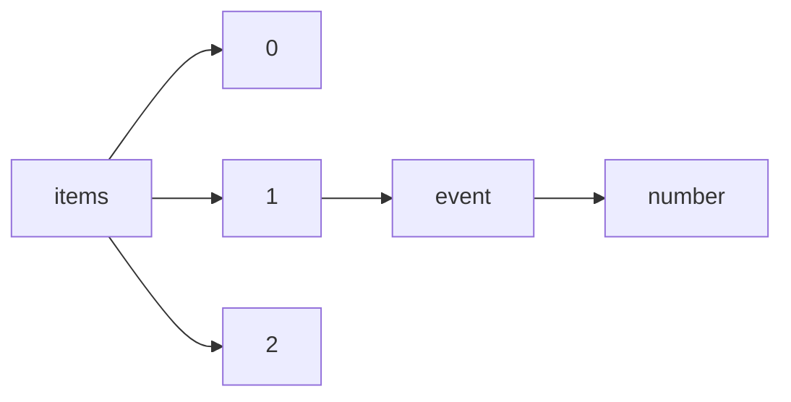

!!! warning "This document is not official Crossref documentation"
# Number
PATH = items/array/event/number(1)  
Occurs 358 619 times  
Unique values: 380  
{ .annotate }

1. A route to an element, for example:  
   The route "items/array/event/number" corresponds to navigating through the JSON indices as  
   ["items"][0]["event"]["number"]  

| **Row** | **Value** `String` | **Count** `Int64` |
|--------:|----------------------:|---------------------:|
| **1**   | 1                     | 24 973               |
| **2**   | 01                    | 19 110               |
| **3**   | 2                     | 13 926               |
| **4**   | 3                     | 11 604               |
| **5**   | 7                     | 11 556               |
| **6**   | 5                     | 11 476               |
| **7**   | 4                     | 10 593               |
| **8**   | 9                     | 10 576               |
| **9**   | 11                    | 10 071               |
| **10**  | 8                     | 9 729                |
| **11**  | 6                     | 9 493                |
| **12**  | 10                    | 9 233                |
| **13**  | 30                    | 6 677                |
| **14**  | 16                    | 6 327                |
| **15**  | 12                    | 6 233                |
| **16**  | I                     | 6 176                |
| **17**  | 17                    | 5 660                |
| **18**  | 13                    | 5 486                |
| **19**  | 15                    | 5 056                |
| **20**  | 22                    | 4 996                |
| **21**  | 14                    | 4 985                |
| **22**  | 20                    | 4 929                |
| **23**  | 28                    | 4 173                |
| **24**  | 25                    | 3 641                |
| **25**  | 18                    | 3 580                |
| **26**  | 26                    | 3 529                |
| **27**  | 23                    | 3 389                |
| **28**  | 19                    | 3 120                |
| **29**  | 2006                  | 3 025                |
| **30**  | 31                    | 2 926                |
| **31**  | 21                    | 2 903                |
| **32**  | 27                    | 2 769                |
| **33**  | 0                     | 2 639                |
| **34**  | 24                    | 2 624                |
| **35**  | 29                    | 2 368                |
| **36**  | 39                    | 2 348                |
| **37**  | 36                    | 2 207                |
| **38**  | 37                    | 1 883                |
| **39**  | 2005                  | 1 874                |
| **40**  | 2018                  | 1 811                |
| **41**  | 34                    | 1 760                |
| **42**  | III                   | 1 684                |
| **43**  | 08                    | 1 671                |
| **44**  | II                    | 1 650                |
| **45**  | XXIV                  | 1 612                |
| **46**  | IX                    | 1 570                |
| **47**  | 2021                  | 1 500                |
| **48**  | XXV                   | 1 468                |
| **49**  | 38                    | 1 466                |
| **50**  | V                     | 1 442                |
| **51**  | XXIII                 | 1 441                |
| **52**  | 1996                  | 1 434                |
| **53**  | 1997                  | 1 423                |
| **54**  | 32                    | 1 411                |
| **55**  | 33                    | 1 380                |
| **56**  | Congresso             | 1 368                |
| **57**  | 2009                  | 1 364                |
| **58**  | 43                    | 1 361                |
| **59**  | 1993                  | 1 356                |
| **60**  | 2022                  | 1 347                |
| **61**  | 1994                  | 1 326                |
| **62**  | 2017                  | 1 305                |
| **63**  | 2020                  | 1 275                |
| **64**  | VII                   | 1 246                |
| **65**  | 1995                  | 1 237                |
| **66**  | 35                    | 1 212                |
| **67**  | VI                    | 1 199                |
| **68**  | 42                    | 1 197                |
| **69**  | 44                    | 1 180                |
| **70**  | IV                    | 1 155                |
| **71**  | X                     | 1 145                |
| **72**  | 1992                  | 1 085                |
| **73**  | 06                    | 1 082                |
| **74**  | 45                    | 1 074                |
| **75**  | 40                    | 1 064                |
| **76**  | 2004                  | 1 049                |
| **77**  | 2015                  | 1 043                |
| **78**  | 67                    | 1 038                |
| **79**  | 49                    | 1 038                |
| **80**  | 1990                  | 1 035                |
| **81**  | 50                    | 965                  |
| **82**  | 46                    | 953                  |
| **83**  | XV                    | 918                  |
| **84**  | XXII                  | 891                  |
| **85**  | Simpósio              | 888                  |
| **86**  | 41                    | 886                  |
| **87**  | 1989                  | 885                  |
| **88**  | 69                    | 885                  |
| **89**  | 2008                  | 879                  |
| **90**  | VIII                  | 878                  |
| **91**  | 2019                  | 854                  |
| **92**  | 1998                  | 852                  |
| **93**  | 47                    | 823                  |
| **94**  | 51                    | 818                  |
| **95**  | 72                    | 816                  |
| **96**  | 2007                  | 768                  |
| **97**  | 73                    | 756                  |
| **98**  | 48                    | 745                  |
| **99**  | 2003                  | 742                  |
| **100** | XXXVIII               | 742                  |
| **101** | 70                    | 741                  |
| **102** | 2011                  | 740                  |
| **103** | 74                    | 715                  |
| **104** | 2002                  | 711                  |
| **105** | 2000                  | 711                  |
| **106** | 71                    | 672                  |
| **107** | 1991                  | 659                  |
| **108** | XX                    | 658                  |
| **109** | 1987                  | 646                  |
| **110** | XVIII                 | 643                  |
| **111** | 2014                  | 624                  |
| **112** | 1986                  | 612                  |
| **113** | 52                    | 609                  |
| **114** | 2016                  | 569                  |
| **115** | XI                    | 540                  |
| **116** | XII                   | 539                  |
| **117** | 2001                  | 526                  |
| **118** | XXXVI                 | 520                  |
| **119** | 1988                  | 519                  |
| **120** | XIII                  | 490                  |
| **121** | XIV                   | 471                  |
| **122** | 2010                  | 440                  |
| **123** | 2013                  | 419                  |
| **124** | 1985                  | 378                  |
| **125** | .                     | 366                  |
| **126** | 2012                  | 351                  |
| **127** | 1999                  | 336                  |
| **128** | 75                    | 314                  |
| **129** | XVI                   | 284                  |
| **130** | 07                    | 276                  |
| **131** | 05                    | 248                  |
| **132** | 02                    | 244                  |
| **133** | 04                    | 228                  |
| **134** | 09                    | 222                  |
| **135** | XVII                  | 217                  |
| **136** | 53                    | 210                  |
| **137** | 03                    | 176                  |
| **138** | XIX                   | 174                  |
| **139** | 1982                  | 173                  |
| **140** | 723                   | 169                  |
| **141** | 764                   | 152                  |
| **142** | 696                   | 143                  |
| **143** | 751                   | 138                  |
| **144** | 0206                  | 135                  |
| **145** | 793                   | 135                  |
| **146** | 12TRF-0001            | 134                  |
| **147** | 10TRF-0001            | 133                  |
| **148** | 753                   | 130                  |
| **149** | 757                   | 128                  |
| **150** | 16TRF-0001            | 127                  |
| **151** | 14TRF-0001            | 126                  |
| **152** | 57                    | 117                  |
| **153** | 759                   | 112                  |
| **154** | 04TRF-0001            | 109                  |
| **155** | 06TRF-0002            | 109                  |
| **156** | 18TRF-0001            | 109                  |
| **157** | 08TRF-0001            | 105                  |
| **158** | 11th                  | 105                  |
| **159** | 1975                  | 103                  |
| **160** | 717                   | 101                  |
| **161** | 1977                  | 101                  |
| **162** | 27\_1                 | 100                  |
| **163** | 756                   | 100                  |
| **164** | 791                   | 98                   |
| **165** | 02TRF-0001            | 98                   |
| **166** | 1969                  | 98                   |
| **167** | 705                   | 97                   |
| **168** | 54                    | 95                   |
| **169** | A001                  | 95                   |
| **170** | 754                   | 94                   |
| **171** | 1983                  | 93                   |
| **172** | 1978                  | 91                   |
| **173** | 00TRF-0001            | 90                   |
| **174** | 98TRF-0001            | 89                   |
| **175** | 33\_1                 | 89                   |
| **176** | 55                    | 87                   |
| **177** | 800                   | 85                   |
| **178** | 1967                  | 85                   |
| **179** | XXI                   | 84                   |
| **180** | 724                   | 83                   |
| **181** | 6th                   | 83                   |
| **182** | 797                   | 81                   |
| **183** | 714                   | 80                   |
| **184** | XXVIII                | 80                   |
| **185** | 782                   | 79                   |
| **186** | 701                   | 79                   |
| **187** | 1974                  | 78                   |
| **188** | XXVI                  | 77                   |
| **189** | 1952                  | 77                   |
| **190** | 802                   | 75                   |
| **191** | 806                   | 73                   |
| **192** | 768                   | 72                   |
| **193** | 674                   | 72                   |
| **194** | 41\_2                 | 71                   |
| **195** | 1971                  | 71                   |
| **196** | 1984                  | 70                   |
| **197** | 799                   | 70                   |
| **198** | 41\_1                 | 70                   |
| **199** | SIAN                  | 69                   |
| **200** | 33\_2                 | 68                   |
| **201** | 1976                  | 68                   |
| **202** | 96TRF-0001            | 68                   |
| **203** | 785                   | 66                   |
| **204** | 56                    | 66                   |
| **205** | JBI                   | 66                   |
| **206** | ?                     | 65                   |
| **207** | 675                   | 65                   |
| **208** | 769                   | 65                   |
| **209** | 771                   | 64                   |
| **210** | 66                    | 64                   |
| **211** | 744                   | 63                   |
| **212** | 202                   | 63                   |
| **213** | 818                   | 63                   |
| **214** | 691                   | 62                   |
| **215** | 721                   | 62                   |
| **216** | 789                   | 61                   |
| **217** | 94TRF-0001            | 61                   |
| **218** | 17th                  | 61                   |
| **219** | 719                   | 60                   |
| **220** | 836                   | 60                   |
| **221** | 840                   | 59                   |
| **222** | 1980                  | 59                   |
| **223** | XXVII                 | 58                   |
| **224** | 702                   | 58                   |
| **225** | 678                   | 58                   |
| **226** | 26\_1                 | 57                   |
| **227** | 738                   | 57                   |
| **228** | 58                    | 56                   |
| **229** | XXIX                  | 55                   |
| **230** | 812                   | 55                   |
| **231** | 760                   | 55                   |
| **232** | 307593                | 54                   |
| **233** | 810                   | 54                   |
| **234** | 715                   | 52                   |
| **235** | 1979                  | 52                   |
| **236** | 780                   | 50                   |
| **237** | 1°                    | 50                   |
| **238** | 18th                  | 50                   |
| **239** | 60                    | 50                   |
| **240** | 679                   | 49                   |
| **241** | 830                   | 48                   |
| **242** | 200                   | 48                   |
| **243** | 735                   | 48                   |
| **244** | ECON 2019             | 47                   |
| **245** | ??                    | 47                   |
| **246** | 809                   | 46                   |
| **247** | 689                   | 45                   |
| **248** | 852                   | 44                   |
| **249** | 734                   | 44                   |
| **250** | Vol. II               | 44                   |
| **251** | 729                   | 43                   |
| **252** | 347915                | 42                   |
| **253** | 288441                | 42                   |
| **254** | 1970                  | 42                   |
| **255** | 826                   | 42                   |
| **256** | 776                   | 42                   |
| **257** | 750                   | 42                   |
| **258** | 848                   | 42                   |
| **259** | 86TRF-0001            | 42                   |
| **260** | 684                   | 42                   |
| **261** | 688                   | 41                   |
| **262** | 21st                  | 41                   |
| **263** | 676                   | 40                   |
| **264** | XXX                   | 40                   |
| **265** | 832                   | 40                   |
| **266** | 788                   | 39                   |
| **267** | 743                   | 39                   |
| **268** | 774                   | 38                   |
| **269** | 778                   | 38                   |
| **270** | 1973                  | 38                   |
| **271** | 736                   | 38                   |
| **272** | 63                    | 37                   |
| **273** | 103                   | 37                   |
| **274** | XXXI                  | 36                   |
| **275** | 775                   | 35                   |
| **276** | 677                   | 34                   |
| **277** | WCAE 1998             | 33                   |
| **278** | 786                   | 33                   |
| **279** | AVIA!                 | 32                   |
| **280** | 685                   | 32                   |
| **281** | 14th                  | 31                   |
| **282** | 746                   | 31                   |
| **283** | 703                   | 30                   |
| **284** | XXXIV                 | 30                   |
| **285** | 710                   | 30                   |
| **286** | XXXIII                | 30                   |
| **287** | 14º                   | 29                   |
| **288** | 829                   | 29                   |
| **289** | 686                   | 29                   |
| **290** | XXXII                 | 27                   |
| **291** | WCAE 2004             | 26                   |
| **292** | XLII                  | 26                   |
| **293** | 819                   | 26                   |
| **294** | XXXVII                | 25                   |
| **295** | 846                   | 25                   |
| **296** | 1965                  | 25                   |
| **297** | 19th                  | 25                   |
| **298** | \_2                   | 25                   |
| **299** | 853                   | 25                   |
| **300** | WCAE 2002             | 24                   |
| **301** | A00                   | 24                   |
| **302** | 98TRF-0002            | 23                   |
| **303** | 857                   | 23                   |
| **304** | 27\_2                 | 23                   |
| **305** | 64                    | 23                   |
| **306** | 2 & 3                 | 23                   |
| **307** | 65                    | 22                   |
| **308** | XXXV                  | 22                   |
| **309** | 68                    | 22                   |
| **310** | 20th                  | 22                   |
| **311** | 737                   | 21                   |
| **312** | 15th                  | 21                   |
| **313** | 10th                  | 21                   |
| **314** | 730                   | 21                   |
| **315** | 59                    | 20                   |
| **316** | 84TRF-0001            | 20                   |
| **317** | XLI                   | 20                   |
| **318** | 61                    | 20                   |
| **319** | 1972                  | 19                   |
| **320** | WCAE 2000             | 19                   |
| **321** | 9th                   | 19                   |
| **322** | 96TRF-0002            | 19                   |
| **323** | 99999                 | 19                   |
| **324** | 859                   | 18                   |
| **325** | 13th                  | 18                   |
| **326** | 12th                  | 18                   |
| **327** | 16th                  | 18                   |
| **328** | WCAE 2003             | 17                   |
| **329** | 06TRF-0003            | 15                   |
| **330** | XLV                   | 15                   |
| **331** | WCAE 1996             | 13                   |
| **332** | 704                   | 13                   |
| **333** | WCAE 2007             | 13                   |
| **334** | XLIV                  | 13                   |
| **335** | WCAE 1995             | 13                   |
| **336** | 101                   | 12                   |
| **337** | 26\_2                 | 12                   |
| **338** | WCAE 2005             | 12                   |
| **339** | 12/17                 | 12                   |
| **340** | WCAE-3 1997           | 11                   |
| **341** | 00TRF-0002            | 11                   |
| **342** | SWACELSO 2018         | 11                   |
| **343** | 13/18                 | 10                   |
| **344** | WCAE-5 1999           | 10                   |
| **345** | WCAE 2006             | 9                    |
| **346** | 346547                | 6                    |
| **347** | WCAE-4 1998           | 6                    |
| **348** | none                  | 4                    |
| **349** | 227711                | 3                    |
| **350** | 7th                   | 3                    |
| **351** | 1st                   | 2                    |
| **352** | 90929                 | 2                    |
| **353** | 3nd                   | 2                    |
| **354** | 90928                 | 2                    |
| **355** | 5nd                   | 2                    |
| **356** | 2nd                   | 2                    |
| **357** | 40788                 | 1                    |
| **358** | 250                   | 1                    |
| **359** | 346016                | 1                    |
| **360** | 77                    | 1                    |
| **361** | 31943                 | 1                    |
| **362** | 1th                   | 1                    |
| **363** | 90463                 | 1                    |
| **364** | 4nd                   | 1                    |
| **365** | 347002                | 1                    |
| **366** | 1962                  | 1                    |
| **367** | 90949                 | 1                    |
| **368** | 3839                  | 1                    |
| **369** | 90663                 | 1                    |
| **370** | 18626                 | 1                    |
| **371** | 76                    | 1                    |
| **372** | 90662                 | 1                    |
| **373** | 16776                 | 1                    |
| **374** | 346291                | 1                    |
| **375** | 33714                 | 1                    |
| **376** | 337696                | 1                    |
| **377** | 50013                 | 1                    |
| **378** | 27771                 | 1                    |
| **379** | 90720                 | 1                    |
| **380** | 90947                 | 1                    |

