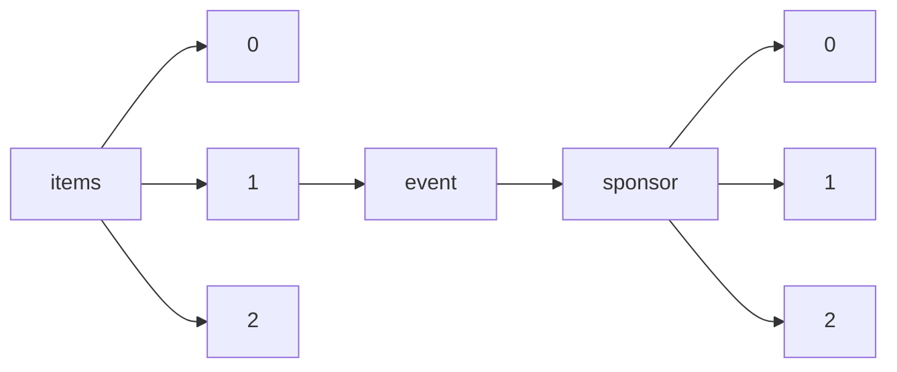

!!! warning "This document is not official Crossref documentation"
# Elements
PATH = items/array/event/sponsor/array(1)  
Occurs 1 333 014 times  
Unique values: > 999  
{ .annotate }

1. A route to an element, for example:  
   The route "items/array/event/sponsor/array" corresponds to navigating through the JSON indices as  
   ["items"][0]["event"]["sponsor"][0]  

!!! note "Due to current limitations, only the first 1,000 unique values are counted."

| **Row** | **Value** `String`                                                                                 | **Count** `Int64` |
|--------:|------------------------------------------------------------------------------------------------------:|---------------------:|
| **1**   | The Optical Society                                                                                   | 151 112              |
| **2**   | SIGCHI ACM Special Interest Group on Computer-Human Interaction                                       | 61 753               |
| **3**   | ACM Association for Computing Machinery                                                               | 46 938               |
| **4**   | International Gas Turbine Institute                                                                   | 29 670               |
| **5**   | SIGGRAPH ACM Special Interest Group on Computer Graphics and Interactive Techniques                   | 28 370               |
| **6**   | ASME                                                                                                  | 26 558               |
| **7**   | SIGWEB ACM Special Interest Group on Hypertext, Hypermedia, and Web                                   | 25 423               |
| **8**   | SIGIR ACM Special Interest Group on Information Retrieval                                             | 20 907               |
| **9**   | SIGSOFT ACM Special Interest Group on Software Engineering                                            | 18 254               |
| **10**  | SIGPLAN ACM Special Interest Group on Programming Languages                                           | 18 032               |
| **11**  | SIGMM ACM Special Interest Group on Multimedia                                                        | 17 883               |
| **12**  | SIGMOBILE ACM Special Interest Group on Mobility of Systems, Users, Data and Computing                | 16 801               |
| **13**  | The Japan Society of Applied Physics                                                                  | 16 458               |
| **14**  | SIGMOD ACM Special Interest Group on Management of Data                                               | 15 385               |
| **15**  | Design Engineering Division                                                                           | 15 270               |
| **16**  | ICST                                                                                                  | 14 542               |
| **17**  | ACM, Association for Computing Machinery                                                              | 13 634               |
| **18**  | SIGDA ACM Special Interest Group on Design Automation                                                 | 13 511               |
| **19**  | SIGAI ACM Special Interest Group on Artificial Intelligence                                           | 13 000               |
| **20**  | SIGAPP ACM Special Interest Group on Applied Computing                                                | 12 330               |
| **21**  | SIGARCH ACM Special Interest Group on Computer Architecture                                           | 12 026               |
| **22**  | SIGCSE ACM Special Interest Group on Computer Science Education                                       | 11 970               |
| **23**  | Computers and Information in Engineering Division                                                     | 11 948               |
| **24**  | SIGCOMM ACM Special Interest Group on Data Communication                                              | 11 945               |
| **25**  | Ocean, Offshore and Arctic Engineering Division                                                       | 11 875               |
| **26**  | SIGOPS ACM Special Interest Group on Operating Systems                                                | 11 637               |
| **27**  | SIGKDD ACM Special Interest Group on Knowledge Discovery in Data                                      | 11 279               |
| **28**  | Pressure Vessels and Piping Division                                                                  | 11 125               |
| **29**  | SIGSAC ACM Special Interest Group on Security, Audit, and Control                                     | 9 790                |
| **30**  | undetermined                                                                                          | 9 737                |
| **31**  | Nuclear Engineering Division                                                                          | 9 199                |
| **32**  | SIGACT ACM Special Interest Group on Algorithms and Computation Theory                                | 9 042                |
| **33**  | SIGBED ACM Special Interest Group on Embedded Systems                                                 | 8 621                |
| **34**  | SIGEVO ACM Special Interest Group on Genetic and Evolutionary Computation                             | 8 597                |
| **35**  | Fluids Engineering Division                                                                           | 8 113                |
| **36**  | SIGGRAPH, ACM Special Interest Group on Computer Graphics and Interactive Techniques                  | 7 947                |
| **37**  | IEEE CS                                                                                               | 7 822                |
| **38**  | EAI                                                                                                   | 6 587                |
| **39**  | SIGMETRICS ACM Special Interest Group on Measurement and Evaluation                                   | 6 043                |
| **40**  | SIGDA, ACM Special Interest Group on Design Automation                                                | 5 775                |
| **41**  | Heat Transfer Division                                                                                | 5 733                |
| **42**  | SIGCHI, ACM Special Interest Group on Computer-Human Interaction                                      | 5 707                |
| **43**  | Design Engineering Division and Computers and Information in Engineering Division                     | 5 644                |
| **44**  | SIGACT, ACM Special Interest Group on Algorithms and Computation Theory                               | 5 534                |
| **45**  | WIT Transactions on Ecology and the Environment                                                       | 5 130                |
| **46**  | International Joint Conferences on Artificial Intelligence Organization (IJCAI)                       | 4 986                |
| **47**  | IASTED                                                                                                | 4 980                |
| **48**  | Bioengineering Division                                                                               | 4 928                |
| **49**  | SIGSPATIAL ACM Special Interest Group on Spatial Information                                          | 4 667                |
| **50**  | ASM Thermal Spray Society                                                                             | 4 563                |
| **51**  | Deutscher Verband für Schweisstechnik                                                                 | 4 305                |
| **52**  | Dynamic Systems and Control Division                                                                  | 4 172                |
| **53**  | University of Illinois at Urbana-Champaign                                                            | 4 151                |
| **54**  | WIT Transactions on The Built Environment                                                             | 4 111                |
| **55**  | SIGPLAN, ACM Special Interest Group on Programming Languages                                          | 4 078                |
| **56**  | Associação Brasileira de Engenharia de Produção - ABEPRO                                              | 3 862                |
| **57**  | International Institute of Welding                                                                    | 3 841                |
| **58**  | IEEE-CS, Computer Society                                                                             | 3 605                |
| **59**  | SIGART, ACM Special Interest Group on Artificial Intelligence                                         | 3 546                |
| **60**  | WIT Transactions on Engineering Sciences                                                              | 3 401                |
| **61**  | SIGSIM ACM Special Interest Group on Simulation and Modeling                                          | 3 373                |
| **62**  | WIT Transactions on Information and Communication Technologies                                        | 3 352                |
| **63**  | SIGMICRO ACM Special Interest Group on Microarchitectural Research and Processing                     | 3 313                |
| **64**  | The Institute of Navigation                                                                           | 3 186                |
| **65**  | Nanotechnology Institute                                                                              | 3 143                |
| **66**  | Manufacturing Engineering Division                                                                    | 3 113                |
| **67**  | SIGecom Special Interest Group on Economics and Computation                                           | 3 044                |
| **68**  | British Machine Vision Association                                                                    | 3 019                |
| **69**  | AFIPS, American Federation of Information Processing Societies                                        | 3 013                |
| **70**  | IEEE-CS Computer Society                                                                              | 2 989                |
| **71**  | IEEE CAS                                                                                              | 2 859                |
| **72**  | ECCOMAS                                                                                               | 2 842                |
| **73**  | Pipeline Division                                                                                     | 2 745                |
| **74**  | Aerospace Division                                                                                    | 2 636                |
| **75**  | Deutsche Gesellschaft für HNO-Heilkunde, Kopf- und Hals-Chirurgie e.V., Bonn                          | 2 616                |
| **76**  | Design Engineering Division and Computers in Engineering Division                                     | 2 582                |
| **77**  | Power Division                                                                                        | 2 567                |
| **78**  | ADL Romania                                                                                           | 2 527                |
| **79**  | SIGARCH, ACM Special Interest Group on Computer Architecture                                          | 2 461                |
| **80**  | SIGHPC ACM Special Interest Group on High Performance Computing, Special Interest Group on High Perf  | 2 436                |
| **81**  | IEEE CEDA                                                                                             | 2 433                |
| **82**  | SIGWEB, ACM Special Interest Group on Hypertext, Hypermedia, and Web                                  | 2 420                |
| **83**  | SIGDOC ACM Special Interest Group for Design of Communications                                        | 2 387                |
| **84**  | Advanced Energy Systems Division                                                                      | 2 347                |
| **85**  | ASM International                                                                                     | 2 343                |
| **86**  | SIGSIM, ACM Special Interest Group on Simulation and Modeling                                         | 2 299                |
| **87**  | Electronic and Photonic Packaging Division                                                            | 2 280                |
| **88**  | MDPI                                                                                                  | 2 275                |
| **89**  | SIGACCESS ACM Special Interest Group on Accessible Computing                                          | 2 227                |
| **90**  | SIGIR, ACM Special Interest Group on Information Retrieval                                            | 2 220                |
| **91**  | SIGMIS ACM Special Interest Group on Management Information Systems                                   | 2 187                |
| **92**  | Electronic Device Failure Analysis Society                                                            | 2 166                |
| **93**  | SIGCSE, ACM Special Interest Group on Computer Science Education                                      | 2 151                |
| **94**  | Internal Combustion Engine Division                                                                   | 2 128                |
| **95**  | IW3C2 International World Wide Web Conference Committee                                               | 2 125                |
| **96**  | Tribology Division                                                                                    | 2 079                |
| **97**  | EDAC Electronic Design Automation Consortium                                                          | 2 047                |
| **98**  | USENIX Assoc USENIX Assoc                                                                             | 1 881                |
| **99**  | SIGMOD, ACM Special Interest Group on Management of Data                                              | 1 858                |
| **100** | Instituto Nacional de Ciência e Tecnologia - Engenharia da Irrigação                                  | 1 850                |
| **101** | Instituto de Pesquisa e Inovação na Agricultura Irrigada                                              | 1 850                |
| **102** | SIGSOFT, ACM Special Interest Group on Software Engineering                                           | 1 841                |
| **103** | Solar Energy Division                                                                                 | 1 835                |
| **104** | SIGCOMM, ACM Special Interest Group on Data Communication                                             | 1 833                |
| **105** | ESGE                                                                                                  | 1 782                |
| **106** | Google Inc.                                                                                           | 1 761                |
| **107** | SIGOPS, ACM Special Interest Group on Operating Systems                                               | 1 687                |
| **108** | IEEE-CAS, Circuits & Systems                                                                          | 1 678                |
| **109** | ECSI                                                                                                  | 1 658                |
| **110** | SIGSAM ACM Special Interest Group on Symbolic and Algebraic Manipulation                              | 1 639                |
| **111** | SBC Brazilian Computer Society                                                                        | 1 610                |
| **112** | IEEE-CS\DATC IEEE Computer Society                                                                    | 1 608                |
| **113** | CEDA                                                                                                  | 1 605                |
| **114** | SIGGROUP, ACM Special Interest Group on Supporting Group Work                                         | 1 574                |
| **115** | International                                                                                         | 1 559                |
| **116** | SIGBio ACM Special Interest Group on Bioinformatics                                                   | 1 554                |
| **117** | SIGADA, ACM Special Interest Group on Ada Programming Language                                        | 1 530                |
| **118** | Vilnius Gediminas Technical University                                                                | 1 523                |
| **119** | SIGUCCS ACM Special Interest Group on University and College Computing Services                       | 1 507                |
| **120** | Microsoft Microsoft                                                                                   | 1 464                |
| **121** | Rail Transportation Division                                                                          | 1 460                |
| **122** | Ocean, Offshore, and Arctic Engineering Division                                                      | 1 435                |
| **123** | European Society of Gastrointestinal Endoscopy (ESGE)                                                 | 1 409                |
| **124** | WIT Transactions on Ecology and The Environment                                                       | 1 400                |
| **125** | IEEE, Institute of Electrical and Electronics Engineers                                               | 1 398                |
| **126** | Instituto Nacional de Ciência e Tecnologia em Salinidade                                              | 1 393                |
| **127** | SIGITE ACM Special Interest Group on Information Technology Education                                 | 1 389                |
| **128** | IEEE-CEDA                                                                                             | 1 331                |
| **129** | University of Arizona University of Arizona                                                           | 1 324                |
| **130** | Singidunum University                                                                                 | 1 321                |
| **131** | Deutsche Gesellschaft für Hals-Nasen-Ohren-Heilkunde, Kopf- und Hals-Chirurgie e.V., Bonn             | 1 304                |
| **132** | SIGAda ACM Special Interest Group on Ada Programming Language                                         | 1 304                |
| **133** | Pressure Vessels and Piping                                                                           | 1 292                |
| **134** | International Solar Energy Society                                                                    | 1 280                |
| **135** | IEEE-SMCS, Systems, Man & Cybernetics Society                                                         | 1 269                |
| **136** | University of Florida University of Florida                                                           | 1 206                |
| **137** | ABMEC                                                                                                 | 1 190                |
| **138** | EDAC, Electronic Design Automation Consortium                                                         | 1 182                |
| **139** | SBA                                                                                                   | 1 164                |
| **140** | EDA Consortium                                                                                        | 1 150                |
| **141** | RAS                                                                                                   | 1 150                |
| **142** | ACM SIGDA                                                                                             | 1 150                |
| **143** | EDAA                                                                                                  | 1 150                |
| **144** | SIGUCCS, ACM Special Interest Group on University and College Computing Services                      | 1 145                |
| **145** | University for Business and Technology                                                                | 1 137                |
| **146** | SCS, Society for Computer Simulation                                                                  | 1 135                |
| **147** | Сибирский юридический институт МВД России                                                             | 1 126                |
| **148** | Internet Society                                                                                      | 1 123                |
| **149** | ASA, American Statistical Association                                                                 | 1 116                |
| **150** | IW3C2, International World Wide Web Conference Committee                                              | 1 108                |
| **151** | SIGCAS ACM Special Interest Group on Computers and Society                                            | 1 094                |
| **152** | SIGMOBILE, ACM Special Interest Group on Mobility of Systems, Users, Data and Computing               | 1 090                |
| **153** | American Association of Physics Teachers                                                              | 1 067                |
| **154** | TCSE IEEE Computer Society's Tech. Council on Software Engin.                                         | 1 062                |
| **155** | IEEE Council on Electronic Design Automation (CEDA)                                                   | 1 051                |
| **156** | NIST, National Institue of Standards & Technology                                                     | 1 039                |
| **157** | Royal Society of Chemistry                                                                            | 1 036                |
| **158** | SIGAPP, ACM Special Interest Group on Applied Computing                                               | 1 023                |
| **159** | IFIP                                                                                                  | 1 010                |
| **160** | Deutsche Gesellschaft für Nuklearmedizin e.V.                                                         | 1 001                |
| **161** | IEEE                                                                                                  | 969                  |
| **162** | IIE, Institute of Industrial Engineers                                                                | 967                  |
| **163** | CGIBR Comite Gestor da Internet no Brazil                                                             | 963                  |
| **164** | Division of Fluid Dynamics, American Physical Society                                                 | 959                  |
| **165** | Advanced Energy Systems Division and Solar Energy Division                                            | 928                  |
| **166** | NSF National Science Foundation                                                                       | 913                  |
| **167** | EUROGRAPHICS The European Association for Computer Graphics                                           | 908                  |
| **168** | SIGCAPH, ACM Special Interest Group on Computers and the Physically Handicapped                       | 901                  |
| **169** | Nanyang Technological University                                                                      | 891                  |
| **170** | Wuhan Univ. Wuhan University, China                                                                   | 881                  |
| **171** | Nuclear Engineering Division and Environmental Engineering Division                                   | 864                  |
| **172** | IEEE CASS                                                                                             | 864                  |
| **173** | Zurich Instruments                                                                                    | 861                  |
| **174** | IAARC                                                                                                 | 850                  |
| **175** | SIGCUE, ACM Special Interest Group on Computer Uses In Education                                      | 844                  |
| **176** | SIGBIO, ACM Special Interest Group on Biomedical Computing                                            | 839                  |
| **177** | SIGAPL, ACM Special Interest Group on APL Programming Language                                        | 838                  |
| **178** | SIGMETRICS, ACM Special Interest Group on Measurement and Evaluation                                  | 837                  |
| **179** | Microsoft Research Microsoft Research                                                                 | 836                  |
| **180** | WIT Transactions on Modelling and Simulation                                                          | 823                  |
| **181** | The EDA Consortium                                                                                    | 797                  |
| **182** | SKKU SUNGKYUNKWAN UNIVERSITY                                                                          | 787                  |
| **183** | University of Technology Sydney (UTS)                                                                 | 782                  |
| **184** | Australian Computer Society (ACS)                                                                     | 782                  |
| **185** | IEEE-RAS Robotics and Automation                                                                      | 755                  |
| **186** | Transducer Research Foundation, Inc.                                                                  | 739                  |
| **187** | Heat Transfer Division and Electronic and Photonic Packaging Division                                 | 737                  |
| **188** | International Petroleum Technology Institute and the Pipeline Division                                | 736                  |
| **189** | ACS Energy Letters                                                                                    | 736                  |
| **190** | Transducer Research Foundation                                                                        | 734                  |
| **191** | WIT Transactions on Biomedicine and Health                                                            | 732                  |
| **192** | Fluid Power Systems and Technology Division                                                           | 730                  |
| **193** | Society for Conservation Biology                                                                      | 729                  |
| **194** | Cognitive Computational Neuroscience                                                                  | 724                  |
| **195** | EDAA European Design Automation Association                                                           | 718                  |
| **196** | Computers in Engineering Division                                                                     | 717                  |
| **197** | Nondestructive Evaluation Engineering Division                                                        | 713                  |
| **198** | IEEE-CS\DATC, IEEE Computer Society                                                                   | 707                  |
| **199** | EAI The European Alliance for Innovation                                                              | 704                  |
| **200** | International Petroleum Technology Institute                                                          | 692                  |
| **201** | SIGLINK, Hypertext, Hypermedia, and Web                                                               | 691                  |
| **202** | CNPq Conselho Nacional de Desenvolvimento Cientifico e Tecn                                           | 690                  |
| **203** | Deutsche Gesellschaft für Gynäkologie und Geburtshilfe DGGG                                           | 687                  |
| **204** | University of Salamanca University of Salamanca                                                       | 686                  |
| **205** | RSC                                                                                                   | 675                  |
| **206** | UFRGS                                                                                                 | 670                  |
| **207** | Southwest Jiaotong University                                                                         | 667                  |
| **208** | IBM IBM                                                                                               | 666                  |
| **209** | VGTU Technika                                                                                         | 660                  |
| **210** | Society for Medicinal Plant and Natural Product Research                                              | 659                  |
| **211** | ACS Publications                                                                                      | 655                  |
| **212** | Chinese Group of IABSE                                                                                | 655                  |
| **213** | High Temperature Society of Japan                                                                     | 653                  |
| **214** | ORSA, Operations Research Society of America                                                          | 650                  |
| **215** | Associação Brasileira de Irrigação e Drenagem                                                         | 647                  |
| **216** | Universidade Federal do Recôncavo da Bahia                                                            | 647                  |
| **217** | Instituto Future                                                                                      | 647                  |
| **218** | Escola Superior de Agricultura Luiz de Queiroz                                                        | 647                  |
| **219** | Universidade Federal do Ceará                                                                         | 647                  |
| **220** | SIGSAC, ACM Special Interest Group on Security, Audit, and Control                                    | 646                  |
| **221** | US Group of IABSE                                                                                     | 646                  |
| **222** | Nature Catalysis                                                                                      | 632                  |
| **223** | INFORMS/CS, Computer Science TC                                                                       | 632                  |
| **224** | Park Systems                                                                                          | 632                  |
| **225** | SIGLOG ACM Special Interest Group on Logic and Computation                                            | 628                  |
| **226** | SIGEnergy ACM Special Interest Group on Energy Systems and Informatics                                | 619                  |
| **227** | SIGCUE ACM Special Interest Group on Computer Uses In Education                                       | 618                  |
| **228** | Deutsche Gesellschaft für Gastroenterologie, Verdauungs- und Stoffwechselkrankheiten mit Sektion End  | 607                  |
| **229** | Zahner                                                                                                | 606                  |
| **230** | QustomDot                                                                                             | 598                  |
| **231** | @WAS International Organization of Information Integration and Web-based Applications and Services    | 594                  |
| **232** | Kongresspräsidentin: Prof. Dr. Barbara Schmalfeldt, DGGG-Präsident: Prof. Dr. Anton J. Scharl         | 593                  |
| **233** | SIGCPR, ACM Special Interest Group on Computer Personnel Research                                     | 593                  |
| **234** | The Hong Kong Polytechnic The Hong Kong Polytechnic University                                        | 586                  |
| **235** | CAPES Brazilian Higher Education Funding Council                                                      | 579                  |
| **236** | ACSA Applied Computing Security Assoc                                                                 | 571                  |
| **237** | Deutsche Röntgengesellschaft e.V. (DRG)                                                               | 564                  |
| **238** | Bilkent University Bilkent University                                                                 | 563                  |
| **239** | RA IEEE Robotics and Automation Society                                                               | 562                  |
| **240** | American Institute of Electrical Engineers                                                            | 557                  |
| **241** | The Institute of Radio Engineers                                                                      | 557                  |
| **242** | DGOU, DGU & BVOU                                                                                      | 548                  |
| **243** | IEEE Circuits and Systems Society                                                                     | 543                  |
| **244** | WIT Transactions on the Built Environment                                                             | 543                  |
| **245** | UTFPR                                                                                                 | 541                  |
| **246** | GA (Gesellschaft für Arzneipflanzen- und Naturstoff-Forschung e.V. / Society for Medicinal Plant and  | 538                  |
| **247** | University of Electronic Science and Technology of China University of Electronic Science and Techno  | 535                  |
| **248** | NSF                                                                                                   | 535                  |
| **249** | Deutsche Gesellschaft für Gastroenterologie, Verdauungs- und Stoffwechselkrankheiten mit Sektion End  | 532                  |
| **250** | KIISE Korean Institute of Information Scientists and Engineers                                        | 531                  |
| **251** | ACCT Association of Convergent Computing Technology                                                   | 529                  |
| **252** | Heat Transfer Division and Fluids Engineering Division                                                | 528                  |
| **253** | Universidad de Zaragoza                                                                               | 527                  |
| **254** | Deutsche Diabetes-Gesellschaft                                                                        | 526                  |
| **255** | SIGGROUP ACM Special Interest Group on Supporting Group Work                                          | 525                  |
| **256** | Concordia University                                                                                  | 524                  |
| **257** | Swiss Group of IABSE                                                                                  | 520                  |
| **258** | Deutsche Röntgengesellschaft e.V.                                                                     | 520                  |
| **259** | American Association of Swine Veterinarians                                                           | 508                  |
| **260** | The Russian Academy of Sciences The Russian Academy of Sciences                                       | 508                  |
| **261** | Pharmaceuticals                                                                                       | 504                  |
| **262** | IFIP International Federation for Information Processing                                              | 498                  |
| **263** | Université de Montréal                                                                                | 494                  |
| **264** | Government of Canada                                                                                  | 494                  |
| **265** | University of Kassel                                                                                  | 491                  |
| **266** | IEEE-EDS Electronic Devices Society                                                                   | 488                  |
| **267** | NICBR Nucleo de Informatcao e Coordenacao do Ponto BR                                                 | 484                  |
| **268** | Deutsche Gesellschaft für Perinatale Medizin                                                          | 479                  |
| **269** | International Engineering and Technology Institute, Hong Kong International Engineering and Technolo  | 475                  |
| **270** | IPSJ, Information Processing Society of Japan                                                         | 470                  |
| **271** | SIGSAM, ACM Special Interest Group on Symbolic and Algebraic Manipulation                             | 464                  |
| **272** | Antac                                                                                                 | 462                  |
| **273** | IEEE-CAS Circuits & Systems                                                                           | 462                  |
| **274** | BytePress                                                                                             | 456                  |
| **275** | Deutsche Gesellschaft für Epidemiologie e.V. (DGEpi); Deutsche Gesellschaft für Medizinische Soziolo  | 453                  |
| **276** | Aleksandras Stulginskis University                                                                    | 452                  |
| **277** | Canadian Group of IABSE                                                                               | 451                  |
| **278** | Shenzhen University Shenzhen University                                                               | 449                  |
| **279** | Applied Mechanics Division                                                                            | 445                  |
| **280** | University of Tsukuba University of Tsukuba                                                           | 445                  |
| **281** | NVIDIA                                                                                                | 441                  |
| **282** | National University of Singapore                                                                      | 439                  |
| **283** | Institute of Microelectronics                                                                         | 439                  |
| **284** | SIM Tech                                                                                              | 439                  |
| **285** | Institute for Infocomm Research                                                                       | 439                  |
| **286** | SIGICE, ACM Special Interest Group on Individual Computing Environment                                | 436                  |
| **287** | Information Storage and Processing Systems Division                                                   | 436                  |
| **288** | Tallinn University of Technology                                                                      | 435                  |
| **289** | Riga Technical University                                                                             | 435                  |
| **290** | IEEE/CASS/CANDE/CEDA                                                                                  | 434                  |
| **291** | SGEM WORLD SCIENCE (SWS) Scholarly Society, Austria                                                   | 431                  |
| **292** | Deutsche Arbeitsgemeinschaft zum Studium der Leber (GASL)                                             | 428                  |
| **293** | Laytec                                                                                                | 428                  |
| **294** | Spanish Group of IABSE                                                                                | 423                  |
| **295** | INRIA Institut Natl de Recherche en Info et en Automatique                                            | 422                  |
| **296** | Oak Ridge National Laboratory                                                                         | 416                  |
| **297** | SIGDOC, ACM Special Interest Group for Design of Communications                                       | 416                  |
| **298** | Greatcell Solar                                                                                       | 413                  |
| **299** | SIGMIS, ACM Special Interest Group on Management Information Systems                                  | 410                  |
| **300** | Lithuanian Academy of Sciences                                                                        | 407                  |
| **301** | Springer                                                                                              | 404                  |
| **302** | EASD                                                                                                  | 404                  |
| **303** | Environmental Engineering Division                                                                    | 402                  |
| **304** | Human Factors & Ergonomics Soc Human Factors & Ergonomics Soc                                         | 400                  |
| **305** | Сибирский юридический институт МВД РФ                                                                 | 398                  |
| **306** | Portuguese Group of IABSE                                                                             | 395                  |
| **307** | EATCS European Association for Theoretical Computer Science                                           | 394                  |
| **308** | ESRI                                                                                                  | 393                  |
| **309** | Univ. de Lyon Universite de Lyon                                                                      | 392                  |
| **310** | IEEE-CS\TCSE TC on Software Engineering                                                               | 389                  |
| **311** | UORB University of Ruse, Bulgaria                                                                     | 386                  |
| **312** | Beijing University of Technology                                                                      | 384                  |
| **313** | ÖGUM, DEGUM, SGUM                                                                                     | 382                  |
| **314** | Thakur College Of Engg. & Tech, Thakur College Of Engineering & Technology                            | 379                  |
| **315** | NSF, National Science Foundation                                                                      | 379                  |
| **316** | SIGMICRO, ACM Special Interest Group on Microarchitectural Research and Processing                    | 378                  |
| **317** | SPEC SPEC Research Group                                                                              | 376                  |
| **318** | Nokia                                                                                                 | 376                  |
| **319** | Energy and Fuels                                                                                      | 374                  |
| **320** | City University of Hong Kong City University of Hong Kong                                             | 373                  |
| **321** | Greek Com Soc Greek Computer Society                                                                  | 372                  |
| **322** | SIGBIOM ACM Special Interest Group on Biomedical Computing                                            | 371                  |
| **323** | SIGLINK Hypertext, Hypermedia, and Web                                                                | 370                  |
| **324** | AAAI                                                                                                  | 367                  |
| **325** | IBM                                                                                                   | 365                  |
| **326** | China University of Geosciences                                                                       | 364                  |
| **327** | Human Factors Soc, Human Factors Society                                                              | 362                  |
| **328** | Italian Group of IABSE                                                                                | 359                  |
| **329** | The IEEE Computer Society TTTC                                                                        | 359                  |
| **330** | SIGDOC ACM Special Interest Group on Systems Documentation                                            | 358                  |
| **331** | University of Technology Sydney                                                                       | 356                  |
| **332** | University of Prince Edward Island                                                                    | 356                  |
| **333** | Swedish Group of IABSE                                                                                | 355                  |
| **334** | SIGNUM, ACM Special Interest Group on Numerical Mathematics                                           | 355                  |
| **335** | ASME Florida Section                                                                                  | 354                  |
| **336** | Microsoft                                                                                             | 354                  |
| **337** | NCRS Demokritos National Center for Scientific Research                                               | 354                  |
| **338** | IEEE Institute of Electrical and Electronics Engineers                                                | 352                  |
| **339** | CNRS Centre National De La Rechercue Scientifique                                                     | 351                  |
| **340** | Deutsche Gesellschaft für Medizinische Soziologie (DGMS), Deutsche Gesellschaft für Sozialmedizin un  | 349                  |
| **341** | SBC Sociedade Brasileira de Computação                                                                | 347                  |
| **342** | Shanghai Jiao Tong University Shanghai Jiao Tong University                                           | 345                  |
| **343** | IEICE, Inst of Electronics, Info & Communication Engineers                                            | 345                  |
| **344** | SHARE                                                                                                 | 341                  |
| **345** | AOSA Aspect-Oriented Software Association                                                             | 341                  |
| **346** | EACSL European Association for Computer Science Logic                                                 | 336                  |
| **347** | Wiley-Blackwell                                                                                       | 335                  |
| **348** | Амурский государственный университет                                                                  | 333                  |
| **349** | KISTI                                                                                                 | 330                  |
| **350** | IOP Publishing                                                                                        | 329                  |
| **351** | Research                                                                                              | 329                  |
| **352** | The Royal Society of Chemistry                                                                        | 329                  |
| **353** | Sichuan University                                                                                    | 328                  |
| **354** | Beijing ACM SIGMM Chapter                                                                             | 328                  |
| **355** | ISES Europe                                                                                           | 327                  |
| **356** | CTCI Advanced Systems Inc.                                                                            | 325                  |
| **357** | Te Chang Constuction Co., Ltd                                                                         | 325                  |
| **358** | Fu Tsu Construction Co.,Ltd                                                                           | 325                  |
| **359** | European Design and Automation Association                                                            | 324                  |
| **360** | ACM Special Interest Group on Design Automation                                                       | 324                  |
| **361** | IEEE Council on Electronic Design Automation                                                          | 324                  |
| **362** | European Electronic Chips & Systems design Initiative                                                 | 324                  |
| **363** | Russian Academy of Sciences                                                                           | 324                  |
| **364** | Electronic Design Automation Consortium                                                               | 324                  |
| **365** | AICTE All India Council for Technical Education                                                       | 322                  |
| **366** | UNITECH Unitech Engineers, India                                                                      | 322                  |
| **367** | FOM Technologies                                                                                      | 321                  |
| **368** | Fudan University                                                                                      | 321                  |
| **369** | South Korean Group of IABSE                                                                           | 320                  |
| **370** | Всероссийский научно-исследовательский институт лекарственных и ароматических растений                | 319                  |
| **371** | Telefónica                                                                                            | 317                  |
| **372** | FX Palo Alto Laboratory, Inc.                                                                         | 314                  |
| **373** | Guilin Guilin University of Technology, Guilin, China                                                 | 313                  |
| **374** | Johannes Kepler University                                                                            | 312                  |
| **375** | CISCO                                                                                                 | 311                  |
| **376** | IEEE CS TCAA IEEE CS technical committee on architectural acoustics                                   | 311                  |
| **377** | Воронежский государственный лесотехнический университет имени Г.Ф. Морозова                           | 309                  |
| **378** | IEEE TCSC IEEE Technical Committee on Scalable Computing                                              | 309                  |
| **379** | Министерство просвещения Российской Федерации, Министерство образования и молодежной политики Свердл  | 308                  |
| **380** | French Group of IABSE                                                                                 | 306                  |
| **381** | SIGCHI Specialist Interest Group in Computer-Human Interaction of the ACM                             | 305                  |
| **382** | ISTC-PC, Intel Science and Technology Center for Pervasive Computing                                  | 303                  |
| **383** | Noise Control and Acoustics Division                                                                  | 303                  |
| **384** | Deutsche Gesellschaft für Senologie                                                                   | 303                  |
| **385** | Chinese Institute of Electronics                                                                      | 302                  |
| **386** | IEEE SSCS Shanghai Chapter                                                                            | 302                  |
| **387** | Shanghai IC Industry Association                                                                      | 302                  |
| **388** | IEEE Beijing Section                                                                                  | 302                  |
| **389** | Panasonic, Panasonic Corporation                                                                      | 301                  |
| **390** | Rakuten Institute of Technology                                                                       | 301                  |
| **391** | Johannes Kepler University, Linz, Austria                                                             | 299                  |
| **392** | IEEE-SPS Signal Processing Society                                                                    | 299                  |
| **393** | International Council for Research and Innovation in Building and Construction (CIB), Korea Institut  | 298                  |
| **394** | IEEE Signal Processing Society                                                                        | 296                  |
| **395** | Facebook Facebook                                                                                     | 295                  |
| **396** | U of Tex at Arlington U of Tex at Arlington                                                           | 288                  |
| **397** | Universidade do Vale do Itajaí                                                                        | 286                  |
| **398** | IFIP WG 10.3 IFIP WG 10.3                                                                             | 286                  |
| **399** | ACL, Association for Computational Linguistics                                                        | 285                  |
| **400** | Lithuanian Water Suppliers Association                                                                | 283                  |
| **401** | European Spatial Planning Observation Network                                                         | 283                  |
| **402** | International Academy of Ecological and Life Protection Science                                       | 283                  |
| **403** | Academy of Sustainable Development                                                                    | 283                  |
| **404** | Baltic Road Association                                                                               | 283                  |
| **405** | International Association of Public Transport                                                         | 283                  |
| **406** | International Federation of Surveyors                                                                 | 283                  |
| **407** | Federation of European Heating and Air-Conditioning Associations                                      | 283                  |
| **408** | Computer and Information Society                                                                      | 281                  |
| **409** | Thai Group of IABSE                                                                                   | 280                  |
| **410** | IFAAMAS                                                                                               | 279                  |
| **411** | Комсомольский-на-Амуре государственный университет                                                    | 279                  |
| **412** | IFIP, International Federation for Information Processing                                             | 279                  |
| **413** | NUS NUS                                                                                               | 272                  |
| **414** | \n                                                                                                    | 272                  |
| **415** | Xi'an Jiaotong-Liverpool University Xi'an Jiaotong-Liverpool University                               | 272                  |
| **416** | HFESA Human Factors and Ergonomics Society of Australia Inc.                                          | 270                  |
| **417** | Nano Research Energy                                                                                  | 269                  |
| **418** | Microelectromechanical Systems Division                                                               | 269                  |
| **419** | AICIT                                                                                                 | 268                  |
| **420** | ETRI                                                                                                  | 268                  |
| **421** | CCF China Computer Federation                                                                         | 268                  |
| **422** | New Zealand Chapter of ACM SIGCHI                                                                     | 267                  |
| **423** | Pharmaceuticals Journal                                                                               | 262                  |
| **424** | CTTC Technological Center for Telecommunications of Catalonia                                         | 261                  |
| **425** | DGVS                                                                                                  | 261                  |
| **426** | ORACLE ORACLE                                                                                         | 261                  |
| **427** | Aristotle University of Thessaloniki                                                                  | 261                  |
| **428** | Didaskaleio Konstantinos Karatheodoris, University of the Aegean                                      | 259                  |
| **429** | CSE@UTA Department of Computer Science and Engineering, The University of Texas at Arlington          | 257                  |
| **430** | Consulta Umbria SRL                                                                                   | 257                  |
| **431** | River Publishers River Publishers                                                                     | 253                  |
| **432** | CTIF Kyranova Ltd, Center for TeleInFrastruktur                                                       | 253                  |
| **433** | Beijing University of Chemical Technology, Hubei Zhongke Institute of Geology and Environment Techno  | 253                  |
| **434** | Ionian Ionian University, GREECE                                                                      | 253                  |
| **435** | Technical University of Catalonia Spain Technical University of Catalonia (UPC), Spain                | 253                  |
| **436** | Universitat Pompeu Fabra                                                                              | 253                  |
| **437** | SIGBED, ACM Special Interest Group on Embedded Systems                                                | 253                  |
| **438** | Deutsche Gesellschaft für Thoraxchirurgie (DGT)                                                       | 250                  |
| **439** | Dutch Group of IABSE                                                                                  | 248                  |
| **440** | Macquarie University-Sydney                                                                           | 248                  |
| **441** | The International Institute of Information Technology Bangalore The International Institute of Infor  | 248                  |
| **442** | Intel Intel                                                                                           | 246                  |
| **443** | German Group of IABSE                                                                                 | 245                  |
| **444** | University of Thessaly University of Thessaly, Volos, Greece                                          | 245                  |
| **445** | SIGHIT ACM Special Interest Group on Health Informatics                                               | 244                  |
| **446** | Digital Government Society of North America                                                           | 244                  |
| **447** | Technical University of Sofia                                                                         | 244                  |
| **448** | Japanese Group of IABSE                                                                               | 243                  |
| **449** | ATAL The International Workshop on Agent Theories, Architectures, and Languages                       | 242                  |
| **450** | NIST National Institute of Standards & Technology                                                     | 242                  |
| **451** | IFMAS The International Foundation for Multiagent Systems                                             | 242                  |
| **452** | ACL                                                                                                   | 241                  |
| **453** | Czech Group of IABSE                                                                                  | 239                  |
| **454** | EACE European Association of Cognitive Ergonomics                                                     | 239                  |
| **455** | Universidade Estadual Paulista                                                                        | 239                  |
| **456** | Faculdade de Ciências Agronômicas                                                                     | 239                  |
| **457** | Chinese Academy of Sciences                                                                           | 236                  |
| **458** | Macquarie U., Austarlia                                                                               | 235                  |
| **459** | Pipeline Systems Division                                                                             | 235                  |
| **460** | SIGACCESS, ACM Special Interest Group on Accessible Computing                                         | 234                  |
| **461** | IEEE Circuits & Systems Society                                                                       | 234                  |
| **462** | IT University of Copenhagen                                                                           | 234                  |
| **463** | AITO Assoc Internationale por les Technologies Objects                                                | 233                  |
| **464** | Sun Yat-Sen University                                                                                | 233                  |
| **465** | SCS Society for Modeling and Simulation International                                                 | 233                  |
| **466** | Самарский государственный экономический университет                                                   | 233                  |
| **467** | Principles of Knowledge Representation and Reasoning Inc.                                             | 230                  |
| **468** | Marie Curie Actions                                                                                   | 230                  |
| **469** | European Association for Artificial Intelligence                                                      | 230                  |
| **470** | Phonsi Nanophotonics                                                                                  | 230                  |
| **471** | Zahner Scientific Instruments                                                                         | 230                  |
| **472** | Министерство просвещения Российской Федерации;\nМинистерство образования и молодежной политики Свердл | 229                  |
| **473** | ScienTec Ibérica                                                                                      | 228                  |
| **474** | Hubei Zhongke Geology and Environment Technology Institute                                            | 227                  |
| **475** | Artificial Intelligence Journal                                                                       | 226                  |
| **476** | IEEE-CS\TCDA, TC Design Automation                                                                    | 225                  |
| **477** | Правительство Республики Бурятия\n                                                                    | 224                  |
| **478** | Фонд «История Отечества»                                                                              | 224                  |
| **479** | TECHUVB Technical University of Varna, Bulgaria                                                       | 224                  |
| **480** | Сибирское отделение Российской академии наук\n                                                        | 224                  |
| **481** | Министерство науки и высшего образования Российской Федерации\n                                       | 224                  |
| **482** | Nuclear Division and Environmental Engineering Division                                               | 224                  |
| **483** | Институт монголоведения, буддологии и тибетологии СО РАН\n                                            | 224                  |
| **484** | TECSI                                                                                                 | 224                  |
| **485** | TJEF: The John Ernest Foundation                                                                      | 223                  |
| **486** | Deutsche Gesellschaft für Perinatale Medizin (DGPM)                                                   | 223                  |
| **487** | Fulbrigh, Greece Fulbright Foundation, Greece                                                         | 223                  |
| **488** | Macao Foundation, Macao SAR Govt Macao Foundation, Macao SAR Government                               | 222                  |
| **489** | Professional                                                                                          | 222                  |
| **490** | Deutsche Gesellschaft für Sozialmedizin und Prävention (DGSMP) – MDK Sachsen                          | 221                  |
| **491** | Chemistry of Materials                                                                                | 220                  |
| **492** | University of Helsinki                                                                                | 220                  |
| **493** | ACS Photonics                                                                                         | 220                  |
| **494** | Indian Group of IABSE                                                                                 | 220                  |
| **495** | ACS Energy Latters                                                                                    | 220                  |
| **496** | Nature Communications                                                                                 | 220                  |
| **497** | Molecules                                                                                             | 219                  |
| **498** | AAAI Am Assoc for Artifical Intelligence                                                              | 218                  |
| **499** | University of North Texas University of North Texas                                                   | 218                  |
| **500** | EACE European Association for Cognitive Ergonomics                                                    | 218                  |
| **501** | College of Technology Management, National Tsing Hua University, Taiwan                               | 218                  |
| **502** | University of Cape Town                                                                               | 217                  |
| **503** | Министерство науки и высшего образования Российской Федерации                                         | 217                  |
| **504** | SIGCPR ACM Special Interest Group on Computer Personnel Research                                      | 216                  |
| **505** | Australian Group of IABSE                                                                             | 215                  |
| **506** | Natl University of Singapore National University of Singapore                                         | 215                  |
| **507** | Universidad Técnica de Ambato                                                                         | 214                  |
| **508** | IEEE Technical Committee on Digital Libraries (TC DL)                                                 | 214                  |
| **509** | Biglever BigLever Software, Inc.                                                                      | 213                  |
| **510** | Beijing University of Posts and Telecommunications                                                    | 212                  |
| **511** | TU Tianjin University                                                                                 | 212                  |
| **512** | Microsoft Research                                                                                    | 211                  |
| **513** | IEEE-CS\TCCA, TC on Computer Arhitecture                                                              | 210                  |
| **514** | Comenius University Comenius University                                                               | 210                  |
| **515** | EATIS Euro American Association on Telematics and Information Systems                                 | 209                  |
| **516** | Advanced Energy Systems                                                                               | 208                  |
| **517** | Hungarian Group of IABSE                                                                              | 208                  |
| **518** | NGI, Dutch Computer Soc - Nederlands Genoostschapvoor Informatica                                     | 207                  |
| **519** | Austrian Comp Soc, Austrian Computer Society                                                          | 207                  |
| **520** | SIGMULTIMEDIA, ACM Special Interest Group on Multimedia                                               | 206                  |
| **521** | Gesellschaft für Klinische Ernährung der Schweiz (GESKES), Österreichische Arbeitsgemeinschaft Klini  | 206                  |
| **522** | University of Aizu University of Aizu                                                                 | 206                  |
| **523** | SIGCHI Italy SIGCHI Italy                                                                             | 205                  |
| **524** | ISCA International Society for Computers and Their Applications                                       | 204                  |
| **525** | Japanese Thermal Spray Society                                                                        | 204                  |
| **526** | RPS Research Publishing Services                                                                      | 204                  |
| **527** | IEEE-CS\TCSE, TC on Software Engineering                                                              | 202                  |
| **528** | SIGAPL ACM Special Interest Group on APL Programming Language                                         | 202                  |
| **529** | Univ. Eastern Finland University of Eastern Finland                                                   | 202                  |
| **530** | Web-b Web-b                                                                                           | 201                  |
| **531** | IIWAS International Organization for Information Integration                                          | 201                  |
| **532** | Tampere University of Technology                                                                      | 198                  |
| **533** | Belgian and Dutch Group of IABSE                                                                      | 197                  |
| **534** | Universidad Complutense de Madrid                                                                     | 197                  |
| **535** | Solid Waste Processing Division                                                                       | 195                  |
| **536** | Web4All Conference                                                                                    | 195                  |
| **537** | Xidian University                                                                                     | 195                  |
| **538** | Kritiki Editions                                                                                      | 192                  |
| **539** | Hellenic Telecommunications Organization (OTE S.A.)                                                   | 192                  |
| **540** | Hellenic Ministry of Education                                                                        | 192                  |
| **541** | Municipality of Kallithea, Island of Rhodes                                                           | 192                  |
| **542** | Rhodian Paideia School                                                                                | 192                  |
| **543** | National Science Council, Taiwan                                                                      | 192                  |
| **544** | General Secretary of Aegean and Island Policy: Ministry of Mercantile Marine, Aegean and Island Poli  | 192                  |
| **545** | Prefecture of Dodecanese                                                                              | 192                  |
| **546** | SIGDA, ACM Design Automation                                                                          | 192                  |
| **547** | SIGSMALL, ACM Special Interest Group on Small and Personal Computing Systems and Applications         | 191                  |
| **548** | iSOFT iSOFT                                                                                           | 191                  |
| **549** | Univ. of Piraeus University of Piraeus                                                                | 189                  |
| **550** | SCIRE Consortium Roma - Scientific Consortium for Industrial Research & Engineering                   | 189                  |
| **551** | The University of Bristol The University of Bristol                                                   | 189                  |
| **552** | Association Francophone d'Interaction Homme-Machine                                                   | 189                  |
| **553** | York University                                                                                       | 188                  |
| **554** | VRSJ                                                                                                  | 188                  |
| **555** | IEEE-CS\TCRT TC on Real-Time Systems                                                                  | 186                  |
| **556** | IEEE CS TCPP IEEE Computer Society Technical Committee on Parallel Processing                         | 184                  |
| **557** | Univ. of Montreal University of Montreal                                                              | 184                  |
| **558** | Deutsche Gesellschaft für Suchtpsychologie (dg sps) und Deutsche Gesellschaft für Suchtforschung und  | 184                  |
| **559** | ACM India ACM India                                                                                   | 183                  |
| **560** | NSF of China National Natural Science Foundation of China                                             | 183                  |
| **561** | Sciprios                                                                                              | 183                  |
| **562** | Edinbug Instruments                                                                                   | 183                  |
| **563** | Euris                                                                                                 | 183                  |
| **564** | CSIRO                                                                                                 | 182                  |
| **565** | MITACS                                                                                                | 181                  |
| **566** | Athens U of Econ & Business Athens University of Economics and Business                               | 179                  |
| **567** | Wuhan University of Technology Wuhan University of Technology, Wuhan, China                           | 179                  |
| **568** | Tampere University of Applied Sciences                                                                | 179                  |
| **569** | Create-Net                                                                                            | 179                  |
| **570** | Zakon Group                                                                                           | 179                  |
| **571** | Foundation of the Hellenic World                                                                      | 179                  |
| **572** | Deutsches Forschungszentrum fiir Ktinstliche Intelligenz (DFKI)                                       | 177                  |
| **573** | Deutsche Forschungsgemeinschaft                                                                       | 177                  |
| **574** | Ministerium für Bildung, Kultur und Wissenschaft des Saarlandes                                       | 177                  |
| **575** | Universität des Saarlandes                                                                            | 177                  |
| **576** | Centre Universitaire de Luxembourg                                                                    | 177                  |
| **577** | Ministète de la Recherche Français                                                                    | 177                  |
| **578** | Loria                                                                                                 | 177                  |
| **579** | SOICT, School of Information and Communication Technology - HUST                                      | 176                  |
| **580** | McGill University                                                                                     | 175                  |
| **581** | University of Michigan University of Michigan                                                         | 175                  |
| **582** | Министерство просвещения Российской Федерации;\nМинистерство образования и молодежной политики Свердл | 175                  |
| **583** | the Canadian Institute of Mining, Metallurgy and Petroleum                                            | 175                  |
| **584** | Internet Society Internet Society                                                                     | 175                  |
| **585** | NAFOSTED, The National Foundation for Science and Technology Development                              | 175                  |
| **586** | Queens University                                                                                     | 175                  |
| **587** | University of Waterloo                                                                                | 175                  |
| **588** | German Comp Soc GI - Gesellshaft for Informatik                                                       | 174                  |
| **589** | AIIE                                                                                                  | 174                  |
| **590** | JKU Johannes Kepler Universität Linz                                                                  | 173                  |
| **591** | IFIP WG 7.3                                                                                           | 173                  |
| **592** | Xihua University Xihua University                                                                     | 172                  |
| **593** | University of Salford University of Salford                                                           | 172                  |
| **594** | IOS Press IOS Press                                                                                   | 172                  |
| **595** | The French Chapter of ACM Special Interest Group on Applied Computing                                 | 170                  |
| **596** | Aksaray Univ. Aksaray University                                                                      | 170                  |
| **597** | MNIT Malaviya National Institute of Technology                                                        | 170                  |
| **598** | KDDI                                                                                                  | 168                  |
| **599** | Manufacturing Engineering Division and Materials Handling Division                                    | 167                  |
| **600** | IPSJ Information Processing Society of Japan                                                          | 167                  |
| **601** | Worcester Polytechnic Institute                                                                       | 167                  |
| **602** | Xerox                                                                                                 | 166                  |
| **603** | IEEE-CS\TCCA TC on Computer Arhitecture                                                               | 165                  |
| **604** | Kyoto University Kyoto University                                                                     | 165                  |
| **605** | Web Intelligence Consortium                                                                           | 162                  |
| **606** | TCII IEEE Computer Society Technical Committee on Intelligent Informatics                             | 162                  |
| **607** | Ростовский государственный университет путей сообщения                                                | 162                  |
| **608** | Chair of Conceptual and Structural Design, Fachgebiet Entwerfen und Konstruieren – Massivbau, Techni  | 161                  |
| **609** | @WAS, International Organization of Information Integration and Web-based Applications and Services   | 161                  |
| **610** | Pascal                                                                                                | 159                  |
| **611** | Österreichische Gesellschaft für Thoraxchirurgie, Deutsche Gesellschaft für Thoraxchirurgie (DGT), S  | 159                  |
| **612** | Machine Learning Journal/Springer                                                                     | 159                  |
| **613** | Federation of Finnish Learned Societies                                                               | 159                  |
| **614** | Yahoo                                                                                                 | 159                  |
| **615** | Fatec Sertãozinho                                                                                     | 158                  |
| **616** | Malaysian Group of IABSE                                                                              | 157                  |
| **617** | Institut National de L'Energie Solaire                                                                | 156                  |
| **618** | Сахалинский государственный университет                                                               | 156                  |
| **619** | ASME Nanotechnology Council                                                                           | 156                  |
| **620** | Universidade Federal Rural de Pernambuco                                                              | 156                  |
| **621** | University of Oregon University of Oregon                                                             | 155                  |
| **622** | Universidad Politécnica de Madrid                                                                     | 154                  |
| **623** | Austrian Academy of Sciences                                                                          | 154                  |
| **624** | IFIP WG 10.5                                                                                          | 153                  |
| **625** | University of Macedonia                                                                               | 152                  |
| **626** | Universidad Autónoma de Madrid                                                                        | 151                  |
| **627** | Irish Comp Soc, Irish Computer Society                                                                | 151                  |
| **628** | HERACLEIA HERACLEIA Human-Centered Computing Laboratory at UTA                                        | 150                  |
| **629** | LEMUR: League of Electronic Musical Urban Robots                                                      | 149                  |
| **630** | New York University Music Technology Program                                                          | 149                  |
| **631** | Sociedad Española de Endoscopia Digestiva (SEED)                                                      | 149                  |
| **632** | SBMICRO Brazilian Microelectronics Society                                                            | 149                  |
| **633** | Harvestworks                                                                                          | 149                  |
| **634** | American Psychological Association                                                                    | 149                  |
| **635** | Сыктывкарский государственный университет им. Питирима Сорокина                                       | 149                  |
| **636** | Congresso Nacional de Excelência em Gestão - CNEG                                                     | 148                  |
| **637** | Directorate General XIII (European Commission)                                                        | 148                  |
| **638** | Universidad Nacional de Educación a Distancia                                                         | 148                  |
| **639** | Software Eng Inst Software Engineering Institute                                                      | 147                  |
| **640** | Hitachi                                                                                               | 147                  |
| **641** | SES                                                                                                   | 147                  |
| **642** | Pure-Systems Pure-Systems GmbH                                                                        | 147                  |
| **643** | Belgian Group of IABSE, Dutch Group of IABSE                                                          | 147                  |
| **644** | SASDG Society for the Advancement of the Science of Digital Games                                     | 147                  |
| **645** | RPS                                                                                                   | 147                  |
| **646** | Санкт-Петербургский институт (филиал) ВГУЮ (РПА Минюста России)                                       | 146                  |
| **647** | Yandex                                                                                                | 146                  |
| **648** | TEI Technological Educational Institution of Athens                                                   | 145                  |
| **649** | University of Duisburg-Essen                                                                          | 145                  |
| **650** | TCI                                                                                                   | 144                  |
| **651** | Shandong Univ. Shandong University                                                                    | 144                  |
| **652** | Nanjing University of Aeronautics and Astronautics                                                    | 144                  |
| **653** | Guangdong University of Technology Guangdong University of Technology                                 | 144                  |
| **654** | Materials Division                                                                                    | 143                  |
| **655** | University of Western Australia, Engineers Australia, Engineering Institute of Technology, Business   | 143                  |
| **656** | UTS-HCTDRS The UTS Human Centred Technology Design Research Strength                                  | 142                  |
| **657** | University of Iceland                                                                                 | 142                  |
| **658** | UNESCO                                                                                                | 142                  |
| **659** | Finnish Group of IABSE                                                                                | 142                  |
| **660** | IEEE-ComSoc, Communications Society                                                                   | 140                  |
| **661** | AICA, Assoc Italianai de Calcolo Automatico                                                           | 140                  |
| **662** | Bundesverband der Ärztinnen und Ärzte des Öffentlichen Gesundheitsdienstes (BVÖGD) und Bundesverband  | 140                  |
| **663** | Machine Learning Journal                                                                              | 140                  |
| **664** | Johannes Kepler Univ Linz Johannes Kepler Universität Linz                                            | 139                  |
| **665** | Thomson                                                                                               | 139                  |
| **666** | University of Tokyo                                                                                   | 139                  |
| **667** | Институт геологии алмаза и благородных металлов СО РАН, Северо-Восточный федеральный университет име  | 139                  |
| **668** | SIAM Activity Group on Discrete Mathematics                                                           | 137                  |
| **669** | UCG University of Central Greece                                                                      | 137                  |
| **670** | NAFOSTED The National Foundation for Science and Technology Development                               | 137                  |
| **671** | ASME Standards and Certification                                                                      | 137                  |
| **672** | Kind-Philipp-Stiftung für pädiatrisch-onkologische Forschung                                          | 137                  |
| **673** | Tata Consultancy Services                                                                             | 136                  |
| **674** | Universidade Federal do Paraná                                                                        | 136                  |
| **675** | SOICT School of Information and Communication Technology - HUST                                       | 136                  |
| **676** | Восточно-Сибирский государственный университет технологий и управления                                | 136                  |
| **677** | University of Cyprus                                                                                  | 136                  |
| **678** | ACS Applied Energy Materials                                                                          | 135                  |
| **679** | Российский новый университет                                                                          | 134                  |
| **680** | Veranstalter: Österreichische Gesellschaft für Public Health (ÖGPH) Kooperationspartner: Sozialversi  | 134                  |
| **681** | University of Western Sydney                                                                          | 134                  |
| **682** | University of Technology, Sydney (UTS)                                                                | 134                  |
| **683** | NSW Trade & Investment                                                                                | 134                  |
| **684** | Australiasian Joint Research Centre for Building Information Modelling                                | 134                  |
| **685** | Kongresspräsident: Prof. Dr. Peter A. Fasching, Erlangen Deutsche Gesellschaft für Senologie e.V.     | 134                  |
| **686** | Mechanical Engineering Education, Mechanical Engineering Technology Department Heads                  | 133                  |
| **687** | Deutsche Gesellschaft für Palliativmedizin                                                            | 133                  |
| **688** | Polish Group of IABSE                                                                                 | 132                  |
| **689** | ORS, Orthopaedic Research Society                                                                     | 132                  |
| **690** | IARES International Association of Researchers Inc., Canada                                           | 131                  |
| **691** | Chongqing Univ. Chongqing University                                                                  | 131                  |
| **692** | Avinashilingam University Avinashilingam University                                                   | 131                  |
| **693** | Digital Earth                                                                                         | 130                  |
| **694** | Deutsche Gesellschaft für Senologie e.V.                                                              | 130                  |
| **695** | SBMicro                                                                                               | 130                  |
| **696** | MS. MONINA                                                                                            | 130                  |
| **697** | BIO\_SOS                                                                                              | 130                  |
| **698** | Société Française d'Endoscopie Digestive                                                              | 130                  |
| **699** | Danish Group of IABSE                                                                                 | 130                  |
| **700** | SPACIT                                                                                                | 130                  |
| **701** | IEEE HK CAS, IEEE HK CAS and Comm. Joint Chapter                                                      | 129                  |
| **702** | Федеральный научный центр пчеловодства                                                                | 129                  |
| **703** | COMSATS Institute of Information Technology                                                           | 128                  |
| **704** | USM Universiti Sains Malaysia                                                                         | 128                  |
| **705** | IEEE Systems, Man and Cybernetics Society                                                             | 127                  |
| **706** | The Association for the Advancement of Artificial Intelligence (AAAI)                                 | 127                  |
| **707** | IEEE ICAS                                                                                             | 126                  |
| **708** | Die Schirmherrschaft des Kongresses übernimmt das Niedersächsische Ministerium für Soziales, Gesundh  | 125                  |
| **709** | Reykjavik University                                                                                  | 125                  |
| **710** | Associação Nacional de Tecnologia do Ambiente Construído                                              | 124                  |
| **711** | ACM Ed Board ACM Ed Board                                                                             | 124                  |
| **712** | Universidade Estadual de Ponta Grossa                                                                 | 124                  |
| **713** | Брянский государственный технический университет                                                      | 123                  |
| **714** | Ada Europe Ada Europe                                                                                 | 123                  |
| **715** | Stanford University Stanford University                                                               | 123                  |
| **716** | Edinburgh Instruments                                                                                 | 123                  |
| **717** | Information and Communication Technologies Development Agency                                         | 123                  |
| **718** | TCI ERUROPE                                                                                           | 123                  |
| **719** | Materials MDPI                                                                                        | 123                  |
| **720** | Greatcellenergy                                                                                       | 123                  |
| **721** | Queensland University of Technology                                                                   | 123                  |
| **722** | Нижегородский государственный технический университет им. Р.Е. Алексеева                              | 122                  |
| **723** | Asociación Española de Ingeniería Estructural (ACHE)                                                  | 122                  |
| **724** | Oulu City                                                                                             | 121                  |
| **725** | Oulu Convention Bureau                                                                                | 121                  |
| **726** | IEEE-CS\TCCC, TC on Computer Communications                                                           | 121                  |
| **727** | Finnish Association of Civil Engineers                                                                | 121                  |
| **728** | Société Française d'Endoscopie Digestive (JFHOD)                                                      | 121                  |
| **729** | The International Association for Automation and Robotics in Construction                             | 120                  |
| **730** | Russian Academy of Engineering                                                                        | 120                  |
| **731** | International Academy of Engineering                                                                  | 120                  |
| **732** | Vilnius Gediminas Technical University, Research Institute of Internet and Intelligent Technologies   | 120                  |
| **733** | International Council for Research and Innovation in Building and Construction                        | 120                  |
| **734** | Advanced Construction Technology Center (ACTEC)                                                       | 119                  |
| **735** | Japan Society of Civil Engineers (JSCE)                                                               | 119                  |
| **736** | Japan Robot Association (JARA)                                                                        | 119                  |
| **737** | Architectural Institute of Japan (AIJ)                                                                | 119                  |
| **738** | CUOT Curtin University of Technology                                                                  | 119                  |
| **739** | Robotics Society of Japan (RSJ)                                                                       | 119                  |
| **740** | Japan Construction Mechanization Association (JCMA)                                                   | 119                  |
| **741** | Manufacturing Division                                                                                | 118                  |
| **742** | FX Palo Alto Laboratory, Inc. FX Palo Alto Laboratory, Inc.                                           | 118                  |
| **743** | ASM Heat Treating Society                                                                             | 117                  |
| **744** | American Nuclear Society                                                                              | 116                  |
| **745** | Chongqing University of Posts and Telecommunications                                                  | 115                  |
| **746** | Северо-Восточный федеральный университет им. М.К. Аммосова, Технический институт (филиал) в г. Нерюн  | 115                  |
| **747** | UTA The University of Tampere                                                                         | 115                  |
| **748** | Bell Labs Bell Laboratories                                                                           | 115                  |
| **749** | Rakuten Institute of Technology Rakuten Institute of Technology                                       | 115                  |
| **750** | UCV University of Craiova                                                                             | 115                  |
| **751** | IDF The Interaction Design Foundation                                                                 | 115                  |
| **752** | Dept. of Information Science, Univ.of Otago Department of Information Science, University of Otago,   | 115                  |
| **753** | Yahoo! Japan Yahoo! Japan                                                                             | 115                  |
| **754** | ASciE Association for Science and Engineering                                                         | 114                  |
| **755** | Municipio de Guimarães Municipio de Guimarães                                                         | 114                  |
| **756** | The University of Newcastle, Australia                                                                | 114                  |
| **757** | TPG The Paciello Group                                                                                | 113                  |
| **758** | Республиканское государственное предприятие на праве хозяйственного ведения «Государственный универс  | 113                  |
| **759** | Manufacturing Engineering Division and Materials Handling Engineering Division                        | 113                  |
| **760** | Ленкоранский государственный университет                                                              | 113                  |
| **761** | Федеральное государственное бюджетное образовательное учреждение высшего образования «Самарский госу  | 113                  |
| **762** | Учреждение образования «Барановичский государственный университет»                                    | 113                  |
| **763** | SIGMM, ACM Special Interest Group on Multimedia                                                       | 112                  |
| **764** | WNRI Western Norway Research Institute                                                                | 112                  |
| **765** | Research Center for Science and Technology for Learning, National Central University, Taiwan          | 112                  |
| **766** | ACM SIGCOMM                                                                                           | 111                  |
| **767** | Tsinghua University Tsinghua University                                                               | 111                  |
| **768** | SFedU Southern Federal University                                                                     | 111                  |
| **769** | The Isra University                                                                                   | 110                  |
| **770** | Arizona State University Arizona State University                                                     | 110                  |
| **771** | Mälardalen University Mälardalen University                                                           | 108                  |
| **772** | Elsevier                                                                                              | 108                  |
| **773** | Drexel University                                                                                     | 108                  |
| **774** | IEEE-EDS, Electronic Devices Society                                                                  | 108                  |
| **775** | Petroleum Institute                                                                                   | 107                  |
| **776** | Los Alamos National Labs                                                                              | 107                  |
| **777** | CEPIS The Council of European Professional Informatics Societies                                      | 107                  |
| **778** | SAO RAS                                                                                               | 106                  |
| **779** | HITLab AU, Human Interface Technology Laboratory Australia                                            | 106                  |
| **780** | HFESA, Human Factors and Ergonomics Society of Australia Inc.                                         | 106                  |
| **781** | Petroleum Division                                                                                    | 106                  |
| **782** | UTAS, University of Tasmania, Australia                                                               | 106                  |
| **783** | Roskilde University                                                                                   | 106                  |
| **784** | Tourism Tasmania                                                                                      | 106                  |
| **785** | nkt photonics                                                                                         | 106                  |
| **786** | FIF Future Internet Forum                                                                             | 106                  |
| **787** | Singapore Polytechnic                                                                                 | 105                  |
| **788** | IPSJ SIG-SLDM, Information Processing Society of Japan, SIG System LSI Design Methodology             | 105                  |
| **789** | IBMR IBM Research                                                                                     | 105                  |
| **790** | IEICE ESS, Institute of Electronics, Information and Communication Engineers, Engineering Sciences S  | 105                  |
| **791** | Northumbria University University of Northumbria at Newcastle                                         | 105                  |
| **792** | Universidad de La Laguna Universidad de La Laguna                                                     | 105                  |
| **793** | LLLPET, LIFELONG LEARNING PROGRAMME - ETN TRICE                                                       | 104                  |
| **794** | TSFPS, THE SEVENTH FRAMEWORK PROGRAMME - SISTER                                                       | 104                  |
| **795** | Universidad de Santiago de Compostela                                                                 | 104                  |
| **796** | IOMAIBB, INSTITUTE OF MATHEMATICS AND INFORMATICS - BAS, Bulgaria                                     | 104                  |
| **797** | CASTUVTB, CYRIL AND ST. METHODIUS UNIVERSITY of Veliko Tarnovo, Bulgaria                              | 104                  |
| **798** | UORB, University of Ruse, Bulgaria                                                                    | 104                  |
| **799** | BBPSB, BULGARIAN BUSINESS PUBLICATIONS - Sofia, Bulgaria                                              | 104                  |
| **800** | FOSEUB, FEDERATION OF THE SCIENTIFIC ENGINEERING UNIONS - Bulgaria                                    | 104                  |
| **801** | IOIACTBB, INSTITUTE OF INFORMATION AND COMMUNICATION TECHNOLOGIES - BAS, Bulgaria                     | 104                  |
| **802** | TECHUVB, Technical University of Varna, Bulgaria                                                      | 104                  |
| **803** | Materials                                                                                             | 103                  |
| **804** | Corrosion and Materials Degradation                                                                   | 103                  |
| **805** | Monash University                                                                                     | 103                  |
| **806** | The University of Akron                                                                               | 103                  |
| **807** | Centro de Informatica - UFPE Centro de Informatica - UFPE                                             | 102                  |
| **808** | University of Texas at Austin University of Texas at Austin                                           | 102                  |
| **809** |                                                                                                       | 101                  |
| **810** | NICT National Institute of Information and Communications Technology                                  | 101                  |
| **811** | Taipei City Government, Taiwan                                                                        | 101                  |
| **812** | Chunghwa Telecom                                                                                      | 101                  |
| **813** | International Society of the Learning Sciences                                                        | 101                  |
| **814** | Lawrence Erlbaum Associates, Inc., Publishers                                                         | 101                  |
| **815** | G1:1 -- Global Researcher Network on 1:1 Digital Learning                                             | 101                  |
| **816** | Kaleidoscope Network of Excellence Project in Technology Enhanced Learning, European Union            | 101                  |
| **817** | EuroSIGDOC ACM SIGDOC European chapter                                                                | 101                  |
| **818** | National Science Foundation, USA                                                                      | 101                  |
| **819** | Institute of Cybernetics at Tallinn University of Technology, Estonia Institute of Cybernetics at Ta  | 100                  |
| **820** | University of Malaya University of Malaya                                                             | 99                   |
| **821** | FORTH Foundation for Research and Technology - Hellas                                                 | 99                   |
| **822** | Eller College of Management                                                                           | 98                   |
| **823** | Computer Tech Inst., Computer Technology Institute                                                    | 98                   |
| **824** | AFCET, Assoc Francaise des Sciences                                                                   | 98                   |
| **825** | HORIBA Group                                                                                          | 97                   |
| **826** | FAPESB Fundação de Amparo à Pesquisa do Estado da Bahia                                               | 96                   |
| **827** | IAAIL, Intl Asso for Artifical Intel & Law                                                            | 96                   |
| **828** | MathWorks The MathWorks, Inc.                                                                         | 96                   |
| **829** | Australian Comp Soc, Australian Computer Society                                                      | 96                   |
| **830** | IEEEVIC, IEEE Victorian Section                                                                       | 96                   |
| **831** | ICACHI, International Chinese Association of Computer Human Interaction                               | 96                   |
| **832** | QI Qualcomm Inc.                                                                                      | 96                   |
| **833** | INRIA, Institut Natl de Recherche en Info et en Automatique                                           | 95                   |
| **834** | IRTF Internet Research Task Force                                                                     | 95                   |
| **835** | IPSJ                                                                                                  | 95                   |
| **836** | Geotechnical Society of Singapore (GeoSS)                                                             | 95                   |
| **837** | KISM Korean Institute of Smart Media                                                                  | 94                   |
| **838** | Motorola Motorola                                                                                     | 94                   |
| **839** | SERC SERC                                                                                             | 94                   |
| **840** | LABSTICC Labsticc                                                                                     | 94                   |
| **841** | University of Salerno University of Salerno                                                           | 93                   |
| **842** | Московский государственный университет им. М.В. Ломоносова                                            | 93                   |
| **843** | IEICE, Institute of Electronics, Information and Communication Engineers                              | 93                   |
| **844** | Институт машиноведения имени академика А.А. Благонравова Российской Академии наук                     | 92                   |
| **845** | Московский авиационный институт (национальный исследовательский университет)                          | 92                   |
| **846** | Иркутский государственный университет путей сообщения                                                 | 92                   |
| **847** | АО «Улан-Удэнский авиационный завод»                                                                  | 92                   |
| **848** | Иркутский национальный исследовательский технический университет                                      | 92                   |
| **849** | Уханьский текстильный университет (Китай)                                                             | 92                   |
| **850** | Universidad Politécnica de Valencia, Spain                                                            | 91                   |
| **851** | HRS Hoare Research Software Ltd.                                                                      | 91                   |
| **852** | FCT Foundation for Science and Technology                                                             | 89                   |
| **853** | IEEE-CSS Control Systems Society                                                                      | 89                   |
| **854** | SIGNUM ACM Special Interest Group on Numerical Mathematics                                            | 88                   |
| **855** | Hong Kong Institution of Engineers and Hong Kong Institute of Architects                              | 87                   |
| **856** | IEICE ESS Institute of Electronics, Information and Communication Engineers, Engineering Sciences So  | 87                   |
| **857** | IPSJ SIG-SLDM Information Processing Society of Japan, SIG System LSI Design Methodology              | 87                   |
| **858** | Université Nancy 2                                                                                    | 86                   |
| **859** | Сибирский юридический институт МВД России; Институт физической культуры, спорта и туризма Сибирского  | 86                   |
| **860** | UMBC, U of MD Baltimore County                                                                        | 86                   |
| **861** | Österreichische Gesellschaft für Gynäkologie und Geburtshilfe (OEGGG), Bayerische Gesellschaft für G  | 86                   |
| **862** | ONS Open Networking Summit                                                                            | 85                   |
| **863** | NECTEC National Electronics and Computer Technology Center                                            | 85                   |
| **864** | Ministry of Education, Taiwan                                                                         | 85                   |
| **865** | Deutsche Gesellschaft für Ernährungsmedizin (DGEM), BerufsVerband Oecotrophologie e.V. (VDOE), Bunde  | 84                   |
| **866** | Microsoft Dynamics                                                                                    | 84                   |
| **867** | Mangold International                                                                                 | 84                   |
| **868** | AFIHM Ass. Francophone d'Interaction Homme-Machine                                                    | 84                   |
| **869** | Всероссийский институт научной и технической информации Российской академии наук                      | 83                   |
| **870** | unext.com                                                                                             | 83                   |
| **871** | Baltimore SIGAda Chapter                                                                              | 82                   |
| **872** | Petrobras Petróleo Brasileiro S/A                                                                     | 82                   |
| **873** | SEBRAE Serviço Brasileiro de Apoio às Micro E Pequenas Empresas                                       | 82                   |
| **874** | Defense Advanced Research Project Agency                                                              | 82                   |
| **875** | INES National Institute of Science and Technology for Software Engineering                            | 82                   |
| **876** | SIAM, Society for Industrial and Applied Mathematics                                                  | 82                   |
| **877** | CORE - Computing Research and Education                                                               | 81                   |
| **878** | Microelectromechanical Systems                                                                        | 81                   |
| **879** | Society for Rock Mechanics & Engineering Geology (Singapore)                                          | 81                   |
| **880** | KMUTT King Mongkut's University of Technology Thonburi                                                | 81                   |
| **881** | Indiana University Indiana University                                                                 | 81                   |
| **882** | QUT                                                                                                   | 81                   |
| **883** | The New School The New School                                                                         | 80                   |
| **884** | CHISIG Computer-Human Interaction Special Interest Group, Human Factors & Ergonomics Society of Aust  | 80                   |
| **885** | Sesame Workshop Sesame Workshop                                                                       | 80                   |
| **886** | Russian National Committee for IFToMM (International Federation for the Promotion of Mechanism and M  | 80                   |
| **887** | Russian National Committee on Theoretical and Applied Mechanics                                       | 80                   |
| **888** | IDHuP Interaction Design and Human Practice Lab                                                       | 80                   |
| **889** | Khristianovich Institute of Theoretical and Applied Mechanics of the Russian Academy of Sciences      | 80                   |
| **890** | U1 U1 PTY LTD                                                                                         | 80                   |
| **891** | Siberian Branch of the Russian Academy of Sciences                                                    | 80                   |
| **892** | ACM, Assoc. for Computing Machinery                                                                   | 79                   |
| **893** | IMDEA                                                                                                 | 78                   |
| **894** | IEEE CS TCPP IEEE-CS technical committee on parallel processing                                       | 78                   |
| **895** | Alcatel-Lucent                                                                                        | 78                   |
| **896** | Rostock University of Rostock                                                                         | 78                   |
| **897** | Northwestern University Northwestern University                                                       | 77                   |
| **898** | ФЕДЕРАЛЬНОЕ ГОСУДАРСТВЕННОЕ БЮДЖЕТНОЕ ОБРАЗОВАТЕЛЬНОЕ УЧРЕЖДЕНИЕ ВЫСШЕГО ОБРАЗОВАНИЯ «ВСЕРОССИЙСКИЙ   | 77                   |
| **899** | University of Queensland University of Queensland                                                     | 76                   |
| **900** | Comune di Corigliano d'Otranto                                                                        | 76                   |
| **901** | Camera di Commercio di Brindisi                                                                       | 76                   |
| **902** | FACEPE Fundacao de Amparo a Ciencia e Tecnologia do Estado de Pernambuco                              | 76                   |
| **903** | FINEP Financiadora de Estudos e Projetos                                                              | 76                   |
| **904** | Università degli Studi di Lecce                                                                       | 76                   |
| **905** | Regione Puglia                                                                                        | 76                   |
| **906** | PUC-Rio                                                                                               | 76                   |
| **907** | Monte dei Paschi di Siena                                                                             | 76                   |
| **908** | Provincia di Lecce                                                                                    | 76                   |
| **909** | Università degli Studi dell'Aquila                                                                    | 76                   |
| **910** | Massive Entertainment Massive Entertainment                                                           | 76                   |
| **911** | Univ. of Manchester University of Manchester                                                          | 76                   |
| **912** | Università degli Studi di Bari                                                                        | 76                   |
| **913** | Construction Industry Institute (CII) and International Council for Research and Innovation in Build  | 75                   |
| **914** | Bilkent University                                                                                    | 75                   |
| **915** | IFIP WG 10.3 IFIP working group 10.3 on concurrent systems                                            | 75                   |
| **916** | Gesellschaft für Phytotherapie e.V. zusammen mit dem Institut für Pharmazeutische Biologie und Phyto  | 75                   |
| **917** | Ability Magazine Ability Magazine                                                                     | 74                   |
| **918** | Diversity                                                                                             | 74                   |
| **919** | CAPES Coordençãao de Aperfeiçoamento de Pessoal de Nível Superior                                     | 74                   |
| **920** | FamilySearch FamilySearch                                                                             | 73                   |
| **921** | Solid Waste Processing Division and Environmental Engineering Division                                | 73                   |
| **922** | Université; Nancy 2                                                                                   | 72                   |
| **923** | CTC                                                                                                   | 72                   |
| **924** | National Bureau of Standards                                                                          | 72                   |
| **925** | CTI Computer Technology Inst.                                                                         | 72                   |
| **926** | Chalmers University of Technology                                                                     | 71                   |
| **927** | Российская академия наук, ФИЦ ЯНЦ СО РАН, Институт гуманитарных исследований и проблем малочисленных  | 71                   |
| **928** | AAAI Association for the Advancement of Artifical Intelligence                                        | 71                   |
| **929** | GMD German Natl Research Ctr for Information Tech. - Gesellschft                                      | 70                   |
| **930** | Symplicit Symplicit                                                                                   | 70                   |
| **931** | IPID International Network for Postgraduate Students in the area of ICT4D                             | 70                   |
| **932** | Saint-Gobain Construction Products Bratislava                                                         | 70                   |
| **933** | Adobe                                                                                                 | 70                   |
| **934** | VELOX Construct Komárno                                                                               | 70                   |
| **935** | Coopers and Lybrand Deloitte                                                                          | 70                   |
| **936** | GEODIS Slovakia Banská Bystrica                                                                       | 70                   |
| **937** | PTG Global The Performance Technologies Group                                                         | 70                   |
| **938** | Smart Services CRC Smart Services CRC                                                                 | 70                   |
| **939** | Noldus Information Technology                                                                         | 70                   |
| **940** | CEMAKS Bratislava                                                                                     | 70                   |
| **941** | PQM Banská Bystrica                                                                                   | 70                   |
| **942** | NICTA National Information and Communications Technology Australia                                    | 70                   |
| **943** | PERI Ltd. Senec                                                                                       | 70                   |
| **944** | POV Bratislava                                                                                        | 70                   |
| **945** | BRAMAC Ivanka pri Nitre                                                                               | 70                   |
| **946** | Construction Industry Institute                                                                       | 69                   |
| **947** | Fundalao da Fcul                                                                                      | 69                   |
| **948** | Together with Association of Neurosurgical Nursing Staff Switzerland                                  | 69                   |
| **949** | Inst Soc for Comp & Applic                                                                            | 69                   |
| **950** | UNAB Autonomous University of Bucaramanga                                                             | 68                   |
| **951** | UFS Federal University of Sergipe                                                                     | 68                   |
| **952** | The Institute of Radio Engineers Professional Group on Electronic Computers                           | 68                   |
| **953** | The American Institute of Electrical Engineers Committee on Computing Devices                         | 68                   |
| **954** | Spanish Ministry of Education and Science                                                             | 67                   |
| **955** | DOF Det Obelske Familiefond                                                                           | 67                   |
| **956** | Fidetia                                                                                               | 66                   |
| **957** | Materials and Energy Recovery Division                                                                | 66                   |
| **958** | GI Gesellschaft für Informatik e.V.                                                                   | 65                   |
| **959** | Österreichische Gesellschaft für Gynäkologie und Geburtshilfe OEGGG                                   | 64                   |
| **960** | ACM Special Interest Group on Mobility of Systems, Users, Data and Computing (SIGMOBILE)              | 64                   |
| **961** | BESK Brain Engineering Society of Korea                                                               | 64                   |
| **962** | SIGSOC, ACM Special Interest Group on Social and Behavioral Science Computing                         | 64                   |
| **963** | The Singapore Chapter of the Association for Computing Machinery                                      | 64                   |
| **964** | CSA, Computer Science Association                                                                     | 64                   |
| **965** | University at Albany - State University of New York University at Albany - State University of New Y  | 64                   |
| **966** | SBC                                                                                                   | 64                   |
| **967** | Indian Institute of Science Indian Institute of Science                                               | 63                   |
| **968** | SASDG The Society for the Advancement of the Science of Digital Games                                 | 63                   |
| **969** | Федеральное государственное бюджетное научное учреждение "Всероссийский научно-исследовательский инс  | 63                   |
| **970** | IEEE IEEE Computer Society Technical Committee on Design Automation                                   | 62                   |
| **971** | ISPJ                                                                                                  | 59                   |
| **972** | IFIP WG 10.2                                                                                          | 59                   |
| **973** | FINNAPL                                                                                               | 58                   |
| **974** | CVD, CVD (Switzerland)                                                                                | 57                   |
| **975** | IEEE-CS TG u-Arch                                                                                     | 57                   |
| **976** | BCS-Displays, BCS/Displays                                                                            | 57                   |
| **977** | University of Pisa                                                                                    | 57                   |
| **978** | Северо-Восточный федеральный университет им. М. К. Аммосова                                           | 57                   |
| **979** | CNUCE Institute                                                                                       | 57                   |
| **980** | MSSNT, Ministry of State for Science and Technology                                                   | 56                   |
| **981** | DOE, Department of Energy                                                                             | 55                   |
| **982** | Dalian Maritime University                                                                            | 55                   |
| **983** | KU Kasetsart University                                                                               | 54                   |
| **984** | СИБИРСКИЙ ЮРИДИЧЕСКИЙ ИНСТИТУТ МИНИСТЕРСТВА ВНУТРЕННИХ ДЕЛ РОССИЙСКОЙ ФЕДЕРАЦИИ                       | 54                   |
| **985** | WIT Transactions on Information and Communication                                                     | 53                   |
| **986** | IEEE-CS\TCOS, TC on Operating Systems & Application Environments                                      | 53                   |
| **987** | IFIP WG 8.4                                                                                           | 52                   |
| **988** | SMCC                                                                                                  | 51                   |
| **989** | University of Maryland                                                                                | 51                   |
| **990** | Tecnologia Virtual                                                                                    | 51                   |
| **991** | SIG-CHI Mexico                                                                                        | 51                   |
| **992** | Pullman de Morelos                                                                                    | 51                   |
| **993** | SIG-CHI Brazil                                                                                        | 51                   |
| **994** | ITESM Cuernavaca                                                                                      | 51                   |
| **995** | DE Digital Eskimo                                                                                     | 50                   |
| **996** | UCLM, University of Castilla-La Mancha                                                                | 50                   |
| **997** | MBraun                                                                                                | 50                   |
| **998** | KAU, King Abdulaziz University, Saudi Arabia                                                          | 50                   |
| **999** | Linkam Scientific Instruments                                                                         | 50                   |
| ... | ... | ... |

