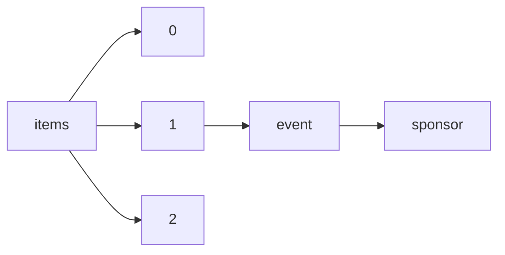

!!! warning "This document is not official Crossref documentation"
# Sponsor
PATH = items/array/event/sponsor(1)  
Occurs 898 932 times  
{ .annotate }

1. A route to an element, for example:  
   The route "items/array/event/sponsor" corresponds to navigating through the JSON indices as  
   ["items"][0]["event"]["sponsor"]  

## Properties of Array
See information about elements: [items/array/event/sponsor/array](array/index.md)  
Distribution of lengths:  

| **Row** | **Length** `Any` | **Count** `Int64` |
|--------:|--------------------:|---------------------:|
| **1**   | 1                   | 672 173              |
| **2**   | 2                   | 134 809              |
| **3**   | 3                   | 48 169               |
| **4**   | 4                   | 16 501               |
| **5**   | 5                   | 6 996                |
| **6**   | 6                   | 9 621                |
| **7**   | 7                   | 3 398                |
| **8**   | 8                   | 2 744                |
| **9**   | 9                   | 2 942                |
| **10**  | 10                  | 1 579                |

