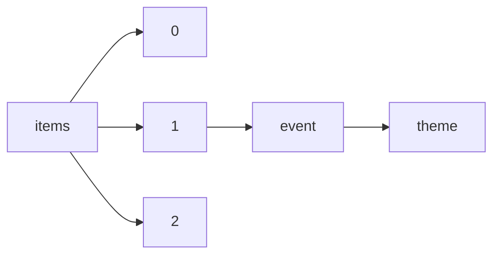

!!! warning "This document is not official Crossref documentation"
# Theme
PATH = items/array/event/theme(1)  
Occurs 117 880 times  
Unique values: > 999  
{ .annotate }

1. A route to an element, for example:  
   The route "items/array/event/theme" corresponds to navigating through the JSON indices as  
   ["items"][0]["event"]["theme"]  

!!! note "Due to current limitations, only the first 1,000 unique values are counted."

| **Row** | **Value** `String`                                                                                                       | **Count** `Int64` |
|--------:|----------------------------------------------------------------------------------------------------------------------------:|---------------------:|
| **1**   | Computer Aided Architectural Design                                                                                         | 7 374                |
| **2**   | Artificial Intelligence                                                                                                     | 5 216                |
| **3**   | Machine Vision, Image Processing & Pattern Recognition                                                                      | 3 019                |
| **4**   | Computational Methods in Applied Sciences and Engineering                                                                   | 2 818                |
| **5**   | Real Estate                                                                                                                 | 2 747                |
| **6**   | Science and Technology of Solid-State Sensors, Actuators, and Microsystems                                                  | 1 488                |
| **7**   | Oral Presentations                                                                                                          | 1 431                |
| **8**   | Forschung heute – Zukunft morgen                                                                                            | 1 312                |
| **9**   | Design, automation, and test                                                                                                | 1 150                |
| **10**  | Deutsche Gesellschaft für Hals-Nasen-Ohren-Heilkunde, Kopf- und Hals-Chirurgie e.V., Bonn                                   | 986                  |
| **11**  | Contribuições da Engenharia de Produção para a Gestão de Operações Energéticas Sustentáveis                                 | 784                  |
| **12**  | A Engenharia de Produção e suas contribuições para o desenvolvimento do Brasil                                              | 748                  |
| **13**  | Uso Racional da Água na Agricultura Irrigada                                                                                | 742                  |
| **14**  | Deep-Inelastic Scattering and Related Subjects                                                                              | 711                  |
| **15**  | Frauenheilkunde im Fokus: wissenschaftlich fundiert und der Qualität verpflichtet                                           | 687                  |
| **16**  | Information Science and Management Engineering                                                                              | 662                  |
| **17**  | Robot Operating System (ROS)                                                                                                | 633                  |
| **18**  | Urban Regeneration and Sustainability                                                                                       | 623                  |
| **19**  | Os desafios da engenharia de produção para uma gestão inovadora da Logística e Operações                                    | 612                  |
| **20**  | 72. Jahrestagung der Deutschen Gesellschaft für Gastroenterologie, Verdauungs- und Stoffwechselkrank                        | 607                  |
| **21**  | 65th International Congress and Annual Meeting of the Society for Medicinal Plant and Natural Produc                        | 586                  |
| **22**  | A Engenharia de Produção e as novas tecnologias produtivas: indústria 4.0, manufatura aditiva e outr                        | 561                  |
| **23**  | Solar Energy and Buildings                                                                                                  | 544                  |
| **24**  | 74. Jahrestagung der Deutschen Gesellschaft für Gastroenterologie, Verdauungs- und Stoffwechselkrank                        | 532                  |
| **25**  | Gestão de Riscos e Resiliência de cadeias de suprimentos em crises globais                                                  | 513                  |
| **26**  | Contribuição da Engenharia de Produção para a Transformação Digital da Indústria Brasileira                                 | 499                  |
| **27**  | Solar Heating and Cooling, Solar Buildings, Renewable Electricity, Rural Energy Supply Resource Ass                        | 491                  |
| **28**  | Asia Pacific Confederation of Chemical Engineering Congress                                                                 | 481                  |
| **29**  | Engineering the Future                                                                                                      | 466                  |
| **30**  | Solar Energy                                                                                                                | 462                  |
| **31**  | Gemeinsame Jahrestagung – der Deutschen Gesellschaft für Epidemiologie e.V. (DGEpi), – der Deutschen                        | 453                  |
| **32**  | There is nothing so practical as a good theory                                                                              | 446                  |
| **33**  | Earth and Planetary Sciences                                                                                                | 431                  |
| **34**  | Engineering for Progress, Nature and People                                                                                 | 427                  |
| **35**  | Global Solutions for Future Application                                                                                     | 427                  |
| **36**  | Novel Computing Architectures                                                                                               | 411                  |
| **37**  | Sustainable Development and Planning                                                                                        | 407                  |
| **38**  | Structural Dynamics                                                                                                         | 404                  |
| **39**  | Urban Transport and the Environment                                                                                         | 404                  |
| **40**  | International Scientific Conference on Information Technology and Data Related Research                                     | 402                  |
| **41**  | The Evolving Metropolis                                                                                                     | 394                  |
| **42**  | Structural Engineering and Construction                                                                                     | 391                  |
| **43**  | A Computação na perspectiva da diversidade, inclusão e inovação na educação para o século XXI                               | 384                  |
| **44**  | Large Structures and Infrastructures for Environmentally Constrained and Urbanised Areas                                    | 379                  |
| **45**  | Aprendizagem das Coisas                                                                                                     | 372                  |
| **46**  | Informática na Educação: Educação e Empreendedorismo                                                                        | 364                  |
| **47**  | Gemeinsame Jahrestagung der Deutschen Gesellschaft für Medizinische Soziologie (DGMS) und der Deutsc                        | 356                  |
| **48**  | Challenges in Design and Construction of an Innovative and Sustainable Built Environment                                    | 356                  |
| **49**  | Achieving the Renewable Energy Transformation                                                                               | 350                  |
| **50**  | Nano-Materials for Electronics, Energy and Environment                                                                      | 342                  |
| **51**  | Solar Heating, Cooling and Buildings                                                                                        | 327                  |
| **52**  | Bridge to the iERA - Innovative Energy, Robotics & Automation                                                               | 326                  |
| **53**  | Design, Automation and Test                                                                                                 | 324                  |
| **54**  | Thermal Spray: Explore Its Surfacing Potential                                                                              | 324                  |
| **55**  | 58. Jahrestagung der Deutschen Gesellschaft für Nuklearmedizin                                                              | 322                  |
| **56**  | Inovação e Empreendedorismo no Desenvolvimento Tecnológico e Educacional                                                    | 320                  |
| **57**  | Let's build the future through learning innovation.                                                                         | 312                  |
| **58**  | Ciência, Inovação e Empreendedorismo: Integração Latino-Americana pela Educação                                             | 309                  |
| **59**  | Design, Automation & Test in Europe Conference & Exhibition                                                                 | 308                  |
| **60**  | Tomorrow’s Megastructures                                                                                                   | 307                  |
| **61**  | common ground                                                                                                               | 302                  |
| **62**  | Radiologie verbindet                                                                                                        | 295                  |
| **63**  | Computational Mechanics and Simulation                                                                                      | 293                  |
| **64**  | Plant Biotechnology; Microbe Biotechnology; Plant–Microbe Symbiosis                                                         | 292                  |
| **65**  | Quality and efficiency in eLearning                                                                                         | 290                  |
| **66**  | Crossing Borders                                                                                                            | 290                  |
| **67**  | Deutsche Gesellschaft für Perinatale Medizin (DGPM)                                                                         | 289                  |
| **68**  | Structural Engineering: Providing Solutions to Global Challenges                                                            | 287                  |
| **69**  | eLearning challenges and new horizons                                                                                       | 285                  |
| **70**  | 57. Jahrestagung der Deutschen Gesellschaft für Nuklearmedizin                                                              | 285                  |
| **71**  | Improving Infrastructure Worldwide                                                                                          | 285                  |
| **72**  | Sustainable Infrastructure - Environment Friendly, Safe and Resource Efficient                                              | 281                  |
| **73**  | Einheit in Vielfalt                                                                                                         | 280                  |
| **74**  | Bridges and Structures: Connection, Integration and Harmonisation                                                           | 280                  |
| **75**  | Innovative Infrastructures – Towards Human Urbanism                                                                         | 280                  |
| **76**  | Rethinking education by leveraging the eLearning pillar of the Digital Agenda for Europe                                    | 275                  |
| **77**  | eLearning Vision 2020!                                                                                                      | 275                  |
| **78**  | Meeting the Challenges of the 21st Century                                                                                  | 274                  |
| **79**  | Assessment, Upgrading and Refurbishment of Infrastructures                                                                  | 269                  |
| **80**  | Multi-Material Micro Manufacture                                                                                            | 268                  |
| **81**  | Diabetes – Nicht nur eine Typ-Frage – www.diabeteskongress.de                                                               | 267                  |
| **82**  | Could technology support learning efficiency?                                                                               | 265                  |
| **83**  | Management Innovation and Information Technology                                                                            | 262                  |
| **84**  | Creating and Renewing Urban Structures – Tall Buildings, Bridges and Infrastructure                                         | 258                  |
| **85**  | Science, Innovation, and Application                                                                                        | 255                  |
| **86**  | Learning, innovation                                                                                                        | 255                  |
| **87**  | Defining Our Future                                                                                                         | 254                  |
| **88**  | Waste Management and the Environment                                                                                        | 253                  |
| **89**  | Modelling, Monitoring and Management of Air Pollution                                                                       | 253                  |
| **90**  | Engineering management in manufacturing, civil project and transportation                                                   | 253                  |
| **91**  | Manufacture Engineering and Environment Engineering                                                                         | 249                  |
| **92**  | Simulation---a bridge to the future                                                                                         | 248                  |
| **93**  | Advancing the Science and Applying the Technology                                                                           | 247                  |
| **94**  | Structural Engineering for Future Societal Needs                                                                            | 246                  |
| **95**  | eLearning sustainment for never-ending learning                                                                             | 246                  |
| **96**  | Challenges for Existing and Oncoming Structures                                                                             | 245                  |
| **97**  | Elegance in structures                                                                                                      | 244                  |
| **98**  | Tecnologias Digitais e Educação: Integração, Mediação e Construção de Conhecimento                                          | 243                  |
| **99**  | Conhecimento para negócios e desenvolvimento social                                                                         | 243                  |
| **100** | „Wissenschaft und klinischer Fortschritt – gemeinsam in die Zukunft“ – www.diabeteskongress.de                              | 242                  |
| **101** | Geoestatística Aplicada em Ciências Agrárias                                                                                | 239                  |
| **102** | Towards a Resilient Built Environment Risk and Asset Management                                                             | 239                  |
| **103** | Structural Engineering for Meeting Urban Transportation Challenges                                                          | 237                  |
| **104** | Inovações, Desafios, e oportunidades para o uso sustentável, a conservação das florestas brasileiras                        | 234                  |
| **105** | Metropolitan Habitats and Infrastructure                                                                                    | 232                  |
| **106** | Having Wonderful Ideas: Connecting the Content, Outcomes, and Pedagogies of Physics                                         | 228                  |
| **107** | Energy and Sustainability                                                                                                   | 227                  |
| **108** | Algorithms & Computation Theory                                                                                             | 226                  |
| **109** | Information Systems & Technology Management                                                                                 | 224                  |
| **110** | Towards a Better Built Environment - Innovation, Sustainability, Information Technology                                     | 224                  |
| **111** | From Demonstration to Practical Use                                                                                         | 223                  |
| **112** | Global Coating Solutions                                                                                                    | 219                  |
| **113** | Services Science and Services Information Technology                                                                        | 216                  |
| **114** | Sinkholes and the Engineering and Environmental Impacts of Karst                                                            | 215                  |
| **115** | EMECS&rsquo;11 &ndash; Sea Coasts &rsquo;XXVI Joint Conference &ldquo;Managing Risks to Coastal Regi                        | 214                  |
| **116** | Food is Life                                                                                                                | 214                  |
| **117** | Expanding Thermal Spray Performance to New Areas                                                                            | 212                  |
| **118** | Responding to Tomorrow's Challenges in Structural Engineering                                                               | 209                  |
| **119** | Transport Infrastructure Development and Natural Hazards Mitigation                                                         | 208                  |
| **120** | Advances in Technology and Application                                                                                      | 208                  |
| **121** | New technology and redesigning learning spaces                                                                              | 208                  |
| **122** | Modern Engineering Solutions for the Industry                                                                               | 208                  |
| **123** | Computational Methods and Experimental Measurements                                                                         | 208                  |
| **124** | Advancements and Achievements in Structural Steel                                                                           | 206                  |
| **125** | Impact of the Internet on Business Activities in Serbia and Worldwide                                                       | 205                  |
| **126** | looking to the future                                                                                                       | 204                  |
| **127** | Präzisionsmedizin – Eine Reise in die Zukunft der Diabetologie www.diabeteskongress.de                                      | 204                  |
| **128** | Praticle Technology: Fundamentals and Applications for Nanotechnology, Biotechnology and Energy Rese                        | 202                  |
| **129** | Surface Engineering via Applied Research                                                                                    | 202                  |
| **130** | Advances in Fluid Mechanics                                                                                                 | 200                  |
| **131** | Fire and Explosion Hazards                                                                                                  | 198                  |
| **132** | Artificial Neural Networks, Computational Intelligence, Machine Learning                                                    | 198                  |
| **133** | Science meets clinical practice                                                                                             | 196                  |
| **134** | Information Engineering                                                                                                     | 194                  |
| **135** | Education & Technology in (Post)pandemic times                                                                              | 193                  |
| **136** | New Surfaces for a New Millennium                                                                                           | 191                  |
| **137** | Sustainable Development                                                                                                     | 190                  |
| **138** | 59. Jahrestagung der Deutschen Gesellschaft für Nuklearmedizin                                                              | 187                  |
| **139** | Innovative Coating Solutions for a Global Economy                                                                           | 187                  |
| **140** | Future Energy, Environment and Materials                                                                                    | 186                  |
| **141** | Boundary Elements and Other Mesh Reduction Methods                                                                          | 186                  |
| **142** | Solar Energy for Buildings and Industry                                                                                     | 185                  |
| **143** | Cavitation                                                                                                                  | 184                  |
| **144** | Be There!                                                                                                                   | 184                  |
| **145** | Hand in Hand zum Ziel – einfach.besser.messbar www.diabeteskongress.de                                                      | 183                  |
| **146** | Architecture                                                                                                                | 181                  |
| **147** | Industry 4.0 for Resilient Urbanization                                                                                     | 180                  |
| **148** | Foundations for a CSCL Community                                                                                            | 179                  |
| **149** | LEVERAGING TECHNOLOGY FOR LEARNING                                                                                          | 178                  |
| **150** | Building the Future in Automation and Robotics                                                                              | 176                  |
| **151** | Information Technology and Industrial Engineering                                                                           | 176                  |
| **152** | Computer System Design and Operation in the Railway and Other Transit Systems                                               | 172                  |
| **153** | Communication Technology                                                                                                    | 171                  |
| **154** | Drying Technology                                                                                                           | 170                  |
| **155** | Human Health and Medical Engineering                                                                                        | 170                  |
| **156** | Expanding Horizons                                                                                                          | 169                  |
| **157** | Structures for High-Speed Railway Transportation                                                                            | 167                  |
| **158** | Resilient technologies for sustainable infrastructure                                                                       | 167                  |
| **159** | International Scientific Conference of IT and Business-Related Research                                                     | 167                  |
| **160** | Sustainable Tourism                                                                                                         | 163                  |
| **161** | Long Span Bridges and Roofs - Development, Design and Implementation                                                        | 163                  |
| **162** | Oncology                                                                                                                    | 163                  |
| **163** | Simulation and Modeling Methodologies, Technologies and Applications                                                        | 163                  |
| **164** | Paradigmas na Formação de Recursos Humanos em Ciências Florestais                                                           | 162                  |
| **165** | Air Pollution                                                                                                               | 161                  |
| **166** | Cable-Supported Bridges - Challenging Technical Limits                                                                      | 161                  |
| **167** | CNEG & Inovarse 2022                                                                                                        | 161                  |
| **168** | Wind Engineering                                                                                                            | 161                  |
| **169** | Dynamics and Innovation, Cultivate Debate, Footbridges for Berlin                                                           | 161                  |
| **170** | Thermal Spray Science and Applications                                                                                      | 158                  |
| **171** | Engineering the Developing World                                                                                            | 157                  |
| **172** | Structures and Extreme Events                                                                                               | 157                  |
| **173** | Geotechnical Conference                                                                                                     | 156                  |
| **174** | Safety and Security Engineering                                                                                             | 156                  |
| **175** | Information und Programm: www.senologiekongress.de                                                                          | 156                  |
| **176** | Information and Communication Technology for Education                                                                      | 155                  |
| **177** | Education, Social Sciences and Technology Application in Digital Era                                                        | 155                  |
| **178** | ICrtSIV – 2015                                                                                                              | 154                  |
| **179** | High Performance Structures and Materials                                                                                   | 154                  |
| **180** | 69. Wissenschaftlicher Kongress des Bundesverbandes der Ärztinnen und Ärzte des Öffentlichen Gesundh                        | 153                  |
| **181** | Enterprise Management, Finance Engineering, International Economy: Problems of Innovation and Market                        | 153                  |
| **182** | Sustainable Water Resources Management                                                                                      | 153                  |
| **183** | 41. Dreiländertreffen ÖGUM, DEGUM, SGUM                                                                                     | 152                  |
| **184** | Engineering Education Research Capability Development                                                                       | 150                  |
| **185** | Harmonisation between Architecture and Nature                                                                               | 150                  |
| **186** | Energy Production and Management                                                                                            | 149                  |
| **187** | Green Communications and Networks                                                                                           | 149                  |
| **188** | Singidunum International Tourism Conference                                                                                 | 147                  |
| **189** | Advances in Steel Concrete Composite and Hybrid Structures                                                                  | 147                  |
| **190** | Earth Science and Environmental Protection                                                                                  | 147                  |
| **191** | Reliability Engineering and Risk Management                                                                                 | 147                  |
| **192** | 4M/ICOMM2015 Conference                                                                                                     | 146                  |
| **193** | New Waves of Thermal Spray for Sustainable Growth                                                                           | 146                  |
| **194** | Although the Annual Meeting ends on Wednesday the 16th, NPIC&HMIT 2021 continues on Thursday the 17t                        | 145                  |
| **195** | Agroengineering innovation                                                                                                  | 144                  |
| **196** | Geographic Information Science                                                                                              | 142                  |
| **197** | Computational Methods and Experiments in Materials Characterisation                                                         | 142                  |
| **198** | United Forum for Science and Technology Advances                                                                            | 140                  |
| **199** | Automation, Mechanical and Electrical Engineering                                                                           | 136                  |
| **200** | Cardiology                                                                                                                  | 136                  |
| **201** | Synergy of Culture and Civil Engineering – History and Challenges                                                           | 135                  |
| **202** | Creating Experience                                                                                                         | 134                  |
| **203** | Earthquake Resistant Engineering Structures                                                                                 | 134                  |
| **204** | Collaboration between Academia and Industry                                                                                 | 133                  |
| **205** | Practical Solutions for Engineering Problems                                                                                | 133                  |
| **206** | ГрафиКон-2019&nbsp;&ndash; 29-я Международная конференция по компьютерной графике и машинному зрению                        | 133                  |
| **207** | Bridges and Structures Sustainability - Seeking Intelligent Solutions                                                       | 132                  |
| **208** | Future Computer and Information Technology                                                                                  | 131                  |
| **209** | Advanced Coatings for the Aerospace Industry                                                                                | 129                  |
| **210** | International Conference on Steel & Composite Structures                                                                    | 128                  |
| **211** | Maintenance and Rehabilitation of Pavements                                                                                 | 128                  |
| **212** | Learning innovation                                                                                                         | 128                  |
| **213** | Öffentlicher Gesundheitsdienst (ÖGD), Bundesverband der Ärztinnen und Ärzte des Öffentlichen Gesundh                        | 125                  |
| **214** | Connected to the Future                                                                                                     | 125                  |
| **215** | mid-80's perspective                                                                                                        | 125                  |
| **216** | Surface Solutions                                                                                                           | 125                  |
| **217** | Edificações, Materiais e Comunidades                                                                                        | 125                  |
| **218** | From Vacuum Tubes to Nanotubes                                                                                              | 124                  |
| **219** | Automation; Robot technology and robotics application; Automated data acquisition and monitoring; In                        | 124                  |
| **220** | Management of Natural Resources, Sustainable Development and Ecological Hazards                                             | 123                  |
| **221** | e-Learning                                                                                                                  | 123                  |
| **222** | Materials and Information Technology Processing                                                                             | 122                  |
| **223** | Sustainable Civil Infrastructures - Hazards, Risk, Uncertainty                                                              | 121                  |
| **224** | Numerical Methods for Engineering                                                                                           | 120                  |
| **225** | Mathematization and Physics Education Research                                                                              | 120                  |
| **226** | Artificial Intelligence and Industrial Application                                                                          | 118                  |
| **227** | Mechanical, Information and Industrial Engineering                                                                          | 118                  |
| **228** | MOT for the World of the Future                                                                                             | 117                  |
| **229** | Giza Zientziak, Artea, Gizarte Zientziak, Zuzenbidea, Ingeniaritza, Arkitektura, Osasun Zientziak, Z                        | 117                  |
| **230** | Striving for 100% Success Rate                                                                                              | 117                  |
| **231** | Structures Under Shock and Impact                                                                                           | 117                  |
| **232** | Environmental Science and Biological Engineering                                                                            | 116                  |
| **233** | Industrial Electronics and Engineering                                                                                      | 116                  |
| **234** | The Next Generation FA Engineer                                                                                             | 116                  |
| **235** | Computational and Experimental Methods in Multiphase and Complex Flow                                                       | 115                  |
| **236** | Water Resources                                                                                                             | 115                  |
| **237** | Ecosystems and Sustainable Development                                                                                      | 114                  |
| **238** | Architecture, civil engineering                                                                                             | 114                  |
| **239** | Sport Science and Computer Science                                                                                          | 114                  |
| **240** | Qualitative Theory of Differential Equations                                                                                | 113                  |
| **241** | International Conference on Emerging Trends in Engineering & Technology                                                     | 112                  |
| **242** | states of the art and practice                                                                                              | 112                  |
| **243** | Expand Failure Analysis by Empowering Innovation                                                                            | 110                  |
| **244** | Water and Society                                                                                                           | 110                  |
| **245** | Advanced Computer Control                                                                                                   | 110                  |
| **246** | Modelling and Measurement in Medicine and Health                                                                            | 110                  |
| **247** | High Performance and Optimum Design of Structures and Materials                                                             | 109                  |
| **248** | Saúde e Bem Estar, e Educação de Qualidade                                                                                  | 109                  |
| **249** | part 2                                                                                                                      | 109                  |
| **250** | Neurology                                                                                                                   | 108                  |
| **251** | part 1                                                                                                                      | 108                  |
| **252** | Hydrology, Ecology, Environmental Management, Flood Plains and Wetlands                                                     | 107                  |
| **253** | One Step Beyond                                                                                                             | 107                  |
| **254** | Тематика конференции:\r\n\r\n\r\n\tПрименение САПР в современной промышленности.\r\n\tИнформационно-измеритель              | 107                  |
| **255** | Versatile Surface Eng for Environmental Solutions                                                                           | 107                  |
| **256** | Environmental Health Risk                                                                                                   | 107                  |
| **257** | Pulmonology                                                                                                                 | 106                  |
| **258** | Creativity and Collaboration – Instilling Imagination and Innovation in Structural Design                                   | 106                  |
| **259** | Sustainable and Innovative Urban Rail Transportation System                                                                 | 105                  |
| **260** | РГ&nbsp;&laquo;Морские берега&raquo; Совета РАН по&nbsp;проблемам Мирового океана и&nbsp;Мурманский                         | 105                  |
| **261** | Quality, Reliability, Risk, Maintenance and Safety Engineering                                                              | 105                  |
| **262** | The Impact of Environmental Factors on Health                                                                               | 104                  |
| **263** | Civil, Transportation and Envrironmental Engineering                                                                        | 104                  |
| **264** | Architecture, software, computer systems, and general issues                                                                | 102                  |
| **265** | Dermatology                                                                                                                 | 101                  |
| **266** | Who is afraid of aging?                                                                                                     | 101                  |
| **267** | Earthquake Engineering                                                                                                      | 101                  |
| **268** | Exploring the Many Facets of Failure Analysis                                                                               | 101                  |
| **269** | Innovative Wooden Structures and Bridges                                                                                    | 101                  |
| **270** | A Methodological Approach to PER                                                                                            | 101                  |
| **271** | Chasing Ever-Smaller and More Elusive Defects                                                                               | 101                  |
| **272** | Failures Worth Analyzing                                                                                                    | 101                  |
| **273** | learning 2005: the next 10 years!                                                                                           | 101                  |
| **274** | Challenge and Trends for Sustainability in the 21st Century                                                                 | 100                  |
| **275** | Computer Science and Technology                                                                                             | 100                  |
| **276** | Insights, Reflections, & Future Directions: Emergent Themes in the Evolving PER Community                                   | 100                  |
| **277** | Modelling, Monitoring and Management of Water Pollution                                                                     | 99                   |
| **278** | Reaching through technology                                                                                                 | 99                   |
| **279** | The Future Site                                                                                                             | 99                   |
| **280** | International Scientific Conference on ICT and E-Business Related Research                                                  | 97                   |
| **281** | Poštanske i telekomunikacione tehnologije                                                                                   | 96                   |
| **282** | Critical examination of laboratory-centered instruction and experimental research in physics educati                        | 96                   |
| **283** | Railway Engineering Design and Optimization                                                                                 | 96                   |
| **284** | Computer system design and operation in the railway and other transit systems                                               | 96                   |
| **285** | Civil, Urban and Environmental Engineering                                                                                  | 95                   |
| **286** | Riding the Wave of System-in-Package (SIP)                                                                                  | 95                   |
| **287** | Consumer Electronics, Communications and Networks                                                                           | 95                   |
| **288** | Ground Improvement Technologies and Case Histories                                                                          | 95                   |
| **289** | Biomedical Engineering and Environmental Engineering                                                                        | 95                   |
| **290** | Management Engineering and Information Technology                                                                           | 95                   |
| **291** | Communication Technology and Application                                                                                    | 94                   |
| **292** | From Fearing Physics to Having Fun with Physics: Exploring the Affective Domain of Physics Learning                         | 94                   |
| **293** | Follow the Data                                                                                                             | 93                   |
| **294** | Science and Engineering                                                                                                     | 93                   |
| **295** | Water Pollution                                                                                                             | 93                   |
| **296** | Information Management and Management Engineering                                                                           | 92                   |
| **297** | investigación y docencia                                                                                                    | 92                   |
| **298** | Environment and Sustainability                                                                                              | 91                   |
| **299** | Design, Construction, Maintenance, Monitoring and Control of Urban Water Systems                                            | 91                   |
| **300** | Electrical and Electronics Engineering                                                                                      | 91                   |
| **301** | Information and Communication Technology (ICT) for Bridges, Buildings and Construction Practice                             | 91                   |
| **302** | Urban transport and the environment in the 21st Century                                                                     | 90                   |
| **303** | 8-я Международная конференция &laquo;Физико-техническая информатика - CPT2020&raquo; состоится&nbsp;                        | 90                   |
| **304** | Представлены материалы антропогенных изменений биосферы и их влиянию на организм; зависимости здоров                        | 90                   |
| **305** | Ethnologie                                                                                                                  | 90                   |
| **306** | International Conference on Steel and Aluminium Structures                                                                  | 90                   |
| **307** | Computational Intelligence and Industrial Engineering                                                                       | 90                   |
| **308** | Healthy Aging – Bone and Joint                                                                                              | 89                   |
| **309** | Comparing Design in Nature with Science and Engineering                                                                     | 89                   |
| **310** | World Congress on Micro and Nano Manufacturing                                                                              | 89                   |
| **311** | Medical Engineering and Bioinformatics                                                                                      | 89                   |
| **312** | Communication Technology and Systems                                                                                        | 88                   |
| **313** | Sustainable Tall Buildings                                                                                                  | 88                   |
| **314** | Finding the Invisible Defect                                                                                                | 87                   |
| **315** | 19. Dreiländertagung der Deutschen Gesellschaft für Ernährungsmedizin e.V. (DGEM) der Österreichisch                        | 87                   |
| **316** | Information und Programm: www.gfgb.org                                                                                      | 87                   |
| **317** | 17. Dreiländertagung – der Deutschen Gesellschaft für Ernährungsmedizin e.V. (DGEM) – der Österreich                        | 87                   |
| **318** | Fluid Structure Interaction                                                                                                 | 85                   |
| **319** | Gizarte Zientziak eta Zuzenbidea                                                                                            | 85                   |
| **320** | Turning the Corner                                                                                                          | 85                   |
| **321** | Flood Recovery, Innovation and Response                                                                                     | 85                   |
| **322** | Queering Physics Education                                                                                                  | 85                   |
| **323** | Computer Science and Systems Engineering                                                                                    | 84                   |
| **324** | Advanced Control, Automation and Robotoics                                                                                  | 84                   |
| **325** | 10th International Conference on Sustainable Development and Planning                                                       | 84                   |
| **326** | Modelling, Monitoring and Management of Forest Fires                                                                        | 84                   |
| **327** | III&nbsp;Международная&nbsp;научно-практическая&nbsp;конференция&nbsp;&laquo;САПР и моделирование в                         | 84                   |
| **328** | International Conference on Advances in Computer Science and Electronics Engineering                                        | 84                   |
| **329** | Mycenean and Homeric Societies - Collected Papers                                                                           | 84                   |
| **330** | V Международная&nbsp;научно-практическая&nbsp;конференция&nbsp;&laquo;САПР и моделирование в совреме                        | 83                   |
| **331** | Absage der Veranstaltung wegen der Corona-Pandemie                                                                          | 83                   |
| **332** | Boundary Elements and other Mesh Reduction Methods                                                                          | 82                   |
| **333** | Sustainable Irrigation Management, Technologies and Policies                                                                | 82                   |
| **334** | Management of natural resources, sustainable development and ecological hazards                                             | 82                   |
| **335** | Structural Engineering                                                                                                      | 81                   |
| **336** | The key block theory and its engineering applications, the discontinuous deformation analysis (DDA)                         | 81                   |
| **337** | Projetos Complexos e os Impactos na Cidade e na Paisagem                                                                    | 80                   |
| **338** | Life Doesn't Give us Purpose. We Give Life Purpose.                                                                         | 80                   |
| **339** | Promotion of Mechanism and Machine Science                                                                                  | 79                   |
| **340** | Transport Engineering                                                                                                       | 79                   |
| **341** | Urban regeneration and sustainability                                                                                       | 79                   |
| **342** | Innovation at the NHP/Food Interface                                                                                        | 78                   |
| **343** | 7th International Workshop on Planetary, Solar and Heliospheric Radio Emissions                                             | 78                   |
| **344** | Modelling, monitoring and management of air pollution                                                                       | 78                   |
| **345** | part 3                                                                                                                      | 78                   |
| **346** | Making Physics More Inclusive and Eliminating Exclusionary Practices in Physics                                             | 78                   |
| **347** | the CHI is the limit                                                                                                        | 78                   |
| **348** | meeting the challenge of complexity in real-world computing applications                                                    | 77                   |
| **349** | ICISTSI – 2015                                                                                                              | 77                   |
| **350** | Physical Coastal Processes, Management and Engineering                                                                      | 77                   |
| **351** | Karst in New Mexico in recognition of 2022 being the International Year of Caves and Karst                                  | 76                   |
| **352** | Role of Structural Engineers towards Reduction of Poverty                                                                   | 76                   |
| **353** | Osasun Zientziak                                                                                                            | 76                   |
| **354** | 8th International Workshop on Planetary, Solar and Heliospheric Radio Emissions                                             | 76                   |
| **355** | Aktive Vielfalt für Patienten, Ärzte, Tierärzte und Apotheker                                                               | 76                   |
| **356** | Creative Management in Construction                                                                                         | 76                   |
| **357** | Anais do I Congresso Brasileiro Interdisciplinar em Ciência e Tecnologia                                                    | 76                   |
| **358** | Ada's role in global markets: solutions for a changing complex world                                                        | 75                   |
| **359** | Continuing Engineering Education                                                                                            | 75                   |
| **360** | Environmental Geology and Hydrology                                                                                         | 74                   |
| **361** | Solid State Ionics Conference                                                                                               | 74                   |
| **362** | Additive Manufacturing Conference                                                                                           | 74                   |
| **363** | В сборнике представлены материалы Всероссийской научно-практической конференции &laquo;Современные м                        | 74                   |
| **364** | Wings for the mind                                                                                                          | 74                   |
| **365** | 16. Dreiländertagung der Gesellschaft für Klinische Ernährung der Schweiz (GESKES), der Österreichis                        | 73                   |
| **366** | 9th International Conference on Sustainable Development and Planning                                                        | 73                   |
| **367** | Intelligent System; Advanced Materials                                                                                      | 73                   |
| **368** | Empowering people                                                                                                           | 72                   |
| **369** | Urban Transport and the Environment in the 21st Century                                                                     | 72                   |
| **370** | The new e-commerce: innovations for conquering current barriers, obstacles and limitations to conduc                        | 72                   |
| **371** | International Symposium on Mechatronics                                                                                     | 72                   |
| **372** | river flooding                                                                                                              | 72                   |
| **373** | For Fuel Cells, Heat Pumps and Sorption Systems                                                                             | 71                   |
| **374** | Fluid Mechanics                                                                                                             | 71                   |
| **375** | Operation, Maintenance and Rehabilitation of Large Infrastructure Projects, Bridges and Tunnels                             | 71                   |
| **376** | Be there!                                                                                                                   | 70                   |
| **377** | Geohazards in New Mexico and Surrounding Areas                                                                              | 70                   |
| **378** | Outpacing New Technologies with Novel Pedagogies: The Role of PER in the Transforming Landscape of H                        | 70                   |
| **379** | High performance structures and materials                                                                                   | 70                   |
| **380** | celebrating interdependence                                                                                                 | 70                   |
| **381** | В сборнике представлены материалы международного научно-практического форума &laquo;Менеджер года&ra                        | 70                   |
| **382** | Short Papers                                                                                                                | 69                   |
| **383** | Ingeniaritza eta Arkitektura                                                                                                | 69                   |
| **384** | Studies, Repairs and Maintenance of Heritage Architecture                                                                   | 69                   |
| **385** | В настоящее время проблемы обеспечения экономической безопасности на всех уровнях &ndash; от предпри                        | 69                   |
| **386** | interdisciplinary                                                                                                           | 68                   |
| **387** | Uranium in New Mexico: the Resource and the Legacy                                                                          | 68                   |
| **388** | Manifestations of Mantle-to-surface Connections in the Southwest                                                            | 68                   |
| **389** | Due to safety considerations in connection with the spread of SARS-CoV-2, this meeting was cancelled                        | 68                   |
| **390** | Remote Sensing and Smart City                                                                                               | 67                   |
| **391** | setting the direction                                                                                                       | 67                   |
| **392** | Electroengineering                                                                                                          | 67                   |
| **393** | Micro Manufacture                                                                                                           | 67                   |
| **394** | APL in transition                                                                                                           | 66                   |
| **395** | zur 35. Jahrestagung der Deutschen Adipositas-Gesellschaft e.V. (DAG)                                                       | 66                   |
| **396** | Advances in Foundation Engineering                                                                                          | 65                   |
| **397** | physics                                                                                                                     | 65                   |
| **398** | Computational Stochastic Mechanics                                                                                          | 65                   |
| **399** | Advances in fluid mechanics                                                                                                 | 64                   |
| **400** | winning the networking game                                                                                                 | 64                   |
| **401** | Design and Operation in Railway Engineering                                                                                 | 64                   |
| **402** | Disaster Management and Human Health: Reducing Risk, Improving Outcomes                                                     | 63                   |
| **403** | Emerging Engineering Applications                                                                                           | 63                   |
| **404** | Guidebook 66 - Geology of the Las Vegas Area                                                                                | 63                   |
| **405** | Structural Studies, Repairs and Maintenance of Heritage Architecture.                                                       | 63                   |
| **406** | Rubber Chemistry                                                                                                            | 63                   |
| **407** | Environmental and Economic Impact on Sustainable Development incorportaing Environmental Economics,                         | 63                   |
| **408** | Modelling, monitoring and management of water pollution                                                                     | 63                   |
| **409** | Paleoclimate: Is the past a key to the future                                                                               | 63                   |
| **410** | Recent developments in the theoretical and practical aspects of Safety and Security Engineering.                            | 62                   |
| **411** | ‚BGGF 2020‘–Frauenheilkunde in den 20er Jahren; Absage der Veranstaltung wegen der Corona-Pandemie                          | 62                   |
| **412** | Waste management and the environment                                                                                        | 62                   |
| **413** | May 6-8, 1996                                                                                                               | 62                   |
| **414** | Lightning                                                                                                                   | 61                   |
| **415** | Volume 2                                                                                                                    | 61                   |
| **416** | Synergy between Academia and the Fossil Fuel Industry in New Mexico                                                         | 61                   |
| **417** | are you ready?                                                                                                              | 61                   |
| **418** | В сборнике представлены материалы XXIV Международной береговой конференции, посвященной 60-летию со                         | 61                   |
| **419** | Pengabdian Masyarakat                                                                                                       | 61                   |
| **420** | 13th International Conference on Urban Regeneration and Sustainability                                                      | 61                   |
| **421** | All About Resolution                                                                                                        | 61                   |
| **422** | held in conjunction with the 38th Annual Meeting of the Association for Computational Linguistics                           | 61                   |
| **423** | Electroengineeirng                                                                                                          | 61                   |
| **424** | Computer Simulation in Risk Analysis and Hazard Mitigation                                                                  | 60                   |
| **425** | Advances in Ground Technology & Geo-Information                                                                             | 60                   |
| **426** | Computer Application and Signal Processing                                                                                  | 60                   |
| **427** | Engineering the Past, to Meet the Needs of the Future                                                                       | 60                   |
| **428** | Cidades e comunidades inteligentes e sustentáveis, e O uso da Computação para redução das desigualda                        | 59                   |
| **429** | 26th International Conference on Modelling, Monitoring and Management of Air Pollution                                      | 59                   |
| **430** | Cognitive Science                                                                                                           | 58                   |
| **431** | Hydrology and History of  the Rio Grande                                                                                    | 58                   |
| **432** | XV ENFOC - Encontro de Iniciação Científica, XIV Fórum Científico, VI Seminário PIBID - Programa Ins                        | 58                   |
| **433** | Recent Advances in Geophysical Research in New Mexico                                                                       | 58                   |
| **434** | Ghost Ranch                                                                                                                 | 58                   |
| **435** | SUSTAINABLE DEVELOPMENT AND SOCIETAL WELLBEING IN THE CURRENT TECHNOLOGICAL ERA                                             | 58                   |
| **436** | Программа конференции включает научные доклады по следующим направлениям: системный анализ в фундаме                        | 57                   |
| **437** | Volume 3                                                                                                                    | 56                   |
| **438** | Ecosystems and sustainable development, including physical sciences and modelling.                                          | 56                   |
| **439** | Creativity & City                                                                                                           | 56                   |
| **440** | Сборник содержит результаты научно-исследовательской работы ученых разных регионов России и зарубежн                        | 55                   |
| **441** | Environmental and Economic Impact on Sustainable Development, incorporating Environmental Economics,                        | 55                   |
| **442** | today's accomplishments; tomorrow's expectations                                                                            | 55                   |
| **443** | Information Technology                                                                                                      | 55                   |
| **444** | Studies, Repairs and Maintenance of Heritage Architecture.                                                                  | 54                   |
| **445** | Risk Analysis - Simulation and Hazard Mitigation                                                                            | 54                   |
| **446** | Computer Applications - II                                                                                                  | 54                   |
| **447** | Environmental Economics and Investment Assessment                                                                           | 54                   |
| **448** | the integration challenge                                                                                                   | 54                   |
| **449** | APL and the future                                                                                                          | 54                   |
| **450** | Structures under shock and impact                                                                                           | 54                   |
| **451** | Computing & Communication Technologies                                                                                      | 54                   |
| **452** | Risk Intelligence of Infrastructures                                                                                        | 54                   |
| **453** | The 10th Annual Meeting of the Special Interest Group on Discourse and Dialogue                                             | 54                   |
| **454** | managing information technology in changing organizations                                                                   | 53                   |
| **455** | Ecology                                                                                                                     | 53                   |
| **456** | The Jemez Mountains region                                                                                                  | 53                   |
| **457** | Surface Effects and Contact Mechanics                                                                                       | 53                   |
| **458** | В научных трудах конференции представлены результаты научно-исследовательской деятельности студентов                        | 53                   |
| **459** | 7th International conference on Energy and Sustainability                                                                   | 53                   |
| **460** | 60 Years of Nitinol                                                                                                         | 53                   |
| **461** | Environmental Toxicology                                                                                                    | 53                   |
| **462** | Computer Applications - I                                                                                                   | 53                   |
| **463** | Robust Design – Coping with Hazards, Risk and Uncertainty                                                                   | 52                   |
| **464** | The management of surface and sub-surface water resources.                                                                  | 52                   |
| **465** | Trans-Pecos Region                                                                                                          | 52                   |
| **466** | Sonification for Everyday Life                                                                                              | 52                   |
| **467** | В сборнике представлены материалы Всероссийской научно-практической конференции, проведенной Воронеж                        | 52                   |
| **468** | 15th International Conference on Urban Regeneration and Sustainability                                                      | 52                   |
| **469** | Computing trends in the 1990's                                                                                              | 52                   |
| **470** | Computer Applications — Networking                                                                                          | 52                   |
| **471** | Gastroenterology                                                                                                            | 51                   |
| **472** | Harmonisation between Architecure and Nature                                                                                | 51                   |
| **473** | Models and paradigms for distributed systems structuring                                                                    | 51                   |
| **474** | Магнетизм на Земле и в Космосе                                                                                              | 51                   |
| **475** | Wissenschaftliche Abstracts der 18. Dreiländertagung Nutrition 2019                                                         | 51                   |
| **476** | Ada technology in context: application, development, and deployment                                                         | 50                   |
| **477** | processes, practices, methods, and techniques                                                                               | 50                   |
| **478** | Advances in Technology, Engineering and Computing A Multinational Colloquium                                                | 50                   |
| **479** | 12th International Conference on Urban Regeneration and Sustainability                                                      | 50                   |
| **480** | Anais da Mostra de Pesquisa em Ciência e Tecnologia 2019                                                                    | 50                   |
| **481** | Algorithms; Computation Theory                                                                                              | 50                   |
| **482** | CULTURE, HERITAGE AND TOURISM DEVELOPMENT                                                                                   | 50                   |
| **483** | Tectonic development of the southern Sangre de Cristo Mountains, New Mexico                                                 | 50                   |
| **484** | 16th International Conference on Railway Engineering Design & Operation                                                     | 50                   |
| **485** | Building Information Modelling (BIM) in Design, Construction and Operations                                                 | 49                   |
| **486** | Socorro Region  II                                                                                                          | 49                   |
| **487** | Haematology                                                                                                                 | 49                   |
| **488** | Las Cruces Country                                                                                                          | 49                   |
| **489** | Structural Repairs and Maintenance of Heritage Architecture.                                                                | 49                   |
| **490** | Volume 1                                                                                                                    | 49                   |
| **491** | concrete construction                                                                                                       | 49                   |
| **492** | Ultra: Positions and Polarities beyond Crisis                                                                               | 49                   |
| **493** | Rio Grande rift: Northern New Mexico                                                                                        | 49                   |
| **494** | Sustainability in Energy Production, Energy Storage and Distribution and Energy Management                                  | 49                   |
| **495** | 23rd International Conference on Urban Transport and the Environment                                                        | 49                   |
| **496** | Sacramento Mountains                                                                                                        | 49                   |
| **497** | Engineering and Electronics Engineering                                                                                     | 49                   |
| **498** | Evaluating How Continental Sedimentary Basins Fill: Development and Preservation of Sedimentary Succ                        | 48                   |
| **499** | Rocks of New Mexico and Adjacent States                                                                                     | 48                   |
| **500** | how computers are shaping our future                                                                                        | 48                   |
| **501** | Evolution, monitoring, simulation, management and remediation of the geological environment and land                        | 47                   |
| **502** | Serious Games Conference                                                                                                    | 47                   |
| **503** | Human interface and the user interface                                                                                      | 47                   |
| **504** | Data Mining, Protection, Detection and other Security Technologies                                                          | 47                   |
| **505** | Santa Fe country                                                                                                            | 47                   |
| **506** | Proceedings of the Association for Computing Machinery Inc. Symposium                                                       | 47                   |
| **507** | Electrical Engineering and Information Technology                                                                           | 47                   |
| **508** | Urban Development                                                                                                           | 47                   |
| **509** | Geomagnetism                                                                                                                | 47                   |
| **510** | Data, text and web mining and their business applications                                                                   | 46                   |
| **511** | Albuquerque country II                                                                                                      | 46                   |
| **512** | Advanced computational methods and experimental measurements in heat and mass transfer                                      | 46                   |
| **513** | Тематика исследований отражает широкий спектр теоретических и практических проблем юридической науки                        | 46                   |
| **514** | Business Moders Design and Innovation. The contributions of Industrial Engineering & Operations Mana                        | 46                   |
| **515** | Planet Austria                                                                                                              | 46                   |
| **516** | International Engineering Conference                                                                                        | 45                   |
| **517** | Food and Environment                                                                                                        | 45                   |
| **518** | Contemporary Financial Management                                                                                           | 45                   |
| **519** | e-Commerce in Smart connected World                                                                                         | 45                   |
| **520** | Simulation and Experiments in Heat Transfer and its Applications                                                            | 45                   |
| **521** | DIGITALIZATION. Society and Markets, Business and Public Administration                                                     | 45                   |
| **522** | Limancılık                                                                                                                  | 45                   |
| **523** | Environmental problems in coastal regions including oil and chemical spill studies                                          | 45                   |
| **524** | Scientific Advancements Enabled by Enhanced Cyberinfrastructure                                                             | 45                   |
| **525** | Risk Analysis and Hazard Mitigation                                                                                         | 45                   |
| **526** | Guidebook 67 - Geology of the Belen Area                                                                                    | 45                   |
| **527** | links, objects, time and space---structure in hypermedia systems                                                            | 45                   |
| **528** | 4th International Conference on Environmental and Economic Impact on Sustainable Development                                | 45                   |
| **529** | Prevention, Assessment, Rehabilitation and Development of Brownfield Sites                                                  | 44                   |
| **530** | Simulationin Risk Analysis and Hazard Mitigation                                                                            | 44                   |
| **531** | Computational Methods in Multiphase Flow                                                                                    | 44                   |
| **532** | В сборнике представлены материалы Всероссийской научно-технической конференции &laquo;Экологические                         | 44                   |
| **533** | 16th International Conference on Urban Regeneration and Sustainability                                                      | 44                   |
| **534** | 16. Österreichischer Kongress „Krebs bei der Frau“                                                                          | 44                   |
| **535** | 16th International Conference on Studies, Repairs and Maintenance of Heritage Architecture                                  | 44                   |
| **536** | Grapholinguistics                                                                                                           | 44                   |
| **537** | Advances in education, commerce and governance: technology’s impact on individuals, culture and soci                        | 43                   |
| **538** | Albuquerque Geology                                                                                                         | 43                   |
| **539** | Island Sustainability                                                                                                       | 43                   |
| **540** | 7th International Conference on Safety and Security Engineering                                                             | 43                   |
| **541** | Romanian Geomorphology                                                                                                      | 43                   |
| **542** | Monitoring, Simulation, Prevention and Remediation of Dense and Debris Flows                                                | 43                   |
| **543** | Railway Engineering Design and Operation                                                                                    | 43                   |
| **544** | Jahrestagung der Österreichischen Gesellschaft für Anästhesiologie, Reanimation und Intensivmedizin                         | 43                   |
| **545** | Geology of the Sierra Blanca, Sacramento, and Capitan Ranges, New Mexico                                                    | 42                   |
| **546** | Giza Zientziak eta Artea                                                                                                    | 42                   |
| **547** | Santa Rosa, Tucumcari Region                                                                                                | 42                   |
| **548** | Zientziak eta Natura Zientzia                                                                                               | 42                   |
| **549** | Southeastern Colorado Plateau                                                                                               | 42                   |
| **550** | 20. Dreiländertagung der Gesellschaft für Klinische Ernährung der Schweiz (GESKES) dem Schweizerisch                        | 42                   |
| **551** | Stuctures Under Shock and Impact                                                                                            | 42                   |
| **552** | Тема 2020 года – «Библиотека и наука: взаимодействие и перспективы развития»                                                | 42                   |
| **553** | Automation and robotics -- todays reality in construction                                                                   | 42                   |
| **554** | Din Bilimleri                                                                                                               | 41                   |
| **555** | Tribology and Design                                                                                                        | 41                   |
| **556** | Anais da Mostra de Pesquisa em Ciência e Tecnologia                                                                         | 41                   |
| **557** | Međunarodna naučna konferencija FINIZ                                                                                       | 41                   |
| **558** | Rheumatology                                                                                                                | 41                   |
| **559** | Geology of the Zuni Plateau                                                                                                 | 41                   |
| **560** | 8th International Conference on Computational Methods and Experiments in Material Characterisation                          | 41                   |
| **561** | International Symposium on Bioengineering                                                                                   | 41                   |
| **562** | Shared Task                                                                                                                 | 41                   |
| **563** | The Role of Financial Reporting in Corporate Governance                                                                     | 41                   |
| **564** | Форум, в рамках которого студенты, магистранты, аспиранты, молодые ученые представляют и обсуждают р                        | 41                   |
| **565** | 11th International Conference on Sustainable Development and Planning                                                       | 41                   |
| **566** | Western Slope (Western Colorado)                                                                                            | 41                   |
| **567** | Computational finance and its applications                                                                                  | 41                   |
| **568** | Harmonisation between architecture and nature                                                                               | 41                   |
| **569** | Geology of the Santa Fe Region                                                                                              | 40                   |
| **570** | Truth or Consequences Region                                                                                                | 40                   |
| **571** | Geology of the Jemez Region II                                                                                              | 40                   |
| **572** | Socorro region                                                                                                              | 40                   |
| **573** | Virtual Testing                                                                                                             | 40                   |
| **574** | companion volume of the Proceedings of HLT-NAACL 2003--short papers                                                         | 39                   |
| **575** | Database Systems                                                                                                            | 39                   |
| **576** | Transportation Systems and Intelligent Control                                                                              | 39                   |
| **577** | East-Central New Mexico                                                                                                     | 39                   |
| **578** | San Juan Basin IV                                                                                                           | 39                   |
| **579** | The Ruidoso Country                                                                                                         | 39                   |
| **580** | Northeastern New Mexico                                                                                                     | 39                   |
| **581** | San Juan Basin III, northwestern New Mexico                                                                                 | 39                   |
| **582** | Land of Cochise (Southeastern Arizona)                                                                                      | 39                   |
| **583** | Geology of the Chama Basin                                                                                                  | 39                   |
| **584** | tutorials & symposium                                                                                                       | 38                   |
| **585** | Education                                                                                                                   | 38                   |
| **586** | Актуальность и цель. Описание и предсказание поведения сложной биологической (&laquo;живой&raquo;) с                        | 38                   |
| **587** | Новые формы производства и предпринимательства в координатах неоиндустриального развития экономики                          | 38                   |
| **588** | Vermejo Park                                                                                                                | 38                   |
| **589** | Ada's role in software engineering                                                                                          | 38                   |
| **590** | Defence Sites: Heritage and Future                                                                                          | 38                   |
| **591** | 17th International Conference on Railway Engineering Design & Operation                                                     | 37                   |
| **592** | Melammu Symposia                                                                                                            | 37                   |
| **593** | Marshaling new technological forces: building a corporate, academic, and user-oriented triangle                             | 37                   |
| **594** | Geology of the Warm Springs Region                                                                                          | 37                   |
| **595** | Las Cruces Country II                                                                                                       | 37                   |
| **596** | Sustainable irrigation management, technologies and policies                                                                | 37                   |
| **597** | 1st International Conference on Urban Growth and the Circular Economy                                                       | 37                   |
| **598** | Environmental toxicology, toxicity assessment and hazardous waste management.                                               | 36                   |
| **599** | San Luis Basin (Colorado)                                                                                                   | 36                   |
| **600** | Our Common Future: Reliability, Robustness, and Resiliency for Effective Risk Management                                    | 36                   |
| **601** | Computer simulation in risk analysis and hazard mitigation                                                                  | 36                   |
| **602** | Sounding Board                                                                                                              | 36                   |
| **603** | Monitoring, simulation, prevention and remediation of dense and debris flows                                                | 36                   |
| **604** | Computer Science, Communication and Instrumentation Devices                                                                 | 36                   |
| **605** | disciplined software development with Ada                                                                                   | 36                   |
| **606** | Defence Sites Heritage and Future                                                                                           | 35                   |
| **607** | Black Mesa Basin, northeastern Arizona                                                                                      | 35                   |
| **608** | Deniz Turizmi                                                                                                               | 35                   |
| **609** | Geology of the Mount Taylor area                                                                                            | 35                   |
| **610** | 12th International Conference on Sustainable Development and Planning                                                       | 35                   |
| **611** | Education, Social Sciences and Humanities  in Industrial Revolution 4.0                                                     | 35                   |
| **612** | Safety, Robustness and Condition Assessment of Structures                                                                   | 35                   |
| **613** | 9th International Conference on Waste Management and the Environment                                                        | 35                   |
| **614** | Information & Communication Technologies                                                                                    | 34                   |
| **615** | Biological, Translational, and Clinical Language Processing                                                                 | 34                   |
| **616** | Sound in Learning                                                                                                           | 34                   |
| **617** | Disaster Management and Human Health Risk: Reducing Risk, Improving Outcome                                                 | 34                   |
| **618** | Information processing in the social sciences and humanities                                                                | 34                   |
| **619** | Environmental economics and investment assessment                                                                           | 34                   |
| **620** | Mogollon Rim Region, East-Central Arizona                                                                                   | 34                   |
| **621** | 24th International Conference on Urban Transport and the Environment                                                        | 34                   |
| **622** | Sonic Information Design                                                                                                    | 34                   |
| **623** | Geology of the Chupadera Mesa                                                                                               | 34                   |
| **624** | Geology of the Taos Region                                                                                                  | 34                   |
| **625** | Boundary elements and other mesh reduction methods                                                                          | 34                   |
| **626** | Sustainable tourism                                                                                                         | 34                   |
| **627** | Carlsbad Region (New Mexico and West Texas)                                                                                 | 33                   |
| **628** | The Geology of the Belen Area                                                                                               | 33                   |
| **629** | Technology and Operation of Offshore Support Vessels                                                                        | 33                   |
| **630** | Innovative Materials, Structures and Technologies                                                                           | 33                   |
| **631** | information processing systems---reliability and requirements                                                               | 33                   |
| **632** | Включены материалы, отражающие научные и практические результаты в решении задач и проблем прикладно                        | 33                   |
| **633** | 27th International Conference on Modelling, Monitoring and Management of Air Pollution                                      | 33                   |
| **634** | Southeastern New Mexico                                                                                                     | 33                   |
| **635** | 4th International Conference on Water & Society                                                                             | 33                   |
| **636** | Comparing design in nature with science and engineering                                                                     | 33                   |
| **637** | Energy efficient Cooling systems, Advanced Heating and Ventilation systems, Sustainable buildings, E                        | 33                   |
| **638** | Materials & Manufacturing                                                                                                   | 33                   |
| **639** | Mogollon Slope, west-central New Mexico and east-central Arizona                                                            | 32                   |
| **640** | Caves and Karst of Southeastern New Mexico                                                                                  | 32                   |
| **641** | October 13-15, 1998                                                                                                         | 32                   |
| **642** | Bioengineering                                                                                                              | 32                   |
| **643** | Socorro Region III                                                                                                          | 32                   |
| **644** | Boundary Elements                                                                                                           | 32                   |
| **645** | technical communications at the great divide                                                                                | 32                   |
| **646** | Research at the Interface                                                                                                   | 31                   |
| **647** | the language and its applications                                                                                           | 31                   |
| **648** | Тематика исследований отражает широкий спектр теоретических и практических проблем юридической науки                        | 31                   |
| **649** | В сборнике представлены материалы международной научно-практической конференцииЗЕЛЕНАЯ ЭКОНОМИКА: &l                        | 31                   |
| **650** | 14th International Conference on Monitoring, Modelling and Management of Water Pollution                                    | 31                   |
| **651** | The theme for 2022 – «Libraries in the system of information and social communications»                                     | 31                   |
| **652** | Caves and karst of southeastern New Mexico                                                                                  | 31                   |
| **653** | Simulation and Experiments in Heat Transfer and their Applications                                                          | 31                   |
| **654** | Development of competencies relevant to life and practice in the 21st century                                               | 31                   |
| **655** | 12th International Conference on Advances in Fluid Mechanics                                                                | 31                   |
| **656** | Geology of Llano Estacado                                                                                                   | 31                   |
| **657** | 14th International Conference on Urban Regeneration and Sustainability                                                      | 31                   |
| **658** | both sides of the coin                                                                                                      | 31                   |
| **659** | Southwestern New Mexico II                                                                                                  | 31                   |
| **660** | Geology of White Sands                                                                                                      | 31                   |
| **661** | Medieval History of the Eurasian Steppe                                                                                     | 30                   |
| **662** | Southwest Passage: A trip through the Phanerozoic                                                                           | 30                   |
| **663** | People in the focus of process automation                                                                                   | 30                   |
| **664** | Disaster Management and Human Health                                                                                        | 30                   |
| **665** | Modelling in Medicine and Biology                                                                                           | 30                   |
| **666** | DISRUPTION, INNOVATION & RESILIENCY: becoming an inclusive & robust global community for immersive l                        | 30                   |
| **667** | Design Research                                                                                                             | 30                   |
| **668** | Safety, Failures and Robustness of Large Structures                                                                         | 30                   |
| **669** | 15th International Conference on Studies, Repairs and Maintenance of Heritage Architecture                                  | 30                   |
| **670** | Computer Applications — Management                                                                                          | 30                   |
| **671** | Sonification as ADSR - Art\|Design\|Science\|Research                                                                       | 30                   |
| **672** | 17th International Conference on Studies, Repairs and Maintenance of Heritage Architecture                                  | 29                   |
| **673** | Anais da Mostra de Pesquisa em Ciência e Tecnologia 2017                                                                    | 29                   |
| **674** | Anais do XI CASI - Congresso de Administração, Sociedade e Inovação                                                         | 29                   |
| **675** | pulling it all together                                                                                                     | 29                   |
| **676** | processes, practices, methods, & techniques                                                                                 | 29                   |
| **677** | Albuquerque Country                                                                                                         | 29                   |
| **678** | Advances in Computing, Communications and Informatics                                                                       | 29                   |
| **679** | 3rd International Conference on Building Information Modelling (BIM) in Design, Construction and Ope                        | 29                   |
| **680** | Küresel Eğilimler-Yerel Stratejiler                                                                                         | 28                   |
| **681** | 15 апреля 2020 года на кафедре государственного и административного права Института экономики и прав                        | 28                   |
| **682** | Intelligent Systems in Bioinformatics, Chem-Informatics, Business Intelligence, Social Media and Cyb                        | 28                   |
| **683** | Coastal Cities and their Sustainable Future                                                                                 | 28                   |
| **684** | empowering researchers                                                                                                      | 28                   |
| **685** | 5th International Conference on Water and Society                                                                           | 28                   |
| **686** | emerging from chaos: solutions for the growing complexity of our jobs                                                       | 28                   |
| **687** | Telecommunications                                                                                                          | 28                   |
| **688** | Towards Deeper Biological Literature Analysis                                                                               | 28                   |
| **689** | Heat Transfer                                                                                                               | 28                   |
| **690** | Environmental Health                                                                                                        | 28                   |
| **691** | 47. Jahrestagung der Deutschen Gesellschaft für Psychosomatische Frauenheilkunde und Geburtshilfe e.                        | 27                   |
| **692** | Международный конгресс по кормам, посвященный 100-летию ФНЦ &laquo;ВИК им. В. Р. Вильямса&raquo;                            | 27                   |
| **693** | Constructing Great Instructional Lab Experiences                                                                            | 27                   |
| **694** | Marine Operations Specialty                                                                                                 | 27                   |
| **695** | Petroleum and Mineral Resources                                                                                             | 27                   |
| **696** | Earth System Sciences (ESS)                                                                                                 | 27                   |
| **697** | Студенческая научно-практическая конференция &laquo;Актуальные проблемы юриспруденции&raquo; организ                        | 27                   |
| **698** | Zientzia Zehatzak eta Natur Zientziak                                                                                       | 27                   |
| **699** | Anais da Jornada Giulio Massarani de Iniciação Científica, Tecnológica, Artística e Cultural                                | 27                   |
| **700** | Relating Design in Nature with Science and Engineering                                                                      | 27                   |
| **701** | Advances in Memristor Circuits and Bioinspired Systems (WSCAS-2015)                                                         | 27                   |
| **702** | 11th International Conference on Risk Analysis and Hazard Mitigation                                                        | 27                   |
| **703** | Материалы всероссийской молодежной научно-практической конференции &laquo;Современные проблемы эколо                        | 27                   |
| **704** | Due to safety considerations in connection with the spread of SARS-CoV-2, this meeting was cancelled                        | 27                   |
| **705** | EMISSIONSGESTEUERTER VERKEHR ÜBER DIE ALPEN                                                                                 | 26                   |
| **706** | Mesozoic Geology and Paleontology of the Four Corners Area                                                                  | 26                   |
| **707** | 42nd International Conference on Boundary Elements and other Mesh Reduction Methods                                         | 26                   |
| **708** | 9th International Conference on Sustainable Water Resources Management                                                      | 26                   |
| **709** | South-central New Mexico                                                                                                    | 26                   |
| **710** | Defiance-Zuni-Mt. Taylor region, Arizona and New Mexico                                                                     | 26                   |
| **711** | Mobile, Adaptable and Rapidly Assembled Structures                                                                          | 26                   |
| **712** | held in conjunction with the 31st International Symposium on Computer Architecture                                          | 26                   |
| **713** | The north and east sides of the San Juan Basin, New Mexico and Colorado                                                     | 26                   |
| **714** | 9th International Conference on Safety and Security Engineering                                                             | 26                   |
| **715** | Major issues and other topics related to Mental Health, Neuroscience, and  Cyber-psychology.                                | 26                   |
| **716** | 9th International Conference on Computational Methods and Experiments in Material and Contact Charac                        | 26                   |
| **717** | 25th International Conference on Modelling, Monitoring and Management of Air Pollution                                      | 26                   |
| **718** | Parasitologia na perspectiva da Saúde Única                                                                                 | 26                   |
| **719** | Las Cruces Country III                                                                                                      | 26                   |
| **720** | Digital architecture and construction                                                                                       | 26                   |
| **721** | 8th International Conference on Sustainable Tourism                                                                         | 26                   |
| **722** | Measurement for a better life                                                                                               | 25                   |
| **723** | meeting of minds                                                                                                            | 25                   |
| **724** | Prevention, assessment, rehabilitation and development of Brownfield sites                                                  | 25                   |
| **725** | Southwestern San Juan Mountains, Colorado                                                                                   | 25                   |
| **726** | Modelling and Measurement in Medicine and Biology                                                                           | 25                   |
| **727** | 27th International Conference on Urban and Maritime Transport and the Environment                                           | 25                   |
| **728** | River Basin Management                                                                                                      | 25                   |
| **729** | Contact and surface effects in modern engineering                                                                           | 25                   |
| **730** | 15th International Conference on Structures Under Shock and Impact                                                          | 25                   |
| **731** | Nephrology                                                                                                                  | 24                   |
| **732** | Held in conjunction with the 29th International Symposium on Computer Architecture                                          | 24                   |
| **733** | Haltung und Handeln; Information und Programm: https://dgpfg.de/weiterbildung/jahrestagung-dgpfg-202                        | 24                   |
| **734** | International Conference on Maritime Transport                                                                              | 24                   |
| **735** | Weibliche Identität zwischen Lust und Leid. Information und Programm: https://dgpfg.de/weiterbildung                        | 24                   |
| **736** | Anais do Seminário Internacional de Ciências do Ambiente e Sustentabilidade na Amazônia                                     | 24                   |
| **737** | Technology                                                                                                                  | 24                   |
| **738** | 10th International Conference on High Performance and Optimum Design of Structures and Materials                            | 24                   |
| **739** | Artful integration: interweaving media, materials and practices                                                             | 24                   |
| **740** | Urban Heritage                                                                                                              | 24                   |
| **741** | Evolutionary and Deterministic Methods for Design, Optimization and Control                                                 | 24                   |
| **742** | Monument Valley (Arizona, Utah and New Mexico)                                                                              | 24                   |
| **743** | Evolution, Monitoring, Simulation, Management and Remediation of the Geological Environment and Land                        | 24                   |
| **744** | Tyrone-Big Hatchet Mountain-Florida Mountains Region                                                                        | 24                   |
| **745** | The Border Region - Chihuahua and the United States                                                                         | 24                   |
| **746** | Problems of international economic integration; Financial problems of business development; Economy                         | 24                   |
| **747** | The 2018 International Conference on High Performance and Optimum Design of Structures and Materials                        | 24                   |
| **748** | Environmental and Economic Impact on Sustainable Development                                                                | 24                   |
| **749** | Measurement for Diagnostics, Optimisation and Control to Support Sustainability and Resilience                              | 24                   |
| **750** | Alternative Approaches to Assessment in Physics Teaching and Research in Physics Learning                                   | 24                   |
| **751** | September 19-23, 1993                                                                                                       | 24                   |
| **752** | Тематика конференции &laquo;Экспоненты социальной агрессии: общегуманитарные дискурсы&raquo;, прошед                        | 24                   |
| **753** | Analysis and design                                                                                                         | 24                   |
| **754** | Education, Science, and Technology in Industrial Revolution 4.0                                                             | 24                   |
| **755** | Anais da IV Jornada Ibero-Americana de Pesquisas em Políticas Educacionais e Experiências Interdisci                        | 23                   |
| **756** | Sanayi 4.0 ve Limanlar                                                                                                      | 23                   |
| **757** | Editor challenges for open science                                                                                          | 23                   |
| **758** | Geology of Route 66 Region: Flagstaff to Grants                                                                             | 23                   |
| **759** | Sustainable Irrigation and Drainage                                                                                         | 23                   |
| **760** | Debris Flow                                                                                                                 | 23                   |
| **761** | 5th International Conference on Disaster Management and Human Health: Reducing Risk, Improving Outco                        | 23                   |
| **762** | 18th International Conference on Railway Engineering Design & Operation                                                     | 23                   |
| **763** | Computer Aided Optimum Design in Engineering                                                                                | 23                   |
| **764** | Sustainable Chemistry                                                                                                       | 23                   |
| **765** | 29th International Conference on Modelling, Monitoring and Management of Air Pollution                                      | 23                   |
| **766** | 5th International Conference on Environmental and Economic Impact on Sustainable Development                                | 23                   |
| **767** | Optimum Design of Structures and Materials in Engineering                                                                   | 23                   |
| **768** | Computational Finance and its Applications                                                                                  | 22                   |
| **769** | Empowering software users and developers                                                                                    | 22                   |
| **770** | 10th International Conference on Computational and Experimental Methods in Multiphase and Complex Fl                        | 22                   |
| **771** | Sustainable Irrigation                                                                                                      | 22                   |
| **772** | Descriptions of system demonstrations and videos                                                                            | 22                   |
| **773** | 3rd International Conference on Global Dwelling: Sustainabiliy, Design, Participation                                       | 22                   |
| **774** | Flood Recovery Innovation and Response                                                                                      | 22                   |
| **775** | 10th International Conference on River Basin Management Including all Aspects of Hydrology, Ecology,                        | 22                   |
| **776** | Тематика исследований отражает широкий спектр теоретических и практических проблем юридической науки                        | 22                   |
| **777** | Damage & Fracture Mechanics                                                                                                 | 22                   |
| **778** | theoretical issues in information retrieval                                                                                 | 22                   |
| **779** | 12th International Conference on Risk Analysis and Hazard Mitigation                                                        | 22                   |
| **780** | Southwestern New Mexico                                                                                                     | 22                   |
| **781** | The Geology of the Ouray-Silverton Area                                                                                     | 22                   |
| **782** | data driven machine translation and beyond                                                                                  | 22                   |
| **783** | Geology of the Sacramento Mountains Region                                                                                  | 22                   |
| **784** | Challenges in Modern Corporate Governance                                                                                   | 22                   |
| **785** | 2nd International Conference on Coastal Cities and their Sustainable Future                                                 | 22                   |
| **786** | Dijital Dönüşüm                                                                                                             | 22                   |
| **787** | Data Management and Security: Applications in Medicine, Sciences and Engineering                                            | 22                   |
| **788** | 4th International Conference on Building Information Modelling (BIM) in Design, Construction and Ope                        | 21                   |
| **789** | May 1996                                                                                                                    | 21                   |
| **790** | Environmental Problems in Coastal Regions                                                                                   | 21                   |
| **791** | creating global transformation                                                                                              | 21                   |
| **792** | 3rd International Conference on Islamic Heritage Architecture and Art                                                       | 21                   |
| **793** | 19th International Conference on Computational Methods and Experimental Measurements                                        | 21                   |
| **794** | Underground Spaces - Design, Engineering and Environmental Aspects                                                          | 21                   |
| **795** | West-central New Mexico                                                                                                     | 21                   |
| **796** | Psychiatry                                                                                                                  | 21                   |
| **797** | autonomous transport vehicles                                                                                               | 21                   |
| **798** | 9th International Conference on Harmonisation between Architecture and Nature                                               | 21                   |
| **799** | Digitization and Smart Financial Reporting                                                                                  | 21                   |
| **800** | Lighting in Engineering, Architecture and the Environment                                                                   | 21                   |
| **801** | 9th International Conference on Sustainable Tourism                                                                         | 20                   |
| **802** | 41st International Conference on Boundary Elements and other Mesh Reduction Methods                                         | 20                   |
| **803** | Anais do PIBIDSUL / PARFORSUL / ENLICSUL                                                                                    | 20                   |
| **804** | Computer and Information Technology                                                                                         | 20                   |
| **805** | KIOES Opininons                                                                                                             | 20                   |
| **806** | in conjunction with the 31st international symposium on computer architecture                                               | 20                   |
| **807** | 11th international Conference on Sustainable Water Resources Management: Effective Approaches for Ri                        | 20                   |
| **808** | Anais do 9º Seminário Integrado de Ensino, Pesquisa e Extensão da Unochapecó                                                | 20                   |
| **809** | active and real-time                                                                                                        | 20                   |
| **810** | 7th International Conference on Disaster Management and Human Health Risk: Reducing Risk, Improving                         | 20                   |
| **811** | 15 мая 2020 года в онлайн-формате состоялась научно-практическая конференция &laquo;Вопросы установл                        | 20                   |
| **812** | Ada in the mainstream: applications and education                                                                           | 20                   |
| **813** | Physikalische und Rehabilitative Medizin – Evidenzbasierte Praxis und Qualitätsmanagement                                   | 20                   |
| **814** | DEaling with Applications , systems and architecture                                                                        | 20                   |
| **815** | The south and west sides of the San Juan Basin, New Mexico and Arizona                                                      | 20                   |
| **816** | building and using semantic networks                                                                                        | 19                   |
| **817** | computer vision                                                                                                             | 19                   |
| **818** | В сборнике представлены материалы Национальной научно-практической конференции &laquo;Актуальные воп                        | 19                   |
| **819** | Simulation and Experiments in Heat Transfer and its applications                                                            | 19                   |
| **820** | Islamic Heritage Architecture and Art                                                                                       | 19                   |
| **821** | San Juan-San Miguel-La Plata Region                                                                                         | 19                   |
| **822** | Graphemics                                                                                                                  | 19                   |
| **823** | 6th International Conference on Flood and Urban Water Management                                                            | 19                   |
| **824** | Cerebral Palsy                                                                                                              | 19                   |
| **825** | Ignorance, Uncertainty, and Human Errors in Structural Engineering                                                          | 19                   |
| **826** | 10th International Conference on Waste Management and the Environment                                                       | 19                   |
| **827** | „Fortschritt für unsere Patienten“ – www.diabeteskongress.de                                                                | 19                   |
| **828** | Anais do VI Congresso Brasileiro de Estudos Organizacionais                                                                 | 19                   |
| **829** | ICT enhanced Social Sciences and Humanities                                                                                 | 19                   |
| **830** | Ada use in focus : practical lessons in perspective                                                                         | 19                   |
| **831** | Anais do 3º Simpósio Científico do ICOMOS Brasil                                                                            | 19                   |
| **832** | 2nd International Conference on Islamic Heritage Architecture and Art                                                       | 19                   |
| **833** | 3rd International Conference on Coastal Cities and their Sustainable Future                                                 | 19                   |
| **834** | Cretaceous and Laramide Tectonic Evolution of Southwestern New Mexico                                                       | 19                   |
| **835** | 11th International Conference on Ecosystems and Sustainable Development                                                     | 19                   |
| **836** | Geology of the Four Corners Country                                                                                         | 19                   |
| **837** | Giza zientziak eta Artea                                                                                                    | 19                   |
| **838** | Multi-Dimensional Markup in Natural Language Processing                                                                     | 19                   |
| **839** | design centered HCI                                                                                                         | 19                   |
| **840** | 10th International Conference on Computational Methods and Experiments in Material and Contact Chara                        | 19                   |
| **841** | recent successes and future directions                                                                                      | 18                   |
| **842** | 26th International Conference on Urban Transport and the Environment                                                        | 18                   |
| **843** | Aircraft design                                                                                                             | 18                   |
| **844** | Endbericht                                                                                                                  | 18                   |
| **845** | Business Resilience in a Changing World                                                                                     | 18                   |
| **846** | В сборнике представлены материалы международного научно-методическогосеминара&laquo;Физические основ                        | 18                   |
| **847** | Anais da VII Mostra de Pesquisa em Ciência e Tecnologia DeVry Brasil                                                        | 18                   |
| **848** | Demonstrations                                                                                                              | 18                   |
| **849** | Research Papers                                                                                                             | 18                   |
| **850** | new challenges                                                                                                              | 18                   |
| **851** | 11th International Conference on Waste Management and Environmental and Economic Impact on Sustainab                        | 18                   |
| **852** | 9º Congresso Internacional de Logística da Faculdade de Tecnologia: o papel do gestor na logística i                        | 18                   |
| **853** | systems, languages, and applications                                                                                        | 18                   |
| **854** | 6th International Conference on Disaster Management and Human Health: Reducing Risk, Improving Outco                        | 18                   |
| **855** | 2nd International Conference on Building Information Modelling (BIM) in Design, Construction and Ope                        | 18                   |
| **856** | Computational Methods and Experiments in Surface and Contact Mechanics including Tribology                                  | 18                   |
| **857** | blockchain                                                                                                                  | 18                   |
| **858** | The Role of Financial and Non-Financial Reporting in Responsible Business Operation                                         | 18                   |
| **859** | Network and system support for games                                                                                        | 18                   |
| **860** | Held in conjunction with the 30th International Symposium on Computer Architecture                                          | 17                   |
| **861** | 28th International Conference on Urban and Maritime Transport and the Environment                                           | 17                   |
| **862** | 9th International Conference on Computational & Experimental Methods in Multiphase & Complex Flow                           | 17                   |
| **863** | making CHI natural                                                                                                          | 17                   |
| **864** | Are you Ready for the ContinuousNEXT® after Covid-19?                                                                       | 17                   |
| **865** | Anais do Congresso Brasileiro de Enfermagem Obstétrica e Neonatal                                                           | 17                   |
| **866** | Pervasive Computing and Communication                                                                                       | 17                   |
| **867** | History of (Uralic) linguistics                                                                                             | 17                   |
| **868** | Comunicações, Redes e Criptografia                                                                                          | 17                   |
| **869** | Geology of the Raton-Clayton Area                                                                                           | 17                   |
| **870** | Gestão Socioambiental em Concessões de Transportes Rodoviário e Ferroviário                                                 | 17                   |
| **871** | Architecture and urbanism                                                                                                   | 17                   |
| **872** | 25th International Conference on Urban Transport and the Environment                                                        | 17                   |
| **873** | Building the mobile web: rediscovering accessibility?                                                                       | 17                   |
| **874** | 9th International conference on Energy and Sustainability                                                                   | 16                   |
| **875** | 7th International Conference on Flood and Urban Water Management                                                            | 16                   |
| **876** | Ответственный редактор: Кудрявцев О.Е &minus; &nbsp;заведующий кафедрой информатики и информационных                        | 16                   |
| **877** | Meeting of the Euromab Biosphere Reserve Coordinators and Managers                                                          | 16                   |
| **878** | Scandinavian Languages and Literatures in the World \n– Prospects and Challenges                                            | 16                   |
| **879** | 8th International Conference on Energy and Sustainability                                                                   | 16                   |
| **880** | 10th International Conference on Sustainable Water Resources Management                                                     | 16                   |
| **881** | The Simulation of Electrochemical Processes                                                                                 | 16                   |
| **882** | Urology                                                                                                                     | 16                   |
| **883** | ОРГАНИЗАТОРЫ СЪЕЗДА:\r\n\r\n\r\n\t\r\n\t\r\n\t\t\r\n\t\t\r\n\t\t\tДальневосточный научный центр физиологии и патологии дыха | 16                   |
| **884** | 13th Conference on Risk Analysis, Hazard Mitigation and Safety and Security Engineering                                     | 16                   |
| **885** | Rio Chama Country                                                                                                           | 16                   |
| **886** | Typography system TeX                                                                                                       | 16                   |
| **887** | Artikulasi Strategis Kebijakan Antariksa Menuju Pencapaian Visi Keantariksaan Indonesia 2016-2040 ya                        | 16                   |
| **888** | Anais 5º Colóquio Ibero-Americano: paisagem cultural, patrimônio e projeto                                                  | 16                   |
| **889** | Ideas behind symbols – languages behind scripts                                                                             | 16                   |
| **890** | 13th International Conference on Advances in Fluid Mechanics                                                                | 16                   |
| **891** | Financial Economics                                                                                                         | 16                   |
| **892** | in conjunction with VLDB 2004                                                                                               | 16                   |
| **893** | Taos-Raton-Spanish Peaks Country                                                                                            | 16                   |
| **894** | Geology of the Gila Wilderness-Silver City area                                                                             | 15                   |
| **895** | Memória ABRACE XVI - Anais do IX Congresso  da Associação Brasileira de Pesquisa e Pós-Graduação em                         | 15                   |
| **896** | 18th International Conference on Computational Methods and Experimental Measurements                                        | 15                   |
| **897** | Leitfaden für Forschung und Monitoring                                                                                      | 15                   |
| **898** | Spa & Wellness tourism - Development, Perspectives, and Experiences                                                         | 15                   |
| **899** | Ifjúság az új évezredben                                                                                                    | 15                   |
| **900** | В сборнике представлены материалы Всероссийской научно-практической конференции &laquo;Перспективы р                        | 15                   |
| **901** | geodesy, civil engineering                                                                                                  | 15                   |
| **902** | Common Issues and Resources                                                                                                 | 15                   |
| **903** | 45th International Conference on Boundary Elements and other Mesh Reduction Methods                                         | 15                   |
| **904** | 4th International Conference on Islamic Heritage Architecture and Art                                                       | 15                   |
| **905** | Национальная научно-техническая конференция студентов и молодых ученых &laquo;Автоматизация и управл                        | 15                   |
| **906** | 11th International Conference on Advances in Fluid Dynamics with emphasis on Multiphase and Complex                         | 15                   |
| **907** | Academic and Industrial Research in Dialog Technologies                                                                     | 15                   |
| **908** | 15th International Conference on Monitoring, Modelling and Management of Water Pollution                                    | 15                   |
| **909** | information implications into the eighties                                                                                  | 15                   |
| **910** | 6th Joint Meeting of the European Conference on Software Engineering and the ACM SIGSOFT Symposium o                        | 15                   |
| **911** | software: foundation for competitveness                                                                                     | 15                   |
| **912** | Safe and Sound                                                                                                              | 15                   |
| **913** | Anais do Simpósio de Engenharia, Gestão e Inovação                                                                          | 14                   |
| **914** | Information Extraction and Enabling Technologies                                                                            | 14                   |
| **915** | ENVIRONMENTAL AND CLIMATE TECHNOLOGIES                                                                                      | 14                   |
| **916** | Erschütterungen                                                                                                             | 14                   |
| **917** | research, theory and operations practice meet malfunctioning reality                                                        | 14                   |
| **918** | Integrating Processing                                                                                                      | 14                   |
| **919** | Bringing Engineering and Cognition Together                                                                                 | 14                   |
| **920** | 4th International Conference on Energy Production and Management: The Quest for Sustainable Energy                          | 14                   |
| **921** | Product Development for a Turbulent Global Market                                                                           | 14                   |
| **922** | analysis, acquisition and treatment                                                                                         | 14                   |
| **923** | Mathematics->Geometri->Differential Geometry                                                                                | 14                   |
| **924** | Tourism destination competitiveness - Current challenges and future perspectives                                            | 14                   |
| **925** | 8th International Conference on Safety and Security Engineering                                                             | 14                   |
| **926** | Uralic and Siberian Lexicology and Lexicography                                                                             | 13                   |
| **927** | These Conference Proceedings combine materials of the conference – research papers and thesis report                        | 13                   |
| **928** | 9th International Conference on River Basin Management including all aspects of Hydrology, Ecology,                         | 13                   |
| **929** | Anais do X CASI - X Congresso de Administração, Sociedade e Inovação                                                        | 13                   |
| **930** | В сборнике представлены материалы Всероссийской научно-технической конференции &laquo;Проблемы экспл                        | 13                   |
| **931** | Student Research Workshop                                                                                                   | 13                   |
| **932** | 2nd International Conference on Urban Agriculture and City Sustainability                                                   | 13                   |
| **933** | В сборнике представлены материалы Всероссийской научно-технической конференции &laquo;Инновации в ав                        | 13                   |
| **934** | 5th International Conference on Energy Production and Management: The Quest for Sustainable Energy                          | 13                   |
| **935** | images and beyond: the future of displays and interacton                                                                    | 13                   |
| **936** | 3D Physics: Integrating Experiment, Theory, and Computation                                                                 | 13                   |
| **937** | Pie in the Sky                                                                                                              | 13                   |
| **938** | В сборник включены статьи преподавателей высших учебных заведений РФ, принявших участие в работе Все                        | 13                   |
| **939** | 20th International Conference on Computational Methods and Experimental Measurements                                        | 13                   |
| **940** | 44th International Conference on Boundary Elements and other Mesh Reduction Methods                                         | 13                   |
| **941** | В сборнике представлены материалы научно-практической конференции &laquo;Вопросы установления тяжест                        | 12                   |
| **942** | 16th International Conference on Structures Under Shock and Impact                                                          | 12                   |
| **943** | are evaluation methods, metrics and resources reusable?                                                                     | 12                   |
| **944** | Southeastern Sangre de Cristo Mountains, New Mexico                                                                         | 12                   |
| **945** | 10th International Conference on Sustainable Tourism                                                                        | 12                   |
| **946** | companion volume: demonstrations                                                                                            | 12                   |
| **947** | Anais XIV ENFOC : Encontro de Iniciação Científica e XIII Fórum Científico e V Seminário PIBID: Prog                        | 12                   |
| **948** | Anais do II Congresso de Saúde DeVry \| UNIFAVIP: " O profissional de Saúde do futuro: uma perspectiv                       | 12                   |
| **949** | Anais do Simpósio de Pesquisa Científica da UNIFIPMoc - SIMFIP 2019                                                         | 12                   |
| **950** | part of the federated computing research conference                                                                         | 12                   |
| **951** | Anais da VI Conferência Internacional de Pesquisa sobre Economia Social e Solidária - CIRIEC "Econom                        | 12                   |
| **952** | from Parallel to Non-parallel Corpora                                                                                       | 12                   |
| **953** | second international workshop on computational terminology                                                                  | 12                   |
| **954** | Data Science                                                                                                                | 12                   |
| **955** | Anais do VIII Seminário de Iniciação Científica do IFNMG                                                                    | 12                   |
| **956** | Anais do V Simpósio de Engenharia de Produção - SIMEP 2017                                                                  | 11                   |
| **957** | in conjunction with Euro-Sys 2007                                                                                           | 11                   |
| **958** | companion volume: doctoral consortium                                                                                       | 11                   |
| **959** | Tri-Ada '91 Tutorial                                                                                                        | 11                   |
| **960** | Anais do Congresso de Pesquisa em Educação: CONPEduc 2018                                                                   | 11                   |
| **961** | 12th International Conference on Earthquake Resistant Engineering Structures                                                | 11                   |
| **962** | Proceedings of the HLT-NAACL 2003 student research workshop                                                                 | 11                   |
| **963** | 3rd International Conference on Energy Production and Management: The Quest for Sustainable Energy                          | 11                   |
| **964** | MAB                                                                                                                         | 11                   |
| **965** | 6th International Conference on Water and Society                                                                           | 11                   |
| **966** | Virtuous, Vicious or Vacuous?                                                                                               | 11                   |
| **967** | Demo Session                                                                                                                | 10                   |
| **968** | Pengembangan Kebijakan dan Regulasi Penerbangan dan Antariksa: Problema dan Tantangan                                       | 10                   |
| **969** | Captação e Manejo de Água de Chuva                                                                                          | 10                   |
| **970** | Anais do Congresso Multiprofissional em Urgência e Emergência de Pernambuco                                                 | 10                   |
| **971** | Congresso Internacional Interdisciplinar em Extensão Rural e Desenvolvimento                                                | 10                   |
| **972** | Anais do VI Fórum Brasileiro de Pós Graduação em Ciência Política                                                           | 10                   |
| **973** | Anais do IV Colóquio Internacional de História da África e VIII Semana de Ciências Sociais                                  | 10                   |
| **974** | Collaboratively Constructed Semantic Resources                                                                              | 10                   |
| **975** | Tutorials                                                                                                                   | 10                   |
| **976** | Identification, Interpretation, Disambiguation and Applications                                                             | 10                   |
| **977** | Anais da II Jornada Ibero-Americana de Pesquisas em Políticas Educacionais e Experiências Interdisci                        | 10                   |
| **978** | Addressing the Information Need of Multilingual Societies                                                                   | 10                   |
| **979** | Levande lärmiljöer                                                                                                          | 10                   |
| **980** | Anais do 5º Seminário Ibero-americano Arquitetura e Documentação                                                            | 10                   |
| **981** | What have we learned, why do we care?                                                                                       | 9                    |
| **982** | Mining Biological Semantics                                                                                                 | 9                    |
| **983** | Anais do VI Simpósio de Engenharia de Produção - SIMEP 2018                                                                 | 9                    |
| **984** | Anais do IX Congresso Brasileiro de Direito Urbanístico                                                                     | 9                    |
| **985** | Ökologische und soziale Tragfähigkeiten als Managementherausforderungen für suburbane Biosphärenpark                        | 9                    |
| **986** | Anais do Simpósio de Grupos de Pesquisa sobre Formação de Professores do Brasil                                             | 9                    |
| **987** | status and prospects                                                                                                        | 9                    |
| **988** | Anais do XIII Congresso da a Sociedade Brasileira de Economia, Administração e Sociologia Rural do R                        | 9                    |
| **989** | Identifying and Exploiting Underlying Properties                                                                            | 9                    |
| **990** | in conjunction with VLDB 2006                                                                                               | 9                    |
| **991** | Millenium Development Goals                                                                                                 | 8                    |
| **992** | Anais do Seminário Nacional do Ensino Médio Integrado                                                                       | 8                    |
| **993** | Langzeitmonitoring von Ökosystemprozessen                                                                                   | 8                    |
| **994** | Anais do XV Encontro de Iniciação à Pesquisa/XV Encontro de Iniciação à Docência/XIII Encontro de Pe                        | 8                    |
| **995** | Anais do V Congresso Internacional - O mundo em Disrupção                                                                   | 8                    |
| **996** | Anais do Simpósio Científico 2017 - ICOMOS BRASIL                                                                           | 8                    |
| **997** | practical applications of interlingual approaches to NLP                                                                    | 8                    |
| **998** | Tutorial Abstracts                                                                                                          | 7                    |
| **999** | Resources and Tools for Building MT                                                                                         | 7                    |
| ... | ... | ... |

