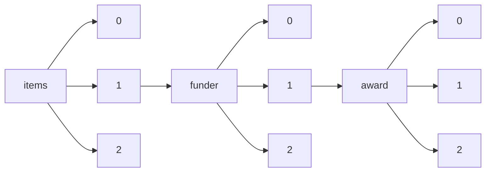

!!! warning "This document is not official Crossref documentation"
# Elements
PATH = items/array/funder/array/award/array(1)  
Occurs 16 528 766 times  
Unique values: > 999  
{ .annotate }

1. A route to an element, for example:  
   The route "items/array/funder/array/award/array" corresponds to navigating through the JSON indices as  
   ["items"][0]["funder"][0]["award"][0]  

!!! note "Due to current limitations, only the first 1,000 unique values are counted."

| **Row** | **Value** `String`                                                                                | **Count** `Int64` |
|--------:|-----------------------------------------------------------------------------------------------------:|---------------------:|
| **1**   | N/A                                                                                                  | 22 585               |
| **2**   | NA                                                                                                   | 13 774               |
| **3**   | DE-AC02-05CH11231                                                                                    | 11 177               |
| **4**   | 001                                                                                                  | 10 460               |
| **5**   | -                                                                                                    | 8 098                |
| **6**   | DE-AC02-06CH11357                                                                                    | 7 630                |
| **7**   | n/a                                                                                                  | 7 617                |
| **8**   | FP7/2007-2013                                                                                        | 3 045                |
| **9**   | DE-AC52-07NA27344                                                                                    | 2 603                |
| **10**  | DE-AC05-00OR22725                                                                                    | 2 503                |
| **11**  | DE-AC02-76SF00515                                                                                    | 2 288                |
| **12**  | 1                                                                                                    | 2 164                |
| **13**  | None                                                                                                 | 1 999                |
| **14**  | Finance Code 001                                                                                     | 1 993                |
| **15**  | none                                                                                                 | 1 968                |
| **16**  | Not applicable                                                                                       | 1 904                |
| **17**  | P30 CA008748                                                                                         | 1 875                |
| **18**  | 633053                                                                                               | 1 206                |
| **19**  | 0                                                                                                    | 1 155                |
| **20**  | DE-SC0012704                                                                                         | 1 055                |
| **21**  | #                                                                                                    | 946                  |
| **22**  | DE-AC52-06NA25396                                                                                    | 900                  |
| **23**  | na                                                                                                   | 853                  |
| **24**  |                                                                                                      | 850                  |
| **25**  | 2017                                                                                                 | 788                  |
| **26**  | FP7/2007–2013                                                                                        | 707                  |
| **27**  | 2019                                                                                                 | 704                  |
| **28**  | .                                                                                                    | 672                  |
| **29**  | DE-AC02-98CH10886                                                                                    | 641                  |
| **30**  | XDB20000000                                                                                          | 639                  |
| **31**  | 36/E/KPT/2019                                                                                        | 634                  |
| **32**  | DE-AC02-09CH11466                                                                                    | 618                  |
| **33**  | 2018                                                                                                 | 561                  |
| **34**  | not applicable                                                                                       | 560                  |
| **35**  | DE-AC36-08GO28308                                                                                    | 525                  |
| **36**  | 21621004                                                                                             | 490                  |
| **37**  | B08038                                                                                               | 486                  |
| **38**  | 2016                                                                                                 | 486                  |
| **39**  | Discovery Grant                                                                                      | 452                  |
| **40**  | n.a.                                                                                                 | 448                  |
| **41**  | B13025                                                                                               | 445                  |
| **42**  | 2020                                                                                                 | 439                  |
| **43**  | HHSN261200800001E                                                                                    | 413                  |
| **44**  | 2015                                                                                                 | 407                  |
| **45**  | DE-AC04-94AL85000                                                                                    | 399                  |
| **46**  | DE-NA0003525                                                                                         | 383                  |
| **47**  | DMR-1157490                                                                                          | 372                  |
| **48**  | PAPD                                                                                                 | 367                  |
| **49**  | 2021                                                                                                 | 362                  |
| **50**  | ACI-1548562                                                                                          | 359                  |
| **51**  | 2017QNRC001                                                                                          | 337                  |
| **52**  | B12015                                                                                               | 334                  |
| **53**  | ACI-1053575                                                                                          | 325                  |
| **54**  | ᅟ                                                                                                   | 314                  |
| **55**  | 881603                                                                                               | 306                  |
| **56**  | U01 AG024904                                                                                         | 304                  |
| **57**  | DE-AC05-76RL01830                                                                                    | 302                  |
| **58**  | /                                                                                                    | 297                  |
| **59**  | Programme Saint Hilaire                                                                              | 293                  |
| **60**  | no number                                                                                            | 292                  |
| **61**  | No number                                                                                            | 279                  |
| **62**  | ANR-15-IDEX-02                                                                                       | 273                  |
| **63**  | CA016672                                                                                             | 273                  |
| **64**  | 111-2-06                                                                                             | 257                  |
| **65**  | P40 OD010440                                                                                         | 248                  |
| **66**  | P30CA008748                                                                                          | 245                  |
| **67**  | Not Applicable                                                                                       | 237                  |
| **68**  | 2018QNRC001                                                                                          | 223                  |
| **69**  | No grant number                                                                                      | 221                  |
| **70**  | 2016QNRC001                                                                                          | 215                  |
| **71**  | CARS-36                                                                                              | 209                  |
| **72**  | B06006                                                                                               | 209                  |
| **73**  | no                                                                                                   | 208                  |
| **74**  | UID/QUI/50006/2013                                                                                   | 207                  |
| **75**  | DE‐AC02‐06CH11357                                                                                    | 196                  |
| **76**  | 0000                                                                                                 | 195                  |
| **77**  | N.A.                                                                                                 | 191                  |
| **78**  | x                                                                                                    | 183                  |
| **79**  | DE-AC02-07CH11358                                                                                    | 176                  |
| **80**  | 2013                                                                                                 | 169                  |
| **81**  | 5-100                                                                                                | 168                  |
| **82**  | Postdoctoral Fellowship                                                                              | 168                  |
| **83**  | Fellowship                                                                                           | 167                  |
| **84**  | DE-AC36-08-GO28308                                                                                   | 162                  |
| **85**  | CZ.1.05/1.1.00/02.0109                                                                               | 157                  |
| **86**  | 1ZIAAG000935                                                                                         | 155                  |
| **87**  | Finance code 001                                                                                     | 153                  |
| **88**  | ANR-11-IDEX-0001-02                                                                                  | 153                  |
| **89**  | no grant number                                                                                      | 147                  |
| **90**  | 2014                                                                                                 | 146                  |
| **91**  | 19-34-90051                                                                                          | 145                  |
| **92**  | PHY-1607611                                                                                          | 143                  |
| **93**  | P30 CA016672                                                                                         | 143                  |
| **94**  | XDB26000000                                                                                          | 143                  |
| **95**  | 89233218CNA000001                                                                                    | 133                  |
| **96**  | DE-AC07-05ID14517                                                                                    | 133                  |
| **97**  | B17019                                                                                               | 133                  |
| **98**  | UID/EEA/50008/2013                                                                                   | 132                  |
| **99**  | 51421061                                                                                             | 129                  |
| **100** | B14041                                                                                               | 128                  |
| **101** | B08040                                                                                               | 124                  |
| **102** | 272041                                                                                               | 117                  |
| **103** | 000                                                                                                  | 117                  |
| **104** | 80NM0018D0004                                                                                        | 113                  |
| **105** | UL1TR002494                                                                                          | 112                  |
| **106** | Intramural Research Program                                                                          | 112                  |
| **107** | 51521006                                                                                             | 109                  |
| **108** | FP/2007-2013                                                                                         | 107                  |
| **109** | R01CA170298                                                                                          | 106                  |
| **110** | U01CA155309                                                                                          | 106                  |
| **111** | MMCI,00209805                                                                                        | 105                  |
| **112** | EP/I501045                                                                                           | 102                  |
| **113** | NNF10CC1016517                                                                                       | 102                  |
| **114** | 785219                                                                                               | 100                  |
| **115** | 604391                                                                                               | 100                  |
| **116** | 21321062                                                                                             | 99                   |
| **117** | ANR-11-IDEX-0004-02                                                                                  | 99                   |
| **118** | 102215/2/13/2                                                                                        | 97                   |
| **119** | UIDB/50006/2020                                                                                      | 97                   |
| **120** | 2022                                                                                                 | 95                   |
| **121** | E.6/084/00.10/III/2014                                                                               | 94                   |
| **122** | Research Grant                                                                                       | 93                   |
| **123** | 5155011023                                                                                           | 86                   |
| **124** | 51505282                                                                                             | 86                   |
| **125** | 696656                                                                                               | 84                   |
| **126** | Unassigned                                                                                           | 84                   |
| **127** | 61621004                                                                                             | 83                   |
| **128** | OCE-1326927                                                                                          | 83                   |
| **129** | 206194                                                                                               | 82                   |
| **130** | 21788102                                                                                             | 82                   |
| **131** | MR/R015600/1                                                                                         | 81                   |
| **132** | B14040                                                                                               | 81                   |
| **133** | DMR-1121262                                                                                          | 80                   |
| **134** | 2016YFA0200700                                                                                       | 79                   |
| **135** | 179079                                                                                               | 79                   |
| **136** | P30CA016672                                                                                          | 79                   |
| **137** | no award/grant number                                                                                | 78                   |
| **138** | UID/AMB/50017/2019                                                                                   | 77                   |
| **139** | B16017                                                                                               | 77                   |
| **140** | EP/P034284/1                                                                                         | 75                   |
| **141** | 2020ZYD013                                                                                           | 74                   |
| **142** | 71521002                                                                                             | 73                   |
| **143** | DE-AC02-07CH11359                                                                                    | 72                   |
| **144** | W911NF-09-2-0053                                                                                     | 71                   |
| **145** | 211384                                                                                               | 70                   |
| **146** | DOH102-TD-B-111-004                                                                                  | 69                   |
| **147** | MCIN/AEI/10.13039/501100011033                                                                       | 67                   |
| **148** | LQ1601                                                                                               | 66                   |
| **149** | 16DHB2129                                                                                            | 65                   |
| **150** | 19K02983                                                                                             | 65                   |
| **151** | B08021                                                                                               | 63                   |
| **152** | 51221001                                                                                             | 62                   |
| **153** | 61272530                                                                                             | 62                   |
| **154** | I/028/12/05                                                                                          | 61                   |
| **155** | DE-SC0014664                                                                                         | 60                   |
| **156** | FOR1246                                                                                              | 58                   |
| **157** | 61332016                                                                                             | 57                   |
| **158** | 51521001                                                                                             | 57                   |
| **159** | U1406402                                                                                             | 56                   |
| **160** | EP/N510129/1                                                                                         | 55                   |
| **161** | DE-AC05-06OR23100                                                                                    | 52                   |
| **162** | Grant                                                                                                | 51                   |
| **163** | UIDP/50011/2020                                                                                      | 50                   |
| **164** | POIG.02.01.00-12-023/08                                                                              | 50                   |
| **165** | xxx                                                                                                  | 49                   |
| **166** | CARS-37                                                                                              | 48                   |
| **167** | SFB 953                                                                                              | 48                   |
| **168** | No                                                                                                   | 48                   |
| **169** | 1U54MH091657                                                                                         | 48                   |
| **170** | 58‐1950‐7‐707                                                                                        | 48                   |
| **171** | UIDB/00057/2020                                                                                      | 48                   |
| **172** | B16009                                                                                               | 48                   |
| **173** | PRESTO                                                                                               | 47                   |
| **174** | 785907                                                                                               | 47                   |
| **175** | 01NVF17022                                                                                           | 47                   |
| **176** | ARCHING : archives d'ingéniéries européennes                                                         | 47                   |
| **177** | HHSN272201200031C                                                                                    | 46                   |
| **178** | 41888101                                                                                             | 46                   |
| **179** | X                                                                                                    | 46                   |
| **180** | DoD                                                                                                  | 45                   |
| **181** | FC001144                                                                                             | 45                   |
| **182** | 2015CB856600                                                                                         | 45                   |
| **183** | 074-U01                                                                                              | 44                   |
| **184** | MR/KO232331/1                                                                                        | 42                   |
| **185** | P30EY014801                                                                                          | 42                   |
| **186** | 2016R1E1A1A01940995                                                                                  | 42                   |
| **187** | 3M-9104                                                                                              | 41                   |
| **188** | DMR-1719875                                                                                          | 41                   |
| **189** | NNF14CC0001                                                                                          | 40                   |
| **190** | G12MD007591                                                                                          | 40                   |
| **191** | CE110001013                                                                                          | 40                   |
| **192** | 2                                                                                                    | 40                   |
| **193** | Unknown                                                                                              | 40                   |
| **194** | C98/A24032                                                                                           | 40                   |
| **195** | --                                                                                                   | 40                   |
| **196** | CNS-1702850                                                                                          | 39                   |
| **197** | FC001039                                                                                             | 39                   |
| **198** | 0000045188                                                                                           | 39                   |
| **199** | 3U54HL143541-02S2                                                                                    | 39                   |
| **200** | 634869                                                                                               | 39                   |
| **201** | DE-NA-0003525                                                                                        | 38                   |
| **202** | P30CA047904                                                                                          | 38                   |
| **203** | 680997                                                                                               | 37                   |
| **204** | not available                                                                                        | 37                   |
| **205** | U54 EB027690 02S1                                                                                    | 37                   |
| **206** | OPP1157270 / INV-009125                                                                              | 37                   |
| **207** | PHY-1748958                                                                                          | 37                   |
| **208** | PhD grant                                                                                            | 36                   |
| **209** | CA21765                                                                                              | 36                   |
| **210** | FC001060                                                                                             | 36                   |
| **211** | HHSN271201100006I                                                                                    | 36                   |
| **212** | W81XWH-12-2-0012                                                                                     | 36                   |
| **213** | 81871073                                                                                             | 36                   |
| **214** | DE-AC06-76RLO-1830                                                                                   | 36                   |
| **215** | U1501501                                                                                             | 36                   |
| **216** | MIS-5000432                                                                                          | 35                   |
| **217** | R01CA211070                                                                                          | 35                   |
| **218** | R01GM115366                                                                                          | 35                   |
| **219** | ECS-0335765                                                                                          | 35                   |
| **220** | IRT-13R17                                                                                            | 35                   |
| **221** | D16PC00003                                                                                           | 35                   |
| **222** | 2015M3D6A1065362                                                                                     | 35                   |
| **223** | R01CA160417                                                                                          | 35                   |
| **224** | SEV-2015-0496                                                                                        | 35                   |
| **225** | 81400132                                                                                             | 35                   |
| **226** | U1606403                                                                                             | 35                   |
| **227** | XXX                                                                                                  | 35                   |
| **228** | 2016A030308011                                                                                       | 35                   |
| **229** | 31671435                                                                                             | 35                   |
| **230** | 81772508                                                                                             | 35                   |
| **231** | OP1191522                                                                                            | 35                   |
| **232** | SZSM202011012                                                                                        | 34                   |
| **233** | JCYJ20180228175358223                                                                                | 34                   |
| **234** | D17007                                                                                               | 34                   |
| **235** | OPP1119772                                                                                           | 34                   |
| **236** | C309/A11566                                                                                          | 34                   |
| **237** | No.SZXK035                                                                                           | 34                   |
| **238** | 41688103                                                                                             | 34                   |
| **239** | U10AA008401                                                                                          | 34                   |
| **240** | 172015                                                                                               | 33                   |
| **241** | 2012                                                                                                 | 33                   |
| **242** | no Grant / Award Number                                                                              | 33                   |
| **243** | JPMXP0112101001                                                                                      | 33                   |
| **244** | 899999                                                                                               | 33                   |
| **245** | UL1TR001881                                                                                          | 33                   |
| **246** | MR/S037527/1                                                                                         | 33                   |
| **247** | MCB 0448905                                                                                          | 32                   |
| **248** | DBI-1300426                                                                                          | 32                   |
| **249** | D16PC00004                                                                                           | 32                   |
| **250** | 9000220                                                                                              | 32                   |
| **251** | 16ek0109136h0002                                                                                     | 32                   |
| **252** | 643476                                                                                               | 32                   |
| **253** | 2017YFA0206600                                                                                       | 32                   |
| **254** | R01AG054002                                                                                          | 32                   |
| **255** | BES                                                                                                  | 32                   |
| **256** | UF1AG032438                                                                                          | 32                   |
| **257** | FC001078                                                                                             | 32                   |
| **258** | 093080/Z/10/Z                                                                                        | 32                   |
| **259** | 2018-HX-99                                                                                           | 31                   |
| **260** | G12MD007597                                                                                          | 31                   |
| **261** | 85134                                                                                                | 30                   |
| **262** | honoraria                                                                                            | 30                   |
| **263** | DE-FC02-04ER54698                                                                                    | 30                   |
| **264** | 2017-I2M-1-006                                                                                       | 30                   |
| **265** | R01AG064955                                                                                          | 30                   |
| **266** | CIBEROBN                                                                                             | 30                   |
| **267** | 821471                                                                                               | 30                   |
| **268** | DE AC36-08G028308                                                                                    | 30                   |
| **269** | DE-AC02–05CH11231                                                                                    | 30                   |
| **270** | DMR-1644779                                                                                          | 30                   |
| **271** | 3332018068                                                                                           | 30                   |
| **272** | D16PC00005                                                                                           | 30                   |
| **273** | DE-SC0004993                                                                                         | 30                   |
| **274** | 81773241                                                                                             | 30                   |
| **275** | HI10C2020                                                                                            | 29                   |
| **276** | XDA13020300                                                                                          | 29                   |
| **277** | CARS-46                                                                                              | 29                   |
| **278** | PT2020                                                                                               | 29                   |
| **279** |                                                                                                      | 29                   |
| **280** | B17040                                                                                               | 29                   |
| **281** | ANR-10-IAHU-01                                                                                       | 28                   |
| **282** | CMMI-1435853                                                                                         | 28                   |
| **283** | SFI/12/RC/2273                                                                                       | 28                   |
| **284** | HL120142                                                                                             | 28                   |
| **285** | 249816                                                                                               | 28                   |
| **286** | JRC/IPR/2020/VLVP/1912                                                                               | 28                   |
| **287** | HL110335                                                                                             | 28                   |
| **288** | IBS-R012-D1                                                                                          | 28                   |
| **289** | UID/QUI/50006/2019                                                                                   | 28                   |
| **290** | ING20130526624                                                                                       | 28                   |
| **291** | HL118532                                                                                             | 28                   |
| **292** | 200880                                                                                               | 28                   |
| **293** | MR/K026992/1                                                                                         | 28                   |
| **294** | W911NF-13-1-0376;W911NF-17-2-0086;W911NF-18-2-0056                                                   | 28                   |
| **295** | DE-AC05-06OR23177                                                                                    | 28                   |
| **296** | FP7 project # 200506                                                                                 | 28                   |
| **297** | MDM-2015-0509                                                                                        | 27                   |
| **298** | Z200024                                                                                              | 27                   |
| **299** | 2013CB329404                                                                                         | 27                   |
| **300** | UL1TR002373                                                                                          | 27                   |
| **301** | U54HD070725                                                                                          | 27                   |
| **302** | 2017ZX09304029-001-002                                                                               | 27                   |
| **303** | 201502002                                                                                            | 27                   |
| **304** | 29-A-3, 2020-J-3                                                                                     | 27                   |
| **305** | 59307082                                                                                             | 27                   |
| **306** | UL1 TR000448                                                                                         | 27                   |
| **307** | 1539067                                                                                              | 27                   |
| **308** | JP17ck0106336, JP20ck0106614                                                                         | 27                   |
| **309** | 00                                                                                                   | 27                   |
| **310** | 32170752                                                                                             | 27                   |
| **311** | Investigator Initiated Studies Program                                                               | 27                   |
| **312** | U01MH103392                                                                                          | 27                   |
| **313** | CARS-41                                                                                              | 27                   |
| **314** | –                                                                                                    | 26                   |
| **315** | DE-FG02-07ER46471                                                                                    | 26                   |
| **316** | 870294                                                                                               | 26                   |
| **317** | FC001097                                                                                             | 26                   |
| **318** | Allergan                                                                                             | 26                   |
| **319** | 1RF1MH123220-01                                                                                      | 26                   |
| **320** | 1122374                                                                                              | 26                   |
| **321** | R01GM127527                                                                                          | 26                   |
| **322** | 837722                                                                                               | 26                   |
| **323** | 223468                                                                                               | 26                   |
| **324** | EPS-1003897                                                                                          | 25                   |
| **325** | 773830                                                                                               | 25                   |
| **326** | Research grant                                                                                       | 25                   |
| **327** | EPA                                                                                                  | 25                   |
| **328** | U-BIOPRED IMI n°115010                                                                               | 25                   |
| **329** | RRF-2.3.1-21-2022-00003                                                                              | 25                   |
| **330** | MC\_PC\_20027                                                                                        | 25                   |
| **331** | 945539                                                                                               | 25                   |
| **332** | 2018-05973                                                                                           | 25                   |
| **333** | 602437                                                                                               | 25                   |
| **334** | Battery500 Consortium                                                                                | 25                   |
| **335** | Ricerca corrente line1                                                                               | 25                   |
| **336** | JPMJCR17N2                                                                                           | 24                   |
| **337** | Objectif Végétal, Research, Education and Innovation in Pays de la Loire                             | 24                   |
| **338** | 115737                                                                                               | 24                   |
| **339** | IBS-R016-A1                                                                                          | 24                   |
| **340** | 62076100                                                                                             | 24                   |
| **341** | Community Choice Research Award                                                                      | 24                   |
| **342** | SDC/021/2015                                                                                         | 24                   |
| **343** | No.32025023                                                                                          | 24                   |
| **344** | 0001                                                                                                 | 23                   |
| **345** | W911NF-14-C0089                                                                                      | 23                   |
| **346** | 16/137/95                                                                                            | 23                   |
| **347** | SBR-9123299                                                                                          | 23                   |
| **348** | JP18km0105002                                                                                        | 23                   |
| **349** | APP1113032                                                                                           | 23                   |
| **350** | 853966                                                                                               | 23                   |
| **351** | U19AI089676                                                                                          | 23                   |
| **352** | C5047/A29626/A22530/A17528                                                                           | 23                   |
| **353** | R01MH63386                                                                                           | 23                   |
| **354** | 9980                                                                                                 | 23                   |
| **355** | 86-JN-CX-0007                                                                                        | 23                   |
| **356** | 780989 (MERLIN)                                                                                      | 23                   |
| **357** | 279227                                                                                               | 23                   |
| **358** | JP18km0105001                                                                                        | 23                   |
| **359** | R01DA005512                                                                                          | 23                   |
| **360** | SBR-9512290                                                                                          | 23                   |
| **361** | 668303                                                                                               | 23                   |
| **362** | UID/CTM/50011/2013                                                                                   | 23                   |
| **363** | UL1 TR000135                                                                                         | 23                   |
| **364** | P30HD32041                                                                                           | 23                   |
| **365** | 01KG0804                                                                                             | 23                   |
| **366** | OCI-1053575                                                                                          | 23                   |
| **367** | R01DA020195                                                                                          | 23                   |
| **368** | ynkt2020-zz22                                                                                        | 23                   |
| **369** | INV-019313                                                                                           | 23                   |
| **370** | R01CE001572                                                                                          | 22                   |
| **371** | 202040498                                                                                            | 22                   |
| **372** | AID-OAA-L-10-00006                                                                                   | 22                   |
| **373** | B14009                                                                                               | 22                   |
| **374** | 1R01AI145057                                                                                         | 22                   |
| **375** | HHSN268201800003I                                                                                    | 22                   |
| **376** | 201802010027                                                                                         | 22                   |
| **377** | GM083997                                                                                             | 22                   |
| **378** | ?                                                                                                    | 22                   |
| **379** | 81971361                                                                                             | 22                   |
| **380** | AGL2001-2029                                                                                         | 22                   |
| **381** | 01NVF19023                                                                                           | 22                   |
| **382** | 2018-RGZN-02041                                                                                      | 22                   |
| **383** | AGL2004-08092/GAN                                                                                    | 22                   |
| **384** | 179046                                                                                               | 22                   |
| **385** | 201902010046                                                                                         | 22                   |
| **386** | FIS - PI12/00799                                                                                     | 22                   |
| **387** | 95/10710                                                                                             | 22                   |
| **388** | FP1403                                                                                               | 22                   |
| **389** | 201704030076                                                                                         | 22                   |
| **390** | MC-A652-5PZ00                                                                                        | 22                   |
| **391** | 573813/2008-6                                                                                        | 22                   |
| **392** | 1DP1HD086071                                                                                         | 22                   |
| **393** | U01 DK63829                                                                                          | 22                   |
| **394** | 14162MFDS973                                                                                         | 22                   |
| **395** | Fondo de Investigación para la Salud (FIS)                                                           | 22                   |
| **396** | 2008/57717-6                                                                                         | 22                   |
| **397** | PM2 964                                                                                              | 22                   |
| **398** | 779257                                                                                               | 22                   |
| **399** | MR/S037586/1                                                                                         | 22                   |
| **400** | 19ZR1406900                                                                                          | 22                   |
| **401** | RTI2018-094357-B-C21                                                                                 | 22                   |
| **402** | AB83030002019004                                                                                     | 22                   |
| **403** | 2019-01-07-00-07-E00050                                                                              | 22                   |
| **404** | CTQ2014-51912-REDC                                                                                   | 21                   |
| **405** | CA187692                                                                                             | 21                   |
| **406** | AID-OAA-A-14-00102                                                                                   | 21                   |
| **407** | SFB 940/2                                                                                            | 21                   |
| **408** | 115300, 777394                                                                                       | 21                   |
| **409** | JP21ck0106507                                                                                        | 21                   |
| **410** | 81472860                                                                                             | 21                   |
| **411** | U19 AI135995                                                                                         | 21                   |
| **412** | G1100783/1                                                                                           | 21                   |
| **413** | ANRS00001S                                                                                           | 21                   |
| **414** | LIFE17/ENV/SK/000355                                                                                 | 21                   |
| **415** | DE-AC0206CH11357                                                                                     | 21                   |
| **416** | RCFPD4-2020-1                                                                                        | 21                   |
| **417** | 11805184                                                                                             | 21                   |
| **418** | YZJJLX2019011                                                                                        | 21                   |
| **419** | EP/M005976/1                                                                                         | 21                   |
| **420** | HHSN272201400006C                                                                                    | 21                   |
| **421** | 262700                                                                                               | 21                   |
| **422** | DK054514                                                                                             | 21                   |
| **423** | COVID-2020C2-10761                                                                                   | 21                   |
| **424** | P30-CA008748                                                                                         | 21                   |
| **425** | unknown                                                                                              | 21                   |
| **426** | 667302                                                                                               | 21                   |
| **427** | ---                                                                                                  | 21                   |
| **428** | UL1TR000124                                                                                          | 21                   |
| **429** | U01DA041048                                                                                          | 21                   |
| **430** | P41EB015898                                                                                          | 20                   |
| **431** | unrestricted educational grant                                                                       | 20                   |
| **432** | 8001056915                                                                                           | 20                   |
| **433** | HHSN268201800007I                                                                                    | 20                   |
| **434** | UL1TR002538                                                                                          | 20                   |
| **435** | Joint Global Health Trials Scheme                                                                    | 20                   |
| **436** | Scholarship                                                                                          | 20                   |
| **437** | ZIA BC 010547                                                                                        | 20                   |
| **438** | 2018-A02297-48                                                                                       | 20                   |
| **439** | U01 DK103117                                                                                         | 20                   |
| **440** | INV-009129                                                                                           | 20                   |
| **441** | 2014-ER6301-00, 2014-ER6301-01, 2014-ER6301-02, 2017-ER6301-00, and 2017-ER6301-01                   | 20                   |
| **442** | PHC22 667696                                                                                         | 20                   |
| **443** | 733001                                                                                               | 20                   |
| **444** | B17020                                                                                               | 20                   |
| **445** | 106680/Z/14/Z                                                                                        | 20                   |
| **446** | PN-III-P4-ID-PCCF-2016-0114                                                                          | 20                   |
| **447** | DEAC02-06CH11357                                                                                     | 20                   |
| **448** | NCT00738439                                                                                          | 20                   |
| **449** | 642147                                                                                               | 20                   |
| **450** | 01GL1703 A-C                                                                                         | 20                   |
| **451** | 82171057                                                                                             | 20                   |
| **452** | Salary                                                                                               | 19                   |
| **453** | U01DA041022                                                                                          | 19                   |
| **454** | HR00111920008                                                                                        | 19                   |
| **455** | 2014BAI07B04                                                                                         | 19                   |
| **456** | OPP1114297                                                                                           | 19                   |
| **457** | Intramural                                                                                           | 19                   |
| **458** | FOR 1451                                                                                             | 19                   |
| **459** | 2017-13 TIPTOP                                                                                       | 19                   |
| **460** | 05253284                                                                                             | 19                   |
| **461** | STRATEGMED1/235077/9/NCBR/2014                                                                       | 19                   |
| **462** | 1U24-CA196173                                                                                        | 19                   |
| **463** | DE-AC02- 06CH11357                                                                                   | 19                   |
| **464** | 2020ER630500                                                                                         | 19                   |
| **465** | NIDA R44DA04395402                                                                                   | 19                   |
| **466** | NIH R34MH115769                                                                                      | 19                   |
| **467** | SLA/MULTI/NORAD/SSA/2013021/BRA/IIS                                                                  | 19                   |
| **468** | 820846                                                                                               | 19                   |
| **469** | BBS/E/I/00007031                                                                                     | 19                   |
| **470** | U41HG007050                                                                                          | 19                   |
| **471** | (SCCXTD-2020-13)                                                                                     | 19                   |
| **472** | No.81872063                                                                                          | 19                   |
| **473** | DE-SC0001293                                                                                         | 19                   |
| **474** | SP003                                                                                                | 19                   |
| **475** | W911NF-10-2-0022                                                                                     | 19                   |
| **476** | RTI2018-093874-B-I00                                                                                 | 19                   |
| **477** | U24 CA114766                                                                                         | 19                   |
| **478** | 15240                                                                                                | 19                   |
| **479** | (Beef Cattle/Yak, CARS-37)                                                                           | 19                   |
| **480** | phase I 2017-041                                                                                     | 19                   |
| **481** | NIH P30AI027757                                                                                      | 19                   |
| **482** | BBS/E/I/00007039                                                                                     | 19                   |
| **483** | 21km0405210s                                                                                         | 19                   |
| **484** | NIH R21AI145450                                                                                      | 19                   |
| **485** | 81200733                                                                                             | 18                   |
| **486** | #FA8650-11-C-7136                                                                                    | 18                   |
| **487** | MR/T003782/1                                                                                         | 18                   |
| **488** | TL1 TR000137                                                                                         | 18                   |
| **489** | MTM 2012-36732-C03-01                                                                                | 18                   |
| **490** | TKP2021-NKTA-46                                                                                      | 18                   |
| **491** | U10DD000182                                                                                          | 18                   |
| **492** | fellowship                                                                                           | 18                   |
| **493** | Y1-GM-1104                                                                                           | 18                   |
| **494** | Y1-CO-1020                                                                                           | 18                   |
| **495** | U10DD000180                                                                                          | 18                   |
| **496** | 19/251-0001930-0                                                                                     | 18                   |
| **497** | EP/N004884                                                                                           | 18                   |
| **498** | R01CA181450                                                                                          | 18                   |
| **499** | 1929834                                                                                              | 18                   |
| **500** | 2016YFC1304101                                                                                       | 18                   |
| **501** | 81970045, 82000045                                                                                   | 18                   |
| **502** | CCT/06/09                                                                                            | 18                   |
| **503** | ZNSA-2020003, ZNSA-2020012, ZNSA-2020013                                                             | 18                   |
| **504** | INV-008483                                                                                           | 18                   |
| **505** | 201202005                                                                                            | 18                   |
| **506** | PCS-1504-30283                                                                                       | 18                   |
| **507** | RD21/0017/0001                                                                                       | 18                   |
| **508** | R01CA142081, R01CA237318                                                                             | 18                   |
| **509** | Artificial Intelligence National Laboratory Programme                                                | 18                   |
| **510** | NU2GGH002093-01-00                                                                                   | 18                   |
| **511** | FC001136                                                                                             | 18                   |
| **512** | 81325006                                                                                             | 18                   |
| **513** | U54AI110398                                                                                          | 18                   |
| **514** | 945175                                                                                               | 18                   |
| **515** | DE-AC02-05-CH11231                                                                                   | 18                   |
| **516** | 2017BT01S155                                                                                         | 18                   |
| **517** | A-COVID 40                                                                                           | 18                   |
| **518** | 81020108018                                                                                          | 18                   |
| **519** | PI13/01726                                                                                           | 18                   |
| **520** | JP19ek0109264s1303                                                                                   | 18                   |
| **521** | P41 HD064556                                                                                         | 18                   |
| **522** | RSG-16-014-01-CDD                                                                                    | 18                   |
| **523** | 81400449                                                                                             | 18                   |
| **524** | 303652/2019-5                                                                                        | 18                   |
| **525** | NHMRC.108.03-2018.09                                                                                 | 18                   |
| **526** | OPP1172157                                                                                           | 18                   |
| **527** | JP18bk0104004h0001                                                                                   | 18                   |
| **528** | C402                                                                                                 | 18                   |
| **529** | R03 HS-22126                                                                                         | 18                   |
| **530** | DE-AC03-76SF00098                                                                                    | 18                   |
| **531** | 1U01HG011717                                                                                         | 18                   |
| **532** | 2020-4.1.1.-TKP2020                                                                                  | 18                   |
| **533** | grants and personal fees                                                                             | 18                   |
| **534** | 1-U01-AI124316                                                                                       | 18                   |
| **535** | PRT-K16-155 2016                                                                                     | 18                   |
| **536** | 2017SHZDZX01                                                                                         | 18                   |
| **537** | MR/N00633X/1                                                                                         | 18                   |
| **538** | K 135076                                                                                             | 18                   |
| **539** | 733050813, 733050103, 733050513                                                                      | 18                   |
| **540** | 17/63/121, NIHR Global Health Research Group on Atrial Fibrillation Management                       | 18                   |
| **541** | IRT\_14R20                                                                                           | 18                   |
| **542** | 244121                                                                                               | 18                   |
| **543** | FWP 70880                                                                                            | 18                   |
| **544** | ICORGH/2009                                                                                          | 18                   |
| **545** | HD27860                                                                                              | 17                   |
| **546** | KMU-TC109B05                                                                                         | 17                   |
| **547** | 2022SKLAB6-05                                                                                        | 17                   |
| **548** | U01 AI151698                                                                                         | 17                   |
| **549** | 81772783                                                                                             | 17                   |
| **550** | 2016 HRB/CTI                                                                                         | 17                   |
| **551** | 613754                                                                                               | 17                   |
| **552** | 737033-LLR                                                                                           | 17                   |
| **553** | SB/5112-14                                                                                           | 17                   |
| **554** | KMU-TC108A04-3                                                                                       | 17                   |
| **555** | KMU-DK107004; MOST 108-2314-B-037-066-MY3                                                            | 17                   |
| **556** | Inv-009652                                                                                           | 17                   |
| **557** | BZ2016013                                                                                            | 17                   |
| **558** | 2021 HTH 017 and 2020 HTH 062                                                                        | 17                   |
| **559** | 075-15-2020-777                                                                                      | 17                   |
| **560** | TZ2018004                                                                                            | 17                   |
| **561** | 82071506                                                                                             | 17                   |
| **562** | 092731                                                                                               | 17                   |
| **563** | 2016YFD0401104                                                                                       | 17                   |
| **564** | 51421006                                                                                             | 17                   |
| **565** | 15cm0106066h0005                                                                                     | 17                   |
| **566** | 814530                                                                                               | 17                   |
| **567** | BBS/E/I/00007037                                                                                     | 17                   |
| **568** | MT-96                                                                                                | 17                   |
| **569** | HD40560                                                                                              | 17                   |
| **570** | R01HL119845                                                                                          | 17                   |
| **571** | 2021GXRC060                                                                                          | 17                   |
| **572** | HD40500                                                                                              | 17                   |
| **573** | ICORG/2012                                                                                           | 17                   |
| **574** | SAW-2015-IGB-1                                                                                       | 17                   |
| **575** | DE-SC0019443                                                                                         | 17                   |
| **576** | 967                                                                                                  | 17                   |
| **577** | No. 2019GXNSFGA245002                                                                                | 17                   |
| **578** | RSG-16–014–01-CDD                                                                                    | 17                   |
| **579** | 5U01HL138635                                                                                         | 17                   |
| **580** | R-82811201                                                                                           | 17                   |
| **581** | , ANID COVID 19-0589                                                                                 | 17                   |
| **582** | U01 GH000447                                                                                         | 17                   |
| **583** | 268020496                                                                                            | 17                   |
| **584** | FC001030                                                                                             | 17                   |
| **585** | Katherine McCleary Research Fund and K. Edward Jacobi Research Partners Fund                         | 17                   |
| **586** | 31671844                                                                                             | 17                   |
| **587** | HD27915                                                                                              | 17                   |
| **588** | BK20160506                                                                                           | 17                   |
| **589** | Grant # 2020 HTH 062                                                                                 | 17                   |
| **590** | 31601543                                                                                             | 17                   |
| **591** | No. 81760577                                                                                         | 17                   |
| **592** | UIDB/00239/2020                                                                                      | 17                   |
| **593** | EP/T02397X/1                                                                                         | 17                   |
| **594** | KMUH-DK109005\~1; KMUH-DK109002; KMUH-108-8R05                                                       | 17                   |
| **595** | JP15H05898B1                                                                                         | 17                   |
| **596** | JP19gm0910004                                                                                        | 17                   |
| **597** | 62031024                                                                                             | 17                   |
| **598** | U10 CA98543                                                                                          | 17                   |
| **599** | OPP1136751                                                                                           | 17                   |
| **600** | SUB/1/DN/22/003/1104                                                                                 | 17                   |
| **601** | HR00112090058                                                                                        | 17                   |
| **602** | 31970802                                                                                             | 17                   |
| **603** | BE2016306                                                                                            | 17                   |
| **604** | No. AD17129003                                                                                       | 17                   |
| **605** | U10 CA180886                                                                                         | 17                   |
| **606** | 613520                                                                                               | 17                   |
| **607** | RC2DA029475                                                                                          | 17                   |
| **608** | AI110820                                                                                             | 17                   |
| **609** | RE 1723/5-1                                                                                          | 17                   |
| **610** | EP/R035288/1                                                                                         | 17                   |
| **611** | JP16bk0104029h0003                                                                                   | 17                   |
| **612** | 825292                                                                                               | 17                   |
| **613** | U01CA214116                                                                                          | 17                   |
| **614** | 81621005                                                                                             | 17                   |
| **615** | No. GKAA22399                                                                                        | 17                   |
| **616** | P42 ES016465                                                                                         | 16                   |
| **617** | P30CA033572                                                                                          | 16                   |
| **618** | HL080295                                                                                             | 16                   |
| **619** | 14-MED1918-46                                                                                        | 16                   |
| **620** | 847879                                                                                               | 16                   |
| **621** | SEV-2017-0706                                                                                        | 16                   |
| **622** | UL2012-5719                                                                                          | 16                   |
| **623** | TZ2016001                                                                                            | 16                   |
| **624** | R01MH56486                                                                                           | 16                   |
| **625** | U01MH092221                                                                                          | 16                   |
| **626** | W911NF-17-1-0069                                                                                     | 16                   |
| **627** | UM1 AI100645                                                                                         | 16                   |
| **628** | C5759/A25254/A20465/A27412                                                                           | 16                   |
| **629** | R01OD020376                                                                                          | 16                   |
| **630** | W1224                                                                                                | 16                   |
| **631** | W81XWH-18-C-0160                                                                                     | 16                   |
| **632** | 4.20.01                                                                                              | 16                   |
| **633** | U54 CA209971                                                                                         | 16                   |
| **634** | G1001367/1                                                                                           | 16                   |
| **635** | IDS-I l-02                                                                                           | 16                   |
| **636** | 1 UL1 RR025780                                                                                       | 16                   |
| **637** | DESC0001004                                                                                          | 16                   |
| **638** | M17AC00002                                                                                           | 16                   |
| **639** | P-13-50395 or CPM-57-039                                                                             | 16                   |
| **640** | R01MH094740                                                                                          | 16                   |
| **641** | Ricerca Corrente to the IRCCS MultiMedica                                                            | 16                   |
| **642** | No grant number.                                                                                     | 16                   |
| **643** | TRANSVAC2 2002-08-AVVAX-COVID-19, TRANSVAC2\_TNA2002-08                                              | 16                   |
| **644** | FP7-HEALTH-F2M-2007-201600                                                                           | 16                   |
| **645** | U01MH092250                                                                                          | 16                   |
| **646** | INV-008459                                                                                           | 16                   |
| **647** | 846003201                                                                                            | 16                   |
| **648** | C38317/A24043                                                                                        | 16                   |
| **649** | 61621005                                                                                             | 16                   |
| **650** | HRC Explorer 19/750                                                                                  | 16                   |
| **651** | Partially funded by The V Foundation. 2018 Translational Award Program (there is no specific number  | 16                   |
| **652** | 96-MU-FX-0014                                                                                        | 16                   |
| **653** | 2818102715                                                                                           | 16                   |
| **654** | 81930042, 81730047, 31670926, and 31800759                                                           | 16                   |
| **655** | CKTO 2001–04                                                                                         | 16                   |
| **656** | PhD fellowship                                                                                       | 16                   |
| **657** | MR/S037160/1                                                                                         | 16                   |
| **658** | DMR-1611180                                                                                          | 16                   |
| **659** | 07/58999-2                                                                                           | 16                   |
| **660** | ES/P011373/1                                                                                         | 16                   |
| **661** | M01 RR00036                                                                                          | 16                   |
| **662** | 31003A-152614                                                                                        | 16                   |
| **663** | 390857198                                                                                            | 16                   |
| **664** | 153389                                                                                               | 16                   |
| **665** | 2004-MU-FX-0062                                                                                      | 16                   |
| **666** | 2016ZX08005004-005                                                                                   | 16                   |
| **667** | 305299                                                                                               | 16                   |
| **668** | 2006-JW-BX-0074                                                                                      | 16                   |
| **669** | 31003AB-135710                                                                                       | 16                   |
| **670** | 05M2016                                                                                              | 15                   |
| **671** | FL140100260                                                                                          | 15                   |
| **672** | PI15/00587; PI15/00061; PI18/01030; PI14/01126; PI17/01019; JR16/00006; MV17/00021; PI17/01228; RD16 | 15                   |
| **673** | 2484/19                                                                                              | 15                   |
| **674** | ED431G 2019/03                                                                                       | 15                   |
| **675** | 1132                                                                                                 | 15                   |
| **676** | 980997                                                                                               | 15                   |
| **677** | ProID2017010164                                                                                      | 15                   |
| **678** | 2017-04647                                                                                           | 15                   |
| **679** | MOST 110-2823-8-001-002                                                                              | 15                   |
| **680** | 2020YJ0348                                                                                           | 15                   |
| **681** | INV-003439                                                                                           | 15                   |
| **682** | CA206978                                                                                             | 15                   |
| **683** | DMR-1420013                                                                                          | 15                   |
| **684** | 2017YFA0205200                                                                                       | 15                   |
| **685** | U01DA041120                                                                                          | 15                   |
| **686** | 17934031                                                                                             | 15                   |
| **687** | 202922/Z/16/Z                                                                                        | 15                   |
| **688** | 14-50-00068                                                                                          | 15                   |
| **689** | 11905154                                                                                             | 15                   |
| **690** | RP-PG-1016-20007                                                                                     | 15                   |
| **691** | GRC 2017 SGR 880                                                                                     | 15                   |
| **692** | 205177/Z/16/Z                                                                                        | 15                   |
| **693** | 634821                                                                                               | 15                   |
| **694** | SKLCS-ZZ-2020                                                                                        | 15                   |
| **695** | BB/L013940/1                                                                                         | 15                   |
| **696** | KNW-1-008/N/7/K and KNW-1-031/K/8/O                                                                  | 15                   |
| **697** | 503/5-064-01/503-51-001-19-00 and 503/1-152-01/503-11-001-19-00                                      | 15                   |
| **698** | 19KJA550004                                                                                          | 15                   |
| **699** | 688166                                                                                               | 15                   |
| **700** | 118694                                                                                               | 15                   |
| **701** | CARMPRPC-RFDP20-1                                                                                    | 15                   |
| **702** | PROMETEO/2021/008                                                                                    | 15                   |
| **703** | SFB765                                                                                               | 15                   |
| **704** | MC\_PC 19071                                                                                         | 15                   |
| **705** | 3-15080                                                                                              | 15                   |
| **706** | 2015344                                                                                              | 15                   |
| **707** | 2018YFB0407500,                                                                                      | 15                   |
| **708** | R01GM133198                                                                                          | 15                   |
| **709** | DE-EE0008121, DE-SC00006729, DE-SC0008593, DE-EE0008639,                                             | 15                   |
| **710** | NIH                                                                                                  | 15                   |
| **711** | BB/J004529/1                                                                                         | 15                   |
| **712** | R21 NS114764 - 01A1                                                                                  | 15                   |
| **713** | P50 DA035763                                                                                         | 15                   |
| **714** | 681396                                                                                               | 15                   |
| **715** | 200346/Z/15/Z                                                                                        | 15                   |
| **716** | SBGJ2018085                                                                                          | 15                   |
| **717** | 12/57/85                                                                                             | 15                   |
| **718** | 81872254 (XT)                                                                                        | 15                   |
| **719** | JP15bk0104043h0002                                                                                   | 15                   |
| **720** | 864203                                                                                               | 15                   |
| **721** | 179018                                                                                               | 15                   |
| **722** | AS-IDR-110-03                                                                                        | 15                   |
| **723** | 193829                                                                                               | 15                   |
| **724** | 1028                                                                                                 | 15                   |
| **725** | HTA15/38/04                                                                                          | 15                   |
| **726** | No. 31771781, 31971883                                                                               | 15                   |
| **727** | 872181                                                                                               | 15                   |
| **728** | 12CVD03                                                                                              | 15                   |
| **729** | BT/COE/34/SP15097/2015                                                                               | 15                   |
| **730** | 276-2016-2017-Q3-00282                                                                               | 15                   |
| **731** | BK20190814                                                                                           | 15                   |
| **732** | R-154-000-404-112, R-154-000-553-112, R-154-000-565-112, R-154-000-630-112                           | 15                   |
| **733** | 5U19GH000041-04                                                                                      | 15                   |
| **734** | RTI2018-093314-B-I00                                                                                 | 15                   |
| **735** | DMR-2011738, DMR-1420634                                                                             | 15                   |
| **736** | DE-SC0001004                                                                                         | 15                   |
| **737** | K131894                                                                                              | 15                   |
| **738** | SEC/FECINV-CLI 21/024                                                                                | 15                   |
| **739** | R01HL148672                                                                                          | 15                   |
| **740** | UMO-2013/11/B/NZ5/00037                                                                              | 15                   |
| **741** | 289346                                                                                               | 15                   |
| **742** | VH-VI-509                                                                                            | 15                   |
| **743** | BCRI121007                                                                                           | 15                   |
| **744** | CEX2018-000792-M                                                                                     | 15                   |
| **745** | NRF-2012R1A3A1050385                                                                                 | 15                   |
| **746** | 8021-00218B                                                                                          | 15                   |
| **747** | XDB28000000                                                                                          | 15                   |
| **748** | P30DK079310                                                                                          | 15                   |
| **749** | 278981                                                                                               | 15                   |
| **750** | 2021-YF05-00681-SN                                                                                   | 15                   |
| **751** | 81772176                                                                                             | 15                   |
| **752** | N01-CO-12400                                                                                         | 15                   |
| **753** | U2GGH001531-01531GH15                                                                                | 15                   |
| **754** | 2018-01640                                                                                           | 15                   |
| **755** | BFU2017-86471-P                                                                                      | 15                   |
| **756** | research funding                                                                                     | 15                   |
| **757** | RUG2011-5267                                                                                         | 14                   |
| **758** | grant no. UNPYSCT-2020054                                                                            | 14                   |
| **759** | RM11715C7D005D19                                                                                     | 14                   |
| **760** | 18-316-00063                                                                                         | 14                   |
| **761** | 32-5400/58/3                                                                                         | 14                   |
| **762** | 1U01AI069927                                                                                         | 14                   |
| **763** | 12033003                                                                                             | 14                   |
| **764** | CA036401                                                                                             | 14                   |
| **765** | D16ZO-829                                                                                            | 14                   |
| **766** | CA15220                                                                                              | 14                   |
| **767** | P30CA138292                                                                                          | 14                   |
| **768** | U19-AG068753                                                                                         | 14                   |
| **769** | SAICT/2017/32085                                                                                     | 14                   |
| **770** | 20ZD7NA006-2                                                                                         | 14                   |
| **771** | 402 322/2005-3                                                                                       | 14                   |
| **772** | 13–01–97000                                                                                          | 14                   |
| **773** | 2011E3300300, 2012E3301100, 2013E3301600, 2013E3301601, and 2013E3301602                             | 14                   |
| **774** | 473562/2012-0                                                                                        | 14                   |
| **775** | 610060-EPP-1-2019-1-FI-EPPKA2-CBHE-JP                                                                | 14                   |
| **776** | A/13/00032                                                                                           | 14                   |
| **777** | NU21–09–00007                                                                                        | 14                   |
| **778** | TRR83                                                                                                | 14                   |
| **779** | 4000109848/13/I-NB                                                                                   | 14                   |
| **780** | 81370581                                                                                             | 14                   |
| **781** | Natural Infrastructure for Water Security Project                                                    | 14                   |
| **782** | JP17ae0101003                                                                                        | 14                   |
| **783** | 2019GJZ07                                                                                            | 14                   |
| **784** | DE-AC-02 07CH11358                                                                                   | 14                   |
| **785** | CARS 28-45                                                                                           | 14                   |
| **786** | OPP1042273                                                                                           | 14                   |
| **787** | C23134/A11537                                                                                        | 14                   |
| **788** | C                                                                                                    | 14                   |
| **789** | FC001002                                                                                             | 14                   |
| **790** | P30-DE09743                                                                                          | 14                   |
| **791** | TRR57                                                                                                | 14                   |
| **792** | P30 CA014520                                                                                         | 14                   |
| **793** | ECDC/2015/017                                                                                        | 14                   |
| **794** | 1313627                                                                                              | 14                   |
| **795** | 2017YFB0702601                                                                                       | 14                   |
| **796** | NA17NMF4720027                                                                                       | 14                   |
| **797** | CA195547                                                                                             | 14                   |
| **798** | R01HL115485                                                                                          | 14                   |
| **799** | NE/R015953/1                                                                                         | 14                   |
| **800** | 824109                                                                                               | 14                   |
| **801** | GuikeAD19245193                                                                                      | 14                   |
| **802** | 074048/Z/05/Z                                                                                        | 14                   |
| **803** | U1530401                                                                                             | 14                   |
| **804** | 16-116032810095-6                                                                                    | 14                   |
| **805** | 14–01–31052                                                                                          | 14                   |
| **806** | R01CA207401                                                                                          | 14                   |
| **807** | R29-DE12190                                                                                          | 14                   |
| **808** | Priority Programme 2089                                                                              | 14                   |
| **809** | DK034854                                                                                             | 14                   |
| **810** | 17-SI-002                                                                                            | 14                   |
| **811** | U01ES16035                                                                                           | 14                   |
| **812** | 23591470                                                                                             | 14                   |
| **813** | 31771486                                                                                             | 14                   |
| **814** | No.19-112-4-092                                                                                      | 14                   |
| **815** | 131031109000160004                                                                                   | 14                   |
| **816** | ANR-17-EURE-0003                                                                                     | 14                   |
| **817** | 70NANB14H012                                                                                         | 14                   |
| **818** | P30 CA023108                                                                                         | 14                   |
| **819** | 80NSSC19K044                                                                                         | 14                   |
| **820** | RTI2018-101153-A-C22                                                                                 | 14                   |
| **821** | DMR-107-022                                                                                          | 14                   |
| **822** | Wallenberg Centre for Quantum Technology (WACQT)                                                     | 14                   |
| **823** | UG1HD027904                                                                                          | 14                   |
| **824** | DC0190GP                                                                                             | 14                   |
| **825** | 41941015                                                                                             | 14                   |
| **826** | H2020-PHC-643706                                                                                     | 14                   |
| **827** | EXC 2145                                                                                             | 14                   |
| **828** | U54 LM008748                                                                                         | 14                   |
| **829** | 21DPIW-C153746-03                                                                                    | 14                   |
| **830** | C1418/A14133                                                                                         | 14                   |
| **831** | CAAS-ZARW202006-03                                                                                   | 14                   |
| **832** | AI34486                                                                                              | 14                   |
| **833** | SFB 670                                                                                              | 14                   |
| **834** | BB/L024209/1                                                                                         | 14                   |
| **835** | 2019YFA0607003                                                                                       | 14                   |
| **836** | 32061143032                                                                                          | 14                   |
| **837** | 160837                                                                                               | 14                   |
| **838** | (KF)V.100.2123/91                                                                                    | 14                   |
| **839** | TKP2020-IKA-05                                                                                       | 14                   |
| **840** | U54GM104942                                                                                          | 14                   |
| **841** | 2017ZD048                                                                                            | 14                   |
| **842** | SERI-NTU Advanced Ocular Engineering (STANCE) Program                                                | 14                   |
| **843** | grant no. 81272854                                                                                   | 14                   |
| **844** | CH/12/1/29419, AA18/3/34220                                                                          | 14                   |
| **845** | 81872381                                                                                             | 14                   |
| **846** | C1031-18G                                                                                            | 14                   |
| **847** | 465389/2014-7                                                                                        | 14                   |
| **848** | F18AP00757                                                                                           | 14                   |
| **849** | 81960297                                                                                             | 14                   |
| **850** | 91833304                                                                                             | 14                   |
| **851** | 2013.0073                                                                                            | 14                   |
| **852** | OPP1066118                                                                                           | 14                   |
| **853** | 776905                                                                                               | 14                   |
| **854** | RP-PG-0613-20001                                                                                     | 14                   |
| **855** | code 001                                                                                             | 14                   |
| **856** | RTI2018-101153-B-C21                                                                                 | 14                   |
| **857** | 5R01AG005604                                                                                         | 14                   |
| **858** | AA021697, AA021695, AA021692, AA021696, AA021681, AA021690, AA021691                                 | 14                   |
| **859** | LIFE17 ENV/SK/000355                                                                                 | 14                   |
| **860** | JMSUBZ2019-01                                                                                        | 14                   |
| **861** | 1.1.1.1/18/A/089                                                                                     | 14                   |
| **862** | MR/P017185/1                                                                                         | 14                   |
| **863** | KWF UL-2014-6831                                                                                     | 14                   |
| **864** | 115300                                                                                               | 14                   |
| **865** | CDC-RFA-CK17-1701                                                                                    | 14                   |
| **866** | grant no. ZD2019H008                                                                                 | 14                   |
| **867** | D2182480                                                                                             | 14                   |
| **868** | grant no. 2019-KYYWF-1334                                                                            | 14                   |
| **869** | 2021YFD1801300                                                                                       | 14                   |
| **870** | II-LA-0216-20002                                                                                     | 13                   |
| **871** | MOST 107-2320-B-037-024 -MY3, MOST107-2320-B-037-028-MY2 and MOST106-2311-B-037-001-MY2, 109-2320-B- | 13                   |
| **872** | FB0807                                                                                               | 13                   |
| **873** | 19YF1453100                                                                                          | 13                   |
| **874** | 2022R1A6C101B794                                                                                     | 13                   |
| **875** | PON R&C 2007–2013; PON project PON 01\_02418                                                         | 13                   |
| **876** | Grant BMRP20038654                                                                                   | 13                   |
| **877** | 2016YFB0402104                                                                                       | 13                   |
| **878** | grants                                                                                               | 13                   |
| **879** | FKZ: 01GL1718A                                                                                       | 13                   |
| **880** | 529085                                                                                               | 13                   |
| **881** | MR/P008941/1                                                                                         | 13                   |
| **882** | R01 GM115356                                                                                         | 13                   |
| **883** | R01DK114506                                                                                          | 13                   |
| **884** | DE-SC-0010504                                                                                        | 13                   |
| **885** | EP/S019367/1                                                                                         | 13                   |
| **886** | In-kind supported with RF/ACPA assays                                                                | 13                   |
| **887** | CEX2019-000940-M                                                                                     | 13                   |
| **888** | 21737006                                                                                             | 13                   |
| **889** | 9301                                                                                                 | 13                   |
| **890** | MOE2017-T3-1-001                                                                                     | 13                   |
| **891** | 11625523                                                                                             | 13                   |
| **892** | H2020-FETFLAG-2018-03                                                                                | 13                   |
| **893** | BB/M028399/1                                                                                         | 13                   |
| **894** | W81XWH-09-2-0128                                                                                     | 13                   |
| **895** | RTI2018-097037-B-I00                                                                                 | 13                   |
| **896** | 217065/Z/19/Z                                                                                        | 13                   |
| **897** | 2020A1515010002, 2021A1515110430                                                                     | 13                   |
| **898** | COV-LT-0013                                                                                          | 13                   |
| **899** | ZDSYS20200811143752005                                                                               | 13                   |
| **900** | F.S. 02.15.02 COD. B84G14000040008                                                                   | 13                   |
| **901** | 2017YFC1404200                                                                                       | 13                   |
| **902** | No.2018–2-4114                                                                                       | 13                   |
| **903** | P30EY019007, R01EY018213, R01EY024698, R01EY026682, R21AG050437                                      | 13                   |
| **904** | 1170898                                                                                              | 13                   |
| **905** | 104085/Z/14/Z                                                                                        | 13                   |
| **906** | RMU/14/92/667                                                                                        | 13                   |
| **907** | GEN0001                                                                                              | 13                   |
| **908** | 181231KYSB20200040                                                                                   | 13                   |
| **909** | HHSN261201500003I                                                                                    | 13                   |
| **910** | OPP49038                                                                                             | 13                   |
| **911** | RO1 MH107659                                                                                         | 13                   |
| **912** | 81873917                                                                                             | 13                   |
| **913** | 2017SHZDZX02                                                                                         | 13                   |
| **914** | MOST 108-2112-M-007 -021 -MY3                                                                        | 13                   |
| **915** | 573651-EPP-1-2016-1-DE-EPPKA2-CBHE-JP                                                                | 13                   |
| **916** | 2011-51181-30635                                                                                     | 13                   |
| **917** | 2017YFE0123700                                                                                       | 13                   |
| **918** | 16NRM01 GRACE                                                                                        | 13                   |
| **919** | 2011-0285                                                                                            | 13                   |
| **920** | NRCT/16/2563                                                                                         | 13                   |
| **921** | 31327901                                                                                             | 13                   |
| **922** | 81573218                                                                                             | 13                   |
| **923** | 11-MED1430-20                                                                                        | 13                   |
| **924** | NRF-2016M3C7A1905384                                                                                 | 13                   |
| **925** | 203147/Z/16/Z                                                                                        | 13                   |
| **926** | 2011-0279                                                                                            | 13                   |
| **927** | 81873174                                                                                             | 13                   |
| **928** | Horizon 2020 - the Framework Programme for Research and Innovation (2014–2020); 733337               | 13                   |
| **929** | AC17/00005                                                                                           | 13                   |
| **930** | 81874155                                                                                             | 13                   |
| **931** | 2021YFH0018                                                                                          | 13                   |
| **932** | 16SV842                                                                                              | 13                   |
| **933** | NSC-99-2628-B-195-001-MY3                                                                            | 13                   |
| **934** | IUSSTF/JCERDC-SERIIUS/2012                                                                           | 13                   |
| **935** | PB-PG-0416-20013                                                                                     | 13                   |
| **936** | 2017 SGR 1776                                                                                        | 13                   |
| **937** | 51721091                                                                                             | 13                   |
| **938** | 81573179                                                                                             | 13                   |
| **939** | U54 CA244719                                                                                         | 13                   |
| **940** | FKZ 031L0137B                                                                                        | 13                   |
| **941** | 81390540                                                                                             | 13                   |
| **942** | CNS-0821794                                                                                          | 13                   |
| **943** | XDB30000000                                                                                          | 13                   |
| **944** | 82072664                                                                                             | 13                   |
| **945** | NRF-2021R1A6A1A03039503                                                                              | 13                   |
| **946** | ANR-13-BS06-0001                                                                                     | 13                   |
| **947** | BE2020701                                                                                            | 13                   |
| **948** | 20ZR1464600                                                                                          | 13                   |
| **949** | 81874105                                                                                             | 13                   |
| **950** | 2014/0580                                                                                            | 13                   |
| **951** | 000000                                                                                               | 13                   |
| **952** | research grant                                                                                       | 13                   |
| **953** | F05/TDG/1734/2018                                                                                    | 13                   |
| **954** | 464898/2014-5                                                                                        | 13                   |
| **955** | 14/04/41                                                                                             | 13                   |
| **956** | P41EB022544                                                                                          | 13                   |
| **957** | Z01-ES101986                                                                                         | 13                   |
| **958** | NCUYJSJG-2021-051                                                                                    | 13                   |
| **959** | 16695                                                                                                | 13                   |
| **960** | R01DK096075                                                                                          | 13                   |
| **961** | 18XD1404200                                                                                          | 13                   |
| **962** | 2021A1515012329                                                                                      | 13                   |
| **963** | 81941018                                                                                             | 13                   |
| **964** | 3DB2020014, YQ2020-002, 2021018, TJGC-2021011                                                        | 13                   |
| **965** | 5R01HD074587                                                                                         | 13                   |
| **966** | N01-HC65236                                                                                          | 13                   |
| **967** | 2020YJ0352; 2021YFH0085                                                                              | 13                   |
| **968** | 61925507                                                                                             | 13                   |
| **969** | 1037786; 490968;.1010279                                                                             | 13                   |
| **970** | Projeto CIDEHUS–UID/HIS/00057/2013(POCI-01-0145-FEDER-007702)                                        | 13                   |
| **971** | CARS-23-A13                                                                                          | 13                   |
| **972** | EP/K022415/1                                                                                         | 13                   |
| **973** | 2020JDTD0036                                                                                         | 13                   |
| **974** | PR-PRU-0916-22003                                                                                    | 13                   |
| **975** | DW20211008                                                                                           | 13                   |
| **976** | FC001065                                                                                             | 13                   |
| **977** | NSMC20170420                                                                                         | 13                   |
| **978** | SGR14-297                                                                                            | 13                   |
| **979** | 202105                                                                                               | 13                   |
| **980** | unassigned                                                                                           | 13                   |
| **981** | R01 ES027584                                                                                         | 13                   |
| **982** | R01HD072267                                                                                          | 13                   |
| **983** | HHSN272201200005C                                                                                    | 13                   |
| **984** | 14014                                                                                                | 13                   |
| **985** | DNRF122                                                                                              | 13                   |
| **986** | NNJ12ZSA002N                                                                                         | 13                   |
| **987** | EP/K031910/1                                                                                         | 13                   |
| **988** | 4903C                                                                                                | 13                   |
| **989** | N01-HC65234                                                                                          | 13                   |
| **990** | NIFS19KUTR136                                                                                        | 13                   |
| **991** | DK123749                                                                                             | 13                   |
| **992** | S10OD018483                                                                                          | 13                   |
| **993** | 1R01CA242729-01                                                                                      | 13                   |
| **994** | EP/K502315/1                                                                                         | 13                   |
| **995** | 202002030404, 202102020423, 202201020245, 202201020340, 202201020241, 202201011281                   | 13                   |
| **996** | R01CA210273                                                                                          | 13                   |
| **997** | 1ZIA-NS003154                                                                                        | 13                   |
| **998** | FAST-PS contract (HHSN271201200007I)                                                                 | 13                   |
| **999** | 278529602                                                                                            | 13                   |
| ... | ... | ... |

