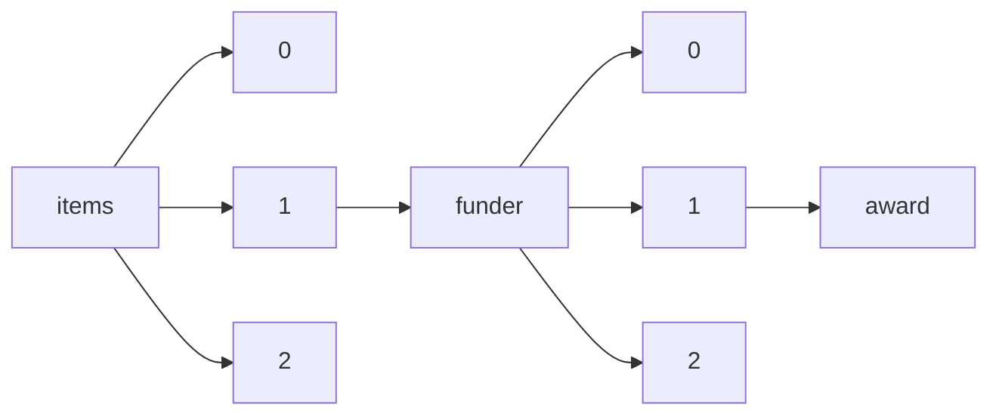

!!! warning "This document is not official Crossref documentation"
# Award
PATH = items/array/funder/array/award(1)  
Occurs 12 195 015 times  
{ .annotate }

1. A route to an element, for example:  
   The route "items/array/funder/array/award" corresponds to navigating through the JSON indices as  
   ["items"][0]["funder"][0]["award"]  

## Properties of Array
See information about elements: [items/array/funder/array/award/array](array/index.md)  
Distribution of lengths:  

| **Row** | **Length** `Any` | **Count** `Int64` |
|--------:|--------------------:|---------------------:|
| **1**   | 1                   | 9 632 048            |
| **2**   | 2                   | 1 624 933            |
| **3**   | 3                   | 541 339              |
| **4**   | 4                   | 212 894              |
| **5**   | 5                   | 89 878               |
| **6**   | 6                   | 42 113               |
| **7**   | 7                   | 20 694               |
| **8**   | 8                   | 11 643               |
| **9**   | 9                   | 6 738                |
| **10**  | 10                  | 4 012                |
| ... | ... | ... |

