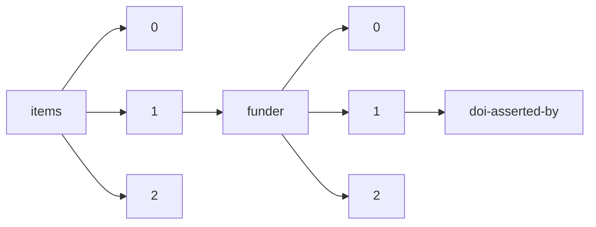

!!! warning "This document is not official Crossref documentation"
# Doi-asserted-by
PATH = items/array/funder/array/doi-asserted-by(1)  
Occurs 13 041 017 times  
Unique values: 2  
{ .annotate }

1. A route to an element, for example:  
   The route "items/array/funder/array/doi-asserted-by" corresponds to navigating through the JSON indices as  
   ["items"][0]["funder"][0]["doi-asserted-by"]  

| **Row** | **Value** `String` | **Count** `Int64` |
|--------:|----------------------:|---------------------:|
| **1**   | publisher             | 11 476 668           |
| **2**   | crossref              | 1 564 349            |

