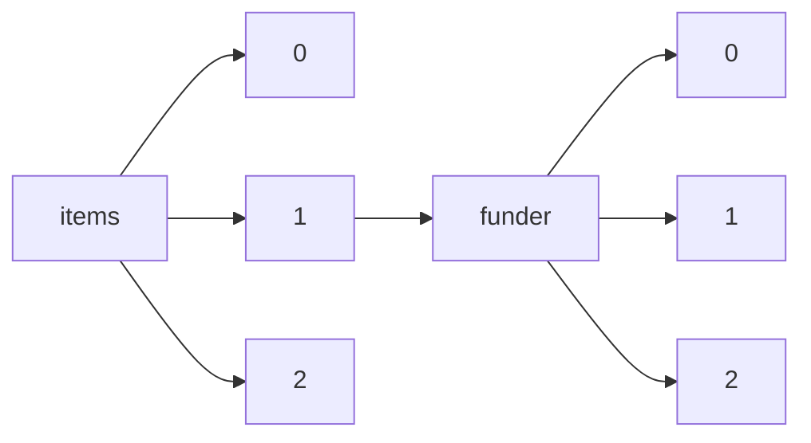

!!! warning "This document is not official Crossref documentation"
# Elements
PATH = items/array/funder/array(1)  
Occurs 18 252 697 times  
{ .annotate }

1. A route to an element, for example:  
   The route "items/array/funder/array" corresponds to navigating through the JSON indices as  
   ["items"][0]["funder"][0]  

## DOI
See more information: [items/array/funder/array/DOI](DOI/index.md)  
Occurs 13 041 017 timess  
Unique values: > 999  

!!! note "Due to current limitations, only the first 1,000 unique values are counted."

| **Row** | **Value** `String` | **Count** `Int64` |
|--------:|----------------------:|---------------------:|
| **1**   | 10.13039/501100001809 | 1 960 108            |
| **2**   | 10.13039/100000002    | 351 663              |
| **3**   | 10.13039/100000001    | 337 426              |
| **4**   | 10.13039/501100012166 | 205 940              |
| **5**   | 10.13039/501100001659 | 198 789              |
| **6**   | 10.13039/501100003725 | 178 218              |
| **7**   | 10.13039/501100001691 | 177 336              |
| **8**   | 10.13039/501100012226 | 163 470              |
| **9**   | 10.13039/501100003593 | 128 466              |
| **10**  | 10.13039/501100001700 | 124 626              |
| ... | ... | ... |

## Award
See more information: [items/array/funder/array/award](award/index.md)  
Occurs 12 195 015 timess  

| **Row** | **Length** `Any` | **Count** `Int64` |
|--------:|--------------------:|---------------------:|
| **1**   | 1                   | 9 632 048            |
| **2**   | 2                   | 1 624 933            |
| **3**   | 3                   | 541 339              |
| **4**   | 4                   | 212 894              |
| **5**   | 5                   | 89 878               |
| **6**   | 6                   | 42 113               |
| **7**   | 7                   | 20 694               |
| **8**   | 8                   | 11 643               |
| **9**   | 9                   | 6 738                |
| **10**  | 10                  | 4 012                |
| ... | ... | ... |

## Doi-asserted-by
See more information: [items/array/funder/array/doi-asserted-by](doi-asserted-by/index.md)  
Occurs 13 041 017 timess  
Unique values: 2  

| **Row** | **Value** `String` | **Count** `Int64` |
|--------:|----------------------:|---------------------:|
| **1**   | publisher             | 11 476 668           |
| **2**   | crossref              | 1 564 349            |

## Name
See more information: [items/array/funder/array/name](name/index.md)  
Occurs 18 226 882 timess  
Unique values: > 999  

!!! note "Due to current limitations, only the first 1,000 unique values are counted."

| **Row** | **Value** `String`                                          | **Count** `Int64` |
|--------:|---------------------------------------------------------------:|---------------------:|
| **1**   | National Natural Science Foundation of China                   | 1 744 422            |
| **2**   | National Science Foundation                                    | 333 067              |
| **3**   | National Institutes of Health                                  | 280 235              |
| **4**   | Deutsche Forschungsgemeinschaft                                | 172 087              |
| **5**   | Fundamental Research Funds for the Central Universities        | 170 341              |
| **6**   | National Research Foundation of Korea                          | 160 243              |
| **7**   | Japan Society for the Promotion of Science                     | 149 666              |
| **8**   | National Key Research and Development Program of China         | 139 742              |
| **9**   | China Postdoctoral Science Foundation                          | 104 505              |
| **10**  | Ministry of Education, Culture, Sports, Science and Technology | 102 494              |
| ... | ... | ... |

