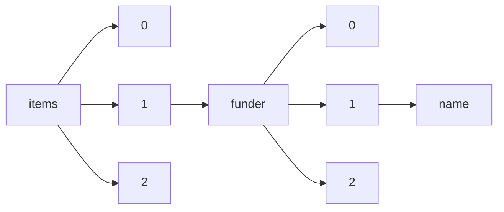

!!! warning "This document is not official Crossref documentation"
# Name
PATH = items/array/funder/array/name(1)  
Occurs 18 226 882 times  
Unique values: > 999  
{ .annotate }

1. A route to an element, for example:  
   The route "items/array/funder/array/name" corresponds to navigating through the JSON indices as  
   ["items"][0]["funder"][0]["name"]  

!!! note "Due to current limitations, only the first 1,000 unique values are counted."

| **Row** | **Value** `String`                                                                                  | **Count** `Int64` |
|--------:|-------------------------------------------------------------------------------------------------------:|---------------------:|
| **1**   | National Natural Science Foundation of China                                                           | 1 744 422            |
| **2**   | National Science Foundation                                                                            | 333 067              |
| **3**   | National Institutes of Health                                                                          | 280 235              |
| **4**   | Deutsche Forschungsgemeinschaft                                                                        | 172 087              |
| **5**   | Fundamental Research Funds for the Central Universities                                                | 170 341              |
| **6**   | National Research Foundation of Korea                                                                  | 160 243              |
| **7**   | Japan Society for the Promotion of Science                                                             | 149 666              |
| **8**   | National Key Research and Development Program of China                                                 | 139 742              |
| **9**   | China Postdoctoral Science Foundation                                                                  | 104 505              |
| **10**  | Ministry of Education, Culture, Sports, Science and Technology                                         | 102 494              |
| **11**  | Natural Sciences and Engineering Research Council of Canada                                            | 97 229               |
| **12**  | U.S. Department of Energy                                                                              | 91 963               |
| **13**  | Conselho Nacional de Desenvolvimento Científico e Tecnológico                                          | 80 937               |
| **14**  | Australian Research Council                                                                            | 73 310               |
| **15**  | NIH                                                                                                    | 67 876               |
| **16**  | European Research Council                                                                              | 67 820               |
| **17**  | Engineering and Physical Sciences Research Council                                                     | 63 241               |
| **18**  | Coordenação de Aperfeiçoamento de Pessoal de Nível Superior                                            | 63 042               |
| **19**  | China Scholarship Council                                                                              | 60 738               |
| **20**  | Ministry of Science and Technology of the People's Republic of China                                   | 57 566               |
| **21**  | European Commission                                                                                    | 51 742               |
| **22**  | Ministry of Science and Technology, Taiwan                                                             | 51 438               |
| **23**  | Chinese Academy of Sciences                                                                            | 51 300               |
| **24**  | National Basic Research Program of China                                                               | 51 230               |
| **25**  | Agence Nationale de la Recherche                                                                       | 50 595               |
| **26**  | Natural Science Foundation of Jiangsu Province                                                         | 49 963               |
| **27**  | European Regional Development Fund                                                                     | 49 289               |
| **28**  | National Cancer Institute                                                                              | 48 581               |
| **29**  | Ministry of Education                                                                                  | 43 810               |
| **30**  | NSF                                                                                                    | 43 613               |
| **31**  | Russian Science Foundation                                                                             | 41 748               |
| **32**  | National Key R&D Program of China                                                                      | 41 654               |
| **33**  | National Institute of General Medical Sciences                                                         | 41 112               |
| **34**  | Wellcome Trust                                                                                         | 41 002               |
| **35**  | Natural Science Foundation of China                                                                    | 40 510               |
| **36**  | Fundação de Amparo à Pesquisa do Estado de São Paulo                                                   | 39 338               |
| **37**  | Canadian Institutes of Health Research                                                                 | 38 055               |
| **38**  | Russian Foundation for Basic Research                                                                  | 37 988               |
| **39**  | Bundesministerium für Bildung und Forschung                                                            | 37 351               |
| **40**  | Ministerio de Economía y Competitividad                                                                | 36 583               |
| **41**  | Science and Engineering Research Board                                                                 | 36 009               |
| **42**  | Fundação para a Ciência e a Tecnologia                                                                 | 33 264               |
| **43**  | Natural Science Foundation of Shandong Province                                                        | 32 561               |
| **44**  | National Health and Medical Research Council                                                           | 32 302               |
| **45**  | H2020 European Research Council                                                                        | 32 119               |
| **46**  | National Institute of Mental Health                                                                    | 30 709               |
| **47**  | Schweizerischer Nationalfonds zur Förderung der Wissenschaftlichen Forschung                           | 30 650               |
| **48**  | National Aeronautics and Space Administration                                                          | 30 565               |
| **49**  | CNPq                                                                                                   | 30 223               |
| **50**  | NSFC                                                                                                   | 30 197               |
| **51**  | Natural Science Foundation of Guangdong Province                                                       | 29 997               |
| **52**  | National Science Foundation of China                                                                   | 27 987               |
| **53**  | Medical Research Council                                                                               | 27 934               |
| **54**  | National Heart, Lung, and Blood Institute                                                              | 27 711               |
| **55**  | the National Natural Science Foundation of China                                                       | 27 158               |
| **56**  | Office of Naval Research                                                                               | 26 282               |
| **57**  | Natural Science Foundation of Zhejiang Province                                                        | 26 057               |
| **58**  | Horizon 2020 Framework Programme                                                                       | 25 564               |
| **59**  | Ministry of Education of the People's Republic of China                                                | 25 478               |
| **60**  | Narodowe Centrum Nauki                                                                                 | 25 405               |
| **61**  | Air Force Office of Scientific Research                                                                | 25 346               |
| **62**  | Horizon 2020                                                                                           | 25 195               |
| **63**  | Seventh Framework Programme                                                                            | 25 065               |
| **64**  | Academy of Finland                                                                                     | 25 036               |
| **65**  | National Institute on Aging                                                                            | 24 962               |
| **66**  | National Institute of Allergy and Infectious Diseases                                                  | 24 642               |
| **67**  | Consejo Nacional de Ciencia y Tecnología                                                               | 23 780               |
| **68**  | National Research Foundation                                                                           | 23 520               |
| **69**  | Vetenskapsrådet                                                                                        | 23 519               |
| **70**  | Basic Energy Sciences                                                                                  | 23 069               |
| **71**  | Austrian Science Fund                                                                                  | 22 738               |
| **72**  | Science and Technology Commission of Shanghai Municipality                                             | 22 098               |
| **73**  | Ministry of Science, ICT and Future Planning                                                           | 21 768               |
| **74**  | National Natural Science Foundation of China (NSFC)                                                    | 21 518               |
| **75**  | Nederlandse Organisatie voor Wetenschappelijk Onderzoek                                                | 21 225               |
| **76**  | University Grants Commission                                                                           | 21 084               |
| **77**  | Ministry of Science and Technology                                                                     | 20 857               |
| **78**  | Priority Academic Program Development of Jiangsu Higher Education Institutions                         | 20 659               |
| **79**  | Swiss National Science Foundation                                                                      | 20 262               |
| **80**  | JSPS KAKENHI                                                                                           | 20 144               |
| **81**  | National Institute of Diabetes and Digestive and Kidney Diseases                                       | 19 610               |
| **82**  | National Institute on Drug Abuse                                                                       | 19 375               |
| **83**  | Biotechnology and Biological Sciences Research Council                                                 | 19 262               |
| **84**  | Japan Science and Technology Agency                                                                    | 19 078               |
| **85**  | Israel Science Foundation                                                                              | 18 996               |
| **86**  | Ministerio de Ciencia e Innovación                                                                     | 18 882               |
| **87**  | CAPES                                                                                                  | 18 601               |
| **88**  | National Nature Science Foundation of China                                                            | 18 386               |
| **89**  | Ministry of Education, Science and Technology                                                          | 18 157               |
| **90**  | Japan Agency for Medical Research and Development                                                      | 17 035               |
| **91**  | Division of Chemistry                                                                                  | 17 007               |
| **92**  | Instituto de Salud Carlos III                                                                          | 16 668               |
| **93**  | National Institute of Neurological Disorders and Stroke                                                | 16 477               |
| **94**  | American Heart Association                                                                             | 16 234               |
| **95**  | Ministry of Education of the People&apos;s Republic of China                                           | 16 215               |
| **96**  | National Center for Advancing Translational Sciences                                                   | 16 090               |
| **97**  | Natural Environment Research Council                                                                   | 16 057               |
| **98**  | National Institute for Health Research                                                                 | 15 794               |
| **99**  | Ministry of Education and Science of the Russian Federation                                            | 15 657               |
| **100** | Army Research Office                                                                                   | 15 329               |
| **101** | U.S. Department of Agriculture                                                                         | 15 172               |
| **102** | HHS \| National Institutes of Health                                                                   | 14 502               |
| **103** | Bill and Melinda Gates Foundation                                                                      | 14 479               |
| **104** | German Research Foundation                                                                             | 14 414               |
| **105** | Royal Society                                                                                          | 14 208               |
| **106** | Grantová Agentura České Republiky                                                                      | 13 961               |
| **107** | European Union                                                                                         | 13 917               |
| **108** | Ministero dell’Istruzione, dell’Università e della Ricerca                                             | 13 839               |
| **109** | U.S. Department of Defense                                                                             | 13 749               |
| **110** | Natural Science Foundation of Beijing Municipality                                                     | 13 703               |
| **111** | Office of Science                                                                                      | 13 631               |
| **112** | FAPESP                                                                                                 | 13 381               |
| **113** | Department of Science and Technology, Ministry of Science and Technology                               | 13 371               |
| **114** | Fonds Wetenschappelijk Onderzoek                                                                       | 13 238               |
| **115** | National Institute of Food and Agriculture                                                             | 13 224               |
| **116** | European Social Fund                                                                                   | 13 221               |
| **117** | Ministry of Trade, Industry and Energy                                                                 | 13 181               |
| **118** | Centre National de la Recherche Scientifique                                                           | 13 144               |
| **119** | Eunice Kennedy Shriver National Institute of Child Health and Human Development                        | 13 142               |
| **120** | Economic and Social Research Council                                                                   | 12 969               |
| **121** | Norges Forskningsråd                                                                                   | 12 898               |
| **122** | Social Sciences and Humanities Research Council of Canada                                              | 12 868               |
| **123** | Natural Science Foundation of Shanghai                                                                 | 12 413               |
| **124** | H2020 Marie Skłodowska-Curie Actions                                                                   | 12 326               |
| **125** | Swedish Research Council                                                                               | 12 229               |
| **126** | Alexander von Humboldt-Stiftung                                                                        | 12 068               |
| **127** | Science Foundation Ireland                                                                             | 12 019               |
| **128** | Leverhulme Trust                                                                                       | 11 915               |
| **129** | DFG                                                                                                    | 11 893               |
| **130** | EPSRC                                                                                                  | 11 850               |
| **131** | Ministry of Education, Science and Technological Development of the Republic of Serbia                 | 11 579               |
| **132** | Council of Scientific and Industrial Research                                                          | 11 572               |
| **133** | Beijing Natural Science Foundation                                                                     | 11 437               |
| **134** | Department of Science and Technology, Ministry of Science and Technology, India                        | 11 297               |
| **135** | Division of Materials Research                                                                         | 11 225               |
| **136** | National Institute of Environmental Health Sciences                                                    | 11 198               |
| **137** | JSPS                                                                                                   | 10 981               |
| **138** | Simons Foundation                                                                                      | 10 890               |
| **139** | Natural Science Foundation of Fujian Province                                                          | 10 886               |
| **140** | Ministerstvo Školství, Mládeže a Tělovýchovy                                                           | 10 863               |
| **141** | NSERC                                                                                                  | 10 848               |
| **142** | Consejo Nacional de Investigaciones Científicas y Técnicas                                             | 10 688               |
| **143** | Youth Innovation Promotion Association of the Chinese Academy of Sciences                              | 10 551               |
| **144** | NASA                                                                                                   | 10 460               |
| **145** | Natural Science Foundation of Hebei Province                                                           | 10 444               |
| **146** | Ministerio de Ciencia, Innovación y Universidades                                                      | 10 234               |
| **147** | Defense Advanced Research Projects Agency                                                              | 9 976                |
| **148** | Welch Foundation                                                                                       | 9 906                |
| **149** | Cancer Research UK                                                                                     | 9 885                |
| **150** | Generalitat de Catalunya                                                                               | 9 817                |
| **151** | Research Grants Council, University Grants Committee                                                   | 9 795                |
| **152** | National Institute of Child Health and Human Development                                               | 9 779                |
| **153** | Canada Foundation for Innovation                                                                       | 9 747                |
| **154** | Ministry of Education - Singapore                                                                      | 9 703                |
| **155** | Natural Science Foundation of Hubei Province                                                           | 9 505                |
| **156** | Science and Technology Facilities Council                                                              | 9 318                |
| **157** | National Science Council                                                                               | 9 098                |
| **158** | Natural Science Foundation of Shaanxi Province                                                         | 9 054                |
| **159** | Fundação de Amparo à Pesquisa do Estado de Minas Gerais                                                | 8 812                |
| **160** | Canada Research Chairs                                                                                 | 8 743                |
| **161** | Program for New Century Excellent Talents in University                                                | 8 713                |
| **162** | Ministry of Health, Labour and Welfare                                                                 | 8 650                |
| **163** | Ministarstvo Prosvete, Nauke i Tehnološkog Razvoja                                                     | 8 621                |
| **164** | Ministry of Science and Higher Education of the Russian Federation                                     | 8 546                |
| **165** | Pfizer                                                                                                 | 8 404                |
| **166** | Fundação Carlos Chagas Filho de Amparo à Pesquisa do Estado do Rio de Janeiro                          | 8 373                |
| **167** | National Institute on Alcohol Abuse and Alcoholism                                                     | 8 370                |
| **168** | National Science Foundation (NSF)                                                                      | 8 350                |
| **169** | Ministerio de Educación, Cultura y Deporte                                                             | 8 326                |
| **170** | FEDER                                                                                                  | 8 273                |
| **171** | Natural Science Foundation of Anhui Province                                                           | 8 261                |
| **172** | AstraZeneca                                                                                            | 8 242                |
| **173** | Generalitat Valenciana                                                                                 | 8 210                |
| **174** | Department of Science and Technology                                                                   | 8 169                |
| **175** | HHS \| NIH \| National Institute of Allergy and Infectious Diseases                                    | 8 092                |
| **176** | European Cooperation in Science and Technology                                                         | 8 069                |
| **177** | Agencia Nacional de Promoción Científica y Tecnológica                                                 | 8 037                |
| **178** | Spanish Ministry of Economy and Competitiveness                                                        | 7 958                |
| **179** | Council of Scientific and Industrial Research, India                                                   | 7 950                |
| **180** | King Saud University                                                                                   | 7 935                |
| **181** | Centers for Disease Control and Prevention                                                             | 7 866                |
| **182** | Max-Planck-Gesellschaft                                                                                | 7 839                |
| **183** | Czech Science Foundation                                                                               | 7 676                |
| **184** | National Natural Science Foundation                                                                    | 7 673                |
| **185** | Knut och Alice Wallenbergs Stiftelse                                                                   | 7 606                |
| **186** | Korea Institute of Energy Technology Evaluation and Planning                                           | 7 580                |
| **187** | Foundation for the National Institutes of Health                                                       | 7 564                |
| **188** | Howard Hughes Medical Institute                                                                        | 7 547                |
| **189** | Ministry of Education, Culture, Sports, Science, and Technology                                        | 7 499                |
| **190** | Higher Education Discipline Innovation Project                                                         | 7 368                |
| **191** | Ministry of Higher Education, Malaysia                                                                 | 7 328                |
| **192** | Ministry of Health and Welfare                                                                         | 7 226                |
| **193** | Natural Science Foundation of Tianjin City                                                             | 7 181                |
| **194** | U.S. Department of Veterans Affairs                                                                    | 7 167                |
| **195** | Rural Development Administration                                                                       | 7 043                |
| **196** | Thailand Research Fund                                                                                 | 7 017                |
| **197** | National Research Foundation Singapore                                                                 | 6 892                |
| **198** | Core Research for Evolutional Science and Technology                                                   | 6 882                |
| **199** | FCT                                                                                                    | 6 866                |
| **200** | Fondo Nacional de Desarrollo Científico y Tecnológico                                                  | 6 802                |
| **201** | National Key Research and Development Program                                                          | 6 742                |
| **202** | American Cancer Society                                                                                | 6 642                |
| **203** | Research and Development                                                                               | 6 567                |
| **204** | Deutscher Akademischer Austauschdienst                                                                 | 6 543                |
| **205** | Javna Agencija za Raziskovalno Dejavnost RS                                                            | 6 416                |
| **206** | CONACYT                                                                                                | 6 392                |
| **207** | None                                                                                                   | 6 334                |
| **208** | British Heart Foundation                                                                               | 6 324                |
| **209** | Zhejiang Provincial Natural Science Foundation of China                                                | 6 290                |
| **210** | National High Technology Research and Development Program of China                                     | 6 268                |
| **211** | Gordon and Betty Moore Foundation                                                                      | 6 227                |
| **212** | MINECO                                                                                                 | 6 200                |
| **213** | Natural Science Foundation of Liaoning Province                                                        | 6 176                |
| **214** | National Institute of Arthritis and Musculoskeletal and Skin Diseases                                  | 6 005                |
| **215** | Fundamental Research Funds for the Central Universities of China                                       | 5 952                |
| **216** | ERC                                                                                                    | 5 896                |
| **217** | Ministerio de Economía, Industria y Competitividad, Gobierno de España                                 | 5 866                |
| **218** | Takeda Science Foundation                                                                              | 5 846                |
| **219** | National Eye Institute                                                                                 | 5 841                |
| **220** | Iran National Science Foundation                                                                       | 5 835                |
| **221** | Natural Science Foundation of Chongqing                                                                | 5 817                |
| **222** | Natural Science Foundation of Jiangxi Province                                                         | 5 772                |
| **223** | MEXT \| Japan Society for the Promotion of Science                                                     | 5 772                |
| **224** | National Institute of Standards and Technology                                                         | 5 763                |
| **225** | Natural Science Foundation of Heilongjiang Province                                                    | 5 727                |
| **226** | Agencia Estatal de Investigación                                                                       | 5 644                |
| **227** | National Institute of Biomedical Imaging and Bioengineering                                            | 5 606                |
| **228** | Ministry of Science and Technology of the People&apos;s Republic of China                              | 5 535                |
| **229** | Ministry of Science and Technology of China                                                            | 5 474                |
| **230** | National Oceanic and Atmospheric Administration                                                        | 5 439                |
| **231** | National Natural Science Foundation of China (CN)                                                      | 5 430                |
| **232** | National Key Basic Research Program of China                                                           | 5 399                |
| **233** | Fonds De La Recherche Scientifique - FNRS                                                              | 5 366                |
| **234** | Natural Science Foundation of Hunan Province                                                           | 5 312                |
| **235** | National Council for Scientific and Technological Development                                          | 5 290                |
| **236** | Comunidad de Madrid                                                                                    | 5 231                |
| **237** | U.S. Department of Health & Human Services \| National Institutes of Health                            | 5 181                |
| **238** | the Fundamental Research Funds for the Central Universities                                            | 5 161                |
| **239** | Research Council of Norway                                                                             | 5 135                |
| **240** | Ministry of Science and ICT, South Korea                                                               | 5 111                |
| **241** | National Institute of Health                                                                           | 5 089                |
| **242** | ZonMw                                                                                                  | 5 043                |
| **243** | Associazione Italiana per la Ricerca sul Cancro                                                        | 5 030                |
| **244** | ANR                                                                                                    | 5 029                |
| **245** | Qatar National Research Fund                                                                           | 5 028                |
| **246** | United States Agency for International Development                                                     | 4 999                |
| **247** | Division of Chemical, Bioengineering, Environmental, and Transport Systems                             | 4 964                |
| **248** | National Research Foundation of Korea (NRF)                                                            | 4 962                |
| **249** | Novartis                                                                                               | 4 952                |
| **250** | Agency for Healthcare Research and Quality                                                             | 4 926                |
| **251** | CONICET                                                                                                | 4 926                |
| **252** | European Space Agency                                                                                  | 4 876                |
| **253** | 111 Project                                                                                            | 4 850                |
| **254** | FP7 Ideas: European Research Council                                                                   | 4 846                |
| **255** | Indian Council of Medical Research                                                                     | 4 843                |
| **256** | National University of Singapore                                                                       | 4 818                |
| **257** | National Major Science and Technology Projects of China                                                | 4 727                |
| **258** | Science and Technology Planning Project of Guangdong Province                                          | 4 691                |
| **259** | Ministry of Science and Technology of Taiwan                                                           | 4 679                |
| **260** | National Science and Technology Major Project                                                          | 4 674                |
| **261** | Natural Science Foundation of Hunan Province                                                           | 4 662                |
| **262** | King Abdullah University of Science and Technology                                                     | 4 654                |
| **263** | National Center for Research Resources                                                                 | 4 630                |
| **264** | HHS \| NIH \| National Institute of General Medical Sciences                                           | 4 618                |
| **265** | The National Natural Science Foundation of China                                                       | 4 611                |
| **266** | New Energy and Industrial Technology Development Organization                                          | 4 596                |
| **267** | national natural science foundation of china                                                           | 4 584                |
| **268** | Ministero della Salute                                                                                 | 4 568                |
| **269** | National Institute on Deafness and Other Communication Disorders                                       | 4 528                |
| **270** | Alfred P. Sloan Foundation                                                                             | 4 506                |
| **271** | Shanghai Municipal Education Commission                                                                | 4 482                |
| **272** | Comisión Nacional de Investigación Científica y Tecnológica                                            | 4 413                |
| **273** | None.                                                                                                  | 4 365                |
| **274** | Natural Science Foundation of Guangxi Province                                                         | 4 355                |
| **275** | National Science Centre                                                                                | 4 331                |
| **276** | Postdoctoral Research Foundation of China                                                              | 4 235                |
| **277** | Ministry of Science and ICT                                                                            | 4 184                |
| **278** | Spanish Ministry of Science and Innovation                                                             | 4 146                |
| **279** | Türkiye Bilimsel ve Teknolojik Araştirma Kurumu                                                        | 4 085                |
| **280** | Basic and Applied Basic Research Foundation of Guangdong Province                                      | 4 067                |
| **281** | Medtronic                                                                                              | 4 049                |
| **282** | Korea Health Industry Development Institute                                                            | 4 046                |
| **283** | U.S. Department of Health and Human Services                                                           | 3 977                |
| **284** | Novo Nordisk Fonden                                                                                    | 3 919                |
| **285** | Deutsche Forschungsgemeinschaft (DFG)                                                                  | 3 876                |
| **286** | Department of Science and Technology of Sichuan Province                                               | 3 872                |
| **287** | Division of Graduate Education                                                                         | 3 853                |
| **288** | Foundation for Innovative Research Groups of the National Natural Science Foundation of China          | 3 797                |
| **289** | U.S. Geological Survey                                                                                 | 3 793                |
| **290** | Human Frontier Science Program                                                                         | 3 789                |
| **291** | São Paulo Research Foundation                                                                          | 3 784                |
| **292** | Ministry of Human Resource Development                                                                 | 3 743                |
| **293** | National Nuclear Security Administration                                                               | 3 719                |
| **294** | National Key Research and Development Program of China Stem Cell and Translational Research            | 3 696                |
| **295** | Sichuan Province Science and Technology Support Program                                                | 3 654                |
| **296** | GlaxoSmithKline                                                                                        | 3 649                |
| **297** | U.S. Department of Health & Human Services \| NIH \| National Cancer Institute                         | 3 640                |
| **298** | HHS \| NIH \| National Heart, Lung, and Blood Institute                                                | 3 639                |
| **299** | Innovative Research Group Project of the National Natural Science Foundation of China                  | 3 606                |
| **300** | National Institute of Dental and Craniofacial Research                                                 | 3 606                |
| **301** | Spanish Government                                                                                     | 3 594                |
| **302** | U.S. National Science Foundation                                                                       | 3 581                |
| **303** | Volkswagen Foundation                                                                                  | 3 579                |
| **304** | NRF                                                                                                    | 3 576                |
| **305** | Guangdong Science and Technology Department                                                            | 3 549                |
| **306** | Fundação para a Ciência e Tecnologia                                                                   | 3 545                |
| **307** | American Chemical Society Petroleum Research Fund                                                      | 3 527                |
| **308** | City University of Hong Kong                                                                           | 3 474                |
| **309** | National Science Fund for Distinguished Young Scholars                                                 | 3 396                |
| **310** | Program for Changjiang Scholars and Innovative Research Team in University                             | 3 384                |
| **311** | Six Talent Peaks Project in Jiangsu Province                                                           | 3 370                |
| **312** | Svenska Forskningsrådet Formas                                                                         | 3 343                |
| **313** | NCI                                                                                                    | 3 337                |
| **314** | Ministry of Environment                                                                                | 3 334                |
| **315** | Federación Española de Enfermedades Raras                                                              | 3 333                |
| **316** | John Templeton Foundation                                                                              | 3 325                |
| **317** | Central Universities                                                                                   | 3 323                |
| **318** | FONDECYT                                                                                               | 3 319                |
| **319** | Suomen Akatemia                                                                                        | 3 310                |
| **320** | Guangdong Basic and Applied Basic Research Foundation                                                  | 3 302                |
| **321** | Japan Society for the Promotion of Science (JSPS)                                                      | 3 296                |
| **322** | Central University Basic Research Fund of China                                                        | 3 285                |
| **323** | Department of Biotechnology, Ministry of Science and Technology, India                                 | 3 277                |
| **324** | Strategic Priority Research Program of the Chinese Academy of Sciences                                 | 3 232                |
| **325** | Eli Lilly and Company                                                                                  | 3 180                |
| **326** | Beijing Municipal Natural Science Foundation                                                           | 3 176                |
| **327** | Key Technology Research and Development Program of Shandong                                            | 3 143                |
| **328** | Deanship of Scientific Research, King Saud University                                                  | 3 135                |
| **329** | U.S. Environmental Protection Agency                                                                   | 3 135                |
| **330** | Sichuan Science and Technology Program                                                                 | 3 132                |
| **331** | DST                                                                                                    | 3 082                |
| **332** | HHS \| NIH \| National Cancer Institute                                                                | 3 042                |
| **333** | the National Key Research and Development Program of China                                             | 3 039                |
| **334** | RFBR                                                                                                   | 3 022                |
| **335** | US Department of Energy                                                                                | 3 020                |
| **336** | Boehringer Ingelheim                                                                                   | 3 011                |
| **337** | US National Science Foundation                                                                         | 2 997                |
| **338** | Science, Technology and Innovation Commission of Shenzhen Municipality                                 | 2 950                |
| **339** | Helmholtz Association                                                                                  | 2 931                |
| **340** | Institut National de la Santé et de la Recherche Médicale                                              | 2 919                |
| **341** | German Federal Ministry of Education and Research                                                      | 2 917                |
| **342** | Department of Energy                                                                                   | 2 900                |
| **343** | Beijing Municipal Science and Technology Commission                                                    | 2 891                |
| **344** | Merck                                                                                                  | 2 885                |
| **345** | Natural Sciences and Engineering Research Council of Canada (NSERC)                                    | 2 884                |
| **346** | MEXT                                                                                                   | 2 846                |
| **347** | Bristol-Myers Squibb                                                                                   | 2 822                |
| **348** | Jiangsu Province                                                                                       | 2 820                |
| **349** | KU Leuven                                                                                              | 2 818                |
| **350** | King Khalid University                                                                                 | 2 814                |
| **351** | Ministerio de Econom?a y Competitividad                                                                | 2 811                |
| **352** | CSIR                                                                                                   | 2 810                |
| **353** | Defense Threat Reduction Agency                                                                        | 2 800                |
| **354** | Bundesministerium für Wirtschaft und Energie                                                           | 2 786                |
| **355** | National Office for Philosophy and Social Sciences                                                     | 2 786                |
| **356** | Natural Science Foundation of Shanxi Province                                                          | 2 769                |
| **357** | Fondation pour la Recherche Médicale                                                                   | 2 759                |
| **358** | Cancer Prevention and Research Institute of Texas                                                      | 2 759                |
| **359** | China Agriculture Research System                                                                      | 2 752                |
| **360** | BMBF                                                                                                   | 2 739                |
| **361** | the National Key R&D Program of China                                                                  | 2 725                |
| **362** | DOE                                                                                                    | 2 720                |
| **363** | Chang Gung Memorial Hospital                                                                           | 2 699                |
| **364** | Slovenian Research Agency                                                                              | 2 688                |
| **365** | Department of Biotechnology , Ministry of Science and Technology                                       | 2 613                |
| **366** | Agency for Science, Technology and Research                                                            | 2 613                |
| **367** | Canadian Network for Research and Innovation in Machining Technology, Natural Sciences and Engineeri   | 2 598                |
| **368** | Xunta de Galicia                                                                                       | 2 576                |
| **369** | Liaoning Revitalization Talents Program                                                                | 2 563                |
| **370** | VINNOVA                                                                                                | 2 561                |
| **371** | Bayer                                                                                                  | 2 560                |
| **372** | Junta de Andalucía                                                                                     | 2 557                |
| **373** | Villum Fonden                                                                                          | 2 557                |
| **374** | Ministry of Science and Technology of the People’s Republic of China                                   | 2 555                |
| **375** | NIH Office of the Director                                                                             | 2 536                |
| **376** | Australian Government                                                                                  | 2 510                |
| **377** | Key Technologies Research and Development Program                                                      | 2 509                |
| **378** | Research to Prevent Blindness                                                                          | 2 504                |
| **379** | French National Research Agency                                                                        | 2 496                |
| **380** | NHMRC                                                                                                  | 2 486                |
| **381** | U.S. Department of Energy (DOE)                                                                        | 2 479                |
| **382** | Shanghai Jiao Tong University                                                                          | 2 473                |
| **383** | FP7 People: Marie-Curie Actions                                                                        | 2 458                |
| **384** | National Social Science Fund of China                                                                  | 2 456                |
| **385** | Sichuan University                                                                                     | 2 453                |
| **386** | National Social Science Foundation of China                                                            | 2 452                |
| **387** | Shanghai Sailing Program                                                                               | 2 431                |
| **388** | National Institute on Minority Health and Health Disparities                                           | 2 428                |
| **389** | Basque Government                                                                                      | 2 424                |
| **390** | State Administration of Foreign Experts Affairs                                                        | 2 416                |
| **391** | Engineering and Physical Sciences Research Council (EPSRC)                                             | 2 409                |
| **392** | Natural Sciences and Engineering Research Council                                                      | 2 407                |
| **393** | NHLBI                                                                                                  | 2 396                |
| **394** | H2020 Marie Sklodowska-Curie Actions                                                                   | 2 391                |
| **395** | Taif University                                                                                        | 2 384                |
| **396** | National Human Genome Research Institute                                                               | 2 365                |
| **397** | National Science Council of Taiwan                                                                     | 2 356                |
| **398** | State Grid Corporation of China                                                                        | 2 351                |
| **399** | Vedecká Grantová Agentúra MŠVVaŠ SR a SAV                                                              | 2 346                |
| **400** | Specialized Research Fund for the Doctoral Program of Higher Education                                 | 2 335                |
| **401** | Nanyang Technological University                                                                       | 2 327                |
| **402** | Croatian Science Foundation                                                                            | 2 322                |
| **403** | Polish Ministry of Science and Higher Education                                                        | 2 319                |
| **404** | University of Minnesota                                                                                | 2 318                |
| **405** | NSF of China                                                                                           | 2 311                |
| **406** | National Postdoctoral Program for Innovative Talents                                                   | 2 301                |
| **407** | Agentúra na Podporu Výskumu a Vývoja                                                                   | 2 294                |
| **408** | Mitacs                                                                                                 | 2 294                |
| **409** | research                                                                                               | 2 287                |
| **410** | FWO                                                                                                    | 2 274                |
| **411** | National Science Council Taiwan                                                                        | 2 270                |
| **412** | Natural Science Foundation of Henan Province                                                           | 2 238                |
| **413** | MIUR                                                                                                   | 2 235                |
| **414** | CNRS                                                                                                   | 2 220                |
| **415** | Hong Kong Polytechnic University                                                                       | 2 215                |
| **416** | FAPEMIG                                                                                                | 2 200                |
| **417** | University of Sydney                                                                                   | 2 184                |
| **418** | BBSRC                                                                                                  | 2 178                |
| **419** | Roche                                                                                                  | 2 174                |
| **420** | FAPERJ                                                                                                 | 2 168                |
| **421** | U.S. Department of Health & Human Services \| NIH \| National Institute of General Medical Sciences    | 2 159                |
| **422** | KAKENHI                                                                                                | 2 152                |
| **423** | Army Research Laboratory                                                                               | 2 150                |
| **424** | Gilead Sciences                                                                                        | 2 134                |
| **425** | STFC                                                                                                   | 2 123                |
| **426** | NWO                                                                                                    | 2 119                |
| **427** | HHS \| NIH \| National Institute of Diabetes and Digestive and Kidney Diseases                         | 2 118                |
| **428** | Institute for Basic Science                                                                            | 2 111                |
| **429** | Fonds de Recherche du Québec - Santé                                                                   | 2 111                |
| **430** | EU                                                                                                     | 2 103                |
| **431** | Sanofi                                                                                                 | 2 079                |
| **432** | U.S. Department of Health & Human Services \| NIH \| National Institute of Mental Health               | 2 078                |
| **433** | Postgraduate Research & Practice Innovation Program of Jiangsu Province                                | 2 076                |
| **434** | Natural Science Foundation of Jilin Province                                                           | 2 074                |
| **435** | UK Research and Innovation                                                                             | 2 069                |
| **436** | Eusko Jaurlaritza                                                                                      | 2 068                |
| **437** | Natural Science Basic Research Plan in Shaanxi Province of China                                       | 2 056                |
| **438** | National Medical Research Council                                                                      | 2 052                |
| **439** | Irish Research Council                                                                                 | 2 044                |
| **440** | Universiti Malaya                                                                                      | 2 038                |
| **441** | U.S. Public Health Service                                                                             | 2 034                |
| **442** | UGC                                                                                                    | 2 025                |
| **443** | Universiti Kebangsaan Malaysia                                                                         | 2 022                |
| **444** | King Abdulaziz University                                                                              | 2 020                |
| **445** | National Natural Science Foundations of China                                                          | 2 012                |
| **446** | Division of Computer and Network Systems                                                               | 2 012                |
| **447** | Italian Ministry of Health                                                                             | 2 005                |
| **448** | Nemzeti Kutatási Fejlesztési és Innovációs Hivatal                                                     | 1 987                |
| **449** | National Institutes of Health (NIH)                                                                    | 1 978                |
| **450** | Fundacja na rzecz Nauki Polskiej                                                                       | 1 975                |
| **451** | AbbVie                                                                                                 | 1 972                |
| **452** | Portuguese Foundation for Science and Technology                                                       | 1 966                |
| **453** | Secretaría de Estado de Investigación, Desarrollo e Innovación                                         | 1 965                |
| **454** | Tsinghua University                                                                                    | 1 964                |
| **455** | National Geographic Society                                                                            | 1 964                |
| **456** | Projekt DEAL                                                                                           | 1 954                |
| **457** | Korea Institute of Science and Technology                                                              | 1 953                |
| **458** | Agricultural Research Service                                                                          | 1 928                |
| **459** | Division of Civil, Mechanical and Manufacturing Innovation                                             | 1 926                |
| **460** | National Key R&amp;D Program of China                                                                  | 1 919                |
| **461** | Universidad de Buenos Aires                                                                            | 1 913                |
| **462** | Novo Nordisk                                                                                           | 1 899                |
| **463** | Lundbeckfonden                                                                                         | 1 897                |
| **464** | National Science Center                                                                                | 1 891                |
| **465** | Bill & Melinda Gates Foundation                                                                        | 1 883                |
| **466** | National Key Research and Development Plan                                                             | 1 882                |
| **467** | Central South University                                                                               | 1 855                |
| **468** | Grant-in-Aid for Scientific Research                                                                   | 1 852                |
| **469** | 973 Program                                                                                            | 1 846                |
| **470** | National Foundation for Science and Technology Development                                             | 1 844                |
| **471** | Natural Science Foundation of Gansu Province                                                           | 1 830                |
| **472** | Division of Computing and Communication Foundations                                                    | 1 826                |
| **473** | Ministry of Science and Higher Education                                                               | 1 823                |
| **474** | Higher Education Commission, Pakistan                                                                  | 1 821                |
| **475** | Air Force Research Laboratory                                                                          | 1 820                |
| **476** | Ministry of Higher Education                                                                           | 1 819                |
| **477** | Indian Council of Agricultural Research                                                                | 1 803                |
| **478** | MOST                                                                                                   | 1 798                |
| **479** | European Union Seventh Framework Programme                                                             | 1 794                |
| **480** | Hrvatska Zaklada za Znanost                                                                            | 1 794                |
| **481** | Specialized Research Fund for the Doctoral Program of Higher Education of China                        | 1 778                |
| **482** | Danmarks Grundforskningsfond                                                                           | 1 773                |
| **483** | Vetenskapsr?det                                                                                        | 1 763                |
| **484** | Precursory Research for Embryonic Science and Technology                                               | 1 752                |
| **485** | National Research Council of Thailand                                                                  | 1 734                |
| **486** | Aeronautical Science Foundation of China                                                               | 1 731                |
| **487** | Semiconductor Research Corporation                                                                     | 1 725                |
| **488** | Korea government                                                                                       | 1 725                |
| **489** | Alexander von Humboldt Foundation                                                                      | 1 704                |
| **490** | Ministerstwo Nauki i Szkolnictwa Wyższego                                                              | 1 702                |
| **491** | Canada First Research Excellence Fund                                                                  | 1 693                |
| **492** | Alzheimer's Association                                                                                | 1 693                |
| **493** | Research Fund for the Doctoral Program of Higher Education of China                                    | 1 693                |
| **494** | Ministry of Economy and Competitiveness                                                                | 1 681                |
| **495** | Fundamental Research Funds                                                                             | 1 666                |
| **496** | Polish National Science Centre                                                                         | 1 663                |
| **497** | Genentech                                                                                              | 1 641                |
| **498** | University of Queensland                                                                               | 1 640                |
| **499** | Wellcome                                                                                               | 1 639                |
| **500** | Chongqing Science and Technology Commission                                                            | 1 638                |
| **501** | Hungarian Scientific Research Fund                                                                     | 1 632                |
| **502** | Scientific and Technological Research Council of Turkey                                                | 1 626                |
| **503** | British Academy                                                                                        | 1 620                |
| **504** | Department of Atomic Energy, Government of India                                                       | 1 609                |
| **505** | Fondo para la Investigación Científica y Tecnológica                                                   | 1 607                |
| **506** | Office of Energy Efficiency and Renewable Energy                                                       | 1 601                |
| **507** | CONACyT                                                                                                | 1 593                |
| **508** | Österreichische Forschungsförderungsgesellschaft                                                       | 1 590                |
| **509** | Slovak Research and Development Agency                                                                 | 1 590                |
| **510** | Universiti Teknologi Malaysia                                                                          | 1 590                |
| **511** | Novo Nordisk Foundation                                                                                | 1 550                |
| **512** | Universiti Sains Malaysia                                                                              | 1 547                |
| **513** | Shandong Provincial Natural Science Foundation                                                         | 1 543                |
| **514** | Korea Institute for Advancement of Technology                                                          | 1 533                |
| **515** | Dirección General de Asuntos del Personal Académico, Universidad Nacional Autónoma de México           | 1 527                |
| **516** | Chulalongkorn University                                                                               | 1 520                |
| **517** | Air Force Office of Scientific Research (AFOSR)                                                        | 1 507                |
| **518** | German Research Foundation (DFG)                                                                       | 1 506                |
| **519** | National Outstanding Youth Science Fund Project of National Natural Science Foundation of China        | 1 506                |
| **520** | Uehara Memorial Foundation                                                                             | 1 505                |
| **521** | National Institute of Nursing Research                                                                 | 1 502                |
| **522** | Innovationsfonden                                                                                      | 1 499                |
| **523** | Science and Technology Program of Guangzhou                                                            | 1 489                |
| **524** | European Research Council (ERC)                                                                        | 1 475                |
| **525** | Centre National d’Etudes Spatiales                                                                     | 1 473                |
| **526** | Norwegian Research Council                                                                             | 1 465                |
| **527** | National Research Foundation of South Africa                                                           | 1 454                |
| **528** | Division of Information and Intelligent Systems                                                        | 1 454                |
| **529** | Los Alamos National Laboratory                                                                         | 1 452                |
| **530** | U.S. Department of Health & Human Services \| NIH \| National Institute of Allergy and Infectious Dise | 1 447                |
| **531** | Academia Sinica                                                                                        | 1 442                |
| **532** | Shandong Province                                                                                      | 1 430                |
| **533** | Fundação de Amparo à Pesquisa do Estado do Rio Grande do Sul                                           | 1 425                |
| **534** | Division of Intramural Research, National Institute of Allergy and Infectious Diseases                 | 1 423                |
| **535** | CONICYT                                                                                                | 1 417                |
| **536** | Fundamental Research Funds for Central Universities of the Central South University                    | 1 417                |
| **537** | ARC                                                                                                    | 1 400                |
| **538** | Amgen                                                                                                  | 1 400                |
| **539** | Guangdong Natural Science Foundation                                                                   | 1 390                |
| **540** | Government of Jiangsu Province                                                                         | 1 389                |
| **541** | Young Scientists Fund                                                                                  | 1 382                |
| **542** | U.S. National Institutes of Health                                                                     | 1 379                |
| **543** | National Science and Technology Major Project of China                                                 | 1 374                |
| **544** | Health Research Council of New Zealand                                                                 | 1 370                |
| **545** | Natural Science Research of Jiangsu Higher Education Institutions of China                             | 1 357                |
| **546** | European Molecular Biology Organization                                                                | 1 351                |
| **547** | NIMH                                                                                                   | 1 337                |
| **548** | Helmholtz-Gemeinschaft                                                                                 | 1 336                |
| **549** | Department of Science and Technology of Jilin Province                                                 | 1 324                |
| **550** | American Diabetes Association                                                                          | 1 319                |
| **551** | Major State Basic Research Development Program of China                                                | 1 314                |
| **552** | Commonwealth Scientific and Industrial Research Organisation                                           | 1 312                |
| **553** | Ministry of Education and Science of Ukraine                                                           | 1 306                |
| **554** | funding                                                                                                | 1 305                |
| **555** | Science Challenge Project                                                                              | 1 304                |
| **556** | National Basic Research Program of China (973 Program)                                                 | 1 303                |
| **557** | National Research Council                                                                              | 1 301                |
| **558** | Российский Фонд Фундаментальных Исследований                                                           | 1 300                |
| **559** | National Key Research and Development Project                                                          | 1 298                |
| **560** | Ministry of Land, Infrastructure and Transport                                                         | 1 293                |
| **561** | Health Research Board                                                                                  | 1 287                |
| **562** | National Science Centre, Poland                                                                        | 1 283                |
| **563** | Ministry of Science, ICT & Future Planning                                                             | 1 280                |
| **564** | The Fundamental Research Funds for the Central Universities                                            | 1 273                |
| **565** | Netherlands Organisation for Scientific Research                                                       | 1 266                |
| **566** | Federal Ministry of Education and Research                                                             | 1 265                |
| **567** | Burroughs Wellcome Fund                                                                                | 1 243                |
| **568** | Netherlands Organization for Scientific Research                                                       | 1 241                |
| **569** | CAS                                                                                                    | 1 234                |
| **570** | NNSFC                                                                                                  | 1 233                |
| **571** | Financiadora de Estudos e Projetos                                                                     | 1 232                |
| **572** | Zhejiang Provincial Natural Science Foundation                                                         | 1 224                |
| **573** | Shandong University                                                                                    | 1 213                |
| **574** | Ministry of Oceans and Fisheries                                                                       | 1 209                |
| **575** | Ministry of Education of China                                                                         | 1 198                |
| **576** | Ferdowsi University of Mashhad                                                                         | 1 195                |
| **577** | Shenzhen Science and Technology Innovation Commission                                                  | 1 193                |
| **578** | Department of Defense                                                                                  | 1 190                |
| **579** | Division of Mathematical Sciences                                                                      | 1 190                |
| **580** | Ministry of Education and Science                                                                      | 1 189                |
| **581** | Institute of Education Sciences                                                                        | 1 182                |
| **582** | Natural Science Basic Research Program of Shaanxi Province                                             | 1 176                |
| **583** | Korea Institute of Planning and Evaluation for Technology in Food, Agriculture, Forestry and Fisheri   | 1 173                |
| **584** | Science Foundation of China University of Petroleum, Beijing                                           | 1 169                |
| **585** | ERDF                                                                                                   | 1 165                |
| **586** | National Health and Medical Research Council of Australia                                              | 1 160                |
| **587** | Ministry of Knowledge Economy                                                                          | 1 160                |
| **588** | RIKEN                                                                                                  | 1 159                |
| **589** | Conselho Nacional de Desenvolvimento Científico e Tecnológico (CNPq)                                   | 1 151                |
| **590** | Fogarty International Center                                                                           | 1 148                |
| **591** | Arts and Humanities Research Council                                                                   | 1 148                |
| **592** | Taishan Scholar Foundation of Shandong Province                                                        | 1 144                |
| **593** | Australian Research Council (ARC)                                                                      | 1 140                |
| **594** | Robert Wood Johnson Foundation                                                                         | 1 135                |
| **595** | NIHR                                                                                                   | 1 135                |
| **596** | Natural Science Foundation of Tianjin                                                                  | 1 134                |
| **597** | Schweizerischer Nationalfonds zur F?rderung der Wissenschaftlichen Forschung                           | 1 134                |
| **598** | National Natural Science Fund of China                                                                 | 1 125                |
| **599** | Tsinghua University Initiative Scientific Research Program                                             | 1 123                |
| **600** | HHS \| NIH \| National Institute of Neurological Disorders and Stroke                                  | 1 122                |
| **601** | Research Grants Council, University Grants Committee, Hong Kong                                        | 1 119                |
| **602** | Government of Canada                                                                                   | 1 110                |
| **603** | Shanghai Rising-Star Program                                                                           | 1 107                |
| **604** | Taiwan Ministry of Science and Technology                                                              | 1 106                |
| **605** | Oak Ridge National Laboratory                                                                          | 1 099                |
| **606** | German Academic Exchange Service                                                                       | 1 094                |
| **607** | Shanxi Provincial Key Research and Development Project                                                 | 1 089                |
| **608** | Abbott Laboratories                                                                                    | 1 087                |
| **609** | Cancerfonden                                                                                           | 1 085                |
| **610** | the National Science Foundation of China                                                               | 1 083                |
| **611** | Korea Science and Engineering Foundation                                                               | 1 082                |
| **612** | ANPCyT                                                                                                 | 1 080                |
| **613** | The National Key Research and Development Program of China                                             | 1 066                |
| **614** | Anhui Provincial Natural Science Foundation                                                            | 1 054                |
| **615** | University of Melbourne                                                                                | 1 052                |
| **616** | Ministry of Agriculture, Food and Rural Affairs                                                        | 1 052                |
| **617** | Chinese National Natural Science Foundation                                                            | 1 051                |
| **618** | Tarbiat Modares University                                                                             | 1 050                |
| **619** | European Union’s Horizon 2020 research and innovation programme                                        | 1 049                |
| **620** | National Key Research and Development Plan of China                                                    | 1 047                |
| **621** | CIHR                                                                                                   | 1 044                |
| **622** | Natural Science Foundation of Inner Mongolia                                                           | 1 039                |
| **623** | Foundation for Science and Technology                                                                  | 1 038                |
| **624** | Hunan Provincial Natural Science Foundation of China                                                   | 1 035                |
| **625** | University of Michigan                                                                                 | 1 030                |
| **626** | NSF (National Science Foundation)                                                                      | 1 025                |
| **627** | Bulgarian National Science Fund                                                                        | 1 024                |
| **628** | University Grants Committee                                                                            | 1 021                |
| **629** | Karolinska Institutet                                                                                  | 1 015                |
| **630** | no funding                                                                                             | 1 014                |
| **631** | Chongqing Municipal Education Commission                                                               | 1 014                |
| **632** | Taishan Scholar Project of Shandong Province                                                           | 1 011                |
| **633** | Ministry of Business, Innovation and Employment                                                        | 1 010                |
| **634** | International Development Research Centre                                                              | 1 001                |
| **635** | Russian Academy of Sciences                                                                            | 1 000                |
| **636** | Coordena??o de Aperfei?oamento de Pessoal de N?vel Superior                                            | 998                  |
| **637** | Gouvernement du Canada \| Natural Sciences and Engineering Research Council of Canada                  | 992                  |
| **638** | Jiangsu Provincial Key Research and Development Program                                                | 978                  |
| **639** | Department of Education of Guangdong Province                                                          | 975                  |
| **640** | Department of Health \| National Health and Medical Research Council                                   | 973                  |
| **641** | Institut National Du Cancer                                                                            | 969                  |
| **642** | Japan Society for the Promotion of Science London                                                      | 969                  |
| **643** | Basic Science Research Program                                                                         | 969                  |
| **644** | Postdoctoral Science Foundation of China                                                               | 966                  |
| **645** | Cystic Fibrosis Foundation                                                                             | 964                  |
| **646** | NERC                                                                                                   | 957                  |
| **647** | U.S. Department of Health & Human Services \| NIH \| National Heart, Lung, and Blood Institute         | 956                  |
| **648** | David and Lucile Packard Foundation                                                                    | 944                  |
| **649** | Gouvernement du Canada \| Canadian Institutes of Health Research                                       | 943                  |
| **650** | Japan Science and Technology Corporation                                                               | 936                  |
| **651** | Division of Environmental Biology                                                                      | 935                  |
| **652** | European Union's Seventh Framework Programme                                                           | 934                  |
| **653** | Universidad Nacional de La Plata                                                                       | 929                  |
| **654** | Chinese Universities Scientific Fund                                                                   | 926                  |
| **655** | Science and Technology Planning Project of Guangdong Province, China                                   | 924                  |
| **656** | Inha University                                                                                        | 923                  |
| **657** | Petrobras                                                                                              | 918                  |
| **658** | Consejo Superior de Investigaciones Científicas                                                        | 916                  |
| **659** | HHS \| National Institutes of Health (NIH)                                                             | 915                  |
| **660** | Beijing Nova Program                                                                                   | 915                  |
| **661** | MRC                                                                                                    | 907                  |
| **662** | Narodowym Centrum Nauki                                                                                | 906                  |
| **663** | RCUK \| Medical Research Council                                                                       | 900                  |
| **664** | King Abdulaziz City for Science and Technology                                                         | 900                  |
| **665** | Council of Scientific and Industrial Research, India                                                   | 899                  |
| **666** | Directorate for Mathematical and Physical Sciences                                                     | 898                  |
| **667** | China Geological Survey                                                                                | 895                  |
| **668** | Major Science and Technology Program for Water Pollution Control and Treatment                         | 893                  |
| **669** | Studienstiftung des Deutschen Volkes                                                                   | 892                  |
| **670** | World Bank Group                                                                                       | 887                  |
| **671** | Ministry of Higher Education and Scientific Research                                                   | 885                  |
| **672** | Universiti Putra Malaysia                                                                              | 884                  |
| **673** | Narodowe Centrum Badań i Rozwoju                                                                       | 881                  |
| **674** | Ministry of Education, India                                                                           | 878                  |
| **675** | Deutsche Krebshilfe                                                                                    | 878                  |
| **676** | Natural Science Foundation of Ningbo                                                                   | 871                  |
| **677** | Fondazione Cariplo                                                                                     | 869                  |
| **678** | Deanship of Scientific Research, King Faisal University                                                | 865                  |
| **679** | Energimyndigheten                                                                                      | 859                  |
| **680** | South African Medical Research Council                                                                 | 858                  |
| **681** | ONR                                                                                                    | 856                  |
| **682** | Interreg                                                                                               | 852                  |
| **683** | Heart and Stroke Foundation of Canada                                                                  | 849                  |
| **684** | World Health Organization                                                                              | 845                  |
| **685** | Stanford University                                                                                    | 843                  |
| **686** | Országos Tudományos Kutatási Alapprogramok                                                             | 842                  |
| **687** | China National Funds for Distinguished Young Scientists                                                | 838                  |
| **688** | HHS \| NIH \| National Cancer Institute (NCI)                                                          | 838                  |
| **689** | Huazhong University of Science and Technology                                                          | 835                  |
| **690** | National Natural Sciences Foundation of China                                                          | 833                  |
| **691** | Agence Nationale de la Recherche (ANR)                                                                 | 832                  |
| **692** | Chinese Academy of Medical Sciences                                                                    | 831                  |
| **693** | Higher Education Commision, Pakistan                                                                   | 827                  |
| **694** | H2020 Euratom                                                                                          | 826                  |
| **695** | MEXT ∣ Japan Society for the Promotion of Science                                                      | 817                  |
| **696** | University of Cambridge                                                                                | 809                  |
| **697** | Agencia Nacional de Investigación y Desarrollo                                                         | 804                  |
| **698** | Ministry of Education, Culture, Sports, Science and Technology of Japan                                | 794                  |
| **699** | Lawrence Livermore National Laboratory                                                                 | 792                  |
| **700** | Jiangsu University                                                                                     | 786                  |
| **701** | United States-Israel Binational Science Foundation                                                     | 785                  |
| **702** | European Regional Development Fund (ERDF)                                                              | 783                  |
| **703** | International Science & Technology Cooperation Program of China                                        | 780                  |
| **704** | NSF Division of Ocean Sciences                                                                         | 780                  |
| **705** | SERB                                                                                                   | 775                  |
| **706** | Argonne National Laboratory                                                                            | 774                  |
| **707** | UK Medical Research Council                                                                            | 774                  |
| **708** | Coordenação de Aperfeicoamento de Pessoal de Nível Superior                                            | 772                  |
| **709** | the Natural Science Foundation of China                                                                | 771                  |
| **710** | Jiangsu Planned Projects for Postdoctoral Research Funds                                               | 766                  |
| **711** | U.S. Department of Health & Human Services \| NIH \| National Institute of Neurological Disorders and  | 764                  |
| **712** | Department of Biotechnology                                                                            | 759                  |
| **713** | Zhejiang University                                                                                    | 758                  |
| **714** | Key-Area Research and Development Program of Guangdong Province                                        | 750                  |
| **715** | Guangdong Province                                                                                     | 749                  |
| **716** | University of California                                                                               | 747                  |
| **717** | Schweizerische Nationalfonds zur Förderung der Wissenschaftlichen Forschung                            | 746                  |
| **718** | Hunan Provincial Science and Technology Department                                                     | 744                  |
| **719** | Health Resources and Services Administration                                                           | 744                  |
| **720** | Korea Basic Science Institute                                                                          | 742                  |
| **721** | European Union's Horizon 2020                                                                          | 741                  |
| **722** | Chinese Scholarship Council                                                                            | 735                  |
| **723** | Guangzhou Municipal Science and Technology Project                                                     | 734                  |
| **724** | Laboratory Directed Research and Development                                                           | 732                  |
| **725** | Agentschap voor Innovatie door Wetenschap en Technologie                                               | 726                  |
| **726** | Guangzhou Science and Technology Program key projects                                                  | 726                  |
| **727** | Education Department of Jilin Province                                                                 | 722                  |
| **728** | Conselho Nacional de Desenvolvimento Cient?fico e Tecnol?gico                                          | 720                  |
| **729** | Kementerian Riset, Teknologi dan Pendidikan Tinggi Republik Indonesia                                  | 720                  |
| **730** | Departamento Administrativo de Ciencia, Tecnología e Innovación                                        | 719                  |
| **731** | Eesti Teadusagentuur                                                                                   | 718                  |
| **732** | King Fahd University of Petroleum and Minerals                                                         | 708                  |
| **733** | Department of Science and Technology, Government of India                                              | 702                  |
| **734** | H2020 Future and Emerging Technologies                                                                 | 701                  |
| **735** | Arthrex                                                                                                | 700                  |
| **736** | Ministry of Education, Youth and Sports of the Czech Republic                                          | 696                  |
| **737** | Ministero dell'Istruzione, dell'Università e della Ricerca                                             | 695                  |
| **738** | National Science Foundation of Sri Lanka                                                               | 695                  |
| **739** | Brain and Behavior Research Foundation                                                                 | 689                  |
| **740** | Health Technology Assessment programme                                                                 | 686                  |
| **741** | Unitatea Executiva pentru Finantarea Invatamantului Superior, a Cercetarii, Dezvoltarii si Inovarii    | 686                  |
| **742** | National Taiwan University                                                                             | 682                  |
| **743** | Innovation Program of Shanghai Municipal Education Commission                                          | 668                  |
| **744** | Samsung                                                                                                | 666                  |
| **745** | Department of Biotechnology, Ministry of Science and Technology                                        | 660                  |
| **746** | Princess Nourah Bint Abdulrahman University                                                            | 657                  |
| **747** | CAMS Innovation Fund for Medical Sciences                                                              | 657                  |
| **748** | National Key Technology R&D Program                                                                    | 652                  |
| **749** | University of Washington                                                                               | 647                  |
| **750** | Bundesministerium f?r Bildung und Forschung                                                            | 647                  |
| **751** | National Basic Research Program                                                                        | 645                  |
| **752** | Board of Research in Nuclear Sciences                                                                  | 644                  |
| **753** | #                                                                                                      | 641                  |
| **754** | National Centre for Research and Development                                                           | 639                  |
| **755** | Innovate UK                                                                                            | 638                  |
| **756** | Charles University                                                                                     | 637                  |
| **757** | National Science Council, Taiwan                                                                       | 635                  |
| **758** | Fundamental Research Funds for the Central Universities, China                                         | 634                  |
| **759** | Ministerstwo Edukacji i Nauki                                                                          | 631                  |
| **760** | Research Foundation Flanders                                                                           | 626                  |
| **761** | KWF Kankerbestrijding                                                                                  | 622                  |
| **762** | Jilin Scientific and Technological Development Program                                                 | 620                  |
| **763** | Max Planck Society                                                                                     | 616                  |
| **764** | Central Committee of the Communist Party of China                                                      | 615                  |
| **765** | Ministry of Education and Science of the Republic of Kazakhstan                                        | 614                  |
| **766** | Agency for Defense Development                                                                         | 613                  |
| **767** | Natural Science Foundation                                                                             | 612                  |
| **768** | U.S. Department of Education                                                                           | 610                  |
| **769** | Ministry of Science ICT and Future Planning                                                            | 609                  |
| **770** | H2020                                                                                                  | 608                  |
| **771** | Peking University                                                                                      | 601                  |
| **772** | Strategic Priority Research Program of Chinese Academy of Sciences                                     | 601                  |
| **773** | Earmarked Fund for China Agriculture Research System                                                   | 598                  |
| **774** | Natural Science Foundation of Jiangsu Province of China                                                | 595                  |
| **775** | Royal Academy of Engineering                                                                           | 595                  |
| **776** | Università degli Studi di Padova                                                                       | 594                  |
| **777** | Biological and Environmental Research                                                                  | 592                  |
| **778** | Coordination for the Improvement of Higher Education Personnel                                         | 586                  |
| **779** | Fonds National de la Recherche Luxembourg                                                              | 585                  |
| **780** | University College London                                                                              | 580                  |
| **781** | Australian National Health and Medical Research Council                                                | 579                  |
| **782** | Magyar Tudományos Akadémia                                                                             | 578                  |
| **783** | Carlsbergfondet                                                                                        | 577                  |
| **784** | Science and Technology Development Fund                                                                | 570                  |
| **785** | TUBITAK                                                                                                | 567                  |
| **786** | U.S. Fish and Wildlife Service                                                                         | 567                  |
| **787** | National Natural Science Foundation of China-Guangdong Joint Fund                                      | 558                  |
| **788** | Agriculture Research System of China                                                                   | 556                  |
| **789** | Technische Universität Dresden                                                                         | 555                  |
| **790** | National Research Council of Science and Technology                                                    | 555                  |
| **791** | Coordenação de Aperfeiçoamento de Pessoal de Nível Superior (CAPES)                                    | 555                  |
| **792** | Chinese National Funding of Social Sciences                                                            | 551                  |
| **793** | Office of Naval Research (ONR)                                                                         | 551                  |
| **794** | NIDDK                                                                                                  | 551                  |
| **795** | U.S. Department of Energy, Office of Science, Office of Basic Energy Sciences                          | 548                  |
| **796** | Korea University                                                                                       | 548                  |
| **797** | Lundbeck Foundation                                                                                    | 544                  |
| **798** | Sumitomo Foundation                                                                                    | 542                  |
| **799** | University of Malaya                                                                                   | 541                  |
| **800** | Korean Government                                                                                      | 537                  |
| **801** | Shanghai Pujiang Program                                                                               | 535                  |
| **802** | Google                                                                                                 | 534                  |
| **803** | Special Project for Research and Development in Key areas of Guangdong Province                        | 533                  |
| **804** | Hellenic Foundation for Research and Innovation                                                        | 529                  |
| **805** | National Research, Development and Innovation Office                                                   | 524                  |
| **806** | National High-tech Research and Development Program                                                    | 521                  |
| **807** | Council for Scientific and Industrial Research                                                         | 519                  |
| **808** | Patient-Centered Outcomes Research Institute                                                           | 519                  |
| **809** | Priority Academic Program Development of Jiangsu Higher Education Institutions (PAPD)                  | 518                  |
| **810** | Danish Council for Independent Research                                                                | 517                  |
| **811** | German-Israeli Foundation for Scientific Research and Development                                      | 516                  |
| **812** | USDA National Institute of Food and Agriculture                                                        | 511                  |
| **813** | Monash University                                                                                      | 507                  |
| **814** | Hunan Provincial Innovation Foundation for Postgraduate                                                | 506                  |
| **815** | MSIP                                                                                                   | 505                  |
| **816** | Korea Evaluation Institute of Industrial Technology                                                    | 504                  |
| **817** | Guangxi Natural Science Foundation                                                                     | 503                  |
| **818** | China Scholarship Council (CSC)                                                                        | 501                  |
| **819** | Qatar University                                                                                       | 499                  |
| **820** | Univerzita Karlova v Praze                                                                             | 498                  |
| **821** | Tabriz University of Medical Sciences                                                                  | 495                  |
| **822** | Instituto Nazionale di Fisica Nucleare                                                                 | 493                  |
| **823** | Department of Veterans Affairs                                                                         | 491                  |
| **824** | MICINN                                                                                                 | 489                  |
| **825** | Natural Science Foundation of the Jiangsu Higher Education Institutions of China                       | 488                  |
| **826** | Korea Environmental Industry and Technology Institute                                                  | 486                  |
| **827** | University of Tokyo                                                                                    | 482                  |
| **828** | Youth Innovation Promotion Association CAS                                                             | 477                  |
| **829** | Genome Canada                                                                                          | 476                  |
| **830** | Shandong Province Natural Science Foundation                                                           | 475                  |
| **831** | State Key Program of National Natural Science of China                                                 | 471                  |
| **832** | U.S. Department of Health & Human Services \| NIH \| National Institute of Diabetes and Digestive and  | 468                  |
| **833** | National Key Research and Development Project of China                                                 | 467                  |
| **834** | St. Jude Medical                                                                                       | 466                  |
| **835** | U.S. Department of Health & Human Services \| NIH \| National Institute on Aging                       | 466                  |
| **836** | International Atomic Energy Agency                                                                     | 465                  |
| **837** | University Grant Commission                                                                            | 461                  |
| **838** | Alberta Innovates                                                                                      | 461                  |
| **839** | Deutsche Forschungsgemeinschaft (DE)                                                                   | 461                  |
| **840** | National Natural Science Foundation of China-Yunnan Joint Fund                                         | 461                  |
| **841** | National Institute for Occupational Safety and Health                                                  | 459                  |
| **842** | European Union’s Horizon 2020                                                                          | 459                  |
| **843** | USDA                                                                                                   | 456                  |
| **844** | Microsoft Research                                                                                     | 452                  |
| **845** | Harbin Institute of Technology                                                                         | 452                  |
| **846** | U.S. Department of Energy (Department of Energy)                                                       | 450                  |
| **847** | Mayo Clinic                                                                                            | 449                  |
| **848** | Education Department of Shaanxi Province                                                               | 445                  |
| **849** | Special Fund for Agro-scientific Research in the Public Interest                                       | 445                  |
| **850** | Verband der Chemischen Industrie                                                                       | 444                  |
| **851** | National Health Research Institutes                                                                    | 442                  |
| **852** | Celgene                                                                                                | 441                  |
| **853** | HHS \| NIH \| National Institute of Diabetes and Digestive and Kidney Diseases (NIDDK)                 | 440                  |
| **854** | NIGMS                                                                                                  | 436                  |
| **855** | National Key R & D Program of China                                                                    | 435                  |
| **856** | Gobierno de España Ministerio de Ciencia e Innovación                                                  | 434                  |
| **857** | Guangdong Provincial Natural Science Foundation                                                        | 433                  |
| **858** | Ministry of Science, Innovation and Universities                                                       | 433                  |
| **859** | U.S. Department of Health & Human Services \| NIH \| National Institute on Drug Abuse                  | 432                  |
| **860** | Ohio State University                                                                                  | 429                  |
| **861** | Mahidol University                                                                                     | 429                  |
| **862** | Tekes                                                                                                  | 422                  |
| **863** | Consiglio Nazionale delle Ricerche                                                                     | 418                  |
| **864** | Ministerstvo Zdravotnictví Ceské Republiky                                                             | 410                  |
| **865** | Ningbo University                                                                                      | 410                  |
| **866** | National Institute of Justice                                                                          | 410                  |
| **867** | NINDS                                                                                                  | 407                  |
| **868** | Directorate-General for Research and Innovation                                                        | 405                  |
| **869** | Stichting voor Fundamenteel Onderzoek der Materie                                                      | 405                  |
| **870** | NICHD                                                                                                  | 403                  |
| **871** | European Commission Directorate-General for Research and Innovation                                    | 400                  |
| **872** | Directorate for Biological Sciences                                                                    | 400                  |
| **873** | UK Engineering and Physical Sciences Research Council                                                  | 398                  |
| **874** | national institutes of health                                                                          | 396                  |
| **875** | Ministry of Earth Sciences                                                                             | 395                  |
| **876** | National Heart Foundation of Australia                                                                 | 395                  |
| **877** | Zhejiang Province Natural Science Foundation                                                           | 393                  |
| **878** | Nature                                                                                                 | 391                  |
| **879** | Ligue Contre le Cancer                                                                                 | 390                  |
| **880** | Shiraz University of Medical Sciences                                                                  | 388                  |
| **881** | 111 project                                                                                            | 386                  |
| **882** | National Key Basic Research Program                                                                    | 384                  |
| **883** | United Arab Emirates University                                                                        | 384                  |
| **884** | Shenzhen Science and Technology Program                                                                | 384                  |
| **885** | Danish National Research Foundation                                                                    | 379                  |
| **886** | Thailand Science Research and Innovation                                                               | 376                  |
| **887** | Seoul National University                                                                              | 374                  |
| **888** | Office of Naval Research Global                                                                        | 373                  |
| **889** | AFOSR                                                                                                  | 369                  |
| **890** | Hong Kong Research Grants Council                                                                      | 368                  |
| **891** | Shiraz University                                                                                      | 367                  |
| **892** | Universidad Nacional Autónoma de México                                                                | 366                  |
| **893** | Vienna Science and Technology Fund                                                                     | 363                  |
| **894** | Program of Shanghai Academic Research Leader                                                           | 360                  |
| **895** | The Scientific and Technological Research Council of Turkey                                            | 358                  |
| **896** | Det Frie Forskningsråd                                                                                 | 358                  |
| **897** | European Union’s Seventh Framework Programme                                                           | 355                  |
| **898** | Erasmus+                                                                                               | 353                  |
| **899** | NIAID                                                                                                  | 351                  |
| **900** | West China Hospital, Sichuan University                                                                | 350                  |
| **901** | Wenzhou Municipal Science and Technology Bureau                                                        | 350                  |
| **902** | Forskningsrådet om Hälsa, Arbetsliv och Välfärd                                                        | 347                  |
| **903** | Swedish Foundation for Strategic Research                                                              | 345                  |
| **904** | Beijing Municipal Commission of Education                                                              | 343                  |
| **905** | Johns Hopkins University                                                                               | 339                  |
| **906** | Ministry of Health                                                                                     | 336                  |
| **907** | Department of Education of Liaoning Province                                                           | 335                  |
| **908** | Fundamental Research Funds for Central Universities                                                    | 333                  |
| **909** | NSF CAREER                                                                                             | 332                  |
| **910** | Chang Gung Memorial Hospital, Linkou                                                                   | 331                  |
| **911** | Comisión Interministerial de Ciencia y Tecnología                                                      | 329                  |
| **912** | China Association for Science and Technology                                                           | 326                  |
| **913** | University of Texas at Austin                                                                          | 325                  |
| **914** | Universidade de Macau                                                                                  | 323                  |
| **915** | U.S. Forest Service                                                                                    | 322                  |
| **916** | RCUK \| Biotechnology and Biological Sciences Research Council                                         | 321                  |
| **917** | Biogen                                                                                                 | 320                  |
| **918** | Dutch Research Council                                                                                 | 319                  |
| **919** | Jet Propulsion Laboratory                                                                              | 319                  |
| **920** | National Science Council of the Republic of China                                                      | 314                  |
| **921** | Doctoral Program of Higher Education of China                                                          | 312                  |
| **922** | U.S. Food and Drug Administration                                                                      | 310                  |
| **923** | Gobierno de Aragón                                                                                     | 307                  |
| **924** | Mashhad University of Medical Sciences                                                                 | 306                  |
| **925** | Eidgenössische Technische Hochschule Zürich                                                            | 305                  |
| **926** | Jilin University                                                                                       | 305                  |
| **927** | HHS \| NIH \| National Heart, Lung, and Blood Institute (NHBLI)                                        | 305                  |
| **928** | Deanship of Scientific Research                                                                        | 303                  |
| **929** | Imperial College London                                                                                | 303                  |
| **930** | University of Sheffield                                                                                | 302                  |
| **931** | Office of Extramural Research, National Institutes of Health                                           | 299                  |
| **932** | Tehran University of Medical Sciences and Health Services                                              | 298                  |
| **933** | K. C. Wong Education Foundation                                                                        | 288                  |
| **934** | Spanish Ministerio de Economía y Competitividad                                                        | 286                  |
| **935** | Advanced Research Projects Agency - Energy                                                             | 281                  |
| **936** | Environment and Climate Change Canada                                                                  | 278                  |
| **937** | Canadian Institute of Health Research                                                                  | 276                  |
| **938** | Agence nationale de la recherche                                                                       | 274                  |
| **939** | Grant Agency of the Czech Republic                                                                     | 274                  |
| **940** | Taipei Veterans General Hospital                                                                       | 273                  |
| **941** | Sixth Framework Programme                                                                              | 273                  |
| **942** | HHS \| NIH \| National Institute of Mental Health                                                      | 271                  |
| **943** | Shanghai Municipal Science and Technology Major Project                                                | 271                  |
| **944** | Technische Universität München                                                                         | 270                  |
| **945** | Environmental Protection Agency                                                                        | 269                  |
| **946** | Ministry of Agriculture, Forestry and Fisheries                                                        | 263                  |
| **947** | Boston Scientific Corporation                                                                          | 263                  |
| **948** | University of British Columbia                                                                         | 262                  |
| **949** | Ministerie van Onderwijs, Cultuur en Wetenschap                                                        | 262                  |
| **950** | California Institute of Technology                                                                     | 261                  |
| **951** | FP7                                                                                                    | 260                  |
| **952** | Sanming Project of Medicine in Shenzhen                                                                | 255                  |
| **953** | Soonchunhyang University                                                                               | 254                  |
| **954** | Ministry of Education, Universities and Research                                                       | 250                  |
| **955** | HHS \| NIH \| National Eye Institute                                                                   | 249                  |
| **956** | Michael Smith Foundation for Health Research                                                           | 245                  |
| **957** | Research Grants Council of Hong Kong                                                                   | 241                  |
| **958** | Agència de Gestió d’Ajuts Universitaris i de Recerca                                                   | 237                  |
| **959** | U.S. National Institutes of Health.                                                                    | 231                  |
| **960** | AEIC Academic Exchange Information Centre                                                              | 231                  |
| **961** | the National Basic Research Program of China                                                           | 230                  |
| **962** | Shahid Beheshti University of Medical Sciences                                                         | 229                  |
| **963** | Stiftelsen för Strategisk Forskning                                                                    | 225                  |
| **964** | Smoking Research Foundation                                                                            | 216                  |
| **965** | European Community's Seventh Framework Programme                                                       | 211                  |
| **966** | Innovative Medicines Initiative                                                                        | 208                  |
| **967** | Arthritis Research UK                                                                                  | 207                  |
| **968** | Akademie Věd České Republiky                                                                           | 205                  |
| **969** | Science and Technology Planning Project of Shenzhen Municipality                                       | 204                  |
| **970** | Ministry of Science and Technology, Taiwan (MOST)                                                      | 197                  |
| **971** | Natural Science Foundation of Guangdong Province, China                                                | 193                  |
| **972** | Horizon 2020 Marie Skłodowska-Curie Actions                                                            | 190                  |
| **973** | Institute for Information and communications Technology Promotion                                      | 185                  |
| **974** | GE Healthcare                                                                                          | 182                  |
| **975** | DARPA                                                                                                  | 178                  |
| **976** | Austrian Science Fund (FWF)                                                                            | 177                  |
| **977** | Division of Electrical, Communications and Cyber Systems                                               | 173                  |
| **978** | COST                                                                                                   | 172                  |
| **979** | Space Telescope Science Institute                                                                      | 171                  |
| **980** | Natural Science Foundation of Shandong Province of China                                               | 170                  |
| **981** | Shanghai Leading Academic Discipline Project                                                           | 170                  |
| **982** | Shenzhen Science and Technology Innovation Committee                                                   | 165                  |
| **983** | Karolinska Institute                                                                                   | 163                  |
| **984** | University of Macau                                                                                    | 158                  |
| **985** | Jordan University of Science and Technology                                                            | 149                  |
| **986** | Ministry of Education, Culture, Sports, Science, and Technology of Japan                               | 149                  |
| **987** | Youth Innovation Promotion Association                                                                 | 147                  |
| **988** | National Science and Technology Development Agency                                                     | 145                  |
| **989** | national science foundation                                                                            | 145                  |
| **990** | Education Department of Sichuan Province                                                               | 137                  |
| **991** | Major Scientific and Technological Innovation Project of Shandong Province                             | 137                  |
| **992** | Funda??o para a Ci?ncia e a Tecnologia                                                                 | 135                  |
| **993** | NNSF of China                                                                                          | 134                  |
| **994** | Natural Science and Engineering Research Council of Canada                                             | 132                  |
| **995** | Suomen Kulttuurirahasto                                                                                | 123                  |
| **996** | Deakin University                                                                                      | 116                  |
| **997** | National Health and Medical Research Council, Canberra                                                 | 110                  |
| **998** | National Multiple Sclerosis Society                                                                    | 97                   |
| **999** | Danmarks Frie Forskningsfond                                                                           | 86                   |
| ... | ... | ... |

