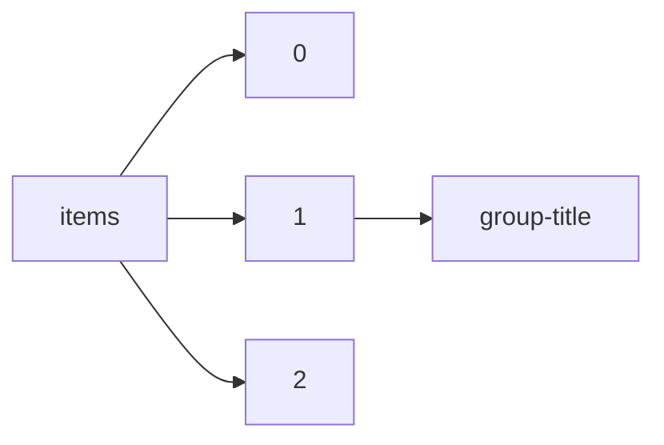

!!! warning "This document is not official Crossref documentation"
# Group-title
PATH = items/array/group-title(1)  
Occurs 966 237 times  
Unique values: > 999  
{ .annotate }

1. A route to an element, for example:  
   The route "items/array/group-title" corresponds to navigating through the JSON indices as  
   ["items"][0]["group-title"]  

!!! note "Due to current limitations, only the first 1,000 unique values are counted."

| **Row** | **Value** `String`                                                                                | **Count** `Int64` |
|--------:|-----------------------------------------------------------------------------------------------------:|---------------------:|
| **1**   | In Review                                                                                            | 252 780              |
| **2**   | Open Science Framework                                                                               | 67 639               |
| **3**   | Neuroscience                                                                                         | 33 549               |
| **4**   | display                                                                                              | 29 559               |
| **5**   | Preprints                                                                                            | 28 720               |
| **6**   | PsyArXiv                                                                                             | 28 644               |
| **7**   | Chemistry                                                                                            | 24 327               |
| **8**   | oral                                                                                                 | 21 845               |
| **9**   | Microbiology                                                                                         | 17 925               |
| **10**  | INA-Rxiv                                                                                             | 17 209               |
| **11**  | pico                                                                                                 | 17 096               |
| **12**  | Bioinformatics                                                                                       | 16 460               |
| **13**  | SocArXiv                                                                                             | 12 573               |
| **14**  | Cell Biology                                                                                         | 10 550               |
| **15**  | Genomics                                                                                             | 10 117               |
| **16**  | Evolutionary Biology                                                                                 | 10 038               |
| **17**  | Infectious Diseases (except HIV/AIDS)                                                                | 9 149                |
| **18**  | Biophysics                                                                                           | 8 871                |
| **19**  | Epidemiology                                                                                         | 8 809                |
| **20**  | Ecology                                                                                              | 8 313                |
| **21**  | Genetics                                                                                             | 7 739                |
| **22**  | Immunology                                                                                           | 7 478                |
| **23**  | Biochemistry                                                                                         | 7 242                |
| **24**  | Cancer Biology                                                                                       | 7 224                |
| **25**  | Molecular Biology                                                                                    | 7 083                |
| **26**  | Journal of Medical Internet Research                                                                 | 6 666                |
| **27**  | Plant Biology                                                                                        | 6 544                |
| **28**  | MEDICINE &amp; PHARMACOLOGY                                                                          | 5 837                |
| **29**  | Developmental Biology                                                                                | 5 793                |
| **30**  | ENGINEERING                                                                                          | 5 408                |
| **31**  | Bioengineering                                                                                       | 5 278                |
| **32**  | LIFE SCIENCES                                                                                        | 4 464                |
| **33**  | Systems Biology                                                                                      | 4 339                |
| **34**  | PeerJ Preprints                                                                                      | 4 240                |
| **35**  | Public and Global Health                                                                             | 3 808                |
| **36**  | MATHEMATICS &amp; COMPUTER SCIENCE                                                                   | 3 540                |
| **37**  | Atmospheric Sciences                                                                                 | 3 197                |
| **38**  | SSRN                                                                                                 | 3 090                |
| **39**  | Physiology                                                                                           | 2 958                |
| **40**  | Thesis Commons                                                                                       | 2 957                |
| **41**  | Animal Behavior and Cognition                                                                        | 2 907                |
| **42**  | BIOLOGY                                                                                              | 2 898                |
| **43**  | JMIR Research Protocols                                                                              | 2 678                |
| **44**  | PHYSICAL SCIENCES                                                                                    | 2 615                |
| **45**  | Geophysics                                                                                           | 2 589                |
| **46**  | SOCIAL SCIENCES                                                                                      | 2 576                |
| **47**  | EARTH SCIENCES                                                                                       | 2 529                |
| **48**  | JMIR mHealth and uHealth                                                                             | 2 366                |
| **49**  | PeerJ PrePrints                                                                                      | 2 206                |
| **50**  | engrXiv                                                                                              | 2 170                |
| **51**  | Pharmacology and Toxicology                                                                          | 2 056                |
| **52**  | Genetic and Genomic Medicine                                                                         | 1 981                |
| **53**  | JMIR Formative Research                                                                              | 1 980                |
| **54**  | Neurology                                                                                            | 1 885                |
| **55**  | Psychiatry and Clinical Psychology                                                                   | 1 817                |
| **56**  | MATERIALS SCIENCE                                                                                    | 1 761                |
| **57**  | Synthetic Biology                                                                                    | 1 758                |
| **58**  | Hydrology                                                                                            | 1 657                |
| **59**  | CHEMISTRY                                                                                            | 1 556                |
| **60**  | Physical Sciences and Mathematics                                                                    | 1 470                |
| **61**  | other                                                                                                | 1 470                |
| **62**  | Pathology                                                                                            | 1 459                |
| **63**  | JMIR Public Health and Surveillance                                                                  | 1 454                |
| **64**  | LawArXiv                                                                                             | 1 428                |
| **65**  | Oceanography                                                                                         | 1 420                |
| **66**  | EdArXiv                                                                                              | 1 309                |
| **67**  | JMIR Medical Informatics                                                                             | 1 273                |
| **68**  | Aerosols/Field Measurements/Troposphere/Chemistry (chemical composition and reactions)               | 1 269                |
| **69**  | Health Informatics                                                                                   | 1 244                |
| **70**  | The Company of Biologists preLights                                                                  | 1 195                |
| **71**  | Scientific Communication and Education                                                               | 1 092                |
| **72**  | Cardiovascular Medicine                                                                              | 1 053                |
| **73**  | Geology                                                                                              | 1 048                |
| **74**  | Oncology                                                                                             | 1 048                |
| **75**  | Aerosols/Field Measurements/Troposphere/Physics (physical properties and processes)                  | 1 027                |
| **76**  | Gases/Field Measurements/Troposphere/Chemistry (chemical composition and reactions)                  | 1 019                |
| **77**  | Zoology                                                                                              | 1 013                |
| **78**  | JMIR Mental Health                                                                                   | 1 011                |
| **79**  | Gases/Atmospheric Modelling/Troposphere/Chemistry (chemical composition and reactions)               | 979                  |
| **80**  | Aerosols/Atmospheric Modelling/Troposphere/Physics (physical properties and processes)               | 974                  |
| **81**  | Life Sciences                                                                                        | 954                  |
| **82**  | Climatology (Global Change)                                                                          | 941                  |
| **83**  | Politics and International Relations                                                                 | 895                  |
| **84**  | BEHAVIORAL SCIENCES                                                                                  | 835                  |
| **85**  | Earth Sciences                                                                                       | 798                  |
| **86**  | Catchment hydrology/Modelling approaches                                                             | 749                  |
| **87**  | Climate and Earth System Modeling                                                                    | 692                  |
| **88**  | Radiology and Imaging                                                                                | 669                  |
| **89**  | Aerosols/Atmospheric Modelling/Troposphere/Chemistry (chemical composition and reactions)            | 644                  |
| **90**  | Staff Report                                                                                         | 640                  |
| **91**  | Protocol Exchange                                                                                    | 638                  |
| **92**  | Pediatrics                                                                                           | 636                  |
| **93**  | Health Policy                                                                                        | 598                  |
| **94**  | Solar System Physics                                                                                 | 570                  |
| **95**  | Aerosols/Laboratory Studies/Troposphere/Chemistry (chemical composition and reactions)               | 564                  |
| **96**  | Gases/Remote Sensing/Data Processing and Information Retrieval                                       | 553                  |
| **97**  | document                                                                                             | 527                  |
| **98**  | Respiratory Medicine                                                                                 | 526                  |
| **99**  | Health Systems and Quality Improvement                                                               | 518                  |
| **100** | Biogeochemistry: Greenhouse Gases                                                                    | 508                  |
| **101** | Arabixiv                                                                                             | 500                  |
| **102** | Crop Protection Compendium                                                                           | 499                  |
| **103** | Working Paper                                                                                        | 493                  |
| **104** | MetaArXiv                                                                                            | 491                  |
| **105** | MarXiv                                                                                               | 485                  |
| **106** | Intensive Care and Critical Care Medicine                                                            | 482                  |
| **107** | Environmental Sciences                                                                               | 480                  |
| **108** | JMIR Human Factors                                                                                   | 477                  |
| **109** | ARTS &amp; HUMANITIES                                                                                | 472                  |
| **110** | Planetology                                                                                          | 469                  |
| **111** | Biogeochemistry: Open Ocean                                                                          | 466                  |
| **112** | JMIR Serious Games                                                                                   | 456                  |
| **113** | Aerosols/Remote Sensing/Troposphere/Physics (physical properties and processes)                      | 450                  |
| **114** | Clouds and Precipitation/Atmospheric Modelling/Troposphere/Physics (physical properties and processe | 446                  |
| **115** | Endocrinology (including Diabetes Mellitus and Metabolic Disease)                                    | 442                  |
| **116** | HIV/AIDS                                                                                             | 435                  |
| **117** | AfricArXiv                                                                                           | 424                  |
| **118** | Gastroenterology                                                                                     | 420                  |
| **119** | Landslides and Debris Flows Hazards                                                                  | 420                  |
| **120** | Occupational and Environmental Health                                                                | 418                  |
| **121** | Biogeochemistry: Coastal Ocean                                                                       | 414                  |
| **122** | Allergy and Immunology                                                                               | 394                  |
| **123** | Obstetrics and Gynecology                                                                            | 390                  |
| **124** | Risk Assessment, Mitigation and Adaptation Strategies, Socioeconomic and Management Aspects          | 388                  |
| **125** | Rehabilitation Medicine and Physical Therapy                                                         | 388                  |
| **126** | SportRxiv                                                                                            | 382                  |
| **127** | Geochemistry                                                                                         | 381                  |
| **128** | Health Economics                                                                                     | 378                  |
| **129** | JMIR Medical Education                                                                               | 377                  |
| **130** | Hydrometeorology/Modelling approaches                                                                | 371                  |
| **131** | Others (Wind, Precipitation, Temperature, etc.)/Remote Sensing/Data Processing and Information Retri | 370                  |
| **132** | Sea, Ocean and Coastal Hazards                                                                       | 369                  |
| **133** | AgriXiv                                                                                              | 367                  |
| **134** | Gases/In Situ Measurement/Instruments and Platforms                                                  | 352                  |
| **135** | Gases/Remote Sensing/Validation and Intercomparisons                                                 | 351                  |
| **136** | Mathematics                                                                                          | 350                  |
| **137** | Atmospheric, Meteorological and Climatological Hazards                                               | 343                  |
| **138** | Biogeochemistry: Air - Land Exchange                                                                 | 341                  |
| **139** | Biogeochemistry: Soils                                                                               | 340                  |
| **140** | Biogeochemistry: Modelling, Terrestrial                                                              | 340                  |
| **141** | Atmospheric sciences                                                                                 | 337                  |
| **142** | LIS Scholarship Archive                                                                              | 336                  |
| **143** | Physical: Geomorphology (including all aspects of fluvial, coastal, aeolian, hillslope and glacial g | 333                  |
| **144** | Invasive Species Compendium                                                                          | 327                  |
| **145** | Aerosols/Remote Sensing/Data Processing and Information Retrieval                                    | 324                  |
| **146** | JMIRx Med                                                                                            | 323                  |
| **147** | Earth System Science/Response to Global Change: Climate Change                                       | 319                  |
| **148** | Climate and Earth system modeling                                                                    | 314                  |
| **149** | Biogeosciences                                                                                       | 306                  |
| **150** | Hydrological Hazards                                                                                 | 305                  |
| **151** | Ophthalmology                                                                                        | 304                  |
| **152** | Iproceedings                                                                                         | 304                  |
| **153** | Biodiversity and Ecosystem Function: Marine                                                          | 295                  |
| **154** | Gases/Remote Sensing/Troposphere/Chemistry (chemical composition and reactions)                      | 291                  |
| **155** | JMIR Pediatrics and Parenting                                                                        | 290                  |
| **156** | Nutrition                                                                                            | 288                  |
| **157** | Clouds/Remote Sensing/Data Processing and Information Retrieval                                      | 287                  |
| **158** | MindRxiv                                                                                             | 280                  |
| **159** | Biodiversity and Ecosystem Function: Terrestrial                                                     | 279                  |
| **160** | Paleontology                                                                                         | 278                  |
| **161** | Clouds and Precipitation/Remote Sensing/Troposphere/Physics (physical properties and processes)      | 275                  |
| **162** | Water Resources Management/Modelling approaches                                                      | 271                  |
| **163** | Engineering                                                                                          | 271                  |
| **164** | JMIR Cancer                                                                                          | 270                  |
| **165** | JMIR Aging                                                                                           | 270                  |
| **166** | organic chemistry                                                                                    | 265                  |
| **167** | Gases/Atmospheric Modelling/Troposphere/Physics (physical properties and processes)                  | 258                  |
| **168** | Ciências Humanas                                                                                     | 257                  |
| **169** | Interactive Journal of Medical Research                                                              | 255                  |
| **170** | ECSarXiv                                                                                             | 251                  |
| **171** | Forestry Compendium                                                                                  | 245                  |
| **172** | Clouds and Precipitation/Field Measurements/Troposphere/Physics (physical properties and processes)  | 245                  |
| **173** | Dynamics/Atmospheric Modelling/Troposphere/Physics (physical properties and processes)               | 239                  |
| **174** | Nephrology                                                                                           | 236                  |
| **175** | Rheumatology                                                                                         | 234                  |
| **176** | Emergency Medicine                                                                                   | 231                  |
| **177** | Biogeochemistry: Stable Isotopes &amp;amp; Other Tracers                                             | 229                  |
| **178** | JMIR Dermatology                                                                                     | 228                  |
| **179** | Aerosols/Laboratory Studies/Troposphere/Physics (physical properties and processes)                  | 228                  |
| **180** | Primary Care Research                                                                                | 223                  |
| **181** | nanotechnology                                                                                       | 221                  |
| **182** | PaleorXiv                                                                                            | 221                  |
| **183** | Surgery                                                                                              | 218                  |
| **184** | Medical Education                                                                                    | 217                  |
| **185** | Pharmacology and Therapeutics                                                                        | 217                  |
| **186** | OBP Blog                                                                                             | 215                  |
| **187** | Education                                                                                            | 214                  |
| **188** | Proceedings of the American Mathematical Society                                                     | 211                  |
| **189** | Wind and turbulence                                                                                  | 208                  |
| **190** | Hematology                                                                                           | 207                  |
| **191** | Geography                                                                                            | 207                  |
| **192** | Earthquake Hazards                                                                                   | 205                  |
| **193** | Rhode Island Current Conditions Index                                                                | 204                  |
| **194** | Sexual and Reproductive Health                                                                       | 204                  |
| **195** | JMIR Diabetes                                                                                        | 204                  |
| **196** | MediArXiv                                                                                            | 204                  |
| **197** | Volume 5: Innovative Solutions for Energy Transitions: Part IV                                       | 199                  |
| **198** | Volume 2: Innovative Solutions for Energy Transitions: Part I                                        | 198                  |
| **199** | Volume 3: Innovative Solutions for Energy Transitions: Part II                                       | 198                  |
| **200** | Gases/Laboratory Studies/Troposphere/Chemistry (chemical composition and reactions)                  | 197                  |
| **201** | Volume 4: Innovative Solutions for Energy Transitions: Part III                                      | 195                  |
| **202** | Geodesy                                                                                              | 194                  |
| **203** | Geriatric Medicine                                                                                   | 193                  |
| **204** | Others (Wind, Precipitation, Temperature, etc.)/Remote Sensing/Validation and Intercomparisons       | 191                  |
| **205** | JMIR Rehabilitation and Assistive Technologies                                                       | 185                  |
| **206** | Sports Medicine                                                                                      | 182                  |
| **207** | Other Hazards (e.g., Glacial and Snow Hazards, Karst, Wildfires Hazards, and Medical Geo-Hazards)    | 180                  |
| **208** | Groundwater hydrology/Modelling approaches                                                           | 178                  |
| **209** | Dynamics/Atmospheric Modelling/Stratosphere/Physics (physical properties and processes)              | 177                  |
| **210** | Aerosols/Laboratory Measurement/Instruments and Platforms                                            | 175                  |
| **211** | Data, Algorithms, and Models                                                                         | 174                  |
| **212** | Addiction Medicine                                                                                   | 174                  |
| **213** | Gases/Remote Sensing/Instruments and Platforms                                                       | 173                  |
| **214** | Frenxiv                                                                                              | 173                  |
| **215** | Еженедельные обзоры                                                                                  | 172                  |
| **216** | prepare@u                                                                                            | 171                  |
| **217** | Meteorology                                                                                          | 170                  |
| **218** | Global hydrology/Modelling approaches                                                                | 169                  |
| **219** | Otolaryngology                                                                                       | 168                  |
| **220** | Gases/Field Measurements/Troposphere/Physics (physical properties and processes)                     | 165                  |
| **221** | Aquaculture Compendium                                                                               | 165                  |
| **222** | Dentistry and Oral Medicine                                                                          | 164                  |
| **223** | Sea Ice                                                                                              | 158                  |
| **224** | Aerosols/In Situ Measurement/Instruments and Platforms                                               | 157                  |
| **225** | Evrim Ağacı Articles                                                                                 | 152                  |
| **226** | EarthArXiv                                                                                           | 152                  |
| **227** | Agricultural, Veterinary and Food Sciences                                                           | 151                  |
| **228** | Information and Computing Sciences                                                                   | 149                  |
| **229** | Biogeochemistry: Environmental Microbiology                                                          | 149                  |
| **230** | Dynamics of the Earth system: models                                                                 | 148                  |
| **231** | Discussion Paper                                                                                     | 145                  |
| **232** | Biogeochemistry: Organic Biogeochemistry                                                             | 143                  |
| **233** | JMIR Cardio                                                                                          | 143                  |
| **234** | Catchment hydrology/Theory development                                                               | 143                  |
| **235** | Gases/Remote Sensing/Troposphere/Physics (physical properties and processes)                         | 141                  |
| **236** | Biogeochemistry: Land                                                                                | 140                  |
| **237** | Atmosphere – Meteorology                                                                             | 139                  |
| **238** | Feature                                                                                              | 138                  |
| **239** | Cryosphere                                                                                           | 137                  |
| **240** | Biogeochemistry: Wetlands                                                                            | 136                  |
| **241** | Databases, GIS, Remote Sensing, Early Warning Systems and Monitoring Technologies                    | 136                  |
| **242** | Social and Behavioral Sciences                                                                       | 136                  |
| **243** | Biogeochemistry: Rivers &amp;amp; Streams                                                            | 135                  |
| **244** | IndiaRxiv                                                                                            | 135                  |
| **245** | Gases/Remote Sensing/Stratosphere/Chemistry (chemical composition and reactions)                     | 131                  |
| **246** | Biogeochemistry: Air - Sea Exchange                                                                  | 130                  |
| **247** | Earth and Environmental Sciences                                                                     | 129                  |
| **248** | Soil System Science                                                                                  | 127                  |
| **249** | Transactions of the American Mathematical Society                                                    | 126                  |
| **250** | News                                                                                                 | 124                  |
| **251** | Biogeophysics: Physical - Biological Coupling                                                        | 120                  |
| **252** | Dermatology                                                                                          | 119                  |
| **253** | Glaciers                                                                                             | 119                  |
| **254** | Catchment hydrology/Instruments and observation techniques                                           | 117                  |
| **255** | Nursing                                                                                              | 117                  |
| **256** | Biogeochemistry: Modelling, Aquatic                                                                  | 117                  |
| **257** | Pain Medicine                                                                                        | 116                  |
| **258** | JMIR Preprints                                                                                       | 114                  |
| **259** | Biogeochemistry: Sediment                                                                            | 114                  |
| **260** | Informatics                                                                                          | 114                  |
| **261** | Antarctic                                                                                            | 114                  |
| **262** | Dynamics of the Earth system: concepts                                                               | 112                  |
| **263** | Aerodynamics and hydrodynamics                                                                       | 110                  |
| **264** | BodoArXiv                                                                                            | 110                  |
| **265** | Vadose Zone Hydrology/Modelling approaches                                                           | 109                  |
| **266** | Aerosols/Remote Sensing/Validation and Intercomparisons                                              | 108                  |
| **267** | Ecohydrology/Modelling approaches                                                                    | 108                  |
| **268** | JMIR Infodemiology                                                                                   | 108                  |
| **269** | Numerical Methods                                                                                    | 108                  |
| **270** | Dynamics of the Earth system: interactions                                                           | 108                  |
| **271** | Orthopedics                                                                                          | 106                  |
| **272** | Dynamics/Field Measurements/Troposphere/Physics (physical properties and processes)                  | 105                  |
| **273** | Soil Science                                                                                         | 104                  |
| **274** | Gases/In Situ Measurement/Validation and Intercomparisons                                            | 104                  |
| **275** | Gases/Atmospheric Modelling/Stratosphere/Chemistry (chemical composition and reactions)              | 104                  |
| **276** | Ciências da Saúde                                                                                    | 102                  |
| **277** | Transplantation                                                                                      | 100                  |
| **278** | Ice sheets/Antarctic                                                                                 | 98                   |
| **279** | Atmosphere – Atmospheric Chemistry and Physics                                                       | 98                   |
| **280** | Biogeochemistry: Biomineralization                                                                   | 98                   |
| **281** | Clinical Trials                                                                                      | 95                   |
| **282** | MetaMAT Weekly Seminars                                                                              | 93                   |
| **283** | Hydrometeorology/Stochastic approaches                                                               | 92                   |
| **284** | Volume 10: Sustainable Energy Solutions for Changing the World: Part II                              | 92                   |
| **285** | Hydrometeorology/Remote Sensing and GIS                                                              | 91                   |
| **286** | Hydrometeorology/Instruments and observation techniques                                              | 91                   |
| **287** | Hydrology and Soil Science – Hydrology                                                               | 91                   |
| **288** | Frozen Ground                                                                                        | 91                   |
| **289** | Эпидемиология                                                                                        | 90                   |
| **290** | Volume 9: Sustainable Energy Solutions for Changing the World: Part I                                | 89                   |
| **291** | NutriXiv                                                                                             | 88                   |
| **292** | Greenland                                                                                            | 88                   |
| **293** | Meeting Report                                                                                       | 87                   |
| **294** | Biodiversity Data Journal                                                                            | 87                   |
| **295** | Remote Sensing                                                                                       | 86                   |
| **296** | Paleobiogeoscience: Proxy use, Development &amp;amp; Validation                                      | 85                   |
| **297** | Gases/Laboratory Measurement/Instruments and Platforms                                               | 85                   |
| **298** | Rivers and Lakes/Modelling approaches                                                                | 85                   |
| **299** | JMIR Nursing                                                                                         | 84                   |
| **300** | Anesthesia                                                                                           | 83                   |
| **301** | JMIR Perioperative Medicine                                                                          | 83                   |
| **302** | Volume 11: Sustainable Energy Solutions for Changing the World: Part III                             | 82                   |
| **303** | Others (Wind, Precipitation, Temperature, etc.)/Remote Sensing/Instruments and Platforms             | 82                   |
| **304** | Volume 1: Energy Innovations: Accelerated Deployment, New Concepts, and Emerging Technologies        | 82                   |
| **305** | Numerical Modelling                                                                                  | 82                   |
| **306** | Sha Fei Photograhpic Collection                                                                      | 81                   |
| **307** | Biosphere Interactions/Atmospheric Modelling/Troposphere/Chemistry (chemical composition and reactio | 79                   |
| **308** | Volume 7: Urban Energy Systems: Building, Transport, Environment, Industry, and Integration          | 77                   |
| **309** | Seasonal Snow                                                                                        | 77                   |
| **310** | Biology                                                                                              | 76                   |
| **311** | Vadose Zone Hydrology/Instruments and observation techniques                                         | 76                   |
| **312** | Journal of Participatory Medicine                                                                    | 76                   |
| **313** | Soils and biogeochemical cycling                                                                     | 75                   |
| **314** | Physical: Landscape Evolution: modelling and field studies                                           | 75                   |
| **315** | Tectonic plate interactions, magma genesis, and lithosphere deformation at all scales/Structural geo | 75                   |
| **316** | Dynamical processes in midlatitudes                                                                  | 74                   |
| **317** | JMIR Biomedical Engineering                                                                          | 73                   |
| **318** | Biodiversity and Ecosystem Function: Microbial Ecology &amp;amp; Geomicrobiology                     | 73                   |
| **319** | Clouds and Precipitation/Laboratory Studies/Troposphere/Physics (physical properties and processes)  | 72                   |
| **320** | Alpine Glaciers                                                                                      | 72                   |
| **321** | Proxy Use-Development-Validation/Terrestrial Archives/Holocene                                       | 71                   |
| **322** | elife                                                                                                | 70                   |
| **323** | Language and Linguistics                                                                             | 70                   |
| **324** | Urology                                                                                              | 70                   |
| **325** | Gases/In Situ Measurement/Data Processing and Information Retrieval                                  | 70                   |
| **326** | Paul Lin and Soong Ching-ling Correspondence                                                         | 70                   |
| **327** | Design methods, reliability and uncertainty modelling                                                | 68                   |
| **328** | Aerosols/In Situ Measurement/Validation and Intercomparisons                                         | 67                   |
| **329** | Biosphere – Biogeosciences                                                                           | 67                   |
| **330** | Numerical methods                                                                                    | 67                   |
| **331** | Outros                                                                                               | 67                   |
| **332** | Civil and Environmental Engineering                                                                  | 66                   |
| **333** | Volume 6: Innovative Solutions for Energy Transitions: Part V                                        | 66                   |
| **334** | Volume 31: Applied Energy Symposium provides a platform for international knowledge exchange         | 65                   |
| **335** | Hydrometeorology/Uncertainty analysis                                                                | 65                   |
| **336** | ZooKeys                                                                                              | 65                   |
| **337** | Biosphere Interactions/Field Measurements/Troposphere/Chemistry (chemical composition and reactions) | 65                   |
| **338** | Groundwater hydrology/Instruments and observation techniques                                         | 65                   |
| **339** | Dynamics/Remote Sensing/Stratosphere/Physics (physical properties and processes)                     | 64                   |
| **340** | Structural geology                                                                                   | 63                   |
| **341** | Biological Sciences                                                                                  | 63                   |
| **342** | RENEWABLE ENERGY                                                                                     | 63                   |
| **343** | Clouds/Remote Sensing/Instruments and Platforms                                                      | 62                   |
| **344** | Sea ice/Remote Sensing                                                                               | 62                   |
| **345** | Economics                                                                                            | 62                   |
| **346** | Physics and Astronomy                                                                                | 62                   |
| **347** | Oceanography – Physical                                                                              | 61                   |
| **348** | Aerosols/In Situ Measurement/Data Processing and Information Retrieval                               | 61                   |
| **349** | Volume 12: Low Carbon Cities and Urban Energy Systems: Part I                                        | 60                   |
| **350** | Radiation/Field Measurements/Troposphere/Physics (physical properties and processes)                 | 60                   |
| **351** | Ice sheets/Greenland                                                                                 | 59                   |
| **352** | Ground Vehicle                                                                                       | 59                   |
| **353** | Математика, информатика, кибернетика                                                                 | 59                   |
| **354** | Others (Wind, Precipitation, Temperature, etc.)/In Situ Measurement/Instruments and Platforms        | 59                   |
| **355** | Экономика и управление                                                                               | 58                   |
| **356** | Water Resources Management/Theory development                                                        | 58                   |
| **357** | Ciências Sociais Aplicadas                                                                           | 58                   |
| **358** | Catchment hydrology/Uncertainty analysis                                                             | 58                   |
| **359** | Earth system change: climate scenarios                                                               | 58                   |
| **360** | Institute Working Paper                                                                              | 57                   |
| **361** | Radiation/Atmospheric Modelling/Troposphere/Physics (physical properties and processes)              | 57                   |
| **362** | Catchment hydrology/Remote Sensing and GIS                                                           | 57                   |
| **363** | Medical Ethics                                                                                       | 56                   |
| **364** | JMIR Bioinformatics and Biotechnology                                                                | 56                   |
| **365** | Seismology                                                                                           | 55                   |
| **366** | Ecohydrology/Instruments and observation techniques                                                  | 55                   |
| **367** | Dynamics/Remote Sensing/Mesosphere/Physics (physical properties and processes)                       | 54                   |
| **368** | Volume 8: Advances in Energy Innovation and Development                                              | 54                   |
| **369** | Geophysics and Seismology                                                                            | 54                   |
| **370** | Perspective                                                                                          | 54                   |
| **371** | Физика, химия                                                                                        | 54                   |
| **372** | Aerosols/Remote Sensing/Instruments and Platforms                                                    | 54                   |
| **373** | Cryosphere – Glaciology                                                                              | 53                   |
| **374** | Hillslope hydrology/Modelling approaches                                                             | 52                   |
| **375** | The Company of Biologists FocalPlane                                                                 | 52                   |
| **376** | Volume 25: Accelerated Energy Innovations and Emerging Technologies                                  | 52                   |
| **377** | Radiation/Remote Sensing/Troposphere/Physics (physical properties and processes)                     | 51                   |
| **378** | Tectonic plate interactions, magma genesis, and lithosphere deformation at all scales/Structural geo | 50                   |
| **379** | Volume 14: Low Carbon Cities and Urban Energy Systems: Part III                                      | 50                   |
| **380** | Volume 28: Closing Carbon Cycles – A Transformation Process Involving Technology, Economy, and Socie | 50                   |
| **381** | Volume 21: Sustainable Energy Solutions for a Post-COVID Recovery towards a Better Future: Part IV   | 49                   |
| **382** | Volume 13: Low Carbon Cities and Urban Energy Systems: Part II                                       | 49                   |
| **383** | Snow/Remote Sensing                                                                                  | 48                   |
| **384** | Volume 23: Sustainable Energy Solutions for a Post-COVID Recovery towards a Better Future: Part VI   | 48                   |
| **385** | Volume 22: Sustainable Energy Solutions for a Post-COVID Recovery towards a Better Future: Part V    | 48                   |
| **386** | Volume 20: Sustainable Energy Solutions for a Post-COVID Recovery towards a Better Future: Part III  | 48                   |
| **387** | Volume 19: Sustainable Energy Solutions for a Post-COVID Recovery towards a Better Future: Part II   | 48                   |
| **388** | Volume 18: Sustainable Energy Solutions for a Post-COVID Recovery towards a Better Future: Part I    | 48                   |
| **389** | Volume 15: Low Carbon Cities and Urban Energy Systems: Part IV                                       | 48                   |
| **390** | Volume 27: Closing Carbon Cycles – A Transformation Process Involving Technology, Economy, and Socie | 48                   |
| **391** | Ciências Exatas e da Terra                                                                           | 47                   |
| **392** | Clouds/Remote Sensing/Validation and Intercomparisons                                                | 47                   |
| **393** | Snow and Ice/Modelling approaches                                                                    | 47                   |
| **394** | Volume 26: Closing Carbon Cycles – A Transformation Process Involving Technology, Economy, and Socie | 47                   |
| **395** | Global Change                                                                                        | 47                   |
| **396** | Biogeochemistry: Limnology                                                                           | 47                   |
| **397** | Fluid Mechanics Webinar Series                                                                       | 47                   |
| **398** | Others (Wind, Precipitation, Temperature, etc.)/In Situ Measurement/Validation and Intercomparisons  | 45                   |
| **399** | Climate Modelling/Modelling only/Holocene                                                            | 45                   |
| **400** | FocUS Archive                                                                                        | 45                   |
| **401** | Engenharias                                                                                          | 44                   |
| **402** | Aerosols/Atmospheric Modelling/Stratosphere/Physics (physical properties and processes)              | 44                   |
| **403** | Hydrometeorology/Mathematical applications                                                           | 44                   |
| **404** | Hydrometeorology/Theory development                                                                  | 44                   |
| **405** | Paleobiogeoscience: Marine Record                                                                    | 44                   |
| **406** | Public Health                                                                                        | 44                   |
| **407** | 12th International Conference on Elastic, Electrical, Transport, and Optical Properties of Inhomogen | 44                   |
| **408** | Ice Sheets                                                                                           | 44                   |
| **409** | Biosphere Interactions/Atmospheric Modelling/Troposphere/Physics (physical properties and processes) | 43                   |
| **410** | Global hydrology/Remote Sensing and GIS                                                              | 43                   |
| **411** | Ground-based instruments                                                                             | 43                   |
| **412** | Volume 24: Sustainable Energy Solutions for a Post-COVID Recovery towards a Better Future: Part VII  | 42                   |
| **413** | Aerosols/Laboratory Measurement/Validation and Intercomparisons                                      | 42                   |
| **414** | EcoEvoRxiv                                                                                           | 41                   |
| **415** | Geomorphology                                                                                        | 40                   |
| **416** | Horticulture Compendium                                                                              | 40                   |
| **417** | Volume 16: Low Carbon Cities and Urban Energy Systems: Part V                                        | 40                   |
| **418** | Climate Modelling/Modelling only/Pleistocene                                                         | 39                   |
| **419** | Glaciers/Remote Sensing                                                                              | 39                   |
| **420** | SUSTAINABILITY OF ENERGY SYSTEMS                                                                     | 38                   |
| **421** | Клиника и лечение                                                                                    | 38                   |
| **422** | PDEA Webinar                                                                                         | 38                   |
| **423** | Biogeochemistry                                                                                      | 38                   |
| **424** | Others (Wind, Precipitation, Temperature, etc.)/In Situ Measurement/Data Processing and Information  | 38                   |
| **425** | Volcanic Hazards                                                                                     | 38                   |
| **426** | Solid Earth                                                                                          | 37                   |
| **427** | Research Ideas and Outcomes                                                                          | 37                   |
| **428** | Economics Working Papers                                                                             | 37                   |
| **429** | Earth system interactions with the biosphere: landuse                                                | 36                   |
| **430** | Biogeochemistry: Bio-Optics                                                                          | 36                   |
| **431** | Volume 30: Low carbon cities and urban energy systems                                                | 36                   |
| **432** | Law                                                                                                  | 36                   |
| **433** | Soil science                                                                                         | 36                   |
| **434** | Geodynamics                                                                                          | 36                   |
| **435** | Ice Cores                                                                                            | 36                   |
| **436** | Gases/Laboratory Measurement/Validation and Intercomparisons                                         | 36                   |
| **437** | Гуманитарные науки                                                                                   | 35                   |
| **438** | Nonlinear Waves, Pattern Formation, Turbulence/Climate, atmosphere, ocean, hydrology, cryosphere, bi | 35                   |
| **439** | Tectonics                                                                                            | 35                   |
| **440** | Groundwater hydrology/Theory development                                                             | 35                   |
| **441** | Catchment hydrology/Stochastic approaches                                                            | 35                   |
| **442** | Climate                                                                                              | 35                   |
| **443** | Catchment hydrology/Mathematical applications                                                        | 35                   |
| **444** | nCoV                                                                                                 | 35                   |
| **445** | INTELLIGENT ENERGY SYSTEMS                                                                           | 35                   |
| **446** | Biogeophysics: Ecohydrology                                                                          | 34                   |
| **447** | Palliative Medicine                                                                                  | 34                   |
| **448** | Biosphere Interactions/Field Measurements/Troposphere/Physics (physical properties and processes)    | 34                   |
| **449** | Snow Physics                                                                                         | 34                   |
| **450** | Predictability, probabilistic forecasts, data assimilation, inverse problems/Climate, atmosphere, oc | 33                   |
| **451** | Control and system identification                                                                    | 33                   |
| **452** | Sea ice/Sea Ice                                                                                      | 33                   |
| **453** | Rivers and Lakes/Instruments and observation techniques                                              | 33                   |
| **454** | Dynamics/Remote Sensing/Troposphere/Physics (physical properties and processes)                      | 32                   |
| **455** | Medicine (excluding clinical)                                                                        | 32                   |
| **456** | Sea ice/Arctic (e.g. Greenland)                                                                      | 32                   |
| **457** | Logica Universalis Webinar                                                                           | 32                   |
| **458** | Crustal structure and composition/Seismics, seismology, geoelectrics, and electromagnetics/Seismolog | 31                   |
| **459** | Pandemics                                                                                            | 31                   |
| **460** | Climate Modelling/Modelling only/Cenozoic                                                            | 30                   |
| **461** | BioHackrXiv                                                                                          | 29                   |
| **462** | Earth system change: climate prediction                                                              | 29                   |
| **463** | Clouds/In Situ Measurement/Instruments and Platforms                                                 | 28                   |
| **464** | Computer Science                                                                                     | 28                   |
| **465** | Volume 29: Closing Carbon Cycles – A Transformation Process Involving Technology, Economy, and Socie | 28                   |
| **466** | Clouds and Precipitation/Field Measurements/Troposphere/Chemistry (chemical composition and reaction | 28                   |
| **467** | LALS Seminar Series                                                                                  | 27                   |
| **468** | Soil and methods                                                                                     | 27                   |
| **469** | Radioastronomy                                                                                       | 26                   |
| **470** | Climate Modelling/Modelling only/Milankovitch                                                        | 26                   |
| **471** | Lingüística, Letras e Artes                                                                          | 26                   |
| **472** | Isotopes/Field Measurements/Troposphere/Chemistry (chemical composition and reactions)               | 26                   |
| **473** | Glaciers/Alpine Glaciers                                                                             | 25                   |
| **474** | Биология, ботаника, генетика                                                                         | 25                   |
| **475** | Isotopes/Field Measurements/Troposphere/Physics (physical properties and processes)                  | 25                   |
| **476** | Water Resources Management/Instruments and observation techniques                                    | 25                   |
| **477** | Water Resources Management/Remote Sensing and GIS                                                    | 25                   |
| **478** | Arctic (e.g. Greenland)                                                                              | 24                   |
| **479** | Urban Hydrology/Modelling approaches                                                                 | 24                   |
| **480** | Cross-cutting themes: Digital Landscapes: Insights into geomorphological processes from high-resolut | 23                   |
| **481** | Oceanography – Biological                                                                            | 23                   |
| **482** | Nektar++ Workshop 2022                                                                               | 22                   |
| **483** | Human Society                                                                                        | 22                   |
| **484** | Volume 17: Technology Innovation to Accelerate Energy Transitions                                    | 22                   |
| **485** | ABI Tuesday Seminar Series                                                                           | 22                   |
| **486** | Inpress                                                                                              | 22                   |
| **487** | Ice sheets/Numerical Modelling                                                                       | 22                   |
| **488** | Biogeochemistry: Land - Sea Coupling                                                                 | 22                   |
| **489** | Time series, machine learning, networks, stochastic processes, extreme events/Climate, atmosphere, o | 22                   |
| **490** | Cultural Anthropology                                                                                | 22                   |
| **491** | Energy Balance Obs/Modelling                                                                         | 21                   |
| **492** | Aerosols/Remote Sensing/Stratosphere/Physics (physical properties and processes)                     | 21                   |
| **493** | Hillslope hydrology/Instruments and observation techniques                                           | 21                   |
| **494** | Future of Food                                                                                       | 21                   |
| **495** | Crustal structure and composition/Seismics, seismology, geoelectrics, and electromagnetics/Geophysic | 21                   |
| **496** | Proxy Use-Development-Validation/Terrestrial Archives/Pleistocene                                    | 20                   |
| **497** | Geosciences – Palaeooceanography, Palaeoclimatology                                                  | 20                   |
| **498** | Global hydrology/Theory development                                                                  | 20                   |
| **499** | Ecology and Evolutionary Biology                                                                     | 20                   |
| **500** | Диагностика                                                                                          | 20                   |
| **501** | Proxy Use-Development-Validation/Terrestrial Archives/Centennial-Decadal                             | 20                   |
| **502** | Agriculture                                                                                          | 19                   |
| **503** | B'Waves 202                                                                                          | 19                   |
| **504** | CLEAN ENERGY CONVERSION                                                                              | 19                   |
| **505** | Hydrology and Surface Processes/Catchment and River Basin                                            | 19                   |
| **506** | Interview                                                                                            | 19                   |
| **507** | Geosciences – Applied Geology/essd-2019-4                                                            | 19                   |
| **508** | Climate and Earth System Modeling/gmd-2020-146                                                       | 19                   |
| **509** | Earth and Space Science Informatics                                                                  | 19                   |
| **510** | ESSD – Land/Land Cover and Land Use                                                                  | 19                   |
| **511** | Gases/Remote Sensing/Stratosphere/Physics (physical properties and processes)                        | 19                   |
| **512** | Proxy Use-Development-Validation/Ice Cores/Holocene                                                  | 18                   |
| **513** | Clouds/In Situ Measurement/Data Processing and Information Retrieval                                 | 18                   |
| **514** | Glacier Hydrology                                                                                    | 18                   |
| **515** | Gases/Atmospheric Modelling/Stratosphere/Physics (physical properties and processes)                 | 18                   |
| **516** | Aerosols/Laboratory Measurement/Data Processing and Information Retrieval                            | 18                   |
| **517** | Offshore technology                                                                                  | 17                   |
| **518** | Snow/Snow Physics                                                                                    | 17                   |
| **519** | Ocean Dynamics/Marine Archives/Holocene                                                              | 17                   |
| **520** | Ice sheets/Ice Shelf                                                                                 | 17                   |
| **521** | JMIR AI                                                                                              | 17                   |
| **522** | Biodiversity                                                                                         | 17                   |
| **523** | Rivers and Lakes/Theory development                                                                  | 17                   |
| **524** | BITSS                                                                                                | 17                   |
| **525** | Oceanography – Chemical                                                                              | 17                   |
| **526** | Earth system interactions with the biosphere: biogeochemical cycles                                  | 17                   |
| **527** | Magnetometers                                                                                        | 17                   |
| **528** | Climate Interactions                                                                                 | 16                   |
| **529** | Промышленность, технологии                                                                           | 16                   |
| **530** | Atmospheric teleconnections incl. stratosphere–troposphere coupling                                  | 16                   |
| **531** | Earthquake Hazards/nhess-2020-128                                                                    | 16                   |
| **532** | Proxy Use-Development-Validation/Terrestrial Archives/Holocene/cp-2017-157                           | 16                   |
| **533** | Rivers and Lakes/Remote Sensing and GIS                                                              | 16                   |
| **534** | Geoscience education/Pedagogy                                                                        | 16                   |
| **535** | Dynamical processes in the tropics, incl. tropical–extratropical interactions                        | 16                   |
| **536** | Gases/Field Measurements/Stratosphere/Chemistry (chemical composition and reactions)                 | 16                   |
| **537** | Tools: Modeling and simulation                                                                       | 16                   |
| **538** | Vadose Zone Hydrology/Modelling approaches/hess-2018-144                                             | 16                   |
| **539** | Philosophy                                                                                           | 16                   |
| **540** | Ecohydrology/Theory development                                                                      | 16                   |
| **541** | Medicine and Health Sciences                                                                         | 16                   |
| **542** | Catchment hydrology/Modelling approaches/hess-2017-116                                               | 15                   |
| **543** | ESSD – Land/Biogeosciences and biodiversity                                                          | 15                   |
| **544** | Applied Anthropology                                                                                 | 15                   |
| **545** | Tectonic plate interactions, magma genesis, and lithosphere deformation at all scales/Seismics, seis | 15                   |
| **546** | Clouds and Precipitation/Laboratory Studies/Troposphere/Chemistry (chemical composition and reaction | 15                   |
| **547** | Soils and the human environment                                                                      | 14                   |
| **548** | Snow and Ice/Modelling approaches/hess-2018-493                                                      | 14                   |
| **549** | Atmospheric predictability                                                                           | 14                   |
| **550** | Engineering Hydrology/Modelling approaches                                                           | 14                   |
| **551** | Experiments in Fluids Seminar Series                                                                 | 14                   |
| **552** | Volcanology                                                                                          | 14                   |
| **553** | Earth System Science/Response to Global Change: Models, Holocene/Anthropocene                        | 14                   |
| **554** | Vegetation Dynamics/Terrestrial Archives/Holocene                                                    | 14                   |
| **555** | Earth system interactions with the biosphere: ecosystems                                             | 14                   |
| **556** | Earth system change: climate scenarios/esd-2018-36                                                   | 14                   |
| **557** | Toxicology                                                                                           | 14                   |
| **558** | BIOLOGY &amp; LIFE SCIENCES                                                                          | 14                   |
| **559** | Engineering Hydrology/Uncertainty analysis                                                           | 13                   |
| **560** | Water Resources Management/Modelling approaches/hess-2018-176                                        | 13                   |
| **561** | Geochronological data analysis/statistics/modelling                                                  | 13                   |
| **562** | Snow and Ice/Remote Sensing and GIS                                                                  | 13                   |
| **563** | Soil degradation (chemical, physical and biological)                                                 | 13                   |
| **564** | Digital Humanities Curricular Development Syllabi                                                    | 13                   |
| **565** | Snow Hydrology                                                                                       | 13                   |
| **566** | Digital Humanities Curricular Development Assignments                                                | 13                   |
| **567** | Biogeochemistry: Organic Biogeochemistry/bg-2019-158                                                 | 13                   |
| **568** | Imaging                                                                                              | 12                   |
| **569** | Tectonic plate interactions, magma genesis, and lithosphere deformation at all scales/Structural geo | 12                   |
| **570** | Hillslope hydrology/Theory development                                                               | 12                   |
| **571** | Applied Statistics                                                                                   | 12                   |
| **572** | Geoscience education/gc-2018-10                                                                      | 12                   |
| **573** | Geosciences – Geophysics                                                                             | 12                   |
| **574** | Biogeochemical processes/Instruments and observation techniques                                      | 12                   |
| **575** | Aerosols/Remote Sensing/Troposphere/Chemistry (chemical composition and reactions)                   | 12                   |
| **576** | Psychology                                                                                           | 12                   |
| **577** | Pandemic Pandemonium                                                                                 | 11                   |
| **578** | Ice sheets/Remote Sensing                                                                            | 11                   |
| **579** | Urban Hydrology/Instruments and observation techniques                                               | 11                   |
| **580** | Biogeochemistry: Soils/bg-2017-552                                                                   | 11                   |
| **581** | Water Resources Management/Uncertainty analysis                                                      | 11                   |
| **582** | ESSD – Land/Hydrology                                                                                | 11                   |
| **583** | Liquid-state NMR/Applications – biological macromolecules                                            | 11                   |
| **584** | Sea, Ocean and Coastal Hazards/nhess-2017-206                                                        | 10                   |
| **585** | Catchment hydrology/Modelling approaches/hess-2016-695                                               | 10                   |
| **586** | Atmospheric Dynamics/Historical Records/Instrumental Period                                          | 10                   |
| **587** | ENERGY STORAGE                                                                                       | 10                   |
| **588** | Proxy Use-Development-Validation/Historical Records/Decadal-Seasonal                                 | 10                   |
| **589** | Continental Surface Processes/Terrestrial Archives/Pleistocene                                       | 10                   |
| **590** | Landslides and Debris Flows Hazards/nhess-2018-271                                                   | 10                   |
| **591** | Biogeochemistry: Soils/bg-2018-72                                                                    | 10                   |
| **592** | History                                                                                              | 10                   |
| **593** | Catchment hydrology/Modelling approaches/hess-2019-652                                               | 10                   |
| **594** | Biogeochemistry: Groundwater                                                                         | 10                   |
| **595** | Water Resources Management/Mathematical applications                                                 | 10                   |
| **596** | Climatology (global change)                                                                          | 10                   |
| **597** | Environmental Studies                                                                                | 10                   |
| **598** | Biogeochemistry: Environmental Microbiology/bg-2019-248                                              | 10                   |
| **599** | Climate and Earth System Modeling/gmd-2018-220                                                       | 10                   |
| **600** | Proxy Use-Development-Validation/Historical Records/Centennial-Decadal                               | 10                   |
| **601** | Soils and plants                                                                                     | 10                   |
| **602** | Dynamics of the Earth system: interactions/esd-2020-16                                               | 9                    |
| **603** | Global hydrology/Mathematical applications                                                           | 9                    |
| **604** | Geosciences – Geophysics/essd-2018-105                                                               | 9                    |
| **605** | Sedimentology                                                                                        | 9                    |
| **606** | Hillslope hydrology/Modelling approaches/hess-2018-476                                               | 9                    |
| **607** | Material science and structural mechanics                                                            | 9                    |
| **608** | Radiation/Atmospheric Modelling/Troposphere/Physics (physical properties and processes)/acp-2017-123 | 9                    |
| **609** | Climate Modelling/Terrestrial Archives/Pleistocene/cp-2018-71                                        | 9                    |
| **610** | Biogeophysics: Ecohydrology/bg-2017-69                                                               | 9                    |
| **611** | Subglacial Processes                                                                                 | 9                    |
| **612** | Ice sheets/Ice Cores                                                                                 | 9                    |
| **613** | Biodiversity and Ecosystem Function: Freshwater                                                      | 9                    |
| **614** | Physical: Landscape Evolution: modelling and field studies/esurf-2019-24                             | 9                    |
| **615** | Oceanography and Atmospheric Sciences and Meteorology                                                | 9                    |
| **616** | Soils and plants/soil-2019-28                                                                        | 9                    |
| **617** | Aerosols/In Situ Measurement/Data Processing and Information Retrieval/amt-2019-331                  | 9                    |
| **618** | Soil science/se-2017-54                                                                              | 9                    |
| **619** | Global hydrology/Theory development/hess-2017-112                                                    | 9                    |
| **620** | Climate and Earth System Modeling/gmd-2018-130                                                       | 9                    |
| **621** | Atmospheric Interactions                                                                             | 9                    |
| **622** | Databases, GIS, Remote Sensing, Early Warning Systems and Monitoring Technologies/nhess-2018-212     | 9                    |
| **623** | Proxy Use-Development-Validation/Terrestrial Archives/Holocene/cp-2018-19                            | 9                    |
| **624** | Catchment hydrology/Modelling approaches/hess-2017-497                                               | 8                    |
| **625** | Greenland/tc-2017-115                                                                                | 8                    |
| **626** | Hydrometeorology/Modelling approaches/hess-2019-216                                                  | 8                    |
| **627** | Scaling, multifractals, turbulence, complex systems, self-organized criticality/Solid earth, contine | 8                    |
| **628** | Aerosols/Remote Sensing/Data Processing and Information Retrieval/amt-2019-96                        | 8                    |
| **629** | Literature                                                                                           | 8                    |
| **630** | Soils and biogeochemical cycling/soil-2017-6                                                         | 8                    |
| **631** | Analytic Theory/Sea Level/Surface/China Sea/os-2016-94                                               | 8                    |
| **632** | Global hydrology/Remote Sensing and GIS/hess-2018-424                                                | 8                    |
| **633** | Biogeochemistry: Rivers &amp;amp; Streams/bg-2018-109                                                | 8                    |
| **634** | Frozen ground/Frozen Ground                                                                          | 8                    |
| **635** | Biosphere Interactions/Field Measurements/Troposphere/Chemistry (chemical composition and reactions) | 8                    |
| **636** | Climate Modelling/Terrestrial Archives/Milankovitch/cp-2020-38                                       | 8                    |
| **637** | Time series, machine learning, networks, stochastic processes, extreme events/Climate, atmosphere, o | 8                    |
| **638** | Earth's ionosphere &amp;amp; aeronomy/Ionospheric disturbances/angeo-2018-122                        | 8                    |
| **639** | Mass Balance Obs                                                                                     | 8                    |
| **640** | Feedback and Forcing/Terrestrial Archives/Millenial/D-O/cp-2017-147                                  | 8                    |
| **641** | Clouds and Precipitation/Remote Sensing/Stratosphere/Physics (physical properties and processes)     | 8                    |
| **642** | Proxy Use-Development-Validation/Marine Archives/Holocene                                            | 8                    |
| **643** | Earth and space science informatics                                                                  | 8                    |
| **644** | PhytoKeys                                                                                            | 8                    |
| **645** | Sea ice/Antarctic                                                                                    | 8                    |
| **646** | Aerosols/Atmospheric Modelling/Troposphere/Chemistry (chemical composition and reactions)/acp-2017-1 | 7                    |
| **647** | Biogeochemistry: Biomineralization/bg-2020-378                                                       | 7                    |
| **648** | Aerosols/Atmospheric Modelling/Troposphere/Physics (physical properties and processes)/acp-2019-594  | 7                    |
| **649** | Aerosols/Atmospheric Modelling/Troposphere/Physics (physical properties and processes)/acp-2019-616  | 7                    |
| **650** | Risk Assessment, Mitigation and Adaptation Strategies, Socioeconomic and Management Aspects/nhess-20 | 7                    |
| **651** | Sea ice/Arctic (e.g. Greenland)/tc-2019-208                                                          | 7                    |
| **652** | Feedback and Forcing/Marine Archives/Cenozoic/cp-2017-131                                            | 7                    |
| **653** | Biogeochemical processes/Modelling approaches/hess-2017-179                                          | 7                    |
| **654** | Risk Assessment, Mitigation and Adaptation Strategies, Socioeconomic and Management Aspects/nhess-20 | 7                    |
| **655** | Сельское хозяйство                                                                                   | 7                    |
| **656** | Other/Freshwater Ice                                                                                 | 7                    |
| **657** | Snow/Snow Chemistry/tc-2019-147                                                                      | 7                    |
| **658** | Global hydrology/Uncertainty analysis                                                                | 7                    |
| **659** | Biogeochemistry: Modelling, Terrestrial/bg-2018-303                                                  | 7                    |
| **660** | Wind and turbulence/wes-2019-7                                                                       | 7                    |
| **661** | Aerodynamics and hydrodynamics/wes-2018-46                                                           | 7                    |
| **662** | Radiation/Field Measurements/Troposphere/Chemistry (chemical composition and reactions)/acp-2018-828 | 7                    |
| **663** | Soils and biogeochemical cycling/soil-2017-30                                                        | 7                    |
| **664** | Remote Sensing/Sediment Processes/All Depths/Deep Seas: Indian Ocean/os-2017-86                      | 7                    |
| **665** | Sea ice/Numerical Modelling                                                                          | 7                    |
| **666** | Ciências Biológicas                                                                                  | 7                    |
| **667** | Aerosols/Field Measurements/Troposphere/Chemistry (chemical composition and reactions)/acp-2019-559  | 7                    |
| **668** | Scientific Communication                                                                             | 7                    |
| **669** | Catchment hydrology/Modelling approaches/hess-2019-503                                               | 7                    |
| **670** | Urban Hydrology/Modelling approaches/hess-2017-162                                                   | 7                    |
| **671** | Water Resources Management/Theory development/hess-2017-748                                          | 7                    |
| **672** | In situ Observations/Current Field/Surface/Caribbean/os-2019-16                                      | 7                    |
| **673** | Snow/Numerical Modelling                                                                             | 7                    |
| **674** | Dynamics/Field Measurements/Stratosphere/Physics (physical properties and processes)                 | 7                    |
| **675** | Ocean Dynamics/Marine Archives/Millenial/D-O                                                         | 7                    |
| **676** | Hydrology and Climate/Catchment and River Basin                                                      | 7                    |
| **677** | Lesson Plans                                                                                         | 7                    |
| **678** | Paleobiogeoscience: Organic Biomarkers                                                               | 7                    |
| **679** | Atmospheric Sciences/gmd-2019-80                                                                     | 7                    |
| **680** | Aerosols/Remote Sensing/Troposphere/Physics (physical properties and processes)/acp-2017-838         | 7                    |
| **681** | Biosphere Interactions/Remote Sensing/Troposphere/Physics (physical properties and processes)/acp-20 | 7                    |
| **682** | Others (Wind, Precipitation, Temperature, etc.)/Remote Sensing/Data Processing and Information Retri | 7                    |
| **683** | Earthquake Hazards/nhess-2018-28                                                                     | 7                    |
| **684** | Gases/In Situ Measurement/Instruments and Platforms/amt-2020-252                                     | 6                    |
| **685** | Glaciers/Energy Balance Obs/Modelling                                                                | 6                    |
| **686** | Biogeochemistry: Soils/bg-2019-319                                                                   | 6                    |
| **687** | Aerosols/Laboratory Measurement/Instruments and Platforms/amt-2017-56                                | 6                    |
| **688** | Sea, Ocean and Coastal Hazards/nhess-2017-216                                                        | 6                    |
| **689** | Vadose Zone Hydrology/Instruments and observation techniques/hess-2019-169                           | 6                    |
| **690** | Snow/Energy Balance Obs/Modelling                                                                    | 6                    |
| **691** | Sedimentology/se-2017-129                                                                            | 6                    |
| **692** | Antarctic/tc-2017-91                                                                                 | 6                    |
| **693** | Geosciences – Geodesy/essd-2019-17                                                                   | 6                    |
| **694** | Frozen ground/Remote Sensing                                                                         | 6                    |
| **695** | Hydrology and Surface Processes/Water Resources System                                               | 6                    |
| **696** | Global hydrology/Stochastic approaches                                                               | 6                    |
| **697** | Cross-cutting themes: Geochronology applied to establish timing and rates of Earth surface processes | 6                    |
| **698** | Aerosols/Field Measurements/Troposphere/Physics (physical properties and processes)/acp-2017-287     | 6                    |
| **699** | Coasts and Estuaries/Instruments and observation techniques/hess-2019-540                            | 6                    |
| **700** | Earth's ionosphere &amp;amp; aeronomy/Waves and tides                                                | 6                    |
| **701** | Climate Modelling/Modelling only/Pre-Cenozoic                                                        | 6                    |
| **702** | Data Management Plans                                                                                | 6                    |
| **703** | Earth System Science/Response to Global Change: Models, Holocene/Anthropocene/bg-2020-156            | 6                    |
| **704** | Ecohydrology/Theory development/hess-2018-579                                                        | 6                    |
| **705** | Hydrometeorology/Uncertainty analysis/hess-2017-302                                                  | 6                    |
| **706** | Sea, Ocean and Coastal Hazards/nhess-2017-222                                                        | 6                    |
| **707** | Predictability, probabilistic forecasts, data assimilation, inverse problems/Climate, atmosphere, oc | 6                    |
| **708** | Aerosols/Laboratory Studies/Troposphere/Chemistry (chemical composition and reactions)/acp-2017-270  | 6                    |
| **709** | Atmospheric Sciences/gmd-2018-124                                                                    | 6                    |
| **710** | Paleobiogeoscience: Climate Connection                                                               | 6                    |
| **711** | Soils and water                                                                                      | 6                    |
| **712** | Crustal structure and composition/Seismics, seismology, geoelectrics, and electromagnetics/Geophysic | 6                    |
| **713** | Biogeochemistry: Sediment/bg-2019-420                                                                | 6                    |
| **714** | Area Studies                                                                                         | 6                    |
| **715** | Biogeochemistry: Soils/bg-2018-499                                                                   | 6                    |
| **716** | Data Assimilation/Current Field/All Depths/Deep Seas: Arctic Ocean/os-2017-98                        | 6                    |
| **717** | Carbon Cycle/Terrestrial Archives/Cenozoic/cp-2019-20                                                | 6                    |
| **718** | Biogeochemistry: Soils/bg-2019-465                                                                   | 6                    |
| **719** | Atmospheric Sciences/gmd-2019-87                                                                     | 6                    |
| **720** | Numerical Methods/gmd-2018-112                                                                       | 6                    |
| **721** | Physical: Geomorphology (including all aspects of fluvial, coastal, aeolian, hillslope and glacial g | 6                    |
| **722** | Data, Algorithms, and Models/essd-2018-160                                                           | 6                    |
| **723** | Engineering Hydrology/Instruments and observation techniques/hess-2017-752                           | 6                    |
| **724** | Hydrology and Soil Science – Hydrology/essd-2017-125                                                 | 6                    |
| **725** | Dynamics/Laboratory Studies/Stratosphere/Physics (physical properties and processes)/acp-2018-292    | 6                    |
| **726** | Atmospheric Sciences/gmd-2019-57                                                                     | 6                    |
| **727** | Biodiversity and Ecosystem Function: Marine/bg-2017-542                                              | 6                    |
| **728** | Atmospheric Sciences/gmd-2019-96                                                                     | 5                    |
| **729** | Biogeochemistry: Modelling, Terrestrial/bg-2020-392                                                  | 5                    |
| **730** | Others (Wind, Precipitation, Temperature, etc.)/Remote Sensing/Instruments and Platforms/amt-2017-41 | 5                    |
| **731** | Biogeochemistry: Greenhouse Gases/bg-2018-278                                                        | 5                    |
| **732** | Earthquake Hazards/nhess-2019-30                                                                     | 5                    |
| **733** | Biogeochemistry: Coastal Ocean/bg-2017-495                                                           | 5                    |
| **734** | Earth's ionosphere &amp;amp; aeronomy/Waves and tides/angeo-2019-123                                 | 5                    |
| **735** | Global hydrology/Remote Sensing and GIS/hess-2019-227                                                | 5                    |
| **736** | Databases, GIS, Remote Sensing, Early Warning Systems and Monitoring Technologies/nhess-2019-64      | 5                    |
| **737** | Gases/Atmospheric Modelling/Troposphere/Chemistry (chemical composition and reactions)/acp-2017-145  | 5                    |
| **738** | Clouds and Precipitation/Remote Sensing/Troposphere/Physics (physical properties and processes)/acp- | 5                    |
| **739** | Aerosols/Field Measurements/Troposphere/Chemistry (chemical composition and reactions)/acp-2017-983  | 5                    |
| **740** | Gases/Atmospheric Modelling/Troposphere/Chemistry (chemical composition and reactions)/acp-2018-12   | 5                    |
| **741** | Numerical Models/Sea Ice/Mixed Layer/Deep Seas: Southern Ocean/os-2020-33                            | 5                    |
| **742** | Sea ice/Arctic (e.g. Greenland)/tc-2019-192                                                          | 5                    |
| **743** | Biogeochemistry: Open Ocean/bg-2019-402                                                              | 5                    |
| **744** | Climate and Earth System Modeling/gmd-2017-148                                                       | 5                    |
| **745** | Biogeochemistry: Open Ocean/bg-2018-147                                                              | 5                    |
| **746** | Clouds/Remote Sensing/Data Processing and Information Retrieval/amt-2017-314                         | 5                    |
| **747** | Biogeochemistry: Coastal Ocean/bg-2019-476                                                           | 5                    |
| **748** | Hillslope hydrology/Instruments and observation techniques/hess-2018-415                             | 5                    |
| **749** | Biogeochemistry: Rivers &amp;amp; Streams/bg-2017-505                                                | 5                    |
| **750** | Aerosols/Laboratory Studies/Troposphere/Chemistry (chemical composition and reactions)/acp-2018-985  | 5                    |
| **751** | In situ Observations/Biological Processes/Surface/Baltic Sea/os-2018-69                              | 5                    |
| **752** | Aerosols/Laboratory Studies/Troposphere/Chemistry (chemical composition and reactions)/acp-2019-315  | 5                    |
| **753** | Other/Alpine Glaciers/tc-2019-42                                                                     | 5                    |
| **754** | Numerical Methods/gmd-2019-244                                                                       | 5                    |
| **755** | Catchment hydrology/Modelling approaches/hess-2017-111                                               | 5                    |
| **756** | Other Hazards (e.g., Glacial and Snow Hazards, Karst, Wildfires Hazards, and Medical Geo-Hazards)/nh | 5                    |
| **757** | Dynamical processes in polar regions, incl. polar–midlatitude interactions                           | 5                    |
| **758** | Water Resources Management/Modelling approaches/hess-2017-107                                        | 5                    |
| **759** | Atmospheric Sciences/gmd-2019-297                                                                    | 5                    |
| **760** | Biogeochemistry: Greenhouse Gases/bg-2018-426                                                        | 5                    |
| **761** | Material science and structural mechanics/wes-2017-35                                                | 5                    |
| **762** | Gases/Field Measurements/Stratosphere/Physics (physical properties and processes)                    | 5                    |
| **763** | Groundwater hydrology/Modelling approaches/hess-2018-482                                             | 5                    |
| **764** | Climate and Earth System Modeling/gmd-2017-64                                                        | 5                    |
| **765** | Aerosols/Atmospheric Modelling/Troposphere/Physics (physical properties and processes)/acp-2017-269  | 5                    |
| **766** | Ground-based instruments/gi-2017-48                                                                  | 5                    |
| **767** | Electricity conversion, forecasting, grid &amp;amp; markets integration                              | 5                    |
| **768** | Ocean Dynamics/Marine Archives/Pleistocene/cp-2020-82                                                | 5                    |
| **769** | Geosciences – Geology                                                                                | 5                    |
| **770** | Glaciers/Subglacial Processes/tc-2018-199                                                            | 5                    |
| **771** | Rivers and Lakes/Modelling approaches/hess-2018-127                                                  | 5                    |
| **772** | Ice sheets/Antarctic/tc-2019-109                                                                     | 5                    |
| **773** | Rivers and Lakes/Stochastic approaches/hess-2018-134                                                 | 5                    |
| **774** | Water Resources Management/Modelling approaches/hess-2017-70                                         | 5                    |
| **775** | Hydrometeorology/Stochastic approaches/hess-2018-371                                                 | 5                    |
| **776** | Soil degradation (chemical, physical and biological)/soil-2019-15                                    | 5                    |
| **777** | Clouds/Remote Sensing/Validation and Intercomparisons/amt-2017-413                                   | 5                    |
| **778** | Engineering Hydrology/Remote Sensing and GIS/hess-2019-28                                            | 5                    |
| **779** | Hydrology and Soil Science – Hydrology/essd-2017-57                                                  | 5                    |
| **780** | Biogeophysics: Environmental Optics                                                                  | 5                    |
| **781** | Catchment hydrology/Modelling approaches/hess-2018-187                                               | 5                    |
| **782** | Atmospheric Sciences/gmd-2016-302                                                                    | 5                    |
| **783** | Dissemination, Education, Outreach and Teaching                                                      | 5                    |
| **784** | Aerosols/Atmospheric Modelling/Stratosphere/Chemistry (chemical composition and reactions)           | 5                    |
| **785** | Databases, GIS, Remote Sensing, Early Warning Systems and Monitoring Technologies/nhess-2020-41      | 5                    |
| **786** | Biogeochemistry: Soils/bg-2018-15                                                                    | 5                    |
| **787** | Biogeochemistry: Air - Land Exchange/bg-2018-384                                                     | 5                    |
| **788** | Cross-cutting themes: Geochronology applied to establish timing and rates of Earth surface processes | 5                    |
| **789** | The evolving Earth surface/Rock deformation, geomorphology, morphotectonics, and paleoseismology/Str | 5                    |
| **790** | Magnetosphere &amp;amp; space plasma physics/Radiation belts                                         | 5                    |
| **791** | Aerosols/Laboratory Studies/Troposphere/Chemistry (chemical composition and reactions)/acp-2019-690  | 5                    |
| **792** | Tectonic plate interactions, magma genesis, and lithosphere deformation at all scales/Geodesy, gravi | 5                    |
| **793** | Catchment hydrology/Modelling approaches/hess-2019-554                                               | 5                    |
| **794** | Applied Mathematics                                                                                  | 5                    |
| **795** | Petrology                                                                                            | 5                    |
| **796** | Dynamics/Field Measurements/Troposphere/Physics (physical properties and processes)/acp-2018-944     | 5                    |
| **797** | Biogeochemistry: Modelling, Terrestrial/bg-2017-150                                                  | 5                    |
| **798** | Vadose Zone Hydrology/Instruments and observation techniques/hess-2017-148                           | 5                    |
| **799** | Time Series, Complex Networks, Stochastic Processes, Extreme Events/Ionosphere, Magnetosphere, Plane | 5                    |
| **800** | Aerosols/Field Measurements/Troposphere/Chemistry (chemical composition and reactions)/acp-2016-1127 | 5                    |
| **801** | Isotopes/Field Measurements/Troposphere/Physics (physical properties and processes)/acp-2019-782     | 5                    |
| **802** | Geoscience engagement/gc-2018-17                                                                     | 5                    |
| **803** | Hydrometeorology/Stochastic approaches/hess-2018-147                                                 | 5                    |
| **804** | Gases/Atmospheric Modelling/Troposphere/Physics (physical properties and processes)/acp-2018-479     | 5                    |
| **805** | Gases/Field Measurements/Troposphere/Physics (physical properties and processes)/acp-2017-109        | 5                    |
| **806** | Aerosols/Remote Sensing/Data Processing and Information Retrieval/amt-2018-311                       | 5                    |
| **807** | Biogeochemistry: Coastal Ocean/bg-2018-1                                                             | 5                    |
| **808** | Landslides and Debris Flows Hazards/nhess-2019-419                                                   | 5                    |
| **809** | Predictability, Data Assimilation/Ionosphere, Magnetosphere, Planetary Science, Solar Science/npg-20 | 5                    |
| **810** | Atmospheric Sciences/gmd-2016-318                                                                    | 5                    |
| **811** | Медицина, фармакология                                                                               | 5                    |
| **812** | Carbon Cycle/Modelling only/Milankovitch/cp-2019-107                                                 | 4                    |
| **813** | Earth System Science/Response to Global Change: Climate Change/bg-2018-267                           | 4                    |
| **814** | Gases/Field Measurements/Troposphere/Chemistry (chemical composition and reactions)/acp-2019-266     | 4                    |
| **815** | Aerosols/Remote Sensing/Troposphere/Physics (physical properties and processes)/acp-2018-370         | 4                    |
| **816** | Glaciers/Alpine Glaciers/tc-2019-178                                                                 | 4                    |
| **817** | Climate Modelling/Modelling only/Decadal-Seasonal/cp-2019-140                                        | 4                    |
| **818** | Aerosols/Remote Sensing/Instruments and Platforms/amt-2017-336                                       | 4                    |
| **819** | Gases/Remote Sensing/Validation and Intercomparisons/amt-2019-320                                    | 4                    |
| **820** | Glaciers/Glaciers/tc-2018-38                                                                         | 4                    |
| **821** | Atmospheric Sciences/gmd-2018-42                                                                     | 4                    |
| **822** | Antroposhere - Land Cover and Land Use                                                               | 4                    |
| **823** | Aerosols/Laboratory Studies/Troposphere/Chemistry (chemical composition and reactions)/acp-2017-458  | 4                    |
| **824** | Climate Modelling/Ice Cores/Milankovitch/cp-2020-58                                                  | 4                    |
| **825** | Other/Arctic (e.g. Greenland)/tc-2018-184                                                            | 4                    |
| **826** | Aerosols/Remote Sensing/Data Processing and Information Retrieval/amt-2018-166                       | 4                    |
| **827** | Clouds/Remote Sensing/Data Processing and Information Retrieval/amt-2017-154                         | 4                    |
| **828** | Proxy Use-Development-Validation/Terrestrial Archives/Decadal-Seasonal/cp-2019-8                     | 4                    |
| **829** | Catchment hydrology/Modelling approaches/hess-2016-693                                               | 4                    |
| **830** | Water Resources Management/Theory development/hess-2018-625                                          | 4                    |
| **831** | Earth system interactions with the biosphere: landuse/esd-2019-94                                    | 4                    |
| **832** | Ice Sheets/tc-2017-234                                                                               | 4                    |
| **833** | All Earth System Sciences                                                                            | 4                    |
| **834** | Biogeochemistry: Modelling, Aquatic/bg-2018-397                                                      | 4                    |
| **835** | Volcanic Hazards/nhess-2018-120                                                                      | 4                    |
| **836** | Landslides and Debris Flows Hazards/nhess-2019-339                                                   | 4                    |
| **837** | Antarctic/tc-2017-227                                                                                | 4                    |
| **838** | Biogeochemistry: Modelling, Aquatic/bg-2017-550                                                      | 4                    |
| **839** | Aerosols/Field Measurements/Troposphere/Chemistry (chemical composition and reactions)/acp-2017-867  | 4                    |
| **840** | Aerosols/Atmospheric Modelling/Troposphere/Chemistry (chemical composition and reactions)/acp-2018-3 | 4                    |
| **841** | Isotopes/Field Measurements/Troposphere/Chemistry (chemical composition and reactions)/acp-2019-669  | 4                    |
| **842** | Biogeochemistry: Modelling, Terrestrial/bg-2017-204                                                  | 4                    |
| **843** | Atmospheric Sciences/gmd-2018-342                                                                    | 4                    |
| **844** | Landslides and Debris Flows Hazards/nhess-2018-27                                                    | 4                    |
| **845** | Clouds and Precipitation/Atmospheric Modelling/Troposphere/Physics (physical properties and processe | 4                    |
| **846** | Dynamics/Atmospheric Modelling/Troposphere/Physics (physical properties and processes)/acp-2019-1206 | 4                    |
| **847** | Volcanology/se-2017-70                                                                               | 4                    |
| **848** | Aerosols/Remote Sensing/Data Processing and Information Retrieval/amt-2018-137                       | 4                    |
| **849** | Proxy Use-Development-Validation/Ice Cores/Holocene/cp-2017-149                                      | 4                    |
| **850** | Liquid-state NMR/Instrumentation/mr-2020-8                                                           | 4                    |
| **851** | Risk Assessment, Mitigation and Adaptation Strategies, Socioeconomic and Management Aspects/nhess-20 | 4                    |
| **852** | Paleo-Glaciology (including Former Ice Reconstructions)/tc-2018-8                                    | 4                    |
| **853** | Hydrometeorology/Instruments and observation techniques/hess-2016-684                                | 4                    |
| **854** | Radiation/Field Measurements/Troposphere/Physics (physical properties and processes)/acp-2017-619    | 4                    |
| **855** | Climate and Earth System Modeling/gmd-2017-118                                                       | 4                    |
| **856** | Nonlinear Waves, Pattern Formation, Turbulence/Climate, Atmosphere, Ocean, Hydrology, Cryosphere, Bi | 4                    |
| **857** | Biodiversity and Ecosystem Function: Paleo                                                           | 4                    |
| **858** | Aerosols/Field Measurements/Troposphere/Chemistry (chemical composition and reactions)/acp-2019-723  | 4                    |
| **859** | Aerosols/Field Measurements/Troposphere/Chemistry (chemical composition and reactions)/acp-2017-807  | 4                    |
| **860** | Biogeochemistry: Air - Land Exchange/bg-2017-196                                                     | 4                    |
| **861** | Gases/Remote Sensing/Troposphere/Chemistry (chemical composition and reactions)/acp-2018-1137        | 4                    |
| **862** | In situ Observations/Temperature, Salinity and Density Fields/All Depths/Shelf Seas/os-2019-80       | 4                    |
| **863** | Landslides and Debris Flows Hazards/nhess-2017-410                                                   | 4                    |
| **864** | Biogeochemistry: Open Ocean/bg-2017-74                                                               | 4                    |
| **865** | Aerosols/Atmospheric Modelling/Troposphere/Physics (physical properties and processes)/acp-2019-62   | 4                    |
| **866** | Ocean instruments/gi-2019-14                                                                         | 4                    |
| **867** | Aerosols/Remote Sensing/Stratosphere/Physics (physical properties and processes)/acp-2018-1153       | 4                    |
| **868** | Aerosols/Remote Sensing/Troposphere/Physics (physical properties and processes)/acp-2019-767         | 4                    |
| **869** | Atmosphere – Meteorology/essd-2019-70                                                                | 4                    |
| **870** | Hydrometeorology/Modelling approaches/hess-2017-569                                                  | 4                    |
| **871** | Atmospheric Sciences/gmd-2017-164                                                                    | 4                    |
| **872** | Water Resources Management/Modelling approaches/hess-2017-650                                        | 4                    |
| **873** | Atmospheric Sciences/gmd-2018-99                                                                     | 4                    |
| **874** | Aerosols/Laboratory Measurement/Validation and Intercomparisons/amt-2018-45                          | 4                    |
| **875** | Hydrology and Soil Science – Hydrology/essd-2018-125                                                 | 4                    |
| **876** | Nonlinear Waves, Pattern Formation, Turbulence/Climate, Atmosphere, Ocean, Hydrology, Cryosphere, Bi | 4                    |
| **877** | Catchment hydrology/Modelling approaches/hess-2019-382                                               | 4                    |
| **878** | Climate Modelling/Historical Records/Instrumental Period                                             | 4                    |
| **879** | Surface/Data Assimilation/Baltic Sea/Temperature, Salinity and Density Fields/os-2020-43             | 4                    |
| **880** | Catchment hydrology/Mathematical applications/hess-2020-215                                          | 4                    |
| **881** | Proxy Use-Development-Validation/Marine Archives/Cenozoic/cp-2019-60                                 | 4                    |
| **882** | Aerosols/Atmospheric Modelling/Troposphere/Physics (physical properties and processes)/acp-2018-476  | 4                    |
| **883** | Oceanography – Chemical/essd-2018-111                                                                | 4                    |
| **884** | Atmosphere – Meteorology/essd-2018-142                                                               | 4                    |
| **885** | Aerosols/Field Measurements/Troposphere/Chemistry (chemical composition and reactions)/acp-2019-434  | 4                    |
| **886** | Biogeochemistry: Wetlands/bg-2018-301                                                                | 4                    |
| **887** | Biological: Bio-Geomorphology                                                                        | 4                    |
| **888** | Physical: Geomorphology (including all aspects of fluvial, coastal, aeolian, hillslope and glacial g | 4                    |
| **889** | Carbon Cycle/Marine Archives/Cenozoic                                                                | 4                    |
| **890** | Continental Surface Processes/Terrestrial Archives/Pleistocene/cp-2019-117                           | 4                    |
| **891** | Paleobiogeoscience: Terrestrial Record                                                               | 4                    |
| **892** | Atmospheric Dynamics/Marine Archives/Holocene/cp-2018-158                                            | 4                    |
| **893** | Numerical Models/Surface Waves/Surface/Nordic Seas/os-2018-87                                        | 4                    |
| **894** | Wind and turbulence/wes-2020-2                                                                       | 4                    |
| **895** | Gases/Atmospheric Modelling/Troposphere/Physics (physical properties and processes)/acp-2019-748     | 4                    |
| **896** | Biogeochemistry: Modelling, Terrestrial/bg-2018-401                                                  | 4                    |
| **897** | Aerosols/Field Measurements/Troposphere/Physics (physical properties and processes)/acp-2017-545     | 4                    |
| **898** | Time series, machine learning, networks, stochastic processes, extreme events/Climate, atmosphere, o | 4                    |
| **899** | The evolving Earth surface/Geochemistry, mineralogy, petrology, and volcanology/Mineralogy/se-2019-1 | 4                    |
| **900** | Ground-based instruments/gi-2017-33                                                                  | 4                    |
| **901** | Aerosols/Remote Sensing/Troposphere/Physics (physical properties and processes)/acp-2017-1000        | 4                    |
| **902** | Engineering Hydrology/Stochastic approaches/hess-2017-198                                            | 4                    |
| **903** | Scaling, Multifractals, Criticality in Turbulence and Complex Systems/Ionosphere, Magnetosphere, Pla | 4                    |
| **904** | Proxy Use-Development-Validation/Terrestrial Archives/Holocene/cp-2016-137                           | 4                    |
| **905** | Aerosols/Field Measurements/Troposphere/Chemistry (chemical composition and reactions)/acp-2017-222  | 4                    |
| **906** | Biogeochemistry: Soils/bg-2019-483                                                                   | 4                    |
| **907** | Hydrology/gmd-2017-257                                                                               | 4                    |
| **908** | Continental Surface Processes/Terrestrial Archives/Holocene/cp-2017-27                               | 4                    |
| **909** | Inclusion Initiative                                                                                 | 4                    |
| **910** | Climate Modelling/Historical Records/Centennial-Decadal                                              | 4                    |
| **911** | Hydrological Hazards/nhess-2019-304                                                                  | 4                    |
| **912** | Biogeochemistry: Modelling, Aquatic/bg-2020-10                                                       | 4                    |
| **913** | Water Resources Management/Remote Sensing and GIS/hess-2019-308                                      | 4                    |
| **914** | Discrete &amp; Computational Geometry Day: In Memory of Eli Goodman and Ricky Pollack                | 4                    |
| **915** | Gases/Field Measurements/Troposphere/Chemistry (chemical composition and reactions)/acp-2017-828     | 4                    |
| **916** | In situ Observations/Tides/Shelf-sea depth/Shelf Seas/os-2018-99                                     | 4                    |
| **917** | Aerodynamics &amp; Control Seminars                                                                  | 4                    |
| **918** | Biogeophysics: Ecohydrology/bg-2017-253                                                              | 4                    |
| **919** | Gases/Laboratory Measurement/Validation and Intercomparisons/amt-2018-443                            | 4                    |
| **920** | Feedback and Forcing/Marine Archives/Cenozoic/cp-2017-15                                             | 4                    |
| **921** | Clouds and Precipitation/Remote Sensing/Troposphere/Physics (physical properties and processes)/acp- | 4                    |
| **922** | Cross-cutting themes: Digital Landscapes: Insights into geomorphological processes from high-resolut | 4                    |
| **923** | Aerosols/Field Measurements/Troposphere/Chemistry (chemical composition and reactions)/acp-2018-1009 | 4                    |
| **924** | Proxy Use-Development-Validation/Marine Archives/Milankovitch/cp-2017-43                             | 4                    |
| **925** | Aerosols/Remote Sensing/Data Processing and Information Retrieval/amt-2017-214                       | 4                    |
| **926** | Earthquake Hazards/nhess-2018-187                                                                    | 4                    |
| **927** | Magnetometers/gi-2018-44                                                                             | 4                    |
| **928** | Aerosols/In Situ Measurement/Validation and Intercomparisons/amt-2017-363                            | 4                    |
| **929** | Hydrometeorology/Remote Sensing and GIS/hess-2019-210                                                | 4                    |
| **930** | Dynamics/Remote Sensing/Troposphere/Physics (physical properties and processes)/acp-2018-1237        | 4                    |
| **931** | Earth's ionosphere &amp;amp; aeronomy/Ionospheric irregularities/angeo-2019-124                      | 4                    |
| **932** | Cross-cutting themes: Quantitative and statistical methods in Earth surface dynamics                 | 4                    |
| **933** | ESSD – Ocean/Physical oceanography                                                                   | 4                    |
| **934** | Cross-cutting themes: Coupling of chemical, physical  and biological processes/esurf-2018-1          | 4                    |
| **935** | Physical: Geomorphology (including all aspects of fluvial, coastal, aeolian, hillslope and glacial g | 4                    |
| **936** | Aerosols/Atmospheric Modelling/Troposphere/Physics (physical properties and processes)/acp-2017-206  | 4                    |
| **937** | UK Fluids Network Seminars                                                                           | 4                    |
| **938** | Aerosols/Laboratory Measurement/Validation and Intercomparisons/amt-2019-4                           | 4                    |
| **939** | Glaciers/Remote Sensing/tc-2019-325                                                                  | 4                    |
| **940** | Aerosols/Field Measurements/Troposphere/Chemistry (chemical composition and reactions)/acp-2019-752  | 4                    |
| **941** | Others (Wind, Precipitation, Temperature, etc.)/Remote Sensing/Instruments and Platforms/amt-2017-43 | 4                    |
| **942** | Engineering Hydrology/Theory development                                                             | 4                    |
| **943** | Aerosols/Atmospheric Modelling/Troposphere/Chemistry (chemical composition and reactions)/acp-2018-8 | 4                    |
| **944** | Image processing                                                                                     | 4                    |
| **945** | Dynamics of the Earth system: models/esd-2019-90                                                     | 4                    |
| **946** | Hydrometeorology/Theory development/hess-2017-69                                                     | 4                    |
| **947** | Aerosols/Field Measurements/Troposphere/Physics (physical properties and processes)/acp-2020-997     | 4                    |
| **948** | Biogeochemistry: Coastal Ocean/bg-2019-421                                                           | 4                    |
| **949** | Aerosols/Field Measurements/Troposphere/Chemistry (chemical composition and reactions)/acp-2018-698  | 4                    |
| **950** | Gases/Field Measurements/Troposphere/Physics (physical properties and processes)/acp-2017-1014       | 4                    |
| **951** | Biogeochemistry: Land/bg-2018-407                                                                    | 4                    |
| **952** | The evolving Earth surface/Rock deformation, geomorphology, morphotectonics, and paleoseismology/Str | 4                    |
| **953** | Ice sheets/Energy Balance Obs/Modelling                                                              | 4                    |
| **954** | Hydrometeorology/Stochastic approaches/hess-2017-609                                                 | 4                    |
| **955** | Paleo-Glaciology (including Former Ice Reconstructions)                                              | 4                    |
| **956** | Magnetosphere &amp;amp; space plasma physics/Magnetotail/angeo-2018-45                               | 4                    |
| **957** | Soils and biogeochemical cycling/soil-2019-24                                                        | 4                    |
| **958** | Dynamics/Field Measurements/Troposphere/Physics (physical properties and processes)/acp-2018-569     | 4                    |
| **959** | Clouds/Remote Sensing/Data Processing and Information Retrieval/amt-2019-447                         | 4                    |
| **960** | Numerical Methods/gmd-2018-247                                                                       | 4                    |
| **961** | Biogeochemistry: Open Ocean/bg-2018-509                                                              | 4                    |
| **962** | Global hydrology/Uncertainty analysis/hess-2018-434                                                  | 4                    |
| **963** | Hydrometeorology/Stochastic approaches/hess-2017-662                                                 | 4                    |
| **964** | Other/Rheology/tc-2018-213                                                                           | 4                    |
| **965** | Biogeochemistry: Coastal Ocean/bg-2018-403                                                           | 4                    |
| **966** | Earth's ionosphere &amp;amp; aeronomy/Ionospheric disturbances                                       | 4                    |
| **967** | Aerosols/Remote Sensing/Data Processing and Information Retrieval/amt-2017-182                       | 4                    |
| **968** | Gases/In Situ Measurement/Instruments and Platforms/amt-2017-201                                     | 4                    |
| **969** | Aerosols/Field Measurements/Stratosphere/Physics (physical properties and processes)                 | 4                    |
| **970** | Gases/Laboratory Measurement/Data Processing and Information Retrieval                               | 4                    |
| **971** | Ice sheets/Ice Sheets                                                                                | 4                    |
| **972** | Terrestrial atmosphere and its relation to the sun/Instruments and techniques/angeo-2018-34          | 4                    |
| **973** | Radiation/Remote Sensing/Troposphere/Chemistry (chemical composition and reactions)/acp-2018-720     | 4                    |
| **974** | Clouds and Precipitation/Field Measurements/Troposphere/Physics (physical properties and processes)/ | 4                    |
| **975** | Hydrological Hazards/nhess-2018-10                                                                   | 4                    |
| **976** | Ice sheets/Remote Sensing/tc-2020-30                                                                 | 4                    |
| **977** | Geomorphology/tc-2017-290                                                                            | 4                    |
| **978** | Biogeochemistry: Greenhouse Gases/bg-2018-304                                                        | 4                    |
| **979** | Clouds/Remote Sensing/Validation and Intercomparisons/amt-2017-443                                   | 4                    |
| **980** | The evolving Earth surface/Critical zone science/Soil science/se-2018-44                             | 4                    |
| **981** | Vadose Zone Hydrology/Modelling approaches/hess-2017-292                                             | 4                    |
| **982** | Climate and Earth System Modeling/gmd-2020-76                                                        | 4                    |
| **983** | Biogeochemistry: Wetlands/bg-2017-268                                                                | 4                    |
| **984** | Biogeochemistry: Stable Isotopes &amp;amp; Other Tracers/bg-2017-256                                 | 4                    |
| **985** | Groundwater hydrology/Stochastic approaches                                                          | 4                    |
| **986** | Paleobiogeoscience: Proxy use, Development &amp;amp; Validation/bg-2019-79                           | 4                    |
| **987** | Physical: Geomorphology (including all aspects of fluvial, coastal, aeolian, hillslope and glacial g | 4                    |
| **988** | Paleobiogeoscience: Terrestrial Record/bg-2019-260                                                   | 4                    |
| **989** | Biogeophysics: Physical - Biological Coupling/bg-2018-67                                             | 4                    |
| **990** | Atmospheric Sciences/gmd-2018-196                                                                    | 4                    |
| **991** | Radiation/Atmospheric Modelling/Troposphere/Physics (physical properties and processes)/acp-2017-524 | 4                    |
| **992** | Risk Assessment, Mitigation and Adaptation Strategies, Socioeconomic and Management Aspects/nhess-20 | 4                    |
| **993** | Biogeochemistry: Soils/bg-2020-180                                                                   | 4                    |
| **994** | Biogeochemistry: Organic Biogeochemistry/bg-2019-391                                                 | 4                    |
| **995** | Data, Algorithms, and Models/essd-2018-152                                                           | 4                    |
| **996** | Dynamics/Atmospheric Modelling/Troposphere/Physics (physical properties and processes)/acp-2019-273  | 4                    |
| **997** | Vadose Zone Hydrology/Instruments and observation techniques/hess-2017-358                           | 4                    |
| **998** | Climate and Earth System Modeling/gmd-2019-222                                                       | 4                    |
| **999** | Isotopes/Laboratory Studies/Troposphere/Chemistry (chemical composition and reactions)/acp-2018-8    | 4                    |
| ... | ... | ... |

