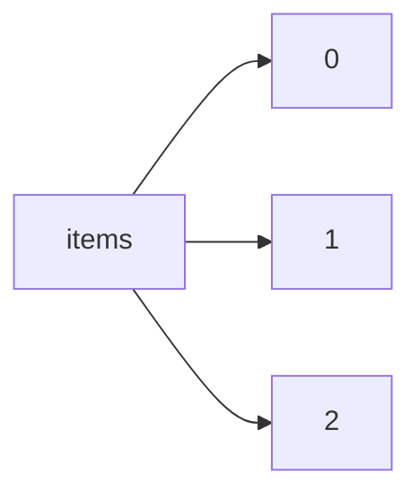

!!! warning "This document is not official Crossref documentation"
# Elements
PATH = items/array(1)  
Occurs 143 500 239 times  
{ .annotate }

1. A route to an element, for example:  
   The route "items/array" corresponds to navigating through the JSON indices as  
   ["items"][0]  

## Description
Elements of items array.
The notation "Occurs 143 500 239 times" indicates the total count of distinct elements within the dataset.

## DOI
See more information: [items/array/DOI](DOI/index.md)  
Occurs 143 500 239 timess  
Unique values: > 999  

!!! note "Due to current limitations, only the first 1,000 unique values are counted."

| **Row** | **Value** `String`                        | **Count** `Int64` |
|--------:|---------------------------------------------:|---------------------:|
| **1**   | 10.7748/cnp.1.9.4.s2                         | 1                    |
| **2**   | 10.1016/0022-328x(89)85025-9                 | 1                    |
| **3**   | 10.1155/2018/7652359                         | 1                    |
| **4**   | 10.22323/1.007.0075                          | 1                    |
| **5**   | 10.14738/assrj.410.3172                      | 1                    |
| **6**   | 10.1007/978-94-6300-717-7\_12                | 1                    |
| **7**   | 10.4271/2018-01-1017                         | 1                    |
| **8**   | 10.1093/benz/9780199773787.article.b00129133 | 1                    |
| **9**   | 10.1016/j.electacta.2018.03.030              | 1                    |
| **10**  | 10.1016/j.annepidem.2018.03.014              | 1                    |
| ... | ... | ... |

## ISBN
See more information: [items/array/ISBN](ISBN/index.md)  
Occurs 9 977 175 timess  

| **Row** | **Length** `Any` | **Count** `Int64` |
|--------:|--------------------:|---------------------:|
| **1**   | 1                   | 2 980 293            |
| **2**   | 2                   | 6 720 312            |
| **3**   | 3                   | 190 468              |
| **4**   | 4                   | 62 774               |
| **5**   | 5                   | 13 733               |
| **6**   | 6                   | 9 595                |

## ISSN
See more information: [items/array/ISSN](ISSN/index.md)  
Occurs 104 916 826 timess  

| **Row** | **Length** `Any` | **Count** `Int64` |
|--------:|--------------------:|---------------------:|
| **1**   | 1                   | 53 301 322           |
| **2**   | 2                   | 51 536 426           |
| **3**   | 3                   | 78 802               |
| **4**   | 4                   | 276                  |

## URL
See more information: [items/array/URL](URL/index.md)  
Occurs 143 500 239 timess  
Unique values: > 999  

!!! note "Due to current limitations, only the first 1,000 unique values are counted."

| **Row** | **Value** `String`                                    | **Count** `Int64` |
|--------:|---------------------------------------------------------:|---------------------:|
| **1**   | http://dx.doi.org/10.1371/journal.pone.0198930.g012      | 1                    |
| **2**   | http://dx.doi.org/10.1097/01.hj.0000530648.17182.22      | 1                    |
| **3**   | http://dx.doi.org/10.1177/0034637330027001102            | 1                    |
| **4**   | http://dx.doi.org/10.1002/wmh3.131                       | 1                    |
| **5**   | http://dx.doi.org/10.1109/acc.2016.7526768               | 1                    |
| **6**   | http://dx.doi.org/10.1080/00207144.2016.1131589          | 1                    |
| **7**   | http://dx.doi.org/10.1093/jmammal/gyx044                 | 1                    |
| **8**   | http://dx.doi.org/10.1163/2468-1733\_shafr\_sim120040012 | 1                    |
| **9**   | http://dx.doi.org/10.5489/cuaj.4324                      | 1                    |
| **10**  | http://dx.doi.org/10.25291/vr/7-vlr-l-301                | 1                    |
| ... | ... | ... |

## Abstract
See more information: [items/array/abstract](abstract/index.md)  
Occurs 19 351 793 timess  
Unique values: > 999  

!!! note "Due to current limitations, strings longer than 1,000 characters are truncated, which may lead to inaccurate calculations."

!!! note "Due to current limitations, only the first 1,000 unique values are counted."

| **Row** | **Value** `String`                    | **Count** `Int64` |
|--------:|-----------------------------------------:|---------------------:|
| **1**   | <jats:p />                               | 46 499               |
| **2**   | <jats:p>Abstract not Available.</jats:p> | 39 469               |
| **3**   | <jats:p>.</jats:p>                       | 25 405               |
| **4**   | <jats:p>-</jats:p>                       | 17 101               |
| **5**   | <jats:title>Abstract</jats:title>        | 5 579                |
| **6**   | <jats:p> not available </jats:p>         | 4 057                |
| **7**   | <jats:p>No abstract available.</jats:p>  | 3 384                |
| **8**   | <jats:p>N/A</jats:p>                     | 3 275                |
| **9**   | <jats:p>—</jats:p>                       | 3 055                |
| **10**  | <jats:p> &#x0D;\n </jats:p>              | 2 582                |
| ... | ... | ... |

## Accepted
See more information: [items/array/accepted](accepted/index.md)  
Occurs 688 115 timess  

## Alternative-id
See more information: [items/array/alternative-id](alternative-id/index.md)  
Occurs 61 795 505 timess  

| **Row** | **Length** `Any` | **Count** `Int64` |
|--------:|--------------------:|---------------------:|
| **1**   | 1                   | 57 384 395           |
| **2**   | 2                   | 4 173 453            |
| **3**   | 3                   | 235 090              |
| **4**   | 4                   | 2 232                |
| **5**   | 5                   | 12                   |
| **6**   | 6                   | 313                  |
| **7**   | 8                   | 10                   |

## Approved
See more information: [items/array/approved](approved/index.md)  
Occurs 980 886 timess  

## Archive
See more information: [items/array/archive](archive/index.md)  
Occurs 5 134 956 timess  

| **Row** | **Length** `Any` | **Count** `Int64` |
|--------:|--------------------:|---------------------:|
| **1**   | 1                   | 4 885 397            |
| **2**   | 2                   | 199 199              |
| **3**   | 3                   | 41 044               |
| **4**   | 4                   | 22                   |
| **5**   | 6                   | 9 288                |
| **6**   | 8                   | 4                    |
| **7**   | 12                  | 2                    |

## Article-number
See more information: [items/array/article-number](article-number/index.md)  
Occurs 3 693 117 timess  
Unique values: > 999  

!!! note "Due to current limitations, only the first 1,000 unique values are counted."

| **Row** | **Value** `String` | **Count** `Int64` |
|--------:|----------------------:|---------------------:|
| **1**   | 3                     | 12 471               |
| **2**   | 5                     | 12 170               |
| **3**   | 4                     | 11 810               |
| **4**   | 6                     | 11 775               |
| **5**   | 7                     | 10 744               |
| **6**   | 8                     | 10 716               |
| **7**   | 9                     | 10 266               |
| **8**   | 2                     | 9 898                |
| **9**   | 1                     | 9 841                |
| **10**  | 10                    | 9 519                |
| ... | ... | ... |

## Assertion
See more information: [items/array/assertion](assertion/index.md)  
Occurs 15 598 114 timess  

| **Row** | **Length** `Any` | **Count** `Int64` |
|--------:|--------------------:|---------------------:|
| **1**   | 1                   | 2 781 938            |
| **2**   | 2                   | 996 839              |
| **3**   | 3                   | 2 006 168            |
| **4**   | 4                   | 764 842              |
| **5**   | 5                   | 801 446              |
| **6**   | 6                   | 6 379 843            |
| **7**   | 7                   | 1 170 197            |
| **8**   | 8                   | 173 023              |
| **9**   | 9                   | 119 992              |
| **10**  | 10                  | 183 353              |
| ... | ... | ... |

## Author
See more information: [items/array/author](author/index.md)  
Occurs 115 845 460 timess  

!!! note "Due to current limitations, only the first 1,000 unique values are counted."

| **Row** | **Length** `Any` | **Count** `Int64` |
|--------:|--------------------:|---------------------:|
| **1**   | 1                   | 39 025 672           |
| **2**   | 2                   | 22 054 069           |
| **3**   | 3                   | 16 543 220           |
| **4**   | 4                   | 12 052 208           |
| **5**   | 5                   | 8 189 363            |
| **6**   | 6                   | 5 895 552            |
| **7**   | 7                   | 3 664 901            |
| **8**   | 8                   | 2 566 449            |
| **9**   | 9                   | 1 641 778            |
| **10**  | 10                  | 1 248 666            |
| ... | ... | ... |

## Award
See more information: [items/array/award](award/index.md)  
Occurs 76 605 timess  
Unique values: > 999  

!!! note "Due to current limitations, only the first 1,000 unique values are counted."

| **Row** | **Value** `String` | **Count** `Int64` |
|--------:|----------------------:|---------------------:|
| **1**   | JPMJAL1301            | 3                    |
| **2**   | 1880                  | 2                    |
| **3**   | 2562                  | 2                    |
| **4**   | 1429                  | 2                    |
| **5**   | 2127                  | 2                    |
| **6**   | 1540                  | 2                    |
| **7**   | 1882                  | 2                    |
| **8**   | 1997                  | 2                    |
| **9**   | JPMJPR17UM            | 2                    |
| **10**  | 2372                  | 2                    |
| ... | ... | ... |

## Award-start
See more information: [items/array/award-start](award-start/index.md)  
Occurs 46 221 timess  

## Chair
See more information: [items/array/chair](chair/index.md)  
Occurs 17 324 timess  

| **Row** | **Length** `Any` | **Count** `Int64` |
|--------:|--------------------:|---------------------:|
| **1**   | 1                   | 12 478               |
| **2**   | 2                   | 3 494                |
| **3**   | 3                   | 566                  |
| **4**   | 4                   | 319                  |
| **5**   | 5                   | 89                   |
| **6**   | 6                   | 61                   |
| **7**   | 7                   | 12                   |
| **8**   | 8                   | 56                   |
| **9**   | 9                   | 10                   |
| **10**  | 10                  | 4                    |
| ... | ... | ... |

## Clinical-trial-number
See more information: [items/array/clinical-trial-number](clinical-trial-number/index.md)  
Occurs 25 846 timess  

| **Row** | **Length** `Any` | **Count** `Int64` |
|--------:|--------------------:|---------------------:|
| **1**   | 1                   | 20 087               |
| **2**   | 2                   | 3 513                |
| **3**   | 3                   | 953                  |
| **4**   | 4                   | 451                  |
| **5**   | 5                   | 223                  |
| **6**   | 6                   | 152                  |
| **7**   | 7                   | 112                  |
| **8**   | 8                   | 65                   |
| **9**   | 9                   | 55                   |
| **10**  | 10                  | 30                   |
| ... | ... | ... |

## Container-title
See more information: [items/array/container-title](container-title/index.md)  
Occurs 132 590 737 timess  

| **Row** | **Length** `Any` | **Count** `Int64` |
|--------:|--------------------:|---------------------:|
| **1**   | 1                   | 128 106 881          |
| **2**   | 2                   | 4 467 692            |
| **3**   | 3                   | 12 801               |
| **4**   | 4                   | 2 216                |
| **5**   | 5                   | 616                  |
| **6**   | 7                   | 91                   |
| **7**   | 8                   | 440                  |

## Content-created
See more information: [items/array/content-created](content-created/index.md)  
Occurs 821 627 timess  

## Content-domain
See more information: [items/array/content-domain](content-domain/index.md)  
Occurs 143 423 633 timess  

## Content-updated
See more information: [items/array/content-updated](content-updated/index.md)  
Occurs 281 028 timess  

## Created
See more information: [items/array/created](created/index.md)  
Occurs 143 500 239 timess  

## Degree
See more information: [items/array/degree](degree/index.md)  
Occurs 419 028 timess  

| **Row** | **Length** `Any` | **Count** `Int64` |
|--------:|--------------------:|---------------------:|
| **1**   | 1                   | 419 028              |

## Deposited
See more information: [items/array/deposited](deposited/index.md)  
Occurs 143 500 239 timess  

## Description
See more information: [items/array/description](description/index.md)  
Occurs 1 924 823 timess  
Unique values: > 999  

!!! note "Due to current limitations, strings longer than 1,000 characters are truncated, which may lead to inaccurate calculations."

!!! note "Due to current limitations, only the first 1,000 unique values are counted."

| **Row** | **Value** `String`                            | **Count** `Int64` |
|--------:|-------------------------------------------------:|---------------------:|
| **1**   | x-ray diffraction structure                      | 177 078              |
| **2**   | Structure factors: contains datablocks I         | 46 350               |
| **3**   | Supplementary materials                          | 26 686               |
| **4**   | Crystal structure: contains datablocks global, I | 22 494               |
| **5**   | Supplementary material                           | 20 287               |
| **6**   | Crystal structure: contains datablocks I, global | 17 872               |
| **7**   | supplement file to the article                   | 16 350               |
| **8**   | electron microscopy structure                    | 15 402               |
| **9**   | solution nmr structure                           | 11 465               |
| **10**  | Supplementary data                               | 9 943                |
| ... | ... | ... |

## Edition-number
See more information: [items/array/edition-number](edition-number/index.md)  
Occurs 4 212 247 timess  
Unique values: > 999  

!!! note "Due to current limitations, only the first 1,000 unique values are counted."

| **Row** | **Value** `String` | **Count** `Int64` |
|--------:|----------------------:|---------------------:|
| **1**   | 1                     | 2 939 791            |
| **2**   | 0                     | 847 658              |
| **3**   | 2                     | 172 670              |
| **4**   | 3                     | 65 300               |
| **5**   | 4                     | 51 665               |
| **6**   | 5                     | 21 932               |
| **7**   | 6                     | 16 050               |
| **8**   | 1/e                   | 12 704               |
| **9**   | 7                     | 10 285               |
| **10**  | 1st                   | 7 252                |
| ... | ... | ... |

## Editor
See more information: [items/array/editor](editor/index.md)  
Occurs 2 567 228 timess  

| **Row** | **Length** `Any` | **Count** `Int64` |
|--------:|--------------------:|---------------------:|
| **1**   | 1                   | 1 364 593            |
| **2**   | 2                   | 660 819              |
| **3**   | 3                   | 296 855              |
| **4**   | 4                   | 126 833              |
| **5**   | 5                   | 57 280               |
| **6**   | 6                   | 23 500               |
| **7**   | 7                   | 11 592               |
| **8**   | 8                   | 7 001                |
| **9**   | 9                   | 3 986                |
| **10**  | 10                  | 4 068                |
| ... | ... | ... |

## Event
See more information: [items/array/event](event/index.md)  
Occurs 7 709 289 timess  

## Funder
See more information: [items/array/funder](funder/index.md)  
Occurs 8 900 090 timess  

| **Row** | **Length** `Any` | **Count** `Int64` |
|--------:|--------------------:|---------------------:|
| **1**   | 1                   | 4 457 377            |
| **2**   | 2                   | 2 177 216            |
| **3**   | 3                   | 1 135 564            |
| **4**   | 4                   | 559 774              |
| **5**   | 5                   | 268 782              |
| **6**   | 6                   | 133 050              |
| **7**   | 7                   | 66 809               |
| **8**   | 8                   | 36 504               |
| **9**   | 9                   | 20 524               |
| **10**  | 10                  | 12 474               |
| ... | ... | ... |

## Group-title
See more information: [items/array/group-title](group-title/index.md)  
Occurs 966 237 timess  
Unique values: > 999  

!!! note "Due to current limitations, only the first 1,000 unique values are counted."

| **Row** | **Value** `String`  | **Count** `Int64` |
|--------:|-----------------------:|---------------------:|
| **1**   | In Review              | 252 780              |
| **2**   | Open Science Framework | 67 639               |
| **3**   | Neuroscience           | 33 549               |
| **4**   | display                | 29 559               |
| **5**   | Preprints              | 28 720               |
| **6**   | PsyArXiv               | 28 644               |
| **7**   | Chemistry              | 24 327               |
| **8**   | oral                   | 21 845               |
| **9**   | Microbiology           | 17 925               |
| **10**  | INA-Rxiv               | 17 209               |
| ... | ... | ... |

## Indexed
See more information: [items/array/indexed](indexed/index.md)  
Occurs 143 500 239 timess  

## Institution
See more information: [items/array/institution](institution/index.md)  
Occurs 3 848 827 timess  

| **Row** | **Length** `Any` | **Count** `Int64` |
|--------:|--------------------:|---------------------:|
| **1**   | 1                   | 3 420 790            |
| **2**   | 2                   | 284 865              |
| **3**   | 3                   | 131 470              |
| **4**   | 4                   | 9 335                |
| **5**   | 5                   | 2 366                |
| **6**   | 6                   | 1                    |

## Is-referenced-by-count
See more information: [items/array/is-referenced-by-count](is-referenced-by-count/index.md)  
Occurs 143 423 633 timess  
Unique values: > 999  

!!! note "Due to current limitations, only the first 1,000 unique values are counted."

| **Row** | **Value** `Int64` | **Count** `Int64` |
|--------:|---------------------:|---------------------:|
| **1**   | 0                    | 79 217 334           |
| **2**   | 1                    | 11 986 424           |
| **3**   | 2                    | 6 363 843            |
| **4**   | 3                    | 4 464 552            |
| **5**   | 4                    | 3 469 590            |
| **6**   | 5                    | 2 842 210            |
| **7**   | 6                    | 2 413 004            |
| **8**   | 7                    | 2 092 007            |
| **9**   | 8                    | 1 847 915            |
| **10**  | 9                    | 1 643 852            |
| ... | ... | ... |

## Isbn-type
See more information: [items/array/isbn-type](isbn-type/index.md)  
Occurs 9 977 175 timess  

| **Row** | **Length** `Any` | **Count** `Int64` |
|--------:|--------------------:|---------------------:|
| **1**   | 1                   | 2 980 293            |
| **2**   | 2                   | 6 720 312            |
| **3**   | 3                   | 190 468              |
| **4**   | 4                   | 62 774               |
| **5**   | 5                   | 13 733               |
| **6**   | 6                   | 9 595                |

## Issn-type
See more information: [items/array/issn-type](issn-type/index.md)  
Occurs 104 916 826 timess  

| **Row** | **Length** `Any` | **Count** `Int64` |
|--------:|--------------------:|---------------------:|
| **1**   | 1                   | 53 301 322           |
| **2**   | 2                   | 51 536 426           |
| **3**   | 3                   | 78 802               |
| **4**   | 4                   | 276                  |

## Issue
See more information: [items/array/issue](issue/index.md)  
Occurs 88 364 048 timess  
Unique values: > 999  

!!! note "Due to current limitations, only the first 1,000 unique values are counted."

| **Row** | **Value** `String` | **Count** `Int64` |
|--------:|----------------------:|---------------------:|
| **1**   | 1                     | 16 038 887           |
| **2**   | 2                     | 12 413 839           |
| **3**   | 3                     | 10 279 904           |
| **4**   | 4                     | 8 944 139            |
| **5**   | 5                     | 4 972 999            |
| **6**   | 6                     | 4 704 960            |
| **7**   | 7                     | 2 263 818            |
| **8**   | 8                     | 2 191 073            |
| **9**   | 10                    | 2 082 139            |
| **10**  | 9                     | 2 054 599            |
| ... | ... | ... |

## Issued
See more information: [items/array/issued](issued/index.md)  
Occurs 143 500 239 timess  

## Journal-issue
See more information: [items/array/journal-issue](journal-issue/index.md)  
Occurs 88 365 903 timess  

## Language
See more information: [items/array/language](language/index.md)  
Occurs 79 579 221 timess  
Unique values: 74  

| **Row** | **Value** `String` | **Count** `Int64` |
|--------:|----------------------:|---------------------:|
| **1**   | en                    | 74 655 291           |
| **2**   | de                    | 2 302 938            |
| **3**   | fr                    | 1 196 268            |
| **4**   | ja                    | 262 990              |
| **5**   | es                    | 255 269              |
| **6**   | ru                    | 235 876              |
| **7**   | ar                    | 154 706              |
| **8**   | nl                    | 99 237               |
| **9**   | ko                    | 68 658               |
| **10**  | no                    | 57 101               |
| ... | ... | ... |

## License
See more information: [items/array/license](license/index.md)  
Occurs 60 943 576 timess  

| **Row** | **Length** `Any` | **Count** `Int64` |
|--------:|--------------------:|---------------------:|
| **1**   | 1                   | 45 693 962           |
| **2**   | 2                   | 12 655 606           |
| **3**   | 3                   | 1 342 677            |
| **4**   | 4                   | 320 704              |
| **5**   | 5                   | 841                  |
| **6**   | 6                   | 844 618              |
| **7**   | 7                   | 85 128               |
| **8**   | 8                   | 5                    |
| **9**   | 9                   | 30                   |
| **10**  | 11                  | 3                    |
| ... | ... | ... |

## Link
See more information: [items/array/link](link/index.md)  
Occurs 103 386 770 timess  

| **Row** | **Length** `Any` | **Count** `Int64` |
|--------:|--------------------:|---------------------:|
| **1**   | 1                   | 47 077 332           |
| **2**   | 2                   | 39 709 061           |
| **3**   | 3                   | 14 192 675           |
| **4**   | 4                   | 1 866 078            |
| **5**   | 5                   | 231 214              |
| **6**   | 6                   | 54 523               |
| **7**   | 7                   | 3 157                |
| **8**   | 8                   | 227 351              |
| **9**   | 9                   | 11 984               |
| **10**  | 10                  | 489                  |
| ... | ... | ... |

## Member
See more information: [items/array/member](member/index.md)  
Occurs 143 470 478 timess  
Unique values: > 999  

!!! note "Due to current limitations, only the first 1,000 unique values are counted."

| **Row** | **Value** `String` | **Count** `Int64` |
|--------:|----------------------:|---------------------:|
| **1**   | 78                    | 20 652 236           |
| **2**   | 297                   | 16 110 650           |
| **3**   | 311                   | 10 141 063           |
| **4**   | 301                   | 7 101 093            |
| **5**   | 263                   | 5 445 475            |
| **6**   | 286                   | 4 603 105            |
| **7**   | 340                   | 3 835 966            |
| **8**   | 179                   | 2 979 712            |
| **9**   | 374                   | 2 933 076            |
| **10**  | 1121                  | 2 734 862            |
| ... | ... | ... |

## Original-title
See more information: [items/array/original-title](original-title/index.md)  
Occurs 4 169 153 timess  

| **Row** | **Length** `Any` | **Count** `Int64` |
|--------:|--------------------:|---------------------:|
| **1**   | 1                   | 4 169 153            |

## Page
See more information: [items/array/page](page/index.md)  
Occurs 108 663 923 timess  
Unique values: > 999  

!!! note "Due to current limitations, only the first 1,000 unique values are counted."

| **Row** | **Value** `String` | **Count** `Int64` |
|--------:|----------------------:|---------------------:|
| **1**   | no-no                 | 438 183              |
| **2**   | 1                     | 262 910              |
| **3**   | 1-1                   | 178 295              |
| **4**   | 1-2                   | 152 701              |
| **5**   | 1-8                   | 143 587              |
| **6**   | 1-4                   | 136 674              |
| **7**   | 1-6                   | 136 257              |
| **8**   | 1-10                  | 125 958              |
| **9**   | 1-7                   | 118 914              |
| **10**  | 1-9                   | 113 994              |
| ... | ... | ... |

## Part-number
See more information: [items/array/part-number](part-number/index.md)  
Occurs 1 068 timess  
Unique values: 190  

| **Row** | **Value** `String` | **Count** `Int64` |
|--------:|----------------------:|---------------------:|
| **1**   | 2                     | 256                  |
| **2**   | 1                     | 206                  |
| **3**   | 15                    | 41                   |
| **4**   | 4                     | 34                   |
| **5**   | 3                     | 33                   |
| **6**   | 5                     | 27                   |
| **7**   | 6                     | 20                   |
| **8**   | 11                    | 12                   |
| **9**   | 14                    | 11                   |
| **10**  | 13                    | 11                   |
| ... | ... | ... |

## Posted
See more information: [items/array/posted](posted/index.md)  
Occurs 1 185 986 timess  

## Prefix
See more information: [items/array/prefix](prefix/index.md)  
Occurs 143 500 239 timess  
Unique values: > 999  

!!! note "Due to current limitations, only the first 1,000 unique values are counted."

| **Row** | **Value** `String` | **Count** `Int64` |
|--------:|----------------------:|---------------------:|
| **1**   | 10.1016               | 19 551 327           |
| **2**   | 10.1007               | 13 404 011           |
| **3**   | 10.1002               | 6 310 155            |
| **4**   | 10.1109               | 5 335 044            |
| **5**   | 10.1093               | 4 603 074            |
| **6**   | 10.1080               | 4 539 001            |
| **7**   | 10.1371               | 3 835 966            |
| **8**   | 10.1111               | 3 586 328            |
| **9**   | 10.2307               | 2 734 836            |
| **10**  | 10.1177               | 2 699 333            |
| ... | ... | ... |

## Project
See more information: [items/array/project](project/index.md)  
Occurs 76 606 timess  

| **Row** | **Length** `Any` | **Count** `Int64` |
|--------:|--------------------:|---------------------:|
| **1**   | 1                   | 76 601               |
| **2**   | 2                   | 2                    |
| **3**   | 3                   | 1                    |
| **4**   | 4                   | 1                    |
| **5**   | 5                   | 1                    |

## Published
See more information: [items/array/published](published/index.md)  
Occurs 133 294 109 timess  

## Published-online
See more information: [items/array/published-online](published-online/index.md)  
Occurs 52 982 120 timess  

## Published-other
See more information: [items/array/published-other](published-other/index.md)  
Occurs 1 880 483 timess  

## Published-print
See more information: [items/array/published-print](published-print/index.md)  
Occurs 113 476 634 timess  

## Publisher
See more information: [items/array/publisher](publisher/index.md)  
Occurs 143 470 525 timess  
Unique values: > 999  

!!! note "Due to current limitations, only the first 1,000 unique values are counted."

| **Row** | **Value** `String`                     | **Count** `Int64` |
|--------:|------------------------------------------:|---------------------:|
| **1**   | Elsevier BV                               | 19 265 587           |
| **2**   | Wiley                                     | 9 481 372            |
| **3**   | Springer Science and Business Media LLC   | 9 324 957            |
| **4**   | Informa UK Limited                        | 4 756 531            |
| **5**   | IEEE                                      | 3 881 692            |
| **6**   | Public Library of Science (PLoS)          | 3 835 966            |
| **7**   | Oxford University Press (OUP)             | 3 339 732            |
| **8**   | SAGE Publications                         | 2 713 654            |
| **9**   | Ovid Technologies (Wolters Kluwer Health) | 2 560 188            |
| **10**  | American Chemical Society (ACS)           | 2 348 506            |
| ... | ... | ... |

## Publisher-location
See more information: [items/array/publisher-location](publisher-location/index.md)  
Occurs 12 068 302 timess  
Unique values: > 999  

!!! note "Due to current limitations, only the first 1,000 unique values are counted."

| **Row** | **Value** `String` | **Count** `Int64` |
|--------:|----------------------:|---------------------:|
| **1**   | Berlin, Heidelberg    | 1 915 152            |
| **2**   | Cham                  | 1 296 660            |
| **3**   | London                | 772 943              |
| **4**   | Wiesbaden             | 640 178              |
| **5**   | Dordrecht             | 536 923              |
| **6**   | Boston, MA            | 411 140              |
| **7**   | New York, NY, USA     | 385 994              |
| **8**   | New York, NY          | 358 099              |
| **9**   | Singapore             | 327 381              |
| **10**  | Hoboken, NJ, USA      | 300 156              |
| ... | ... | ... |

## Reference
See more information: [items/array/reference](reference/index.md)  
Occurs 63 912 190 timess  

!!! note "Due to current limitations, only the first 1,000 unique values are counted."

| **Row** | **Length** `Any` | **Count** `Int64` |
|--------:|--------------------:|---------------------:|
| **1**   | 1                   | 3 319 811            |
| **2**   | 2                   | 1 071 606            |
| **3**   | 3                   | 1 163 861            |
| **4**   | 4                   | 1 271 730            |
| **5**   | 5                   | 1 503 969            |
| **6**   | 6                   | 1 418 206            |
| **7**   | 7                   | 1 412 702            |
| **8**   | 8                   | 1 454 521            |
| **9**   | 9                   | 1 438 982            |
| **10**  | 10                  | 1 641 627            |
| ... | ... | ... |

## Reference-count
See more information: [items/array/reference-count](reference-count/index.md)  
Occurs 143 423 633 timess  
Unique values: > 999  

!!! note "Due to current limitations, only the first 1,000 unique values are counted."

| **Row** | **Value** `Int64` | **Count** `Int64` |
|--------:|---------------------:|---------------------:|
| **1**   | 0                    | 79 511 443           |
| **2**   | 1                    | 3 319 811            |
| **3**   | 10                   | 1 641 627            |
| **4**   | 5                    | 1 503 969            |
| **5**   | 8                    | 1 454 521            |
| **6**   | 9                    | 1 438 982            |
| **7**   | 12                   | 1 424 704            |
| **8**   | 6                    | 1 418 206            |
| **9**   | 11                   | 1 417 810            |
| **10**  | 7                    | 1 412 702            |
| ... | ... | ... |

## References-count
See more information: [items/array/references-count](references-count/index.md)  
Occurs 143 423 633 timess  
Unique values: > 999  

!!! note "Due to current limitations, only the first 1,000 unique values are counted."

| **Row** | **Value** `Int64` | **Count** `Int64` |
|--------:|---------------------:|---------------------:|
| **1**   | 0                    | 79 511 443           |
| **2**   | 1                    | 3 319 811            |
| **3**   | 10                   | 1 641 627            |
| **4**   | 5                    | 1 503 969            |
| **5**   | 8                    | 1 454 521            |
| **6**   | 9                    | 1 438 982            |
| **7**   | 12                   | 1 424 704            |
| **8**   | 6                    | 1 418 206            |
| **9**   | 11                   | 1 417 810            |
| **10**  | 7                    | 1 412 702            |
| ... | ... | ... |

## Relation
See more information: [items/array/relation](relation/index.md)  
Occurs 1 835 967 timess  

## Resource
See more information: [items/array/resource](resource/index.md)  
Occurs 143 499 704 timess  

## Review
See more information: [items/array/review](review/index.md)  
Occurs 340 964 timess  

## Score
See more information: [items/array/score](score/index.md)  
Occurs 143 500 239 timess  
Unique values: 1  

| **Row** | **Value** `Int64` | **Count** `Int64` |
|--------:|---------------------:|---------------------:|
| **1**   | 0                    | 143 500 239          |

## Short-container-title
See more information: [items/array/short-container-title](short-container-title/index.md)  
Occurs 90 054 566 timess  

| **Row** | **Length** `Any` | **Count** `Int64` |
|--------:|--------------------:|---------------------:|
| **1**   | 1                   | 88 872 310           |
| **2**   | 2                   | 701 079              |
| **3**   | 3                   | 146 169              |
| **4**   | 4                   | 90 954               |
| **5**   | 5                   | 48 687               |
| **6**   | 6                   | 89 131               |
| **7**   | 7                   | 13 326               |
| **8**   | 8                   | 34 699               |
| **9**   | 9                   | 41 769               |
| **10**  | 10                  | 16 442               |

## Short-title
See more information: [items/array/short-title](short-title/index.md)  
Occurs 45 007 timess  

| **Row** | **Length** `Any` | **Count** `Int64` |
|--------:|--------------------:|---------------------:|
| **1**   | 1                   | 44 957               |
| **2**   | 2                   | 23                   |
| **3**   | 3                   | 4                    |
| **4**   | 4                   | 5                    |
| **5**   | 5                   | 1                    |
| **6**   | 6                   | 8                    |
| **7**   | 7                   | 2                    |
| **8**   | 10                  | 7                    |

## Source
See more information: [items/array/source](source/index.md)  
Occurs 143 500 239 timess  
Unique values: 1  

| **Row** | **Value** `String` | **Count** `Int64` |
|--------:|----------------------:|---------------------:|
| **1**   | Crossref              | 143 500 239          |

## Standards-body
See more information: [items/array/standards-body](standards-body/index.md)  
Occurs 365 607 timess  

## Subject
See more information: [items/array/subject](subject/index.md)  
Occurs 86 312 099 timess  

| **Row** | **Length** `Any` | **Count** `Int64` |
|--------:|--------------------:|---------------------:|
| **1**   | 1                   | 32 848 304           |
| **2**   | 2                   | 24 205 963           |
| **3**   | 3                   | 14 495 616           |
| **4**   | 4                   | 8 712 515            |
| **5**   | 5                   | 3 529 323            |
| **6**   | 6                   | 1 486 365            |
| **7**   | 7                   | 713 445              |
| **8**   | 8                   | 161 090              |
| **9**   | 9                   | 13 348               |
| **10**  | 10                  | 18 205               |
| ... | ... | ... |

## Subtitle
See more information: [items/array/subtitle](subtitle/index.md)  
Occurs 7 702 483 timess  

| **Row** | **Length** `Any` | **Count** `Int64` |
|--------:|--------------------:|---------------------:|
| **1**   | 1                   | 7 702 254            |
| **2**   | 2                   | 222                  |
| **3**   | 3                   | 7                    |

## Subtype
See more information: [items/array/subtype](subtype/index.md)  
Occurs 1 185 986 timess  
Unique values: 5  

| **Row** | **Value** `String` | **Count** `Int64` |
|--------:|----------------------:|---------------------:|
| **1**   | preprint              | 876 278              |
| **2**   | other                 | 296 846              |
| **3**   | dissertation          | 12 671               |
| **4**   | letter                | 152                  |
| **5**   | working\_paper        | 39                   |

## Title
See more information: [items/array/title](title/index.md)  
Occurs 138 059 552 timess  

| **Row** | **Length** `Any` | **Count** `Int64` |
|--------:|--------------------:|---------------------:|
| **1**   | 1                   | 138 055 732          |
| **2**   | 2                   | 3 564                |
| **3**   | 3                   | 233                  |
| **4**   | 4                   | 20                   |
| **5**   | 5                   | 3                    |

## Translator
See more information: [items/array/translator](translator/index.md)  
Occurs 24 879 timess  

| **Row** | **Length** `Any` | **Count** `Int64` |
|--------:|--------------------:|---------------------:|
| **1**   | 1                   | 20 995               |
| **2**   | 2                   | 3 348                |
| **3**   | 3                   | 330                  |
| **4**   | 4                   | 130                  |
| **5**   | 5                   | 29                   |
| **6**   | 6                   | 22                   |
| **7**   | 7                   | 11                   |
| **8**   | 8                   | 2                    |
| **9**   | 9                   | 4                    |
| **10**  | 10                  | 2                    |
| ... | ... | ... |

## Type
See more information: [items/array/type](type/index.md)  
Occurs 143 467 119 timess  
Unique values: 30  

| **Row** | **Value** `String` | **Count** `Int64` |
|--------:|----------------------:|---------------------:|
| **1**   | journal-article       | 99 408 771           |
| **2**   | book-chapter          | 19 488 325           |
| **3**   | proceedings-article   | 7 647 156            |
| **4**   | component             | 6 104 394            |
| **5**   | dataset               | 2 624 489            |
| **6**   | posted-content        | 1 185 986            |
| **7**   | reference-entry       | 1 079 536            |
| **8**   | journal-issue         | 1 020 694            |
| **9**   | book                  | 996 671              |
| **10**  | other                 | 774 818              |
| ... | ... | ... |

## Update-policy
See more information: [items/array/update-policy](update-policy/index.md)  
Occurs 21 253 527 timess  
Unique values: > 999  

!!! note "Due to current limitations, only the first 1,000 unique values are counted."

| **Row** | **Value** `String`                                 | **Count** `Int64` |
|--------:|------------------------------------------------------:|---------------------:|
| **1**   | http://dx.doi.org/10.1016/elsevier\_cm\_policy        | 6 002 854            |
| **2**   | http://dx.doi.org/10.1007/springer\_crossmark\_policy | 5 583 176            |
| **3**   | http://dx.doi.org/10.1080/tandf\_crossmark\_01        | 1 388 539            |
| **4**   | http://dx.doi.org/10.1177/sage-journals-update-policy | 924 065              |
| **5**   | http://dx.doi.org/10.1002/crossmark\_policy           | 881 165              |
| **6**   | http://dx.doi.org/10.1088/crossmark-policy            | 605 323              |
| **7**   | http://dx.doi.org/10.1145/crossmark-policy            | 492 658              |
| **8**   | http://dx.doi.org/10.3389/crossmark-policy            | 392 573              |
| **9**   | http://dx.doi.org/10.1039/rsc\_crossmark\_policy      | 341 840              |
| **10**  | http://dx.doi.org/10.1136/crossmarkpolicy             | 324 175              |
| ... | ... | ... |

## Update-to
See more information: [items/array/update-to](update-to/index.md)  
Occurs 260 035 timess  

| **Row** | **Length** `Any` | **Count** `Int64` |
|--------:|--------------------:|---------------------:|
| **1**   | 1                   | 254 626              |
| **2**   | 2                   | 3 494                |
| **3**   | 3                   | 465                  |
| **4**   | 4                   | 247                  |
| **5**   | 5                   | 131                  |
| **6**   | 6                   | 114                  |
| **7**   | 7                   | 96                   |
| **8**   | 8                   | 88                   |
| **9**   | 9                   | 65                   |
| **10**  | 10                  | 58                   |
| ... | ... | ... |

## Volume
See more information: [items/array/volume](volume/index.md)  
Occurs 95 566 113 timess  
Unique values: > 999  

!!! note "Due to current limitations, only the first 1,000 unique values are counted."

| **Row** | **Value** `String` | **Count** `Int64` |
|--------:|----------------------:|---------------------:|
| **1**   | 2                     | 1 810 902            |
| **2**   | 10                    | 1 797 143            |
| **3**   | 9                     | 1 788 005            |
| **4**   | 8                     | 1 768 367            |
| **5**   | 1                     | 1 765 322            |
| **6**   | 7                     | 1 740 896            |
| **7**   | 11                    | 1 731 640            |
| **8**   | 6                     | 1 716 131            |
| **9**   | 12                    | 1 684 981            |
| **10**  | 5                     | 1 680 501            |
| ... | ... | ... |

