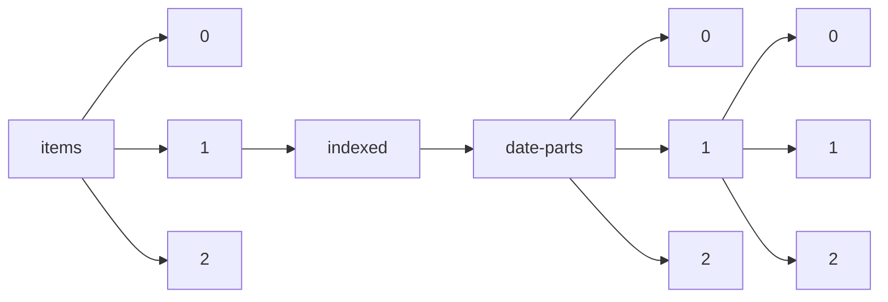

!!! warning "This document is not official Crossref documentation"
# Elements
PATH = items/array/indexed/date-parts/array/array(1)  
Occurs 430 500 717 times  
Unique values: 34  
{ .annotate }

1. A route to an element, for example:  
   The route "items/array/indexed/date-parts/array/array" corresponds to navigating through the JSON indices as  
   ["items"][0]["indexed"]["date-parts"][0][0]  

| **Row** | **Value** `Int64` | **Count** `Int64` |
|--------:|---------------------:|---------------------:|
| **1**   | 2 022                | 107 797 336          |
| **2**   | 3                    | 66 234 844           |
| **3**   | 4                    | 63 391 448           |
| **4**   | 2 023                | 35 702 559           |
| **5**   | 2                    | 22 245 754           |
| **6**   | 1                    | 20 467 162           |
| **7**   | 31                   | 14 359 795           |
| **8**   | 30                   | 14 087 058           |
| **9**   | 29                   | 12 278 493           |
| **10**  | 5                    | 8 502 308            |
| **11**  | 12                   | 5 770 547            |
| **12**  | 7                    | 4 733 569            |
| **13**  | 11                   | 4 729 929            |
| **14**  | 10                   | 4 562 905            |
| **15**  | 6                    | 4 562 664            |
| **16**  | 8                    | 4 321 259            |
| **17**  | 9                    | 4 086 507            |
| **18**  | 28                   | 3 027 295            |
| **19**  | 21                   | 2 480 481            |
| **20**  | 23                   | 2 442 320            |
| **21**  | 22                   | 2 301 752            |
| **22**  | 15                   | 2 160 177            |
| **23**  | 24                   | 2 152 870            |
| **24**  | 27                   | 2 078 891            |
| **25**  | 25                   | 2 046 969            |
| **26**  | 16                   | 1 956 474            |
| **27**  | 14                   | 1 882 631            |
| **28**  | 20                   | 1 842 383            |
| **29**  | 17                   | 1 813 617            |
| **30**  | 13                   | 1 782 332            |
| **31**  | 26                   | 1 647 769            |
| **32**  | 19                   | 1 538 421            |
| **33**  | 18                   | 1 511 854            |
| **34**  | 2 021                | 344                  |

