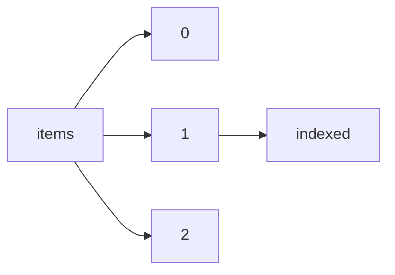

!!! warning "This document is not official Crossref documentation"
# Indexed
PATH = items/array/indexed(1)  
Occurs 143 500 239 times  
{ .annotate }

1. A route to an element, for example:  
   The route "items/array/indexed" corresponds to navigating through the JSON indices as  
   ["items"][0]["indexed"]  

## Date-parts
See more information: [items/array/indexed/date-parts](date-parts/index.md)  
Occurs 143 500 239 timess  

| **Row** | **Length** `Any` | **Count** `Int64` |
|--------:|--------------------:|---------------------:|
| **1**   | 1                   | 143 500 239          |

## Date-time
See more information: [items/array/indexed/date-time](date-time/index.md)  
Occurs 143 500 239 timess  
Unique values: > 999  

!!! note "Due to current limitations, only the first 1,000 unique values are counted."

| **Row** | **Value** `String` | **Count** `Int64` |
|--------:|----------------------:|---------------------:|
| **1**   | 2023-01-13T06:10:52Z  | 202                  |
| **2**   | 2022-09-23T05:06:15Z  | 189                  |
| **3**   | 2022-12-14T06:02:22Z  | 189                  |
| **4**   | 2023-01-13T06:11:48Z  | 189                  |
| **5**   | 2022-12-14T06:02:17Z  | 185                  |
| **6**   | 2022-10-02T04:51:29Z  | 184                  |
| **7**   | 2022-11-25T06:06:37Z  | 181                  |
| **8**   | 2022-12-14T06:02:05Z  | 178                  |
| **9**   | 2022-11-25T06:06:00Z  | 177                  |
| **10**  | 2022-12-14T06:02:21Z  | 172                  |
| ... | ... | ... |

## Timestamp
See more information: [items/array/indexed/timestamp](timestamp/index.md)  
Occurs 143 500 239 timess  
Unique values: > 999  

!!! note "Due to current limitations, only the first 1,000 unique values are counted."

| **Row** | **Value** `Int64` | **Count** `Int64` |
|--------:|---------------------:|---------------------:|
| **1**   | 1 668 492 746 388    | 4                    |
| **2**   | 1 677 129 822 234    | 4                    |
| **3**   | 1 651 086 710 557    | 4                    |
| **4**   | 1 671 775 651 998    | 4                    |
| **5**   | 1 650 058 890 203    | 4                    |
| **6**   | 1 679 372 889 489    | 4                    |
| **7**   | 1 673 157 447 809    | 4                    |
| **8**   | 1 668 837 575 702    | 4                    |
| **9**   | 1 667 971 488 012    | 4                    |
| **10**  | 1 673 155 601 901    | 4                    |
| ... | ... | ... |

