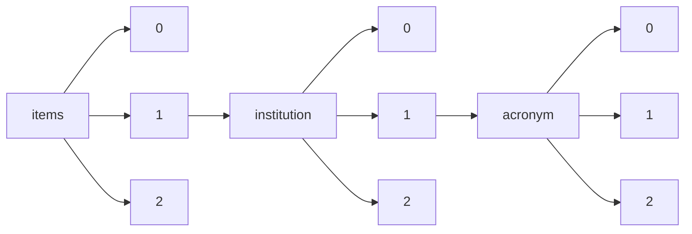

!!! warning "This document is not official Crossref documentation"
# Elements
PATH = items/array/institution/array/acronym/array(1)  
Occurs 2 360 716 times  
Unique values: > 999  
{ .annotate }

1. A route to an element, for example:  
   The route "items/array/institution/array/acronym/array" corresponds to navigating through the JSON indices as  
   ["items"][0]["institution"][0]["acronym"][0]  

!!! note "Due to current limitations, only the first 1,000 unique values are counted."

| **Row** | **Value** `String`         | **Count** `Int64` |
|--------:|------------------------------:|---------------------:|
| **1**   | BRILL                         | 788 879              |
| **2**   | APA                           | 421 071              |
| **3**   | IUCN                          | 201 830              |
| **4**   | N4L                           | 95 718               |
| **5**   | UNICAMP                       | 56 739               |
| **6**   | NBER                          | 31 529               |
| **7**   | ESA                           | 28 430               |
| **8**   | HKU                           | 27 725               |
| **9**   | ISU                           | 23 706               |
| **10**  | ORNL                          | 21 844               |
| **11**  | PUC-RIO                       | 21 202               |
| **12**  | HEDB                          | 20 308               |
| **13**  | NETL                          | 19 839               |
| **14**  | ONR                           | 19 529               |
| **15**  | AEARCT                        | 18 294               |
| **16**  | ICPSR                         | 17 900               |
| **17**  | LANL                          | 17 660               |
| **18**  | CHO                           | 16 925               |
| **19**  | SNL                           | 16 831               |
| **20**  | LLNL                          | 16 457               |
| **21**  | PNNL                          | 14 907               |
| **22**  | USAMRMC                       | 13 809               |
| **23**  | SJSU                          | 13 689               |
| **24**  | ESSOAr                        | 13 113               |
| **25**  | TIC                           | 12 434               |
| **26**  | NBS                           | 12 204               |
| **27**  | HKUST                         | 11 518               |
| **28**  | ANL                           | 11 453               |
| **29**  | DTIE                          | 11 276               |
| **30**  | HNF                           | 10 251               |
| **31**  | MHE                           | 9 505                |
| **32**  | SRS                           | 8 854                |
| **33**  | NREL                          | 8 650                |
| **34**  | BNL                           | 8 140                |
| **35**  | wvul                          | 8 114                |
| **36**  | UnB                           | 7 988                |
| **37**  | LBNL                          | 7 956                |
| **38**  | NIST                          | 7 460                |
| **39**  | FNAL                          | 6 439                |
| **40**  | OUP                           | 5 865                |
| **41**  | OSTI                          | 5 647                |
| **42**  | SLAC                          | 5 589                |
| **43**  | UPV                           | 4 868                |
| **44**  | UVA                           | 4 580                |
| **45**  | USAWC                         | 4 573                |
| **46**  | INL                           | 4 334                |
| **47**  | WRI                           | 4 255                |
| **48**  | FIU                           | 4 077                |
| **49**  | URI                           | 3 578                |
| **50**  | IDB                           | 3 452                |
| **51**  | GFO                           | 3 429                |
| **52**  | OAK                           | 3 295                |
| **53**  | AARP                          | 3 181                |
| **54**  | PPPL                          | 3 179                |
| **55**  | FHSU                          | 3 143                |
| **56**  | ORO                           | 2 905                |
| **57**  | INEEL                         | 2 789                |
| **58**  | DUT                           | 2 722                |
| **59**  | NIEHS                         | 2 698                |
| **60**  | MTU                           | 2 669                |
| **61**  | BPA                           | 2 605                |
| **62**  | OSD or Non-Service DoD Agency | 2 419                |
| **63**  | IDO                           | 2 389                |
| **64**  | RLO                           | 2 312                |
| **65**  | EE-LIBRARY                    | 2 274                |
| **66**  | BR                            | 2 231                |
| **67**  | SZTE                          | 2 010                |
| **68**  | UPC                           | 1 846                |
| **69**  | SPP                           | 1 738                |
| **70**  | ADB                           | 1 679                |
| **71**  | HQPR                          | 1 636                |
| **72**  | XD                            | 1 632                |
| **73**  | YMP                           | 1 595                |
| **74**  | ELTE                          | 1 546                |
| **75**  | DOEEEGTP                      | 1 544                |
| **76**  | NPS                           | 1 534                |
| **77**  | UG                            | 1 526                |
| **78**  | LAU                           | 1 436                |
| **79**  | NRL                           | 1 385                |
| **80**  | ASTM                          | 1 364                |
| **81**  | DOEEMSP                       | 1 354                |
| **82**  | AMES                          | 1 353                |
| **83**  | PSG                           | 1 288                |
| **84**  | GCdataPR                      | 1 249                |
| **85**  | ScienceDB                     | 1 219                |
| **86**  | NWC                           | 1 214                |
| **87**  | UFU                           | 1 208                |
| **88**  | ALO                           | 1 193                |
| **89**  | Y-12                          | 1 080                |
| **90**  | JHRP                          | 1 076                |
| **91**  | AFOSR                         | 1 075                |
| **92**  | SGC                           | 1 071                |
| **93**  | USACGSC/SAMS                  | 1 052                |
| **94**  | DARPA                         | 1 038                |
| **95**  | ICIMOD                        | 998                  |
| **96**  | NETL-IR                       | 982                  |
| **97**  | NVO                           | 982                  |
| **98**  | GA                            | 981                  |
| **99**  | DA                            | 980                  |
| **100** | FRBC                          | 968                  |
| **101** | DOD                           | 943                  |
| **102** | ARO                           | 921                  |
| **103** | ORNL DAAC                     | 918                  |
| **104** | SLCS                          | 916                  |
| **105** | UFJF                          | 895                  |
| **106** | AU                            | 875                  |
| **107** | FRBP                          | 843                  |
| **108** | ARI                           | 842                  |
| **109** | UJI                           | 842                  |
| **110** | KAPL                          | 840                  |
| **111** | USAMRDC                       | 839                  |
| **112** | USAF                          | 811                  |
| **113** | UFV                           | 784                  |
| **114** | BSU                           | 770                  |
| **115** | RUG                           | 719                  |
| **116** | BRL                           | 707                  |
| **117** | ACSC                          | 703                  |
| **118** | ACAMH                         | 694                  |
| **119** | AWC                           | 683                  |
| **120** | JTRP                          | 669                  |
| **121** | USDA                          | 666                  |
| **122** | RSC                           | 656                  |
| **123** | NURSA                         | 643                  |
| **124** | NNN                           | 638                  |
| **125** | UTHSC                         | 627                  |
| **126** | NDU/NWC                       | 607                  |
| **127** | COE/DC                        | 569                  |
| **128** | ORGDP                         | 559                  |
| **129** | TJNAF                         | 558                  |
| **130** | ITA                           | 525                  |
| **131** | 3ie                           | 522                  |
| **132** | MRC                           | 519                  |
| **133** | AGROSAVIA                     | 512                  |
| **134** | AWC/SSI                       | 510                  |
| **135** | ORISE                         | 504                  |
| **136** | USACGSC                       | 501                  |
| **137** | Dimar                         | 498                  |
| **138** | USACE                         | 492                  |
| **139** | UNH                           | 487                  |
| **140** | SERDP                         | 477                  |
| **141** | NWC/JMO                       | 465                  |
| **142** | LAPOP                         | 458                  |
| **143** | NDU                           | 445                  |
| **144** | USIL                          | 439                  |
| **145** | DOEARM                        | 432                  |
| **146** | WIPP                          | 426                  |
| **147** | LBNLSCH                       | 420                  |
| **148** | NPTO                          | 406                  |
| **149** | UdL                           | 402                  |
| **150** | SAyDS                         | 397                  |
| **151** | SAREM                         | 397                  |
| **152** | NSTEC                         | 396                  |
| **153** | AEDC                          | 392                  |
| **154** | NAVEXOS                       | 381                  |
| **155** | AFIT                          | 378                  |
| **156** | ORNL CDIAC                    | 377                  |
| **157** | NAVSEA                        | 367                  |
| **158** | PSU                           | 361                  |
| **159** | ESTCP                         | 360                  |
| **160** | CDIAC                         | 357                  |
| **161** | SRO                           | 357                  |
| **162** | DOEEH42                       | 339                  |
| **163** | ARL\*                         | 336                  |
| **164** | BNC                           | 336                  |
| **165** | UAMA                          | 333                  |
| **166** | DOEEM                         | 333                  |
| **167** | ARL                           | 330                  |
| **168** | NSWCCD                        | 329                  |
| **169** | INEL                          | 327                  |
| **170** | KCP                           | 325                  |
| **171** | PHS                           | 319                  |
| **172** | LiU                           | 316                  |
| **173** | ARL/APG                       | 314                  |
| **174** | ABL/MD                        | 303                  |
| **175** | IEA SHC                       | 300                  |
| **176** | NWCJMO                        | 298                  |
| **177** | NAVAIR                        | 292                  |
| **178** | IGRAS                         | 291                  |
| **179** | ARPA                          | 287                  |
| **180** | DOESC                         | 287                  |
| **181** | BAPL                          | 281                  |
| **182** | Motu                          | 279                  |
| **183** | ICTSD                         | 279                  |
| **184** | BUSHIPS                       | 279                  |
| **185** | NAVWEPS                       | 276                  |
| **186** | ICIQ                          | 272                  |
| **187** | IADB                          | 272                  |
| **188** | CDC                           | 271                  |
| **189** | ARDEC                         | 270                  |
| **190** | ORNL-ARM                      | 269                  |
| **191** | AFOSR/VA                      | 268                  |
| **192** | NNSS-MSTS                     | 266                  |
| **193** | OCD                           | 263                  |
| **194** | USMC/CSC                      | 258                  |
| **195** | RFP                           | 253                  |
| **196** | RTI                           | 252                  |
| **197** | QUT                           | 250                  |
| **198** | NCEL                          | 248                  |
| **199** | TARDEC                        | 247                  |
| **200** | SEG                           | 246                  |
| **201** | ESRI                          | 245                  |
| **202** | ASD                           | 241                  |
| **203** | BSG                           | 239                  |
| **204** | OIES                          | 237                  |
| **205** | MOUND                         | 237                  |
| **206** | BUMED                         | 237                  |
| **207** | CEM                           | 236                  |
| **208** | SMUFD                         | 235                  |
| **209** | NMRDC                         | 233                  |
| **210** | USUHS                         | 227                  |
| **211** | MOSDAC                        | 226                  |
| **212** | NPS-GSBPP                     | 224                  |
| **213** | BSC                           | 221                  |
| **214** | NWC/RI                        | 219                  |
| **215** | ARL/ADELPHI                   | 213                  |
| **216** | PUC                           | 212                  |
| **217** | USNA                          | 209                  |
| **218** | NOL                           | 208                  |
| **219** | RTU                           | 198                  |
| **220** | RIDIE, 3ie                    | 192                  |
| **221** | DRINU                         | 189                  |
| **222** | KAPSARC                       | 187                  |
| **223** | S-N                           | 185                  |
| **224** | ESC/MA                        | 185                  |
| **225** | UCL                           | 184                  |
| **226** | SSCPO                         | 184                  |
| **227** | AMC                           | 184                  |
| **228** | PA                            | 183                  |
| **229** | USGCRP                        | 183                  |
| **230** | WCH                           | 180                  |
| **231** | NPRDC                         | 177                  |
| **232** | WES                           | 177                  |
| **233** | IWMI                          | 176                  |
| **234** | NWC/DO                        | 176                  |
| **235** | AFRL                          | 175                  |
| **236** | PICUP                         | 173                  |
| **237** | ESC\*                         | 170                  |
| **238** | NAMRL                         | 169                  |
| **239** | BGSU                          | 169                  |
| **240** | CCL                           | 169                  |
| **241** | GCRO                          | 167                  |
| **242** | KKI                           | 167                  |
| **243** | HCA                           | 166                  |
| **244** | CSET                          | 166                  |
| **245** | AFCRL                         | 166                  |
| **246** | IIHS                          | 165                  |
| **247** | PTX                           | 164                  |
| **248** | NNSASC                        | 164                  |
| **249** | AFSC                          | 163                  |
| **250** | ICRAF                         | 162                  |
| **251** | ITLV                          | 162                  |
| **252** | CIPS                          | 161                  |
| **253** | USAEC                         | 160                  |
| **254** | DLA                           | 160                  |
| **255** | RSU                           | 159                  |
| **256** | RU                            | 159                  |
| **257** | AFML                          | 159                  |
| **258** | SPAWAR                        | 158                  |
| **259** | DNA                           | 158                  |
| **260** | ARL/WM                        | 157                  |
| **261** | USASC                         | 155                  |
| **262** | GE                            | 154                  |
| **263** | BMI                           | 154                  |
| **264** | mathDL                        | 151                  |
| **265** | SAM                           | 149                  |
| **266** | USAFA                         | 149                  |
| **267** | AFCEE                         | 149                  |
| **268** | AOARD                         | 148                  |
| **269** | TU Dresden                    | 148                  |
| **270** | ARL\*\*                       | 145                  |
| **271** | AFTAC                         | 145                  |
| **272** | RADC                          | 143                  |
| **273** | FA                            | 142                  |
| **274** | CNO                           | 140                  |
| **275** | IIRP                          | 140                  |
| **276** | NDU/INSS                      | 140                  |
| **277** | UnB, UAB                      | 139                  |
| **278** | DOELM                         | 138                  |
| **279** | ECBC                          | 137                  |
| **280** | ESD                           | 137                  |
| **281** | Reactome                      | 136                  |
| **282** | FTD                           | 136                  |
| **283** | ECOM                          | 136                  |
| **284** | NOSC                          | 135                  |
| **285** | AFRL-PR-ED                    | 132                  |
| **286** | OCE                           | 131                  |
| **287** | UAutonoma                     | 131                  |
| **288** | IG/DOD                        | 130                  |
| **289** | MICOM                         | 130                  |
| **290** | RFFO                          | 130                  |
| **291** | RRI                           | 130                  |
| **292** | ASM                           | 129                  |
| **293** | DTMB                          | 128                  |
| **294** | ASCIA                         | 127                  |
| **295** | TACOM                         | 127                  |
| **296** | ICT                           | 124                  |
| **297** | ARL/MR                        | 123                  |
| **298** | COE                           | 123                  |
| **299** | UCLouvain                     | 121                  |
| **300** | CRREL                         | 121                  |
| **301** | HDL                           | 120                  |
| **302** | BCE                           | 116                  |
| **303** | ACR                           | 111                  |
| **304** | DOEEE                         | 111                  |
| **305** | ERDC                          | 111                  |
| **306** | PACAF                         | 111                  |
| **307** | SIPRI                         | 111                  |
| **308** | NSWC                          | 109                  |
| **309** | OCRD                          | 109                  |
| **310** | AFOSR/AOARD                   | 109                  |
| **311** | CERL                          | 108                  |
| **312** | NC State University           | 108                  |
| **313** | TILDA                         | 108                  |
| **314** | AFFDL                         | 108                  |
| **315** | SSD                           | 108                  |
| **316** | OCNR                          | 106                  |
| **317** | HEL                           | 106                  |
| **318** | SBIBAE                        | 105                  |
| **319** | NAVARRO                       | 105                  |
| **320** | DOEEI                         | 104                  |
| **321** | GCBH                          | 103                  |
| **322** | WAL                           | 102                  |
| **323** | VT                            | 102                  |
| **324** | NPL                           | 101                  |
| **325** | WADC                          | 100                  |
| **326** | SNL-A                         | 100                  |
| **327** | OSD                           | 100                  |
| **328** | ESC/ENCB                      | 99                   |
| **329** | GJO                           | 99                   |
| **330** | VSU                           | 99                   |
| **331** | NAVELEX                       | 98                   |
| **332** | FFZG                          | 98                   |
| **333** | SIGIR                         | 98                   |
| **334** | NADC                          | 97                   |
| **335** | EA                            | 96                   |
| **336** | MCCDC                         | 96                   |
| **337** | AAPM                          | 95                   |
| **338** | NE75-ORB                      | 95                   |
| **339** | AMRL                          | 93                   |
| **340** | ARL/HRED                      | 93                   |
| **341** | AMDCS                         | 93                   |
| **342** | AWC/CSL                       | 92                   |
| **343** | USACGSCSAMS                   | 92                   |
| **344** | DARCOM                        | 92                   |
| **345** | USASRDL                       | 91                   |
| **346** | NAWCADPAX                     | 91                   |
| **347** | SSC/SD                        | 91                   |
| **348** | NAVSHIPS                      | 91                   |
| **349** | SAF                           | 89                   |
| **350** | NE                            | 87                   |
| **351** | BostonFed                     | 87                   |
| **352** | DOEIG                         | 87                   |
| **353** | RI                            | 87                   |
| **354** | AU/AWC                        | 87                   |
| **355** | LLU                           | 86                   |
| **356** | NWL                           | 86                   |
| **357** | USARIEM                       | 86                   |
| **358** | USAED/TN                      | 86                   |
| **359** | AEWES                         | 86                   |
| **360** | NDU/ICAF                      | 86                   |
| **361** | COE/FWTX                      | 85                   |
| **362** | WL\*                          | 84                   |
| **363** | ECPS                          | 83                   |
| **364** | INLICP                        | 83                   |
| **365** | TECOM                         | 83                   |
| **366** | ITV MI                        | 83                   |
| **367** | COE/MD/BD                     | 83                   |
| **368** | DTRA                          | 82                   |
| **369** | BFL                           | 82                   |
| **370** | NAVAIR/PAX                    | 82                   |
| **371** | DASA                          | 82                   |
| **372** | UPNA                          | 82                   |
| **373** | NAA                           | 81                   |
| **374** | RIA                           | 81                   |
| **375** | OCSAT                         | 79                   |
| **376** | AFFTC                         | 79                   |
| **377** | CU                            | 78                   |
| **378** | Nordregio                     | 78                   |
| **379** | EOARD                         | 78                   |
| **380** | AERDL                         | 76                   |
| **381** | JCS                           | 76                   |
| **382** | AFWL                          | 75                   |
| **383** | ETTP                          | 75                   |
| **384** | Cenicafé                      | 75                   |
| **385** | ICAC                          | 75                   |
| **386** | N-I                           | 75                   |
| **387** | NUSC                          | 74                   |
| **388** | AMSAM                         | 74                   |
| **389** | RL\*                          | 73                   |
| **390** | DSMC                          | 73                   |
| **391** | CPRE                          | 72                   |
| **392** | NUWC-NPT                      | 72                   |
| **393** | DOENE                         | 72                   |
| **394** | AFRL/PRS                      | 72                   |
| **395** | RMA                           | 72                   |
| **396** | NATICK                        | 72                   |
| **397** | CBFO                          | 72                   |
| **398** | UAB                           | 70                   |
| **399** | AFOSRVA                       | 70                   |
| **400** | AWCSSI                        | 70                   |
| **401** | OUSD(A/T)                     | 70                   |
| **402** | VEDAS                         | 70                   |
| **403** | NDU/CTNSP                     | 69                   |
| **404** | TRADOC                        | 69                   |
| **405** | CHEMCOR                       | 68                   |
| **406** | CRDEC                         | 68                   |
| **407** | ARL/SED                       | 68                   |
| **408** | DUC                           | 68                   |
| **409** | mau                           | 68                   |
| **410** | USAMRL                        | 68                   |
| **411** | AFWAL                         | 67                   |
| **412** | NPG                           | 66                   |
| **413** | AU/ACSC                       | 66                   |
| **414** | USAMRIID                      | 65                   |
| **415** | ULIR                          | 65                   |
| **416** | PROFEZA                       | 65                   |
| **417** | NSMRL                         | 65                   |
| **418** | NORDA                         | 65                   |
| **419** | AFHRL                         | 65                   |
| **420** | NE.                           | 65                   |
| **421** | AFMC                          | 64                   |
| **422** | NTS                           | 64                   |
| **423** | ICOG                          | 64                   |
| **424** | NPSGSBPP                      | 64                   |
| **425** | PW                            | 64                   |
| **426** | APG                           | 62                   |
| **427** | AUIS                          | 62                   |
| **428** | DOEER                         | 61                   |
| **429** | UAMI                          | 61                   |
| **430** | APCSS                         | 61                   |
| **431** | OGA                           | 61                   |
| **432** | ONT                           | 60                   |
| **433** | RWTH                          | 60                   |
| **434** | UCH                           | 59                   |
| **435** | DOEEH                         | 59                   |
| **436** | DTNSRDC                       | 59                   |
| **437** | OUSD(AT/L)                    | 59                   |
| **438** | NCCOSC/RDT/E                  | 58                   |
| **439** | SPAWAR/CA                     | 58                   |
| **440** | GAIN                          | 58                   |
| **441** | ITRI                          | 58                   |
| **442** | AFRL-HE-WP                    | 58                   |
| **443** | OSG                           | 58                   |
| **444** | AMSMI                         | 58                   |
| **445** | DSB                           | 57                   |
| **446** | WE                            | 57                   |
| **447** | IG PAS                        | 57                   |
| **448** | OARR                          | 57                   |
| **449** | WVDP                          | 57                   |
| **450** | NAVAIR\*\*\*                  | 57                   |
| **451** | TUD                           | 56                   |
| **452** | METC                          | 56                   |
| **453** | DOEFE                         | 56                   |
| **454** | USNRDL                        | 56                   |
| **455** | İLKE                          | 56                   |
| **456** | UDG                           | 54                   |
| **457** | WRDC                          | 54                   |
| **458** | NFESC                         | 54                   |
| **459** | COEDC                         | 54                   |
| **460** | SSRC                          | 54                   |
| **461** | ARBRL                         | 54                   |
| **462** | OSRD                          | 54                   |
| **463** | NOBS                          | 53                   |
| **464** | BRDEC                         | 53                   |
| **465** | CSI                           | 53                   |
| **466** | BESRL                         | 53                   |
| **467** | USMA                          | 53                   |
| **468** | AFGL                          | 53                   |
| **469** | UiS                           | 53                   |
| **470** | VicHealth                     | 53                   |
| **471** | COE/KS                        | 52                   |
| **472** | URV                           | 52                   |
| **473** | CGU                           | 52                   |
| **474** | smco                          | 51                   |
| **475** | CRDL                          | 51                   |
| **476** | OEF                           | 51                   |
| **477** | UNAC                          | 51                   |
| **478** | DTRA/FB                       | 50                   |
| **479** | Upna                          | 50                   |
| **480** | AMMRC                         | 50                   |
| **481** | CIE                           | 50                   |
| **482** | IDS                           | 50                   |
| **483** | INET                          | 49                   |
| **484** | USGSN                         | 49                   |
| **485** | NAVMED                        | 49                   |
| **486** | CADRE                         | 49                   |
| **487** | ERDC/CHL                      | 48                   |
| **488** | FfAME                         | 48                   |
| **489** | ARL-SE-EM                     | 48                   |
| **490** | AWS                           | 48                   |
| **491** | AFAPL                         | 48                   |
| **492** | ARL/CISD                      | 48                   |
| **493** | DAU/FB                        | 47                   |
| **494** | NTU                           | 47                   |
| **495** | ETEC                          | 47                   |
| **496** | ARL/CIS                       | 47                   |
| **497** | POST                          | 47                   |
| **498** | ODCSPER                       | 47                   |
| **499** | NEDU                          | 47                   |
| **500** | ARLWM                         | 46                   |
| **501** | DODIG                         | 46                   |
| **502** | MAXWELL                       | 46                   |
| **503** | NARADCOM                      | 46                   |
| **504** | ERDC/CERL                     | 45                   |
| **505** | ODDRE                         | 45                   |
| **506** | Mecila                        | 45                   |
| **507** | AGO                           | 45                   |
| **508** | LKI                           | 44                   |
| **509** | IASPM                         | 44                   |
| **510** | GCRAS                         | 44                   |
| **511** | NHRC                          | 43                   |
| **512** | USAED/NE                      | 43                   |
| **513** | ARRADCOM                      | 43                   |
| **514** | USA-NLABS                     | 43                   |
| **515** | LPI                           | 43                   |
| **516** | NCS                           | 42                   |
| **517** | AMSAM-RD                      | 42                   |
| **518** | DLA/FB                        | 42                   |
| **519** | NOO                           | 42                   |
| **520** | CECOM                         | 42                   |
| **521** | STRICOM/FL                    | 41                   |
| **522** | LETC                          | 41                   |
| **523** | UNIA                          | 41                   |
| **524** | NFMC                          | 41                   |
| **525** | AU-SAAS                       | 41                   |
| **526** | USAEL                         | 40                   |
| **527** | NCM                           | 40                   |
| **528** | AFRL/ED                       | 40                   |
| **529** | USAED/NED                     | 40                   |
| **530** | MCU/VA                        | 40                   |
| **531** | SNSF                          | 40                   |
| **532** | AMCOM                         | 40                   |
| **533** | AFLCMC/MA                     | 40                   |
| **534** | USAMERDC                      | 40                   |
| **535** | BMDO                          | 40                   |
| **536** | ARLSED                        | 39                   |
| **537** | USAF-TPS                      | 39                   |
| **538** | BUAER                         | 39                   |
| **539** | ARLCD                         | 38                   |
| **540** | USAISR                        | 38                   |
| **541** | MSU                           | 38                   |
| **542** | MDA                           | 38                   |
| **543** | ARCCB                         | 38                   |
| **544** | DTIC/FB                       | 38                   |
| **545** | ERDEC                         | 38                   |
| **546** | AMC/DC                        | 38                   |
| **547** | ICAF                          | 38                   |
| **548** | ERO                           | 38                   |
| **549** | NAVFAC                        | 37                   |
| **550** | ARL/SEDD                      | 37                   |
| **551** | DTIC                          | 37                   |
| **552** | AFPT\*                        | 37                   |
| **553** | SRELA                         | 37                   |
| **554** | USAED/IL                      | 37                   |
| **555** | DASG                          | 37                   |
| **556** | RSS                           | 37                   |
| **557** | PERS                          | 36                   |
| **558** | ECBC/RTD                      | 36                   |
| **559** | UNIDIR                        | 36                   |
| **560** | IOC                           | 36                   |
| **561** | IPL                           | 36                   |
| **562** | USMC                          | 36                   |
| **563** | NYSO                          | 35                   |
| **564** | ARLHRED                       | 35                   |
| **565** | CAA                           | 35                   |
| **566** | TSNRP                         | 35                   |
| **567** | TRECOM                        | 35                   |
| **568** | BSD                           | 35                   |
| **569** | NJS                           | 35                   |
| **570** | DOEEIA                        | 35                   |
| **571** | NSWC/WOL                      | 34                   |
| **572** | NOO\*                         | 34                   |
| **573** | AFOSR/EOARD                   | 34                   |
| **574** | ARL/WP                        | 34                   |
| **575** | SAMSO                         | 34                   |
| **576** | OMAHA                         | 34                   |
| **577** | ACC Cyfronet AGH              | 34                   |
| **578** | -                             | 33                   |
| **579** | RIC                           | 33                   |
| **580** | NAVORD                        | 33                   |
| **581** | AFRL-HE-BR                    | 33                   |
| **582** | DBB                           | 33                   |
| **583** | AJPO                          | 33                   |
| **584** | LABCOM                        | 33                   |
| **585** | AFRL-RH-WP                    | 33                   |
| **586** | UNU-FLORES                    | 33                   |
| **587** | ITV DS                        | 33                   |
| **588** | USAARL                        | 32                   |
| **589** | NSWCDD                        | 32                   |
| **590** | NETL-EDX                      | 32                   |
| **591** | AFAMRL                        | 32                   |
| **592** | AFAL                          | 32                   |
| **593** | AFRLRXWP                      | 32                   |
| **594** | FSRI                          | 32                   |
| **595** | OSU                           | 32                   |
| **596** | AFRPL                         | 32                   |
| **597** | WA                            | 32                   |
| **598** | NV                            | 32                   |
| **599** | OCO                           | 31                   |
| **600** | ENAEC                         | 31                   |
| **601** | NVL                           | 31                   |
| **602** | OAR                           | 31                   |
| **603** | UERJ                          | 31                   |
| **604** | NAVMAT                        | 31                   |
| **605** | Iriss                         | 31                   |
| **606** | DAU                           | 31                   |
| **607** | SFIM-AEC-PC                   | 31                   |
| **608** | PNLSP                         | 31                   |
| **609** | FSTC                          | 31                   |
| **610** | ICPP                          | 31                   |
| **611** | LMU                           | 30                   |
| **612** | DTRC                          | 30                   |
| **613** | OU                            | 30                   |
| **614** | ARL/WMRD                      | 30                   |
| **615** | ACER                          | 30                   |
| **616** | NSWCDD/VA                     | 30                   |
| **617** | ERDC/EL                       | 29                   |
| **618** | IBSP                          | 29                   |
| **619** | SDIO                          | 29                   |
| **620** | USAARMC                       | 29                   |
| **621** | QREC                          | 29                   |
| **622** | AFRL-SA-WP                    | 29                   |
| **623** | FGCU                          | 29                   |
| **624** | FonCSI                        | 29                   |
| **625** | MCWC                          | 29                   |
| **626** | Mau                           | 29                   |
| **627** | USAFETAC                      | 29                   |
| **628** | AFRRI                         | 28                   |
| **629** | AFRL-VA-WP                    | 28                   |
| **630** | GRA                           | 28                   |
| **631** | iavh                          | 28                   |
| **632** | ANRCP                         | 28                   |
| **633** | SFSO                          | 28                   |
| **634** | WHS/DD                        | 28                   |
| **635** | AMCCOM                        | 28                   |
| **636** | PORTGDP                       | 28                   |
| **637** | ARLCB                         | 28                   |
| **638** | UFCG / CDSA                   | 28                   |
| **639** | JAGS-ADC                      | 27                   |
| **640** | AMERDC                        | 27                   |
| **641** | HFF                           | 27                   |
| **642** | IPE                           | 27                   |
| **643** | MESR                          | 27                   |
| **644** | FASTC                         | 27                   |
| **645** | USAED/LA                      | 27                   |
| **646** | MSC                           | 26                   |
| **647** | PETC                          | 26                   |
| **648** | NMRC/MD                       | 26                   |
| **649** | USAMC                         | 26                   |
| **650** | USN                           | 26                   |
| **651** | AFRL/RI                       | 26                   |
| **652** | AFFP                          | 26                   |
| **653** | WRAIR                         | 25                   |
| **654** | AAU                           | 25                   |
| **655** | mέta                          | 25                   |
| **656** | NSRDC                         | 25                   |
| **657** | USAED/VA                      | 25                   |
| **658** | BOM                           | 25                   |
| **659** | BPO                           | 25                   |
| **660** | AL\*                          | 25                   |
| **661** | SMC                           | 24                   |
| **662** | ABDRC                         | 24                   |
| **663** | SEI                           | 24                   |
| **664** | ONTSI                         | 24                   |
| **665** | NMH                           | 24                   |
| **666** | ESC                           | 24                   |
| **667** | ITV                           | 24                   |
| **668** | AMSAA                         | 24                   |
| **669** | AUP                           | 24                   |
| **670** | CQI                           | 24                   |
| **671** | NAWC-WPNS                     | 24                   |
| **672** | USAAVLABS                     | 24                   |
| **673** | AFATL                         | 24                   |
| **674** | IZA                           | 24                   |
| **675** | RDECOM                        | 24                   |
| **676** | LWL                           | 24                   |
| **677** | SR                            | 23                   |
| **678** | PERS\*\*                      | 23                   |
| **679** | AFOEHL                        | 23                   |
| **680** | ERDC/CRREL                    | 23                   |
| **681** | AMSWE                         | 23                   |
| **682** | USAMRICD                      | 23                   |
| **683** | MCSC                          | 23                   |
| **684** | OUSDATL                       | 23                   |
| **685** | PL\*                          | 23                   |
| **686** | ARCCD                         | 23                   |
| **687** | ONRL                          | 23                   |
| **688** | ARDSG                         | 23                   |
| **689** | DOFL                          | 23                   |
| **690** | AFRL-RI-RS                    | 23                   |
| **691** | ASDC                          | 23                   |
| **692** | ARDEC/ESIC                    | 22                   |
| **693** | TRL                           | 22                   |
| **694** | NWC/CL                        | 22                   |
| **695** | PADGDP                        | 22                   |
| **696** | JADS/JTE                      | 22                   |
| **697** | ETL                           | 22                   |
| **698** | FRL                           | 22                   |
| **699** | NAIC\*                        | 22                   |
| **700** | USAED/MO                      | 22                   |
| **701** | NPS-CS                        | 22                   |
| **702** | AROD                          | 22                   |
| **703** | ESCMA                         | 22                   |
| **704** | DOEMA                         | 22                   |
| **705** | USATHAMA                      | 22                   |
| **706** | MERADCOM                      | 21                   |
| **707** | FMSO/KS                       | 21                   |
| **708** | IVOA                          | 21                   |
| **709** | iscte                         | 21                   |
| **710** | DQP                           | 21                   |
| **711** | ARI/VA                        | 21                   |
| **712** | USACHPPM                      | 21                   |
| **713** | NFEC                          | 21                   |
| **714** | EASE                          | 21                   |
| **715** | TAEG                          | 21                   |
| **716** | USAASTA                       | 21                   |
| **717** | DASD/SE                       | 21                   |
| **718** | NFEC/DC                       | 21                   |
| **719** | NAVADVCTR                     | 21                   |
| **720** | USAISEC                       | 21                   |
| **721** | EFI                           | 21                   |
| **722** | DCA                           | 20                   |
| **723** | DMA                           | 20                   |
| **724** | USAED/WA                      | 20                   |
| **725** | CRIS                          | 20                   |
| **726** | SOFLO/FL                      | 20                   |
| **727** | EHSS                          | 20                   |
| **728** | USABRDL                       | 20                   |
| **729** | SMU                           | 20                   |
| **730** | CAU                           | 20                   |
| **731** | AMC-AF                        | 19                   |
| **732** | USAED/GA                      | 19                   |
| **733** | DMIC                          | 19                   |
| **734** | Alconpat Internacional        | 19                   |
| **735** | HCSCIA                        | 19                   |
| **736** | NRL\*                         | 19                   |
| **737** | MCRF                          | 19                   |
| **738** | AEMA/PA                       | 19                   |
| **739** | EML                           | 19                   |
| **740** | AFRL-IF-RS                    | 19                   |
| **741** | ARIVA                         | 18                   |
| **742** | NEL                           | 18                   |
| **743** | NNES                          | 18                   |
| **744** | ASBCC/SSC                     | 18                   |
| **745** | CENTRUM Católica              | 18                   |
| **746** | UFG                           | 18                   |
| **747** | NOARL                         | 18                   |
| **748** | Cade                          | 18                   |
| **749** | W.E. Upjohn Institute         | 18                   |
| **750** | NOLTR                         | 18                   |
| **751** | DCPA                          | 18                   |
| **752** | AIP                           | 18                   |
| **753** | DOEIA                         | 18                   |
| **754** | ARDC\*                        | 17                   |
| **755** | NWC/CNWS                      | 17                   |
| **756** | AFESC/DEV                     | 17                   |
| **757** | ARL-CI-EE                     | 17                   |
| **758** | AAMRL                         | 17                   |
| **759** | NELC                          | 17                   |
| **760** | AFHR/AL                       | 17                   |
| **761** | NPT                           | 17                   |
| **762** | SAM\*                         | 17                   |
| **763** | NAVAIR\*                      | 17                   |
| **764** | RMOTC                         | 17                   |
| **765** | WADD                          | 17                   |
| **766** | DSS                           | 17                   |
| **767** | CRC                           | 17                   |
| **768** | TREC                          | 17                   |
| **769** | USAAEFA                       | 17                   |
| **770** | NAVPERS                       | 17                   |
| **771** | ORD                           | 16                   |
| **772** | SDC                           | 16                   |
| **773** | AL/AO                         | 16                   |
| **774** | CERC                          | 16                   |
| **775** | SCEL                          | 16                   |
| **776** | AU-AFRI                       | 16                   |
| **777** | UBT                           | 16                   |
| **778** | WL/WP                         | 16                   |
| **779** | BUDOCKS                       | 16                   |
| **780** | NDU/CCR                       | 16                   |
| **781** | NCSC\*                        | 16                   |
| **782** | HEC                           | 16                   |
| **783** | CMH                           | 16                   |
| **784** | AFRL/RS                       | 16                   |
| **785** | SMDC                          | 15                   |
| **786** | NMRCMD                        | 15                   |
| **787** | ARLAPG                        | 15                   |
| **788** | NRSC                          | 15                   |
| **789** | DDRE                          | 15                   |
| **790** | DIA                           | 15                   |
| **791** | NTME                          | 15                   |
| **792** | BIR                           | 15                   |
| **793** | ARPA-E                        | 15                   |
| **794** | DDC                           | 15                   |
| **795** | LMEC                          | 15                   |
| **796** | SMCAR-ES                      | 15                   |
| **797** | WERI                          | 15                   |
| **798** | SMC/EL                        | 15                   |
| **799** | NPS-OR                        | 15                   |
| **800** | JSOU/FL                       | 15                   |
| **801** | LRMPVA                        | 15                   |
| **802** | NIMA                          | 14                   |
| **803** | NWC/ARP                       | 14                   |
| **804** | GMM                           | 14                   |
| **805** | USABAAR                       | 14                   |
| **806** | NATICK/NSRDE                  | 14                   |
| **807** | OHFO                          | 14                   |
| **808** | AWC/LIB                       | 14                   |
| **809** | MCU/SAW                       | 14                   |
| **810** | UNU-INWEH                     | 14                   |
| **811** | USAFSAM                       | 14                   |
| **812** | ASD/WPAFB                     | 13                   |
| **813** | OPENREUSE                     | 13                   |
| **814** | OASD                          | 13                   |
| **815** | WSMR                          | 13                   |
| **816** | IsDBI                         | 13                   |
| **817** | RCC                           | 13                   |
| **818** | NOTS                          | 13                   |
| **819** | NUSL                          | 13                   |
| **820** | CWL                           | 13                   |
| **821** | CPRM                          | 13                   |
| **822** | ACU                           | 13                   |
| **823** | CGSC/CSI                      | 13                   |
| **824** | AFSWC                         | 13                   |
| **825** | COESAM/PD-EE                  | 13                   |
| **826** | DAAD                          | 13                   |
| **827** | USJFCOM                       | 13                   |
| **828** | DTRAFB                        | 13                   |
| **829** | NWC\*                         | 13                   |
| **830** | WVT                           | 13                   |
| **831** | USAED/AR                      | 13                   |
| **832** | BHI                           | 13                   |
| **833** | USAMICOM                      | 12                   |
| **834** | NSMC                          | 12                   |
| **835** | ADC                           | 12                   |
| **836** | AFRL/RV                       | 12                   |
| **837** | CAO                           | 12                   |
| **838** | NOC                           | 12                   |
| **839** | PAEA                          | 12                   |
| **840** | NASL                          | 12                   |
| **841** | ACSIM                         | 12                   |
| **842** | RL/GRIFFISS                   | 12                   |
| **843** | AL/HR                         | 12                   |
| **844** | AU/SAASS                      | 12                   |
| **845** | RDECOM/AL                     | 12                   |
| **846** | FETC                          | 12                   |
| **847** | ULBRA                         | 12                   |
| **848** | AFRL-SN-WP                    | 11                   |
| **849** | Cref                          | 11                   |
| **850** | CSBDF                         | 11                   |
| **851** | UNU-EHS                       | 11                   |
| **852** | USAMBRDL                      | 11                   |
| **853** | AMSEL-RD-NVD                  | 11                   |
| **854** | ASD(R&E)                      | 11                   |
| **855** | IAHR                          | 11                   |
| **856** | DOEPOL                        | 11                   |
| **857** | UMI                           | 11                   |
| **858** | AC                            | 11                   |
| **859** | RDECOM/MI                     | 11                   |
| **860** | PERSERECTR                    | 11                   |
| **861** | LAIR                          | 11                   |
| **862** | CUAHSI                        | 11                   |
| **863** | SAC                           | 11                   |
| **864** | AFRL-ML-WP                    | 11                   |
| **865** | USASCFG                       | 11                   |
| **866** | CESAM                         | 11                   |
| **867** | ONR/MA                        | 11                   |
| **868** | OUS                           | 11                   |
| **869** | ASSAf                         | 11                   |
| **870** | MA/ORC                        | 11                   |
| **871** | UiB                           | 11                   |
| **872** | ADTC/APG                      | 11                   |
| **873** | NATC                          | 10                   |
| **874** | NDU/JFSC                      | 10                   |
| **875** | USAED                         | 10                   |
| **876** | DCC                           | 10                   |
| **877** | NCG                           | 10                   |
| **878** | NPS/CCC                       | 10                   |
| **879** | AD/AOA                        | 10                   |
| **880** | MA/CTC                        | 10                   |
| **881** | NTSC                          | 10                   |
| **882** | AFRL/HECV                     | 10                   |
| **883** | CPN                           | 10                   |
| **884** | AFCCC                         | 10                   |
| **885** | TAC                           | 10                   |
| **886** | NRL/MR/5510                   | 9                    |
| **887** | DIMAR                         | 9                    |
| **888** | NGA                           | 9                    |
| **889** | DOERW                         | 9                    |
| **890** | OASD(MRA/L)                   | 9                    |
| **891** | ODPRN                         | 9                    |
| **892** | DCSOPS                        | 9                    |
| **893** | USAIB                         | 9                    |
| **894** | ASC\*                         | 9                    |
| **895** | DPG                           | 9                    |
| **896** | PRO                           | 9                    |
| **897** | NDU/JCWS                      | 9                    |
| **898** | DAIM                          | 9                    |
| **899** | USNACS                        | 9                    |
| **900** | CCG                           | 9                    |
| **901** | UFPA                          | 9                    |
| **902** | ILE                           | 9                    |
| **903** | NCSM                          | 9                    |
| **904** | AERDA                         | 9                    |
| **905** | COE/AK                        | 9                    |
| **906** | DAMO                          | 9                    |
| **907** | ARI/FB                        | 9                    |
| **908** | AFIT/ENY                      | 8                    |
| **909** | USAED/GAL                     | 8                    |
| **910** | ONRC                          | 8                    |
| **911** | USAED/MD                      | 8                    |
| **912** | NUC                           | 8                    |
| **913** | UNU-WIDER                     | 8                    |
| **914** | PRL\*                         | 8                    |
| **915** | AFRL/RH                       | 8                    |
| **916** | AL/CF                         | 8                    |
| **917** | ARCSL                         | 8                    |
| **918** | RDECOM/ARDEC                  | 8                    |
| **919** | AFRLRIRS                      | 8                    |
| **920** | SPAWAR/NISE                   | 8                    |
| **921** | 611-CES                       | 8                    |
| **922** | USAAMRDL                      | 8                    |
| **923** | OUSD/A                        | 8                    |
| **924** | DAMA                          | 8                    |
| **925** | AFRL-PR-WP                    | 8                    |
| **926** | DSMS                          | 8                    |
| **927** | MIRADCOM                      | 8                    |
| **928** | AFRL-RQ-WP                    | 8                    |
| **929** | WRAMC                         | 8                    |
| **930** | SA                            | 8                    |
| **931** | CIOMS                         | 8                    |
| **932** | AFLMA                         | 8                    |
| **933** | NM-AIST                       | 8                    |
| **934** | RSIC                          | 7                    |
| **935** | BUORD                         | 7                    |
| **936** | OECD                          | 7                    |
| **937** | 75CEG/CEVOR                   | 7                    |
| **938** | ESA EO                        | 7                    |
| **939** | NOLC                          | 7                    |
| **940** | ECBCRTD                       | 7                    |
| **941** | AAL                           | 7                    |
| **942** | DOEDP                         | 7                    |
| **943** | COE/SPD                       | 7                    |
| **944** | NCHS                          | 7                    |
| **945** | JS                            | 7                    |
| **946** | USAED/MS                      | 7                    |
| **947** | AMSTA-QH                      | 7                    |
| **948** | GIMRADA                       | 7                    |
| **949** | NRLMR5540                     | 7                    |
| **950** | bmvit                         | 7                    |
| **951** | AWCCSL                        | 6                    |
| **952** | USAPHC                        | 6                    |
| **953** | USACPW                        | 6                    |
| **954** | IUC                           | 6                    |
| **955** | uniQ                          | 6                    |
| **956** | SLU                           | 6                    |
| **957** | DSO                           | 6                    |
| **958** | QC                            | 6                    |
| **959** | NPRST                         | 6                    |
| **960** | USAED/CA                      | 6                    |
| **961** | PL/NM                         | 6                    |
| **962** | DMDC/ARL                      | 6                    |
| **963** | CARDEROCKMD                   | 6                    |
| **964** | SERDP/VA                      | 6                    |
| **965** | NCSC/MD                       | 6                    |
| **966** | AFCSA                         | 6                    |
| **967** | AFHSC                         | 6                    |
| **968** | ANGRC                         | 5                    |
| **969** | NDU/CSWMD                     | 5                    |
| **970** | FMSO                          | 5                    |
| **971** | USAAVRADCOM                   | 5                    |
| **972** | AOC/RED                       | 5                    |
| **973** | STRICOM\*                     | 5                    |
| **974** | AFCRC                         | 5                    |
| **975** | ARC                           | 5                    |
| **976** | CNO/AD                        | 5                    |
| **977** | NAWCTSD                       | 5                    |
| **978** | AMBRL                         | 5                    |
| **979** | OASN(RD/A)                    | 5                    |
| **980** | ELC                           | 5                    |
| **981** | OASD/PA                       | 5                    |
| **982** | AFRL-RX-WP                    | 5                    |
| **983** | UNIASSELVI                    | 5                    |
| **984** | CAC/SASO                      | 5                    |
| **985** | STSC                          | 5                    |
| **986** | NSAM                          | 5                    |
| **987** | PL/HANSCOM                    | 5                    |
| **988** | GL                            | 5                    |
| **989** | ARL/SLAD                      | 5                    |
| **990** | UFMG                          | 5                    |
| **991** | USAED/WW                      | 5                    |
| **992** | NAWCADLKE                     | 5                    |
| **993** | RDECOM/ARDEC/ESIC             | 5                    |
| **994** | AL/BROOKS                     | 5                    |
| **995** | PL                            | 5                    |
| **996** | DACS\*                        | 5                    |
| **997** | AFRL-DE                       | 5                    |
| **998** | NAVIRSA                       | 5                    |
| **999** | XB                            | 4                    |
| ... | ... | ... |

