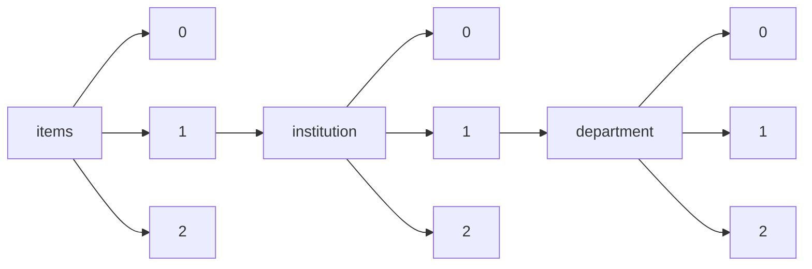

!!! warning "This document is not official Crossref documentation"
# Elements
PATH = items/array/institution/array/department/array(1)  
Occurs 671 344 times  
Unique values: > 999  
{ .annotate }

1. A route to an element, for example:  
   The route "items/array/institution/array/department/array" corresponds to navigating through the JSON indices as  
   ["items"][0]["institution"][0]["department"][0]  

!!! note "Due to current limitations, only the first 1,000 unique values are counted."

| **Row** | **Value** `String`                                                                                | **Count** `Int64` |
|--------:|-----------------------------------------------------------------------------------------------------:|---------------------:|
| **1**   | Performing                                                                                           | 141 445              |
| **2**   | Funding                                                                                              | 141 117              |
| **3**   | D/SCI                                                                                                | 28 191               |
| **4**   | Faculdade de Filosofia, Letras e Ciências Humanas                                                    | 10 359               |
| **5**   | Escola Superior de Agricultura Luiz de Queiroz                                                       | 9 326                |
| **6**   | Faculdade de Medicina                                                                                | 7 941                |
| **7**   | Faculdade de Educação                                                                                | 6 638                |
| **8**   | Escola Politécnica                                                                                   | 6 612                |
| **9**   | Escola de Engenharia de São Carlos                                                                   | 6 045                |
| **10**  | Drexel University (1970-)                                                                            | 5 017                |
| **11**  | Instituto de Biologia                                                                                | 4 661                |
| **12**  | Faculdade de Ciências Médicas                                                                        | 4 642                |
| **13**  | Chemistry                                                                                            | 3 999                |
| **14**  | Instituto de Química                                                                                 | 3 869                |
| **15**  | DEPARTAMENTO DE ADMINISTRAÇÃO / IAG                                                                  | 3 771                |
| **16**  | Research                                                                                             | 3 738                |
| **17**  | Faculdade de Odontologia de Piracicaba                                                               | 3 547                |
| **18**  | Faculdade de Medicina de Ribeirão Preto                                                              | 3 457                |
| **19**  | Faculdade de Direito                                                                                 | 3 314                |
| **20**  | Faculdade de Saúde Pública                                                                           | 3 064                |
| **21**  | Instituto de Geociências                                                                             | 2 863                |
| **22**  | Instituto de Filosofia e Ciências Humanas                                                            | 2 842                |
| **23**  | Faculdade de Medicina Veterinária e Zootecnia                                                        | 2 838                |
| **24**  | Instituto de Ciências Matemáticas e de Computação                                                    | 2 835                |
| **25**  | Faculdade de Economia, Administração e Contabilidade                                                 | 2 783                |
| **26**  | Escola de Comunicações e Artes                                                                       | 2 759                |
| **27**  | Instituto de Matemática e Estatística                                                                | 2 759                |
| **28**  | Faculdade de Engenharia de Alimentos                                                                 | 2 689                |
| **29**  | Psychology                                                                                           | 2 663                |
| **30**  | National Toxicology Program (NTP)                                                                    | 2 595                |
| **31**  | Instituto de Psicologia                                                                              | 2 558                |
| **32**  | Instituto de Estudos da Linguagem                                                                    | 2 555                |
| **33**  | Faculdade de Filosofia, Ciências e Letras de Ribeirão Preto                                          | 2 258                |
| **34**  | Instituto de Ciências Biomédicas                                                                     | 2 229                |
| **35**  | Escola de Enfermagem de Ribeirão Preto                                                               | 2 190                |
| **36**  | Faculdade de Ciências Farmacêuticas                                                                  | 2 186                |
| **37**  | Faculdade de Engenharia Mecânica                                                                     | 2 166                |
| **38**  | Instituto de Física                                                                                  | 2 132                |
| **39**  | Faculdade de Odontologia de Bauru                                                                    | 2 092                |
| **40**  | English                                                                                              | 2 021                |
| **41**  | Instituto de Pesquisas Energéticas e Nucleares                                                       | 1 998                |
| **42**  | Faculdade de Arquitetura e Urbanismo                                                                 | 1 964                |
| **43**  | Instituto de Artes                                                                                   | 1 915                |
| **44**  | Electrical and Computer Engineering                                                                  | 1 882                |
| **45**  | Faculdade de Ciencias Medicas                                                                        | 1 857                |
| **46**  | Computer Science                                                                                     | 1 816                |
| **47**  | Faculdade de Odontologia                                                                             | 1 816                |
| **48**  | Instituto de Biociências                                                                             | 1 806                |
| **49**  | Faculdade de Engenharia Elétrica e de Computação                                                     | 1 792                |
| **50**  | DEPARTAMENTO DE ENGENHARIA ELÉTRICA                                                                  | 1 759                |
| **51**  | Economics                                                                                            | 1 621                |
| **52**  | DEPARTAMENTO DE ENGENHARIA MECÂNICA                                                                  | 1 486                |
| **53**  | Instituto de Física de São Carlos                                                                    | 1 470                |
| **54**  | Escuela de Ingeniería                                                                                | 1 466                |
| **55**  | DEPARTAMENTO DE ENGENHARIA INDUSTRIAL                                                                | 1 440                |
| **56**  | Instituto de Economia                                                                                | 1 440                |
| **57**  | Escola de Enfermagem                                                                                 | 1 384                |
| **58**  | Agronomy                                                                                             | 1 378                |
| **59**  | DEPARTAMENTO DE INFORMÁTICA                                                                          | 1 331                |
| **60**  | Mathematics                                                                                          | 1 322                |
| **61**  | Civil and Environmental Engineering                                                                  | 1 299                |
| **62**  | DEPARTAMENTO DE LETRAS                                                                               | 1 280                |
| **63**  | Mechanical Engineering                                                                               | 1 255                |
| **64**  | DEPARTAMENTO DE ECONOMIA                                                                             | 1 247                |
| **65**  | Mechanical and Aerospace Engineering                                                                 | 1 244                |
| **66**  | Education                                                                                            | 1 240                |
| **67**  | Faculdade de Engenharia Química                                                                      | 1 237                |
| **68**  | Instituto de Química de São Carlos                                                                   | 1 229                |
| **69**  | Instituto de Matemática, Estatística e Computação Científica                                         | 1 224                |
| **70**  | History                                                                                              | 1 200                |
| **71**  | Faculdade de Ciências Farmacêuticas de Ribeirão Preto                                                | 1 193                |
| **72**  | Faculty of Health Sciences                                                                           | 1 191                |
| **73**  | Instituto de Física Gleb Wataghin                                                                    | 1 190                |
| **74**  | College of Engineering (1970-)                                                                       | 1 169                |
| **75**  | Instituto de Filosofia e Ciencias Humanas                                                            | 1 154                |
| **76**  | DEPARTAMENTO DE DIREITO                                                                              | 1 123                |
| **77**  | Physics and Astronomy                                                                                | 1 119                |
| **78**  | Escola de Artes, Ciências e Humanidades                                                              | 1 077                |
| **79**  | Faculdade de Zootecnia e Engenharia de Alimentos                                                     | 1 062                |
| **80**  | Instituto de Computação                                                                              | 1 061                |
| **81**  | Electronic and Computer Engineering                                                                  | 1 044                |
| **82**  | College of Arts and Sciences (1990-)                                                                 | 1 014                |
| **83**  | DEPARTAMENTO DE ENGENHARIA CIVIL                                                                     | 1 012                |
| **84**  | Biology                                                                                              | 1 002                |
| **85**  | Physics                                                                                              | 1 002                |
| **86**  | Faculdade de Engenharia Civil, Arquitetura e Urbanismo                                               | 981                  |
| **87**  | Faculdade de Odontologia de Ribeirão Preto                                                           | 951                  |
| **88**  | E.T.S. Arquitectura (UPM)                                                                            | 951                  |
| **89**  | ORNL Distributed Active Archive Cener for Biogeochemical Dynamics                                    | 918                  |
| **90**  | Instituto de Quimica                                                                                 | 893                  |
| **91**  | Universidad de La Laguna                                                                             | 891                  |
| **92**  | Faculdade de Economia, Administração e Contabilidade de Ribeirão Preto                               | 884                  |
| **93**  | Faculdade de Engenharia Mecanica                                                                     | 884                  |
| **94**  | Chemical and Biological Engineering                                                                  | 872                  |
| **95**  | Animal Science                                                                                       | 871                  |
| **96**  | Faculdade de Engenharia Eletrica e de Computação                                                     | 864                  |
| **97**  | DEPARTAMENTO DE PSICOLOGIA                                                                           | 833                  |
| **98**  | Nursing                                                                                              | 832                  |
| **99**  | Computer Science and Engineering                                                                     | 828                  |
| **100** | School of Mechanical and Mining Engineering                                                          | 821                  |
| **101** | DEPARTAMENTO DE ARTES E DESIGN                                                                       | 766                  |
| **102** | Information Technology Laboratory                                                                    | 755                  |
| **103** | Environmental Sciences Division                                                                      | 734                  |
| **104** | Civil, Construction, and Environmental Engineering                                                   | 699                  |
| **105** | Faculdade de Educação Física                                                                         | 690                  |
| **106** | E.T.S.I. Telecomunicación (UPM)                                                                      | 686                  |
| **107** | Engineering Laboratory                                                                               | 684                  |
| **108** | Agricultural and Biosystems Engineering                                                              | 679                  |
| **109** | Lane Department of Computer Science and Electrical Engineering                                       | 679                  |
| **110** | E.T.S.I. Industriales (UPM)                                                                          | 677                  |
| **111** | Escola de Engenharia de Lorena                                                                       | 675                  |
| **112** | Agricultural Marketing Service                                                                       | 672                  |
| **113** | DEPARTAMENTO DE EDUCAÇÃO                                                                             | 667                  |
| **114** | Sociology                                                                                            | 653                  |
| **115** | DEPARTAMENTO DE HISTÓRIA                                                                             | 646                  |
| **116** | Escola de Educação Física e Esporte                                                                  | 641                  |
| **117** | Faculdade de Engenharia Quimica                                                                      | 636                  |
| **118** | E.T.S.I. Caminos, Canales y Puertos (UPM)                                                            | 632                  |
| **119** | Music                                                                                                | 625                  |
| **120** | Biotecnologia                                                                                        | 622                  |
| **121** | Instituto de Fisica Gleb Wataghin                                                                    | 613                  |
| **122** | Statistics                                                                                           | 612                  |
| **123** | School of Education (1997-)                                                                          | 609                  |
| **124** | Centro de Energia Nuclear na Agricultura                                                             | 608                  |
| **125** | School of Languages and Cultures                                                                     | 599                  |
| **126** | Instituto Oceanográfico                                                                              | 589                  |
| **127** | Centro de Excelência em Turismo                                                                      | 584                  |
| **128** | Materials Science and Engineering                                                                    | 570                  |
| **129** | Department of Mechanical Engineering-Engineering Mechanics                                           | 566                  |
| **130** | Life Science                                                                                         | 559                  |
| **131** | School of Biological Sciences                                                                        | 544                  |
| **132** | Ensino de Ciências (Física, Química e Biologia)                                                      | 544                  |
| **133** | Faculty of Management Sciences                                                                       | 540                  |
| **134** | Faculdade de Engenharia Agricola                                                                     | 515                  |
| **135** | Faculdade de Engenharia Elétrica                                                                     | 510                  |
| **136** | Social Work                                                                                          | 507                  |
| **137** | Antoinette Westphal College of Media Arts and Design (2005-)                                         | 507                  |
| **138** | Drexel University                                                                                    | 500                  |
| **139** | Faculty of Medicine                                                                                  | 481                  |
| **140** | Faculdade de Engenharia Agrícola                                                                     | 481                  |
| **141** | Instituto de Astronomia, Geofísica e Ciências Atmosféricas                                           | 474                  |
| **142** | Ecologia de Agroecossistemas                                                                         | 471                  |
| **143** | Electrical and Electronic Engineering                                                                | 469                  |
| **144** | Curriculum and Instruction                                                                           | 466                  |
| **145** | Faculdade de Engenharia de Campinas                                                                  | 462                  |
| **146** | Carsey School of Public Policy                                                                       | 453                  |
| **147** | School of Medicine                                                                                   | 453                  |
| **148** | Instituto de Física e Química de São Carlos                                                          | 453                  |
| **149** | DEPARTAMENTO DE TEOLOGIA                                                                             | 441                  |
| **150** | Biological Sciences                                                                                  | 439                  |
| **151** | Cundinamarca                                                                                         | 438                  |
| **152** | Transportation Research and Education Center (TREC)                                                  | 434                  |
| **153** | School of Biomedical Engineering, Science, and Health Systems (1997-)                                | 430                  |
| **154** | College of Nursing and Health Professions (2002-)                                                    | 417                  |
| **155** | Theses & dissertations (Interdisciplinary)                                                           | 410                  |
| **156** | Biochemistry, Biophysics and Molecular Biology                                                       | 408                  |
| **157** | Political Science                                                                                    | 408                  |
| **158** | Speech Communication                                                                                 | 407                  |
| **159** | Interservice Radio Propagation Laboratory                                                            | 405                  |
| **160** | DEPARTAMENTO DE FILOSOFIA                                                                            | 403                  |
| **161** | Instituto de Matemática Estatística e Computação Científica                                          | 401                  |
| **162** | Department of English                                                                                | 401                  |
| **163** | Civil Engineering                                                                                    | 400                  |
| **164** | Curry School of Education                                                                            | 398                  |
| **165** | Latin American Studies Program                                                                       | 397                  |
| **166** | Anthropology                                                                                         | 396                  |
| **167** | Escuela de Postgrado                                                                                 | 392                  |
| **168** | Instituto de Relações Internacionais                                                                 | 390                  |
| **169** | Humanities                                                                                           | 389                  |
| **170** | Bioengenharia                                                                                        | 388                  |
| **171** | Art and Art History                                                                                  | 387                  |
| **172** | School of Psychology                                                                                 | 384                  |
| **173** | Zoology and Entomology                                                                               | 383                  |
| **174** | DEPARTAMENTO DE SERVIÇO SOCIAL                                                                       | 382                  |
| **175** | E.T.S.I. Agrónomos (UPM)                                                                             | 381                  |
| **176** | Ciência e Engenharia de Materiais                                                                    | 376                  |
| **177** | Facultad de Educación                                                                                | 373                  |
| **178** | Geology                                                                                              | 371                  |
| **179** | Aerospace Engineering                                                                                | 368                  |
| **180** | INSTITUTO DE RELAÇÕES INTERNACIONAIS                                                                 | 367                  |
| **181** | School of Molecular and Microbial Sciences                                                           | 367                  |
| **182** | Instituto de Geociencias                                                                             | 367                  |
| **183** | Library                                                                                              | 366                  |
| **184** | School of Social Science                                                                             | 365                  |
| **185** | Economics and Sociology                                                                              | 363                  |
| **186** | Horticulture                                                                                         | 357                  |
| **187** | Biochemistry                                                                                         | 355                  |
| **188** | School of Engineering                                                                                | 351                  |
| **189** | Departamento de Biotecnología - Departament de Biotecnologia                                         | 345                  |
| **190** | Hospital de Reabilitação de Anomalias Craniofaciais                                                  | 345                  |
| **191** | Faculdade de Ciências da Saúde                                                                       | 344                  |
| **192** | Seventh-day Adventist Theological Seminary                                                           | 343                  |
| **193** | Museu de Arqueologia e Etnologia                                                                     | 339                  |
| **194** | Industrial and Manufacturing Systems Engineering                                                     | 328                  |
| **195** | Escuela de Arquitectura                                                                              | 328                  |
| **196** | School of Education                                                                                  | 326                  |
| **197** | Faculdade de Educação Fisica                                                                         | 326                  |
| **198** | Instituto de Arquitetura e Urbanismo                                                                 | 325                  |
| **199** | Faculty of Applied Sciences                                                                          | 324                  |
| **200** | Human Development and Family Studies                                                                 | 323                  |
| **201** | Faculdade de Tecnologia, Departamento de Engenharia Elétrica                                         | 322                  |
| **202** | Public Policy Institute                                                                              | 322                  |
| **203** | Faculdade de Engenharia Civil                                                                        | 321                  |
| **204** | Facultad de Comunicación                                                                             | 316                  |
| **205** | Department of Civil and Environmental Engineering                                                    | 312                  |
| **206** | Social Science                                                                                       | 312                  |
| **207** | Geology and Geography                                                                                | 307                  |
| **208** | Educational Leadership and Policy Studies                                                            | 304                  |
| **209** | Departamento de Sistemas Informáticos y Computación - Departament de Sistemes Informàtics i Computac | 303                  |
| **210** | Veterinary Microbiology and Preventive Medicine                                                      | 302                  |
| **211** | School of Agriculture and Food Sciences                                                              | 301                  |
| **212** | Faculdade de Tecnologia                                                                              | 300                  |
| **213** | School of Chemical Engineering                                                                       | 295                  |
| **214** | College of Engineering                                                                               | 291                  |
| **215** | SZTE Biológia Doktori Iskola                                                                         | 291                  |
| **216** | Department of cartography                                                                            | 290                  |
| **217** | Departamento de Ingeniería Mecánica y de Materiales - Departament d'Enginyeria Mecànica i de Materia | 290                  |
| **218** | Central Radio Propogation Laboratory                                                                 | 289                  |
| **219** | DEPARTAMENTO DE QUÍMICA                                                                              | 288                  |
| **220** | Sociology and Anthropology                                                                           | 286                  |
| **221** | Instituto de Energia e Ambiente                                                                      | 284                  |
| **222** | Department of Electrical and Computer Engineering                                                    | 280                  |
| **223** | Psychological and Quantitative Foundations                                                           | 279                  |
| **224** | Department of Computer Science                                                                       | 278                  |
| **225** | DEPARTAMENTO DE COMUNICAÇÃO SOCIAL                                                                   | 278                  |
| **226** | Faculdade de Ciências Aplicadas                                                                      | 277                  |
| **227** | Corcoran Department of History                                                                       | 277                  |
| **228** | Instituto de Matematica, Estatistica e Computação Cientifica                                         | 276                  |
| **229** | Faculty of Engineering and Built Environment                                                         | 276                  |
| **230** | Graduate College                                                                                     | 275                  |
| **231** | Institute for Molecular Bioscience                                                                   | 275                  |
| **232** | Communication Studies                                                                                | 274                  |
| **233** | Food Science and Human Nutrition                                                                     | 273                  |
| **234** | Departamento de Comunicaciones - Departament de Comunicacions                                        | 271                  |
| **235** | Facultad de Informática (UPM)                                                                        | 270                  |
| **236** | Curriculum & Instruction/Literacy Studies                                                            | 270                  |
| **237** | SZTE Klinikai Orvostudományok Doktori Iskola                                                         | 269                  |
| **238** | Cellular structure and 3D bioimaging                                                                 | 267                  |
| **239** | NCM Publications                                                                                     | 263                  |
| **240** | Facultad de Ciencias Empresariales y Económicas                                                      | 262                  |
| **241** | Botany                                                                                               | 260                  |
| **242** | Institute of Chemical Research of Catalonia                                                          | 259                  |
| **243** | School of Physical Sciences                                                                          | 259                  |
| **244** | Escola de Doctorat                                                                                   | 258                  |
| **245** | College of Medicine (2002-)                                                                          | 258                  |
| **246** | METROLOGIA PARA QUALIDADE INDUSTRIAL                                                                 | 255                  |
| **247** | Agricultural Education and Studies                                                                   | 254                  |
| **248** | Integração da América Latina                                                                         | 252                  |
| **249** | School of Information Technology and Electrical Engineering                                          | 252                  |
| **250** | DEPARTAMENTO DE MATEMÁTICA                                                                           | 251                  |
| **251** | Energia                                                                                              | 249                  |
| **252** | School of Music                                                                                      | 246                  |
| **253** | Facultad de Ingeniería y Arquitectura                                                                | 243                  |
| **254** | Industrial and Managements Systems Engineering                                                       | 241                  |
| **255** | Ingeniería Civil                                                                                     | 240                  |
| **256** | Geography                                                                                            | 238                  |
| **257** | Industrial Education and Technology                                                                  | 237                  |
| **258** | Enfermagem                                                                                           | 233                  |
| **259** | Department of Physics                                                                                | 233                  |
| **260** | Roy J. Carver Department of Biomedical Engineering                                                   | 232                  |
| **261** | Creative Arts Therapies                                                                              | 230                  |
| **262** | Barcelona Supercomputing Center                                                                      | 229                  |
| **263** | Department of Chemistry                                                                              | 227                  |
| **264** | Pharmaceutical Sciences                                                                              | 227                  |
| **265** | College of Social Studies                                                                            | 221                  |
| **266** | Physical Measurement Laboratory                                                                      | 221                  |
| **267** | Research on Improving Systems of Education (RISE)                                                    | 220                  |
| **268** | Chemical and Biomedical Engineering                                                                  | 217                  |
| **269** | Theatre Arts                                                                                         | 217                  |
| **270** | Estética e História da Arte                                                                          | 217                  |
| **271** | Not Listed                                                                                           | 217                  |
| **272** | South Asian Studies Program                                                                          | 216                  |
| **273** | E.T.S. de Ingeniería Agronómica, Alimentaria y de Biosistemas (UPM)                                  | 216                  |
| **274** | Environmental Studies                                                                                | 215                  |
| **275** | Biomedical Sciences                                                                                  | 213                  |
| **276** | Faculdade de Economia, Administração e Contabilidade, Departamento de Administração                  | 212                  |
| **277** | DEPARTAMENTO DE ENGENHARIA DE MATERIAIS                                                              | 212                  |
| **278** | Department of Geological and Mining Engineering and Sciences                                         | 211                  |
| **279** | Instituto de Economía                                                                                | 210                  |
| **280** | Animal and Nutritional Sciences                                                                      | 209                  |
| **281** | School of Veterinary Science                                                                         | 209                  |
| **282** | Material Measurement Laboratory                                                                      | 208                  |
| **283** | Faculdade de Agronomia e Medicina Veterinária                                                        | 208                  |
| **284** | Department of History                                                                                | 208                  |
| **285** | Journalism and Mass Communications                                                                   | 207                  |
| **286** | Faculdade de Economia, Administração, Contabilidade e Ciência da Informação e Documentação           | 203                  |
| **287** | School of Earth and Environmental Sciences                                                           | 201                  |
| **288** | Faculdade de Direito de Ribeirão Preto                                                               | 201                  |
| **289** | Public Policy Center                                                                                 | 201                  |
| **290** | National Center for Health Statistics                                                                | 201                  |
| **291** | Entomology                                                                                           | 200                  |
| **292** | Kinesiology                                                                                          | 200                  |
| **293** | Botany and Plant Pathology                                                                           | 199                  |
| **294** | School of Chemistry and Molecular Biosciences                                                        | 199                  |
| **295** | Apparel, Events and Hospitality Management                                                           | 199                  |
| **296** | Earth and Environmental Sciences                                                                     | 198                  |
| **297** | Wildlife and Fisheries Resources                                                                     | 194                  |
| **298** | Teaching and Learning                                                                                | 193                  |
| **299** | Department of Biological Sciences                                                                    | 193                  |
| **300** | Departamento de Ingeniería Hidráulica y Medio Ambiente - Departament d'Enginyeria Hidràulica i Medi  | 190                  |
| **301** | Moss Landing Marine Laboratories                                                                     | 190                  |
| **302** | Mechanical Engineering and Mechanics                                                                 | 189                  |
| **303** | School of Land, Crop and Food Sciences                                                               | 188                  |
| **304** | Bennett S. LeBow College of Business (1999-)                                                         | 188                  |
| **305** | DEP ENGENHARIA DE MATERIAIS                                                                          | 188                  |
| **306** | Departamento de Ingeniería Electrónica - Departament d'Enginyeria Electrònica                        | 188                  |
| **307** | DEPARTAMENTO DE FÍSICA                                                                               | 188                  |
| **308** | School of Biomedical Sciences                                                                        | 187                  |
| **309** | Geological and Atmospheric Sciences                                                                  | 187                  |
| **310** | Faculdade de Engenharia Eletrica                                                                     | 184                  |
| **311** | Educational leadership and policy analysis                                                           | 184                  |
| **312** | Escuela de Psicología                                                                                | 184                  |
| **313** | E.T.S.I. Aeronáuticos (UPM)                                                                          | 183                  |
| **314** | School of Civil Engineering                                                                          | 182                  |
| **315** | Department of Chemical Engineering                                                                   | 182                  |
| **316** | Faculty of Arts and Design                                                                           | 181                  |
| **317** | School of Health and Rehabilitation Sciences                                                         | 181                  |
| **318** | Department of Materials Science and Engineering                                                      | 181                  |
| **319** | Art and Design                                                                                       | 180                  |
| **320** | Facultad de Bellas Artes - Facultat de Belles Arts                                                   | 180                  |
| **321** | Urban Studies and Planning                                                                           | 179                  |
| **322** | Petroleum and Natural Gas Engineering                                                                | 178                  |
| **323** | School of Business                                                                                   | 177                  |
| **324** | Educational Leadership and Policy                                                                    | 175                  |
| **325** | Queensland Brain Institute                                                                           | 175                  |
| **326** | Red de Medición de Parámetros Oceanográficos y de Meteorología Marina (RedMPOMM)                     | 173                  |
| **327** | Arts Administration                                                                                  | 173                  |
| **328** | Greenlee School of Journalism and Communication                                                      | 173                  |
| **329** | Health Policy                                                                                        | 173                  |
| **330** | División de Ciencias Básicas e Ingeniería                                                            | 172                  |
| **331** | E.T.S.I. Montes (UPM)                                                                                | 172                  |
| **332** | Department of Occupational Therapy                                                                   | 171                  |
| **333** | UQ Business School                                                                                   | 171                  |
| **334** | Psicología                                                                                           | 171                  |
| **335** | Philosophy                                                                                           | 170                  |
| **336** | Psychological and Brain Sciences                                                                     | 170                  |
| **337** | Learning Sciences and Human Development                                                              | 168                  |
| **338** | Chemical Engineering                                                                                 | 168                  |
| **339** | Instituto Universitario de Ingeniería de Alimentos para el Desarrollo - Institut Universitari d'Engi | 168                  |
| **340** | Australian Institute for Bioengineering and Nanotechnology                                           | 167                  |
| **341** | Electrical Engineering                                                                               | 167                  |
| **342** | Department of Psychology                                                                             | 167                  |
| **343** | Food Technology                                                                                      | 166                  |
| **344** | Department of Research and Chief Economist                                                           | 165                  |
| **345** | Preventive and Community Dentistry                                                                   | 165                  |
| **346** | Department of Environmental Sciences                                                                 | 165                  |
| **347** | Facultad de Ciencias de la Actividad Física y del Deporte (INEF) (UPM)                               | 164                  |
| **348** | Family and Consumer Sciences Education and Studies                                                   | 163                  |
| **349** | E.T.S. de Ingenieros Informáticos (UPM)                                                              | 163                  |
| **350** | Human Performance                                                                                    | 163                  |
| **351** | Industrial Engineering and Logistics Management                                                      | 160                  |
| **352** | Facultad de Ciencias Biológicas                                                                      | 160                  |
| **353** | Research Department                                                                                  | 160                  |
| **354** | Faculdade de Enfermagem                                                                              | 160                  |
| **355** | English and Comparative Literature                                                                   | 159                  |
| **356** | Gazdálkodástani Doktori Iskola                                                                       | 158                  |
| **357** | Public Administration                                                                                | 158                  |
| **358** | Center for Asian and Pacific Studies                                                                 | 158                  |
| **359** | African Studies Program                                                                              | 158                  |
| **360** | School of Public Health (2002-2015)                                                                  | 157                  |
| **361** | Central Radio Propagation Laboratory                                                                 | 157                  |
| **362** | Bioinformática                                                                                       | 157                  |
| **363** | ERCD                                                                                                 | 157                  |
| **364** | Nutrição Humana Aplicada                                                                             | 156                  |
| **365** | Microbiology                                                                                         | 156                  |
| **366** | Instituto de Ciências Biológicas                                                                     | 156                  |
| **367** | Programa de Pós-Graduação em Engenharia Elétrica                                                     | 155                  |
| **368** | Administración y Negocios Internacionales                                                            | 155                  |
| **369** | School of Communication and Arts                                                                     | 155                  |
| **370** | Departamento de Máquinas y Motores Térmicos - Departament de Màquines i Motors Tèrmics               | 154                  |
| **371** | Instituto de Ciências Humanas, Departamento de Serviço Social                                        | 154                  |
| **372** | Health Management and Policy                                                                         | 151                  |
| **373** | Communication                                                                                        | 151                  |
| **374** | Computer Security Division.                                                                          | 150                  |
| **375** | Veterinary Pathology                                                                                 | 150                  |
| **376** | School of Mathematics and Physics                                                                    | 150                  |
| **377** | School of Pharmacy                                                                                   | 149                  |
| **378** | Occupational and Environmental Health                                                                | 149                  |
| **379** | Departamento de Comunicación Audiovisual, Documentación e Historia del Arte - Departament de Comunic | 149                  |
| **380** | Facultad de Comunicaciones                                                                           | 147                  |
| **381** | College of Letters                                                                                   | 147                  |
| **382** | Arquitectura                                                                                         | 147                  |
| **383** | Genetics, Development and Cell Biology                                                               | 146                  |
| **384** | Pharmacy                                                                                             | 145                  |
| **385** | Urban and Regional Planning Final Projects                                                           | 144                  |
| **386** | Ciência Ambiental                                                                                    | 144                  |
| **387** | Department of Electrical Engineering                                                                 | 143                  |
| **388** | Orthodontics                                                                                         | 143                  |
| **389** | Instituto Dante Pazzanese de Cardiologia                                                             | 143                  |
| **390** | Programa de Pós-Graduação em Engenharia Mecânica                                                     | 143                  |
| **391** | DEPARTAMENTO DE CIÊNCIAS SOCIAIS                                                                     | 142                  |
| **392** | Chemical and Biomolecular Engineering                                                                | 141                  |
| **393** | Nursing (Graduate)                                                                                   | 141                  |
| **394** | School of Political Science and International Studies                                                | 140                  |
| **395** | American Studies                                                                                     | 140                  |
| **396** | Programa de Pós-Graduação em Engenharia Química                                                      | 139                  |
| **397** | Department of Religious Studies                                                                      | 138                  |
| **398** | D/EOP                                                                                                | 138                  |
| **399** | Departamento de Matemática Aplicada - Departament de Matemàtica Aplicada                             | 138                  |
| **400** | Estatística Interinstitucional do ICMC e UFSCarr                                                     | 137                  |
| **401** | Doctoral Nursing                                                                                     | 136                  |
| **402** | College of Education and International Services                                                      | 136                  |
| **403** | Facultad de Derecho                                                                                  | 135                  |
| **404** | Programa de Pós-Graduação em Educação                                                                | 135                  |
| **405** | Environmental Science and Management                                                                 | 135                  |
| **406** | Instituto de Medicina Tropical de São Paulo                                                          | 135                  |
| **407** | Microbiology and Immunology                                                                          | 134                  |
| **408** | Escuela Técnica Superior de Arquitectura - Escola Tècnica Superior d'Arquitectura                    | 133                  |
| **409** | Sustainable Minerals Institute                                                                       | 133                  |
| **410** | Faculdade de Ciência da Informação                                                                   | 133                  |
| **411** | Civil, Architectural, and Environmental Engineering                                                  | 132                  |
| **412** | Leadership and Higher Education                                                                      | 132                  |
| **413** | Queensland Alliance for Agriculture and Food Innovation                                              | 132                  |
| **414** | Faculdade de Engenharia Mecânica e Instituto de Geociências                                          | 131                  |
| **415** | Arts and Entertainment Enterprise                                                                    | 131                  |
| **416** | SDCC                                                                                                 | 131                  |
| **417** | School of Historical and Philosophical Inquiry                                                       | 131                  |
| **418** | School of Human Movement and Nutrition Sciences                                                      | 130                  |
| **419** | Facultad de Agronomía e Ingeniería Forestal                                                          | 130                  |
| **420** | College of Science                                                                                   | 130                  |
| **421** | SZTE Multidiszciplináris Orvostudományok Doktori Iskola                                              | 128                  |
| **422** | School of Geography, Planning and Architecture                                                       | 128                  |
| **423** | Iowa Global Health Network                                                                           | 128                  |
| **424** | Finance                                                                                              | 127                  |
| **425** | Epidemiology                                                                                         | 127                  |
| **426** | Faculdade de Engenharia de Alimentos e Agrícola                                                      | 126                  |
| **427** | Tippie College of Business                                                                           | 126                  |
| **428** | Escuela Técnica Superior de Ingeniería del Diseño - Escola Tècnica Superior d'Enginyeria del Disseny | 126                  |
| **429** | Department of Biomedical Engineering                                                                 | 125                  |
| **430** | Industrial Engineering and Engineering Management                                                    | 125                  |
| **431** | División de Ciencias Sociales y Humanidades                                                          | 125                  |
| **432** | Journalism                                                                                           | 124                  |
| **433** | Educational Policy and Leadership Studies                                                            | 124                  |
| **434** | Creative Writing                                                                                     | 124                  |
| **435** | SZTE Elméleti Orvostudományok Doktori Iskola                                                         | 124                  |
| **436** | Nuclear Engineering                                                                                  | 124                  |
| **437** | Plant Pathology and Microbiology                                                                     | 123                  |
| **438** | Instituto Universitario Mixto de Tecnología Química - Institut Universitari Mixt de Tecnologia Quími | 123                  |
| **439** | Chemical and Materials Engineering                                                                   | 123                  |
| **440** | Government                                                                                           | 123                  |
| **441** | DEPARTAMENTO DE GEOGRAFIA E MEIO AMBIENTE                                                            | 123                  |
| **442** | Natural Resource Ecology and Management                                                              | 122                  |
| **443** | Faculty of   Management Sciences                                                                     | 121                  |
| **444** | Mining Engineering                                                                                   | 121                  |
| **445** | SZTE Gyógyszertudományok Doktori Iskola                                                              | 121                  |
| **446** | Television (and Media) Management                                                                    | 120                  |
| **447** | Department of Nursing                                                                                | 119                  |
| **448** | Departamento de Ciencia Animal - Departament de Ciència Animal                                       | 118                  |
| **449** | Department of Politics                                                                               | 118                  |
| **450** | Faculty of   Accounting and Informatics                                                              | 118                  |
| **451** | CIOH                                                                                                 | 116                  |
| **452** | Faculty of Biology                                                                                   | 116                  |
| **453** | University College Courses                                                                           | 115                  |
| **454** | Department of Systems Engineering                                                                    | 115                  |
| **455** | Industrial and Systems Engineering                                                                   | 115                  |
| **456** | Ingeniería Industrial                                                                                | 114                  |
| **457** | Forestry                                                                                             | 114                  |
| **458** | Communication Sciences and Disorders                                                                 | 114                  |
| **459** | Natural Sciences                                                                                     | 114                  |
| **460** | Microbiology, Immunology, and Cell Biology                                                           | 113                  |
| **461** | Occupational Therapy                                                                                 | 112                  |
| **462** | Department of Economics                                                                              | 112                  |
| **463** | Departamento de Química - Departament de Química                                                     | 111                  |
| **464** | School of English, Media Studies and Art History                                                     | 111                  |
| **465** | Departamento de Engenharia Civil e Ambiental                                                         | 110                  |
| **466** | CCCP                                                                                                 | 110                  |
| **467** | Department of Humanities                                                                             | 109                  |
| **468** | Departamento de Organización de Empresas - Departament d'Organització d'Empreses                     | 109                  |
| **469** | Graduate School of Education                                                                         | 109                  |
| **470** | College of Forest Resources and Environmental Science                                                | 108                  |
| **471** | Museologia                                                                                           | 108                  |
| **472** | Department of Mechanical and Aerospace Engineering                                                   | 108                  |
| **473** | Cinema and Television                                                                                | 108                  |
| **474** | SZTE Kémia Doktori Iskola                                                                            | 108                  |
| **475** | Engineering Science and Mechanics                                                                    | 107                  |
| **476** | Animal Ecology                                                                                       | 107                  |
| **477** | Department of Civil Engineering                                                                      | 107                  |
| **478** | School of Nursing                                                                                    | 107                  |
| **479** | Instituto de Estudos Brasileiros                                                                     | 107                  |
| **480** | School of Forest Resources and Environmental Science                                                 | 105                  |
| **481** | Food and Nutrition                                                                                   | 105                  |
| **482** | Department of Medical Gerontology                                                                    | 103                  |
| **483** | National Institute of Standards and Technology                                                       | 103                  |
| **484** | Facultad de Artes                                                                                    | 103                  |
| **485** | Department of Social Sciences                                                                        | 103                  |
| **486** | Departamento de Ingeniería de la Construcción y de Proyectos de Ingeniería Civil - Departament d'Eng | 103                  |
| **487** | Physiology, Pharmacology & Neuroscience                                                              | 103                  |
| **488** | Library and Information Science                                                                      | 103                  |
| **489** | Social and Education Sciences                                                                        | 102                  |
| **490** | Ecology, Evolution, and Organismal Biology                                                           | 102                  |
| **491** | College of Computing and Informatics (2013-)                                                         | 101                  |
| **492** | Faculdade de Medicina de Botucatu                                                                    | 101                  |
| **493** | EARD                                                                                                 | 101                  |
| **494** | Counseling, Rehabilitation Counseling & Counseling Psychology                                        | 101                  |
| **495** | Department of Mathematical Sciences                                                                  | 100                  |
| **496** | Facultad de Psicología                                                                               | 100                  |
| **497** | Museo de La Salle                                                                                    | 100                  |
| **498** | Genetics                                                                                             | 99                   |
| **499** | Museu de Zoologia                                                                                    | 99                   |
| **500** | Biochemistry and Molecular Biology                                                                   | 98                   |
| **501** | Instituto de Matemática, Estatistica e Computação Cientifica                                         | 98                   |
| **502** | School of Computer Science and Electrical Engineering                                                | 98                   |
| **503** | Marketing                                                                                            | 97                   |
| **504** | Systems Science                                                                                      | 97                   |
| **505** | Interdisciplinary Graduate Program in Molecular Medicine                                             | 97                   |
| **506** | Reed College of Media                                                                                | 96                   |
| **507** | Digital Media                                                                                        | 95                   |
| **508** | Faculdade de Tecnologia, Departamento de Engenharia Civil e Ambiental                                | 95                   |
| **509** | World Languages and Literatures                                                                      | 94                   |
| **510** | Departamento de Economía y Ciencias Sociales - Departament d'Economia i Ciències Socials             | 94                   |
| **511** | Faculdade de Comunicação                                                                             | 94                   |
| **512** | Interdisciplinary Programs                                                                           | 94                   |
| **513** | Programa de Pós-Graduação em Engenharia Civil                                                        | 93                   |
| **514** | Instituto de Biociências, Letras e Ciências Exatas                                                   | 92                   |
| **515** | Oral Pathology, Radiology and Medicine                                                               | 92                   |
| **516** | Department of Cognitive and Learning Sciences                                                        | 92                   |
| **517** | Wood Science and Technology                                                                          | 92                   |
| **518** | Faculty of Science                                                                                   | 91                   |
| **519** | School of Economics                                                                                  | 90                   |
| **520** | Department of Anthropology                                                                           | 90                   |
| **521** | Departamento de Dibujo - Departament de Dibuix                                                       | 90                   |
| **522** | SZTE Földtudományok Doktori Iskola                                                                   | 90                   |
| **523** | E.T.S.I. de Minas y Energía (UPM)                                                                    | 90                   |
| **524** | Forest Resource Management                                                                           | 89                   |
| **525** | Department of Microbiology                                                                           | 89                   |
| **526** | Management                                                                                           | 88                   |
| **527** | Rehabilitation and Counselor Education                                                               | 88                   |
| **528** | Facultad de Ingeniería y Arquitectura Carrera de Ingeniería Industrial                               | 87                   |
| **529** | Facultad de Letras                                                                                   | 87                   |
| **530** | Social Sciences                                                                                      | 87                   |
| **531** | Agricultural and Resource Economics                                                                  | 86                   |
| **532** | SZTE Környezettudományi Doktori Iskola                                                               | 85                   |
| **533** | Departamento de Conservación y Restauración de Bienes Culturales - Departament de Conservació i Rest | 85                   |
| **534** | CGHS                                                                                                 | 84                   |
| **535** | Chemical and Biochemical Engineering                                                                 | 84                   |
| **536** | SZTE Irodalomtudományi Doktori Iskola                                                                | 84                   |
| **537** | Jewish Studies Network                                                                               | 84                   |
| **538** | Faculdade de Economia, Administração, Contabilidade e Ciência da Informação e Documentação, Departam | 83                   |
| **539** | Programa de Pós-Graduação em Ciência da Computação                                                   | 83                   |
| **540** | Art                                                                                                  | 83                   |
| **541** | Departamento de Producción Vegetal - Departament de Producció Vegetal                                | 83                   |
| **542** | Department of Biology                                                                                | 82                   |
| **543** | School of Public Health                                                                              | 82                   |
| **544** | Film Studies                                                                                         | 82                   |
| **545** | Teaching English as a Second Language                                                                | 81                   |
| **546** | Departamento de Tecnología de Alimentos - Departament de Tecnologia d'Aliments                       | 81                   |
| **547** | E.T.S.I. Minas (UPM)                                                                                 | 81                   |
| **548** | Medicina                                                                                             | 81                   |
| **549** | Computer Engineering                                                                                 | 81                   |
| **550** | Departamento de Escultura - Departament d'Escultura                                                  | 81                   |
| **551** | Nano Science and Technology                                                                          | 81                   |
| **552** | SZTE Neveléstudományi Doktori Iskola                                                                 | 80                   |
| **553** | College of Arts and Sciences                                                                         | 80                   |
| **554** | SZTE Állam- és Jogtudományi Doktori Iskola                                                           | 80                   |
| **555** | Administración de Empresas                                                                           | 80                   |
| **556** | Departamento de Ingeniería de Sistemas y Automática - Departament d'Enginyeria de Sistemes i Automàt | 79                   |
| **557** | Applied Linguistics                                                                                  | 79                   |
| **558** | Department of Spanish, Italian, and Portuguese                                                       | 79                   |
| **559** | Swansea University Medical School                                                                    | 79                   |
| **560** | Facultad de Arquitectura, Diseño y Estudios Urbanos                                                  | 79                   |
| **561** | Textiles and Clothing                                                                                | 79                   |
| **562** | Departamento de Engenharia Florestal                                                                 | 78                   |
| **563** | Facultad de Medicina                                                                                 | 77                   |
| **564** | Estudios Económicos Regionales                                                                       | 77                   |
| **565** | Sección Sucursales Regionales Estudios Económicos                                                    | 77                   |
| **566** | Department of Architectural History                                                                  | 77                   |
| **567** | National Energy Technology Laboratory                                                                | 77                   |
| **568** | Programa de Pós-Graduação em Química                                                                 | 76                   |
| **569** | Interdisciplinary Graduate Program in Genetics                                                       | 76                   |
| **570** | Instituto de Ciências Humanas, Departamento de Geografia                                             | 76                   |
| **571** | Escola de Educação Física e Esporte de Ribeirão Preto                                                | 76                   |
| **572** | Accounting                                                                                           | 76                   |
| **573** | Environmental Engineering                                                                            | 75                   |
| **574** | Metallurgical Engineering                                                                            | 75                   |
| **575** | Curriculum & Instruction                                                                             | 75                   |
| **576** | E.T.S.I. Navales (UPM)                                                                               | 75                   |
| **577** | CENTRO TÉCNICO CIENTÍFICO                                                                            | 75                   |
| **578** | Sport and Exercise Psychology                                                                        | 74                   |
| **579** | School of Dentistry                                                                                  | 74                   |
| **580** | Human Factors/Ergonomics                                                                             | 74                   |
| **581** | Office of Evaluation and Oversight                                                                   | 74                   |
| **582** | Agricultural & Extension Education                                                                   | 74                   |
| **583** | Biostatistics                                                                                        | 74                   |
| **584** | E.T.S. de Ingeniería Aeronáutica y del Espacio (UPM)                                                 | 74                   |
| **585** | School of History, Philosophy, Religion and Classics                                                 | 74                   |
| **586** | Faculdade UnB Planaltina                                                                             | 74                   |
| **587** | Faculty of Philosophy                                                                                | 73                   |
| **588** | Foreign Languages                                                                                    | 73                   |
| **589** | SZTE Fizika Doktori Iskola                                                                           | 73                   |
| **590** | Instituto de Psicologia, Departamento de Psicologia Escolar e do Desenvolvimento                     | 72                   |
| **591** | E.T.S. de Edificación (UPM)                                                                          | 71                   |
| **592** | Mestrado em Gestão e Avaliação em Educação Pública                                                   | 71                   |
| **593** | Computer science                                                                                     | 71                   |
| **594** | GSE                                                                                                  | 71                   |
| **595** | Antoinette Westphal College of Media Arts and Design                                                 | 70                   |
| **596** | Learning, teaching and curriculum                                                                    | 70                   |
| **597** | DEPARTAMENTO DE SOCIOLOGIA E POLÍTICA                                                                | 70                   |
| **598** | Urban Studies                                                                                        | 69                   |
| **599** | Interdisciplinary Graduate Program in Neuroscience                                                   | 69                   |
| **600** | SZTE Történelemtudományi Doktori Iskola                                                              | 69                   |
| **601** | Transport Division                                                                                   | 69                   |
| **602** | Mechanical and aerospace engineering                                                                 | 68                   |
| **603** | SZTE Informatika Doktori Iskola                                                                      | 68                   |
| **604** | Child Development                                                                                    | 68                   |
| **605** | Dana and David Dornsife School of Public Health (2015-)                                              | 67                   |
| **606** | Biological sciences                                                                                  | 67                   |
| **607** | RTI Press                                                                                            | 67                   |
| **608** | Zoology                                                                                              | 66                   |
| **609** | Fok Ying Tung Graduate School Innovative Technologies Leadership                                     | 66                   |
| **610** | Department of Mathematics                                                                            | 65                   |
| **611** | Veterinary Physiology and Pharmacology                                                               | 65                   |
| **612** | Zoology and Genetics                                                                                 | 65                   |
| **613** | Art History                                                                                          | 64                   |
| **614** | Agriculture                                                                                          | 64                   |
| **615** | Faculdade de Odontologia, Escola de Enfermagem e Faculdade de Saúde Pública                          | 64                   |
| **616** | Departamento de Estabilidad Financiera                                                               | 63                   |
| **617** | Astronomy                                                                                            | 63                   |
| **618** | Instituto de Matemática, Estatística e Computação Cientifica                                         | 63                   |
| **619** | Bioengineering                                                                                       | 63                   |
| **620** | Instituto de Fisica "Gleb Wataghin"                                                                  | 63                   |
| **621** | College of Information Science and Technology (1995-2013)                                            | 63                   |
| **622** | Centro de Estudos Avançados Multidisciplinares                                                       | 63                   |
| **623** | College of Arts and Humanities                                                                       | 62                   |
| **624** | Social Protection and Health Division                                                                | 62                   |
| **625** | Faculdade de Educação                                                                                | 62                   |
| **626** | Programa de Pós-Graduação em Clínica Odontológica                                                    | 62                   |
| **627** | Forensic and Investigative Science                                                                   | 62                   |
| **628** | Journalism and Mass Communication                                                                    | 62                   |
| **629** | Spanish and Portuguese                                                                               | 62                   |
| **630** | Neurology                                                                                            | 61                   |
| **631** | Environment and Sustainability                                                                       | 61                   |
| **632** | Ingeniería de Sistemas de Información                                                                | 61                   |
| **633** | Programa de Pós-Graduação em Artes                                                                   | 61                   |
| **634** | Thought Leadership                                                                                   | 60                   |
| **635** | Instituto de Matemática, Estatística e Ciência da Computação                                         | 60                   |
| **636** | Interdisciplinary Graduate Program in Applied Mathematical & Computational Sciences                  | 60                   |
| **637** | Regionales Estudios Económicos                                                                       | 60                   |
| **638** | Faculty of Technology and Metallurgy                                                                 | 59                   |
| **639** | Country Department Caribbean Group                                                                   | 59                   |
| **640** | Molecular Biology and Biochemistry                                                                   | 59                   |
| **641** | Escuela de Posgrado                                                                                  | 58                   |
| **642** | Department of Art                                                                                    | 58                   |
| **643** | College of Nursing and Health Professions                                                            | 58                   |
| **644** | Immunology Graduate Program                                                                          | 58                   |
| **645** | Information Systems, Business Statistics and Operations Management                                   | 58                   |
| **646** | Instituto de Estudos da línguagem                                                                    | 58                   |
| **647** | Geographical and Sustainability Sciences                                                             | 58                   |
| **648** | Programa de Pós-Graduação em Física                                                                  | 57                   |
| **649** | Neuroscience & Behavior                                                                              | 57                   |
| **650** | Facultad de Administración y Dirección de Empresas - Facultat d'Administració i Direcció d'Empreses  | 57                   |
| **651** | DEPARTAMENTO DE ARQUITETURA E URBANISMO                                                              | 56                   |
| **652** | Community and Regional Planning                                                                      | 56                   |
| **653** | Department of Astronomy                                                                              | 56                   |
| **654** | Materials Engineering                                                                                | 56                   |
| **655** | Facultad de Ciencias de la Comunicación, Despacho 27. Universidad de Málaga. Campus de Teatinos s/n. | 56                   |
| **656** | Communications Technology Laboratory                                                                 | 55                   |
| **657** | Meteorology                                                                                          | 55                   |
| **658** | School of Chemistry & Molecular Biosciences                                                          | 55                   |
| **659** | Departamento de Proyectos Arquitectónicos - Departament de Projectes Arquitectònics                  | 55                   |
| **660** | Industrial Engineering and Decision Analytics                                                        | 55                   |
| **661** | Departamento de Economia                                                                             | 55                   |
| **662** | División de Ciencias y Artes para el Diseño                                                          | 55                   |
| **663** | Sociology and Criminology                                                                            | 55                   |
| **664** | Nutrition and Food Science                                                                           | 55                   |
| **665** | Religious Studies                                                                                    | 55                   |
| **666** | Plant, insect and microbial sciences                                                                 | 55                   |
| **667** | Universitat de Girona                                                                                | 54                   |
| **668** | Department of Education and Educational Theory (DPU)                                                 | 54                   |
| **669** | Facultad de Ciencias de la Salud                                                                     | 53                   |
| **670** | Nemzetközi Kapcsolatok Doktori Iskola                                                                | 53                   |
| **671** | Health and Human Physiology                                                                          | 53                   |
| **672** | Programa de Pós-Graduação em Engenharia Agrícola                                                     | 53                   |
| **673** | Faculdade de Tecnologia, Departamento de Engenharia Mecânica                                         | 53                   |
| **674** | Pascasarjana                                                                                         | 53                   |
| **675** | Faculty of Agriculture                                                                               | 52                   |
| **676** | Departamento de Matemática                                                                           | 51                   |
| **677** | Center for the Book                                                                                  | 51                   |
| **678** | School of History, Philosophy, Religion, and Classics                                                | 51                   |
| **679** | Dance                                                                                                | 51                   |
| **680** | Biomedical Engineering                                                                               | 51                   |
| **681** | School of Geography, Planning and Environmental Management                                           | 51                   |
| **682** | Intellectual Property Programme                                                                      | 51                   |
| **683** | Programa de Pós-Graduação em Biologia Funcional e Molecular                                          | 50                   |
| **684** | Educational, school and counseling psychology                                                        | 50                   |
| **685** | Centro de Desenvolvimento Sustentável                                                                | 50                   |
| **686** | Facultad de Administración y Negocios                                                                | 50                   |
| **687** | Faculty of Accounting and Informatics                                                                | 50                   |
| **688** | Instituto de Ciência Política                                                                        | 49                   |
| **689** | Geography and Environmental Studies                                                                  | 49                   |
| **690** | Science in Society                                                                                   | 49                   |
| **691** | Ingeniería de Sistemas                                                                               | 49                   |
| **692** | CWRD                                                                                                 | 49                   |
| **693** | Cinematic Arts                                                                                       | 49                   |
| **694** | Departamento de Física Aplicada - Departament de Física Aplicada                                     | 49                   |
| **695** | Interdisciplinary Studies                                                                            | 49                   |
| **696** | Facultad de Ciencias Empresariales y Económicas Carrera de Administración                            | 48                   |
| **697** | Contabilidad y Administración                                                                        | 48                   |
| **698** | Instituto de Biociências de Rio Claro                                                                | 48                   |
| **699** | Faculdade de Engenharia Civil Arquitetura e Urbanismo                                                | 48                   |
| **700** | Computer Science (Computing)                                                                         | 48                   |
| **701** | Departamento de Lingüística Aplicada - Departament de Lingüística Aplicada                           | 48                   |
| **702** | International Studies                                                                                | 48                   |
| **703** | Engineering                                                                                          | 48                   |
| **704** | Office of Strategic Planning and Development Effectiveness                                           | 47                   |
| **705** | Maestría en Tributación y Política Fiscal                                                            | 47                   |
| **706** | Music and Dance                                                                                      | 47                   |
| **707** | Programa de Pós-Graduação em Ciências Médicas                                                        | 47                   |
| **708** | Education Division                                                                                   | 47                   |
| **709** | Contabilidad                                                                                         | 47                   |
| **710** | Instituto de Ciências Exatas, Departamento de Ciência da Computação                                  | 47                   |
| **711** | School of Architecture                                                                               | 46                   |
| **712** | Department of Microbiology, Immunology, and Cancer Biology                                           | 46                   |
| **713** | Centro de Formação de Recursos Humanos em Transportes                                                | 46                   |
| **714** | Faculdade de Medicina (FAMED)                                                                        | 46                   |
| **715** | Second Language Acquisition                                                                          | 46                   |
| **716** | Faculdade de Engenharia Elétrica (FEELT)                                                             | 45                   |
| **717** | Departamento de Proyectos de Ingeniería - Departament de Projectes d'Enginyeria                      | 45                   |
| **718** | SERD                                                                                                 | 45                   |
| **719** | School of Nursing, Midwifery and Social Work                                                         | 45                   |
| **720** | Civil engineering                                                                                    | 45                   |
| **721** | E.T.S.I. y Sistemas de Telecomunicación (UPM)                                                        | 45                   |
| **722** | E.T.S.I. Montes, Forestal y del Medio Natural (UPM)                                                  | 45                   |
| **723** | Neuroscience and Pharmacology                                                                        | 45                   |
| **724** | Faculdade de Tecnologia de Alimentos                                                                 | 45                   |
| **725** | Tropical Health Program                                                                              | 45                   |
| **726** | Statistics and Actuarial Science                                                                     | 45                   |
| **727** | Department of Sociology                                                                              | 45                   |
| **728** | Institutional Capacity of State Division                                                             | 45                   |
| **729** | Yucca Mountain Project                                                                               | 44                   |
| **730** | Meteorology and Climate Science                                                                      | 44                   |
| **731** | Computational and Data Sciences                                                                      | 44                   |
| **732** | Programa de Pós-Graduação em Engenharia de Alimentos                                                 | 44                   |
| **733** | Architecture                                                                                         | 44                   |
| **734** | SZTE Közgazdaságtani Doktori Iskola                                                                  | 44                   |
| **735** | Instituto de Letras, Departamento de Linguística, Português e Línguas Clássicas                      | 44                   |
| **736** | Information Science (Informatics)                                                                    | 44                   |
| **737** | Departamento de Biologia Geral                                                                       | 44                   |
| **738** | Television, Radio, Film and Theatre                                                                  | 44                   |
| **739** | Mathematics and Computer Science                                                                     | 44                   |
| **740** | Departamento de Informática de Sistemas y Computadores - Departament d'Informàtica de Sistemes i Com | 43                   |
| **741** | Facultad de Derecho. Carrera de Derecho                                                              | 43                   |
| **742** | T&T                                                                                                  | 43                   |
| **743** | DEPARTAMENTO DE GEOGRAFIA                                                                            | 43                   |
| **744** | Art and Architecture                                                                                 | 43                   |
| **745** | Departamento de Ingeniería Textil y Papelera - Departament d'Enginyeria Tèxtil i Paperera            | 43                   |
| **746** | Departamento de Engenharia Agrícola                                                                  | 43                   |
| **747** | Planning and Public Affairs                                                                          | 43                   |
| **748** | SZTE Nyelvtudományi Doktori Iskola                                                                   | 42                   |
| **749** | Departamento de Pintura - Departament de Pintura                                                     | 42                   |
| **750** | SZTE Interdiszciplináris Orvostudományok Doktori Iskola                                              | 42                   |
| **751** | Educational Leadership and Policy/Educational Leadership-Distance                                    | 42                   |
| **752** | Faculty of Mechanical Engineering                                                                    | 42                   |
| **753** | Programa de Pós-Graduação em Saúde da Criança e do Adolescente                                       | 41                   |
| **754** | Programa de Pós-Graduação em Desenvolvimento Econômico                                               | 41                   |
| **755** | School of Management                                                                                 | 41                   |
| **756** | Competitiveness and Development Programme                                                            | 41                   |
| **757** | Engineering and Technology Management                                                                | 41                   |
| **758** | Science Teaching                                                                                     | 41                   |
| **759** | Maestría tributacion                                                                                 | 41                   |
| **760** | Faculty of Philology                                                                                 | 41                   |
| **761** | Facultad de Ciencias de la Comunicación, Despacho 27. Universidad de Málaga, Campus de Teatinos s/n. | 41                   |
| **762** | Poultry Science                                                                                      | 41                   |
| **763** | Applied Science                                                                                      | 40                   |
| **764** | Energy Division                                                                                      | 40                   |
| **765** | Faculty of Electrical and Environmental Engineering                                                  | 40                   |
| **766** | FAMED                                                                                                | 40                   |
| **767** | Molecular Physiology and Biophysics                                                                  | 40                   |
| **768** | Faculdade de Ciências e Letras de Araraquara                                                         | 40                   |
| **769** | FACED                                                                                                | 40                   |
| **770** | Departamento de Urbanismo - Departament d'Urbanisme                                                  | 40                   |
| **771** | Earth Science                                                                                        | 39                   |
| **772** | Instituto de Matematica, Estatistica e Computação Científica                                         | 39                   |
| **773** | World Languages, Literatures and Cultures                                                            | 39                   |
| **774** | Instituto de Letras e Linguísticas (ILEEL)                                                           | 39                   |
| **775** | Biodiversity, Earth, and Environmental Science (BEES)                                                | 39                   |
| **776** | School of Educational Studies                                                                        | 39                   |
| **777** | Department of Neuroscience                                                                           | 39                   |
| **778** | Faculdade de Educação (FACED)                                                                        | 39                   |
| **779** | CON DNP                                                                                              | 39                   |
| **780** | Special Education and Rehabilitative Services                                                        | 39                   |
| **781** | CIE Central Bureau                                                                                   | 39                   |
| **782** | Water and Sanitation Division                                                                        | 39                   |
| **783** | Family Environment                                                                                   | 39                   |
| **784** | General Scholarship                                                                                  | 38                   |
| **785** | Department of Music                                                                                  | 38                   |
| **786** | Social Work and Social Research                                                                      | 38                   |
| **787** | Departamento de Línguas Estrangeiras e Tradução                                                      | 38                   |
| **788** | Departamento de Estadística e Investigación Operativa Aplicadas y Calidad - Departament d'Estadístic | 38                   |
| **789** | Special Education                                                                                    | 38                   |
| **790** | Escuela de Medicina                                                                                  | 38                   |
| **791** | Repositorio Digital Marítimo, Fluvial y Costero                                                      | 38                   |
| **792** | Programa de Pós-graduação em Engenharia Elétrica                                                     | 37                   |
| **793** | Human Nutrition and Foods                                                                            | 37                   |
| **794** | Programa de Pós-Graduação em Linguística                                                             | 37                   |
| **795** | Technology Leadership and Entrepreneurship                                                           | 37                   |
| **796** | Information and Systems Management                                                                   | 37                   |
| **797** | Departamento de Administração e Contabilidade                                                        | 36                   |
| **798** | General Business                                                                                     | 36                   |
| **799** | Comunicación y Periodismo                                                                            | 36                   |
| **800** | Integration and Trade Sector                                                                         | 36                   |
| **801** | Animal sciences                                                                                      | 36                   |
| **802** | Theses & dissertations (College of Business)                                                         | 36                   |
| **803** | Speech and Hearing Sciences                                                                          | 36                   |
| **804** | Department of Biochemistry and Molecular Genetics                                                    | 36                   |
| **805** | Integrative Systems and Design                                                                       | 35                   |
| **806** | Mechanical and Materials Engineering                                                                 | 35                   |
| **807** | LPI Education and Public Outreach Department                                                         | 35                   |
| **808** | Nanyang Business School                                                                              | 35                   |
| **809** | Classics                                                                                             | 35                   |
| **810** | Engineering Laboratory.                                                                              | 35                   |
| **811** | School of Health & Rehabilitation Sciences                                                           | 35                   |
| **812** | School of Languages and Comparative Cultural Studies                                                 | 35                   |
| **813** | Department of Philosophy                                                                             | 35                   |
| **814** | Food Science                                                                                         | 35                   |
| **815** | Criminology and Criminal Justice                                                                     | 35                   |
| **816** | Health Science                                                                                       | 34                   |
| **817** | Community Health and Prevention                                                                      | 34                   |
| **818** | Programa de Pós-graduação em Ciência da Religião                                                     | 34                   |
| **819** | Gloucestershire Business School                                                                      | 34                   |
| **820** | Adult Health                                                                                         | 34                   |
| **821** | Instituto de Ciências Agrárias (ICIAG)                                                               | 34                   |
| **822** | Department of Geosciences                                                                            | 34                   |
| **823** | Public Affairs and Policy                                                                            | 34                   |
| **824** | Department of French                                                                                 | 34                   |
| **825** | Recreation, Parks and Tourism Resources                                                              | 34                   |
| **826** | Innovation in Citizen Services Division                                                              | 34                   |
| **827** | Kertészettudományi Doktori Iskola                                                                    | 33                   |
| **828** | Universitat Rovira i Virgili                                                                         | 33                   |
| **829** | Theater                                                                                              | 33                   |
| **830** | African American Studies                                                                             | 33                   |
| **831** | Exercise Physiology                                                                                  | 33                   |
| **832** | Departamento de Engenharia Elétrica                                                                  | 33                   |
| **833** | Sociology and Social Policy                                                                          | 33                   |
| **834** | Faculty of Technical Science                                                                         | 33                   |
| **835** | E.T.S.I. en Topografía, Geodesia y Cartografía (UPM)                                                 | 33                   |
| **836** | Programa de Pós-Graduação em Teoria e História Literária                                             | 32                   |
| **837** | College of Human and Health Sciences                                                                 | 32                   |
| **838** | School of Population Health                                                                          | 32                   |
| **839** | Pharmaceutical Systems and Policy                                                                    | 32                   |
| **840** | Élelmiszertudományi Doktori Iskola                                                                   | 32                   |
| **841** | Feminist, Gender, & Sexuality Studies                                                                | 32                   |
| **842** | Landscape Architecture                                                                               | 32                   |
| **843** | Department of Education                                                                              | 32                   |
| **844** | Instituto de Ciências Humanas, Departamento de História                                              | 32                   |
| **845** | Programa de Pós-graduação em Educação                                                                | 32                   |
| **846** | SARD                                                                                                 | 32                   |
| **847** | Nutrición y Dietética                                                                                | 31                   |
| **848** | Departamento de Teoria Literária e Literaturas                                                       | 31                   |
| **849** | Institute for Social Science Research                                                                | 31                   |
| **850** | Conflict Resolution                                                                                  | 31                   |
| **851** | Physical Education Teacher Education                                                                 | 31                   |
| **852** | Programa de Pós-Graduação em Clínica Médica                                                          | 31                   |
| **853** | Creative Arts in Therapy [Historical]                                                                | 31                   |
| **854** | Community and Behavioral Health                                                                      | 31                   |
| **855** | Computer Science And Mathematics                                                                     | 30                   |
| **856** | Task 39                                                                                              | 30                   |
| **857** | Escuela Técnica Superior de Ingenieros de Caminos, Canales y Puertos - Escola Tècnica Superior d'Eng | 30                   |
| **858** | Speech                                                                                               | 30                   |
| **859** | School of Natural and Rural Systems Management                                                       | 30                   |
| **860** | Educational Leadership                                                                               | 30                   |
| **861** | Social & Education Policy                                                                            | 30                   |
| **862** | Departamento de Ingeniería Cartográfica Geodesia y Fotogrametría - Departament d'Enginyeria Cartogrà | 30                   |
| **863** | World Languages, Literatures and Linguistics                                                         | 30                   |
| **864** | Szociológia Doktori Iskola                                                                           | 30                   |
| **865** | Unitat Predepartamental d'Infermeria                                                                 | 30                   |
| **866** | Environmental Science                                                                                | 30                   |
| **867** | Faculty of Veterinary Medicine                                                                       | 30                   |
| **868** | Political science                                                                                    | 29                   |
| **869** | Department of Molecular Physiology and Biological Physics                                            | 29                   |
| **870** | Chinese                                                                                              | 29                   |
| **871** | Departamento de História                                                                             | 29                   |
| **872** | División de Ciencias Biológicas y de la Salud                                                        | 29                   |
| **873** | Faculdade de Economia, Administração, Contabilidade e Ciência da Informação e Documentação, Departam | 28                   |
| **874** | Environment and Natural Resources Programme                                                          | 28                   |
| **875** | IGUFU                                                                                                | 28                   |
| **876** | Art and Visual Culture                                                                               | 28                   |
| **877** | Gyvybės mokslų centras                                                                               | 28                   |
| **878** | Information science and learning technologies                                                        | 28                   |
| **879** | PPFD                                                                                                 | 28                   |
| **880** | Stanford Linear Accelerator Center (SLAC)                                                            | 28                   |
| **881** | Electrical and computer engineering                                                                  | 28                   |
| **882** | Faculdade de Engenharia Química (FEQUI)                                                              | 27                   |
| **883** | UQ Diamantina Institute                                                                              | 27                   |
| **884** | Faculdade de Filosofia e Ciências                                                                    | 27                   |
| **885** | Departamento de Biologia Vegetal                                                                     | 27                   |
| **886** | Religion                                                                                             | 27                   |
| **887** | Technical Faculty                                                                                    | 27                   |
| **888** | Programa de Pós Graduação em Biodiversidade e Conservação da Natureza                                | 27                   |
| **889** | Center for Equity for English Learners                                                               | 27                   |
| **890** | Interdisciplinary Graduate Program in Human Toxicology                                               | 27                   |
| **891** | Department of Drama                                                                                  | 27                   |
| **892** | T.C. Beirne School of Law                                                                            | 27                   |
| **893** | Chemical Sciences Division, Materials Measurement Laboratory                                         | 27                   |
| **894** | Programa de Pós-Graduação em Saúde Coletiva                                                          | 27                   |
| **895** | Instituto de Geografía                                                                               | 26                   |
| **896** | Programa de Pós-Graduação em Enfermagem                                                              | 26                   |
| **897** | United States Cancer Statistics (USCS)                                                               | 26                   |
| **898** | Pharmacology and Physiology                                                                          | 26                   |
| **899** | Comparative Literature                                                                               | 26                   |
| **900** | Veterinary Diagnostic and Production Animal Medicine                                                 | 26                   |
| **901** | Instituto de Sociología                                                                              | 26                   |
| **902** | Athletic Training                                                                                    | 26                   |
| **903** | School of History, Philosophy, Religion & Classics                                                   | 25                   |
| **904** | College of Medicine                                                                                  | 25                   |
| **905** | Instituto de Filosofia e Ciências Humanas                                                            | 25                   |
| **906** | Programa de Pós-graduação em Química                                                                 | 25                   |
| **907** | Programa de Pós-graduação em Saúde Coletiva                                                          | 25                   |
| **908** | Institute for Curatorial Practice in Performance                                                     | 25                   |
| **909** | Materials Measurement Laboratory                                                                     | 25                   |
| **910** | Faculty of Electrical Engineering                                                                    | 24                   |
| **911** | Just Tech                                                                                            | 24                   |
| **912** | Instituto de Ciências Biológicas, Departamento de Botânica                                           | 24                   |
| **913** | NMR Publicationsunit                                                                                 | 24                   |
| **914** | Departamento de Engenharia Civil                                                                     | 24                   |
| **915** | Modelagem Matemática em Finanças                                                                     | 24                   |
| **916** | Linguistics and Language Development                                                                 | 24                   |
| **917** | Ocean Science                                                                                        | 24                   |
| **918** | School of Human Movement Studies                                                                     | 24                   |
| **919** | Departamento de Zootecnia                                                                            | 24                   |
| **920** | Institute of Federalism                                                                              | 24                   |
| **921** | Programa de Pós-Graduação em Biologia Celular e Estrutural                                           | 24                   |
| **922** | Instituto de Geografia (IGUFU)                                                                       | 23                   |
| **923** | Free Radical and Radiation Biology Program                                                           | 23                   |
| **924** | School of Technology                                                                                 | 23                   |
| **925** | Bonneville Power Administration (BPA)                                                                | 23                   |
| **926** | Programa de Pós-Graduação em Matemática Aplicada                                                     | 23                   |
| **927** | Department of Educational Technology                                                                 | 23                   |
| **928** | Mathematics and Statistics                                                                           | 23                   |
| **929** | Operative Dentistry                                                                                  | 23                   |
| **930** | Danish School of Education                                                                           | 23                   |
| **931** | Comunicación y Publicidad                                                                            | 23                   |
| **932** | Chemical and Biological Engineering Bioengineering                                                   | 23                   |
| **933** | Faculty of Materials Science and Applied Chemistry                                                   | 22                   |
| **934** | Molecular Biology & Biochemistry                                                                     | 22                   |
| **935** | Departamento de Engenharia Mecânica                                                                  | 22                   |
| **936** | Department of the Built Environment                                                                  | 22                   |
| **937** | Instituto de Letras, Departamento de Teoria Literária e Literaturas                                  | 22                   |
| **938** | Educational leadership                                                                               | 21                   |
| **939** | Labor Markets Division                                                                               | 21                   |
| **940** | College of Public Health                                                                             | 21                   |
| **941** | Maestría en Derecho Empresarial                                                                      | 21                   |
| **942** | Departamento de Biologia Celular                                                                     | 21                   |
| **943** | German                                                                                               | 20                   |
| **944** | Mental Health (Technology/Sciences) [Historical]                                                     | 20                   |
| **945** | Graduate Studies and Research                                                                        | 20                   |
| **946** | Departamento de Ingeniería Rural y Agroalimentaria - Departament d'Enginyeria Rural i Agroalimentàri | 20                   |
| **947** | Ciències de la Comunicació                                                                           | 20                   |
| **948** | Mestrado Profissional em Rede Nacional em Gestão e Regulação de Recursos Hídricos                    | 20                   |
| **949** | Instituto de Matematica Estatistica e Computação Científica                                          | 20                   |
| **950** | Teacher Education                                                                                    | 20                   |
| **951** | Departamento de Construcciones Arquitectónicas - Departament de Construccions Arquitectòniques       | 20                   |
| **952** | Management Studies                                                                                   | 20                   |
| **953** | Faculdade de Economia, Administração, Contabilidade e Gestão de Políticas Públicas, Departamento de  | 20                   |
| **954** | Environmental Sciences and Resources                                                                 | 20                   |
| **955** | Programa de Pós-Graduação em Música                                                                  | 19                   |
| **956** | Programa de Pós-Graduação em Ciência de Alimentos                                                    | 19                   |
| **957** | Departamento de Linguística, Português e Línguas Clássicas                                           | 19                   |
| **958** | Ceramics                                                                                             | 19                   |
| **959** | Bennett S. LeBow College of Business                                                                 | 19                   |
| **960** | Instituto de Matemática, Estatística e Computação Científica Aplicada                                | 19                   |
| **961** | Department of Agriculture                                                                            | 19                   |
| **962** | Chemical engineering                                                                                 | 18                   |
| **963** | CENTRUM Investigación                                                                                | 18                   |
| **964** | Linguistics                                                                                          | 18                   |
| **965** | Graphic Design                                                                                       | 18                   |
| **966** | Politikatudományi Doktori Iskola                                                                     | 18                   |
| **967** | Instituto de Ciências Exatas, Departamento de Matemática                                             | 18                   |
| **968** | Faculdade de Ciências da Saúde, Departamento de Odontologia                                          | 17                   |
| **969** | Instituto de Biologia (INBIO)                                                                        | 17                   |
| **970** | Oxford Poverty & Human Development Initiative (OPHI)                                                 | 17                   |
| **971** | Nemzetközi Kapcsolatok és Politikatudományi Doktori Iskola                                           | 17                   |
| **972** | Bus Admin Graduate Programs                                                                          | 17                   |
| **973** | Interservice Radio Propagation Laboratory.                                                           | 17                   |
| **974** | Departamento de Estudos Econômicos                                                                   | 16                   |
| **975** | Közgazdasági és Gazdaságinformatikai Doktori Iskola                                                  | 16                   |
| **976** | Faculdade de Ciências e Tecnologia                                                                   | 16                   |
| **977** | Instituto de Letras, Departamento de Línguas Estrangeiras e Tradução                                 | 16                   |
| **978** | Departamento de Nutrição e Saúde                                                                     | 16                   |
| **979** | Civil and Structural Engineering                                                                     | 15                   |
| **980** | Mathematics and Computer Science [Historical]                                                        | 15                   |
| **981** | IQUFU                                                                                                | 15                   |
| **982** | Pathology                                                                                            | 15                   |
| **983** | Department of Engineering                                                                            | 15                   |
| **984** | Quantum Chemistry                                                                                    | 14                   |
| **985** | Epidemiology and Biostatistics                                                                       | 14                   |
| **986** | Programa de Pós-Graduação em Ecologia                                                                | 14                   |
| **987** | Cultural Studies                                                                                     | 14                   |
| **988** | General Engineering                                                                                  | 14                   |
| **989** | Instituto de Química (IQUFU)                                                                         | 14                   |
| **990** | Programa de Pós-graduação em Ciências Sociais                                                        | 13                   |
| **991** | Faculty of Communication (University of Malaga)                                                      | 13                   |
| **992** | Departamento de Ecosistemas Agroforestales - Departament d'Ecosistemes Agroforestals                 | 13                   |
| **993** | Infrastructure and Energy Sector                                                                     | 13                   |
| **994** | School of Business and Economics                                                                     | 13                   |
| **995** | Faculdade de Odontologia de Piracicaba;                                                              | 13                   |
| **996** | Közgazdaságtani Doktori Iskola                                                                       | 12                   |
| **997** | Instituto de Ciências Humanas, Departamento de Filosofia                                             | 12                   |
| **998** | Department of Engineering Physics                                                                    | 12                   |
| **999** | School of Biomedical Engineering, Science, and Health Systems                                        | 12                   |
| ... | ... | ... |

