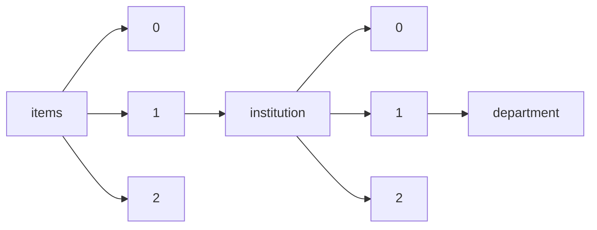

!!! warning "This document is not official Crossref documentation"
# Department
PATH = items/array/institution/array/department(1)  
Occurs 660 223 times  
{ .annotate }

1. A route to an element, for example:  
   The route "items/array/institution/array/department" corresponds to navigating through the JSON indices as  
   ["items"][0]["institution"][0]["department"]  

## Properties of Array
See information about elements: [items/array/institution/array/department/array](array/index.md)  
Distribution of lengths:  

| **Row** | **Length** `Any` | **Count** `Int64` |
|--------:|--------------------:|---------------------:|
| **1**   | 1                   | 653 313              |
| **2**   | 2                   | 3 573                |
| **3**   | 3                   | 2 708                |
| **4**   | 4                   | 469                  |
| **5**   | 5                   | 75                   |
| **6**   | 6                   | 85                   |

