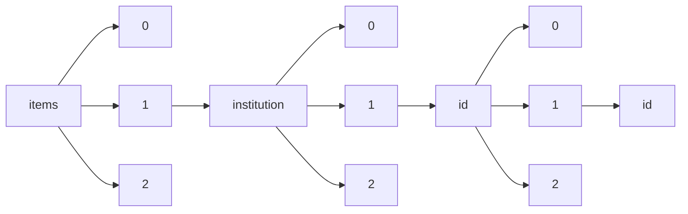

!!! warning "This document is not official Crossref documentation"
# Id
PATH = items/array/institution/array/id/array/id(1)  
Occurs 9 620 times  
Unique values: 67  
{ .annotate }

1. A route to an element, for example:  
   The route "items/array/institution/array/id/array/id" corresponds to navigating through the JSON indices as  
   ["items"][0]["institution"][0]["id"][0]["id"]  

| **Row** | **Value** `String`                     | **Count** `Int64` |
|--------:|------------------------------------------:|---------------------:|
| **1**   | https://ror.org/02twcfp32                 | 3 486                |
| **2**   | https://ror.org/02ymw8z06                 | 828                  |
| **3**   | https://www.wikidata.org/entity/Q579968   | 698                  |
| **4**   | https://www.isni.org/0000000121623504     | 698                  |
| **5**   | https://www.isni.org/0000000120190559     | 319                  |
| **6**   | https://ror.org/043ddq142                 | 319                  |
| **7**   | https://www.wikidata.org/entity/Q3262326  | 319                  |
| **8**   | https://www.isni.org/0000000097097726     | 270                  |
| **9**   | https://ror.org/02catss52                 | 270                  |
| **10**  | https://www.wikidata.org/entity/Q1341845  | 270                  |
| **11**  | https://ror.org/052tfza37                 | 239                  |
| **12**  | https://ror.org/02e3zdp86                 | 230                  |
| **13**  | https://ror.org/05xpvk416                 | 214                  |
| **14**  | https://ror.org/01yp9g959                 | 155                  |
| **15**  | https://ror.org/04pp8hn57                 | 147                  |
| **16**  | https://www.isni.org/0000000120346234     | 147                  |
| **17**  | https://www.isni.org/0000000417549227     | 128                  |
| **18**  | https://ror.org/008xxew50                 | 128                  |
| **19**  | https://ror.org/0440c3437                 | 100                  |
| **20**  | https://www.isni.org/0000000406479411     | 100                  |
| **21**  | https://ror.org/01wxdvj03                 | 85                   |
| **22**  | https://ror.org/022fs9h90                 | 75                   |
| **23**  | https://www.isni.org/000000012158463X     | 47                   |
| **24**  | https://ror.org/00vdend65                 | 46                   |
| **25**  | https://www.isni.org/0000000406479374     | 28                   |
| **26**  | https://ror.org/016s8vs02                 | 28                   |
| **27**  | https://ror.org/03v61g875                 | 22                   |
| **28**  | https://ror.org/03rp50x72                 | 21                   |
| **29**  | https://ror.org/04v76ef78                 | 18                   |
| **30**  | https://ror.org/05bp8ka05                 | 17                   |
| **31**  | https://ror.org/0432jq872                 | 15                   |
| **32**  | https://ror.org/01pnej532                 | 15                   |
| **33**  | https://www.isni.org/0000000406479307     | 12                   |
| **34**  | https://ror.org/04a0y3b96                 | 12                   |
| **35**  | https://www.isni.org/0000000405062673     | 12                   |
| **36**  | https://www.isni.org/0000000121070815     | 11                   |
| **37**  | https://www.wikidata.org/entity/Q6048313  | 11                   |
| **38**  | https://www.wikidata.org/entity/Q5188229  | 11                   |
| **39**  | https://ror.org/04w7skc03                 | 8                    |
| **40**  | https://www.wikidata.org/entity/Q519427   | 8                    |
| **41**  | https://www.isni.org/0000000121657675     | 8                    |
| **42**  | https://ror.org/015xey021                 | 4                    |
| **43**  | https://www.isni.org/0000000459050280     | 4                    |
| **44**  | https://ror.org/049pfb863                 | 4                    |
| **45**  | https://www.wikidata.org/entity/Q534643   | 4                    |
| **46**  | https://www.wikidata.org/entity/Q1473615  | 2                    |
| **47**  | https://www.isni.org/0000000419370191     | 2                    |
| **48**  | https://www.isni.org/0000000419371135     | 2                    |
| **49**  | https://www.wikidata.org/entity/Q12432    | 2                    |
| **50**  | https://www.isni.org/0000000106569343     | 2                    |
| **51**  | https://www.isni.org/0000000106635937     | 2                    |
| **52**  | https://ror.org/0036rpn28                 | 2                    |
| **53**  | https://ror.org/01bj3aw27                 | 1                    |
| **54**  | https://www.wikidata.org/entity/Q849751   | 1                    |
| **55**  | https://www.wikidata.org/entity/Q19861084 | 1                    |
| **56**  | https://www.isni.org/0000000446638501     | 1                    |
| **57**  | https://ror.org/02885vs25                 | 1                    |
| **58**  | https://ror.org/04xbn6x09                 | 1                    |
| **59**  | https://ror.org/08twf2p30                 | 1                    |
| **60**  | https://ror.org/05fq50484                 | 1                    |
| **61**  | https://www.wikidata.org/entity/Q7177423  | 1                    |
| **62**  | https://ror.org/02aab7a23                 | 1                    |
| **63**  | https://www.isni.org/0000000123423717     | 1                    |
| **64**  | https://ror.org/04fa4r544                 | 1                    |
| **65**  | https://www.isni.org/0000000419369430     | 1                    |
| **66**  | https://www.isni.org/0000000731235577     | 1                    |
| **67**  | https://www.wikidata.org/entity/Q913250   | 1                    |

