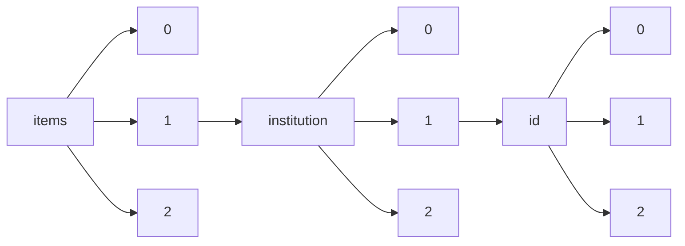

!!! warning "This document is not official Crossref documentation"
# Elements
PATH = items/array/institution/array/id/array(1)  
Occurs 9 620 times  
{ .annotate }

1. A route to an element, for example:  
   The route "items/array/institution/array/id/array" corresponds to navigating through the JSON indices as  
   ["items"][0]["institution"][0]["id"][0]  

## Asserted-by
See more information: [items/array/institution/array/id/array/asserted-by](asserted-by/index.md)  
Occurs 9 620 timess  
Unique values: 1  

| **Row** | **Value** `String` | **Count** `Int64` |
|--------:|----------------------:|---------------------:|
| **1**   | publisher             | 9 620                |

## Id
See more information: [items/array/institution/array/id/array/id](id/index.md)  
Occurs 9 620 timess  
Unique values: 67  

| **Row** | **Value** `String`                    | **Count** `Int64` |
|--------:|-----------------------------------------:|---------------------:|
| **1**   | https://ror.org/02twcfp32                | 3 486                |
| **2**   | https://ror.org/02ymw8z06                | 828                  |
| **3**   | https://www.wikidata.org/entity/Q579968  | 698                  |
| **4**   | https://www.isni.org/0000000121623504    | 698                  |
| **5**   | https://www.isni.org/0000000120190559    | 319                  |
| **6**   | https://ror.org/043ddq142                | 319                  |
| **7**   | https://www.wikidata.org/entity/Q3262326 | 319                  |
| **8**   | https://www.isni.org/0000000097097726    | 270                  |
| **9**   | https://ror.org/02catss52                | 270                  |
| **10**  | https://www.wikidata.org/entity/Q1341845 | 270                  |
| ... | ... | ... |

## Id-type
See more information: [items/array/institution/array/id/array/id-type](id-type/index.md)  
Occurs 9 620 timess  
Unique values: 3  

| **Row** | **Value** `String` | **Count** `Int64` |
|--------:|----------------------:|---------------------:|
| **1**   | ROR                   | 6 495                |
| **2**   | ISNI                  | 1 796                |
| **3**   | wikidata              | 1 329                |

