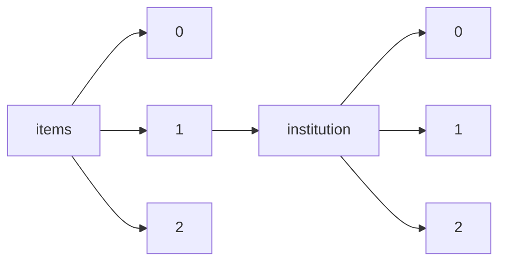

!!! warning "This document is not official Crossref documentation"
# Elements
PATH = items/array/institution/array(1)  
Occurs 4 434 106 times  
{ .annotate }

1. A route to an element, for example:  
   The route "items/array/institution/array" corresponds to navigating through the JSON indices as  
   ["items"][0]["institution"][0]  

## Acronym
See more information: [items/array/institution/array/acronym](acronym/index.md)  
Occurs 2 353 880 timess  

| **Row** | **Length** `Any` | **Count** `Int64` |
|--------:|--------------------:|---------------------:|
| **1**   | 1                   | 2 347 044            |
| **2**   | 2                   | 6 836                |

## Department
See more information: [items/array/institution/array/department](department/index.md)  
Occurs 660 223 timess  

| **Row** | **Length** `Any` | **Count** `Int64` |
|--------:|--------------------:|---------------------:|
| **1**   | 1                   | 653 313              |
| **2**   | 2                   | 3 573                |
| **3**   | 3                   | 2 708                |
| **4**   | 4                   | 469                  |
| **5**   | 5                   | 75                   |
| **6**   | 6                   | 85                   |

## Id
See more information: [items/array/institution/array/id](id/index.md)  
Occurs 6 508 timess  

| **Row** | **Length** `Any` | **Count** `Int64` |
|--------:|--------------------:|---------------------:|
| **1**   | 1                   | 4 712                |
| **2**   | 2                   | 480                  |
| **3**   | 3                   | 1 316                |

## Name
See more information: [items/array/institution/array/name](name/index.md)  
Occurs 4 430 136 timess  
Unique values: > 999  

!!! note "Due to current limitations, only the first 1,000 unique values are counted."

| **Row** | **Value** `String`                          | **Count** `Int64` |
|--------:|-----------------------------------------------:|---------------------:|
| **1**   | Koninklijke Brill NV                           | 788 879              |
| **2**   | Stanford University                            | 461 915              |
| **3**   | American Psychological Association             | 421 060              |
| **4**   | Research Square                                | 231 145              |
| **5**   | International Union for Conservation of Nature | 201 830              |
| **6**   | bioRxiv                                        | 189 378              |
| **7**   | Universidade de São Paulo                      | 111 709              |
| **8**   | NamesforLife, LLC                              | 95 718               |
| **9**   | Universidade Estadual de Campinas              | 54 960               |
| **10**  | US Dept of the Army                            | 50 190               |
| ... | ... | ... |

## Place
See more information: [items/array/institution/array/place](place/index.md)  
Occurs 836 685 timess  

| **Row** | **Length** `Any` | **Count** `Int64` |
|--------:|--------------------:|---------------------:|
| **1**   | 1                   | 836 685              |

