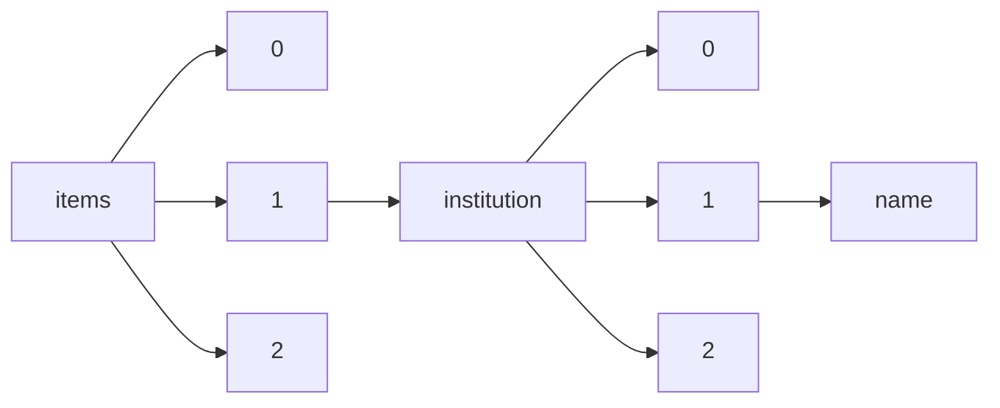

!!! warning "This document is not official Crossref documentation"
# Name
PATH = items/array/institution/array/name(1)  
Occurs 4 430 136 times  
Unique values: > 999  
{ .annotate }

1. A route to an element, for example:  
   The route "items/array/institution/array/name" corresponds to navigating through the JSON indices as  
   ["items"][0]["institution"][0]["name"]  

!!! note "Due to current limitations, only the first 1,000 unique values are counted."

| **Row** | **Value** `String`                                                                                | **Count** `Int64` |
|--------:|-----------------------------------------------------------------------------------------------------:|---------------------:|
| **1**   | Koninklijke Brill NV                                                                                 | 788 879              |
| **2**   | Stanford University                                                                                  | 461 915              |
| **3**   | American Psychological Association                                                                   | 421 060              |
| **4**   | Research Square                                                                                      | 231 145              |
| **5**   | International Union for Conservation of Nature                                                       | 201 830              |
| **6**   | bioRxiv                                                                                              | 189 378              |
| **7**   | Universidade de São Paulo                                                                            | 111 709              |
| **8**   | NamesforLife, LLC                                                                                    | 95 718               |
| **9**   | Universidade Estadual de Campinas                                                                    | 54 960               |
| **10**  | US Dept of the Army                                                                                  | 50 190               |
| **11**  | American Association for Cancer Research                                                             | 49 828               |
| **12**  | USDOE                                                                                                | 44 531               |
| **13**  | Not Available                                                                                        | 42 091               |
| **14**  | medRxiv                                                                                              | 40 846               |
| **15**  | USDOE, Washington, DC (United States)                                                                | 35 992               |
| **16**  | US Dept of the Air Force                                                                             | 35 844               |
| **17**  | Authorea, Inc.                                                                                       | 31 634               |
| **18**  | National Bureau of Economic Research                                                                 | 31 529               |
| **19**  | US Dept of the Navy                                                                                  | 30 768               |
| **20**  | European Space Agency                                                                                | 28 412               |
| **21**  | The University of Hong Kong                                                                          | 27 725               |
| **22**  | Iowa State University, Digital Repository                                                            | 23 702               |
| **23**  | ISRCTN                                                                                               | 23 137               |
| **24**  | Oak Ridge National Laboratory (ORNL)                                                                 | 21 827               |
| **25**  | PONTIFÍCIA UNIVERSIDADE CATÓLICA DO RIO DE JANEIRO                                                   | 21 191               |
| **26**  | National Energy Technology Laboratory                                                                | 19 760               |
| **27**  | Historical Energy Database (United States)                                                           | 18 615               |
| **28**  | Los Alamos National Laboratory (LANL)                                                                | 18 485               |
| **29**  | American Economic Association                                                                        | 18 269               |
| **30**  | Inter-university Consortium for Political and Social Research                                        | 17 900               |
| **31**  | Chicago Operations Office                                                                            | 16 906               |
| **32**  | Sandia National Laboratories (SNL)                                                                   | 16 824               |
| **33**  | Lawrence Livermore National Laboratory (LLNL)                                                        | 16 442               |
| **34**  | SciVee                                                                                               | 16 024               |
| **35**  | Carleton University                                                                                  | 15 380               |
| **36**  | Pacific Northwest National Laboratory (PNNL)                                                         | 14 863               |
| **37**  | MorphoSource                                                                                         | 14 611               |
| **38**  | OSD or Non-Service DoD Agency                                                                        | 13 530               |
| **39**  | Earth and Space Science Open Archive                                                                 | 13 103               |
| **40**  | Technical Information Center                                                                         | 12 436               |
| **41**  | The University of Queensland                                                                         | 12 328               |
| **42**  | Argonne National Laboratory (ANL)                                                                    | 11 568               |
| **43**  | The Hong Kong University of Science and Technology                                                   | 11 508               |
| **44**  | National Bureau of Standards                                                                         | 11 454               |
| **45**  | Louisiana State University and Agricultural and Mechanical College                                   | 11 438               |
| **46**  | Hanford Site (HNF)                                                                                   | 10 232               |
| **47**  | USDOE National Nuclear Security Administration (NNSA)                                                | 10 231               |
| **48**  | TechRxiv                                                                                             | 9 851                |
| **49**  | Georg-August-University Göttingen                                                                    | 9 697                |
| **50**  | McGraw-Hill Education                                                                                | 9 483                |
| **51**  | US Department of Energy (US)                                                                         | 9 459                |
| **52**  | Universidade Federal de Uberlândia                                                                   | 9 404                |
| **53**  | Toronto Metropolitan University                                                                      | 9 117                |
| **54**  | West Virginia University Libraries                                                                   | 8 859                |
| **55**  | Divison of Technical Information Extension                                                           | 8 854                |
| **56**  | Savannah River Site (SRS)                                                                            | 8 825                |
| **57**  | National Institute of Standards and Technology                                                       | 8 638                |
| **58**  | National Renewable Energy Laboratory (NREL)                                                          | 8 609                |
| **59**  | Portland State University                                                                            | 8 321                |
| **60**  | Nanyang Technological University                                                                     | 8 253                |
| **61**  | Universidade de Brasília                                                                             | 8 141                |
| **62**  | Brookhaven National Laboratory (BNL)                                                                 | 8 135                |
| **63**  | Lawrence Berkeley National Laboratory (LBNL)                                                         | 7 946                |
| **64**  | Open Access Te Herenga Waka-Victoria University of Wellington                                        | 7 791                |
| **65**  | Louisiana State University and Agricultural & Mechanical College                                     | 7 789                |
| **66**  | DOE; USDOE, Washington, DC (United States)                                                           | 7 711                |
| **67**  | University of Iowa                                                                                   | 7 693                |
| **68**  | University of Missouri--Columbia                                                                     | 7 416                |
| **69**  | Reserve Bank of Australia                                                                            | 7 013                |
| **70**  | Open Access Victoria University of Wellington \| Te Herenga Waka                                     | 6 699                |
| **71**  | San Jose State University                                                                            | 6 691                |
| **72**  | US Atomic Energy Commission (AEC)                                                                    | 6 232                |
| **73**  | maastricht university                                                                                | 6 025                |
| **74**  | Universidad Nacional de La Plata                                                                     | 5 884                |
| **75**  | Oxford University Press                                                                              | 5 861                |
| **76**  | Drexel University                                                                                    | 5 824                |
| **77**  | Northeastern University                                                                              | 5 800                |
| **78**  | Office of Scientific and Technical Information                                                       | 5 640                |
| **79**  | Pontificia Universidad Javeriana                                                                     | 5 480                |
| **80**  | Universidad Politécnica de Madrid                                                                    | 5 121                |
| **81**  | SLAC National Accelerator Laboratory (SLAC)                                                          | 4 887                |
| **82**  | Universitat Politècnica de València                                                                  | 4 844                |
| **83**  | Εθνικό και Καποδιστριακό Πανεπιστήμιο Αθηνών (ΕΚΠΑ)                                                  | 4 833                |
| **84**  | Sandia National Laboratories (SNL-NM), Albuquerque, NM (United States)                               | 4 667                |
| **85**  | University of Virginia                                                                               | 4 579                |
| **86**  | Fermi National Accelerator  Laboratory (FNAL)                                                        | 4 283                |
| **87**  | Wolfram Research, Inc.                                                                               | 4 239                |
| **88**  | Office of Naval Research                                                                             | 4 192                |
| **89**  | University of Louisville                                                                             | 4 158                |
| **90**  | Florida International University                                                                     | 4 079                |
| **91**  | USDOE Office of Science (SC)                                                                         | 3 972                |
| **92**  | Inter-American Development Bank                                                                      | 3 817                |
| **93**  | USDOE Office of Science (SC), High Energy Physics (HEP) (SC-25)                                      | 3 657                |
| **94**  | University of Rhode Island                                                                           | 3 577                |
| **95**  | Universidad Autónoma Metropolitana Unidad Iztapalapa                                                 | 3 472                |
| **96**  | Golden Field Office                                                                                  | 3 394                |
| **97**  | Westinghouse Hanford Co., Richland, WA (United States)                                               | 3 391                |
| **98**  | Oakland Operations Office                                                                            | 3 290                |
| **99**  | Universidad de Salamanca                                                                             | 3 288                |
| **100** | USDOE Office of Environmental Restoration and Waste Management, Washington, DC (United States)       | 3 253                |
| **101** | University of Twente                                                                                 | 3 219                |
| **102** | Wesleyan University                                                                                  | 3 184                |
| **103** | AARP                                                                                                 | 3 171                |
| **104** | Princeton Plasma Physics Laboratory (PPPL)                                                           | 3 153                |
| **105** | Fort Hays State University                                                                           | 3 143                |
| **106** | Idaho National Laboratory                                                                            | 3 074                |
| **107** | Lawrence Livermore National Laboratory (LLNL), Livermore, CA                                         | 3 042                |
| **108** | Stanford Linear Accelerator Center, Menlo Park, CA (US)                                              | 2 942                |
| **109** | Los Alamos National Laboratory (LANL), Los Alamos, NM (United States)                                | 2 794                |
| **110** | Durban University of Technology                                                                      | 2 781                |
| **111** | Idaho National Engineering and Environmental Laboratory                                              | 2 781                |
| **112** | (US)                                                                                                 | 2 769                |
| **113** | USDOE Office of Energy Research (ER) (US)                                                            | 2 764                |
| **114** | Queensland University of Technology                                                                  | 2 733                |
| **115** | Sandia National Laboratories                                                                         | 2 722                |
| **116** | Michigan Technological University                                                                    | 2 661                |
| **117** | Iowa State University                                                                                | 2 623                |
| **118** | Bonneville Power Administration (BPA)                                                                | 2 575                |
| **119** | National Institute of Environmental Health and Safety                                                | 2 574                |
| **120** | USDOE Office of Energy Efficiency and Renewable Energy (EERE)                                        | 2 552                |
| **121** | USDOE Office of Energy Research, Washington, DC (United States)                                      | 2 525                |
| **122** | USDOE Office of Nuclear Energy (NE)                                                                  | 2 484                |
| **123** | DOE/ER                                                                                               | 2 455                |
| **124** | ARMY WAR COLL  CARLISLE BARRACKS PA                                                                  | 2 408                |
| **125** | Division of Technical Information Extension                                                          | 2 400                |
| **126** | Idaho Operations Office                                                                              | 2 375                |
| **127** | Instituto Chico Mendes de Conservação da Biodiversidade - ICMBio                                     | 2 364                |
| **128** | DOE                                                                                                  | 2 307                |
| **129** | EERE Publication and Product Library                                                                 | 2 285                |
| **130** | Richland Operations Office                                                                           | 2 255                |
| **131** | University of Groningen                                                                              | 2 250                |
| **132** | California Polytechnic State University                                                              | 2 245                |
| **133** | Harvard University                                                                                   | 2 229                |
| **134** | University of Northern British Columbia                                                              | 2 204                |
| **135** | Fermi National Accelerator Laboratory (FNAL)                                                         | 2 145                |
| **136** | Αριστοτέλειο Πανεπιστήμιο Θεσσαλονίκης (ΑΠΘ)                                                         | 2 118                |
| **137** | Oak Ridge Operations                                                                                 | 2 100                |
| **138** | The IFS                                                                                              | 2 076                |
| **139** | General Electric Co., Richland, WA (United States). Hanford Atomic Products Operation                | 2 048                |
| **140** | USDOE Office of Environmental Management (EM)                                                        | 2 038                |
| **141** | Universidad de Valladolid                                                                            | 2 036                |
| **142** | Szegedi Tudományegyetem                                                                              | 1 997                |
| **143** | Wageningen University                                                                                | 1 992                |
| **144** | USDOE Office of Science (US)                                                                         | 1 966                |
| **145** | USDOE SC OFFICE OF SCIENCE (SC)                                                                      | 1 965                |
| **146** | Geological Society of America                                                                        | 1 957                |
| **147** | Dartmouth College                                                                                    | 1 956                |
| **148** | Review Commons                                                                                       | 1 935                |
| **149** | ARMY WAR COLL CARLISLE BARRACKS PA                                                                   | 1 835                |
| **150** | ScienceOpen                                                                                          | 1 786                |
| **151** | UniversidadeEstadualdeCampinas                                                                       | 1 776                |
| **152** | American Diabetes Association                                                                        | 1 753                |
| **153** | Signaling Pathways Project                                                                           | 1 732                |
| **154** | Banco de la República                                                                                | 1 719                |
| **155** | Historical Energy Database                                                                           | 1 698                |
| **156** | Ryerson University                                                                                   | 1 673                |
| **157** | Asian Development Bank                                                                               | 1 660                |
| **158** | USDOE Assistant Secretary for Fossil Energy, Washington, DC (United States)                          | 1 632                |
| **159** | MorphoBank                                                                                           | 1 626                |
| **160** | Washington Procurement Operations Office                                                             | 1 621                |
| **161** | Lawrence Livermore National Laboratory (LLNL), Livermore, CA (United States)                         | 1 613                |
| **162** | University of San Diego                                                                              | 1 563                |
| **163** | Illinois State University                                                                            | 1 534                |
| **164** | Yucca Mountain Project                                                                               | 1 531                |
| **165** | Universidad de Lima                                                                                  | 1 520                |
| **166** | Eötvös Loránd Tudományegyetem                                                                        | 1 510                |
| **167** | Utrecht University                                                                                   | 1 487                |
| **168** | USDOE Office of Fossil Energy (FE)                                                                   | 1 460                |
| **169** | USDOE Office of Energy Efficiency and Renewable Energy Geothermal Tech Pgm                           | 1 411                |
| **170** | Lebanese American University                                                                         | 1 401                |
| **171** | ASTM International                                                                                   | 1 356                |
| **172** | Εθνικό και Καποδιστριακό Πανεπιστήμιο Αθηνών (ΕΚΠΑ), Σχολή Επιστημών Υγείας, Τμήμα Ιατρικής          | 1 350                |
| **173** | Oak Ridge National Laboratory (ORNL), Oak Ridge, TN (United States)                                  | 1 348                |
| **174** | SRS                                                                                                  | 1 340                |
| **175** | DOE/LANL                                                                                             | 1 339                |
| **176** | Nuclear Regulatory Commission, Washington, DC (United States)                                        | 1 323                |
| **177** | Ames Laboratory (AMES)                                                                               | 1 323                |
| **178** | US Energy Research and Development Administration (ERDA)                                             | 1 308                |
| **179** | Environmental Sciences Division, Oak Ridge National Laboratory                                       | 1 284                |
| **180** | Patricia Seybold Group                                                                               | 1 278                |
| **181** | USDOE Office of Environmental Management (EM) (US)                                                   | 1 276                |
| **182** | Lawrence Livermore National Lab. (LLNL), Livermore, CA (United States)                               | 1 249                |
| **183** | Idaho National Laboratory (United States)                                                            | 1 247                |
| **184** | DOE/DP                                                                                               | 1 246                |
| **185** | Global Change Research Data Publishing and Repository                                                | 1 236                |
| **186** | ARMY COMMAND AND GENERAL STAFF COLL FORT LEAVENWORTH KS SCHOOL OF ADVANCED MILITARY STUDIES          | 1 224                |
| **187** | Science Data Bank                                                                                    | 1 197                |
| **188** | Albuquerque Operations Office                                                                        | 1 192                |
| **189** | Federal Reserve Bank of St. Louis                                                                    | 1 171                |
| **190** | Universidad de León                                                                                  | 1 150                |
| **191** | ENVIRONMENTAL MANAGEMENT (US)                                                                        | 1 124                |
| **192** | Universidad Científica del Sur                                                                       | 1 103                |
| **193** | National Renewable Energy Laboratory (NREL), Golden, CO (United States)                              | 1 082                |
| **194** | Joint Highway Research Project                                                                       | 1 076                |
| **195** | Oak Ridge Y-12 Plant (Y-12)                                                                          | 1 065                |
| **196** | NAVAL RESEARCH LAB WASHINGTON DC                                                                     | 1 056                |
| **197** | DOE - NE                                                                                             | 1 053                |
| **198** | Servicio Geológico Colombiano                                                                        | 1 046                |
| **199** | USDOE Office of Science (SC), Basic Energy Sciences (BES) (SC-22)                                    | 1 046                |
| **200** | Universidad Peruana de Ciencias Aplicadas (UPC)                                                      | 1 042                |
| **201** | USDOE Assistant Secretary for Energy Efficiency and Renewable Energy, Washington, DC (United States) | 1 030                |
| **202** | DOE/FE                                                                                               | 1 026                |
| **203** | Boise State University                                                                               | 1 024                |
| **204** | Pacific Northwest National Laboratory (PNNL), Richland, WA (United States)                           | 1 015                |
| **205** | Federal Reserve Bank of Cleveland                                                                    | 992                  |
| **206** | Los Alamos Scientific Lab., N. Mex.                                                                  | 978                  |
| **207** | International Centre for Integrated Mountain Development (ICIMOD)                                    | 971                  |
| **208** | National Energy Technology Laboratory - In-house Research                                            | 932                  |
| **209** | Advance                                                                                              | 928                  |
| **210** | Universidade Federal de Juiz de Fora                                                                 | 924                  |
| **211** | Sociedad Latina de Comunicación Social                                                               | 902                  |
| **212** | Universidad Pontificia de Salamanca                                                                  | 885                  |
| **213** | U.S. Army Medical Research Material Command                                                          | 871                  |
| **214** | Dallas Theological Seminary                                                                          | 867                  |
| **215** | Oak Ridge National Lab., TN (USA)                                                                    | 866                  |
| **216** | Westinghouse Electric Corp., Pittsburgh, Pa. (USA). Astronuclear Lab.                                | 864                  |
| **217** | Los Alamos Scientific Lab., N.Mex. (USA)                                                             | 848                  |
| **218** | General Atomics Site                                                                                 | 836                  |
| **219** | EG and G Idaho, Inc., Idaho Falls, ID (United States)                                                | 829                  |
| **220** | Universitat Jaume I                                                                                  | 825                  |
| **221** | Knolls Atomic Power Laboratory (KAPL)                                                                | 812                  |
| **222** | ARMY BALLISTIC RESEARCH LAB ABERDEEN PROVING GROUND MD                                               | 807                  |
| **223** | Fermi National Accelerator Laboratory (FNAL), Batavia, IL (United States)                            | 805                  |
| **224** | Centre for Microdata Methods and Practice (cemmap)                                                   | 804                  |
| **225** | Federal Reserve Bank of Philadelphia                                                                 | 801                  |
| **226** | Universidad de Granada                                                                               | 784                  |
| **227** | DOE/NE                                                                                               | 776                  |
| **228** | USDOE Office of Energy Efficiency and Renewable Energy (EERE), Building Technologies Office (EE-5B)  | 773                  |
| **229** | Oak Ridge Office                                                                                     | 766                  |
| **230** | Nevada Operations Office                                                                             | 764                  |
| **231** | Universidade Federal de Viçosa                                                                       | 750                  |
| **232** | Universidad Autónoma Metropolitana                                                                   | 740                  |
| **233** | USDOE Office of Environmental Management Science Program (United States)                             | 732                  |
| **234** | Universidad Peruana de Ciencias Aplicadas                                                            | 732                  |
| **235** | University of Belgrade                                                                               | 716                  |
| **236** | NAVAL POSTGRADUATE SCHOOL MONTEREY CA                                                                | 715                  |
| **237** | MASSACHUSETTS INST OF TECH LEXINGTON LINCOLN LAB                                                     | 702                  |
| **238** | AIR COMMAND AND STAFF COLL MAXWELL AFB AL                                                            | 700                  |
| **239** | Universidad de Burgos                                                                                | 696                  |
| **240** | San Francisco State University                                                                       | 692                  |
| **241** | NAVAL WAR COLL  NEWPORT RI                                                                           | 691                  |
| **242** | Trinity Evangelical Divinity School                                                                  | 675                  |
| **243** | University of Tennessee Health Science Center                                                        | 668                  |
| **244** | Stanford Linear Accelerator Center (SLAC)                                                            | 661                  |
| **245** | Federal Energy Technology Center, Morgantown, WV (US)                                                | 659                  |
| **246** | Association for Child and Adolescent Mental Health                                                   | 659                  |
| **247** | Los Alamos Scientific Lab., NM (USA)                                                                 | 657                  |
| **248** | Federal Energy Technology Center, Pittsburgh, PA (US)                                                | 654                  |
| **249** | INSTITUTE FOR DEFENSE ANALYSES ALEXANDRIA VA                                                         | 646                  |
| **250** | Idaho National Laboratory (INL), Idaho Falls, ID (United States)                                     | 636                  |
| **251** | National Nanomanufacturing Network                                                                   | 629                  |
| **252** | Sandia National Labs., Albuquerque, NM (US)                                                          | 617                  |
| **253** | Joint Transportation Research Program                                                                | 612                  |
| **254** | Nuclear Receptor Signaling Atlas                                                                     | 612                  |
| **255** | The Royal Society of Chemistry                                                                       | 611                  |
| **256** | University of Southampton                                                                            | 610                  |
| **257** | Sandia National Labs., Livermore, CA (US)                                                            | 600                  |
| **258** | UNESP - UNIV ESTADUAL PAULISTA                                                                       | 598                  |
| **259** | USDOE - Office of Science (SC)                                                                       | 597                  |
| **260** | DOE/CE                                                                                               | 596                  |
| **261** | USDOE Office of Environmental Management Science Program                                             | 591                  |
| **262** | USDOE Office of Defense Programs (DP) (US)                                                           | 591                  |
| **263** | USDOE Office of Science (SC), Nuclear Physics (NP) (SC-26)                                           | 587                  |
| **264** | U.S. Department of Agriculture                                                                       | 587                  |
| **265** | Swansea University                                                                                   | 587                  |
| **266** | Fluor Daniel Hanford Inc., Richland, WA (United States)                                              | 586                  |
| **267** | NAVAL WAR COLL NEWPORT RI JOINT MILITARY OPERATIONS DEPT                                             | 568                  |
| **268** | Andrews University                                                                                   | 568                  |
| **269** | Sandia National Laboratories (SNL-CA), Livermore, CA (United States)                                 | 567                  |
| **270** | Argonne National Laboratory (ANL), Argonne, IL (United States)                                       | 565                  |
| **271** | SC                                                                                                   | 561                  |
| **272** | NAVAL WAR COLL  NEWPORT RI JOINT MILITARY OPERATIONS DEPT                                            | 558                  |
| **273** | Ames Lab., Ames, IA (United States)                                                                  | 556                  |
| **274** | FH (US)                                                                                              | 554                  |
| **275** | US Marine Corps                                                                                      | 550                  |
| **276** | CARNEGIE-MELLON UNIV PITTSBURGH PA SOFTWARE ENGINEERING INST                                         | 544                  |
| **277** | Oak Ridge Gaseous Diffusion Plant (K-25)                                                             | 540                  |
| **278** | Hanford Works, Richland, WA (United States)                                                          | 539                  |
| **279** | USDOE Office of Energy Efficiency and Renewable Energy (EERE), Solar Energy Technologies Office (EE- | 539                  |
| **280** | USDOE Office of Energy Research (ER)                                                                 | 538                  |
| **281** | USDOE Laboratory Directed Research and Development (LDRD) Program                                    | 535                  |
| **282** | NETL                                                                                                 | 528                  |
| **283** | Sandia National Labs., Albuquerque, NM (USA)                                                         | 523                  |
| **284** | Institut fuer Technologiefolgenabschaetzung der OEAW                                                 | 521                  |
| **285** | FE                                                                                                   | 518                  |
| **286** | Savannah River Site (SRS), Aiken, SC (United States)                                                 | 513                  |
| **287** | NAVAL RESEARCH LAB  WASHINGTON DC                                                                    | 513                  |
| **288** | Thomas Jefferson National Accelerator Facility                                                       | 512                  |
| **289** | ARMY WAR COLL STRATEGIC STUDIES INST CARLISLE BARRACKS PA                                            | 511                  |
| **290** | NATIONAL WAR COLL WASHINGTON DC                                                                      | 506                  |
| **291** | ARMY RESEARCH INST FOR THE BEHAVIORAL AND SOCIAL SCIENCES ALEXANDRIA VA                              | 504                  |
| **292** | Sheffield Hallam University                                                                          | 504                  |
| **293** | Gordon Conwell Theological Seminary                                                                  | 500                  |
| **294** | International Initiative for Impact Evaluation (3ie)                                                 | 495                  |
| **295** | Mekong River Commission                                                                              | 493                  |
| **296** | Whitaker Instiutute                                                                                  | 492                  |
| **297** | Dirección General Marítima                                                                           | 491                  |
| **298** | Dominican University of California                                                                   | 490                  |
| **299** | USDOE Assistant Secretary for Human Resources and Administration, Washington, DC (United States)     | 489                  |
| **300** | ESRC Centre for the Microeconomic Analysis of Public Policy (CPP) at IFS                             | 489                  |
| **301** | Air Force Office of Scientific Research                                                              | 488                  |
| **302** | Universidad Politécnica de Cartagena                                                                 | 486                  |
| **303** | Oak Ridge Institute for Science and Education (ORISE)                                                | 485                  |
| **304** | USDOE Office of Fossil Energy (FE) (US)                                                              | 480                  |
| **305** | USDOE Office of Science (SC), Biological and Environmental Research (BER) (SC-23)                    | 479                  |
| **306** | Radiomatix                                                                                           | 477                  |
| **307** | Sandia Labs., Albuquerque, NM (USA)                                                                  | 476                  |
| **308** | Savannah River National Lab (SRNL), Aiken, SC (United States)                                        | 475                  |
| **309** | W.E. Upjohn Institute                                                                                | 475                  |
| **310** | Universidad San Ignacio de Loyola                                                                    | 473                  |
| **311** | Department of Defense, Washington, DC (United States)                                                | 473                  |
| **312** | Originating Research Org. not identified                                                             | 472                  |
| **313** | ARMY RESEARCH LAB  ABERDEEN PROVING GROUND MD                                                        | 471                  |
| **314** | Lawrence Berkeley National Laboratory (LBNL), Berkeley, CA (United States)                           | 468                  |
| **315** | University of New Hampshire                                                                          | 465                  |
| **316** | Solar Energy Research Inst., Golden, CO (USA)                                                        | 459                  |
| **317** | Latin American Public Opinion Project                                                                | 458                  |
| **318** | Sandia Corp., Albuquerque, N. Mex.                                                                   | 458                  |
| **319** | Williams College                                                                                     | 448                  |
| **320** | EMBL-EBI                                                                                             | 437                  |
| **321** | Centro Universitário FEI                                                                             | 434                  |
| **322** | ARNOLD ENGINEERING DEVELOPMENT CENTER ARNOLD AFB TN                                                  | 421                  |
| **323** | DOE Office of Science Atmospheric Radiation Measurement (ARM) Program (United States)                | 412                  |
| **324** | Waste Isolation Pilot Plant (WIPP)                                                                   | 409                  |
| **325** | Corporación colombiana de investigación agropecuaria                                                 | 408                  |
| **326** | University of Redlands                                                                               | 406                  |
| **327** | Environmental Energy Technologies Division                                                           | 404                  |
| **328** | Chapman University                                                                                   | 403                  |
| **329** | National Petroleum Technology Office (NPTO)                                                          | 402                  |
| **330** | Goethe-Universität Frankfurt am Main                                                                 | 398                  |
| **331** | Corvinus University of Budapest                                                                      | 397                  |
| **332** | Stanford Linear Accelerator Center (SLAC), Menlo Park, CA                                            | 397                  |
| **333** | DOE Office of Science                                                                                | 396                  |
| **334** | Optica Open                                                                                          | 393                  |
| **335** | EG and G Idaho, Inc., Idaho Falls (USA)                                                              | 393                  |
| **336** | Lawrence Berkeley National Laboratory                                                                | 388                  |
| **337** | UNU-WIDER                                                                                            | 384                  |
| **338** | Argonne National Lab., IL (USA)                                                                      | 382                  |
| **339** | National Park Service                                                                                | 381                  |
| **340** | NAVAL ORDNANCE LAB WHITE OAK MD                                                                      | 381                  |
| **341** | Fluor Daniel Hanford, Inc., Richland, WA (United States)                                             | 380                  |
| **342** | Rhode Island College                                                                                 | 379                  |
| **343** | USDOE Energy Information Administration, Washington, DC (United States)                              | 378                  |
| **344** | AIR WAR COLL MAXWELL AFB AL                                                                          | 375                  |
| **345** | Ames Lab., IA (USA)                                                                                  | 374                  |
| **346** | Universitat de Lleida                                                                                | 374                  |
| **347** | University of Sri Jayawardenepura                                                                    | 371                  |
| **348** | MITRE CORP BEDFORD MA                                                                                | 369                  |
| **349** | Catholic Theological Union                                                                           | 367                  |
| **350** | US DOE Office of Environmental Management (US)                                                       | 366                  |
| **351** | USDOE Assistant Secretary for Environment, Safety, and Health, Washington, DC (United States)        | 366                  |
| **352** | Front Matter                                                                                         | 363                  |
| **353** | USDOE Assistant Secretary for Nuclear Energy, Washington, DC (United States)                         | 363                  |
| **354** | CHG (US)                                                                                             | 360                  |
| **355** | USDOE Office of Science (SC), High Energy Physics (HEP)                                              | 359                  |
| **356** | DOE/EH                                                                                               | 359                  |
| **357** | Oak Ridge National Laboratory                                                                        | 357                  |
| **358** | NAVAL HEALTH RESEARCH CENTER SAN DIEGO CA                                                            | 356                  |
| **359** | LAU                                                                                                  | 355                  |
| **360** | USDOE Office of Science (SC) (US)                                                                    | 352                  |
| **361** | WOODS HOLE OCEANOGRAPHIC INSTITUTION MA                                                              | 349                  |
| **362** | ARMY WAR COLLEGE CARLISLE BARRACKS PA                                                                | 349                  |
| **363** | DEPARTMENT OF THE ARMY WASHINGTON DC                                                                 | 348                  |
| **364** | WASHINGTON UNIV SEATTLE APPLIED PHYSICS LAB                                                          | 345                  |
| **365** | Lockheed Idaho Technologies Co., Idaho Falls, ID (United States)                                     | 343                  |
| **366** | Korean Society of Neurotherapy                                                                       | 342                  |
| **367** | USDOE Office of Science (SC), Biological and Environmental Research (BER)                            | 340                  |
| **368** | NRC                                                                                                  | 336                  |
| **369** | LDRD                                                                                                 | 334                  |
| **370** | Vilnius University                                                                                   | 331                  |
| **371** | Banco de la República de Colombia                                                                    | 331                  |
| **372** | ORNL                                                                                                 | 330                  |
| **373** | USDOE Office of Environmental Management (EM), Office of Science and Risk Policy                     | 330                  |
| **374** | DOE; USDOE, Washington, DC (USA)                                                                     | 325                  |
| **375** | CARNEGIE-MELLON UNIV  PITTSBURGH PA SOFTWARE ENGINEERING INST                                        | 325                  |
| **376** | Douglas United Nuclear, Inc., Richland, WA (United States)                                           | 325                  |
| **377** | USDOE Office of ES&H                                                                                 | 323                  |
| **378** | USDOE Office of Science (SC), Advanced Scientific Computing Research (ASCR) (SC-21)                  | 320                  |
| **379** | WISCONSIN UNIV-MADISON MATHEMATICS RESEARCH CENTER                                                   | 320                  |
| **380** | Atomics International, Canoga Park, Calif.                                                           | 317                  |
| **381** | DEPARTMENT OF THE AIR FORCE WASHINGTON DC                                                            | 316                  |
| **382** | Aerojet-General Corp., Sacramento, Calif. (USA)                                                      | 316                  |
| **383** | Catholic University of America                                                                       | 315                  |
| **384** | MASSACHUSETTS INST OF TECH  LEXINGTON LINCOLN LAB                                                    | 315                  |
| **385** | USDOE Office of Science (SC) (United States)                                                         | 314                  |
| **386** | Savannah River Operations Office                                                                     | 313                  |
| **387** | comp.                                                                                                | 309                  |
| **388** | NAVAL CIVIL ENGINEERING LAB PORT HUENEME CA                                                          | 307                  |
| **389** | USDOE Office of Energy Efficiency and Renewable Energy (EE) (US)                                     | 306                  |
| **390** | NAVAL SUBMARINE MEDICAL RESEARCH LAB GROTON CT                                                       | 304                  |
| **391** | Bechtel Nevada Corporation (BNC)                                                                     | 303                  |
| **392** | US Army Research Office                                                                              | 302                  |
| **393** | USDOE Office of Defense Programs (DP)                                                                | 301                  |
| **394** | HUMAN RESOURCES RESEARCH ORGANIZATION ALEXANDRIA VA                                                  | 299                  |
| **395** | ARMY RESEARCH LAB ABERDEEN PROVING GROUND MD WEAPONS AND MATERIALS RESEARCH DIRECTORATE              | 296                  |
| **396** | Battelle Memorial Inst., Columbus, Ohio                                                              | 291                  |
| **397** | Hanford Works, Richland, WA (USA)                                                                    | 291                  |
| **398** | ARPHA Preprints                                                                                      | 290                  |
| **399** | USAEC                                                                                                | 290                  |
| **400** | Εθνικό και Καποδιστριακό Πανεπιστήμιο Αθηνών (ΕΚΠΑ), Σχολή Θετικών Επιστημών, Τμήμα Χημείας          | 289                  |
| **401** | Kansas City Plant (KCP)                                                                              | 289                  |
| **402** | Brookhaven National Laboratory (BNL), Upton, NY (United States)                                      | 288                  |
| **403** | Institute of Geography Russian Academy of Sciences                                                   | 287                  |
| **404** | Lawrence Livermore National Lab., Livermore, CA (US)                                                 | 286                  |
| **405** | MICHIGAN UNIV ANN ARBOR                                                                              | 285                  |
| **406** | Sandia Labs., Albuquerque, N.Mex. (USA)                                                              | 284                  |
| **407** | AEC                                                                                                  | 283                  |
| **408** | USDOE - Office of Energy Efficiency and Renewable Energy (EE)                                        | 281                  |
| **409** | California Univ., Berkeley, CA (US). Lawrence Radiation Lab.                                         | 279                  |
| **410** | Federal Energy Technology Center, Morgantown, WV, and Pittsburgh, PA                                 | 279                  |
| **411** | IEA Solar Heating and Cooling Programme                                                              | 279                  |
| **412** | Public Health Scotland                                                                               | 274                  |
| **413** | MASSACHUSETTS INST OF TECH CAMBRIDGE                                                                 | 272                  |
| **414** | USDOE; USDOE Office of Science (SC)                                                                  | 272                  |
| **415** | Office of Scientific and Technical Information, Oak Ridge, TN                                        | 272                  |
| **416** | University of Sri Jayewardenepura                                                                    | 271                  |
| **417** | Lawrence Livermore National Lab., CA (USA)                                                           | 271                  |
| **418** | USDOE Office of Energy Efficiency and Renewable Energy (EERE), Bioenergy Technologies Office (EE-3B) | 270                  |
| **419** | agentschap Onroerend Erfgoed                                                                         | 270                  |
| **420** | EE USDOE - Office of Energy Efficiency and Renewable Energy (EE)                                     | 269                  |
| **421** | USDOE Office of Energy Efficiency and Renewable Energy (EERE), Renewable Power Office. Solar Energy  | 269                  |
| **422** | Jet Propulsion Lab., Pasadena, CA (USA)                                                              | 268                  |
| **423** | ARMY BIOLOGICAL LABS  FREDERICK MD                                                                   | 266                  |
| **424** | Nordic Council of Ministers                                                                          | 265                  |
| **425** | Motu Economic and Public Policy Research                                                             | 264                  |
| **426** | Hanford Engineering Development Lab., Richland, WA (USA)                                             | 263                  |
| **427** | Rīgas Stradiņa universitāte                                                                          | 262                  |
| **428** | National Energy Technology Laboratory (NETL), Pittsburgh, PA, Morgantown, WV, and Albany, OR (United | 261                  |
| **429** | Bettis Atomic Power Laboratory (BAPL)                                                                | 261                  |
| **430** | Western Conservative Baptist Seminary                                                                | 260                  |
| **431** | International Centre for Trade and Sustainable Development                                           | 259                  |
| **432** | STANFORD RESEARCH INST MENLO PARK CA                                                                 | 258                  |
| **433** | USDOE Office of Energy Efficiency and Renewable Energy (EERE), Building Technologies Office (EE-5B)  | 257                  |
| **434** | Linköping University                                                                                 | 257                  |
| **435** | USDOE Office of Energy Efficiency and Renewable Energy (EERE), Vehicle Technologies Office (EE-3V)   | 253                  |
| **436** | U.S. Army Research Office                                                                            | 248                  |
| **437** | Πανεπιστήμιο Πατρών, Σχολή Επιστημών Υγείας, Τμήμα Ιατρικής                                          | 247                  |
| **438** | MARINE CORPS COMMAND AND STAFF COLL QUANTICO VA                                                      | 246                  |
| **439** | SCRIPPS INSTITUTION OF OCEANOGRAPHY LA JOLLA CA                                                      | 245                  |
| **440** | ARMY RESEARCH INST FOR THE BEHAVIORAL AND SOCIAL SCIENCES  ALEXANDRIA VA                             | 243                  |
| **441** | Southwestern Baptist Theological Seminary                                                            | 242                  |
| **442** | Illinois Dept. of Energy and Natural Resources, Springfield, IL (United States)                      | 241                  |
| **443** | Atmospheric Radiation Measurement (ARM) Archive                                                      | 239                  |
| **444** | Ames Lab., IA (United States)                                                                        | 239                  |
| **445** | Πανεπιστήμιο Κρήτης, Σχολή Επιστημών Υγείας, Τμήμα Ιατρικής                                          | 239                  |
| **446** | Secretar�a de Ambiente y Desarrollo Sustentable                                                      | 238                  |
| **447** | Sociedad Argentina para el Estudio de los Mam�feros                                                  | 238                  |
| **448** | USDOE National Nuclear Security Administration (NNSA), Office of Defense Nuclear Nonproliferation (N | 238                  |
| **449** | University of Missouri                                                                               | 238                  |
| **450** | USDOE Assistant Secretary for Environmental Management (EM)                                          | 237                  |
| **451** | Institute of Chemical Research of Catalonia                                                          | 237                  |
| **452** | Sociedad Mexicana de Ingeniería Biomédica, A.C.                                                      | 235                  |
| **453** | USDOE Office of Science (SC), Fusion Energy Sciences (FES) (SC-24)                                   | 235                  |
| **454** | Denver Conservative Baptist Seminary                                                                 | 234                  |
| **455** | USDOE - Office of Energy Research (ER)                                                               | 232                  |
| **456** | National Center for Transit Research                                                                 | 231                  |
| **457** | NAVAL POSTGRADUATE SCHOOL MONTEREY CA GRADUATE SCHOOL OF BUSINESS AND PUBLIC POLICY                  | 230                  |
| **458** | USDOE Office of Energy Efficiency and Renewable Energy (EERE), Wind and Water Technologies Office (E | 230                  |
| **459** | Aalborg University                                                                                   | 230                  |
| **460** | OHIO STATE UNIV RESEARCH FOUNDATION COLUMBUS                                                         | 227                  |
| **461** | Rocky Flats Environmental Technology Site (RFP)                                                      | 225                  |
| **462** | USDOE - Office of Environmental Management (EM)                                                      | 224                  |
| **463** | ARMY ENGINEER WATERWAYS EXPERIMENT STATION VICKSBURG MS                                              | 221                  |
| **464** | Oxford Institute for Energy Studies                                                                  | 221                  |
| **465** | NAVAL WAR COLL NEWPORT RI DEPT OF OPERATIONS                                                         | 219                  |
| **466** | ARMY RESEARCH LAB ABERDEEN PROVING GROUND MD                                                         | 219                  |
| **467** | Texas Univ., Austin, TX (United States). Inst. for Fusion Studies                                    | 217                  |
| **468** | NAVAL AEROSPACE MEDICAL RESEARCH LAB PENSACOLA FL                                                    | 217                  |
| **469** | Stanford Linear Accelerator Center, Menlo Park, CA (USA)                                             | 215                  |
| **470** | Sandia National Lab. (SNL-NM), Albuquerque, NM (United States)                                       | 215                  |
| **471** | Εθνικό και Καποδιστριακό Πανεπιστήμιο Αθηνών (ΕΚΠΑ), Σχολή Θετικών Επιστημών, Τμήμα Πληροφορικής και | 215                  |
| **472** | USDOE Office of Energy Efficiency and Renewable Energy (EERE), Energy Efficiency Office. Building Te | 213                  |
| **473** | Bendix Corp., Kansas City, MO (USA)                                                                  | 213                  |
| **474** | Δημοκρίτειο Πανεπιστήμιο Θράκης (ΔΠΘ)                                                                | 213                  |
| **475** | Battelle Columbus Labs., OH (USA)                                                                    | 213                  |
| **476** | SYSTEM DEVELOPMENT CORP SANTA MONICA CA                                                              | 212                  |
| **477** | Centers for Disease Control and Prevention                                                           | 211                  |
| **478** | Lawrence Berkeley Lab., CA (USA)                                                                     | 211                  |
| **479** | USDOE Office of Nuclear Energy (NE), Fuel Cycle Technologies (NE-5)                                  | 210                  |
| **480** | New Orleans Baptist Theological Seminary                                                             | 210                  |
| **481** | NATIONAL DEFENSE UNIV  WASHINGTON DC INST FOR NATIONAL STRATEGIC STUDIES                             | 210                  |
| **482** | BOLT BERANEK AND NEWMAN INC CAMBRIDGE MA                                                             | 208                  |
| **483** | AIR WAR COLL  MAXWELL AFB AL                                                                         | 207                  |
| **484** | ARMY RESEARCH LAB ADELPHI MD SENSORS AND ELECTRON DEVICES DIRECTORATE                                | 207                  |
| **485** | Brookhaven National Lab., Upton, NY (USA)                                                            | 206                  |
| **486** | Ames Lab., Ames, Iowa                                                                                | 206                  |
| **487** | National Security Technologies                                                                       | 204                  |
| **488** | AIR FORCE CAMBRIDGE RESEARCH LABS HANSCOM AFB MA                                                     | 204                  |
| **489** | Stanford Linear Accelerator Center, CA (USA)                                                         | 204                  |
| **490** | INDUSTRIAL COLL OF THE ARMED FORCES WASHINGTON DC                                                    | 203                  |
| **491** | NAVAL AIR WARFARE CENTER AIRCRAFT DIV PATUXENT RIVER MD                                              | 203                  |
| **492** | sjhr                                                                                                 | 203                  |
| **493** | Oak Ridge National Lab., TN (United States)                                                          | 203                  |
| **494** | St. Vladimir's Orthodox Theo. Seminary                                                               | 201                  |
| **495** | Air Force Research Lab                                                                               | 201                  |
| **496** | Rīga Stradiņš University                                                                             | 201                  |
| **497** | Westminster Theological Seminary                                                                     | 200                  |
| **498** | CARNEGIE-MELLON UNIV PITTSBURGH PA SCHOOL OF COMPUTER SCIENCE                                        | 200                  |
| **499** | Fuel Cell Seminar Organizing Committee (United States)                                               | 200                  |
| **500** | [ΑΓΝΩΣΤΟ]                                                                                            | 199                  |
| **501** | Nuclear Regulatory Commission, Washington, DC (United States). Div. of Systems Technology            | 199                  |
| **502** | CH2M (US)                                                                                            | 199                  |
| **503** | ENGINEER RESEARCH AND DEVELOPMENT CENTER CHAMPAIGN IL CONSTRUCTION ENGINEERING RESEARCH LAB          | 196                  |
| **504** | OREGON STATE UNIV CORVALLIS COLL OF OCEANIC AND ATMOSPHERIC SCIENCES                                 | 195                  |
| **505** | BAYLOR COLL OF MEDICINE  HOUSTON TX                                                                  | 194                  |
| **506** | Lingnan University                                                                                   | 193                  |
| **507** | General Atomic Co., San Diego, CA (USA)                                                              | 193                  |
| **508** | Centro de Estudos da Metropole                                                                       | 193                  |
| **509** | DOD                                                                                                  | 193                  |
| **510** | NAVAL POSTGRADUATE SCHOOL  MONTEREY CA                                                               | 193                  |
| **511** | EM                                                                                                   | 192                  |
| **512** | McCormick Theological Seminary                                                                       | 191                  |
| **513** | RTI International                                                                                    | 190                  |
| **514** | Phillips Petroleum Co. Atomic Energy Div., Idaho Falls, Idaho                                        | 190                  |
| **515** | NAVY PERSONNEL RESEARCH AND DEVELOPMENT CENTER SAN DIEGO CA                                          | 189                  |
| **516** | Aarhus University                                                                                    | 188                  |
| **517** | Duke University Libraries                                                                            | 187                  |
| **518** | Riga Technical University                                                                            | 187                  |
| **519** | Idaho National Engineering Laboratory                                                                | 186                  |
| **520** | Naval Postgraduate School                                                                            | 184                  |
| **521** | DEPARTMENT OF DEFENSE WASHINGTON DC                                                                  | 184                  |
| **522** | SCRIPPS INSTITUTION OF OCEANOGRAPHY LA JOLLA CA MARINE PHYSICAL LAB                                  | 184                  |
| **523** | Revista Mexicana de Ingeniería Biomédica                                                             | 183                  |
| **524** | CONSTRUCTION ENGINEERING RESEARCH LAB (ARMY)  CHAMPAIGN IL                                           | 182                  |
| **525** | CALIFORNIA UNIV LOS ANGELES                                                                          | 182                  |
| **526** | Pontificia Universidad Católica de Chile                                                             | 181                  |
| **527** | Economic and Social Research Institute                                                               | 181                  |
| **528** | Εθνικό Μετσόβιο Πολυτεχνείο (ΕΜΠ), Σχολή Ηλεκτρολόγων Μηχανικών και Μηχανικών Υπολογιστών, Τομέας Συ | 181                  |
| **529** | WISCONSIN UNIV-MADISON                                                                               | 181                  |
| **530** | Texas Univ., Austin (USA). Center for Particle Theory                                                | 180                  |
| **531** | Πανεπιστήμιο Πατρών Σχολή Επιστημών Υγείας Τμήμα Ιατρικής                                            | 180                  |
| **532** | SRI INTERNATIONAL  MENLO PARK CA                                                                     | 179                  |
| **533** | Bendix Corp., Kansas City, Mo. (USA)                                                                 | 179                  |
| **534** | U.S. Global Change Research Program                                                                  | 179                  |
| **535** | Society of Exploration Geophysicists                                                                 | 179                  |
| **536** | ARMY RESEARCH LAB  ADELPHI MD                                                                        | 178                  |
| **537** | USDOE Office of Civilian Radioactive Waste Management, Washington, DC (United States)                | 178                  |
| **538** | Uniformed Services University of the Health Sciences                                                 | 178                  |
| **539** | CARNEGIE-MELLON UNIV PITTSBURGH PA DEPT OF COMPUTER SCIENCE                                          | 177                  |
| **540** | PITTSBURGH UNIV PA                                                                                   | 176                  |
| **541** | Emmanuel School of Religion                                                                          | 175                  |
| **542** | NAVY EXPERIMENTAL DIVING UNIT PANAMA CITY FL                                                         | 175                  |
| **543** | COLORADO UNIV AT BOULDER                                                                             | 174                  |
| **544** | Ashland Theological Seminary                                                                         | 174                  |
| **545** | Knolls Atomic Power Lab., Schenectady, N.Y.                                                          | 174                  |
| **546** | International Initiative for Impact Evaluation                                                       | 174                  |
| **547** | NAVAL COMMAND CONTROL AND OCEAN SURVEILLANCE CENTER RDT AND E DIV SAN DIEGO CA                       | 173                  |
| **548** | Claremont Graduate University                                                                        | 173                  |
| **549** | SLAC National Accelerator Laboratory (SLAC), Menlo Park, CA (United States)                          | 173                  |
| **550** | ARMY AEROMEDICAL RESEARCH LAB FORT RUCKER AL                                                         | 172                  |
| **551** | Concordia Seminary                                                                                   | 171                  |
| **552** | DOE/MA                                                                                               | 171                  |
| **553** | National Renewable Energy Lab. (NREL), Golden, CO (United States)                                    | 169                  |
| **554** | Αριστοτέλειο Πανεπιστήμιο Θεσσαλονίκης (ΑΠΘ), Σχολή Επιστημών Υγείας, Τμήμα Ιατρικής                 | 169                  |
| **555** | EG and G Idaho, Inc., Idaho Falls, ID (USA)                                                          | 168                  |
| **556** | General Electric Co., Richland, WA (USA). Hanford Atomic Products Operation                          | 168                  |
| **557** | USDOE Office of Science (SC), Advanced Scientific Computing Research (ASCR)                          | 166                  |
| **558** | UNIVERSITY OF SOUTHERN CALIFORNIA LOS ANGELES                                                        | 165                  |
| **559** | Mason and Hanger-Silas Mason Co., Inc., Amarillo, Tex. (USA)                                         | 165                  |
| **560** | Mound Plant                                                                                          | 165                  |
| **561** | USDOE Office of Environmental Management (EM) (United States)                                        | 164                  |
| **562** | COLD REGIONS RESEARCH AND ENGINEERING LAB HANOVER NH                                                 | 164                  |
| **563** | JOHNS HOPKINS UNIV BALTIMORE MD                                                                      | 164                  |
| **564** | ARMY ENGINEER WATERWAYS EXPERIMENT STATION  VICKSBURG MS                                             | 164                  |
| **565** | Superconducting Super Collider Project Office                                                        | 163                  |
| **566** | NATIONAL WAR COLL  WASHINGTON DC                                                                     | 162                  |
| **567** | NORTH CAROLINA UNIV AT CHAPEL HILL                                                                   | 162                  |
| **568** | Union Carbide Corp., Oak Ridge, Tenn. Y-12 Plant                                                     | 162                  |
| **569** | USDOE; USDOE Office of Energy Efficiency and Renewable Energy (EERE)                                 | 162                  |
| **570** | ORNL work for others                                                                                 | 162                  |
| **571** | DUKE UNIV DURHAM NC                                                                                  | 161                  |
| **572** | General Atomic Co., San Diego, Calif. (USA)                                                          | 160                  |
| **573** | Lawrence Livermore National Lab., CA (US)                                                            | 160                  |
| **574** | USDOE Office of Energy Efficiency and Renewable Energy (EERE), Advanced Manufacturing Office (EE-5A) | 159                  |
| **575** | Alco Products, Inc., Schenectady, N.Y.                                                               | 159                  |
| **576** | Gauteng City-Region Observatory                                                                      | 158                  |
| **577** | AIR UNIV  MAXWELL AFB AL                                                                             | 157                  |
| **578** | USDOE, Washington, DC (United States);National Science Foundation, Washington, DC (United States)    | 157                  |
| **579** | Uniformed Services University Of The Health Sciences Bethesda United States                          | 157                  |
| **580** | National Inst. for Petroleum and Energy Research, Bartlesville, OK (United States)                   | 156                  |
| **581** | USDOE Office of NEPA Policy and Assistance (EH-42) (US)                                              | 156                  |
| **582** | Nevada Test Site/National Security Technologies                                                      | 154                  |
| **583** | UNIVERSIDADE FEDERAL DE UBERLÂNDIA                                                                   | 154                  |
| **584** | Nevada National Security Site/Mission Support and Test Services LLC                                  | 154                  |
| **585** | Western Research Inst., Laramie, WY (United States)                                                  | 154                  |
| **586** | Desert Research Institute                                                                            | 153                  |
| **587** | Sociedad Argentina para el Estudio de los Mamíferos                                                  | 152                  |
| **588** | Secretaría de Ambiente y Desarrollo Sustentable                                                      | 152                  |
| **589** | Εθνικό Μετσόβιο Πολυτεχνείο (ΕΜΠ), Σχολή Ηλεκτρολόγων Μηχανικών και Μηχανικών Υπολογιστών, Τομέας Επ | 152                  |
| **590** | Regent College                                                                                       | 151                  |
| **591** | STANFORD UNIV CA                                                                                     | 150                  |
| **592** | Atomics International. Div. of North American Aviation, Inc., Canoga Park, Calif.                    | 150                  |
| **593** | https://ror.org/04teye511                                                                            | 150                  |
| **594** | Oak Ridge Gaseous Diffusion Plant, Tenn.                                                             | 150                  |
| **595** | North Dakota Univ., Grand Forks, ND (United States). Energy and Environmental Research Center        | 149                  |
| **596** | Pennsylvania State Univ., University Park, PA (United States)                                        | 149                  |
| **597** | NAVAL OCEAN SYSTEMS CENTER SAN DIEGO CA                                                              | 149                  |
| **598** | ALABAMA UNIV IN BIRMINGHAM                                                                           | 149                  |
| **599** | LMHC (US)                                                                                            | 149                  |
| **600** | Los Alamos National Lab., NM (USA)                                                                   | 148                  |
| **601** | Midwestern Baptist Theological Seminary                                                              | 148                  |
| **602** | CORPS OF ENGINEERS  WASHINGTON DC                                                                    | 148                  |
| **603** | MASSACHUSETTS INST OF TECH CAMBRIDGE ARTIFICIAL INTELLIGENCE LAB                                     | 147                  |
| **604** | USDOE National Nuclear Security Administration (NNSA), Office of Defense Nuclear Nonproliferation    | 147                  |
| **605** | Center for Security and Emerging Technology                                                          | 147                  |
| **606** | SRI INTERNATIONAL MENLO PARK CA                                                                      | 147                  |
| **607** | STANFORD UNIV CA DEPT OF COMPUTER SCIENCE                                                            | 147                  |
| **608** | CONSTRUCTION ENGINEERING RESEARCH LAB (ARMY) CHAMPAIGN IL                                            | 146                  |
| **609** | Barcelona Supercomputing Center                                                                      | 146                  |
| **610** | HARRY DIAMOND LABS ADELPHI MD                                                                        | 146                  |
| **611** | US DOE Office of Science (DOE SC)                                                                    | 145                  |
| **612** | The University of Michigan Library                                                                   | 145                  |
| **613** | Atlantic Richfield Hanford Co., Richland, Wash. (USA)                                                | 144                  |
| **614** | USDOE Office of Science (SC), Basic Energy Sciences (BES)                                            | 144                  |
| **615** | SPACE AND NAVAL WARFARE SYSTEMS CENTER SAN DIEGO CA                                                  | 143                  |
| **616** | USDOE National Nuclear Security Administration (NNSA), Office of Defense Programs (DP)               | 142                  |
| **617** | The MAA Mathematical Sciences Digital Library                                                        | 141                  |
| **618** | Nevada Field Office                                                                                  | 141                  |
| **619** | Catholic University Of America                                                                       | 141                  |
| **620** | Nevada National Security Site/Mission Support and Test Services LLC; Las Vegas                       | 141                  |
| **621** | USDOE (United States)                                                                                | 141                  |
| **622** | INSPECTOR GENERAL DEPT OF DEFENSE ARLINGTON VA                                                       | 141                  |
| **623** | PENNSYLVANIA UNIV PHILADELPHIA                                                                       | 139                  |
| **624** | Hanford Engineering Development Lab., Richland, Wash. (USA)                                          | 139                  |
| **625** | RESEARCH AND DEVELOPMENT LABS CULVER CITY CA                                                         | 139                  |
| **626** | Rhodes University                                                                                    | 139                  |
| **627** | General Atomics, San Diego, CA (United States)                                                       | 138                  |
| **628** | USDOE Office of Energy Efficiency and Renewable Energy Solar Energy Technologies Program             | 138                  |
| **629** | CENTER FOR NAVAL ANALYSES ALEXANDRIA VA                                                              | 138                  |
| **630** | DEPARTMENT OF DEFENSE  WASHINGTON DC                                                                 | 138                  |
| **631** | Universidade de Brasília, Universidade Aberta do Brasil                                              | 138                  |
| **632** | ARMY SAFETY CENTER  FORT RUCKER AL                                                                   | 137                  |
| **633** | Bendix Corp., Kansas City, Mo.                                                                       | 136                  |
| **634** | Center for Indonesian Policy Studies                                                                 | 136                  |
| **635** | Meteorological and Oceanographic Satellite Data Archival Centre                                      | 136                  |
| **636** | Institute for Worship Studies                                                                        | 136                  |
| **637** | General Electric Company                                                                             | 136                  |
| **638** | Institute of Gas Technology, Chicago, IL (USA)                                                       | 136                  |
| **639** | NHC (US)                                                                                             | 135                  |
| **640** | Federal Energy Administration, Washington, DC (USA)                                                  | 135                  |
| **641** | Partnership for the Integration of Computation into Undergraduate Physics                            | 135                  |
| **642** | NAVAL RESEARCH LAB MONTEREY CA                                                                       | 135                  |
| **643** | Εθνικό και Καποδιστριακό Πανεπιστήμιο Αθηνών (ΕΚΠΑ), Σχολή Φιλοσοφική, Τμήμα Ιστορίας και Αρχαιολογί | 134                  |
| **644** | ENGINEER RESEARCH AND DEVELOPMENT CENTER CHAMPAIGN IL  CONSTRUCTION ENGINEERING RESEARCH LAB         | 134                  |
| **645** | Πανεπιστήμιο Πατρών, Σχολή Θετικών Επιστημών, Τμήμα Χημείας                                          | 134                  |
| **646** | Blavatnik School of Government, University of Oxford                                                 | 134                  |
| **647** | ACADEMY OF HEALTH SCIENCES (ARMY) FORT SAM HOUSTON TX HEALTH CARE ADMINISTRATION                     | 132                  |
| **648** | CALIFORNIA UNIV BERKELEY OPERATIONS RESEARCH CENTER                                                  | 132                  |
| **649** | Folger Shakespeare Library                                                                           | 131                  |
| **650** | Wheaton College Graduate School                                                                      | 131                  |
| **651** | USDOE, Washington, DC (United States);Illinois Dept. of Energy and Natural Resources, Springfield, I | 131                  |
| **652** | Dow Chemical Co., Golden, Colo. Rocky Flats Div.                                                     | 131                  |
| **653** | BETH ISRAEL DEACONESS MEDICAL CENTER BOSTON MA                                                       | 131                  |
| **654** | Doe - Office Of Science                                                                              | 131                  |
| **655** | SRI International, Menlo Park, CA (United States)                                                    | 130                  |
| **656** | Universidad Autónoma de Chile                                                                        | 130                  |
| **657** | University of Jyväskylä - Open Science Centre                                                        | 130                  |
| **658** | Atomics International Div., Canoga Park, Calif. (USA)                                                | 130                  |
| **659** | California. Univ., Livermore. Lawrence Radiation Lab.                                                | 130                  |
| **660** | BAYLOR COLL OF MEDICINE HOUSTON TX                                                                   | 130                  |
| **661** | M D ANDERSON CANCER CENTER HOUSTON TX                                                                | 130                  |
| **662** | ARMY RESEARCH LAB ABERDEEN PROVING GROUND MD HUMAN RESEARCH AND ENGINEERING DIRECTORATE              | 129                  |
| **663** | Grace Theological Seminary                                                                           | 128                  |
| **664** | University of Arizona Library                                                                        | 128                  |
| **665** | International Technologies Corporation                                                               | 127                  |
| **666** | Westinghouse Hanford Co., Richland, WA (USA)                                                         | 127                  |
| **667** | Southern States Energy Board, Peachtree Corners, GA (United States)                                  | 127                  |
| **668** | WOODS HOLE OCEANOGRAPHIC INSTITUTION  MA                                                             | 126                  |
| **669** | UNIVERSITY OF SOUTHERN CALIFORNIA MARINA DEL REY INFORMATION SCIENCES INST                           | 126                  |
| **670** | PACIFIC AIR FORCES HICKAM AFB HI CHECO DIV                                                           | 125                  |
| **671** | CARNEGIE-MELLON UNIV  PITTSBURGH PA DEPT OF COMPUTER SCIENCE                                         | 125                  |
| **672** | Reactome - a curated knowledgebase of biological pathways                                            | 124                  |
| **673** | FLORIDA STATE UNIV  TALLAHASSEE  DEPT OF STATISTICS                                                  | 124                  |
| **674** | ARMY RESEARCH LAB ADELPHI MD                                                                         | 124                  |
| **675** | Mound Lab., Miamisburg, Ohio                                                                         | 124                  |
| **676** | USDOE Office of Science (SC), Nuclear Physics (NP)                                                   | 123                  |
| **677** | AIR FORCE AEROSPACE MEDICAL RESEARCH LAB WRIGHT-PATTERSON AFB OH                                     | 122                  |
| **678** | Külügyi és Külgazdasági Intézet                                                                      | 122                  |
| **679** | USDOE Office of Financial Management and Controller, Washington, DC (United States)                  | 122                  |
| **680** | University of St. Augustine for Health Sciences                                                      | 122                  |
| **681** | EDGEWOOD CHEMICAL BIOLOGICAL CENTER ABERDEEN PROVING GROUND MD                                       | 120                  |
| **682** | FOX CHASE CANCER CENTER PHILADELPHIA PA                                                              | 120                  |
| **683** | Universidad Autónoma Metropolitana. Unidad Azcapotzalco                                              | 120                  |
| **684** | General Electric Co. Hanford Atomic Products Operation, Richland, Wash.                              | 120                  |
| **685** | Εθνικό Μετσόβιο Πολυτεχνείο (ΕΜΠ) Τμήμα Χημικών Μηχανικών                                            | 120                  |
| **686** | DOE - EM                                                                                             | 120                  |
| **687** | ADJUTANT GENERAL'S OFFICE (ARMY) WASHINGTON DC                                                       | 119                  |
| **688** | COLORADO UNIV AT BOULDER DEPT OF COMPUTER SCIENCE                                                    | 119                  |
| **689** | King Abdullah Petroleum Studies and Research Center                                                  | 119                  |
| **690** | Office of Energy Efficiency and Renewable Energy (EERE), Washington, DC (United States)              | 118                  |
| **691** | GEORGETOWN UNIV  WASHINGTON DC                                                                       | 118                  |
| **692** | Pantex Plant (PTX)                                                                                   | 118                  |
| **693** | USDOE National Nuclear Security Administration (NNSA), Nuclear Criticality Safety Program (NCSP)     | 117                  |
| **694** | Northern California Consortium, Doctor of Nursing Practice Program, California State University, Fre | 117                  |
| **695** | STANFORD UNIV CA DEPT OF STATISTICS                                                                  | 117                  |
| **696** | Massachusetts Inst. of Tech., Cambridge, MA (United States)                                          | 117                  |
| **697** | ARO INC ARNOLD AFS TN                                                                                | 116                  |
| **698** | University of Novi Sad                                                                               | 116                  |
| **699** | LOGISTICS MANAGEMENT INST BETHESDA MD                                                                | 116                  |
| **700** | Δημοκρίτειο Πανεπιστήμιο Θράκης (ΔΠΘ), Τμήμα Επιστήμης Φυσικής Αγωγής και Αθλητισμού                 | 116                  |
| **701** | AIR FORCE RESEARCH LAB  EDWARDS AFB CA PROPULSION DIRECTORATE WEST                                   | 115                  |
| **702** | TEXAS UNIV AT AUSTIN                                                                                 | 115                  |
| **703** | Mason and Hanger-Silas Mason Co., Inc., Amarillo, TX (United States)                                 | 115                  |
| **704** | FDH (US)                                                                                             | 113                  |
| **705** | Institute of Gas Technology, Chicago, IL (United States)                                             | 113                  |
| **706** | USDOE Office of Energy Efficiency and Renewable Energy (EERE), Transportation Office. Vehicle Techno | 113                  |
| **707** | USDOE Office of Energy Efficiency and Renewable Energy (EERE), Energy Analysis (EI-30) (Energy Analy | 113                  |
| **708** | Πανεπιστήμιο Ιωαννίνων Σχολή Ιατρικής Τμήμα Ιατρικής                                                 | 112                  |
| **709** | U.S. Army Command General Staff College                                                              | 112                  |
| **710** | Wisconsin Univ., Madison, WI (United States)                                                         | 112                  |
| **711** | ERDA                                                                                                 | 112                  |
| **712** | NORTH CAROLINA STATE UNIV AT RALEIGH CENTER FOR RESEARCH IN SCIENTIFIC COMPUTATION                   | 112                  |
| **713** | Indian Institute for Human Settlements                                                               | 112                  |
| **714** | CORNELL UNIV ITHACA NY                                                                               | 112                  |
| **715** | NORTH CAROLINA UNIV AT CHAPEL HILL DEPT OF STATISTICS                                                | 112                  |
| **716** | Northern Baptist Theological Seminary                                                                | 112                  |
| **717** | Kentucky Univ., Lexington, KY (United States). Center for Applied Energy Research                    | 111                  |
| **718** | Energy and Environmental Research Corp., Irvine, CA (United States)                                  | 111                  |
| **719** | TEXAS UNIV AT AUSTIN APPLIED RESEARCH LABS                                                           | 110                  |
| **720** | SCHOOL OF AEROSPACE MEDICINE BROOKS AFB TX                                                           | 110                  |
| **721** | ARMED FORCES RADIOBIOLOGY RESEARCH INST BETHESDA MD                                                  | 110                  |
| **722** | Πανεπιστήμιο Πατρών Σχολή Πολυτεχνική Τμήμα Χημικών Μηχανικών                                        | 109                  |
| **723** | CHICAGO UNIV IL                                                                                      | 109                  |
| **724** | CORNELL AERONAUTICAL LAB INC BUFFALO NY                                                              | 109                  |
| **725** | NEW JERSEY DEPT OF ENVIRONMENTAL PROTECTION  TRENTON                                                 | 109                  |
| **726** | CENTER FOR NAVAL ANALYSES  ALEXANDRIA VA                                                             | 109                  |
| **727** | Univ. of California, Berkeley, CA (United States)                                                    | 109                  |
| **728** | USDOE Assistant Secretary for Management and Administration, Washington, DC (United States)          | 108                  |
| **729** | Massachusetts Inst. of Tech., Cambridge (USA)                                                        | 108                  |
| **730** | USDOE - National Nuclear Security Administration (NNSA)                                              | 108                  |
| **731** | CALIFORNIA UNIV BERKELEY                                                                             | 108                  |
| **732** | CALS TEST NETWORK  WRIGHT-PATTERSON AFB OH                                                           | 108                  |
| **733** | Πανεπιστήμιο Κρήτης Σχολή Επιστημών Υγείας Τμήμα Ιατρικής                                            | 107                  |
| **734** | MICHIGAN UNIV  ANN ARBOR                                                                             | 106                  |
| **735** | Naval Postgraduate School Monterey United States                                                     | 106                  |
| **736** | Hanford Engineering Development Lab., Richland, Wash.                                                | 106                  |
| **737** | Sandia National Labs., Livermore, CA (USA)                                                           | 106                  |
| **738** | Bowling Green State University                                                                       | 105                  |
| **739** | M D ANDERSON CANCER CENTER  HOUSTON TX                                                               | 105                  |
| **740** | Bendix Field Engineering Corp., Grand Junction, CO (USA)                                             | 104                  |
| **741** | SRNL                                                                                                 | 104                  |
| **742** | Εθνικό και Καποδιστριακό Πανεπιστήμιο Αθηνών (ΕΚΠΑ), Σχολή Θετικών Επιστημών                         | 103                  |
| **743** | World Agroforestry Centre                                                                            | 103                  |
| **744** | Pacific Northwest National Lab., Richland, WA (US)                                                   | 102                  |
| **745** | Rights and Resources Initiative                                                                      | 102                  |
| **746** | Shakespeare Birthplace Trust                                                                         | 102                  |
| **747** | DOE - EE                                                                                             | 102                  |
| **748** | The American Society for Microbiology                                                                | 102                  |
| **749** | University College London                                                                            | 101                  |
| **750** | American Society of Mechanical Engineers, New York, NY (United States)                               | 101                  |
| **751** | American Inst. of Chemical Engineers, New York, NY (United States)                                   | 101                  |
| **752** | Ames Lab., Iowa (USA)                                                                                | 101                  |
| **753** | American Nuclear Society, La Grange Park, IL (United States)                                         | 101                  |
| **754** | MASSACHUSETTS GENERAL HOSPITAL BOSTON                                                                | 100                  |
| **755** | USDOE National Nuclear Security Administration (NA)                                                  | 100                  |
| **756** | FORT DETRICK  FREDERICK MD                                                                           | 100                  |
| **757** | Universidad de La Salle                                                                              | 100                  |
| **758** | JOHNS HOPKINS UNIV LAUREL MD APPLIED PHYSICS LAB                                                     | 100                  |
| **759** | Naval Post Graduate School Bus/Public Policy                                                         | 99                   |
| **760** | Calvin Theological Seminary                                                                          | 99                   |
| **761** | United States. Bonneville Power Administration.                                                      | 99                   |
| **762** | US Department of Energy/Office of Legacy Management                                                  | 99                   |
| **763** | PENNSYLVANIA UNIV  PHILADELPHIA                                                                      | 99                   |
| **764** | Erskine Theological Seminary                                                                         | 98                   |
| **765** | Covenant Theological Seminary                                                                        | 98                   |
| **766** | Illinois Center for Transportation                                                                   | 98                   |
| **767** | BROOKHAVEN NATIONAL LABORATORY (BNL)                                                                 | 97                   |
| **768** | Universidad Pública de Navarra                                                                       | 97                   |
| **769** | STANFORD UNIV  CA                                                                                    | 97                   |
| **770** | USDOE, Washington, DC (United States);Department of Defense, Washington, DC (United States)          | 97                   |
| **771** | California Univ., Berkeley (USA). Lawrence Berkeley Lab.                                             | 97                   |
| **772** | US  Energy Research and Development Administration (ERDA)                                            | 96                   |
| **773** | Rocky Flats Field Office                                                                             | 96                   |
| **774** | PARSONS ENGINEERING SCIENCE INC DENVER CO                                                            | 96                   |
| **775** | Southern Co. Services, Inc., Birmingham, AL (United States)                                          | 95                   |
| **776** | USDOE Richland Operations Office, WA (United States)                                                 | 95                   |
| **777** | California Univ., Berkeley. Lawrence Radiation Lab.                                                  | 95                   |
| **778** | US Department of Energy                                                                              | 94                   |
| **779** | Department of Energy, Washington, DC (USA)                                                           | 94                   |
| **780** | US ARMY CGSC ADV MILITARY STUDIES SCHOOL                                                             | 94                   |
| **781** | MEDICINA E EDUCACAO CURSOS PROFISSIONAIS LTDA                                                        | 94                   |
| **782** | ARMY COMMAND AND GENERAL STAFF COLL FORT LEAVENWORTH KS SCHOOL OF ADVANCED MIL ITARY STUDIES         | 93                   |
| **783** | USDOE Office of Energy Efficiency and Renewable Energy (EERE), Geothermal Technologies Office (EE-4G | 92                   |
| **784** | Vrije Universiteit Amsterdam                                                                         | 92                   |
| **785** | Los Alamos Scientific Lab.                                                                           | 92                   |
| **786** | Idaho Nuclear Corp., Idaho Falls                                                                     | 91                   |
| **787** | CALIFORNIA UNIV BERKELEY DEPT OF ELECTRICAL ENGINEERING AND COMPUTER SCIENCES                        | 90                   |
| **788** | Automation Industries, Inc., Silver Spring, MD (USA). Vitro Labs. Div.                               | 90                   |
| **789** | The National Archives                                                                                | 90                   |
| **790** | PITTSBURGH UNIV  PA CENTER FOR MULTIVARIATE ANALYSIS                                                 | 89                   |
| **791** | NAVAL WAR COLL NEWPORT RI                                                                            | 89                   |
| **792** | Geological Survey, Denver, CO (United States)                                                        | 89                   |
| **793** | BOEING CO SEATTLE WA                                                                                 | 88                   |
| **794** | Aerojet Nuclear Systems Co., Sacramento, Calif. (USA)                                                | 88                   |
| **795** | MASSACHUSETTS INST OF TECH  CAMBRIDGE                                                                | 88                   |
| **796** | Nuclear Regulatory Commission, Washington, DC (United States). Div. of Engineering                   | 87                   |
| **797** | IMarEST                                                                                              | 86                   |
| **798** | Massachusetts Inst. of Tech., Lexington (USA). Lincoln Lab.                                          | 86                   |
| **799** | Bonneville Power Administration (BPA), Portland, OR (United States)                                  | 86                   |
| **800** | MASSACHUSETTS INST OF TECH CAMBRIDGE LAB FOR INFORMATION AND DECISION SYSTEMS                        | 86                   |
| **801** | Lockheed Martin Corporation, Schenectady, NY 12301 (US)                                              | 86                   |
| **802** | Hanford Site (HNF), Richland, WA (United States)                                                     | 85                   |
| **803** | Artificial Intelligence for Earth System Predictability (AI4ESP) Collaboration (United States)       | 85                   |
| **804** | USDOE Morgantown Energy Technology Center, WV (United States)                                        | 85                   |
| **805** | International Water Management Institute                                                             | 85                   |
| **806** | NORTH CAROLINA UNIV AT CHAPEL HILL CENTER FOR STOCHASTIC PROCESSES                                   | 85                   |
| **807** | USDOE Office of Environmental Restoration and Waste Management, Washington, DC (US)                  | 85                   |
| **808** | ENGINEER RESEARCH AND DEVELOPMENT CENTER VICKSBURG MS COASTAL AND HYDRAULICS LAB                     | 84                   |
| **809** | Πανεπιστήμιο Ιωαννίνων, Σχολή Επιστημών Αγωγής, Τμήμα Παιδαγωγικό Νηπιαγωγών                         | 84                   |
| **810** | NAVAL SURFACE WARFARE CENTER CARDEROCK DIV BETHESDA MD                                               | 83                   |
| **811** | COLUMBIA UNIV NEW YORK                                                                               | 82                   |
| **812** | Nuclear Regulatory Commission, Washington, DC (USA). Div. of Engineering                             | 82                   |
| **813** | FOREIGN TECHNOLOGY DIV WRIGHT-PATTERSON AFB OH                                                       | 82                   |
| **814** | AEROSPACE CORP  EL SEGUNDO CA LAB OPERATIONS                                                         | 81                   |
| **815** | Physics Division                                                                                     | 81                   |
| **816** | University of Kragujevac                                                                             | 81                   |
| **817** | California Univ., Livermore. Lawrence Radiation Lab.                                                 | 81                   |
| **818** | Washington Closure Hanford                                                                           | 80                   |
| **819** | USDOE Office of Energy Efficiency and Renewable Energy                                               | 80                   |
| **820** | Lehigh Univ., Bethlehem, PA (United States)                                                          | 80                   |
| **821** | CALIFORNIA UNIV  LOS ANGELES                                                                         | 80                   |
| **822** | Massachusetts Inst. of Tech., Cambridge (USA). Dept. of Nuclear Engineering                          | 79                   |
| **823** | ENGINEER RESEARCH AND DEVELOPMENT CENTER  VICKSBURG MS ENVIRONMENTAL LAB                             | 79                   |
| **824** | AIR FORCE MATERIALS LAB WRIGHT-PATTERSON AFB OH                                                      | 79                   |
| **825** | CONTROL DATA CORP FAIRBORN OH INTEGRATION TECHNOLOGY SERVICES                                        | 79                   |
| **826** | USDOE Energy Information Administration (EI)                                                         | 78                   |
| **827** | USDOE Office of Energy Efficiency and Renewable Energy Building Technologies Program                 | 78                   |
| **828** | MINNESOTA UNIV MINNEAPOLIS                                                                           | 78                   |
| **829** | AEROSPACE CORP EL SEGUNDO CA                                                                         | 78                   |
| **830** | HENRY M JACKSON FOUNDATION FOR THE ADVANCEMENT OF MILITARY MEDICINE ROCKVILLE MD                     | 77                   |
| **831** | U.S. Army Medical Research and Materiel Command                                                      | 77                   |
| **832** | Air War College                                                                                      | 77                   |
| **833** | Nuclear Regulatory Commission, Washington, DC (United States). Div. of Regulatory Applications       | 77                   |
| **834** | Idaho National Engineering Lab., Idaho Falls (USA)                                                   | 76                   |
| **835** | NAVAL POSTGRADUATE SCHOOL MONTEREY CA DEPT OF OCEANOGRAPHY                                           | 76                   |
| **836** | The Irish Longitudinal Study on Ageing                                                               | 75                   |
| **837** | ILLINOIS UNIV AT URBANA COORDINATED SCIENCE LAB                                                      | 75                   |
| **838** | STANFORD UNIV  CA DEPT OF COMPUTER SCIENCE                                                           | 75                   |
| **839** | null                                                                                                 | 74                   |
| **840** | Idaho National Engineering Laboratory (United States)                                                | 74                   |
| **841** | U.S. Army Research Laboratory                                                                        | 74                   |
| **842** | Instituto de Investigación en Relaciones Públicas                                                    | 73                   |
| **843** | Εθνικό και Καποδιστριακό Πανεπιστήμιο Αθηνών (ΕΚΠΑ), Σχολή Επιστημών Υγείας, Τμήμα Ιατρικής, Τομέας  | 73                   |
| **844** | Mason and Hanger-Silas Mason Co., Inc., Amarillo, TX (USA)                                           | 73                   |
| **845** | PITTSBURGH UNIV  PA                                                                                  | 73                   |
| **846** | Reformed Theological Seminary                                                                        | 73                   |
| **847** | DOD; Department of Defense, Washington, DC (United States)                                           | 73                   |
| **848** | NAVAL UNDERSEA WARFARE CENTER DIV NEWPORT RI                                                         | 73                   |
| **849** | NAVAL ORDNANCE LAB  WHITE OAK MD                                                                     | 73                   |
| **850** | USDOE Office of Environmental Restoration and Waste Management, Washington, DC (United States);USDOE | 72                   |
| **851** | CARNEGIE-MELLON UNIV  PITTSBURGH PA SCHOOL OF COMPUTER SCIENCE                                       | 72                   |
| **852** | American Association of Physicists in Medicine                                                       | 72                   |
| **853** | AIR FORCE FLIGHT DYNAMICS LAB WRIGHT-PATTERSON AFB OH                                                | 71                   |
| **854** | Nuclear Regulatory Commission, Washington, DC (United States). Div. of Engineering Technology        | 71                   |
| **855** | Concordia Theological Seminary                                                                       | 71                   |
| **856** | USDOE Office of Inspector General, Washington, DC (United States)                                    | 71                   |
| **857** | National Bureau of\n                                        Standards                                | 71                   |
| **858** | New York State Energy Research and Development Authority, Albany, NY (United States)                 | 71                   |
| **859** | BROWN UNIV  PROVIDENCE RI LEFSCHETZ CENTER FOR DYNAMICAL SYSTEMS                                     | 70                   |
| **860** | DoD Office of Inspector General                                                                      | 70                   |
| **861** | SECRETARY OF THE AIR FORCE WASHINGTON DC                                                             | 70                   |
| **862** | WOODS HOLE OCEANOGRAPHIC INSTITUTION MA DEPT OF APPLIED OCEAN PHYSICS AND ENGINEERING                | 70                   |
| **863** | Université catholique de Louvain                                                                     | 70                   |
| **864** | DOE/RW                                                                                               | 69                   |
| **865** | Pacific Northwest National Lab., Richland, WA                                                        | 68                   |
| **866** | UOP, Inc., Des Plaines, IL (United States)                                                           | 68                   |
| **867** | Δημοκρίτειο Πανεπιστήμιο Θράκης (ΔΠΘ), Τμήμα Ιατρικής                                                | 68                   |
| **868** | Gulf General Atomic, Inc., San Diego, Calif.                                                         | 68                   |
| **869** | Federal Energy Technology Center (FETC), Morgantown, WV, and Pittsburgh, PA                          | 68                   |
| **870** | CALIFORNIA UNIV DAVIS                                                                                | 67                   |
| **871** | Global Council on Brain Health                                                                       | 67                   |
| **872** | Εθνικό και Καποδιστριακό Πανεπιστήμιο Αθηνών (ΕΚΠΑ), Σχολή Φιλοσοφική                                | 67                   |
| **873** | Cornell Univ., Ithaca, NY (United States)                                                            | 67                   |
| **874** | FLORIDA UNIV GAINESVILLE                                                                             | 66                   |
| **875** | Otto-Friedrich-Universität                                                                           | 65                   |
| **876** | Πάντειο Πανεπιστήμιο Κοινωνικών και Πολιτικών Επιστημών, Τμήμα Ψυχολογίας                            | 65                   |
| **877** | NAVAL WEAPONS CENTER CHINA LAKE CA                                                                   | 65                   |
| **878** | PRINCETON UNIV NJ                                                                                    | 65                   |
| **879** | NE USDOE - Office of Nuclear Energy                                                                  | 65                   |
| **880** | Air War College Air University Maxwell AFB United States                                             | 65                   |
| **881** | Wisconsin Univ., Madison (USA)                                                                       | 64                   |
| **882** | USDOE Nevada Operations Office (US)                                                                  | 64                   |
| **883** | Duquesne Light Co., Shippingport, Penna.                                                             | 64                   |
| **884** | RENSSELAER POLYTECHNIC INST TROY NY                                                                  | 63                   |
| **885** | OFFICE OF NAVAL RESEARCH  ARLINGTON VA                                                               | 63                   |
| **886** | DAYTON UNIV OH RESEARCH INST                                                                         | 63                   |
| **887** | CALIFORNIA INST OF TECH PASADENA                                                                     | 63                   |
| **888** | VIRGINIA UNIV CHARLOTTESVILLE                                                                        | 63                   |
| **889** | Michigan Univ., Ann Arbor, MI (United States)                                                        | 63                   |
| **890** | Sociedad Mexicana de Ingeniería Biomédica                                                            | 63                   |
| **891** | MITRE CORP  BEDFORD MA                                                                               | 62                   |
| **892** | Du Pont de Nemours (E.I.) and Co., Wilmington, DE (United States). Explosives Dept.                  | 62                   |
| **893** | MARYLAND UNIV COLLEGE PARK SYSTEMS RESEARCH CENTER                                                   | 62                   |
| **894** | Illinois Univ., Urbana (USA)                                                                         | 61                   |
| **895** | USDOE National Nuclear Security Administration (NNSA). Office of Defense Programs (DP) (NA-10)       | 61                   |
| **896** | Pacific Northwest Lab., Richland, WA (United States)                                                 | 61                   |
| **897** | DEPARTMENT OF THE NAVY  WASHINGTON DC                                                                | 61                   |
| **898** | Carlsbad Field Office (United States)                                                                | 60                   |
| **899** | SPECIAL INSPECTOR GENERAL FOR IRAQ RECONSTRUCTION ARLINGTON VA                                       | 60                   |
| **900** | USDOE Advanced Research Projects Agency - Energy (ARPA-E)                                            | 59                   |
| **901** | Massachusetts Inst. of Tech., Cambridge, MA (United States). Dept. of Chemical Engineering           | 59                   |
| **902** | Battelle Memorial Institute (United States)                                                          | 59                   |
| **903** | USDOE Pittsburgh Energy Technology Center, PA (United States)                                        | 59                   |
| **904** | COLD REGIONS RESEARCH AND ENGINEERING LAB  HANOVER NH                                                | 59                   |
| **905** | Westinghouse Idaho Nuclear Co., Inc., Idaho Falls, ID (United States)                                | 59                   |
| **906** | DOE-RL (US)                                                                                          | 58                   |
| **907** | Sponsor not identified                                                                               | 57                   |
| **908** | FFS (US)                                                                                             | 57                   |
| **909** | COGEMA (US)                                                                                          | 57                   |
| **910** | AIR FORCE INST OF TECH WRIGHT-PATTERSONAFB OH                                                        | 57                   |
| **911** | COLUMBIA UNIV  NEW YORK                                                                              | 57                   |
| **912** | Knolls Atomic Power Lab., Schenectady, N. Y.                                                         | 56                   |
| **913** | USDOE; USDOE SC Office of Basic Energy Sciences (SC-22)                                              | 56                   |
| **914** | Combustion Engineering, Inc., Windsor, CT (United States)                                            | 55                   |
| **915** | Centro Nacional de Investigaciones de Café                                                           | 55                   |
| **916** | Battelle, Columbus, OH (United States)                                                               | 55                   |
| **917** | Los Alamos Scientific Lab., Univ. of California, N. Mex.                                             | 55                   |
| **918** | BWHC (US)                                                                                            | 55                   |
| **919** | Accelerator&amp; Fusion Research Division                                                            | 54                   |
| **920** | NORTH CAROLINA STATE UNIV AT RALEIGH                                                                 | 54                   |
| **921** | Gas Technology Institute (US)                                                                        | 54                   |
| **922** | WMH (US)                                                                                             | 53                   |
| **923** | Florida State University                                                                             | 53                   |
| **924** | Sandia Labs., Albuquerque, NM (United States)                                                        | 53                   |
| **925** | NEW JERSEY STATE DEPT OF ENVIRONMENTAL PROTECTION  TRENTON                                           | 53                   |
| **926** | FDNW (US)                                                                                            | 53                   |
| **927** | Oak Ridge Gaseous Diffusion Plant, TN (USA)                                                          | 52                   |
| **928** | Columbia Biblical Seminary                                                                           | 51                   |
| **929** | Pacific Northwest National Lab. (PNNL), Richland, WA (United States)                                 | 51                   |
| **930** | National Wetland                                                                                     | 50                   |
| **931** | MASSACHUSETTS INST OF TECH CAMBRIDGE LAB FOR COMPUTER SCIENCE                                        | 50                   |
| **932** | Virginia State University                                                                            | 49                   |
| **933** | Illinois Univ., Urbana, IL (United States)                                                           | 49                   |
| **934** | WATERTOWN ARSENAL LABS MA                                                                            | 49                   |
| **935** | Environmental Protection Agency, Washington, DC (United States)                                      | 49                   |
| **936** | CALIFORNIA UNIV  BERKELEY                                                                            | 49                   |
| **937** | ENGINEER RESEARCH AND DEVELOPMENT CENTER VICKSBURG MS ENVIRONMENTAL LAB                              | 48                   |
| **938** | CALIFORNIA INST OF TECH  PASADENA                                                                    | 48                   |
| **939** | USDOE Office of Science and Technology (OST) (EM-50) (US)                                            | 47                   |
| **940** | Stanford Linear Accelerator Center, Calif.                                                           | 47                   |
| **941** | Stoller-Navarro Joint Venture                                                                        | 47                   |
| **942** | STANFORD UNIV CA STANFORD ELECTRONICS LABS                                                           | 47                   |
| **943** | Brookhaven National Lab., Upton, NY (United States)                                                  | 46                   |
| **944** | ABERDEEN TEST CENTER MD                                                                              | 46                   |
| **945** | Abilene Christian University                                                                         | 46                   |
| **946** | Sandia National Labs., Albuquerque, NM (United States)                                               | 46                   |
| **947** | NAVAL RESEARCH LAB STENNIS DETACHMENT STENNIS SPACE CENTER MS                                        | 45                   |
| **948** | IIT RESEARCH INST CHICAGO IL                                                                         | 45                   |
| **949** | Εθνικό και Καποδιστριακό Πανεπιστήμιο Αθηνών (ΕΚΠΑ), Σχολή Επιστημών Υγείας, Τμήμα Ιατρικής, Τομέας  | 45                   |
| **950** | Hanford Atomic Products Operation, Richland, WA (United States)                                      | 45                   |
| **951** | ROME AIR DEVELOPMENT CENTER GRIFFISS AFB NY                                                          | 44                   |
| **952** | ILLINOIS UNIV AT CHICAGO                                                                             | 44                   |
| **953** | Universidad Autónoma Metropolitana. Unidad Azcapotzalco.                                             | 44                   |
| **954** | WASHINGTON UNIV APPLIED PHYSICS LAB                                                                  | 44                   |
| **955** | CALIFORNIA UNIV  SAN FRANCISCO                                                                       | 44                   |
| **956** | BURNHAM INST  LA JOLLA CA                                                                            | 44                   |
| **957** | Pittsburgh Univ., PA (United States). Dept. of Chemical and Petroleum Engineering                    | 44                   |
| **958** | USDOE National Nuclear Security Administration (NNSA). Office of Defense Nuclear Nonproliferation (N | 43                   |
| **959** | AIR FORCE RESEARCH LAB  EDWARDS AFB CA SPACE AND MISSILE PROPULSION DIV                              | 43                   |
| **960** | Lancaster Bible College                                                                              | 42                   |
| **961** | ALABAMA UNIV IN HUNTSVILLE                                                                           | 42                   |
| **962** | Mound Lab., Miamisburg, Ohio (USA)                                                                   | 42                   |
| **963** | Air-Conditioning and Refrigeration Technology Inst., Inc., Arlington, VA (United States)             | 41                   |
| **964** | Universitas Andalas                                                                                  | 40                   |
| **965** | USDOE Office of Environment                                                                          | 39                   |
| **966** | Northwestern Univ., Evanston, IL (United States)                                                     | 39                   |
| **967** | ABERDEEN TEST CENTER  MD                                                                             | 39                   |
| **968** | IT Corporation, Las Vegas, NV (US)                                                                   | 38                   |
| **969** | Public Technology, Inc., Washington, DC (United States)                                              | 38                   |
| **970** | Urban Consortium for Technology Initiatives (United States). Energy Task Force                       | 38                   |
| **971** | NAVAL ACADEMY  ANNAPOLIS MD                                                                          | 38                   |
| **972** | University of the Free State                                                                         | 38                   |
| **973** | California Univ., Berkeley, CA (US). Radiation Lab.                                                  | 38                   |
| **974** | Mid-America Baptist Theological Seminary                                                             | 37                   |
| **975** | DUKE UNIV MEDICAL CENTER  DURHAM NC                                                                  | 37                   |
| **976** | Nuclear Regulatory Commission, Washington, DC (United States). Div. of Systems Research              | 37                   |
| **977** | Crop Protection Network                                                                              | 37                   |
| **978** | Oak Ridge National Lab., TN (US)                                                                     | 37                   |
| **979** | Air Command and Staff College                                                                        | 37                   |
| **980** | Urban Consortium for Technology Initiatives (USA). Energy Task Force                                 | 36                   |
| **981** | MASSACHUSETTS INST OF TECH  CAMBRIDGE LAB FOR INFORMATION AND DECISION SYSTEMS                       | 36                   |
| **982** | TELEDYNE GEOTECH ALEXANDRIA VA ALEXANDRIA LABS                                                       | 36                   |
| **983** | ARMY RESEARCH INST OF ENVIRONMENTAL MEDICINE  NATICK MA                                              | 36                   |
| **984** | Oak Ridge National Lab., Oak Ridge, TN                                                               | 35                   |
| **985** | Εθνικό Μετσόβιο Πολυτεχνείο (ΕΜΠ), Σχολή Εφαρμοσμένων Μαθηματικών και Φυσικών Επιστημών, Τομέας Φυσι | 35                   |
| **986** | Maryland Univ., College Park (USA). Dept. of Physics and Astronomy                                   | 34                   |
| **987** | WASHINGTON UNIV SEATTLE                                                                              | 34                   |
| **988** | European Center for Populism Studies                                                                 | 33                   |
| **989** | Utah Univ., Salt Lake City, UT (United States)                                                       | 33                   |
| **990** | NAVAL FACILITIES ENGINEERING SERVICE CENTER  PORT HUENEME CA                                         | 33                   |
| **991** | PURDUE UNIV LAFAYETTE IN                                                                             | 33                   |
| **992** | University of Texas (US)                                                                             | 32                   |
| **993** | National Aeronautics and Space Administration, Cleveland, OH (USA). Lewis Research Center            | 32                   |
| **994** | Knolls Atomic Power Lab.                                                                             | 32                   |
| **995** | AIR FORCE WRIGHT AERONAUTICAL LABS WRIGHT-PATTERSON AFB OH                                           | 31                   |
| **996** | Department of Health and Human Services, Washington, DC (United States)                              | 31                   |
| **997** | Institut Català d’Arqueologia Clàssica                                                               | 29                   |
| **998** | Bob Jones University                                                                                 | 28                   |
| **999** | Wheaton College                                                                                      | 28                   |
| ... | ... | ... |

